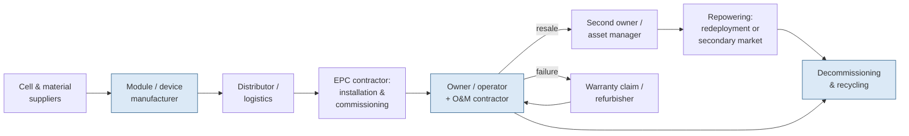
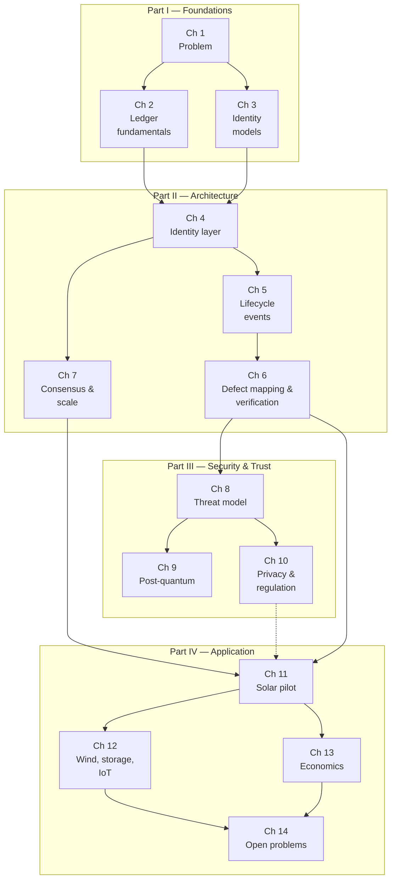

# Part I — Foundations {.unnumbered}

# The Asset Identity Problem in Distributed Energy Systems

## What This Chapter Covers

This chapter establishes the problem the rest of the book solves. It examines why
distributed energy assets — photovoltaic modules, inverters, batteries, and the
smaller components of microgrids — lack a persistent, verifiable identity today; what
that absence costs in counterfeit components, warranty fraud, undocumented
degradation, and opaque secondary markets; and why the conventional remedies
(serial numbers, paper certificates, vendor databases) fail in predictable ways. It
closes with the scope of the book and a map of the chapters.

## 1.1 A Transaction That Should Be Simple

Consider a transaction that happens thousands of times a year. An asset manager is
buying a five-year-old, 10 MW solar plant. The plant contains roughly 25,000
photovoltaic modules, 80 string inverters, and the usual balance of system. The seller
provides the technical file: module datasheets, factory flash-test data keyed to serial
numbers, commissioning reports, and five years of maintenance logs.

The buyer's engineer must now answer three questions:

1. **Are the installed modules the modules described in the file?** The serial numbers
   on the module labels match the flash-test spreadsheet. But labels are printed by
   the manufacturer on ordinary polyester stock, and a serial number is just a string.
   Nothing physically binds the number to the laminate it is stuck to.
2. **Is the recorded history complete?** The maintenance log shows two inverter
   replacements and one lightning event. Whether it shows *every* event that affected
   the plant — every module swap after hail, every string left disconnected for a
   season — depends entirely on the diligence and the incentives of the seller's O&M
   contractor, who compiled the log and who may prefer that it be short.
3. **Does the recorded condition match the physical condition?** The file says the
   modules degrade at 0.45% per year. The only ways to check are statistical (compare
   metered production against irradiance data, which bounds fleet-average behavior but
   says little about individual assets) or physical (sample modules for
   electroluminescence imaging and flash testing, which is expensive and covers perhaps
   1% of the fleet).

Each question is answerable only by trusting documents produced by parties with a
financial interest in the answer. This is the asset identity problem in miniature: the
physical object and its documentary record are joined by nothing stronger than a
printed label and institutional goodwill.

The problem is not that anyone in this transaction is necessarily dishonest. It is
that the *system provides no way to distinguish* the honest case from the dishonest
one, and so every transaction must be priced as if it might be the dishonest case.
Section 1.4 puts numbers on what that costs.

## 1.2 What "Identity" Means for a Physical Asset

Because "identity" carries different meanings in different technical communities, it is
worth fixing terminology at the outset. Throughout this book, an asset identity is a
construct with four properties:

- **Uniqueness.** The identity designates exactly one physical unit, not a model, a
  batch, or a type. Two modules from the same production run have different identities.
- **Persistence.** The identity survives the asset's movements through the supply
  chain, changes of ownership, changes of physical location, and changes in the
  organizations that maintain records about it. It lasts as long as the asset lasts —
  for energy infrastructure, twenty to forty years.
- **Bindability.** There is a technical mechanism by which a party holding the asset
  can verify that this physical unit is the unit the identity designates — and,
  equally important, by which a forged or substituted unit fails that verification.
- **Attributability.** Statements about the asset (test results, maintenance events,
  ownership transfers) can be attached to the identity in a way that records who made
  each statement and prevents the statement from being silently altered or deleted
  afterward.

The four properties are separable, and much of the confusion in current practice comes
from systems that provide some but not all of them. A serial number is unique (usually)
and persistent (if the label survives) but provides no binding and no attributability.
A manufacturer's cloud database provides attributability of a weak sort — the
manufacturer can attach statements — but the statements can be altered by the party
that operates the database, and the database itself may not outlive the manufacturer.
Table 1.1 scores the common mechanisms against the four properties; the systematic
comparison is developed in Chapter 3.

**Table 1.1** Identity mechanisms in current use, scored against the four required
properties. ● = provided, ◐ = partially provided, ○ = not provided.

| Mechanism | Uniqueness | Persistence | Bindability | Attributability |
|---|:-:|:-:|:-:|:-:|
| Printed serial number / barcode | ● | ◐ | ○ | ○ |
| RFID tag | ● | ◐ | ○ | ○ |
| Manufacturer database record | ● | ◐ | ○ | ◐ |
| Paper certificate (flash test, inspection) | ◐ | ◐ | ○ | ◐ |
| Secure element with device key (Ch. 3) | ● | ● | ● | ◐ |
| Ledger-anchored identity with physical fingerprint (Ch. 4–6) | ● | ● | ● | ● |

The last two rows preview the constructive part of the book. A cryptographic key held
in tamper-resistant hardware gives genuine bindability for assets that have electronics
(inverters, battery management systems, smart meters). For assets that are essentially
passive laminates — a solar module has no processor and no power of its own at night —
binding requires a different anchor, and Chapter 6 argues that measurable structural
properties of the device itself, captured as a defect map, can serve that role.

## 1.3 Why Distributed Energy Assets Are a Hard Case

Identity and provenance systems exist in other industries. Aircraft parts carry
back-to-birth traceability under a regulatory regime that makes undocumented parts
nearly unusable. Pharmaceuticals in most major markets carry serialized identifiers
with mandated verification at points in the supply chain. It is reasonable to ask why
distributed energy did not simply inherit one of these regimes. The answer lies in a
combination of characteristics that, taken together, are peculiar to the sector.

**Volume and unit economics.** A utility-scale solar plant contains tens of thousands
to millions of modules, each worth on the order of USD 40–120 at current prices. The
per-unit budget for identity infrastructure is measured in cents, not in the tens of
dollars available for an aircraft part. Any mechanism that requires per-unit manual
handling at verification time fails on cost alone. Chapter 7 treats the consequences
for ledger throughput and fee design.

**Longevity across institutional lifetimes.** Modules are warranted for 25–30 years
and often operate longer. Over that span, the manufacturer may exit the business
(dozens of module manufacturers did so in the consolidations of 2012–2018), the O&M
contractor will change several times, and the plant will typically change owners at
least twice. Any identity record rooted in a single company's database has an expected
lifetime shorter than the asset's. This is the core argument for an *institution-
independent* record, and it is also — because cryptographic algorithms age too — the
argument that forces the post-quantum analysis of Chapter 9.

**Passivity of the highest-volume asset.** The solar module, the most numerous asset
in the fleet, has no compute, no persistent power, and no network interface. It cannot
participate in a challenge–response protocol. Identity schemes designed for IoT
devices, which assume a device key and a live processor, do not transfer directly.
This single fact shapes much of Part II.

**Distribution and churn.** Unlike a transformer, distributed assets move. Modules are
redeployed after repowering; batteries migrate from vehicles to stationary
second-life installations; inverters are swapped under warranty and refurbished. Each
movement is an opportunity for records to be lost and for substitution to occur, and
each is also a transaction whose value depends on the records.

**Fragmented stakeholders with misaligned incentives.** Figure 1.1 sketches the
lifecycle and the parties who touch the asset. No single party observes the whole
lifecycle, and at several transitions the party producing the record has an incentive
to shade it: the seller of a plant benefits from a thin maintenance log, the claimant
in a warranty dispute benefits from an ambiguous installation date, the recycler
benefits from overstating recovered capacity.

**Figure 1.1** Lifecycle of a distributed energy asset and the custody transitions at
which records are created, transferred — and lost.

At each arrow in Figure 1.1, custody of the physical asset and custody of its records
transfer separately, through different channels, under different contracts. The
technical file travels by email and shared folders; the asset travels by truck. Nothing
reconciles the two at the point of transfer, and after two or three transitions the
divergence is usually irreversible.

## 1.4 The Cost of Absent Identity

The consequences of the identity gap fall into four clusters. I present them with the
best available public evidence, flagging where the evidence is anecdotal — one genuine
difficulty of this field is that victims of provenance fraud rarely publish.

### 1.4.1 Counterfeit and Substituted Components

Counterfeiting in photovoltaics takes several forms, in ascending order of
sophistication: relabeled modules (a genuine but lower-grade module carrying the label
of a premium product), "ghost shift" production (units made on genuine tooling outside
contracted production runs, escaping the manufacturer's quality system), and outright
imitation. Industry testing laboratories have reported recurring cases of modules whose
measured power fell 5–15% below labeled nameplate in circumstances suggesting
deliberate misgrading rather than degradation. For inverters and, more acutely, for
lithium battery cells, counterfeit or misgraded units carry safety consequences beyond
the financial loss, since protection circuits and cell chemistry may not match the
certification the label claims.

The structural point is that counterfeiting is an *identity* attack before it is a
quality problem: every counterfeit succeeds by attaching a false identity to a physical
object. Anti-counterfeiting measures that improve the label (holograms, QR codes)
raise the forger's cost modestly but do not change the architecture, because the label
remains a bearer token that anyone can copy and no one can cryptographically check
against the object. Chapter 8 develops the attacker's options systematically.

### 1.4.2 Warranty Fraud and Warranty Failure

Module warranties run 25–30 years on power output. A warranty claim requires
establishing (a) that the claimed module is a genuine unit sold by the manufacturer,
(b) when it entered service, and (c) that its degradation exceeds the warranted curve.
All three facts depend on records held by parties to the dispute. Manufacturers report
claims against modules they cannot match to shipment records; owners report claims
denied on documentary technicalities — an installation date that cannot be proven, a
serial number transcribed incorrectly at commissioning a decade earlier. Both failure
modes are symptoms of the same absence: there is no record of the module's entry into
service that *both* parties accepted at the time and *neither* party can now alter.

The warranty problem also has an actuarial face. Because manufacturers cannot verify
field conditions, they price warranties for adversarial claiming behavior, and because
owners cannot verify manufacturer solvency decades out, third-party warranty insurance
has emerged — priced, again, for deep uncertainty about asset histories.

### 1.4.3 Undocumented Degradation and the Limits of Fleet Statistics

Degradation of fielded modules is real, gradual, and — at the individual-asset level —
largely invisible. Long-term studies of fielded systems place median degradation near
0.5% per year, but the distribution has a heavy tail: modules affected by
potential-induced degradation, cell cracking after transport or hail, or corrosion can
lose several percent per year while the plant's aggregate meter, buffered by thousands
of healthy neighbors, drifts almost imperceptibly. By the time fleet-level statistics
reveal a problem, the affected modules have often been in place for years, the
transport or installation event that caused the damage is undocumented, and liability
is unassignable. The result is a familiar dispute triangle among manufacturer,
transporter, and installer, resolved by negotiation rather than evidence.

Condition records exist — electroluminescence images from commissioning, IR
thermography from drone inspections, I–V curve traces from maintenance — but they are
scattered across contractors' file systems, keyed to serial numbers of uncertain
reliability, and mutable by whoever holds them. The information needed to assign
liability is frequently *collected* and then effectively *lost*.

### 1.4.4 Opaque Secondary Markets

A secondary market in used modules, inverters, and batteries exists and is growing,
driven by repowering of aging plants and by the cost advantage of used equipment in
price-sensitive markets. It operates with striking informational poverty: used modules
are typically sold by the pallet, priced by nameplate watts and visual grade, with no
verifiable history. Buyers rationally discount for the worst case; sellers of genuinely
good equipment cannot credibly signal quality; and the market exhibits the classic
adverse-selection dynamic in which bad assets drive out good. The same dynamic, with
higher stakes, governs second-life batteries, where state-of-health claims are
unverifiable without invasive testing.

Table 1.2 summarizes the four clusters and locates each in the chapters that address
it.

**Table 1.2** Consequences of the identity gap and where this book addresses them.

| Consequence | Underlying identity failure | Bears the cost | Addressed in |
|---|---|---|---|
| Counterfeit / substituted components | No binding of identity to physical unit | Buyers, insurers, honest manufacturers | Ch. 3, 6, 8 |
| Warranty fraud and wrongful denial | No mutually accepted, immutable service record | Manufacturers and owners symmetrically | Ch. 5, 6, 13 |
| Undocumented degradation | Condition data scattered, mutable, unlinked | Owners, then everyone via disputes | Ch. 5, 6, 11 |
| Opaque secondary markets | No verifiable asset history at point of sale | Sellers of good assets; market efficiency | Ch. 6, 12, 13 |

## 1.5 Why the Obvious Fixes Are Not Sufficient

Three remedies are regularly proposed, and each fails in an instructive way.

**"Better labels."** Serialized QR codes, holographic stickers, and RFID tags improve
convenience, not trust. All are bearer artifacts: possession of the label is the whole
proof, so copying the label defeats the scheme. Labels also fail persistence —
adhesives and polymers weather over decades — and their failure mode is silent.

**"A central registry."** A single authoritative database — run by a manufacturer, an
industry consortium, or a regulator — solves uniqueness and could solve
attributability, but concentrates exactly the risks the sector's history warns
against: the registrar can alter records, can fail commercially, can charge
monopoly rents for access, and becomes a single point of attack. Cross-border assets
raise the further question of *whose* regulator. The aviation regime works because a
powerful regulator compels participation; distributed energy has no equivalent, and
proposals that begin "first, create a global authority" are not engineering.

**"Trust the manufacturer's cloud."** The status quo for inverters and batteries, whose
telemetry already flows to vendor platforms. This provides real operational value but
inverts the trust relationship the market needs: the party whose warranty exposure
depends on the record is the party operating the record. It also ties record lifetime
to vendor lifetime, and creates data silos exactly where the market needs portability
— a plant with three inverter vendors has three incompatible histories.

The pattern across all three is the same. Each fix strengthens one of the four
properties of Section 1.2 while leaving another untouched. What the problem demands is
an architecture in which *no single party can rewrite history* (attributability with
immutability), *records outlive institutions* (persistence), and *the record is bound
to the physical object* (bindability). The first two requirements point toward
replicated, append-only records maintained across organizational boundaries — which
is, soberly stated, what a distributed ledger is. The third requirement is not solved
by any ledger and demands the physical-binding techniques of Chapters 3 and 6. Neither
half works without the other, and much of the disappointment in early
"blockchain-for-supply-chain" projects traces to deploying the first half alone:
an immutable record of unverified claims is an expensive way to preserve fiction.
This observation — sometimes called the *garbage-in permanence* problem, since a
ledger preserves false entries exactly as faithfully as true ones — recurs throughout
the book and drives the design of the sensing-to-ledger interface in Chapters 4 and 6.

## 1.6 Scope, Assumptions, and Non-Goals

**In scope.** Identity, lifecycle traceability, and integrity verification for
distributed energy hardware: PV modules (the central worked example), inverters,
batteries and battery systems, and by extension wind-turbine components and other
renewable-infrastructure hardware (Chapter 12). The treatment runs from manufacture
through decommissioning and recycling, and covers the architecture, the security
analysis, the regulatory interfaces, and the economics.

**Assumptions about the reader.** Graduate-level engineering background or equivalent
practice. No blockchain background is assumed (Chapter 2 supplies what is needed).
No quantum-sensing background is assumed (Chapter 6 develops it from the application
side). Familiarity with photovoltaic system engineering helps but is not required;
domain terms are defined at first use and collected in the Glossary.

**Non-goals.** The book does not treat energy trading, tokenized electricity, or
peer-to-peer markets except where they intersect asset identity. It does not advocate
a particular ledger platform; examples use a platform-neutral event model, and the
code in Appendix A is illustrative. It does not offer legal advice; Chapter 10
discusses regulatory interfaces at the level of engineering requirements. And it does
not assume distributed ledgers are always the right answer — Section 4.6 gives the
conditions under which they are not.

## 1.7 Structure of the Book

Figure 1.2 shows the dependency structure of the chapters; the parts are summarized
below.

**Figure 1.2** Chapter dependency map. Solid arrows are strong prerequisites; the
dashed arrow indicates helpful but optional background.

**Part I (Chapters 1–3)** establishes the problem, the minimum necessary distributed-
ledger background, and the adaptation of digital-identity models (digital twins, DIDs,
verifiable credentials, hardware roots of trust) to physical infrastructure.

**Part II (Chapters 4–7)** is the architectural core: the design of the identity layer
including on-chain/off-chain partitioning and oracle design (Chapter 4); the formal
lifecycle event schema from manufacture to decommissioning (Chapter 5); quantum defect
mapping and the integrity-verification workflow built on it (Chapter 6, the anchor
chapter); and consensus and scalability analysis for fleets of thousands to millions
of devices (Chapter 7).

**Part III (Chapters 8–10)** analyzes what can go wrong and what surrounds the system:
the threat model of spoofing, cloning, and oracle manipulation (Chapter 8);
post-quantum cryptographic planning for records that must remain verifiable for
decades (Chapter 9); and privacy, data governance, and regulatory interfaces
(Chapter 10).

**Part IV (Chapters 11–14)** applies the framework: a worked solar pilot architecture
(Chapter 11); generalization to wind, storage, and broader renewable IoT (Chapter 12);
the economics of markets enabled by verifiable history (Chapter 13); and the research
agenda (Chapter 14).

## 1.8 Chapter Summary

Distributed energy assets lack identity in the specific, four-part sense defined here:
uniqueness, persistence, binding to the physical unit, and tamper-evident
attributability of statements. The gap is expensive — in counterfeits, warranty
disputes, invisible degradation, and adverse selection in secondary markets — and it
is not closed by better labels, central registries, or vendor clouds, each of which
strengthens one property while neglecting others. The sector's peculiar combination of
enormous unit volumes, thin unit economics, passive devices, multi-decade lifetimes,
and fragmented custody defines the design constraints for everything that follows. The
constructive claim of this book is that an append-only shared ledger, joined to a
physical binding mechanism rooted in measurable properties of the device, can provide
all four properties at costs compatible with the sector's economics — and the burden
of the remaining chapters is to substantiate that claim in architecture, security
analysis, and deployment detail.

## References and Further Reading

1. Jordan, D. C., and S. R. Kurtz. "Photovoltaic Degradation Rates — An Analytical
   Review." *Progress in Photovoltaics: Research and Applications* 21, no. 1 (2013):
   12–29.
2. Jordan, D. C., et al. "Compendium of Photovoltaic Degradation Rates." *Progress in
   Photovoltaics: Research and Applications* 24, no. 7 (2016): 978–989.
3. Akerlof, G. A. "The Market for 'Lemons': Quality Uncertainty and the Market
   Mechanism." *Quarterly Journal of Economics* 84, no. 3 (1970): 488–500.
4. International Energy Agency Photovoltaic Power Systems Programme (IEA-PVPS),
   Task 13. *Review of Failures of Photovoltaic Modules.* Report IEA-PVPS T13-01:2014.
5. International Electrotechnical Commission. *IEC 61215: Terrestrial Photovoltaic
   (PV) Modules — Design Qualification and Type Approval.* Geneva: IEC.
6. Regulation (EU) 2023/1542 of the European Parliament and of the Council concerning
   batteries and waste batteries (the EU Battery Regulation, establishing the battery
   passport). *Official Journal of the European Union*, 2023.
7. U.S. Federal Aviation Administration. Advisory Circular AC 00-56B, *Voluntary
   Industry Distributor Accreditation Program* (parts traceability context).
8. [AUTHOR'S PRIOR WORK AND PATENT APPLICATION — CITATION TO BE SUPPLIED.]

\newpage
