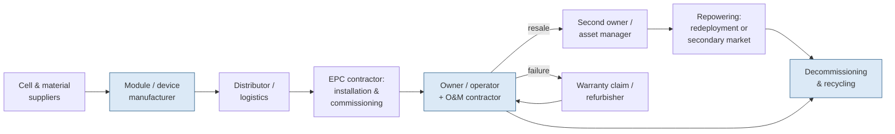
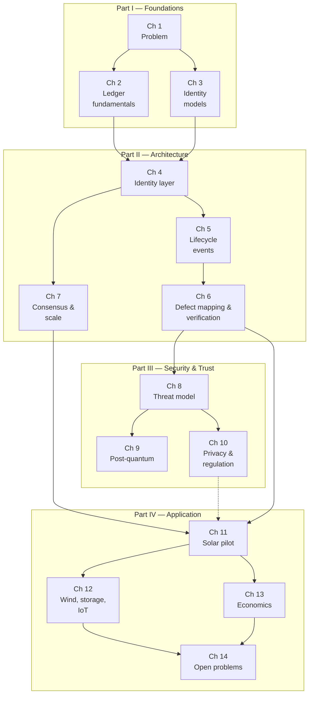

# Part I — Foundations {.unnumbered}

# The Asset Identity Problem in Distributed Energy Systems

## What This Chapter Covers

This chapter establishes the problem the rest of the book solves. It examines why
distributed energy assets — photovoltaic modules, inverters, batteries, and the
smaller components of microgrids — lack a persistent, verifiable identity today; what
that absence costs in counterfeit components, warranty fraud, undocumented
degradation, and opaque secondary markets; and why the conventional remedies
(serial numbers, paper certificates, vendor databases) fail in predictable ways. It
closes with the scope of the book and a map of the chapters.

## 1.1 A Transaction That Should Be Simple

Consider a transaction that happens thousands of times a year. An asset manager is
buying a five-year-old, 10 MW solar plant. The plant contains roughly 25,000
photovoltaic modules, 80 string inverters, and the usual balance of system. The seller
provides the technical file: module datasheets, factory flash-test data keyed to serial
numbers, commissioning reports, and five years of maintenance logs.

The buyer's engineer must now answer three questions:

1. **Are the installed modules the modules described in the file?** The serial numbers
   on the module labels match the flash-test spreadsheet. But labels are printed by
   the manufacturer on ordinary polyester stock, and a serial number is just a string.
   Nothing physically binds the number to the laminate it is stuck to.
2. **Is the recorded history complete?** The maintenance log shows two inverter
   replacements and one lightning event. Whether it shows *every* event that affected
   the plant — every module swap after hail, every string left disconnected for a
   season — depends entirely on the diligence and the incentives of the seller's O&M
   contractor, who compiled the log and who may prefer that it be short.
3. **Does the recorded condition match the physical condition?** The file says the
   modules degrade at 0.45% per year. The only ways to check are statistical (compare
   metered production against irradiance data, which bounds fleet-average behavior but
   says little about individual assets) or physical (sample modules for
   electroluminescence imaging and flash testing, which is expensive and covers perhaps
   1% of the fleet).

Each question is answerable only by trusting documents produced by parties with a
financial interest in the answer. This is the asset identity problem in miniature: the
physical object and its documentary record are joined by nothing stronger than a
printed label and institutional goodwill.

The problem is not that anyone in this transaction is necessarily dishonest. It is
that the *system provides no way to distinguish* the honest case from the dishonest
one, and so every transaction must be priced as if it might be the dishonest case.
Section 1.4 puts numbers on what that costs.

It is worth following this transaction to its conclusion, because the ending is as
instructive as the setup. In the case that motivated this book's preface, the buyer
did what buyers do: commissioned an independent engineer, paid for a sampling
campaign — flash tests on 200 modules pulled from racking at a cost of roughly
USD 150 per module once labor, logistics, and lost production were counted — and
negotiated a price reduction calibrated not to any measured defect but to the
*residual uncertainty* the sampling could not close. The seller, who by every
indication was selling exactly what the file described, absorbed a seven-figure
discount for the crime of being indistinguishable from a fraud. The engineer's
report, meanwhile, entered the same documentary limbo as everything else: a PDF,
signed but not cryptographically, keyed to serial numbers transcribed by hand on a
windy site, destined to be one more attachment in the next transaction's data room.
The diligence did not create durable knowledge; it created a snapshot that began
depreciating the day it was taken.

A second vignette shows the same failure at the opposite end of the size spectrum.
A commercial-and-industrial solar aggregator holds two thousand rooftop systems
across three hundred municipalities, acquired in a dozen portfolio purchases from
originators who have since moved on. The aggregator's asset register — assembled
from originators' spreadsheets of varying vintage — disagrees with field reality
in ways that surface only expensively: crews dispatched with the wrong replacement
part because the register lists the inverter model that was *quoted*, not the one
that was *installed*; warranty claims rejected because the commissioning date on
file is the date the spreadsheet row was created; three sites where the modules on
the roof are a different brand from every document in the file, with no way to
determine whether the swap happened before acquisition, during a storm repair, or
in an insurance fraud. The aggregator's problem is not fleet performance, which is
fine. It is that the marginal cost of *knowing what it owns* scales with every
acquisition, and no amount of internal database hygiene can repair records that
were never bound to the hardware in the first place.

The two vignettes bracket the problem's range — a single large plant and a
scattered small-system fleet — and they share a structure worth making explicit.
In both cases, information about the assets was generated repeatedly, by competent
parties, at real expense. In both cases that information failed to *accumulate*:
each generation of records was held by a different party, in a different format,
with no mechanism binding it to the physical unit or protecting it from silent
revision, so each new transaction started the epistemic clock at zero. The economic
literature has a name for markets like this, and Section 1.4.4 will use it; the
engineering observation to carry forward is simpler. **The sector does not have a
measurement problem — it measures constantly. It has a memory problem.**

## 1.2 What "Identity" Means for a Physical Asset

Because "identity" carries different meanings in different technical communities, it is
worth fixing terminology at the outset. Throughout this book, an asset identity is a
construct with four properties:

- **Uniqueness.** The identity designates exactly one physical unit, not a model, a
  batch, or a type. Two modules from the same production run have different identities.
- **Persistence.** The identity survives the asset's movements through the supply
  chain, changes of ownership, changes of physical location, and changes in the
  organizations that maintain records about it. It lasts as long as the asset lasts —
  for energy infrastructure, twenty to forty years.
- **Bindability.** There is a technical mechanism by which a party holding the asset
  can verify that this physical unit is the unit the identity designates — and,
  equally important, by which a forged or substituted unit fails that verification.
- **Attributability.** Statements about the asset (test results, maintenance events,
  ownership transfers) can be attached to the identity in a way that records who made
  each statement and prevents the statement from being silently altered or deleted
  afterward.

The four properties are separable, and much of the confusion in current practice comes
from systems that provide some but not all of them. A serial number is unique (usually)
and persistent (if the label survives) but provides no binding and no attributability.
A manufacturer's cloud database provides attributability of a weak sort — the
manufacturer can attach statements — but the statements can be altered by the party
that operates the database, and the database itself may not outlive the manufacturer.
Table 1.1 scores the common mechanisms against the four properties; the systematic
comparison is developed in Chapter 3.

**Table 1.1** Identity mechanisms in current use, scored against the four required
properties. ● = provided, ◐ = partially provided, ○ = not provided.

| Mechanism | Uniqueness | Persistence | Bindability | Attributability |
|---|:-:|:-:|:-:|:-:|
| Printed serial number / barcode | ● | ◐ | ○ | ○ |
| RFID tag | ● | ◐ | ○ | ○ |
| Manufacturer database record | ● | ◐ | ○ | ◐ |
| Paper certificate (flash test, inspection) | ◐ | ◐ | ○ | ◐ |
| Secure element with device key (Ch. 3) | ● | ● | ● | ◐ |
| Ledger-anchored identity with physical fingerprint (Ch. 4–6) | ● | ● | ● | ● |

The last two rows preview the constructive part of the book. A cryptographic key held
in tamper-resistant hardware gives genuine bindability for assets that have electronics
(inverters, battery management systems, smart meters). For assets that are essentially
passive laminates — a solar module has no processor and no power of its own at night —
binding requires a different anchor, and Chapter 6 argues that measurable structural
properties of the device itself, captured as a defect map, can serve that role.

### 1.2.1 Identity, Identification, and Authentication

Three words are used interchangeably in industry conversation and must not be
interchangeable in this book. *Identity* is the designation itself — the durable
association between an identifier and exactly one physical unit, with the four
properties above. *Identification* is the act of discovering which identity an
object claims: reading the label, scanning the QR code, querying the register. It
answers "which record should I look at?" and requires no trust at all — a forged
label identifies perfectly well; it merely identifies falsely. *Authentication* is
the act of verifying that the claim is true: that this object is the unit the
identity designates. The entire fraud economy described in Section 1.4 lives in the
gap between identification and authentication, because the sector's current
mechanisms perform the first flawlessly and the second not at all. A barcode
scanner in a warehouse identifies ten thousand modules an hour; nothing in the
building can authenticate one of them. When this book says "binding," it means the
mechanism that makes authentication possible; when it says "verification," it means
the act of performing it. The distinction sounds pedantic until one notices that
nearly every commercial "asset tracking" product on the market — and more than a
few published blockchain-for-solar proposals — quietly delivers identification
while advertising authentication.

### 1.2.2 The Unit-of-Identity Question

Deciding *what* gets an identity is less obvious than it appears, and the choice
propagates through every later chapter. Candidate units for a photovoltaic
deployment, from coarse to fine: the plant, the block or string, the pallet or
shipping crate, the module, the cell, and — for completeness — the wafer and ingot
from which the cell was cut. Each level has a constituency. Logistics wants the
pallet, because that is what moves. Performance engineering wants the string,
because that is what the monitoring system resolves. Warranty and resale want the
module, because that is the unit of commerce and of failure. Materials traceability
— the forced-labor and recycled-content questions that Section 1.4.5 introduces —
wants the ingot, because that is where provenance of polysilicon lives.

This book takes the module (and, generally, the *unit of commerce*: the inverter,
the battery pack, the wind-turbine blade) as the primary identity subject, for a
reason that will recur: identity should attach at the level where custody,
liability, and value change hands, because that is where disputes arise and
therefore where evidence is needed. Coarser units (pallet, string) get *transient*
groupings — a pallet is an event in a module's life, not an identity of its own —
and finer units (cell, wafer) get *compositional* references: a module's
registration records which cell batch and wafer lots went into it, without those
components carrying independent lifecycle records. The compositional pattern
becomes load-bearing in Chapter 12, where battery packs force the question of
whether cells deserve identities of their own (they do; the problem is that no
binding mechanism yet exists at acceptable cost, and Section 12.2 treats the gap
honestly). The general rule this book proposes: **grant full identity at the
custody-and-liability level; record composition downward by reference; record
aggregation upward as events.** Getting this boundary wrong in either direction is
expensive — identities too coarse cannot support unit-level warranty or resale, and
identities too fine multiply enrollment costs by an order of magnitude while
producing records no transaction ever consults.

## 1.3 Why Distributed Energy Assets Are a Hard Case

Identity and provenance systems exist in other industries. Aircraft parts carry
back-to-birth traceability under a regulatory regime that makes undocumented parts
nearly unusable. Pharmaceuticals in most major markets carry serialized identifiers
with mandated verification at points in the supply chain. It is reasonable to ask why
distributed energy did not simply inherit one of these regimes. The answer lies in a
combination of characteristics that, taken together, are peculiar to the sector.

**Volume and unit economics.** A utility-scale solar plant contains tens of thousands
to millions of modules, each worth on the order of USD 40–120 at current prices. The
per-unit budget for identity infrastructure is measured in cents, not in the tens of
dollars available for an aircraft part. Any mechanism that requires per-unit manual
handling at verification time fails on cost alone. Chapter 7 treats the consequences
for ledger throughput and fee design.

**Longevity across institutional lifetimes.** Modules are warranted for 25–30 years
and often operate longer. Over that span, the manufacturer may exit the business
(dozens of module manufacturers did so in the consolidations of 2012–2018), the O&M
contractor will change several times, and the plant will typically change owners at
least twice. Any identity record rooted in a single company's database has an expected
lifetime shorter than the asset's. This is the core argument for an *institution-
independent* record, and it is also — because cryptographic algorithms age too — the
argument that forces the post-quantum analysis of Chapter 9.

**Passivity of the highest-volume asset.** The solar module, the most numerous asset
in the fleet, has no compute, no persistent power, and no network interface. It cannot
participate in a challenge–response protocol. Identity schemes designed for IoT
devices, which assume a device key and a live processor, do not transfer directly.
This single fact shapes much of Part II.

**Distribution and churn.** Unlike a transformer, distributed assets move. Modules are
redeployed after repowering; batteries migrate from vehicles to stationary
second-life installations; inverters are swapped under warranty and refurbished. Each
movement is an opportunity for records to be lost and for substitution to occur, and
each is also a transaction whose value depends on the records.

**Fragmented stakeholders with misaligned incentives.** Figure 1.1 sketches the
lifecycle and the parties who touch the asset. No single party observes the whole
lifecycle, and at several transitions the party producing the record has an incentive
to shade it: the seller of a plant benefits from a thin maintenance log, the claimant
in a warranty dispute benefits from an ambiguous installation date, the recycler
benefits from overstating recovered capacity.

**Figure 1.1** Lifecycle of a distributed energy asset and the custody transitions at
which records are created, transferred — and lost.

At each arrow in Figure 1.1, custody of the physical asset and custody of its records
transfer separately, through different channels, under different contracts. The
technical file travels by email and shared folders; the asset travels by truck. Nothing
reconciles the two at the point of transfer, and after two or three transitions the
divergence is usually irreversible.

### 1.3.1 What Other Industries Teach, and Why Their Regimes Do Not Transplant

The comparison with adjacent industries deserves more than the passing mention
above, because each mature traceability regime embodies a solution to *one* of the
distributed-energy constraints — and fails on the others in a way that maps the
design space. Table 1.3 assembles the comparison.

**Table 1.3** Provenance regimes in adjacent industries, and where each fails to
transplant to distributed energy.

| Regime | What it protects | Per-unit value | Enforcement mechanism | Why it does not transplant |
|---|---|---|---|---|
| Aviation parts (back-to-birth, FAA/EASA) | Life-limited rotables | USD 10³–10⁶ | Regulator can ground aircraft; undocumented part is unusable | Regulatory monopoly on airworthiness has no energy analog; paperwork cost per part exceeds a module's whole value |
| Pharmaceutical serialization (DSCSA, EU FMD) | Saleable drug units | USD 10⁰–10³ | Dispensing checkpoint verifies against registry; criminal law | Verification happens at a mandatory chokepoint (pharmacy); energy assets have no chokepoint after commissioning |
| Automotive VIN | Vehicles | USD 10⁴–10⁵ | Title/registration law; insurers and police query one registry | One unit per owner, state-run title registries, physical die-stamping into structure — none scale to 10⁸ passive laminates |
| Luxury goods authentication | Watches, handbags | USD 10³–10⁵ | Brand-controlled inspection; buyer pays for authentication | Authentication is artisanal and per-item; works only because margin per item is enormous |
| Semiconductor supply chain (DoD/DFARS trusted foundry) | Military ICs | USD 10¹–10⁴ | Contractual flow-down; accredited supplier lists | Closed, small-volume buyer community; the open energy market has no single buyer with specification power |

Read down the last column and the pattern is uniform: every successful regime rests
on either a *regulatory chokepoint* (aviation, pharma, automotive), a *value density*
that funds per-unit human attention (luxury, aerospace), or a *closed buyer
community* that can impose terms (defense). Distributed energy has none of the
three. Its assets clear customs like commodity electronics, pass no mandatory
verification gate after grid connection, carry unit values that forbid artisanal
authentication, and sell into the most fragmented buyer base in industrial
equipment. The conclusion is not that traceability is impossible — it is that the
sector needs a regime whose *marginal verification cost approaches zero* and whose
*enforcement is economic rather than regulatory*: cheap enough to run without a
chokepoint, and self-interested enough to run without a mandate. Those two
requirements, which Chapter 13 will develop as adoption economics, are as binding
on the architecture as any cryptographic property, and the reader should hold the
book's proposals to them throughout.

One more transplant candidate deserves individual dismissal because it is so
frequently proposed: the pharmaceutical model's "verify at dispense" checkpoint,
reimagined as "verify at interconnection." Grid operators do inspect systems at
commissioning, and Chapter 10 will argue they are natural consumers of verifiable
records. But interconnection happens *once*, at the start of a thirty-year life;
the fraud this book documents — warranty claims, resale misrepresentation,
condition falsification — happens downstream, where no checkpoint exists or could
be created without a per-visit cost the sector cannot bear. A single mandatory
gate at the head of a long, unattended lifecycle filters counterfeits at exactly
one moment and does nothing thereafter. The energy sector's verification regime
must instead be *on-demand and continuous-capable*: any party, at any custody
transition, at a cost proportionate to the transaction. That requirement drives
directly to the tiered-assurance design of Chapters 3 and 6.

## 1.4 The Cost of Absent Identity

The consequences of the identity gap fall into four clusters. I present them with the
best available public evidence, flagging where the evidence is anecdotal — one genuine
difficulty of this field is that victims of provenance fraud rarely publish.

### 1.4.1 Counterfeit and Substituted Components

Counterfeiting in photovoltaics takes several forms, in ascending order of
sophistication: relabeled modules (a genuine but lower-grade module carrying the label
of a premium product), "ghost shift" production (units made on genuine tooling outside
contracted production runs, escaping the manufacturer's quality system), and outright
imitation. Industry testing laboratories have reported recurring cases of modules whose
measured power fell 5–15% below labeled nameplate in circumstances suggesting
deliberate misgrading rather than degradation. For inverters and, more acutely, for
lithium battery cells, counterfeit or misgraded units carry safety consequences beyond
the financial loss, since protection circuits and cell chemistry may not match the
certification the label claims.

The economics of each form deserve a moment, because they predict where fraud
concentrates. Relabeling is nearly free — the forger's cost is a label printer and
access to a genuine product's artwork — and its profit is the grade spread: on a
premium module line the difference between the top power bin and the bottom, or
between the branded product and a white-label equivalent, runs 5–15% of unit price.
Multiplied across a container of 700 modules, a weekend's relabeling yields
thousands of dollars at negligible risk, because detection requires flash-testing
against factory records the buyer cannot access. Ghost-shift production is more
capital-intensive — it requires control of, or collusion within, a genuine
production line — but correspondingly harder to detect, because the units are
physically authentic in every respect except their absence from the quality system:
they skipped final inspection, their nominal ratings were never verified, and any
latent defect from that day's process excursion ships unfiltered. Outright imitation,
the least common form for modules (the capital cost of a lamination line is a real
barrier), is the dominant concern for the balance of system: junction-box diodes,
DC connectors, and fuses are small, high-margin, safety-critical, and trivially
copied — and mismatched DC connectors remain one of the sector's leading identified
fire-origin categories, a fact that turns connector counterfeiting from a warranty
nuisance into a life-safety issue.

The structural point is that counterfeiting is an *identity* attack before it is a
quality problem: every counterfeit succeeds by attaching a false identity to a physical
object. Anti-counterfeiting measures that improve the label (holograms, QR codes)
raise the forger's cost modestly but do not change the architecture, because the label
remains a bearer token that anyone can copy and no one can cryptographically check
against the object. The hologram arms race in consumer goods ran for three decades
and settled the question empirically: label sophistication buys months, not
security, because the label and the object remain separable artifacts. Chapter 8
develops the attacker's options systematically.

### 1.4.2 Warranty Fraud and Warranty Failure

Module warranties run 25–30 years on power output. A warranty claim requires
establishing (a) that the claimed module is a genuine unit sold by the manufacturer,
(b) when it entered service, and (c) that its degradation exceeds the warranted curve.
All three facts depend on records held by parties to the dispute. Manufacturers report
claims against modules they cannot match to shipment records; owners report claims
denied on documentary technicalities — an installation date that cannot be proven, a
serial number transcribed incorrectly at commissioning a decade earlier. Both failure
modes are symptoms of the same absence: there is no record of the module's entry into
service that *both* parties accepted at the time and *neither* party can now alter.

A worked example makes the symmetry concrete. Consider a 25-year linear performance
warranty guaranteeing 84.8% of nameplate at year 25 — a standard curve. A claim in
year 12 requires showing measured power below the year-12 line, roughly 92% of
nameplate. The measurement itself is the easy part; the dispute is over the
baseline. The manufacturer's flash test says the module left the factory at 102% of
nameplate (positive-tolerance binning was standard); the owner has no independent
record of that number, cannot verify that the flash report in the file corresponds
to this physical module, and cannot prove the module was not damaged in transport
or installation — the two lifecycle stages the warranty excludes. The manufacturer,
symmetrically, cannot prove that it *was*. Every fact material to the claim is
contested, not because the facts are complex but because no record of them was
fixed at a time when neither party yet knew which side of a future dispute it
would occupy. That last clause is the analytical heart of the warranty problem, and
it generalizes: **records created after a dispute exists are advocacy; records
fixed before a dispute exists are evidence.** The architecture of Part II is, from
one angle, simply a machine for fixing records while they are still evidence.

The warranty problem also has an actuarial face. Because manufacturers cannot verify
field conditions, they price warranties for adversarial claiming behavior, and because
owners cannot verify manufacturer solvency decades out, third-party warranty insurance
has emerged — priced, again, for deep uncertainty about asset histories. The
industry's own consolidation sharpens the point: a large fraction of the modules
installed during the 2010–2015 boom carry warranties from entities that no longer
exist, exist in name only after acquisitions, or dispute successor liability. A
warranty is a thirty-year promise from an industry with a five-year corporate
half-life, recorded in a database the promisor controls. Stated that way, the
actuarial discount is not cynicism; it is arithmetic.

### 1.4.3 Undocumented Degradation and the Limits of Fleet Statistics

Degradation of fielded modules is real, gradual, and — at the individual-asset level —
largely invisible. Long-term studies of fielded systems place median degradation near
0.5% per year, but the distribution has a heavy tail: modules affected by
potential-induced degradation, cell cracking after transport or hail, or corrosion can
lose several percent per year while the plant's aggregate meter, buffered by thousands
of healthy neighbors, drifts almost imperceptibly. By the time fleet-level statistics
reveal a problem, the affected modules have often been in place for years, the
transport or installation event that caused the damage is undocumented, and liability
is unassignable. The result is a familiar dispute triangle among manufacturer,
transporter, and installer, resolved by negotiation rather than evidence.

The degradation mechanisms themselves are worth a paragraph, because their
diversity is what defeats fleet-level statistics. Potential-induced degradation
(PID) develops when a module's position in the string places its cells at high
negative potential relative to the grounded frame, driving sodium migration into
the cell; it is position-dependent, climate-sensitive, sometimes partially
reversible, and invisible without cell-level measurement. Cell micro-cracks —
initiated by a dropped pallet corner, an over-torqued clamp, a technician's knee,
or hail — may cost nothing at first, then isolate cell regions as thermal cycling
works the crack faces apart, producing a delayed power loss that surfaces years
after the causal event and long after liability for it can be assigned.
Light-induced degradation and its light-and-elevated-temperature cousin (LID and
LeTID) are chemistry-dependent, front-loaded, and vary by production batch —
meaning two visually identical modules from the same order can sit percentage
points apart within the first year for reasons fixed in the factory. Corrosion,
delamination, backsheet embrittlement, and solder-bond fatigue each add their own
signature and their own timetable. The common feature is that *every one of these
mechanisms is diagnosable at the individual-module level with instruments the
industry already owns* — EL cameras see cracks and PID, IR sees bypassed
substrings and resistive joints, I–V traces see series resistance growth — and
*none of them is reliably attributable after the fact*, because the diagnostic
snapshot that would establish when the damage appeared was either never taken,
taken but lost, or taken but disputable.

Condition records exist — electroluminescence images from commissioning, IR
thermography from drone inspections, I–V curve traces from maintenance — but they are
scattered across contractors' file systems, keyed to serial numbers of uncertain
reliability, and mutable by whoever holds them. The information needed to assign
liability is frequently *collected* and then effectively *lost*. One number
summarizes the waste: a commissioning-stage EL campaign on a utility plant produces
terabytes of images whose evidentiary half-life, in current practice, is
approximately the duration of the EPC's document-retention policy — after which
the plant's most complete condition baseline exists nowhere at all.

### 1.4.4 Opaque Secondary Markets

A secondary market in used modules, inverters, and batteries exists and is growing,
driven by repowering of aging plants and by the cost advantage of used equipment in
price-sensitive markets. It operates with striking informational poverty: used modules
are typically sold by the pallet, priced by nameplate watts and visual grade, with no
verifiable history. Buyers rationally discount for the worst case; sellers of genuinely
good equipment cannot credibly signal quality; and the market exhibits the classic
adverse-selection dynamic in which bad assets drive out good. The same dynamic, with
higher stakes, governs second-life batteries, where state-of-health claims are
unverifiable without invasive testing.

The mechanism deserves its formal name because Chapter 13 will build on it. In
Akerlof's canonical analysis, when sellers know quality and buyers cannot verify
it, the market price converges toward the buyer's expectation of *average* quality;
sellers of above-average goods, unable to command a premium, withdraw, which lowers
the average, which lowers the price, in a spiral that can extinguish the market
entirely. The used-module market exhibits the dynamic in nearly textbook form.
Repowering projects generate large volumes of mid-life modules with excellent
documented histories — held by exactly the sophisticated owners most capable of
documentation — yet those modules clear at prices barely distinguishable from
storm-salvage and distressed-liquidation stock, because the pallet is the pricing
unit and the pallet is informationally opaque. Brokers report, and the thin
published data supports, that provenance-documented lots command premiums when the
documentation is credible — the problem is that credibility currently requires the
buyer to trust the seller's paperwork, which is precisely what a lemons market
cannot sustain. The result is measurable deadweight: functioning modules with
fifteen warranted years remaining are shredded for materials recovery worth a few
dollars because their *history* cannot be sold with them, while price-sensitive
buyers in secondary markets purchase undocumented modules that fail early and
poison the market's reputation further. Both failure modes destroy real value, and
both are information failures, not hardware failures.

The second-life battery variant raises the stakes. A used EV pack's residual value
is dominated by its state of health, which is invisible to inspection; it depends
on cycle count, depth-of-discharge history, thermal history, and charging behavior
— none of which the seller can prove and all of which the seller knows better than
the buyer. Here the lemons discount collides with a safety floor: a misrepresented
pack is not merely a bad purchase but a thermal-runaway risk in whatever
second-life installation receives it. The EU's battery passport regulation
(Chapter 10, Chapter 12) is, among other things, a legislature's response to
exactly this market failure — a mandated information layer where the market could
not generate a credible voluntary one.

Table 1.2 summarizes the four clusters and locates each in the chapters that address
it.

**Table 1.2** Consequences of the identity gap and where this book addresses them.

| Consequence | Underlying identity failure | Bears the cost | Addressed in |
|---|---|---|---|
| Counterfeit / substituted components | No binding of identity to physical unit | Buyers, insurers, honest manufacturers | Ch. 3, 6, 8 |
| Warranty fraud and wrongful denial | No mutually accepted, immutable service record | Manufacturers and owners symmetrically | Ch. 5, 6, 13 |
| Undocumented degradation | Condition data scattered, mutable, unlinked | Owners, then everyone via disputes | Ch. 5, 6, 11 |
| Opaque secondary markets | No verifiable asset history at point of sale | Sellers of good assets; market efficiency | Ch. 6, 12, 13 |
| Compliance and traceability burden (§1.4.5) | No reusable, verifiable provenance record | Importers, manufacturers, ultimately ratepayers | Ch. 10, 12, 14 |

### 1.4.5 The Rising Compliance Bill

A fifth cluster has grown from footnote to headline during this book's writing,
and it differs from the first four in a way that matters strategically: its costs
are imposed by regulation rather than by fraud, they are rising on a legislative
schedule, and they fall on the honest.

Three regulatory families drive it. *Supply-chain integrity regimes* — the US
Uyghur Forced Labor Prevention Act's rebuttable presumption against
polysilicon-containing imports is the sharpest instance — require importers to
demonstrate, shipment by shipment, the provenance of materials several tiers
upstream of the finished module. The demonstration today is documentary: bills of
materials, purchase records, and audit reports assembled into evidence packages
that run to thousands of pages per shipment, reviewed manually, with detention of
the goods as the default while review proceeds. Every property that makes the
packages weak as evidence — self-produced, unverifiable, unlinked to physical
units — makes them expensive as process. *Product-passport regimes* — the EU
battery passport now in force on a 2027 schedule, with photovoltaic modules a
named candidate for the follow-on Ecodesign delegated acts — mandate per-unit,
lifecycle-long records with defined public and authority access. And
*end-of-life regimes* — WEEE in Europe, extended-producer-responsibility rules
in India and a growing list of US states — require documented mass balances
connecting what was sold to what was recovered, which is impossible to audit
without unit-level identity at decommissioning.

The strategic point for this book: the compliance bill converts asset identity
from a value proposition that must be sold into a cost that is already being
paid — in lawyers, auditors, detained shipments, and duplicated documentation —
for records that remain, after all that expense, unverifiable. Chapter 13 will
argue that this is the adoption wedge: where regulation has already mandated the
record-keeping, the marginal cost of making the records *verifiable* is small,
and the marginal benefit (faster customs clearance, audit relief, fraud
discounts removed) is immediate and quantifiable.

### 1.4.6 Summing the Bill

No responsible author should publish a single aggregate number for what absent
identity costs the sector — the components are too heterogeneous and too much of
the evidence is private. What can be responsibly said is structural. The costs
enumerated above enter at four different points in the value chain: as *fraud
losses* (borne where the fraud lands), as *risk premiums* (spread across every
transaction as discounts, reserves, and insurance loadings, paid by honest and
dishonest alike), as *duplicated verification* (every party re-inspects because no
party can rely on prior inspection), and as *compliance process* (Section 1.4.5's
growing line item). Of the four, the risk premiums are almost certainly the
largest and the least visible — they never appear as a loss event, only as a few
percent shaved from every resale, a few basis points added to every financing,
a reserve on every warranty book. This is worth internalizing before Part II,
because it explains a fact that otherwise puzzles engineers: the business case
for identity infrastructure does not rest on catching criminals. It rests on
letting the overwhelmingly honest majority *prove* they are honest, cheaply, and
thereby stop paying the premium the system currently charges everyone for its
inability to tell the difference.

## 1.5 Why the Obvious Fixes Are Not Sufficient

Three remedies are regularly proposed, and each fails in an instructive way.

**"Better labels."** Serialized QR codes, holographic stickers, and RFID tags improve
convenience, not trust. All are bearer artifacts: possession of the label is the whole
proof, so copying the label defeats the scheme. Labels also fail persistence —
adhesives and polymers weather over decades — and their failure mode is silent.

**"A central registry."** A single authoritative database — run by a manufacturer, an
industry consortium, or a regulator — solves uniqueness and could solve
attributability, but concentrates exactly the risks the sector's history warns
against: the registrar can alter records, can fail commercially, can charge
monopoly rents for access, and becomes a single point of attack. Cross-border assets
raise the further question of *whose* regulator. The aviation regime works because a
powerful regulator compels participation; distributed energy has no equivalent, and
proposals that begin "first, create a global authority" are not engineering.

**"Trust the manufacturer's cloud."** The status quo for inverters and batteries, whose
telemetry already flows to vendor platforms. This provides real operational value but
inverts the trust relationship the market needs: the party whose warranty exposure
depends on the record is the party operating the record. It also ties record lifetime
to vendor lifetime, and creates data silos exactly where the market needs portability
— a plant with three inverter vendors has three incompatible histories.

A fourth proposal deserves separate treatment because it comes from inside the
engineering community rather than from vendors: **"just use signatures."** Have
every party sign its documents — flash tests, commissioning reports, maintenance
logs — with ordinary public-key cryptography, distribute the documents however
convenient, and dispense with ledgers entirely. This is a serious proposal and
partially correct; signed documents are strictly better than unsigned ones, and
Chapter 3's verifiable credentials are exactly this idea given a standard form.
But signatures alone fail on three counts that the reader should be able to
recite by the end of Part II, because they define what the ledger layer is
actually *for*. First, *suppression*: a signature proves a document is authentic;
nothing proves the document was ever shown to you. The seller who holds ten
inspection reports shows the favorable seven, and no signature scheme reveals the
missing three. Second, *ordering and time*: a signed document proves who said
what, not when — a backdated maintenance record is signed just as validly as an
honest one, and disputes turn on sequence (was the crack recorded before or after
the transport claim?) more often than on authorship. Third, *key lifetime*: over
thirty years, signing keys are lost, leaked, and retired, and the party that
signed is acquired, dissolved, or adverse; a bare signature verifiable only
against a defunct company's key registry proves little. The append-only,
replicated, timestamped record — the ledger — exists to supply precisely these
three properties: non-suppression (the record of what exists is shared),
consensus ordering (sequence is fixed by protocol, not assertion), and
institutional survivability (the record outlives any signer). Signatures and
ledgers are complements, not competitors, and the architecture of Part II uses
both for what each is for.

The pattern across all four is the same. Each fix strengthens one of the four
properties of Section 1.2 while leaving another untouched. What the problem demands is
an architecture in which *no single party can rewrite history* (attributability with
immutability), *records outlive institutions* (persistence), and *the record is bound
to the physical object* (bindability). The first two requirements point toward
replicated, append-only records maintained across organizational boundaries — which
is, soberly stated, what a distributed ledger is. The third requirement is not solved
by any ledger and demands the physical-binding techniques of Chapters 3 and 6. Neither
half works without the other, and much of the disappointment in early
"blockchain-for-supply-chain" projects traces to deploying the first half alone:
an immutable record of unverified claims is an expensive way to preserve fiction.
This observation — sometimes called the *garbage-in permanence* problem, since a
ledger preserves false entries exactly as faithfully as true ones — recurs throughout
the book and drives the design of the sensing-to-ledger interface in Chapters 4 and 6.

The first-wave supply-chain projects deserve a fair post-mortem rather than a
sneer, because their failure modes are this book's negative curriculum. The
prominent food-provenance and shipping-documentation consortia of 2017–2022
assembled real engineering and real corporate commitment, and several shut down
anyway. Three lessons recur across their histories. First, they digitized
*documents* rather than binding *objects*: a bill of lading on a ledger is still a
statement about cargo nobody cryptographically verified, so the systems inherited
the garbage-in permanence problem whole. Second, their value propositions asked
participants to pay costs so that *other* parties — downstream consumers,
competitors, regulators — could capture benefits; Chapter 13 treats this
incidence mismatch as the central adoption problem, and the pilots that ignored
it starved. Third, governance was an afterthought: consortia formed around a
technology vendor rather than around an allocation of authority, which meant the
"decentralized" system had a single commercial point of failure — several
efforts ended not because the software failed but because the vendor's strategy
changed. The architecture of this book is shaped by all three lessons: binding
before ledgering (Chapters 3 and 6), incidence-aware economics (Chapter 13), and
governance as a first-class design object (Chapter 10).

## 1.6 Scope, Assumptions, and Non-Goals

**In scope.** Identity, lifecycle traceability, and integrity verification for
distributed energy hardware: PV modules (the central worked example), inverters,
batteries and battery systems, and by extension wind-turbine components and other
renewable-infrastructure hardware (Chapter 12). The treatment runs from manufacture
through decommissioning and recycling, and covers the architecture, the security
analysis, the regulatory interfaces, and the economics.

**Assumptions about the reader.** Graduate-level engineering background or equivalent
practice. No blockchain background is assumed (Chapter 2 supplies what is needed).
No specialized measurement background is assumed (Chapter 6 develops structural
defect mapping and its instrument classes from the application side). Familiarity with photovoltaic system engineering helps but is not required;
domain terms are defined at first use and collected in the Glossary.

**Non-goals.** The book does not treat energy trading, tokenized electricity, or
peer-to-peer markets except where they intersect asset identity. It does not advocate
a particular ledger platform; examples use a platform-neutral event model, and the
code in Appendix A is illustrative. It does not offer legal advice; Chapter 10
discusses regulatory interfaces at the level of engineering requirements. And it does
not assume distributed ledgers are always the right answer — Section 4.6 gives the
conditions under which they are not.

**A note on evidence and candor.** Much of the best evidence about provenance
fraud is private: victims settle quietly, manufacturers do not publish counterfeit
statistics against their own brands, and insurers treat loss data as proprietary.
Where this book relies on published studies, it cites them; where it relies on
practitioner accounts gathered in confidence, it says so and weights the claim
accordingly; where a number is the author's estimate, it is labeled as one. The
same discipline applies to the constructive chapters: instrument maturity levels,
open research problems, and the limits of the author's own patent-pending approach
are stated explicitly (Sections 6.2, 6.8, and Chapter 14 carry the main
disclosures). A book proposing infrastructure for verifiable claims should hold
its own claims to the standard it proposes.

**Relation to the author's prior work.** Two earlier books of mine are
deliberately not duplicated here. Readers wanting a systematic distributed-ledger
treatment beyond Chapter 2's minimum should consult the blockchain fundamentals
title; readers facing a general post-quantum migration should consult the PQC
migration title, of which Chapter 9 is the asset-identity-specific application.
The patent application underlying Chapter 6 is disclosed in the Preface and
cross-referenced where its claims touch the text; the book explains the ideas
fully and depends nowhere on the application's eventual grant.

## 1.7 Structure of the Book

Figure 1.2 shows the dependency structure of the chapters; the parts are summarized
below.

**Figure 1.2** Chapter dependency map. Solid arrows are strong prerequisites; the
dashed arrow indicates helpful but optional background.

**Part I (Chapters 1–3)** establishes the problem, the minimum necessary distributed-
ledger background, and the adaptation of digital-identity models (digital twins, DIDs,
verifiable credentials, hardware roots of trust) to physical infrastructure.

**Part II (Chapters 4–7)** is the architectural core: the design of the identity layer
including on-chain/off-chain partitioning and oracle design (Chapter 4); the formal
lifecycle event schema from manufacture to decommissioning (Chapter 5); structural
defect mapping and the integrity-verification workflow built on it (Chapter 6, the
anchor chapter); and consensus and scalability analysis for fleets of thousands to
millions of devices (Chapter 7).

**Part III (Chapters 8–10)** analyzes what can go wrong and what surrounds the system:
the threat model of spoofing, cloning, and oracle manipulation (Chapter 8);
post-quantum cryptographic planning for records that must remain verifiable for
decades (Chapter 9); and privacy, data governance, and regulatory interfaces
(Chapter 10).

**Part IV (Chapters 11–14)** applies the framework: a worked solar pilot architecture
(Chapter 11); generalization to wind, storage, and broader renewable IoT (Chapter 12);
the economics of markets enabled by verifiable history (Chapter 13); and the research
agenda (Chapter 14).

Several reading paths are viable, and the dependency map is drawn to support them.
The *system architect's path* is the spine: Chapters 1–7 in order, then Chapter 8,
with Chapters 9–10 consulted as the design matures and Chapter 11 as the worked
check on the whole. The *security reviewer's path* runs Chapter 1, Sections 2.2
and 2.5, Chapter 3, then directly to Chapters 8 and 9, backfilling from Part II
where the defenses reference mechanisms. The *policy and market path* runs
Chapter 1, Section 2.1, then Chapters 10, 13, and 14, treating Part II as a
reference volume — this path was checked against readers without engineering
backgrounds and survives, though Section 6.6's verification workflow repays the
detour for anyone who will consume verification results professionally. The
*measurement scientist's path* — readers arriving from PV characterization or
quantum-metrology laboratories —
runs Chapters 1, 3, 6, 8, and 14, and such readers are specifically asked to read
Section 6.8 and the M-series problems of Chapter 14, because the field needs
their instruments more than it needs additional architecture papers. Finally, the
*instructor's path*: the book supports a one-semester graduate module with
Chapters 1–8 as core lectures, Chapters 9–10 as seminar topics, and the Chapter 11
pilot as a term-project template; exercises are not included in this edition, but
each chapter's summary section is written to double as a lecture outline.

## 1.8 Chapter Summary

Distributed energy assets lack identity in the specific, four-part sense defined here:
uniqueness, persistence, binding to the physical unit, and tamper-evident
attributability of statements. The gap is expensive — in counterfeits, warranty
disputes, invisible degradation, and adverse selection in secondary markets — and it
is not closed by better labels, central registries, or vendor clouds, each of which
strengthens one property while neglecting others. The sector's peculiar combination of
enormous unit volumes, thin unit economics, passive devices, multi-decade lifetimes,
and fragmented custody defines the design constraints for everything that follows. The
constructive claim of this book is that an append-only shared ledger, joined to a
physical binding mechanism rooted in measurable properties of the device, can provide
all four properties at costs compatible with the sector's economics — and the burden
of the remaining chapters is to substantiate that claim in architecture, security
analysis, and deployment detail.

## References and Further Reading

1. Jordan, D. C., and S. R. Kurtz. "Photovoltaic Degradation Rates — An Analytical
   Review." *Progress in Photovoltaics: Research and Applications* 21, no. 1 (2013):
   12–29.
2. Jordan, D. C., et al. "Compendium of Photovoltaic Degradation Rates." *Progress in
   Photovoltaics: Research and Applications* 24, no. 7 (2016): 978–989.
3. Akerlof, G. A. "The Market for 'Lemons': Quality Uncertainty and the Market
   Mechanism." *Quarterly Journal of Economics* 84, no. 3 (1970): 488–500.
4. International Energy Agency Photovoltaic Power Systems Programme (IEA-PVPS),
   Task 13. *Review of Failures of Photovoltaic Modules.* Report IEA-PVPS T13-01:2014.
5. International Electrotechnical Commission. *IEC 61215: Terrestrial Photovoltaic
   (PV) Modules — Design Qualification and Type Approval.* Geneva: IEC.
6. Regulation (EU) 2023/1542 of the European Parliament and of the Council concerning
   batteries and waste batteries (the EU Battery Regulation, establishing the battery
   passport). *Official Journal of the European Union*, 2023.
7. U.S. Federal Aviation Administration. Advisory Circular AC 00-56B, *Voluntary
   Industry Distributor Accreditation Program* (parts traceability context).
8. [AUTHOR LAST NAME], [FIRST NAME]. *[PATENT APPLICATION TITLE — TO BE SUPPLIED]*.
   Application No. [NUMBER — TO BE SUPPLIED], filed [DATE — TO BE SUPPLIED]. Underlies
   Chapter 6; disclosed in Preface.

\newpage
