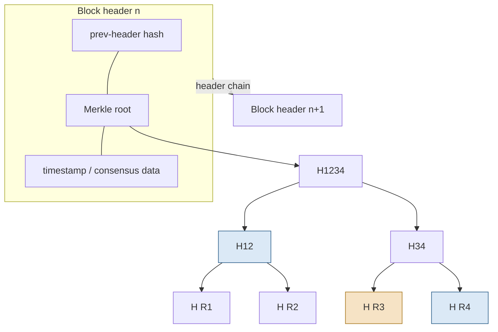
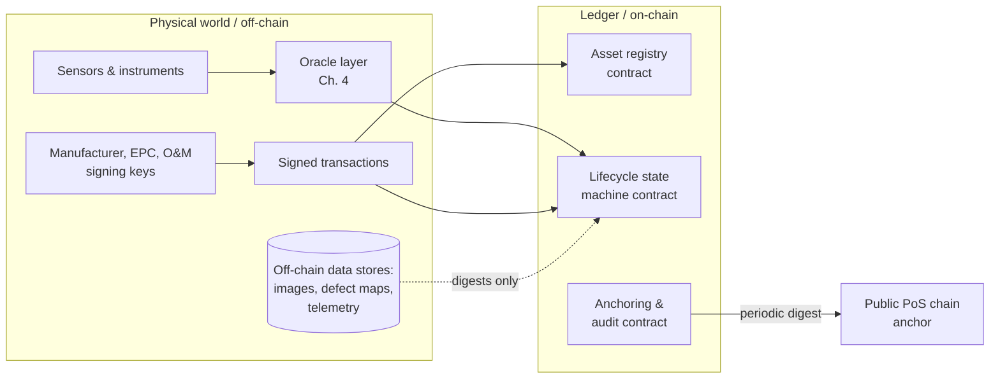

# Blockchain Fundamentals for a Non-Blockchain-Native Reader

## What This Chapter Covers

This chapter supplies the distributed-ledger background the rest of the book
requires, and no more. Readers who work with blockchain systems professionally can
skim Section 2.6 (terminology) and move to Chapter 3. Readers wanting a systematic
field treatment should consult the author's prior blockchain fundamentals monograph
(cited at chapter end); this chapter does not reproduce it. The organizing question
is: *what does this machinery guarantee, and at what cost?* — because every
architectural decision in Part II negotiates between those guarantees and those
costs. The chapter proceeds from data structures (why rewriting is detectable)
through consensus (who appends, and why the others accept it), permissioning
decisions, and smart contracts, to a terminology section and a closing checklist
of what the machinery pointedly does not provide. Section 2.8 assembles the pieces
into one end-to-end trace before Part II formalizes them. Readers without a
cryptography background should not skip Section 2.2: the hash-and-Merkle argument
is the mechanism every later integrity claim rests on.

## 2.1 The Problem a Ledger Solves

Strip away the terminology and a distributed ledger addresses one problem: several
parties who do not fully trust one another need to agree on a sequence of records, and
need confidence that the sequence, once agreed, will not be quietly rewritten by any
of them.

Note what is *not* in that sentence. Nothing about currency, tokens, or payments —
those are applications. Nothing about anonymity. And nothing about truth: the ledger
guarantees that the parties agree on *what was recorded and in what order*, not that
what was recorded is correct. This last distinction did most of the damage in the
first wave of supply-chain blockchain projects and matters enormously for asset
identity; Chapter 1 called it the garbage-in permanence problem, and Chapters 4 and 6
are largely about closing the gap between recorded and true.

For asset identity specifically, the requirement from Section 1.5 was: records that no
single party can rewrite, maintained across organizational boundaries, outliving any
individual institution. A ledger replicated across the manufacturer, independent
operators, insurers, and industry bodies — with an append-only structure enforced by
cryptography and agreement enforced by protocol — is a direct construction of that
requirement. Whether it is an *economical* construction depends on the deployment, and
Section 4.6 gives the honest decision procedure.

### 2.1.1 Why Ordinary Database Replication Is Not Enough

Engineers arriving from enterprise systems reasonably ask why the familiar
machinery — a replicated relational database with an audit log, perhaps with
write-once storage underneath — does not satisfy the requirement. The question
deserves a precise answer rather than a dismissive one, because for many workloads
the familiar machinery *does* suffice, and Section 4.6 will send some readers back
to it with the book's blessing.

Conventional replication protocols (primary–backup, quorum systems, the Paxos and
Raft families) are designed for *crash fault tolerance*: they keep a system
consistent and available when nodes fail by stopping. They assume every node runs
the same software honestly, and their trust model has a root — some party
administers the cluster, holds the credentials, and can, with sufficient
privilege, rewrite anything. The audit log constrains casual tampering, but the
log's own integrity rests with the same administrator. This is exactly Chapter 1's
central-registry pattern with better engineering: fine wherever a single
institution may legitimately hold root over the record, and structurally
inadequate where the record's entire purpose is that *no* institution holds root —
the warranty record that must bind the manufacturer, the condition history that
must bind the seller.

The distributed-ledger contribution, stated in systems vocabulary, is *Byzantine*
fault tolerance generalized across organizational boundaries: the replicas belong
to different, mutually distrusting parties; the protocol reaches agreement even if
some replicas lie; and the data structure makes any post-agreement revision
detectable by anyone holding an honest copy — or, with the anchoring pattern of
Section 2.4, by anyone at all. A useful mental model for the whole apparatus is a
*replicated state machine with hostile operators*: every validator applies the
same deterministic rules to the same ordered inputs and must arrive at the same
state, and the cryptography exists to make cheating on "same ordered inputs"
visible. Nothing about that model requires currency, and the reader who holds onto
it will find nothing in Part II mysterious.

### 2.1.2 The One Page of History That Matters Here

The field's history is mostly irrelevant to this book, but four moments in it are
load-bearing and worth fixing. The first predates the word "blockchain" by two
decades: Haber and Stornetta's 1991 work on digital timestamping — how to prove a
document existed at a time, without trusting the timestamper, by chaining
document digests and periodically publishing the chain's head in an immutable
public medium (they used a newspaper's classified section) — is, in miniature,
the exact anchoring architecture this book adopts. Readers who find public-chain
anchoring exotic may substitute "the newspaper, industrialized." The second is
Bitcoin (2008), whose lasting contribution for our purposes is not the currency
but the demonstration that proposer selection needs no registrar — that an open
set of mutually anonymous parties can maintain agreement, at scale, under attack,
for decades. The third is Ethereum (2014), which generalized the ledger from a
payments record to a replicated general-purpose state machine and thereby created
the smart-contract deployment model of Section 2.5 — along with, it must be said,
the bug catalog that Section 2.5 draws its cautions from. The fourth is the
quieter industrial turn from roughly 2016 onward: permissioned platforms built
for consortium deployment, the large public chains' migration to proof of stake
(collapsing the energy objection that had made public anchoring awkward for a
climate-sector registry), and — outside the technology entirely — the arrival of
regulation, sketched in Section 1.4.5, that mandates exactly the per-unit
lifecycle records this machinery is good at keeping. The reader now knows every
piece of history the remaining chapters assume.

One more framing prevents a common confusion. The ledger literature speaks of
"trustlessness," which is a misnomer that has done real damage in procurement
conversations. No system in this book removes trust; every system *relocates and
reduces* it. A consortium ledger replaces "trust the seller's database" with
"trust that fewer than a third of these named, contracted, mutually adversarial
organizations collude, and that the mathematics of hash functions holds." That is
not zero trust — it is a smaller, more inspectable, more litigable trust
assumption, and the honest vocabulary for the whole field is *trust
minimization*. When Chapter 8 analyzes what the architecture defends against, the
residual trust assumptions are enumerated, priced, and never waved away.

## 2.2 The Data Structure: Why Rewriting History Is Detectable

A blockchain's tamper evidence comes from two uses of cryptographic hash functions,
and since hash functions carry more of this book's security than any other single
primitive — Chapter 9 will argue they carry it furthest into the post-quantum era —
they deserve a careful paragraph rather than a passing definition.

### 2.2.1 Hash Functions: The Properties That Matter

A cryptographic hash function \(H\) maps input of any length to a digest of fixed
length (256 bits for the SHA-256 family this book uses as its running example).
Three properties are required, in increasing order of strength. *Preimage
resistance*: given a digest \(d\), finding any input \(m\) with \(H(m) = d\) is
computationally infeasible — the function cannot be run backward. *Second-preimage
resistance*: given a specific input \(m_1\), finding a different \(m_2\) with the
same digest is infeasible — an attacker cannot substitute a crafted document for a
committed one. *Collision resistance*: finding *any* two inputs with the same
digest is infeasible — even a party who controls both documents at creation time
cannot prepare a benign/malicious pair sharing a digest. The third property is the
one that fails first as cryptanalysis advances (the birthday bound halves its
effective strength, and the deprecations of MD5 and SHA-1 were collision failures),
which is why the event schemas of Chapter 5 version their digest algorithms and
why Chapter 9's pattern P4 exists.

Two behavioral properties do practical work throughout Part II. First, the
*avalanche effect*: change one bit of the input and each output bit flips with
probability one half, so digests of near-identical documents are unrelated — a
flash-test report altered from 401.2 W to 402.1 W produces a completely different
digest, and no similarity between digests betrays similarity between documents
(this is also why digests disclose nothing, the fact on which the anchoring
pattern's privacy argument rests). Second, *commitment*: publishing \(H(m)\) binds
the publisher to \(m\) without revealing it; when \(m\) is later disclosed, anyone
can check the binding. The whole off-chain payload design of Section 4.2 is this
one idea applied at scale: the ledger holds commitments; the world holds content.

The corollary that costs projects months when missed: a hash commits to *bytes*,
not to *meaning*. Two JSON serializations of the same logical event — fields
reordered, whitespace changed, a number written `402.10` rather than `402.1` —
are different byte strings with unrelated digests. Every commitment in this book
therefore presumes a *canonical serialization* rule fixed in advance, a
discipline Section 4.2 makes concrete.

### 2.2.2 Chaining: Making History a Single Committed Object

Records are grouped into blocks, and each block header contains the hash of the
previous block's header. The header is small — a previous-header digest, a Merkle
root committing to the block's contents (next subsection), a timestamp or round
number, and consensus-specific fields — but its recursive structure has a
consequence easy to state and easy to underestimate: **the digest of the latest
header commits to the entire history of the ledger.** Altering any historical
record changes its block's Merkle root, which changes that block's header digest,
which changes the next header, and so on to the tip. An attacker cannot alter one
record in isolation; they must re-produce the entire suffix of the chain — and, as
Section 2.3 explains, making that re-production expensive or detectable is
precisely the consensus mechanism's job.

The practical unit of verification this creates is the *header chain*: a few dozen
bytes per block, thousands of blocks per year at consortium block rates — small
enough for any party, including parties outside the consortium, to retain in full.
Whoever holds the header chain can verify any record ever committed, given the
record and a proof; and whoever compares header chains from two sources detects
divergence immediately at the first differing digest. When Chapter 4 speaks of
publishing headers and anchors, and Chapter 7 of read replicas serving proofs,
this is the object being published and proved against.

### 2.2.3 Merkle Trees: Compact Proof That a Record Is Inside

Within a block, records are organized in a binary hash tree: leaves are hashes of
individual records, internal nodes are hashes of the concatenation of their
children, and the root is committed in the block header. The consequence that
matters for this book is *compact proofs of inclusion*: to prove that a particular
record is in a block, one presents the record plus one sibling hash per tree level
— about \(\log_2 n\) hashes for a block of \(n\) records.

The arithmetic deserves to be felt once. A registration batch of 2,048 module
enrollments (the batching pattern of Section 7.2) forms a tree eleven levels deep.
Proving that one particular module's enrollment is in the committed batch requires
the enrollment record plus eleven 32-byte hashes — 352 bytes of proof — and the
verifier performs eleven hash computations, microseconds on any processor made
this century. The same logic at plant scale: a verifier holding only block headers
(kilobytes) can check any single event out of a 25-year, multi-million-event
history with a proof that fits in a network packet. A verifier holding *nothing
but the public anchor* (Section 4.4) needs additionally the short header
sub-chain connecting the anchored digest to the block in question. This is what
allows a field technician's handheld device, or an embedded controller in an
inverter, to verify an asset's records without storing gigabytes of chain data,
and it is load-bearing in the verification workflows of Chapters 6 and 11.

Two variations appear later and are named here so they arrive familiar. A *sparse
Merkle tree* indexes leaves by key (say, asset DID) rather than by position,
which additionally supports proofs of *non*-inclusion — the ability to prove that
no record exists for a given key, useful when a verifier must establish that an
asset was never decommissioned. And an *incremental* or *append-only* tree
(underlying certificate-transparency-style logs) supports efficient proofs that
one tree is a prefix of a later one — the primitive behind Chapter 9's
re-anchoring pattern, where a new commitment must be shown to extend, not
replace, the old history.

**Figure 2.1** Block structure and a Merkle inclusion proof. To prove record R3 is in
the block, the prover supplies R3 with the sibling hash H(R4) and the uncle hash H12;
the verifier recomputes the root and compares it with the header.

Two practical corollaries. First, immutability is *detective*, not *preventive*: the
structure does not stop a powerful party from producing an altered chain; it
guarantees that the alteration is visible to anyone holding the honest chain or even
its headers. Second, hashes commit to exact byte sequences, so the event schemas of
Chapter 5 must define canonical serializations — two encodings of the "same" event are
different records.

### 2.2.4 Digital Signatures: Authorship for Records

The hash machinery establishes *what* the history is; digital signatures establish
*who* contributed each record, and they are the second primitive this book leans
on everywhere. A signature scheme gives each party a key pair: a private signing
key, held secret, and a public verification key, distributable to anyone. A
signature over a message (in practice, over its digest) can be produced only with
the private key and checked by anyone with the public one; it binds the signer to
those exact bytes, and any alteration of the message invalidates it. Three
properties do the work in this book. *Authentication*: the record came from the
holder of the key. *Integrity*: the record is byte-for-byte what was signed.
*Non-repudiation*: the signer cannot later plausibly deny the act — the property
on which warranty adjudication (Chapters 5, 11) ultimately rests, and the reason
the threat model of Chapter 8 treats key theft as the premier digital attack.

What a signature pointedly does not establish is *authority*: the fact that a key
signed a registration proves nothing about whether that key was entitled to
register anything. Binding keys to roles, roles to organizations, and authority
to time intervals is the accreditation layer built in Chapters 5 and 8 —
conceptually the same job public-key infrastructure performs for the web, redone
with a thirty-year horizon and no single certificate authority. And because
signature algorithms are the cryptographic component most exposed to quantum
attack (Table 9.1), every signature in this architecture carries algorithm
metadata from day one: a signature is never just bytes, but bytes-under-a-policy,
verifiable against the policy in force when it was made. The reader will meet
this again as pattern P2 in Chapter 9.

## 2.3 Consensus: Who Appends, and Why the Others Accept It

Replication creates the coordination problem: many nodes hold copies; who decides what
the next block is? A consensus mechanism is a protocol for that decision that
tolerates some participants failing or lying. Three families matter for this book, and
they differ along axes — finality, energy cost, participation model, and committee
size — that directly constrain asset-identity designs.

The theoretical setting is worth one paragraph because its impossibility results
explain why the families look the way they do. Agreement among distributed parties
in the presence of arbitrary ("Byzantine") faults is provably impossible in a
fully asynchronous network if even one participant may fail — the
Fischer–Lynch–Paterson result — so every practical protocol buys its way out with
one of three currencies: *synchrony assumptions* (messages arrive within known
bounds, at least eventually), *randomness* (leader lotteries, of which proof of
work is a physical implementation), or *economic weight* (making equivocation
ruinously expensive rather than impossible). Knowing which currency a protocol
spends tells you how it fails: synchrony-based protocols stall under network
partition; lottery-based protocols fork temporarily and reconcile; economically
secured protocols are exactly as strong as the value at stake. All three failure
signatures will matter when Chapter 8 asks what an attacker can do to the
consortium and Chapter 4 asks what an anchor is worth.

### 2.3.1 Proof of Work

The right to propose a block is rationed by computation: proposers ("miners")
search by brute force for a header nonce whose hash falls below a difficulty
target, the target self-adjusts to hold block intervals roughly constant, and the
canonical chain is the one embodying the most cumulative work. The elegance is
real and was historic: proposer selection requires no identity, no registration,
and no coordinator — the lottery ticket is the electricity bill — and the system
has survived fifteen years of the best-funded adversarial attention in the history
of distributed systems.

Its costs for this book's workload are equally plain. The energy consumption is
indefensible for an infrastructure-registry workload in a sector defined by
decarbonization — and the objection is not cosmetic: Chapter 10's ESG reporting
interfaces would have to disclose the registry's own footprint. Finality is
*probabilistic*: a record is never final, merely exponentially unlikely to be
displaced as blocks accumulate over it ("confirmations"), because a competing
chain suffix with more work legitimately replaces the tip at any time — the
*reorganization*. Deep reorganizations require a majority of hash power (the
"51% attack"), which is why the security statement is economic after all: the
guarantee is that rewriting depth \(k\) costs more in electricity and hardware
than the rewrite gains. Probabilistic finality interacts badly with legal
processes — an ownership transfer that is "probably final, at confidence rising
with each ten-minute interval" is an awkward exhibit — and smaller PoW networks
have suffered exactly the deep reorganizations the theory predicts, since renting
majority hash power against a small network is cheap. No design in this book uses
PoW, but several public anchoring targets historically did, and the finality
caveat survives wherever they are used.

### 2.3.2 Proof of Stake

Proposal rights are rationed by economic stake: validators post collateral in the
chain's native asset, are pseudo-randomly selected (weighted by stake) to propose
blocks and to serve on attestation committees, and are penalized — "slashed," the
collateral programmatically destroyed — for provable misbehavior, of which the
canonical instance is *equivocation*: signing two conflicting blocks for the same
slot. The design converts the PoW security argument from operating expense
(electricity burned per block) to capital at risk (stake destructible on
misbehavior), cutting energy consumption by orders of magnitude while — in its
mature implementations — *strengthening* the finality story: an explicit finality
gadget has validators attest to checkpoints, and once checkpoints are attested by
two-thirds of total stake they are final in a strong economic sense — reverting
them requires at least one-third of all staked value to be provably slashed. For
the large public PoS chains, that is a nine-to-ten-figure sum in any currency,
which is the precise content of the claim that a public anchor is backed by
"economic weight no industry consortium can muster."

Two honest caveats travel with the family. Stake concentrates — through staking
pools and custodial services — so the effective validator set is smaller than the
nominal one, and assessments of anchoring targets should look at concentration,
not marketing. And bootstrapping trust is subtler than in PoW: a node offline for
years cannot distinguish the canonical chain from a long-range fake constructed
with old, since-withdrawn keys without a recent trusted checkpoint (the
"weak subjectivity" requirement) — a niche concern for payment users, but a real
one for this book, where a verifier in year 25 may be validating against anchors
made in year 3; Section 9.4's re-anchoring cadence is partly an answer to it.
For this book's purposes PoS matters mainly as the consensus of the public
chains used for *anchoring* (Section 4.4): periodically committing a digest of a
private ledger into a public chain whose rewriting the consortium could neither
afford nor conceal.

### 2.3.3 BFT Committee Protocols

A known, fixed committee of \(n\) validators runs an explicit voting protocol
that reaches agreement provided fewer than \(n/3\) validators are faulty or
malicious. The classical construction (PBFT) proceeds in rounds: a leader
proposes a block (*pre-prepare*), validators broadcast votes in two phases
(*prepare*, then *commit*), and a block carrying \(2f+1\) commit votes from a
committee of \(n = 3f+1\) is decided — *immediately and deterministically*. Once
committed, a block is final, full stop; there are no confirmations to count and
no reorganizations to model. If the leader fails or misbehaves, a *view change*
elects a successor — the protocol's most delicate machinery, and historically
where implementations have harbored their bugs. The classical two-phase broadcast
costs \(O(n^2)\) messages per block, bounding comfortable committee sizes to a
few tens of nodes; the modern leader-based lineage (HotStuff and its descendants,
Chapter 7) linearizes communication with aggregated signatures and pipelining,
easing but not removing the bound.

The cost of the family is the committee itself: someone must decide who the
validators are, admission and expulsion are governance acts (Chapter 10), and the
\(f < n/3\) threshold means a consortium of ten members must trust that no four
collude — a trust assumption that is *institutional*, not cryptographic, and that
Chapter 8 prices explicitly. For an asset-identity consortium of manufacturers,
operators, insurers, and certifiers — parties that are identified, contracted,
and mutually adversarial in precisely the way that discourages collusion — this
is usually the right family, and it is the assumed baseline for Part II.
Deterministic finality is not a luxury here: commissioning events start warranty
clocks and ownership transfers move title, and Chapter 10's regulatory interfaces
want a record that is final when the parties leave the site, not final-with-high-
probability by close of business.

### 2.3.4 Choosing, and Refusing to Choose

Table 2.1 compares the families on the axes that matter for asset identity, and
the book's position can now be stated compactly: **BFT for the operational
consortium ledger, PoS for the public anchoring layer, PoW for nothing — and the
refusal to collapse the first two into one system is itself the design.** A pure
BFT consortium is institutionally rewritable (Section 2.4); a pure public-chain
deployment prices every registration event in a volatile fee market, publishes
event metadata to the world (Chapter 10 will not allow it), and hostages the
sector's registry to a platform whose governance the sector does not control. The
hybrid takes finality and cost from the committee and borrows censorship-visible
immutability from the public chain at a few cents per interval. Nothing in that
sentence is novel engineering; its virtue is that every term is auditable.

Three questions recur whenever this position is presented to engineering
audiences, and they deserve their answers on the record. *"Why not just use one
big public chain for everything?"* Because the operational workload includes
commercially sensitive metadata (Chapter 10), because per-event fees on a public
chain are set by a global fee market with no regard for a registrar's budget
(Chapter 7 quantifies the volatility), and because the sector cannot accept that
its asset registry's availability and rules are governed by a community with no
stake in energy infrastructure. *"Why not skip the anchor — surely sixteen
institutions won't collude?"* Perhaps not, but the record must convince parties
twenty years out who never met those institutions, several of which will by then
be dissolved, merged, or adverse; the anchor converts a character reference into
a checkable fact, and at cents per interval it is the cheapest component in the
entire system. *"Why a committee of institutions rather than proof of stake
among them?"* Because stake-weighted consensus among a dozen parties simply
re-derives a committee with extra steps and a token to administer; economic
consensus earns its complexity only at open, global scale — which is exactly
where the architecture rents it rather than builds it.

The division of labor also fails gracefully in both directions, which is part of
its case. If the consortium collapses — commercially or politically — the header
chain and anchors survive in public, and every already-issued record remains
verifiable by anyone who holds its payload and proof; Chapter 9 leans on this
property for algorithm transitions, and Chapter 10 for institutional ones. If,
conversely, a public anchor chain decays — fee spikes, governance capture,
migration — the consortium re-targets its anchoring contract to a successor and
loses nothing but the decayed chain's future utility; Section 4.4 specifies the
dual-target redundancy that makes even the transition period safe. Neither
failure is hypothetical over a thirty-year horizon, and an architecture for that
horizon must treat both layers as replaceable while treating the *records* as
permanent.

**Table 2.1** Consensus families compared on the axes that matter for asset identity.

| Property | Proof of work | Proof of stake | BFT committee |
|---|---|---|---|
| Participation | Open (permissionless) | Open, capital-gated | Closed committee |
| Finality | Probabilistic | Economic, near-deterministic checkpoints | Immediate, deterministic |
| Energy cost | Very high | Negligible | Negligible |
| Throughput (typical) | Low | Moderate | High |
| Governance burden | None (protocol-set) | Protocol + stake distribution | High: committee selection, onboarding |
| Failure assumption | <50% of hash power hostile | <⅓–½ of stake hostile (varies) | <⅓ of committee faulty |
| Role in this book | None (context only) | Public anchoring layer | Primary consortium ledger |

## 2.4 Permissioned versus Permissionless, and Why Asset Identity Is Usually Hybrid

A permissionless ledger admits any participant; a permissioned ledger restricts who
may validate, and often who may write or read. The energy sector's instinct is
permissioned — identified counterparties, contractual recourse, regulatory comfort,
data control — and for the *operational* ledger that instinct is sound. But a purely
permissioned system quietly reintroduces the central-registry risk of Section 1.5 at
the consortium level: the members jointly *can* rewrite history if they jointly choose
to, and a warranty claimant twenty years hence must trust that they did not.

The standard resolution, adopted throughout this book, is a hybrid: a permissioned BFT
ledger carries the operational load, and its state is periodically *anchored* — a
digest of recent history committed — into a large public PoS chain. The anchor costs a
few bytes and cents per interval, discloses nothing (it is a hash), and converts
"trust the consortium" into "trust that the consortium could not have rewritten
history without the discrepancy being visible against a public record it does not
control." Section 4.4 details the mechanism and its failure modes.

Permissioning is not one decision but three, and conflating them causes real
design errors. *Validation* permission — who runs consensus — is the decision
discussed above. *Write* permission — who may submit transactions — is
independent: the consortium ledger accepts submissions from hundreds of
accredited roles (registrars, EPCs, O&M firms, instruments) that do not validate
anything; their authority comes from ledger-recorded accreditation, not committee
membership. *Read* permission — who may query — is different again, and for this
book's purposes largely answered by Chapter 10: envelopes are consortium-visible,
payloads are access-controlled, headers and anchors are public, and verification
(Chapter 6, Steps 1–2) is deliberately possible for parties with no standing in
the consortium at all, because the insurers, buyers, and adjudicators who give
the record its value were never going to join a committee to consult it. Table 2.2
fixes the pattern.

**Table 2.2** The three permissioning decisions and this book's default answers.

| Decision | Question | This book's default | Governed by |
|---|---|---|---|
| Validation | Who runs consensus? | 10–30 named institutions, adverse-interest mix (§7.5) | Consortium agreement |
| Write | Who may submit events? | Any accredited role; accreditation on-ledger, revocable | Role-accreditation contract (Ch. 5, 8) |
| Read | Who may query and verify? | Envelopes: consortium; payloads: authorized; headers + anchors + proofs: public | Three-zone privacy design (Ch. 10) |

A last word on the word "blockchain." Some permissioned platforms batch
transactions without a literal chain of blocks, some use directed acyclic graphs,
and the vendor landscape has spent a decade quarreling over which systems deserve
the name. The quarrel is sterile. Every property this book relies on — append-only
structure, hash commitment to history, Byzantine agreement, compact proofs — is
available from several architectures, and the text therefore says *ledger* except
where a literal chain of blocks matters. The reader is invited to apply the same
indifference to vendors' terminology.

The consortium form itself has precedents older than the technology, and they
calibrate expectations usefully. Interbank settlement networks, airline
reservation consortia, and the automotive industry's data-exchange bodies all
solved the same institutional problem — competitors jointly operating
infrastructure none would trust a single competitor to run — decades before
distributed ledgers existed, using contracts, audits, and neutral operating
companies. Two lessons transfer. First, such bodies succeed when the shared
infrastructure is *pre-competitive*: no member gains advantage from corrupting
it, and every member loses from its absence — a condition asset identity
satisfies more cleanly than most blockchain use cases, since no manufacturer
competes on the ability to falsify records. Second, they take years to
constitute and require a governance instrument with teeth; the technology
chapters of this book are, frankly, the easy part, and Chapter 10 gives the
governance the page count that ratio implies.

## 2.5 Smart Contracts: Code as Recorded Procedure

A smart contract is a program whose code and state live on the ledger and whose
execution is performed redundantly by the validators, so that its outputs inherit the
ledger's tamper evidence. The term is doubly misleading — nothing about them is
necessarily contractual, and they are only as smart as their authors — but it is
entrenched.

For asset identity, smart contracts play four roles, all developed in Part II:

1. **Registries.** A contract maps each asset identifier to its current state —
   custodian, lifecycle stage, latest condition-record digest — and enforces
   uniqueness at registration (Chapter 4). Uniqueness enforcement sounds trivial
   and is not: it is the difference between an identifier scheme and a pile of
   labels, and doing it at write time, by mechanism, is something no federation
   of spreadsheets ever achieved.
2. **Lifecycle state machines.** A contract encodes the legal transitions of
   Chapter 5's event model (an asset cannot be commissioned before it is installed,
   cannot receive maintenance events after decommissioning) and rejects
   non-conforming submissions *at write time*, converting schema discipline from
   policy into mechanism. The practical payoff is data quality at the source:
   twenty years of records that all parse, all sequence, and all carry their
   required corroborations, because nonconforming ones never entered.
3. **Conditional logic on events.** Warranty activation on commissioning, escrow
   release on verified transfer, flagging when successive condition records imply a
   degradation rate outside the warranted envelope (Chapters 5 and 11). This is
   the role the "smart contract" name promises and the one to deploy most
   sparingly: every business rule frozen into consensus code is a rule the
   consortium must govern forever, and Section 5.5 draws the line — constitution
   on-chain, judgment off it — that keeps this role from swallowing the system.
4. **Governance registers.** Accreditations, algorithm policies, validator
   membership, and custody obligations, held as ledger state so that authority
   itself has a tamper-evident history (Chapters 8–10). This least glamorous role
   turns out to carry the longest-horizon weight: it is what lets a verifier in
   2046 establish not just what was signed in 2027, but who was *entitled* to
   sign it then.

A concrete trace makes the abstraction earn its keep. When Chapter 11's EPC
submits a commissioning event, what actually happens is this: the EPC's software
constructs a transaction carrying the event envelope, signs it, and broadcasts it
to validators. Each validator, independently, runs the lifecycle contract's
commissioning function against its own copy of the ledger state: is this asset in
the `Installed` state? Does the submitter hold an EPC accreditation valid at the
claimed time? Are the required instrument attestation and owner co-signature
present and valid? Because every validator runs the same code on the same state,
every honest validator computes the same answer, and the answer — acceptance with
a state change, or rejection with a reason code — is what consensus then makes
final. The contract has converted a paragraph of the consortium's operating
procedures into a check that cannot be skipped, forgotten, or waived by a
sympathetic clerk. That, and nothing more mystical, is what "code as recorded
procedure" means; Appendix A gives this very function in full.

Three engineering realities temper the enthusiasm. **Determinism:** every validator
must compute identical results, so contracts cannot read the outside world — no
sensor, no clock beyond block time, no web query, not even a random number that
was not delivered to them. External facts must be *delivered*
to the contract by transactions, which is the oracle problem, and for a system whose
entire purpose is recording physical-world facts, the oracle is not a component but
*the* component (Sections 4.5, 8.4). **Immutability of code:** deployed bugs persist;
upgrade patterns exist (proxy indirection, versioned registries) but reintroduce a
trusted administrator and must be governed explicitly (Section 10.4). The
financial-blockchain world has paid nine-figure tuition for contract defects —
the reentrancy and access-control failures catalogued in the references — and the
transferable lesson is not the specific bugs (an asset registry holds no funds to
drain) but the discipline: contracts should be small, boring, exhaustively
reviewed, and upgraded through visible governance, which is exactly the posture
Section 5.5 adopts and Section 8.5 defends. **Cost:**
on-chain computation and storage are replicated across every validator, which is why
public platforms meter execution (Ethereum's "gas") and why, even on a consortium
ledger where no fee market exists, the true cost of on-chain bytes is every
validator's disk forever. Chapter 4 pushes bulk data off-chain and keeps only
commitments on-chain for this reason, and Chapter 7 counts the surviving bytes.

Two platform archetypes implement the model differently enough to note. The
*global virtual machine* archetype (Ethereum and its EVM descendants) has every
validator execute every contract in a shared global state — maximal simplicity of
trust, minimal parallelism. The *endorsement* archetype (Hyperledger Fabric's
execute-order-validate pipeline) has designated endorsing peers simulate a
transaction and sign its effects, with ordering and validation separated — more
flexible confidentiality and throughput, at the price of a subtler trust
statement (who must endorse what is itself policy). The architecture of Part II
is deliberately expressible in either; where the difference bites — endorsement
policies as an extra corroboration layer, private data collections as a payload
zone — Chapter 11's platform notes say so.

**Figure 2.2** The boundary between the deterministic on-chain world and the physical
world. Everything crossing the boundary passes through oracles and signed
transactions — the trust-critical interface of the entire architecture.

## 2.6 Terminology Fixed for the Rest of the Book

The field's vocabulary is inconsistent; this book uses the following terms in the
following senses, chosen to keep the prose platform-neutral.

**Table 2.3** Terminology conventions used throughout this book.

| Term | Meaning in this book |
|---|---|
| Ledger | The replicated append-only record system, regardless of platform |
| Transaction | A signed submission that, if valid, changes ledger state |
| Event | A domain-level lifecycle fact (Ch. 5), carried by one or more transactions |
| Validator | A node participating in consensus |
| Consortium ledger | The permissioned BFT ledger operated by the industry parties |
| Anchor / anchoring | Committing a digest of consortium-ledger state to a public chain |
| Oracle | Any mechanism that introduces external facts onto the ledger |
| Digest | Output of a cryptographic hash function over a canonical serialization |
| Asset record | The full set of ledger entries and linked off-chain data for one asset |
| Registrar | The role (not necessarily a single party) authorized to create identities |

Platform names (Ethereum, Hyperledger Fabric, Polygon, and others) appear only in
Chapter 7's cost modeling and Chapter 11's pilot, where concreteness requires them;
no architectural argument in this book depends on a particular platform surviving the
decades the assets will.

Beyond vocabulary, three notational conventions hold throughout. *Times* come in
pairs: an event's `claimed_time` is what the submitter asserts about the physical
world, its `ledger_time` is when consensus included it, and the text never uses
the bare word "timestamp" where the difference could matter — Chapter 5 explains
why the pair, not either alone, is the evidential object. *Sizes and costs* are
stated in 2026 dollars and current hardware terms, with the arithmetic shown so
that a reader in 2031 can re-derive them; where a number is sensitive to fee
markets or instrument prices, the sensitivity is flagged rather than averaged
away. And *guarantees* are always attributed to their source — "by hash
chaining," "by the \(f<n/3\) assumption," "by contract" — because the reader who
knows which mechanism carries a guarantee knows how it fails, and Part III is
entirely about how things fail.

Finally, a note on what to call the parties. The text says *consortium* for the
validator-operating institutions collectively, *member* for one of them, *role*
for an accredited capacity to act (registrar, EPC, inspector) regardless of which
legal entity holds it, and *verifier* for any party — member or stranger —
checking records. The deliberate implication, defended in Chapter 10, is that
verifiers vastly outnumber members: the system is built by tens of organizations
for the benefit of thousands that will never join it.

## 2.7 What the Machinery Does Not Provide

A checklist, assembled here because each item is a chapter elsewhere — and
expanded a sentence or two beyond checklist form, because each omission is a
place where a procurement conversation goes wrong.

- **Truth of inputs.** The ledger authenticates *who said what, when* — never
  whether it was so. A false flash-test result, submitted with a valid signature,
  is preserved with exactly the fidelity of a true one, forever. Physical binding
  (Ch. 3, 6) and oracle design (Ch. 4) carry the burden of making recorded and
  true coincide, and no consensus algorithm shares one gram of it.
- **Identity of things.** Keys identify keys. A ledger can prove that whoever
  holds private key \(k\) signed a statement about asset `A-3F92`; it cannot say
  anything about which laminate on which pallet `A-3F92` denotes. Associating an
  identifier with a particular physical object is precisely the problem of
  Chapter 3, and it is prior to everything in this chapter.
- **Availability of content.** A digest on-chain proves what the payload *was*;
  it does not produce the payload. If every copy of an EL image is lost, the
  ledger holds an unfalsifiable commitment to evidence that no longer exists.
  Custody, replication, and retrievability proofs (Ch. 4) are their own
  discipline.
- **Confidentiality.** Replication is the opposite of secrecy; ledger data is
  visible to all validators at minimum, and metadata leaks even where payloads do
  not. Privacy requires deliberate design (Ch. 10), and retrofitting it onto a
  running ledger is somewhere between painful and impossible.
- **Longevity of cryptography.** Hash and signature algorithms age; the assets
  outlive them. A record whose verifiability silently expires with its signature
  algorithm was never an evidential record. Chapter 9 treats migration as a
  design requirement with schema hooks, not a contingency with a task force.
- **Governance.** Who may validate, who may register, who may upgrade contracts,
  who adjudicates disputes, and who pays — these are institutional questions the
  technology only sharpens. A protocol can enforce an agreed rule; it cannot
  produce agreement, fund operations, or survive the indifference of its own
  members (Ch. 10, 13). The first-wave consortium failures of Section 1.5 were
  governance failures wearing technology costumes.

The checklist's summary sentence, worth carrying through the whole book: **a
distributed ledger is a mechanism for preserving agreement, not for producing
truth, secrecy, permanence of meaning, or institutions.** Part II supplies the
first two of those from outside the ledger; Part III supplies the third and
scaffolds the fourth.

## 2.8 A Worked End-to-End Trace

To fix the chapter's machinery in one narrative before Part II formalizes it,
follow a single record through its whole life — the flash-test result of one
module, serial-line unit 7,314 of a production day in 2027.

At 09:41 factory time, the flash tester measures the module at 402.1 W and signs
the measurement with the instrument key in its secure element (Chapter 4 will
justify signing at the sensor). The registrar agent serializes the result under
the canonical encoding, computes its digest, writes the full payload to three
custody stores, and folds the digest into the day's registration batch. At batch
close, the agent builds the Merkle tree over 2,048 registrations, and submits one
transaction — the root, the manifest digest, the registrar's signature — to the
consortium ledger. The leader validator proposes a block containing it; sixteen
validators run the registry contract, each independently confirming the
registrar's accreditation and the root's novelty; prepare and commit votes
circulate; the block is final four seconds later. Six hours after that, the
anchoring contract folds this block's header into a digest committed to two
public chains, at a total cost of a few cents amortized over everything the
consortium recorded that interval.

Nineteen years later, an adjudicator in a warranty dispute — a party that did not
exist when the record was made, trusts nobody who made it, and runs none of the
consortium's software — asks whether the module really left the factory at
402.1 W. She receives: the payload from whichever custody store still answers
(one suffices), the Merkle proof placing its digest in the batch, the batch
transaction, the header sub-chain, and the 2027 anchor receipts from the public
chains. She recomputes one digest, eleven tree hashes, and a handful of header
hashes; checks the instrument's and registrar's signatures against the algorithm
policy in force in 2027 and the accreditation records of that date; and checks
the anchor against a public chain whose full history remains world-readable. At
no point did she trust the manufacturer, the consortium, or the passage of time.
Everything Part II builds is elaboration, hardening, and honest qualification of
this trace — including the two things the trace quietly assumed and cannot
itself supply: that the module measured in 2027 is the module in dispute in 2046
(Chapters 3 and 6), and that 402.1 W was a true reading rather than a spoofed
scene (Chapters 4 and 8).

## 2.9 Chapter Summary

A distributed ledger gives a set of mutually distrusting parties an append-only shared
record: hash chaining and Merkle trees make tampering detectable and inclusion
compactly provable; signatures attribute every record to a key whose authority is
itself a governed, time-bounded fact; consensus — PoW, PoS, or BFT committee —
determines who appends and at what cost, with BFT consortium ledgers anchored to
public PoS chains as the fit for asset identity; and smart contracts turn recorded
procedure into enforced procedure at the moment of writing, in four roles of which
the governance register is the quiet long-horizon workhorse. The worked trace of
Section 2.8 showed the whole apparatus carrying one flash-test result across
nineteen years to an adjudicator who trusted none of its makers. The machinery
guarantees agreement and tamper-evidence, and pointedly does not guarantee truth,
physical binding, payload availability, confidentiality, cryptographic longevity,
or governance. The rest of the book is about supplying what it does not — and the
first and hardest of the missing pieces, binding records to matter, is next.

## References and Further Reading

1. Nakamoto, S. "Bitcoin: A Peer-to-Peer Electronic Cash System." White paper, 2008.
2. Castro, M., and B. Liskov. "Practical Byzantine Fault Tolerance." In *Proceedings
   of the Third Symposium on Operating Systems Design and Implementation (OSDI '99)*,
   173–186. New Orleans: USENIX, 1999.
3. Merkle, R. C. "A Digital Signature Based on a Conventional Encryption Function."
   In *Advances in Cryptology — CRYPTO '87*, 369–378. Springer, 1988.
4. Buterin, V. "Ethereum: A Next-Generation Smart Contract and Decentralized
   Application Platform." White paper, 2014.
5. Androulaki, E., et al. "Hyperledger Fabric: A Distributed Operating System for
   Permissioned Blockchains." In *Proceedings of the Thirteenth EuroSys Conference
   (EuroSys '18)*. ACM, 2018.
6. Narayanan, A., J. Bonneau, E. Felten, A. Miller, and S. Goldfeder. *Bitcoin and
   Cryptocurrency Technologies.* Princeton, NJ: Princeton University Press, 2016.
7. [AUTHOR LAST NAME], [FIRST NAME]. *[TITLE — AUTHOR'S PRIOR BLOCKCHAIN FUNDAMENTALS MONOGRAPH]*. [Publisher — TO BE SUPPLIED], [year — TO BE SUPPLIED]. Cited in Chapter 1, Section 1.6; not duplicated here.

\newpage
