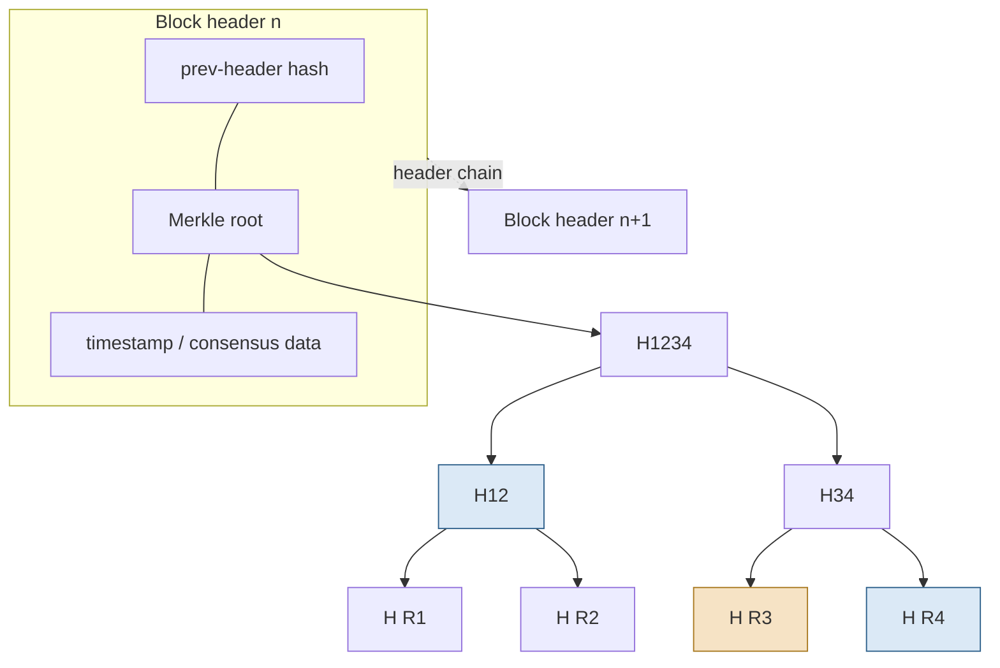
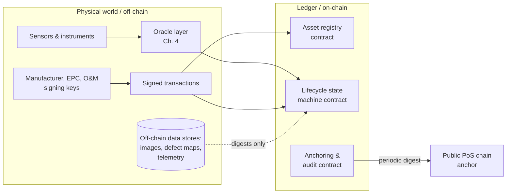

# Blockchain Fundamentals for a Non-Blockchain-Native Reader

## What This Chapter Covers

This chapter supplies exactly the distributed-ledger background the rest of the book
requires, and no more. Readers who work with blockchain systems professionally can
skim Section 2.6 (which fixes the book's terminology) and move to Chapter 3. Readers
who want a systematic treatment of the field should consult the references at the end
of the chapter; I have written one such treatment myself, and this chapter deliberately
does not reproduce it. What follows is organized around a single question: *what does
this machinery actually guarantee, and at what cost?* — because every architectural
decision in Part II is a negotiation between those guarantees and those costs.

## 2.1 The Problem a Ledger Solves

Strip away the terminology and a distributed ledger addresses one problem: several
parties who do not fully trust one another need to agree on a sequence of records, and
need confidence that the sequence, once agreed, will not be quietly rewritten by any
of them.

Note what is *not* in that sentence. Nothing about currency, tokens, or payments —
those are applications. Nothing about anonymity. And nothing about truth: the ledger
guarantees that the parties agree on *what was recorded and in what order*, not that
what was recorded is correct. This last distinction did most of the damage in the
first wave of supply-chain blockchain projects and matters enormously for asset
identity; Chapter 1 called it the garbage-in permanence problem, and Chapters 4 and 6
are largely about closing the gap between recorded and true.

For asset identity specifically, the requirement from Section 1.5 was: records that no
single party can rewrite, maintained across organizational boundaries, outliving any
individual institution. A ledger replicated across the manufacturer, independent
operators, insurers, and industry bodies — with an append-only structure enforced by
cryptography and agreement enforced by protocol — is a direct construction of that
requirement. Whether it is an *economical* construction depends on the deployment, and
Section 4.6 gives the honest decision procedure.

## 2.2 The Data Structure: Why Rewriting History Is Detectable

A blockchain's tamper evidence comes from two uses of cryptographic hash functions. A
hash function maps arbitrary data to a short fixed-length digest such that finding two
inputs with the same digest is computationally infeasible; change one bit of the input
and the digest changes unpredictably.

**Chaining.** Records are grouped into blocks, and each block header contains the hash
of the previous block's header. Altering any historical record therefore changes its
block's hash, which changes the next block's header, and so on to the tip of the
chain. An attacker cannot alter one record in isolation; they must re-produce the
entire suffix of the chain — and, as Section 2.3 explains, re-producing the suffix is
exactly what consensus mechanisms make expensive.

**Merkle trees.** Within a block, records are organized in a binary hash tree: leaves
are hashes of individual records, internal nodes are hashes of their children, and the
root is committed in the block header. The consequence that matters for this book is
*compact proofs of inclusion*: to prove that a particular record is in a block, one
presents the record plus one hash per tree level — about \(\log_2 n\) hashes for a
block of \(n\) records. A verifier holding only block headers (a few dozen bytes per
block) can check the proof without holding the ledger. This is what allows a field
technician's handheld device, or an embedded controller in an inverter, to verify an
asset's records without storing gigabytes of chain data, and it is load-bearing in the
verification workflows of Chapters 6 and 11.

**Figure 2.1** Block structure and a Merkle inclusion proof. To prove record R3 is in
the block, the prover supplies R3 with the sibling hash H(R4) and the uncle hash H12;
the verifier recomputes the root and compares it with the header.

Two practical corollaries. First, immutability is *detective*, not *preventive*: the
structure does not stop a powerful party from producing an altered chain; it
guarantees that the alteration is visible to anyone holding the honest chain or even
its headers. Second, hashes commit to exact byte sequences, so the event schemas of
Chapter 5 must define canonical serializations — two encodings of the "same" event are
different records.

## 2.3 Consensus: Who Appends, and Why the Others Accept It

Replication creates the coordination problem: many nodes hold copies; who decides what
the next block is? A consensus mechanism is a protocol for that decision that
tolerates some participants failing or lying. Three families matter for this book, and
they differ along axes — finality, energy cost, participation model, and committee
size — that directly constrain asset-identity designs.

**Proof of work (PoW).** The right to propose a block is rationed by computation:
proposers search for a header whose hash falls below a target, and the chain with the
most cumulative work wins. PoW's virtue is permissionless openness with remarkable
robustness. Its costs are equally plain: energy consumption that is indefensible for
an infrastructure-registry workload in a sector defined by decarbonization, and
*probabilistic* finality — a record is never final, merely exponentially unlikely to
be displaced as blocks accumulate over it. Probabilistic finality interacts badly with
legal processes: an ownership transfer that is "probably final" is an awkward exhibit.
No design in this book uses PoW, but several public anchoring targets historically
did, and the finality caveat survives in them.

**Proof of stake (PoS).** Proposal rights are rationed by economic stake: validators
post collateral, are selected (weighted by stake) to propose and attest, and are
penalized — "slashed" — for provable misbehavior such as signing conflicting blocks.
Modern PoS systems add explicit finality gadgets: once a supermajority of stake attests
to a checkpoint, reverting it requires destroying a large fraction of total stake.
Energy cost is negligible. For this book's purposes PoS matters mainly as the
consensus of the public chains used for *anchoring* (Section 4.4): periodically
committing a digest of a private ledger into a public chain whose immutability is
backed by economic weight no industry consortium can muster.

**Byzantine fault tolerant (BFT) committee protocols.** A known, fixed committee of
\(n\) validators runs a voting protocol (PBFT and its descendants) that reaches
agreement provided fewer than \(n/3\) validators are faulty or malicious. Finality is
*immediate and deterministic* — once committed, a block is final, full stop — and
throughput is high. The cost is the committee itself: someone must decide who the
validators are, communication scales quadratically in naive implementations (bounding
practical committee sizes to tens of nodes), and the \(n/3\) threshold means a
consortium of, say, ten members must trust that no four collude. For an asset-identity
consortium of manufacturers, operators, insurers, and certifiers — parties that are
identified, contracted, and mutually adversarial in precisely the way that discourages
collusion — this is usually the right family, and it is the assumed baseline for
Part II. Chapter 7 returns to the quantitative side.

**Table 2.1** Consensus families compared on the axes that matter for asset identity.

| Property | Proof of work | Proof of stake | BFT committee |
|---|---|---|---|
| Participation | Open (permissionless) | Open, capital-gated | Closed committee |
| Finality | Probabilistic | Economic, near-deterministic checkpoints | Immediate, deterministic |
| Energy cost | Very high | Negligible | Negligible |
| Throughput (typical) | Low | Moderate | High |
| Governance burden | None (protocol-set) | Protocol + stake distribution | High: committee selection, onboarding |
| Failure assumption | <50% of hash power hostile | <⅓–½ of stake hostile (varies) | <⅓ of committee faulty |
| Role in this book | None (context only) | Public anchoring layer | Primary consortium ledger |

## 2.4 Permissioned versus Permissionless, and Why Asset Identity Is Usually Hybrid

A permissionless ledger admits any participant; a permissioned ledger restricts who
may validate, and often who may write or read. The energy sector's instinct is
permissioned — identified counterparties, contractual recourse, regulatory comfort,
data control — and for the *operational* ledger that instinct is sound. But a purely
permissioned system quietly reintroduces the central-registry risk of Section 1.5 at
the consortium level: the members jointly *can* rewrite history if they jointly choose
to, and a warranty claimant twenty years hence must trust that they did not.

The standard resolution, adopted throughout this book, is a hybrid: a permissioned BFT
ledger carries the operational load, and its state is periodically *anchored* — a
digest of recent history committed — into a large public PoS chain. The anchor costs a
few bytes and cents per interval, discloses nothing (it is a hash), and converts
"trust the consortium" into "trust that the consortium could not have rewritten
history without the discrepancy being visible against a public record it does not
control." Section 4.4 details the mechanism and its failure modes.

## 2.5 Smart Contracts: Code as Recorded Procedure

A smart contract is a program whose code and state live on the ledger and whose
execution is performed redundantly by the validators, so that its outputs inherit the
ledger's tamper evidence. The term is doubly misleading — nothing about them is
necessarily contractual, and they are only as smart as their authors — but it is
entrenched.

For asset identity, smart contracts play three roles, all developed in Part II:

1. **Registries.** A contract maps each asset identifier to its current state —
   custodian, lifecycle stage, latest condition-record digest — and enforces
   uniqueness at registration (Chapter 4).
2. **Lifecycle state machines.** A contract encodes the legal transitions of
   Chapter 5's event model (an asset cannot be commissioned before it is installed,
   cannot receive maintenance events after decommissioning) and rejects
   non-conforming submissions *at write time*, converting schema discipline from
   policy into mechanism.
3. **Conditional logic on events.** Warranty activation on commissioning, escrow
   release on verified transfer, flagging when successive condition records imply a
   degradation rate outside the warranted envelope (Chapters 5 and 11).

Three engineering realities temper the enthusiasm. **Determinism:** every validator
must compute identical results, so contracts cannot read the outside world — no
sensor, no clock beyond block time, no web query. External facts must be *delivered*
to the contract by transactions, which is the oracle problem, and for a system whose
entire purpose is recording physical-world facts, the oracle is not a component but
*the* component (Sections 4.5, 8.4). **Immutability of code:** deployed bugs persist;
upgrade patterns exist (proxy indirection, versioned registries) but reintroduce a
trusted administrator and must be governed explicitly (Section 10.4). **Cost:**
on-chain computation and storage are replicated across every validator, which is why
Chapter 4 pushes bulk data off-chain and keeps only commitments on-chain.

**Figure 2.2** The boundary between the deterministic on-chain world and the physical
world. Everything crossing the boundary passes through oracles and signed
transactions — the trust-critical interface of the entire architecture.

## 2.6 Terminology Fixed for the Rest of the Book

The field's vocabulary is inconsistent; this book uses the following terms in the
following senses, chosen to keep the prose platform-neutral.

**Table 2.2** Terminology conventions used throughout this book.

| Term | Meaning in this book |
|---|---|
| Ledger | The replicated append-only record system, regardless of platform |
| Transaction | A signed submission that, if valid, changes ledger state |
| Event | A domain-level lifecycle fact (Ch. 5), carried by one or more transactions |
| Validator | A node participating in consensus |
| Consortium ledger | The permissioned BFT ledger operated by the industry parties |
| Anchor / anchoring | Committing a digest of consortium-ledger state to a public chain |
| Oracle | Any mechanism that introduces external facts onto the ledger |
| Digest | Output of a cryptographic hash function over a canonical serialization |
| Asset record | The full set of ledger entries and linked off-chain data for one asset |
| Registrar | The role (not necessarily a single party) authorized to create identities |

Platform names (Ethereum, Hyperledger Fabric, Polygon, and others) appear only in
Chapter 7's cost modeling and Chapter 11's pilot, where concreteness requires them;
no architectural argument in this book depends on a particular platform surviving the
decades the assets will.

## 2.7 What the Machinery Does Not Provide

A checklist, assembled here because each item is a chapter elsewhere:

- **Truth of inputs.** The ledger authenticates *who said what, when* — never whether
  it was so. Physical binding (Ch. 3, 6) and oracle design (Ch. 4) carry that burden.
- **Identity of things.** Keys identify keys. Associating a key with a particular
  laminate on a particular pallet is precisely the problem of Chapter 3.
- **Confidentiality.** Replication is the opposite of secrecy; ledger data is visible
  to all validators at minimum. Privacy requires deliberate design (Ch. 10).
- **Longevity of cryptography.** Hash and signature algorithms age; the assets outlive
  them. Chapter 9 treats migration as a design requirement, not a contingency.
- **Governance.** Who may validate, register, upgrade contracts, and adjudicate
  disputes are institutional questions the technology only sharpens (Ch. 10, 13).

## 2.8 Chapter Summary

A distributed ledger gives a set of mutually distrusting parties an append-only shared
record: hash chaining and Merkle trees make tampering detectable and inclusion
compactly provable; consensus — PoW, PoS, or BFT committee — determines who appends
and at what cost, with BFT consortium ledgers anchored to public PoS chains as the
fit for asset identity; smart contracts turn recorded procedure into enforced
procedure at the moment of writing. The machinery guarantees agreement and
tamper-evidence, and pointedly does not guarantee truth, physical binding,
confidentiality, cryptographic longevity, or governance. The rest of the book is
about supplying what it does not.

## References and Further Reading

1. Nakamoto, S. "Bitcoin: A Peer-to-Peer Electronic Cash System." White paper, 2008.
2. Castro, M., and B. Liskov. "Practical Byzantine Fault Tolerance." In *Proceedings
   of the Third Symposium on Operating Systems Design and Implementation (OSDI '99)*,
   173–186. New Orleans: USENIX, 1999.
3. Merkle, R. C. "A Digital Signature Based on a Conventional Encryption Function."
   In *Advances in Cryptology — CRYPTO '87*, 369–378. Springer, 1988.
4. Buterin, V. "Ethereum: A Next-Generation Smart Contract and Decentralized
   Application Platform." White paper, 2014.
5. Androulaki, E., et al. "Hyperledger Fabric: A Distributed Operating System for
   Permissioned Blockchains." In *Proceedings of the Thirteenth EuroSys Conference
   (EuroSys '18)*. ACM, 2018.
6. Narayanan, A., J. Bonneau, E. Felten, A. Miller, and S. Goldfeder. *Bitcoin and
   Cryptocurrency Technologies.* Princeton, NJ: Princeton University Press, 2016.
7. [AUTHOR'S PRIOR BLOCKCHAIN FUNDAMENTALS TITLE — CITATION TO BE SUPPLIED.]

\newpage
