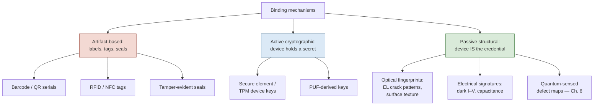
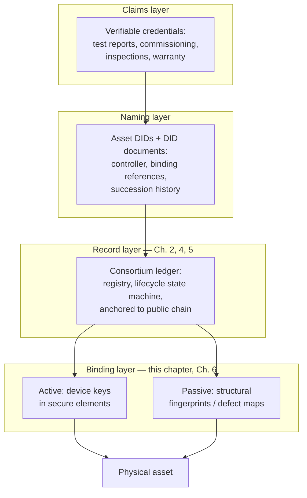

# Physical Asset Identity Models

## What This Chapter Covers

Chapter 1 defined what an asset identity must provide — uniqueness, persistence,
binding, attributability — and Chapter 2 supplied the record-keeping machinery. This
chapter addresses the piece the machinery cannot supply: how a digital identity is
attached to a physical object at all. It develops three bodies of work in turn —
digital twins, cryptographic device identity rooted in hardware, and the W3C identity
standards (decentralized identifiers and verifiable credentials) — and adapts each
from its native context to energy hardware. The chapter's central distinction, between
*active* binding (the device holds a key and can prove it) and *passive* binding (the
device's measurable structure serves as its credential), organizes everything that
follows and sets up Chapter 6.

## 3.1 The Binding Problem Stated Precisely

Suppose the consortium ledger of Chapter 2 exists and functions perfectly. A record
says: *asset `A-3F92…` was flash-tested at 402.1 Wp on 14 March 2026, signed by
manufacturer M*. A field engineer stands in front of a module. The ledger cannot
answer the engineer's actual question: **is this laminate the asset the record
designates?**

Formally, binding requires a *verification function* \(V(\text{object}, \text{identity
record}) \rightarrow \{\text{match}, \text{no match}\}\) with two properties:

- **Soundness.** A substituted or counterfeit object yields *no match* except with
  negligible probability — and, critically, the cost of manufacturing an object that
  yields a false *match* exceeds the value of doing so.
- **Field feasibility.** \(V\) is executable where the asset lives — a rooftop, a
  desert plant, a warehouse — at a cost per verification compatible with Section 1.3's
  unit economics, by a party who need not trust the asset's custodian.

Every identity technology in this chapter is an implementation of \(V\), and every
one occupies a different point on the trade-off surface spanned by soundness, cost,
and the demands placed on the object itself. The taxonomy in Figure 3.1 previews the
chapter.

**Figure 3.1** A taxonomy of binding mechanisms for physical assets. The right-hand
branch — passive structural fingerprints — is where Chapter 6's contribution sits.

Artifact-based mechanisms were dispatched in Section 1.5 — they are bearer tokens,
copyable by construction — and receive no further systematic treatment, though
Section 3.6 notes their legitimate residual role as cheap *locators* (a QR code that
tells the verifier which identity to check is useful even though it proves nothing).

## 3.2 Digital Twins, and What Identity Adds to Them

The digital twin literature, originating in aerospace lifecycle management, envisions
a virtual counterpart of a physical asset, updated by data flowing from the asset and
used for simulation, prediction, and decision support. Much of the DER industry
already operates something twin-like: inverter vendors maintain per-device telemetry
histories; plant asset-management platforms hold component registers with maintenance
records.

It is tempting to say the asset identity record of this book *is* a digital twin, but
the equation obscures the two properties twins conventionally lack. First, twins are
*operational* artifacts, owned and mutable by whoever operates the platform — they
optimize performance, not evidence. Nothing prevents retroactive revision, and their
lifetime is the platform subscription. Second, twins inherit their association with
the physical asset from the same fragile channels (serial numbers, commissioning
spreadsheets) whose failure Chapter 1 documented; a twin faithfully mirrors whatever
device its telemetry stream happens to come from.

The synthesis this book adopts: the ledger-anchored identity record is the *evidential
spine* — sparse, append-only, multi-party, bound to the physical unit — while
operational twins remain where they are, in vendor and operator platforms, but hang
their data off the spine by reference and digest (the partitioning mechanics are
Chapter 4's subject). The twin answers "how is the asset performing?"; the spine
answers "which asset is this, and who said what about it, when?" Conflating the two
questions produces systems that answer neither reliably.

**Table 3.1** Operational digital twin versus evidential identity record.

| Dimension | Operational twin | Evidential identity record |
|---|---|---|
| Primary purpose | Performance, prediction, O&M | Evidence: identity, provenance, condition history |
| Update rate | Continuous telemetry | Sparse lifecycle events |
| Mutability | Mutable, single-operator | Append-only, multi-party |
| Lifetime | Platform / contract term | Asset lifetime (decades) |
| Physical binding | Inherited from serials | Explicit mechanism (this chapter, Ch. 6) |
| Typical owner | Vendor or operator | No single owner (consortium) |

## 3.3 Active Binding: Device Keys and Hardware Roots of Trust

For assets with electronics and power, the mature answer is a *device identity key*: an
asymmetric key pair generated inside, and never leaving, a tamper-resistant hardware
element. The public key (or a certificate over it) becomes the asset's identifier; the
verification function \(V\) is a challenge–response — the verifier sends a random
nonce, the device signs it, the signature checks against the registered public key.
Soundness reduces to the difficulty of extracting the private key from the silicon,
which dedicated secure elements make genuinely expensive: protected key storage,
side-channel countermeasures, and attestation of the firmware the device booted.

Three grades of this idea appear in energy hardware, in descending order of assurance:
discrete secure elements or TPMs (the strongest, standard in recent smart meters under
schemes such as the German BSI metering regime); key material in the main processor's
trusted execution environment (weaker isolation, no extra part cost); and soft keys in
ordinary flash (little more than an obfuscated serial number — extraction is a firmware
bug away). A fourth approach generates the key from a *physically unclonable function*
(PUF) — manufacturing variation in silicon read as a device-unique value at each boot,
so no key is stored at rest. PUFs are attractive on paper for cost-sensitive devices,
with the caveats that raw PUF responses are noisy (requiring error-correcting "helper
data" whose own integrity must be managed) and that aging drift over multi-decade
service lives remains an active research concern — a caveat that recurs, in a
different guise, for the passive fingerprints of Section 3.4.

The applicability boundary is sharp and shapes the whole architecture:

**Table 3.2** Active binding applicability across the DER asset population.

| Asset class | Electronics / power | Active binding | Notes |
|---|---|---|---|
| Inverters (string, central, micro) | Yes | Well suited | Secure element adds ~USD 1–3 per unit |
| Battery management systems | Yes | Well suited | Key per pack; cell-level binding still open (Ch. 12) |
| Smart meters, gateways, controllers | Yes | Established practice | Regulatory precedent exists |
| Trackers, combiner monitoring | Usually | Feasible | Retrofit fleet is the obstacle |
| **PV modules** | **No** | **Not applicable** | Passive laminate; the central hard case |
| Mounting, cabling, structural BOS | No | Not applicable | Low unit value; batch identity usually suffices |

The largest asset population by count — the module — falls outside the active
paradigm. Proposals to embed powered electronics in module junction boxes exist
(module-level power electronics already put silicon there), but they raise cost,
add a failure mode to a 30-year passive device, and protect only units built
henceforth, doing nothing for the installed terawatt. The passive route is not a
fallback; for modules it is the main road.

## 3.4 Passive Binding: The Object as Its Own Credential

A passive binding mechanism derives the asset's credential from measurable physical
structure — no electronics, no stored secret. The general pattern has three parts:

1. **Enrollment.** At a trusted moment (manufacture, or first inspection), measure a
   structural property of the unit; reduce the measurement to a *fingerprint
   template*; commit the template (or its digest) to the identity record.
2. **Verification.** In the field, re-measure; compare against the enrolled template
   under a similarity metric with a decision threshold.
3. **Robustness engineering.** The hard part: the fingerprint must be *stable* under
   legitimate aging and measurement noise, yet *discriminating* against other units
   and *expensive to forge* — the same triangle biometrics has negotiated for decades,
   and the false-accept/false-reject formalism of that field transfers directly.

Candidate fingerprints for PV modules, roughly in order of current practicality:

- **Electroluminescence (EL) structure.** Under forward bias in darkness, a module's
  cells emit near-infrared light whose spatial pattern reveals crystal grain
  structure, micro-cracks, and finger defects — patterns fixed at manufacture and
  effectively unique per cell. EL imaging is already routine in factory QA and field
  inspection, so the instrument base exists. The obstacle is stability: cracks
  *evolve* (transport, hail, thermal cycling), so naive template matching degrades
  precisely when the asset's history gets interesting. A workable scheme must
  separate stable structural features (grain boundaries, as-built crack morphology)
  from evolving damage — and, done well, this turns the liability into the product:
  the *difference* between enrollment and verification images is itself the
  degradation evidence the lifecycle record wants (Chapter 6 builds exactly this).
- **Electrical signatures.** Dark I–V curves, series/shunt resistance profiles, and
  capacitance spectra are cheap to measure at the string or module level but are
  low-dimensional — discriminating among thousands of nominally identical units is
  marginal — and drift with the very degradation the system must tolerate. Useful as
  corroboration, insufficient alone.
- **Surface and material texture.** Optical speckle from encapsulant or backsheet
  texture, in the spirit of "fingerprints of paper" work in physical cryptography;
  high entropy, but read points must be relocatable after decades of weathering,
  and outdoor soiling is unforgiving.
- **Quantum-sensed defect maps.** Magnetometry with nitrogen-vacancy centers and
  related quantum sensing modalities can map current-flow anomalies and material
  defect distributions in cell structure at resolution and depth unavailable to
  optical methods, capturing features intrinsic to the semiconductor bulk — the
  hardest layer of the device for a forger to reproduce. This is the anchor of the
  patent-pending approach this book develops; Chapter 6 treats it in full, including
  the sober accounting of instrument cost and throughput that any honest proposal
  owes.

The forgery economics deserve emphasis because they differ fundamentally from active
binding. Extracting a key from a secure element is an attack on one chip, and a
success is silent. Forging a structural fingerprint means *manufacturing a
semiconductor device whose internal defect distribution matches a published template*
— an act that current process control cannot achieve even for the legitimate
manufacturer, since the defect distribution is precisely what production does not
control. Section 8.3 formalizes this asymmetry; it is the strongest single argument
for structural binding of high-value passive assets.

## 3.5 Names and Claims: DIDs and Verifiable Credentials for Hardware

Binding attaches a record to an object; something must still say *what the identifier
looks like* and *how statements about it are expressed* so that parties who share
nothing but standards can interoperate. The W3C's decentralized identifier (DID) and
verifiable credential (VC) specifications are the serious candidates, designed
originally around persons and organizations. Applying them to hardware is mostly
straightforward and instructive where it is not.

A **DID** is a URI (e.g., `did:method:identifier`) resolvable — via a method
specification — to a *DID document* listing public keys and service endpoints. For an
asset, the natural design registers a DID per unit, with the DID document holding the
active-binding public key (where one exists), pointers to the passive-fingerprint
enrollment digest, and the ledger address of the lifecycle record. The DID *method*
would resolve against the consortium ledger, making the ledger the registry of
Chapter 2's registrar role.

Where the person-centric assumptions creak, the failures are informative:

- **No self-sovereignty.** The ideology of DIDs is that the subject controls the
  identifier. A laminate controls nothing. The *controller* of an asset DID is
  necessarily some party — and it must change at every custody transfer of
  Figure 1.1. Controller succession, an afterthought in person-centric DID methods,
  becomes a first-class lifecycle event (Chapter 5 gives it a schema).
- **Key rotation without a subject.** A person whose key is compromised rotates it. A
  module's "key" is its structure; passive fingerprints are re-*enrolled* (a new
  measurement supersedes, with provenance, the old) rather than rotated, and the DID
  document must represent both live and superseded bindings with their intervals of
  validity — which is also exactly the hook Chapter 9 needs for algorithm migration.
- **Resolution over decades.** A DID is only as persistent as its method's
  infrastructure. This re-raises Section 1.3's institutional-lifetime problem one
  level up, and is among the standardization gaps Chapter 14 lists.

A **verifiable credential** is a signed, schema-conformant set of claims by an issuer
about a subject — precisely the right container for the sector's existing paper:
flash-test certificates (issuer: manufacturer), commissioning reports (issuer: EPC),
inspection findings (issuer: independent engineer), warranty registrations. VCs give
these documents cryptographic authorship and integrity, selective disclosure
(Chapter 10 leans on this), and machine-checkable schemas — while the ledger supplies
what VCs alone lack: ordering, timestamping against consensus time, non-suppression
(a revoked-then-hidden credential is visible as a gap), and a registry to bind the
credential's *subject* to a physical unit. The complementarity is exact, and
Figure 3.2 assembles the pieces into the reference stack the rest of the book assumes.

**Figure 3.2** The layered identity stack assumed throughout Parts II–IV. Standards
supply the naming and claim formats; the ledger supplies ordering and permanence; the
binding layer attaches the whole construction to matter.

## 3.6 Composite Identity in Practice

Real deployments compose mechanisms, because the mechanisms fail differently. The
composition rule this book adopts — developed operationally in Chapters 4 and 11 —
is: *locate cheaply, verify proportionally*. A printed QR code locates the identity
record in seconds and proves nothing. Routine custody transitions verify against the
cheap layer appropriate to the asset class (challenge–response for an inverter; a
handheld EL spot-check against enrolled structure for a sampled subset of modules).
High-stakes transitions — warranty adjudication, plant acquisition, insurance
underwriting after a catastrophe claim — escalate to full structural verification of
statistically chosen samples, with the sampling design itself recorded on the ledger
so that the verification's rigor is later provable. Identity assurance, like every
other engineering quantity in this book, is purchased in proportion to the value at
risk.

## 3.7 Chapter Summary

Binding is the layer distributed ledgers cannot provide and the layer on which every
guarantee in Part I ultimately rests. Active binding — device keys in
tamper-resistant hardware, verified by challenge–response — is mature and fits every
DER asset class that carries electronics, which is most classes by value and few by
count. The module, passive and numerous, requires the object itself to serve as
credential: enrollment and re-verification of structural fingerprints, of which
electroluminescence structure is the practical present and quantum-sensed defect
mapping the high-assurance direction Chapter 6 develops. DIDs and verifiable
credentials supply workable naming and claim formats once their person-centric
assumptions — self-sovereign control, key rotation, indefinite resolution — are
reworked for objects whose controllers change and whose "keys" are their physical
structure. The reference stack of Figure 3.2 — claims over names over records over
bindings — is the architecture whose record layer Chapter 4 now designs in detail.

## References and Further Reading

1. Grieves, M., and J. Vickers. "Digital Twin: Mitigating Unpredictable, Undesirable
   Emergent Behavior in Complex Systems." In *Transdisciplinary Perspectives on
   Complex Systems*, 85–113. Springer, 2017.
2. World Wide Web Consortium. *Decentralized Identifiers (DIDs) v1.0.* W3C
   Recommendation, 19 July 2022.
3. World Wide Web Consortium. *Verifiable Credentials Data Model v2.0.* W3C
   Recommendation, 2025.
4. Gassend, B., D. Clarke, M. van Dijk, and S. Devadas. "Silicon Physical Random
   Functions." In *Proceedings of the 9th ACM Conference on Computer and
   Communications Security (CCS '02)*, 148–160. ACM, 2002.
5. Buchanan, J. D. R., et al. "Fingerprinting Documents and Packaging." *Nature* 436
   (2005): 475.
6. Trusted Computing Group. *TPM 2.0 Library Specification.* TCG, latest revision.
7. Köntges, M., et al. *Review of Failures of Photovoltaic Modules* (EL imaging and
   crack morphology context). IEA-PVPS Task 13 Report T13-01:2014.
8. Degen, C. L., F. Reinhard, and P. Cappellaro. "Quantum Sensing." *Reviews of
   Modern Physics* 89, no. 3 (2017): 035002.

\newpage
