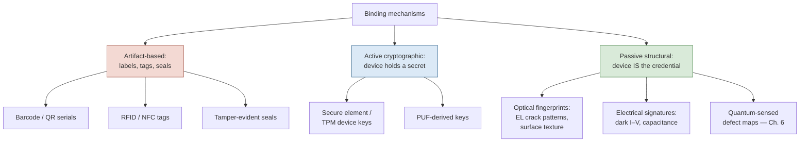
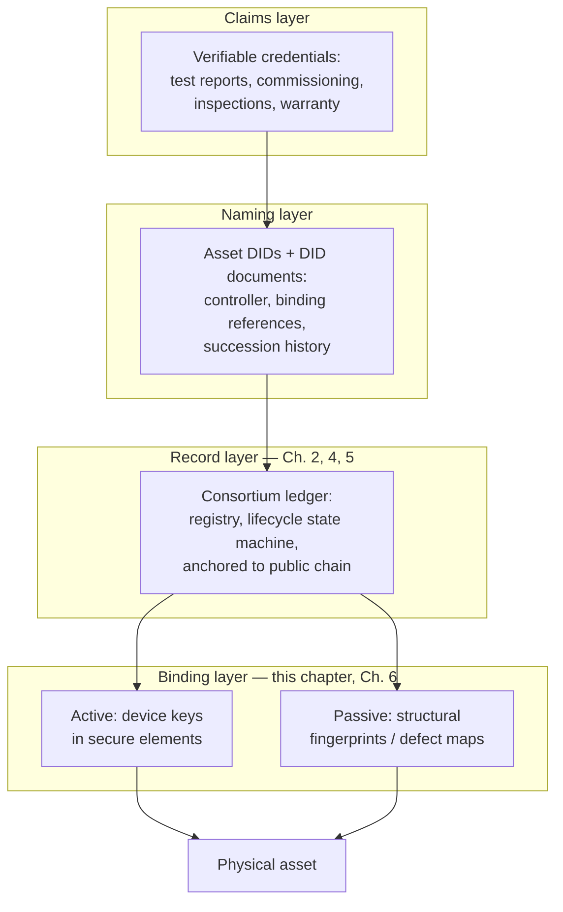

# Physical Asset Identity Models

## What This Chapter Covers

Chapter 1 defined what an asset identity must provide — uniqueness, persistence,
binding, attributability — and Chapter 2 supplied the record-keeping machinery. This
chapter addresses the piece the machinery cannot supply: how a digital identity is
attached to a physical object at all. It develops three bodies of work in turn —
digital twins, cryptographic device identity rooted in hardware, and the W3C identity
standards (decentralized identifiers and verifiable credentials) — and adapts each
from its native context to energy hardware. The chapter's central distinction, between
*active* binding (the device holds a key and can prove it) and *passive* binding (the
device's measurable structure serves as its credential), organizes everything that
follows and sets up Chapter 6. Along the way it fixes the statistical and
adversarial refinements of the binding problem (Section 3.1.1), draws the
twin/spine boundary that keeps operational and evidential data in their proper
places (Section 3.2), walks the active-binding lifecycle that the meter fleets
have already proven at national scale (Section 3.3), formalizes the passive
template pipeline (Section 3.4), adapts the W3C naming and claims standards to
subjects that are objects (Section 3.5), and closes with the composition rules —
the V0–V3 escalation ladder and the aggregate-identity test — that turn
mechanisms into deployments (Section 3.6).

## 3.1 The Binding Problem Stated Precisely

Suppose the consortium ledger of Chapter 2 exists and functions perfectly. A record
says: *asset `A-3F92…` was flash-tested at 402.1 Wp on 14 March 2026, signed by
manufacturer M*. A field engineer stands in front of a module. The ledger cannot
answer the engineer's actual question: **is this laminate the asset the record
designates?**

Formally, binding requires a *verification function* \(V(\text{object}, \text{identity
record}) \rightarrow \{\text{match}, \text{no match}\}\) with two properties:

- **Soundness.** A substituted or counterfeit object yields *no match* except with
  negligible probability — and, critically, the cost of manufacturing an object that
  yields a false *match* exceeds the value of doing so.
- **Field feasibility.** \(V\) is executable where the asset lives — a rooftop, a
  desert plant, a warehouse — at a cost per verification compatible with Section 1.3's
  unit economics, by a party who need not trust the asset's custodian.

Every identity technology in this chapter is an implementation of \(V\), and every
one occupies a different point on the trade-off surface spanned by soundness, cost,
and the demands placed on the object itself. The taxonomy in Figure 3.1 previews the
chapter. It is worth pausing on how unusual the question is: essentially all of
applied cryptography assumes the endpoint *is* the keyholder — authenticate the
key and you have authenticated the party. Physical-asset identity breaks that
assumption at the root, because the entity of interest holds no keys, computes
nothing, and cannot participate in its own authentication. Everything
distinctive in this chapter flows from taking that breakage seriously instead
of papering over it with a label that holds the keys on the object's behalf —
which is, in one sentence, the design error of every artifact-based scheme in
the left branch of the taxonomy.

**Figure 3.1** A taxonomy of binding mechanisms for physical assets. The right-hand
branch — passive structural fingerprints — is where Chapter 6's contribution sits.



Artifact-based mechanisms were dispatched in Section 1.5 — they are bearer tokens,
copyable by construction — and receive no further systematic treatment, though
Section 3.6 notes their legitimate residual role as cheap *locators* (a QR code that
tells the verifier which identity to check is useful even though it proves nothing).

### 3.1.1 Refining the Requirements: Errors, Adversaries, and Who Holds the Instrument

The two-property statement of \(V\) above is the executive version; engineering
needs three refinements before the mechanisms can be compared honestly.

First, \(V\) is *statistical*, not Boolean. Every physical measurement carries
noise, every physical object drifts with age, and so every real verification
function has a false-accept rate (FAR: a wrong object passes) and a false-reject
rate (FRR: the right object fails), traded against each other by a decision
threshold. The two error types have asymmetric costs that depend on the use: at a
warranty adjudication, a false accept pays a fraudulent claim, while a false
reject wrongly denies an honest one; at a routine custody scan, a false reject
merely triggers a second measurement. Mechanism comparisons that quote a single
"accuracy" number are hiding this trade-off, and the biometric community's
receiver-operating-characteristic discipline — publish the curve, not a point —
is the standard this book applies to its own proposals in Chapter 6.

Second, soundness must be stated against an *adversary model*, not against
chance. The probability that two honest modules collide in fingerprint space
(random collision) is a different quantity from the probability that a motivated
forger, holding the published template and a budget, produces an object that
passes (adversarial collision) — and it is the second quantity that secures
anything. The gap between the two is where artifact mechanisms die: barcode
collisions are vanishingly rare by chance and universal under adversaries. Every
soundness claim in this chapter and Chapter 6 is an adversarial claim, priced in
attacker cost, and Chapter 8 supplies the attacker taxonomy those prices assume.

Third, the *verifier's instrument is part of the trusted base*. A verification
performed with the custodian's own camera, on the custodian's premises, under the
custodian's lighting, proves less than the same measurement with the verifier's
sealed instrument — and the difference is not paranoia but the scene-spoofing
attack family of Chapter 8. This is why the oracle rules of Chapter 4 push
signing into instruments, why instruments themselves carry identities and
calibration lifecycles, and why the field-feasibility requirement includes "by a
party who need not trust the asset's custodian." A binding mechanism whose
verification cannot be performed adversarially is a demonstration, not a control.

With those refinements, the comparison surface for everything that follows has
five axes: FAR/FRR behavior under field conditions; adversarial forgery cost;
per-unit enrollment cost; per-verification cost and time; and longevity of the
underlying feature. Appendix B tabulates all the mechanisms of this chapter and
Chapter 6 against exactly these axes, and readers who want the scorecard before
the argument may detour there now.

## 3.2 Digital Twins, and What Identity Adds to Them

The digital twin literature, originating in aerospace lifecycle management, envisions
a virtual counterpart of a physical asset, updated by data flowing from the asset and
used for simulation, prediction, and decision support. Much of the DER industry
already operates something twin-like: inverter vendors maintain per-device telemetry
histories; plant asset-management platforms hold component registers with maintenance
records.

The lineage is worth one sentence of respect before the critique: the twin
concept earned its keep in programs where a physical article's virtual
counterpart carried real engineering authority — configuration-managed, its
divergence from the article a reportable event — and that discipline, more than
the technology, is what the DER industry's twin-like platforms have not
inherited. It is tempting to say the asset identity record of this book *is* a
digital twin, but
the equation obscures the two properties twins conventionally lack. First, twins are
*operational* artifacts, owned and mutable by whoever operates the platform — they
optimize performance, not evidence. Nothing prevents retroactive revision, and their
lifetime is the platform subscription. Second, twins inherit their association with
the physical asset from the same fragile channels (serial numbers, commissioning
spreadsheets) whose failure Chapter 1 documented; a twin faithfully mirrors whatever
device its telemetry stream happens to come from.

The synthesis this book adopts: the ledger-anchored identity record is the *evidential
spine* — sparse, append-only, multi-party, bound to the physical unit — while
operational twins remain where they are, in vendor and operator platforms, but hang
their data off the spine by reference and digest (the partitioning mechanics are
Chapter 4's subject). The twin answers "how is the asset performing?"; the spine
answers "which asset is this, and who said what about it, when?" Conflating the two
questions produces systems that answer neither reliably.

The failure modes of conflation run in both directions and are worth a paragraph
each, because both are being built commercially as this book is written. Making
the twin evidential — pushing telemetry streams onto a ledger — inherits every
cost of consensus replication for data that needs none of it: nobody adjudicates
a warranty on a fifteen-minute power reading, and Chapter 4's workload table will
show the volumes are prohibitive by five orders of magnitude anyway. Worse, it
creates a false sense of evidence: an immutable record of telemetry from an
unbound device is Chapter 1's garbage-in permanence problem with a subscription
fee. Making the spine operational — treating the identity record as the live
asset-management database — fails the other way: operational data models change
monthly with business needs, and a record layer that must be governed by
consortium vote cannot iterate at that pace, so either governance collapses into
a rubber stamp (losing the multi-party guarantee) or the operators route around
the system (losing the data). The boundary that works, and that Chapter 5's event
schema formalizes, is *decision-grade summaries cross the line; everything else
stays operational*: the commissioning test result enters the spine, the
per-string debug data behind it stays in the twin, and a digest-plus-reference
connects them for the auditor who someday wants both.

Interoperability standards for twins deserve a note, because the two communities
are converging on this book's territory from the other side. The industrial
digital-twin bodies — the asset administration shell (AAS) work in the Industrie
4.0 ecosystem being the most developed — define machine-readable models of asset
properties and submodels, and the EU product-passport regulations increasingly
gesture at them as candidate data models. Nothing in that work conflicts with
this book; what it lacks, uniformly, is the evidential layer — binding,
non-suppression, consensus ordering, institutional survivability — and what this
book lacks, deliberately, is their rich operational semantics. The projection
mapping of Chapter 10 (ledger events onto passport fields) is exactly the seam
where the two meet, and Chapter 14 lists the standardization work the seam still
needs.

**Table 3.1** Operational digital twin versus evidential identity record.

| Dimension | Operational twin | Evidential identity record |
|---|---|---|
| Primary purpose | Performance, prediction, O&M | Evidence: identity, provenance, condition history |
| Update rate | Continuous telemetry | Sparse lifecycle events |
| Mutability | Mutable, single-operator | Append-only, multi-party |
| Lifetime | Platform / contract term | Asset lifetime (decades) |
| Physical binding | Inherited from serials | Explicit mechanism (this chapter, Ch. 6) |
| Typical owner | Vendor or operator | No single owner (consortium) |

## 3.3 Active Binding: Device Keys and Hardware Roots of Trust

For assets with electronics and power, the mature answer is a *device identity key*: an
asymmetric key pair generated inside, and never leaving, a tamper-resistant hardware
element. The public key (or a certificate over it) becomes the asset's identifier; the
verification function \(V\) is a challenge–response — the verifier sends a random
nonce, the device signs it, the signature checks against the registered public key.
Soundness reduces to the difficulty of extracting the private key from the silicon,
which dedicated secure elements make genuinely expensive: protected key storage,
side-channel countermeasures, and attestation of the firmware the device booted.

Three grades of this idea appear in energy hardware, in descending order of assurance:
discrete secure elements or TPMs (the strongest, standard in recent smart meters under
schemes such as the German BSI metering regime); key material in the main processor's
trusted execution environment (weaker isolation, no extra part cost); and soft keys in
ordinary flash (little more than an obfuscated serial number — extraction is a firmware
bug away). A fourth approach generates the key from a *physically unclonable function*
(PUF) — manufacturing variation in silicon read as a device-unique value at each boot,
so no key is stored at rest. PUFs are attractive on paper for cost-sensitive devices,
with the caveats that raw PUF responses are noisy (requiring error-correcting "helper
data" whose own integrity must be managed) and that aging drift over multi-decade
service lives remains an active research concern — a caveat that recurs, in a
different guise, for the passive fingerprints of Section 3.4.

### 3.3.1 What the Meter Fleets Already Proved

Active binding at national scale is not a proposal; it is an operating fact, and
the smart-metering programs are its proof. The German metering regime is the
strictest instance: the BSI's protection profiles require certified security
modules in every smart meter gateway, keys provisioned under audited ceremonies,
and cryptographic identity woven into the market's data flows — and the fleet
runs at millions of units under exactly the multi-decade, multi-custodian,
regulatorily supervised conditions this book cares about. Comparable if less
prescriptive regimes operate across the UK (where the central data
communications company terminates device trust), parts of Scandinavia, and the
advanced state programs in the US. Three transferable lessons emerge from that
operating history. First, *unit cost collapses with scale and mandate*: security
silicon that pilot programs priced in dollars settled to well under one dollar
at fleet volumes, and the certification overhead — the real cost — amortized
across vendors once profiles stabilized. Second, *the hard operational problem
is key ceremony logistics, not cryptography*: provisioning stations, personnel
vetting, and the handling of failed provisioning runs generated most of the
field incidents, which is why Section 4.3 treats issuance as the trusted setup
and why the pilot of Chapter 11 staffs it accordingly. Third, *governance
outlives hardware*: meter fleets have already crossed vendor bankruptcies,
protocol revisions, and one full algorithm generation, and the programs that
handled these smoothly were those whose device identities were registered
against the *program's* infrastructure rather than any vendor's — the
institutional-independence argument of Chapter 1, validated in production. The
DER asset classes with electronics can, in effect, inherit a proven playbook;
this book's contribution for them is mainly to connect that playbook to the
evidential record layer. The module cannot inherit it, which is why the passive
sections of this chapter and Chapter 6 exist.

The applicability boundary is sharp and shapes the whole architecture:

**Table 3.2** Active binding applicability across the DER asset population.

| Asset class | Electronics / power | Active binding | Notes |
|---|---|---|---|
| Inverters (string, central, micro) | Yes | Well suited | Secure element adds ~USD 1–3 per unit |
| Battery management systems | Yes | Well suited | Key per pack; cell-level binding still open (Ch. 12) |
| Smart meters, gateways, controllers | Yes | Established practice | Regulatory precedent exists |
| Trackers, combiner monitoring | Usually | Feasible | Retrofit fleet is the obstacle |
| **PV modules** | **No** | **Not applicable** | Passive laminate; the central hard case |
| Mounting, cabling, structural BOS | No | Not applicable | Low unit value; batch identity usually suffices |

Because active binding carries so much of the architecture for the electronic
asset classes, its operational lifecycle deserves more than the summary above;
the following paragraphs walk it end to end, and the reader will recognize each
stage as the active-device mirror of what Chapters 4–6 build for passive ones.

*Provisioning.* The key pair is generated inside the secure element on the
production line — never injected from outside, since an injected key existed
somewhere else at least once — and the public half is captured into the device's
registration along with the element's own attestation certificate, which chains
to the silicon vendor. Provisioning is the active device's enrollment moment and
shares the trusted-setup character of Section 4.3: subvert the line here and
every later verification faithfully authenticates the wrong association. The
mitigation is the same recursion used everywhere in this book — the provisioning
station is itself an identified, attested instrument.

*Attestation in operation.* A live device can prove more than possession of its
key: measured boot and remote attestation let it sign a statement of *what
firmware it is running*, which grid operators increasingly have independent
reasons to demand (Chapter 10's interconnection interfaces; Chapter 12's
firmware-churn problem). The commissioning self-tests of Chapter 11 lean on
this: the inverter's commissioning event is signed by the device, under firmware
whose hash is in the event, through a key that never left the silicon — a chain
with no human transcription anywhere in it.

*Key lifecycle over decades.* Certificates expire, algorithms age (the ECC roots
in today's elements are Chapter 9's most exposed row), elements fail, and boards
get replaced in field service. Each has an answer with a schema hook: expiry and
renewal are accreditation-register events; algorithm migration rides the
hardware-refresh re-attestation pattern (Section 9.4, P3); and board replacement
is the interesting one — the device identity does *not* survive replacement of
the element that holds its key, so the service event records a successor
identity linked to the predecessor, exactly the supersession-with-provenance
pattern that passive re-enrollment uses. The symmetry is not cosmetic; it lets
one verification logic serve both binding families.

The largest asset population by count — the module — falls outside the active
paradigm. Proposals to embed powered electronics in module junction boxes exist
(module-level power electronics already put silicon there), but they raise cost,
add a failure mode to a 30-year passive device, and protect only units built
henceforth, doing nothing for the installed terawatt. A per-module secure tag at
even one dollar is a seven-figure line item on a large plant for which the
buyer receives protection of the *tag*, not the laminate — the tag-to-laminate
association being exactly as forgeable as the label it replaced unless the tag's
placement is itself tamper-evident, which returns the problem to physical
binding by another road. The passive route is not a fallback; for modules it is
the main road.

## 3.4 Passive Binding: The Object as Its Own Credential

A passive binding mechanism derives the asset's credential from measurable physical
structure — no electronics, no stored secret. The general pattern has three parts:

1. **Enrollment.** At a trusted moment (manufacture, or first inspection), measure a
   structural property of the unit; reduce the measurement to a *fingerprint
   template*; commit the template (or its digest) to the identity record.
2. **Verification.** In the field, re-measure; compare against the enrolled template
   under a similarity metric with a decision threshold.
3. **Robustness engineering.** The hard part: the fingerprint must be *stable* under
   legitimate aging and measurement noise, yet *discriminating* against other units
   and *expensive to forge* — the same triangle biometrics has negotiated for decades,
   and the false-accept/false-reject formalism of that field transfers directly.

Candidate fingerprints for PV modules, roughly in order of current practicality:

- **Electroluminescence (EL) structure.** Under forward bias in darkness, a module's
  cells emit near-infrared light whose spatial pattern reveals crystal grain
  structure, micro-cracks, and finger defects — patterns fixed at manufacture and
  effectively unique per cell. EL imaging is already routine in factory QA and field
  inspection, so the instrument base exists. The obstacle is stability: cracks
  *evolve* (transport, hail, thermal cycling), so naive template matching degrades
  precisely when the asset's history gets interesting. A workable scheme must
  separate stable structural features (grain boundaries, as-built crack morphology)
  from evolving damage — and, done well, this turns the liability into the product:
  the *difference* between enrollment and verification images is itself the
  degradation evidence the lifecycle record wants (Chapter 6 builds exactly this).
- **Electrical signatures.** Dark I–V curves, series/shunt resistance profiles, and
  capacitance spectra are cheap to measure at the string or module level but are
  low-dimensional — discriminating among thousands of nominally identical units is
  marginal — and drift with the very degradation the system must tolerate. Useful as
  corroboration, insufficient alone.
- **Surface and material texture.** Optical speckle from encapsulant or backsheet
  texture, in the spirit of "fingerprints of paper" work in physical cryptography;
  high entropy, but read points must be relocatable after decades of weathering,
  and outdoor soiling is unforgiving.
- **Quantum-sensed defect maps.** Magnetometry with nitrogen-vacancy centers and
  related quantum sensing modalities can map current-flow anomalies and material
  defect distributions in cell structure at resolution and depth unavailable to
  optical methods, capturing features intrinsic to the semiconductor bulk — the
  hardest layer of the device for a forger to reproduce. This is the anchor of the
  patent-pending approach this book develops; Chapter 6 treats it in full, including
  the sober accounting of instrument cost and throughput that any honest proposal
  owes.

The four candidates deserve a closer physical look than the bullet summaries,
because their strengths are set by *where in the device* their features live.
EL structure is a junction phenomenon: the emission intensity at each point
tracks local radiative recombination, so the image is a map of electronic
quality across the cell — grain boundaries appear because recombination differs
across crystal orientations, cracks appear where the emission path is broken,
and process signatures (firing profiles, passivation variation) leave batch-
level texture on which unit-level individuality rides. Its blind spots follow
from the same physics: features that do not modulate radiative recombination —
a resistive solder bond early in its life, a buried shunt below the junction —
are dim or invisible. Electrical signatures integrate over the whole device:
every defect contributes to the dark I–V curve, but summed into a handful of
scalar parameters, which is why their entropy is low — a million modules
project onto a few distinguishable curve families. Surface texture lives at the
outermost layers, which is what makes it both cheap to read and cheap to
attack: it is the only candidate an adversary can *replace* (re-laminate a
backsheet, polish and re-texture) without touching the functional device.
Defect maps read by magnetometry live deepest — in the current paths through
the semiconductor bulk and metallization — which is the root of both their
forgery resistance and their instrumentation cost. The pattern to notice:
**depth buys security and costs accessibility**, and the composite designs of
Section 3.6 and Chapter 6 are ways of buying depth only when a transaction
justifies it.

The *enrollment moment* deserves separate attention for passive mechanisms,
because it is where their guarantees are weakest and their economics are
decided. Enrollment at manufacture — in-line, as part of the QA imaging the
factory already performs — costs nearly nothing, captures the device in its
best-documented state, and inherits the factory's controlled measurement
conditions; it is the gold standard, and Section 4.3 builds the issuance
protocol around it. Enrollment in the field — the retrofit case, unavoidable
for the installed terawatt — costs a site visit, captures a device whose prior
history is unknowable, and must be honest about that: the resulting identity
attests continuity *from enrollment forward*, nothing earlier. The two classes
must be distinguishable in the record forever (Chapter 4's registration
classes), and the market must price them differently (Chapter 13 confirms it
will). What retrofit enrollment buys, despite the caveats, is substantial: it
stops the clock on further record loss, enables every downstream verification
the factory-enrolled fleet gets, and — where the retrofit measurement includes
condition imaging — converts the unknown prior history into a quantified
*present condition*, which is most of what a buyer or insurer actually needs.

### 3.4.1 The Template Pipeline, Formally

The three-part pattern above hides a pipeline whose stages each carry design
decisions; naming them here saves Chapter 6 from re-deriving them. *Acquisition*
produces a raw measurement \(m\) under recorded conditions \(c\) (bias, temperature,
geometry — recorded because comparison across conditions is a leading error
source). *Registration* maps \(m\) onto the object's intrinsic coordinate frame —
for a module, the cell grid and busbar skeleton — so that templates compare
feature-to-feature rather than pixel-to-pixel; registration failures masquerade
as identity failures, and robust fiducials are worth more than sensor
resolution. *Feature extraction* reduces the registered measurement to a vector
\(t\) designed for three properties in tension: high entropy across units
(discrimination), low variance within a unit over time and instruments
(stability), and physical interpretability (so that Chapter 6's evolution-
plausibility checks have meaning). *Comparison* computes a similarity
\(s(t, t')\) against the enrolled template and applies the threshold \(\tau\)
whose FAR/FRR trade Section 3.1.1 introduced — with \(\tau\) set per use case,
not per mechanism: the same fingerprint system legitimately runs a loose
threshold at a warehouse gate and a tight one at an adjudication.

Two quantities summarize a mechanism's quality and appear in Appendix B. The
*effective entropy* of the template — how many bits of device-individuality
survive extraction — bounds discrimination: a dark I–V trace yields a handful of
stable bits (hence "insufficient alone" above); an EL grain map yields hundreds.
And the *stability margin* — the gap between within-unit drift and between-unit
distance over the service life — is the quantity nobody yet has twenty-year data
for, which Chapter 6 flags as open problem M1 and hedges with supersession. The
formalism, incidentally, is the PUF literature's, transplanted: a passive
fingerprint is best understood as a *non-electronic PUF read by an external
instrument*, and that community's error-correction and helper-data machinery —
along with its sobering history of modeling attacks — transfers with the name.

The forgery economics deserve emphasis because they differ fundamentally from active
binding. Extracting a key from a secure element is an attack on one chip, and a
success is silent. Forging a structural fingerprint means *manufacturing a
semiconductor device whose internal defect distribution matches a published template*
— an act that current process control cannot achieve even for the legitimate
manufacturer, since the defect distribution is precisely what production does not
control. Section 8.3 formalizes this asymmetry; it is the strongest single argument
for structural binding of high-value passive assets.

A precedent from outside the sector calibrates confidence. The "fingerprints of
paper" line of work showed two decades ago that ordinary paper's fiber structure,
read by commodity optics, yields fingerprints with enormous entropy, robustness
to handling and soiling, and no two sheets alike — and that the result
generalized to plastics and packaging. Nobody has demonstrated economical forgery
of such structural fingerprints since, across twenty years of anti-counterfeiting
deployment. Semiconducting laminates are a harder measurement environment than
paper but a *better* substrate for the argument: their structure is
three-dimensional, electrically functional, and bound into the object's
performance, so the forger must reproduce not merely an appearance but a
behavior. The reader should hold the analogy loosely — Chapter 6 does the
domain-specific work — but the direction of the evidence is uniform: structural
individuality is cheap to read and expensive to fake, which is exactly the
asymmetry an identity system wants.

## 3.5 Names and Claims: DIDs and Verifiable Credentials for Hardware

Binding attaches a record to an object; something must still say *what the identifier
looks like* and *how statements about it are expressed* so that parties who share
nothing but standards can interoperate. The W3C's decentralized identifier (DID) and
verifiable credential (VC) specifications are the serious candidates, designed
originally around persons and organizations. Applying them to hardware is mostly
straightforward and instructive where it is not.

A **DID** is a URI (e.g., `did:method:identifier`) resolvable — via a method
specification — to a *DID document* listing public keys and service endpoints. For an
asset, the natural design registers a DID per unit, with the DID document holding the
active-binding public key (where one exists), pointers to the passive-fingerprint
enrollment digest, and the ledger address of the lifecycle record. The DID *method*
would resolve against the consortium ledger, making the ledger the registry of
Chapter 2's registrar role.

Where the person-centric assumptions creak, the failures are informative:

- **No self-sovereignty.** The ideology of DIDs is that the subject controls the
  identifier. A laminate controls nothing. The *controller* of an asset DID is
  necessarily some party — and it must change at every custody transfer of
  Figure 1.1. Controller succession, an afterthought in person-centric DID methods,
  becomes a first-class lifecycle event (Chapter 5 gives it a schema).
- **Key rotation without a subject.** A person whose key is compromised rotates it. A
  module's "key" is its structure; passive fingerprints are re-*enrolled* (a new
  measurement supersedes, with provenance, the old) rather than rotated, and the DID
  document must represent both live and superseded bindings with their intervals of
  validity — which is also exactly the hook Chapter 9 needs for algorithm migration.
- **Resolution over decades.** A DID is only as persistent as its method's
  infrastructure. This re-raises Section 1.3's institutional-lifetime problem one
  level up, and is among the standardization gaps Chapter 14 lists.

The resolution problem deserves the extra paragraph, because it is the one that
person-centric deployments have quietly failed to solve and that a thirty-year
asset registry cannot defer. A DID's promise is that `did:method:identifier`
resolves — today, and in 2050 — to an authoritative document. But resolution
runs through the method's infrastructure: a ledger that must still have readable
replicas, a specification that must still have conforming implementations, a
community that must still exist. Several early DID methods are already
effectively unresolvable, their ledgers abandoned — harmless for the
experimental credentials they carried, instructive for us. The design consequence
adopted here is *resolution independence of verification*: every verification
workflow in this book (Chapter 6's Steps 1–4, Appendix A's verifier) is
constructed so that a verifier holding the asset's record bundle — events,
payloads, proofs, anchors — can verify everything *without live resolution*,
treating the DID as a name within the bundle rather than a service to call.
Live resolution is a convenience of the healthy years; the evidence must not
depend on it. The bundle format that makes records portable across resolver
death is one more item on Chapter 14's standardization list (S2), and its
absence from current standards is among this book's specific criticisms of
them.

A concrete sketch fixes ideas. An asset DID document, in the consortium method
this book assumes, resolves to something of this shape (illustrative, not
normative — the standardized form is Chapter 14's item S2):

```json
{
  "id": "did:derc:asset:a3f92c...",
  "controller": "did:derc:role:owner-r4471",
  "controllerHistory": [
    { "controller": "did:derc:role:mfr-m0021",
      "from": "2027-03-14", "until": "2027-09-02",
      "successionEvent": "evt:7f31..." },
    { "controller": "did:derc:role:owner-r4471",
      "from": "2027-09-02", "successionEvent": "evt:9a04..." }
  ],
  "binding": [
    { "type": "StructuralTemplate/EL-v2",
      "templateDigest": "b1946ac9...",
      "enrolled": "2027-03-14", "status": "active",
      "supersedes": null },
    { "type": "StructuralTemplate/QDM-v1",
      "templateDigest": "5d41402a...",
      "enrolled": "2027-03-14", "status": "active",
      "coRegistration": "c0ffee11..." }
  ],
  "lifecycleRecord": "ledger:derc-main/asset/a3f92c...",
  "algorithmPolicy": "policy:2027-baseline"
}
```

Every field earns its place in a later chapter: `controllerHistory` is the
succession machinery Chapter 5 events feed; the `binding` array holds live and
superseded templates with the co-registration reference that Chapter 6's
cross-modal locking requires; `algorithmPolicy` is Chapter 9's migration hook.
The reader should notice what is absent — no owner names, no site address, no
commercial terms — which is Chapter 10's privacy design showing through the
naming layer.

A **verifiable credential** is a signed, schema-conformant set of claims by an issuer
about a subject — precisely the right container for the sector's existing paper:
flash-test certificates (issuer: manufacturer), commissioning reports (issuer: EPC),
inspection findings (issuer: independent engineer), warranty registrations. VCs give
these documents cryptographic authorship and integrity, selective disclosure
(Chapter 10 leans on this), and machine-checkable schemas — while the ledger supplies
what VCs alone lack: ordering, timestamping against consensus time, non-suppression
(a revoked-then-hidden credential is visible as a gap), and a registry to bind the
credential's *subject* to a physical unit. The complementarity is exact, and
Figure 3.2 assembles the pieces into the reference stack the rest of the book assumes.

### 3.5.1 A Credential's Life, Walked Through

Because verifiable credentials will carry most of the sector's existing
paperwork in Part II, one credential's full lifecycle is worth walking end to
end — the flash-test certificate, the sector's most-forged document.

*Issuance.* The flash tester (an instrument with its own DID and calibration
history) measures the module; the manufacturer's issuing service constructs a
credential whose subject is the module's DID, whose claims are the measured
parameters under standard test conditions, and whose issuer field is the
manufacturer's role DID; the credential is signed under the algorithm policy of
the day. Critically, the credential also references the instrument's attestation
of the raw measurement — so the human-institutional claim ("we certify 402.1 W")
and the machine claim ("I measured 402.1 W") are separately attributable, and a
dispute can distinguish instrument error from institutional fraud.

*Anchoring.* The credential's digest rides the registration event onto the
ledger. The credential itself is a payload — off-chain, access-controlled — but
its existence, timing, and issuer are now facts no one can quietly amend. A
forger can still fabricate a plausible-looking certificate; what the forger
cannot do is retro-insert its digest into an anchored history, which means every
forged certificate is detectably *absent* from the record it claims membership
in. This absence-detection is the ledger's whole contribution to the VC layer,
and it is decisive: document fraud in the sector has always relied on the
impossibility of checking a document against a complete, trustworthy index.

*Presentation.* Years later, the owner presents the credential to an insurer —
selectively: the power bin and measurement date, say, without the full I–V trace
the manufacturer considers proprietary. The VC data model's selective-disclosure
mechanisms make the redacted presentation verifiable against the original
signature, and Chapter 10 leans on exactly this to reconcile evidence with
confidentiality.

*Revocation and correction.* The manufacturer discovers a miscalibrated tester
and must retract a week of certificates. Revocation is itself an event — a
signed, anchored statement referencing the affected credentials and the reason —
and the corrected reissues reference both the originals and the revocation. No
history is erased; the record shows a measurement, a discovered fault, and a
correction, each attributed and timed, which is precisely what an evidential
system should show. Contrast the status quo, where the same correction is an
email asking recipients to discard the old PDF.

*Issuer death.* The manufacturer eventually dissolves. Its issuer key expires
with it, but every credential it ever issued remains verifiable — signature
against the algorithm policy of its era, existence against the anchored history,
authority against the accreditation register showing the issuer's status at
issuance time. The credential has outlived the institution, which is Section
1.3's requirement, met.

The same lifecycle serves the sector's other paper with the nouns changed:
commissioning reports (issuer: EPC; co-issuer: owner's engineer), inspection
findings (issuer: independent engineer; instrument attestations attached),
warranty registrations (issuer: manufacturer; subject: module-and-site pair),
recycler declarations (issuer: accredited recycler; mass-balance claims). What
the pattern replaces, in every case, is a PDF whose authority was its
letterhead.

One dependency should be named before it bites in Part II: credentials are only
as interoperable as their *claim vocabularies*. A flash-test VC is useful across
organizational boundaries only if "maximum power at STC" means the same field,
unit, and measurement procedure to every consumer — which is a standards
problem, not a cryptography problem. The sector is better positioned here than
most: IEC test procedures already define the semantics of nearly every claim the
credentials need to carry (61215 qualification results, 60904 measurement
methods, 62446 commissioning tests), so the vocabulary work is largely
*transcription* of existing normative documents into schema form rather than
invention. Where the transcription has not happened — degradation-rate claims,
battery state-of-health, structural-template metadata — every consortium
currently invents its own fields, and Chapter 14 lists the harmonization as
standardization gap S1's payload half. The architecture tolerates the interim
untidiness by versioning payload schemas per event type (Chapter 5), but
tolerance is not endorsement, and procurement teams evaluating systems in this
space should ask to see the schema registry before the consensus benchmark.

**Figure 3.2** The layered identity stack assumed throughout Parts II–IV. Standards
supply the naming and claim formats; the ledger supplies ordering and permanence; the
binding layer attaches the whole construction to matter.



## 3.6 Composite Identity in Practice

Real deployments compose mechanisms, because the mechanisms fail differently. The
composition rule this book adopts — developed operationally in Chapters 4 and 11 —
is: *locate cheaply, verify proportionally*. A printed QR code locates the identity
record in seconds and proves nothing. Routine custody transitions verify against the
cheap layer appropriate to the asset class (challenge–response for an inverter; a
handheld EL spot-check against enrolled structure for a sampled subset of modules).
High-stakes transitions — warranty adjudication, plant acquisition, insurance
underwriting after a catastrophe claim — escalate to full structural verification of
statistically chosen samples, with the sampling design itself recorded on the ledger
so that the verification's rigor is later provable. Identity assurance, like every
other engineering quantity in this book, is purchased in proportion to the value at
risk.

Table 3.3 makes the escalation ladder explicit for the module case; the tier
labels (V0–V3) recur in Chapters 6, 7, and 11, where the enrollment side gets a
matching ladder.

**Table 3.3** Verification escalation ladder for PV modules under composite
identity. Costs are order-of-magnitude, per unit verified, in 2026 USD.

| Tier | Trigger | Mechanism | Cost / time per unit | What a pass proves |
|---|---|---|---|---|
| V0 Locate | Any handling | QR / barcode scan → DID resolution | cents / seconds | Which record to check (nothing about the object) |
| V1 Consistency | Custody transfer, receiving | Visual + label vs. record fields; dual-signed custody event | <$1 / <1 min | Paperwork coherent; both parties committed to the claim |
| V2 Structural spot | Sampling at transitions; suspicion | Handheld EL against enrolled stable-structure template | $5–20 / minutes | This laminate matches enrollment at the checked cells |
| V3 Full structural | Adjudication, acquisition, catastrophe claims | Challenge-parameterized multi-modal verification (Ch. 6) | $50–300 / tens of minutes | Match across modalities and operating points; condition delta quantified |

Two features of the ladder do the economic work. First, the expensive tiers are
*sampled*, and the sample is chosen by the verifier against a pre-committed
design — so a lot of 1,000 modules gets V3 assurance at 30 × V3 cost, not
1,000 ×, with statistics carrying the rest. Second, each tier's *failure*
escalates to the next rather than to an argument: a V1 mismatch triggers V2 on
the spot, a V2 miss triggers V3 and a ledger flag, and the escalation trail is
itself evidence. Fraud, to succeed, must now survive every tier it might
trigger, while honest assets almost never climb past V1 — an asymmetry of costs
that lands, for once, on the right party.

A worked instance shows the ladder running. A broker receives a 22-pallet lot of
used modules with ledger-documented histories. Receiving staff V0-scan every
unit while unloading (forty minutes, resolving each QR to a DID and confirming
the lot manifest) and V1-check the paperwork coherence — at which point two
units resolve to DIDs whose records show state `Decommissioned`: an immediate,
free catch of either paperwork error or laundering, impossible in a
label-only world. The broker's policy escalates the lot: a technician draws a
V2 sample of 25 units by seeded random selection committed to the ledger before
unpacking, and images them with a handheld EL rig against enrolled templates.
Twenty-three match; two show template mismatch at the checked cells. Those two
go to V3 — full multi-modal verification — which confirms one as a genuine
match degraded by an undocumented repair (re-enrollment event filed, provenance
discount applied) and one as a substituted unit (flagged, quarantined, dispute
event opened against the seller). Total verification spend: a few hundred
dollars against a six-figure lot, targeted almost entirely at the anomalies.
The same lot under status-quo practice would have been priced blind, and both
problem units would have shipped to a customer.

The composite pattern also answers a question that pure-mechanism thinking gets
wrong: *what happens when a mechanism fails honestly?* Labels weather off;
secure elements die; a template's cells get shaded by new rooftop clutter. In a
single-mechanism scheme each is an identity crisis. In the composite scheme each
is a recoverable degradation: the surviving mechanisms re-anchor the identity,
the failed one is re-provisioned or re-enrolled with a supersession event, and
the incident leaves a record. Identity, once again, behaves less like a
certificate and more like a *thread of documented continuity* — the theme
Chapter 6 elevates to a design principle.

### 3.6.1 Identity for Aggregates: Strings, Plants, and Fleets

The chapter has treated the unit; deployments also need names for collections,
and the design rule from Section 1.2.2 — full identity at the custody-and-
liability level, aggregation upward as events — resolves most of the questions
mechanically. A *string* is a wiring fact: it exists as installation-event
payload (this module, this position, this string identifier) and changes by
maintenance event; it needs no DID because nothing is ever warranted, sold, or
adjudicated at string granularity that cannot be expressed over its members. A
*plant* is different: it is a legal and commercial object — it holds
interconnection agreements, is bought and sold as an entity, and is the subject
of insurance policies — so it earns a DID of its own, whose relationship to its
component assets is a time-varying membership recorded by installation and
removal events. Plant-level verification then has a precise meaning: verify the
plant DID's record, then verify membership-consistency (every member's record
places it at this plant now), then sample members per the V-ladder. A *fleet* —
an owner's holdings across plants — is a portfolio view, not an identity:
Chapter 10's privacy analysis specifically wants fleet composition to be
non-obvious from public data, so fleets exist as queries under the owner's
authorization, never as on-ledger objects. The general test for "does this
collection get a DID?" is the same every time: does any external party ever
need to verify a claim about the collection *as such*? Plants yes, strings no,
fleets no — and battery packs versus cells, Chapter 12's version of the same
question, will use the same test.

## 3.7 Chapter Summary

Binding is the layer distributed ledgers cannot provide and the layer on which every
guarantee in Part I ultimately rests, and this chapter has assembled its full
apparatus. The verification function \(V\) is statistical (FAR/FRR under a
threshold, published as a curve), adversarial (soundness priced in forger cost,
never in collision chance), and instrumented (the verifier's own attested
instrument is part of the trusted base). Active binding — device keys in
tamper-resistant hardware, verified by challenge–response — is mature, proven at
national scale by the meter fleets, and fits every DER asset class that carries
electronics, which is most classes by value and few by count; its lifecycle
(provisioning ceremony, operational attestation, supersession at element
replacement) mirrors the passive patterns closely enough that one verification
logic serves both. The module, passive and numerous, requires the object itself
to serve as credential: enrollment and re-verification of structural
fingerprints through the acquisition–registration–extraction–comparison
pipeline, of which electroluminescence structure is the practical present,
quantum-sensed defect mapping the high-assurance direction Chapter 6 develops,
and depth-versus-accessibility the organizing trade. DIDs and verifiable
credentials supply workable naming and claim formats once their person-centric
assumptions — self-sovereign control, key rotation, indefinite resolution — are
reworked for objects whose controllers change, whose "keys" are their physical
structure, and whose records must verify without live resolution. Composition,
not mechanism choice, is the deployment answer: locate cheaply, verify
proportionally up the V0–V3 ladder, escalate failures rather than argue them,
and grant collective identity only where external parties verify claims about
the collective as such. The reference stack of Figure 3.2 — claims over names
over records over bindings — is the architecture whose record layer Chapter 4
now designs in detail.

## References and Further Reading

1. Grieves, M., and J. Vickers. "Digital Twin: Mitigating Unpredictable, Undesirable
   Emergent Behavior in Complex Systems." In *Transdisciplinary Perspectives on
   Complex Systems*, 85–113. Springer, 2017. The origin of the twin concept in
   lifecycle management; read alongside the AAS specifications for the current
   industrial form.
2. World Wide Web Consortium. *Decentralized Identifiers (DIDs) v1.0.* W3C
   Recommendation, 19 July 2022.
3. World Wide Web Consortium. *Verifiable Credentials Data Model v2.0.* W3C
   Recommendation, 2025.
4. Gassend, B., D. Clarke, M. van Dijk, and S. Devadas. "Silicon Physical Random
   Functions." In *Proceedings of the 9th ACM Conference on Computer and
   Communications Security (CCS '02)*, 148–160. ACM, 2002.
5. Buchanan, J. D. R., et al. "Fingerprinting Documents and Packaging." *Nature* 436
   (2005): 475.
6. Trusted Computing Group. *TPM 2.0 Library Specification.* TCG, latest revision.
7. Köntges, M., et al. *Review of Failures of Photovoltaic Modules* (EL imaging and
   crack morphology context). IEA-PVPS Task 13 Report T13-01:2014.
8. Degen, C. L., F. Reinhard, and P. Cappellaro. "Quantum Sensing." *Reviews of
   Modern Physics* 89, no. 3 (2017): 035002.

\newpage
