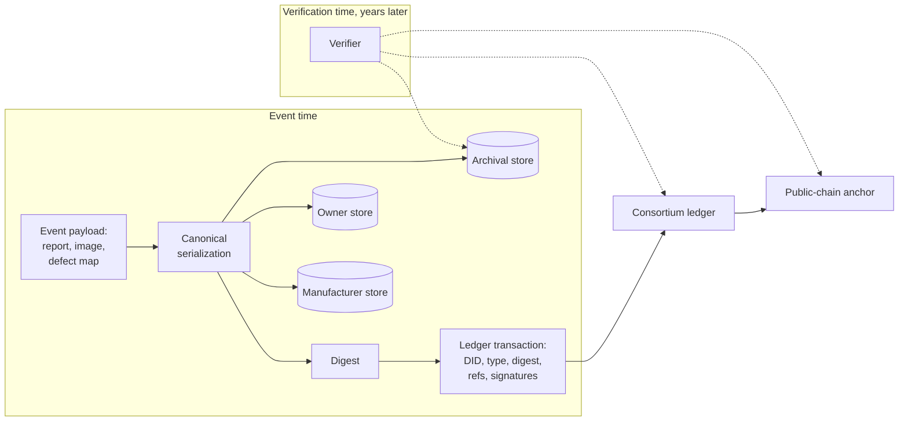
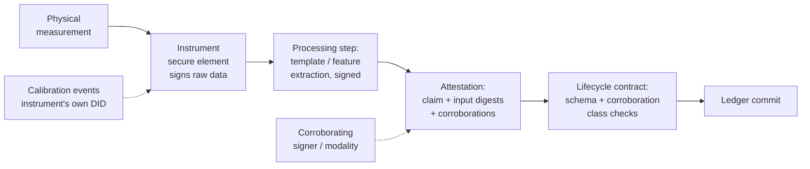

# Part II — Architecture {.unnumbered}

# Designing an Immutable Identity Layer for Energy Hardware

## What This Chapter Covers

Part I ended with a reference stack: claims over names over records over bindings.
This chapter designs the record layer of that stack as an engineer would — starting
from workload numbers rather than platform enthusiasms. It derives the on-chain/
off-chain partition from the data volumes energy hardware actually produces; specifies
manufacture-time identity issuance, where the whole system's trust originates; designs
the oracle layer that carries physical measurements onto the ledger; and closes with
the decision discipline of Section 4.6 — the conditions under which the honest answer
is that no ledger is needed at all.

## 4.1 The Workload, Quantified First

Architecture follows workload. Table 4.1 estimates the data a single utility-scale PV
plant generates, separated into the two categories that Section 3.2 distinguished:
sparse evidential events and continuous operational telemetry.

**Table 4.1** Approximate data workload for a 100 MW PV plant (~250,000 modules,
~800 string inverters), by record category.

| Record category | Typical size | Frequency | Volume over 25 yr | Evidential? |
|---|---|---|---|---|
| Identity registrations | ~1 kB/unit | Once | ~250 MB | Yes |
| Lifecycle events (install, transfer, maintenance…) | ~1–2 kB | ~0.1–1 per unit-year | ~10–60 GB | Yes |
| Condition records: EL images | 5–20 MB each | Commissioning + sampled inspections | ~1–50 TB | Yes (payload) |
| Condition records: defect maps (Ch. 6) | 10–100 MB each | Enrollment + escalated verifications | ~2–25 TB | Yes (payload) |
| Inverter telemetry | ~1 kB/reading | Every 1–15 min per device | ~10–100 TB | Rarely |
| Meter / SCADA data | varies | Seconds–minutes | ~10+ TB | Settlement only |

Two conclusions are immediate and drive everything else in the chapter. First, the
*evidential event stream* — the records that need consensus ordering and immutability
— is small: kilobyte-scale entries at per-unit frequencies of roughly once a year.
Aggregated even across a national fleet of millions of devices this is tens of
transactions per second, comfortably within BFT consortium throughput (Chapter 7 does
this arithmetic carefully). Second, the *payloads* — images, defect maps, telemetry —
are five to seven orders of magnitude larger and must not touch the ledger. Any
design that stores a megabyte on a replicated ledger is misdesigned; any design that
fails to *commit* to that megabyte on the ledger loses the integrity guarantee. The
resolution is the oldest pattern in the field, applied with discipline.

## 4.2 The On-Chain/Off-Chain Partition

The rule this book applies: **the ledger stores commitments, references, and state;
off-chain stores hold content.** Concretely, each evidential record on the consortium
ledger carries:

- the asset DID and event type (schema of Chapter 5);
- a **digest** of the canonical serialization of the full event payload;
- a **content reference** — a locator for the payload in one or more off-chain
  stores, deliberately separated from the digest so that storage can migrate over
  decades without touching the evidence;
- the submitter's signature and the oracle attestations of Section 4.5.

Verification then composes: fetch payload from any store, hash it, compare against
the on-chain digest, check the digest's inclusion in an anchored block (Section 2.2's
Merkle machinery). The payload store needs *availability*, not trustworthiness — a
malicious store can withhold data but cannot alter it undetectably.

Withholding, however, is a real failure mode with a thirty-year horizon, and it gets
a design answer, not a shrug. The pilot architecture of Chapter 11 uses **replicated
custody with divergent interests**: every evidential payload is held by at least the
party who benefits from it (the owner), a party adverse to it (the warranty-issuing
manufacturer), and a neutral archival service under consortium contract, with
periodic *proof-of-retrievability* challenges — a store must respond to random
challenge reads, and the challenge results themselves are logged as ledger events.
Content-addressed storage networks can supplement this arrangement; they should not
replace it, because "someone, somewhere, probably pins it" is not an evidential
custody policy.

**Figure 4.1** The partition and its verification path. Solid arrows are the write
path at event time; dashed arrows are the read/verification path years later.



One subtlety earns a paragraph because it costs projects months when missed:
**canonical serialization**. A digest commits to bytes, and "the same" JSON document
has many byte representations. The event schema must fix one — a deterministic field
order, encoding, and number representation (the pilot uses deterministic CBOR) — and
the canonicalization procedure must itself be versioned in the record, because in
year 19 someone will need to re-derive the digest of a year-2 event with year-2 rules.

## 4.3 Manufacture-Time Identity Issuance

Everything in the system inherits from the moment of registration: if the wrong
object is enrolled — or the right object enrolled by the wrong party — no downstream
cryptography repairs it. This is the system's *trusted setup*, and it deserves the
same scrutiny that phrase attracts elsewhere in cryptography.

The issuance sequence, shown in Figure 4.2 for the hard case (a passive module;
the active-device variant substitutes key generation in the secure element for
fingerprint enrollment):

1. **Physical completion.** The laminate exits lamination and framing; its structure
   — grain patterns, as-built defect distribution — is now fixed.
2. **Enrollment measurement.** In-line instrumentation (factory EL at minimum;
   quantum defect mapping per Chapter 6 where deployed) captures the structural
   fingerprint *as part of the existing QA flow* — the measurement most factories
   already perform becomes the enrollment measurement, which is what makes the
   economics close.
3. **Template extraction and commitment.** The fingerprint template is computed,
   serialized canonically, digested; payload goes to the off-chain stores.
4. **DID creation.** A registration transaction creates the asset DID, binding
   together: template digest, factory flash-test VC, batch and BOM references, and
   the manufacturer as initial controller.
5. **Cross-attestation.** The registration is co-signed by the in-line instrument's
   own device identity (instruments are assets too, with their own DIDs and
   calibration lifecycles — the recursion is deliberate and bottoms out in
   accredited calibration, Section 4.5) and, where the deployment warrants it, by an
   independent inspection agent's sampling attestation.

**Figure 4.2** Manufacture-time issuance for a passive asset. The gray band marks the
trusted-setup boundary: everything below it is cryptographically verifiable ever
after; everything above it is procedural and must be defended procedurally.

```mermaid
sequenceDiagram
    participant P as Production line
    participant I as Enrollment instrument (own DID)
    participant M as Manufacturer registrar key
    participant S as Off-chain stores
    participant L as Consortium ledger
    P->>I: Unit leaves lamination (structure fixed)
    I->>I: Measure; extract template
    I->>S: Store template payload (replicated)
    I->>M: Template digest + instrument signature
    M->>L: Registration tx: new DID, digest,<br>flash-test VC, batch refs
    L->>L: Registry contract: uniqueness check,<br>schema check, commit
    L-->>M: DID live; controller = manufacturer
    Note over P,L: Trusted-setup boundary — attacks above this line<br>are procedural (Ch. 8: enrollment-time substitution)
```

Three design questions recur in practice:

**Who may register?** The registrar role must be *permissioned but plural*: any
accredited manufacturer registers its own production, under a consortium accreditation
scheme with audit rights. A single global registrar reconstructs Section 1.5's central
registry; fully open registration invites identity squatting and spam. The middle
position — accredited registrars, revocable accreditation, all registrations publicly
attributable — mirrors how type certification already works in the sector and grafts
onto existing institutions (Chapter 10 discusses the governance contracts).

**What about the existing fleet?** Retroactive enrollment — registering fielded assets
at their next inspection touchpoint — necessarily carries weaker provenance: the
record attests "this structure, observed on this date, controller X," with no factory
history. The schema must represent this honestly as a distinct registration class
rather than laundering it into factory-grade provenance; buyers and insurers then
price the difference, which is exactly what markets with good information do
(Chapter 13).

**What if the manufacturer is the adversary?** Ghost-shift production (Section 1.4.1)
is registered by the same key as legitimate production. The ledger does not solve
this — it *scopes* it: over-registration becomes visible in reconciliation against
declared capacity and bills of materials, misgrading becomes contestable because the
enrollment measurement is independently re-verifiable, and a manufacturer caught once
has signed the evidence itself. Deterrence through attributability rather than
prevention through cryptography; Chapter 8 is candid about the residual risk.

## 4.4 Anchoring: Renting Immutability the Consortium Cannot Give Itself

Section 2.4 introduced the hybrid pattern; here is its mechanism. At a fixed interval
(the pilot uses six hours), an anchoring contract computes a digest over the
consortium ledger's new block headers and submits it in a transaction to a large
public proof-of-stake chain. The consortium thereby publishes, irrevocably and
world-readably, a commitment to its own history — a few dozen bytes disclosing
nothing (Chapter 10 confirms the privacy analysis) and costing cents.

What this buys, precisely: any party holding a record with its Merkle proof can
verify it against the *public* anchor without trusting any consortium node — and a
consortium that rewrites history after the fact cannot make its rewritten chain match
anchors already embedded in a chain it does not control. What it does not buy:
protection within the anchoring interval (a rewrite inside six hours beats the
anchor; interval choice is a risk parameter, not a constant of nature), and
protection against a consortium that forks *before* anchoring (mitigated by anchoring
to two independent public chains, which the pilot does). Anchor targets are
themselves assets with lifecycles — chains die, fork, and change fee regimes — so the
anchoring contract treats its target list as replaceable configuration under
governance, a small instance of the longevity discipline Chapter 9 generalizes.

## 4.5 Oracle Design: The Sensing-to-Ledger Interface

Chapter 2 established that contracts cannot observe the world; every physical fact
enters the ledger as a *claim signed by something*. The oracle layer is therefore not
middleware plumbing — it is the point where the garbage-in permanence problem is
either solved or permanently embedded. The design discipline this book applies has
three rules.

**Rule 1: Push signing to the sensor.** Every attestation should be signed as close
to the physical measurement as the hardware allows — ideally by a secure element
inside the instrument (the EL camera, the flash tester, the defect-mapping scanner,
the inverter reporting its own commissioning self-test), so that the signed object is
the raw measurement, not a technician's transcription of it. Between instrument and
ledger there may legitimately be processing (template extraction, compression); each
processing step signs its output and references its input's digest, forming a
*computation provenance chain* the verifier can re-execute. An unsigned hop is where
manipulation lives (Section 8.4 catalogs the attacks).

**Rule 2: Corroborate in proportion to incentive.** A single signed sensor is a
single point of trust. Where the attested fact carries money — commissioning dates
that start warranties, condition records that settle claims — the schema requires
corroboration: a second instrument, a different physical modality (Section 3.6's
composite identity), or a party with adverse interests co-signing. The lifecycle
schema of Chapter 5 marks, per event type, the corroboration class required; the
state-machine contract enforces it at write time.

**Rule 3: Instruments are assets.** Every attesting instrument has its own DID,
calibration lifecycle events, and controller history. A verifier evaluating a
year-12 condition record can check that the instrument that produced it was in
calibration, by whom, against what reference. The recursion terminates in national
metrology institutes and accreditation bodies — which is where physical measurement
trust has always terminated; the architecture makes the chain explicit and checkable
rather than inventing a new root.

**Figure 4.3** The oracle layer as a computation provenance chain. Every arrow
carries a signature; every box references its input digests.



## 4.6 When Not to Use a Ledger

The decision procedure, stated as the questions an architect should answer *before*
platform selection — this book's credibility on the affirmative case rests on being
serious about the negative one:

1. **Is there more than one writer whose interests conflict?** A single vertically
   integrated owner-operator that manufactures, installs, and self-insures has no
   adversarial counterparty; a signed, append-only database with external timestamping
   gives it everything a ledger would, cheaper.
2. **Must records outlive the institutions?** If every record's useful life is
   shorter than the vendor relationship (operational telemetry, most SCADA), the
   evidential spine adds nothing — keep it in the twin.
3. **Is there a binding mechanism?** Without Chapter 3's binding layer, the ledger
   preserves unverifiable claims. Build binding first or not at all.
4. **Can governance be constituted?** A consortium that cannot agree on registrar
   accreditation and dispute procedures will not be saved by consensus algorithms;
   the protocol automates agreement, it does not manufacture it.

Where all four answers are yes — which Part I argued is precisely the situation of
multi-party, multi-decade, high-value distributed energy assets — the architecture of
this chapter applies. Where any answer is no, the honest recommendation is the
simpler system, and Chapter 13's cost model gives the quantitative version of the
same discipline.

## 4.7 Chapter Summary

The identity layer's design falls out of its workload: a small evidential event
stream that belongs on a BFT consortium ledger, and bulk measurement payloads that
belong in replicated off-chain custody bound by on-chain digests under canonical
serialization. Trust originates at manufacture-time issuance — enrollment folded into
existing factory QA, plural accredited registrars, honest labeling of retroactive
enrollments — and is maintained by an oracle layer built on three rules: sign at the
sensor, corroborate in proportion to incentive, and treat instruments as assets with
their own verifiable lifecycles. Public-chain anchoring rents an immutability
stronger than any consortium's promise for cents a day. The event stream this layer
carries needs a formal vocabulary — which events exist, what each must contain, and
which transitions are legal. That vocabulary is Chapter 5.

## References and Further Reading

1. Eberhardt, J., and S. Tai. "On or Off the Blockchain? Insights on Off-Chaining
   Computation and Data." In *Service-Oriented and Cloud Computing (ESOCC 2017)*,
   3–15. Springer, 2017.
2. Haber, S., and W. S. Stornetta. "How to Time-Stamp a Digital Document." *Journal
   of Cryptology* 3, no. 2 (1991): 99–111.
3. Juels, A., and B. S. Kaliski. "PORs: Proofs of Retrievability for Large Files."
   In *Proceedings of the 14th ACM Conference on Computer and Communications
   Security (CCS '07)*, 584–597. ACM, 2007.
4. Bormann, C., and P. Hoffman. *Concise Binary Object Representation (CBOR).*
   RFC 8949, IETF, 2020 (deterministic encoding, §4.2).
5. Al-Breiki, H., M. H. U. Rehman, K. Salah, and D. Svetinovic. "Trustworthy
   Blockchain Oracles: Review, Comparison, and Open Research Challenges." *IEEE
   Access* 8 (2020): 85675–85685.
6. International Organization for Standardization. *ISO/IEC 17025: General
   Requirements for the Competence of Testing and Calibration Laboratories.*
   Geneva: ISO.
7. Wüst, K., and A. Gervais. "Do You Need a Blockchain?" In *2018 Crypto Valley
   Conference on Blockchain Technology (CVCBT)*, 45–54. IEEE, 2018.

\newpage
