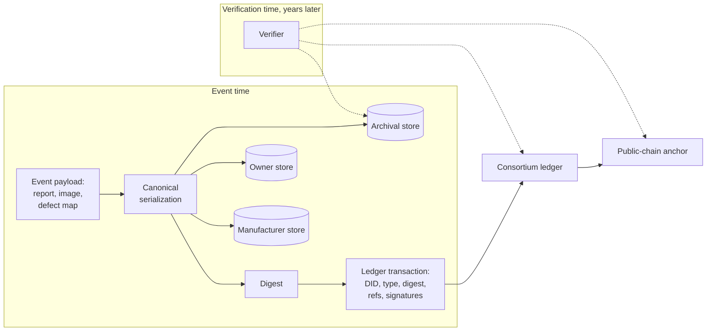
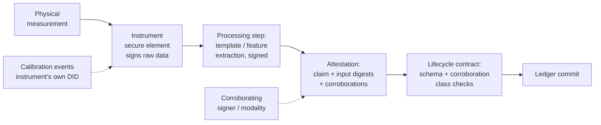
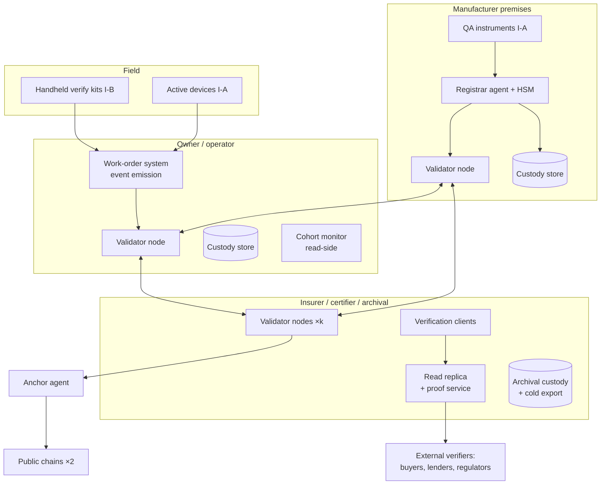

# Part II — Architecture {.unnumbered}

# Designing an Immutable Identity Layer for Energy Hardware

## What This Chapter Covers

Part I ended with a reference stack: claims over names over records over bindings.
This chapter designs the record layer of that stack as an engineer would — starting
from workload numbers rather than platform enthusiasms. It derives the on-chain/
off-chain partition from the data volumes energy hardware actually produces, and
converts the workload into a requirements table with derivations; specifies
manufacture-time identity issuance, where the whole system's trust originates,
down to the enrollment station's exception paths; details the anchoring
mechanism whose public commitments outlive every institution in the system;
designs the oracle layer that carries physical measurements onto the ledger,
including the instrument trust grades a real fleet forces; walks the decision
discipline of Section 4.6 — the conditions under which the honest answer is
that no ledger is needed at all — through two worked negatives; and closes
with the deployment topology, because logical architecture that never lands on
servers decides nothing.

## 4.1 The Workload, Quantified First

Architecture follows workload. The first-wave projects of Section 1.5 mostly
inverted this order — platform first, workload discovered in production — and
paid for it twice: once in re-architecture when the volumes arrived, and once
in credibility when the re-architecture became the story. This chapter
therefore begins with numbers that any reader can check against their own
fleet. Table 4.1 estimates the data a single utility-scale PV plant generates,
separated into the two categories that Section 3.2 distinguished: sparse
evidential events and continuous operational telemetry. The specific values
carry error bars of at least a factor of two in either direction — inspection
policies, image resolutions, and telemetry cadences vary — but the
*ratios* between rows, which is what the architecture is built on, are robust
across any plausible parameter choice.

**Table 4.1** Approximate data workload for a 100 MW PV plant (~250,000 modules,
~800 string inverters), by record category.

| Record category | Typical size | Frequency | Volume over 25 yr | Evidential? |
|---|---|---|---|---|
| Identity registrations | ~1 kB/unit | Once | ~250 MB | Yes |
| Lifecycle events (install, transfer, maintenance…) | ~1–2 kB | ~0.1–1 per unit-year | ~10–60 GB | Yes |
| Condition records: EL images | 5–20 MB each | Commissioning + sampled inspections | ~1–50 TB | Yes (payload) |
| Condition records: defect maps (Ch. 6) | 10–100 MB each | Enrollment + escalated verifications | ~2–25 TB | Yes (payload) |
| Inverter telemetry | ~1 kB/reading | Every 1–15 min per device | ~10–100 TB | Rarely |
| Meter / SCADA data | varies | Seconds–minutes | ~10+ TB | Settlement only |

The "rarely" in the telemetry row deserves its qualification, because the
exceptions define a useful pattern. Telemetry becomes evidential at *decision
boundaries*: the week of production data bracketing a warranty claim, the
irradiance-and-output series that substantiates a performance-guarantee
shortfall, the state-of-charge history surrounding a battery incident. The
architecture's answer is not to ledger the stream but to let any party
*promote* a telemetry extract into evidence when a boundary approaches: the
extract is serialized canonically, digested, committed as a condition-record
payload with the promoting party's signature, and thereafter enjoys every
guarantee the evidential stream has — while the other 99.99% of the stream
lives and dies in the operational tier. Promotion is cheap, deliberate, and
attributable, which is exactly what an evidence rule should be. (Wind's
load-milestone aggregates in Chapter 12 industrialize the same idea on a
schedule.)

Two conclusions are immediate and drive everything else in the chapter. First, the
*evidential event stream* — the records that need consensus ordering and immutability
— is small: kilobyte-scale entries at per-unit frequencies of roughly once a year.
Aggregated even across a national fleet of millions of devices this is tens of
transactions per second, comfortably within BFT consortium throughput (Chapter 7 does
this arithmetic carefully). Second, the *payloads* — images, defect maps, telemetry —
are five to seven orders of magnitude larger and must not touch the ledger. Any
design that stores a megabyte on a replicated ledger is misdesigned; any design that
fails to *commit* to that megabyte on the ledger loses the integrity guarantee. The
resolution is the oldest pattern in the field, applied with discipline.

### 4.1.1 From Workload to Requirements

Before drawing boxes, the workload converts into a requirements statement — the
document a procurement process should demand and rarely gets. Table 4.2 states
the identity layer's non-functional requirements with their derivations, because
a requirement without a derivation is a preference.

**Table 4.2** Non-functional requirements for the identity layer, derived from
the Part I analysis and the Table 4.1 workload.

| Requirement | Target | Derived from |
|---|---|---|
| Write finality | Deterministic; ≤ 1 min at custody checkpoints | Loading-dock dwell times; legal character of transfers (§2.3) |
| Write throughput | ~10² tx/s sustained; 10³–10⁴ burst via batching | Table 4.1 aggregated nationally; burst analysis (§7.2) |
| Read availability | ≥ 99.9% for headers/proofs; verification never blocked on consortium liveness | Verification is the product (§6.6); resolution independence (§3.5) |
| Record durability | Full evidential stream ≥ 40 yr, format-migratable | Asset life + dispute tail (§1.3) |
| Payload durability | ≥ 3 organizationally independent replicas; annual loss probability < 10⁻⁶ per payload | Adverse-interest custody argument (§4.2) |
| Confidentiality | Envelope: consortium-visible; payload: authorized parties; public: digests only | Three-zone requirement (Ch. 10) |
| Cryptographic agility | All algorithms versioned per record; migration without record loss | Ch. 9 patterns P1–P4 |
| Enrollment cost | ≤ USD 0.10 marginal per module at Tier 0 | Unit economics (§1.3); factory-QA integration (§4.3) |
| Governance latency | Schema/parameter changes in weeks; emergency key revocation in hours | Pilot experience (Ch. 11); F9/F10 response (Ch. 8) |

Two of these rows kill more platform candidates than any benchmark. The
*durability* row eliminates every design whose record format, key registry, or
resolution service is proprietary to a vendor — not because vendors are
malicious but because forty years exceeds the design life of vendors. And the
*enrollment cost* row eliminates every design that requires new per-unit
hardware or per-unit human handling at manufacture, which is most of what has
been marketed as "blockchain asset tracking." An architecture that survives
both rows has, in practice, already committed to the shape this chapter draws:
open formats, consortium operation, commitments on-chain, bulk data off-chain,
and enrollment folded into measurements the factory already makes.

## 4.2 The On-Chain/Off-Chain Partition

The rule this book applies: **the ledger stores commitments, references, and state;
off-chain stores hold content.** The rule admits no exceptions for convenience —
not for "small" payloads, not for fields a dashboard would like to query, not
for data someone promises will never grow — because every exception becomes a
precedent, and the precedents compound into exactly the bloated,
part-evidential, part-operational hybrid that neither chapter of requirements
can then be verified against. Concretely, each evidential record on the
consortium ledger carries:

- the asset DID and event type (schema of Chapter 5);
- a **digest** of the canonical serialization of the full event payload;
- a **content reference** — a locator for the payload in one or more off-chain
  stores, deliberately separated from the digest so that storage can migrate over
  decades without touching the evidence;
- the submitter's signature and the oracle attestations of Section 4.5, each
  carrying its algorithm-policy reference so that verification decades later
  evaluates the signature against the rules in force when it was made.

Verification then composes: fetch payload from any store, hash it, compare against
the on-chain digest, check the digest's inclusion in an anchored block (Section 2.2's
Merkle machinery). The payload store needs *availability*, not trustworthiness — a
malicious store can withhold data but cannot alter it undetectably. This
one-way dependency is what makes the whole partition safe to operate across
organizational boundaries: the consortium never has to audit a store's
software, vet its administrators, or trust its operator's intentions, because
the store holds no authority — only obligations, which the retrievability
regime below measures.

Withholding, however, is a real failure mode with a thirty-year horizon, and it gets
a design answer, not a shrug. The pilot architecture of Chapter 11 uses **replicated
custody with divergent interests**: every evidential payload is held by at least the
party who benefits from it (the owner), a party adverse to it (the warranty-issuing
manufacturer), and a neutral archival service under consortium contract, with
periodic *proof-of-retrievability* challenges — a store must respond to random
challenge reads, and the challenge results themselves are logged as ledger events.
Content-addressed storage networks can supplement this arrangement; they should not
replace it, because "someone, somewhere, probably pins it" is not an evidential
custody policy.

**Figure 4.1** The partition and its verification path. Solid arrows are the write
path at event time; dashed arrows are the read/verification path years later.



One subtlety earns a paragraph because it costs projects months when missed:
**canonical serialization**. A digest commits to bytes, and "the same" JSON document
has many byte representations. The event schema must fix one — a deterministic field
order, encoding, and number representation (the pilot uses deterministic CBOR) — and
the canonicalization procedure must itself be versioned in the record, because in
year 19 someone will need to re-derive the digest of a year-2 event with year-2 rules.

### 4.2.1 Content References and Storage Migration

The deliberate separation of *digest* (what the payload is) from *content
reference* (where a copy currently lives) is the design's concession to time,
and its mechanics deserve specification. A content reference in this
architecture is a structured locator: a custody-store identifier (itself a DID —
stores are parties with obligations), a retrieval protocol hint, and an opaque
store-local handle. References are *mutable metadata* maintained off the
critical path: when a store migrates from one object system to another, or a
custodian exits and its holdings transfer, the references update through
ordinary signed custody-administration events, while the digests — the
evidence — never change. A verifier resolves references best-effort and in any
order; *any* copy that hashes correctly is as good as every other, which is the
liberating property of content addressing: the architecture needs to know what
is true, not which server is honest.

Format longevity is the quieter half of payload durability, and it is a
curation obligation, not a cryptographic one. A defect map committed in 2027
must be *interpretable* in 2050: its digest guarantees the bytes, but the bytes
are useless if no software can parse the format or no document defines the
measurement geometry. The custody policy therefore requires that every payload
class carry a self-describing envelope (format identifier, schema version,
units, coordinate conventions) and that the consortium's schema registry
archive the format specifications themselves as first-class payloads —
specifications, being documents, get digests and replicas like everything
else. Where a format is proprietary (instrument vendors are fond of this), the
accreditation criteria for I-A instruments require either an open export
format or a specification escrow. Digital preservation practice adds the
last rule: prefer boring formats. Losslessly compressed raster images with
documented metadata will be readable in 2060; this decade's clever
container format may not be.

The custody policy quantifies "replicated with divergent interests." Each
payload class carries a minimum replica set defined by role, not by name: one
copy with the *beneficiary* of the record, one with a party *adverse* to it,
one with a *neutral archival* custodian under consortium contract — plus, for
high-value classes, a cold export to write-once media on a fixed cadence. The
weekly proof-of-retrievability challenge works as follows: the audit contract
derives, from the anchored randomness of the interval, a sample of payload
digests per store; the store must return, within the response window, either
the payload bytes or a compact retrievability proof over them; responses are
hashed against the ledger's digests, and the outcome — pass, fail, or timeout —
is written as an audit event against the store's DID. Three consecutive
failures trigger the re-replication procedure: the surviving stores fan out
copies to a replacement custodian, and the failed store's SLA machinery
(Chapter 10's governance) takes over from there. None of this is exotic; all of
it must be *contractual and mechanical* rather than aspirational, because the
failure it defends against — quiet archival rot discovered at dispute time —
is the single most common way long-horizon record systems actually fail.

The economics close comfortably. At Table 4.1's volumes, a 100 MW plant's
lifetime evidential payloads run tens of terabytes; three-way replicated
object storage plus periodic cold export prices in the low hundreds of
thousands of dollars over 25 years (Chapter 7 itemizes), which is dominated by
— and should be compared against — the cost of a single major dispute
conducted *without* the evidence. The design also deliberately leaves room for
content-addressed storage networks as a *fourth, supplementary* replica class
where deployments want them: their global deduplication and retrieval
convenience are real, and their weakness — no enforceable custody obligation —
is exactly what the contracted replica set already covers.

Confidentiality at the payload layer needs one design decision made early and
consciously: payloads are encrypted at rest in every custody store, and the
question is who holds the keys across forty years. The pattern adopted here is
*envelope encryption with escrowed class keys*: each payload is encrypted
under its own data key; data keys are wrapped under per-payload-class keys
held by the payload's access authority (the owner for condition records, the
manufacturer for factory data); and the class keys are escrowed, under
threshold custody split across consortium-designated parties, against the two
failure modes that pure owner-held encryption invites — the owner that
dissolves taking its keys with it, and the owner that "loses" keys
strategically when the evidence turns adverse. Threshold escrow is a
governance object like everything else in this layer: its release conditions
(dispute order, regulatory demand, custodian death) are written, its releases
are logged as events, and its existence is disclosed to every party whose data
it covers. The alternative — unencrypted payloads under access control — is
simpler and defensible inside a single jurisdiction with strong custody
contracts; the encrypted design earns its complexity the moment payloads
cross borders or custody outlives counterparties, which is to say, in every
deployment this book actually contemplates.

## 4.3 Manufacture-Time Identity Issuance

Everything in the system inherits from the moment of registration: if the wrong
object is enrolled — or the right object enrolled by the wrong party — no downstream
cryptography repairs it. This is the system's *trusted setup*, and it deserves the
same scrutiny that phrase attracts elsewhere in cryptography.

The issuance sequence, shown in Figure 4.2 for the hard case (a passive module;
the active-device variant substitutes key generation in the secure element for
fingerprint enrollment):

1. **Physical completion.** The laminate exits lamination and framing; its structure
   — grain patterns, as-built defect distribution — is now fixed. Enrollment
   any earlier (at cell sort, at stringing) would fingerprint components that
   subsequent process steps still alter; any later adds handling between
   measurement and identity that Section 8.3's substitution attack exploits.
   The moment is not arbitrary: it is the earliest point at which the
   fingerprint is final and the latest at which the factory's process custody
   is unbroken.
2. **Enrollment measurement.** In-line instrumentation (factory EL at minimum;
   quantum defect mapping per Chapter 6 where deployed) captures the structural
   fingerprint *as part of the existing QA flow* — the measurement most factories
   already perform becomes the enrollment measurement, which is what makes the
   economics close.
3. **Template extraction and commitment.** The fingerprint template is computed,
   serialized canonically, digested; payload goes to the off-chain stores.
4. **DID creation.** A registration transaction creates the asset DID, binding
   together: template digest, factory flash-test VC, batch and BOM references, and
   the manufacturer as initial controller.
5. **Cross-attestation.** The registration is co-signed by the in-line instrument's
   own device identity (instruments are assets too, with their own DIDs and
   calibration lifecycles — the recursion is deliberate and bottoms out in
   accredited calibration, Section 4.5) and, where the deployment warrants it, by an
   independent inspection agent's sampling attestation.

**Figure 4.2** Manufacture-time issuance for a passive asset. The gray band marks the
trusted-setup boundary: everything below it is cryptographically verifiable ever
after; everything above it is procedural and must be defended procedurally.

```mermaid
sequenceDiagram
    participant P as Production line
    participant I as Enrollment instrument (own DID)
    participant M as Manufacturer registrar key
    participant S as Off-chain stores
    participant L as Consortium ledger
    P->>I: Unit leaves lamination (structure fixed)
    I->>I: Measure; extract template
    I->>S: Store template payload (replicated)
    I->>M: Template digest + instrument signature
    M->>L: Registration tx: new DID, digest,<br>flash-test VC, batch refs
    L->>L: Registry contract: uniqueness check,<br>schema check, commit
    L-->>M: DID live; controller = manufacturer
    Note over P,L: Trusted-setup boundary — attacks above this line<br>are procedural (Ch. 8: enrollment-time substitution)
```

### 4.3.1 The Enrollment Station as a Production Asset

The sequence above reads cleanly on paper; its engineering lives in the
enrollment station, and the station's design decides whether the factory
tolerates the system at all. Modern module lines run at a takt of 20–30 seconds
per unit per lane. The Tier-0 enrollment path must therefore add *zero* serial
time: it rides the EL image and flash test the QA cell already captures, with
template extraction running as a parallel compute step whose 2–3 seconds of
processing overlap the next unit's handling. The only new physical hardware in
the baseline deployment is none at all — the deliverable is firmware and
integration: the existing EL camera and flash tester gain secure-element signing
(a retrofit board or a next-generation instrument purchase), and the line's
manufacturing-execution system gains the registrar agent that assembles
envelopes, manages batches, and holds the registrar key material in an HSM.

Exception handling is where enrollment stations earn or lose the factory's
trust, and three cases dominate. *Re-tests*: a unit that fails flash test,
is reworked, and re-tested must not generate two identities — the station keys
enrollment on the physical unit's transit through final QA, and rework loops
produce measurement-superseded events under one DID, preserving the rework
history (which is itself quality evidence the manufacturer may later want).
*Instrument faults mid-shift*: a station whose signing element or camera fails
falls back to *deferred enrollment* — units flow to a buffer and are enrolled
on a backup station — rather than halting the line; what is never permitted is
unsigned enrollment, because an unsigned enrollment is a hole in the trusted
setup that no later signature repairs. *Label–structure mismatches*: the
station's final act is printing/verifying the unit's locator label against the
just-created DID; a mismatch (mis-fed label stock, duplicate print) quarantines
the unit automatically. Each exception path emits its own audit events; a
factory's exception statistics are themselves quality telemetry, and
Chapter 8's population-level reconciliation (D4) consumes them.

The registration's *composition references* — batch and BOM linkage — deserve
a sentence more than the sequence gave them. Each registration references the
cell batch identifiers, wafer lot references, and materials certificates
(encapsulant, backsheet, glass) that the factory's traceability system already
tracks for process control. The reference is a digest of the factory's
composition record, not a copy of it — the factory's upstream traceability
remains its own system — but the digest makes the composition claim *fixed and
auditable*: when Section 1.4.5's supply-chain regimes ask, two years later,
which polysilicon lots fed a shipment, the answer is committed evidence rather
than a reconstructed spreadsheet, and when a batch-level defect emerges
(a bad EVA lot, a cell-line excursion), the affected population is a ledger
query rather than a recall guess.

Three design questions recur in practice:

**Who may register?** The registrar role must be *permissioned but plural*: any
accredited manufacturer registers its own production, under a consortium accreditation
scheme with audit rights. A single global registrar reconstructs Section 1.5's central
registry; fully open registration invites identity squatting and spam. The middle
position — accredited registrars, revocable accreditation, all registrations publicly
attributable — mirrors how type certification already works in the sector and grafts
onto existing institutions (Chapter 10 discusses the governance contracts).

**What about the existing fleet?** Retroactive enrollment — registering fielded assets
at their next inspection touchpoint — necessarily carries weaker provenance: the
record attests "this structure, observed on this date, controller X," with no factory
history. The schema must represent this honestly as a distinct registration class
rather than laundering it into factory-grade provenance; buyers and insurers then
price the difference, which is exactly what markets with good information do
(Chapter 13). Operationally, retroactive enrollment rides the same touchpoints
the fleet already has: drone or handheld EL during scheduled inspections,
repowering and repair visits, and — the highest-yield moment — the diligence
campaigns of ownership transfers, where a buyer is already paying for
condition measurement and the marginal cost of turning that measurement into
an enrollment is a signature and an event. The one procedural difference from
factory issuance matters enough to state: the enrolling party at a field
touchpoint is typically *not* the manufacturer, so the registration's initial
controller is the current owner, the manufacturer's product claims enter (if
at all) as referenced credentials rather than co-signed facts, and any later
manufacturer endorsement of the retroactive identity — matching it to shipment
records, say — is its own attributable event that upgrades the record's
provenance class visibly rather than silently.

**What if the manufacturer is the adversary?** Ghost-shift production (Section 1.4.1)
is registered by the same key as legitimate production. The ledger does not solve
this — it *scopes* it: over-registration becomes visible in reconciliation against
declared capacity and bills of materials, misgrading becomes contestable because the
enrollment measurement is independently re-verifiable, and a manufacturer caught once
has signed the evidence itself. Deterrence through attributability rather than
prevention through cryptography; Chapter 8 is candid about the residual risk.

### 4.3.2 The Accreditation Lifecycle

Because registrar accreditation carries so much of the trusted setup, its
lifecycle deserves the same specification rigor as the assets'. Accreditation
is granted by the consortium's accreditation committee (composition and
adverse-interest rules in Chapter 10) against published criteria: demonstrated
enrollment-station conformance (instrument grades, exception handling, key
ceremony), a passed initial audit, insurance or bonding proportional to
registration volume, and acceptance of the audit covenant. The grant is a
ledger event carrying the registrar's role DID, its authorized scope (asset
classes, production sites, registration classes), validity interval, and the
algorithm policy under which its signatures bind.

In operation, accreditation is maintained by evidence rather than by renewal
paperwork: the registrar's exception-event statistics, reconciliation results
(registered volumes against declared capacity and materials purchases — the
D4 machinery of Chapter 8), and periodic on-site audits all accrue to its role
DID. Suspicion has graduated responses short of the nuclear option —
enhanced-audit status, scope restriction (a single line or site), mandatory
third-party co-signing — each a governed, ledger-visible event, because a
credible *intermediate* sanction is what makes the accreditation regime
enforceable in practice; committees hesitate to impose corporate death
sentences, and a regime whose only sanction is revocation converges on no
sanctions at all.

Revocation itself, when it comes, is engineered to be safe for everyone
downstream: it is prospective (registrations before the revocation event
remain valid — they were made under authority in force, and Chapter 9's
time-contextual verification applies), it triggers enhanced verification
sampling of the revoked registrar's recent back catalog rather than blanket
distrust, and it is public — visible in the governance-state digest that every
anchor carries. Succession (the registrar's business transfers, its keys
retire, its accreditation moves to an acquirer after fresh audit) uses the
same machinery with the polarity reversed. None of this is speculative
process design; it is the ISO/IEC 17025 accreditation culture the sector's
laboratories already live under, transcribed into events and made
machine-checkable.

## 4.4 Anchoring: Renting Immutability the Consortium Cannot Give Itself

Section 2.4 introduced the hybrid pattern; here is its mechanism. At a fixed interval
(the pilot uses six hours), an anchoring contract computes a digest over the
consortium ledger's new block headers and submits it in a transaction to a large
public proof-of-stake chain. The consortium thereby publishes, irrevocably and
world-readably, a commitment to its own history — a few dozen bytes disclosing
nothing (Chapter 10 confirms the privacy analysis) and costing cents. The
pattern's ancestry is worth acknowledging because it de-mystifies the design:
this is Haber and Stornetta's 1991 newspaper-timestamping construction
(Section 2.1.2) with the classified section replaced by a chain whose
append-only property is enforced by staked billions rather than by printed
archives — and, like the newspaper, the anchor's value comes entirely from
being *someone else's* immutable medium.

The anchor transaction's contents are worth specifying, because they are the
entire public interface of the consortium and will be parsed by strangers for
decades. Each anchor carries: the digest of the consortium chain's head header;
the interval's *range commitment* (first and last block heights covered, so
gaps are self-evident); a monotonically increasing anchor sequence number (so
*missing* anchors are detectable, not just altered ones); and the digest of the
current governance state — validator set, algorithm policy, schema versions —
so that governance changes are themselves publicly timestamped. The anchor is
posted from a consortium-controlled account whose key custody is a governance
matter, and the account's own history on the public chain becomes the
consortium's public heartbeat: a third party can monitor consortium liveness,
anchoring discipline, and governance-change cadence with no relationship to
the consortium whatsoever. The pilot's experience (Section 11.5) that external
counsel treated anchors as the decisive authenticity evidence begins here — the
anchor is the part of the system that requires no introduction and no trust.

Verification against an anchor, spelled out once: the verifier holds a record,
its Merkle proof into block \(B\), and the header sub-chain from \(B\) to the
anchored head \(H\); fetches the anchor transaction from the public chain
(or from an archived proof of it — public chains themselves provide inclusion
proofs against their own headers); recomputes the chain of digests; and
concludes that the record existed, in exactly these bytes, no later than the
anchor's public-chain timestamp. The conclusion requires trusting only the
public chain's consensus and the hash function — both of which are outside any
consortium member's control, which is the entire point.

What this buys, precisely: any party holding a record with its Merkle proof can
verify it against the *public* anchor without trusting any consortium node — and a
consortium that rewrites history after the fact cannot make its rewritten chain match
anchors already embedded in a chain it does not control. What it does not buy:
protection within the anchoring interval (a rewrite inside six hours beats the
anchor; interval choice is a risk parameter, not a constant of nature), and
protection against a consortium that forks *before* anchoring (mitigated by anchoring
to two independent public chains, which the pilot does). Anchor targets are
themselves assets with lifecycles — chains die, fork, and change fee regimes — so the
anchoring contract treats its target list as replaceable configuration under
governance, a small instance of the longevity discipline Chapter 9 generalizes.

The interval-choice arithmetic, since it is the one anchoring parameter with a
real trade-off: shorter intervals shrink the rewrite window and cost more; the
cost curve is nearly flat (a public-chain transaction per interval per target —
at four anchors daily to two chains, under USD 6,000 a year even at
conservative fee assumptions), while the risk curve depends on what can happen
inside a window. For this workload, an intra-window rewrite requires a
validator supermajority acting within hours of the events it falsifies — a
conspiracy with no time to form, against records whose submitters hold signed
receipts. The pilot's six-hour choice reflects that analysis, plus one
refinement worth copying: *event-triggered anchoring* for designated
high-value classes (plant-scale ownership transfers, adjudication filings),
where the anchor fires within minutes of the event rather than waiting for the
schedule. Anchoring is the cheapest component of the entire architecture; when
in doubt, anchor more.

## 4.5 Oracle Design: The Sensing-to-Ledger Interface

Chapter 2 established that contracts cannot observe the world; every physical fact
enters the ledger as a *claim signed by something*. The oracle layer is therefore not
middleware plumbing — it is the point where the garbage-in permanence problem is
either solved or permanently embedded. The design discipline this book applies has
three rules.

**Rule 1: Push signing to the sensor.** Every attestation should be signed as close
to the physical measurement as the hardware allows — ideally by a secure element
inside the instrument (the EL camera, the flash tester, the defect-mapping scanner,
the inverter reporting its own commissioning self-test), so that the signed object is
the raw measurement, not a technician's transcription of it. Between instrument and
ledger there may legitimately be processing (template extraction, compression); each
processing step signs its output and references its input's digest, forming a
*computation provenance chain* the verifier can re-execute. An unsigned hop is where
manipulation lives (Section 8.4 catalogs the attacks).

The rule's force is best seen in the failure it prevents. Consider the
commissioning IV-curve measurement in the world *without* Rule 1: the tester
displays values, a technician types them into a tablet app, the app's backend
formats a report, and the EPC's document system signs the PDF. Four hops, three
of them unsigned, and every one an opportunity — a mistyped digit, a "corrected"
outlier, a report template that silently rounds. The signed object, when one
finally appears, attests to the *document workflow*, not the measurement. Under
Rule 1 the tester itself signs `(raw curve, instrument DID, firmware digest,
timestamp, nonce)` at the moment of measurement; everything downstream can
reformat and summarize but never alter without breaking the chain. The
technician's role shifts from data channel to custodian — which is also, not
incidentally, a kinder job description.

**Rule 2: Corroborate in proportion to incentive.** A single signed sensor is a
single point of trust. Where the attested fact carries money — commissioning dates
that start warranties, condition records that settle claims — the schema requires
corroboration: a second instrument, a different physical modality (Section 3.6's
composite identity), or a party with adverse interests co-signing. The lifecycle
schema of Chapter 5 marks, per event type, the corroboration class required; the
state-machine contract enforces it at write time.

Corroboration design has a subtlety that pure redundancy thinking misses:
corroborators must fail *independently under the threat model*, not merely be
numerous. Two EL cameras owned, operated, and calibrated by the same contractor
corroborate each other against instrument fault and not at all against that
contractor's incentives; an EL camera plus the inverter's own string-level
electrical data corroborate across both instruments *and* interests. The schema
therefore expresses corroboration classes in terms of *independence
requirements* (distinct instrument controllers; distinct physical modalities;
adverse-interest signers) rather than signature counts — three signatures from
one conspiracy count as one.

**Rule 3: Instruments are assets.** Every attesting instrument has its own DID,
calibration lifecycle events, and controller history. A verifier evaluating a
year-12 condition record can check that the instrument that produced it was in
calibration, by whom, against what reference. The recursion terminates in national
metrology institutes and accreditation bodies — which is where physical measurement
trust has always terminated; the architecture makes the chain explicit and checkable
rather than inventing a new root.

### 4.5.1 Instrument Trust Grades

Not every instrument can carry a secure element, and the architecture should
say precisely what it does with the ones that cannot. Table 4.3 grades the
attestation sources a deployment will actually encounter, with the evidential
weight the schema assigns each.

**Table 4.3** Instrument trust grades and their treatment in the event schema.

| Grade | Description | Examples | Schema treatment |
|---|---|---|---|
| I-A | Sealed instrument, keys in secure element, attested firmware, accredited calibration chain | Factory flash testers, line EL cameras, defect-map scanners, revenue meters | Attestation accepted as instrument-grade; satisfies Class B alone |
| I-B | Instrument with device identity but soft key storage or unattested firmware | Most current field EL rigs, IV testers, drone payloads | Instrument-grade with downgrade flag; Class B requires an I-A corroborator or operator co-signature |
| I-C | Instrument with no identity; readings transcribed by an identified operator | Legacy testers, torque wrenches, visual inspection | Operator-grade: the *person* attests, instrument metadata recorded as claim; never sole support for Class C events |
| I-D | Self-reported device telemetry without hardware root | Consumer-grade monitoring, unattested gateways | Context only; excluded from evidential payloads |

The grades are deliberately migration-friendly: a deployment starts with the
I-B/I-C fleet it has, the schema records the grade honestly in every
attestation, and verifiers years later can weight evidence by the grade in
force at the time — while procurement policy ratchets the fleet toward I-A at
replacement cadence. What is never acceptable is grade laundering: an I-C
transcription presented as instrument attestation is a false statement *by the
operator*, attributably signed, which is exactly the deterrence Rule 3's
paper trail exists to create.

### 4.5.2 Oracle Anti-Patterns

Three recurring designs fail the rules subtly enough to deserve explicit
condemnation. The *trusted middleware oracle* — a vendor service that ingests
whatever instruments send it, "validates" the data, and signs the result under
its own platform key — violates Rule 1 by replacing the measurement's
provenance with the middleware's reputation; the platform becomes an
unauditable laundering point for every upstream manipulation, and its signing
key becomes the system's most valuable target. Middleware may transform and
enrich, but only as a *signed step in the chain*, never as the chain's origin.
The *committee oracle borrowed from DeFi* — several independent services
attesting to the same fact, majority wins — transplants poorly: it was built
for facts that are globally observable (market prices), whereas a module's EL
image is observable only by whoever holds the module, so the "independent"
observers either share one physical access (and are not independent) or
attest to hearsay. Physical-asset oracles get independence from *modalities
and interests* (Rule 2), not from replication of a single vantage point. And
the *human attestation app* — a technician's phone signing structured claims —
is not an anti-pattern in itself (it is grade I-C, honestly labeled) but
becomes one the moment its UX invites bulk confirmation: forty "confirm"
taps at the end of a shift produce forty signed statements and zero
observations. Event emission embedded in the work-order flow, one action per
physical act (the Chapter 11 lesson), is the difference between an oracle and
a liturgy.

**Figure 4.3** The oracle layer as a computation provenance chain. Every arrow
carries a signature; every box references its input digests.



## 4.6 When Not to Use a Ledger

The decision procedure, stated as the questions an architect should answer *before*
platform selection — this book's credibility on the affirmative case rests on being
serious about the negative one:

1. **Is there more than one writer whose interests conflict?** A single vertically
   integrated owner-operator that manufactures, installs, and self-insures has no
   adversarial counterparty; a signed, append-only database with external timestamping
   gives it everything a ledger would, cheaper.
2. **Must records outlive the institutions?** If every record's useful life is
   shorter than the vendor relationship (operational telemetry, most SCADA), the
   evidential spine adds nothing — keep it in the twin.
3. **Is there a binding mechanism?** Without Chapter 3's binding layer, the ledger
   preserves unverifiable claims. Build binding first or not at all.
4. **Can governance be constituted?** A consortium that cannot agree on registrar
   accreditation and dispute procedures will not be saved by consensus algorithms;
   the protocol automates agreement, it does not manufacture it.
5. **Do the records cross jurisdictions or data-protection regimes?** If every
   record, party, and dispute lives inside one legal system with a trusted
   registry institution (some national metering regimes approximate this), the
   institution-independence argument weakens and a regulated central registry
   with published audits may serve. Where assets, owners, and adjudications
   span borders — the normal case for manufactured energy hardware — no single
   jurisdiction's registry commands the necessary standing, and the
   multi-party architecture earns its cost. This question also selects the
   *topology*: multi-jurisdiction deployments should federate per Section 7.4
   rather than centralize, for reasons Chapter 10 makes legally concrete.

Where the answers are yes across the board — which Part I argued is precisely the
situation of multi-party, multi-decade, high-value distributed energy assets —
the architecture of this chapter applies. Where any answer is no, the honest
recommendation is the simpler system, and Chapter 13's cost model gives the
quantitative version of the same discipline.

Two worked negatives make the discipline concrete. *Case one:* a vertically
integrated utility develops, builds, owns, and operates its own plants with
in-house O&M, buys modules under long-term agreements with full factory data
access, and self-insures. Question 1 fails — there is no adversarial
counterparty in the record's life — and the right system is a signed,
append-only internal register with periodic external timestamping (a
notarization service, or indeed a bare public-chain anchor of its own database
digests) at a tenth of the governance cost. The honest consultant walks away
from this client, or rather, sells them the timestamping. *Case two:* a
residential solar installer wants "blockchain warranties" for marketing.
Questions 1 and 2 arguably pass (homeowners and installers do have adverse
interests over decades), but question 3 fails hard: no binding mechanism exists
at consumer economics for the installed base, so the ledger would immutably
record unverifiable claims about unverifiable hardware — garbage-in permanence
sold as a feature. The right first investment is enrollment tooling, not
consensus infrastructure. The pattern generalizes: when the answer to any
question is no, there is usually a *cheaper subset* of the architecture worth
having (signatures, timestamping, binding alone), and selling the whole stack
anyway is how the first wave earned its reputation.

## 4.7 Node Architecture and Deployment Topology

The chapter closes its constructive work with the deployment view — what
actually runs where — because architecture documents that stop at logical
layers leave every operational decision to the integrator, and several of
those decisions carry security weight.

**Figure 4.4** Deployment topology for a national-scale identity layer. Every
organization runs the components in its own box; nothing in the architecture
requires shared infrastructure beyond the protocols.



Four topology decisions deserve their rationale. **Validators live with their
institutions**, not in a shared cloud account: the consortium's fault tolerance
is institutional, and co-locating validators under one hosting contract quietly
converts \(f < n/3\) Byzantine tolerance into a single procurement decision —
the operational-centralization trap Chapter 10 warns about, in infrastructure
form. **Read replicas are promiscuous by design**: any party may operate one
from the public header stream plus consortium data-access agreements, proofs
make them trustless, and the architecture *wants* insurers and data vendors
running their own — read capacity and read independence grow together.
**Field equipment is a cache, not an authority**: handhelds and gateways hold
header checkpoints and asset bundles for offline verification, sync
opportunistically, and never hold write credentials beyond their operator's
own signing scope; a stolen handheld is an inconvenience, not an incident.
**The anchor agent is duplicated and dumb**: two independent implementations
at different members, each posting to both public chains; anchoring is the one
function where a silent common-mode bug would cost dearly and where redundancy
costs almost nothing.

Sizing, for planning purposes at national scale (the Chapter 7 model gives the
derivation): validator nodes are modest servers — the consensus workload is
tens of transactions per second of kilobyte envelopes — whose real requirements
are operational (monitored, patched, HSM-attached, twenty-year procurement
continuity); custody stores are ordinary object storage at low-petabyte fleet
scale; read replicas size to their query customers, not to the ledger. The
whole national deployment's compute footprint is smaller than a mid-size
bank's test environment, a fact worth stating because the sector's
first-wave skepticism priced blockchain infrastructure by cryptocurrency
precedents. The costs that matter are institutional — HSM ceremonies,
accreditation audits, custody contracts, governance — and they are the subject
of Chapters 10 and 13.

A failure walkthrough closes the topology, because resilience claims deserve a
scenario. Suppose, in year 8, the owner-side validator suffers a ransomware
incident and its custody store is encrypted by an attacker. Consensus
continues — fifteen of sixteen validators exceed the BFT quorum comfortably —
and the incident validator is expelled by governance event, rebuilt from an
epochal checkpoint (Section 7.3), and re-admitted after audit; total ledger
impact, none. The custody loss is likewise absorbed: every payload the owner
held exists at the manufacturer and archival replicas; the retrievability
audit detects the store's failure within its challenge cycle; re-replication
to a replacement store proceeds under the standing procedure; and the
attacker holds ciphertext (Section 4.2.1's encryption at rest) whose keys
lived in the owner's HSM, not on the encrypted volumes. The single genuinely
dangerous variant — the same incident at a store holding the *last* replica of
some payload class — is precisely what the divergent-interest replica policy
exists to make un-constructible, and the weekly audit turns "we assumed the
replicas existed" into "we measured that they did." Contrast the status-quo
counterfactual, in which the same ransomware event at an O&M contractor
deletes the only copy of a decade of inspection reports; the sector does not
have to imagine this scenario, because it happens.

## 4.8 Chapter Summary

The identity layer's design falls out of its workload, and the chapter has now
walked the full path from numbers to running systems. The workload analysis
(Table 4.1) split the record stream into a small evidential core and enormous
payloads, and Table 4.2 converted that split into requirements with
derivations — durability and enrollment cost being the rows that filter
platforms hardest. The on-chain/off-chain partition stores commitments and
state on a BFT consortium ledger and content in replicated custody with
divergent interests, disciplined by canonical serialization, mutable content
references over immutable digests, and weekly retrievability challenges with
contractual teeth. Trust originates at manufacture-time issuance — enrollment
folded into existing factory QA at zero marginal takt time, exception paths
that never permit unsigned enrollment, composition references that make
supply-chain claims auditable, plural accredited registrars, and honest
labeling of retroactive enrollments. Public-chain anchoring rents an
immutability stronger than any consortium's promise for cents a day, with
anchor contents designed to be parsed by strangers and event-triggered anchors
for the records that cannot wait. The oracle layer holds the whole
construction to the physical world through three rules — sign at the sensor,
corroborate in proportion to incentive with genuine independence, and treat
instruments as assets graded I-A through I-D. And the decision discipline of
Section 4.6, with its worked negatives, keeps the architecture honest about
when not to deploy it. The event stream this layer carries needs a formal
vocabulary — which events exist, what each must contain, and which transitions
are legal. That vocabulary is Chapter 5.

## References and Further Reading

1. Eberhardt, J., and S. Tai. "On or Off the Blockchain? Insights on Off-Chaining
   Computation and Data." In *Service-Oriented and Cloud Computing (ESOCC 2017)*,
   3–15. Springer, 2017. The systematic treatment of the partition pattern
   Section 4.2 applies.
2. Haber, S., and W. S. Stornetta. "How to Time-Stamp a Digital Document." *Journal
   of Cryptology* 3, no. 2 (1991): 99–111.
3. Juels, A., and B. S. Kaliski. "PORs: Proofs of Retrievability for Large Files."
   In *Proceedings of the 14th ACM Conference on Computer and Communications
   Security (CCS '07)*, 584–597. ACM, 2007.
4. Bormann, C., and P. Hoffman. *Concise Binary Object Representation (CBOR).*
   RFC 8949, IETF, 2020 (deterministic encoding, §4.2).
5. Al-Breiki, H., M. H. U. Rehman, K. Salah, and D. Svetinovic. "Trustworthy
   Blockchain Oracles: Review, Comparison, and Open Research Challenges." *IEEE
   Access* 8 (2020): 85675–85685.
6. International Organization for Standardization. *ISO/IEC 17025: General
   Requirements for the Competence of Testing and Calibration Laboratories.*
   Geneva: ISO.
7. Wüst, K., and A. Gervais. "Do You Need a Blockchain?" In *2018 Crypto Valley
   Conference on Blockchain Technology (CVCBT)*, 45–54. IEEE, 2018.
8. Consultative Committee for Space Data Systems. *Reference Model for an Open
   Archival Information System (OAIS).* CCSDS 650.0-M-3. The digital-preservation
   discipline behind Section 4.2.1's format-longevity rules.

\newpage
