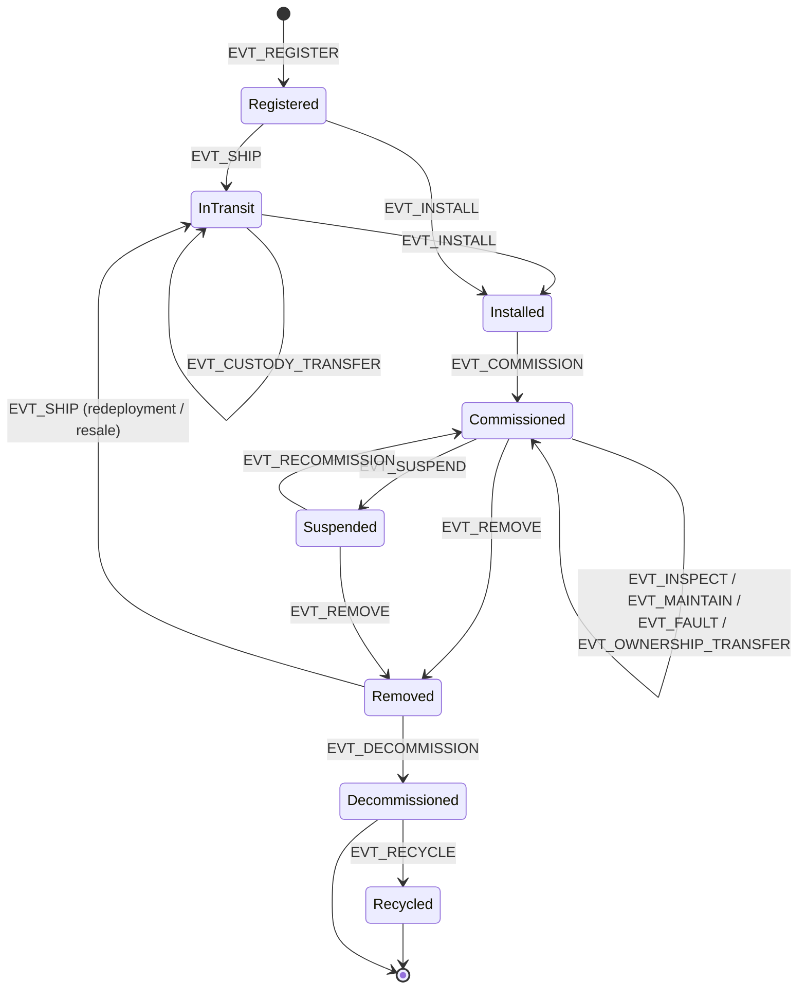

# Lifecycle Event Modeling — Manufacture to Decommissioning

## What This Chapter Covers

Chapter 4 built the machinery that carries events; this chapter defines the events.
It develops a formal lifecycle model for distributed energy assets — the states an
asset can occupy, the events that move it between them, and the data each event must
carry — and shows how the model is enforced by a state-machine contract at write
time. The design goal is stated up front because it governs every choice: the schema
must be *strict enough that conforming records are useful as evidence twenty years
later, and loose enough that real field operations can actually conform to it*. A
schema that field technicians route around produces a ledger of fiction more
dangerous than no ledger at all.

## 5.1 Design Principles for an Evidential Schema

Five principles, distilled from the failure modes of asset-management systems that
came before:

1. **Events, not states, are primary.** The ledger records *what happened* —
   observations and acts, each attributed and timestamped. Current state (who is the
   custodian, is the asset commissioned) is *derived* by replaying events. Recording
   state directly invites the silent overwrite; recording events makes every change
   somebody's signed act.
2. **The schema records claims with authorship, not adjudicated truth.** A fault
   event asserts "party X reported observation Y." Where parties disagree, both
   events stand, linked by a dispute reference; resolution is itself an event. The
   ledger is the evidence locker, not the judge.
3. **Every event answers six questions.** Which asset (DID). What kind (event type
   from a closed vocabulary). When (both the physical-world time claimed by the
   submitter and the consensus time of ledger inclusion — the pair matters, since
   backdating claims are a known abuse). Who (submitter signature plus the
   corroboration class of Section 4.5). On what evidence (payload digests and
   provenance-chain references). In what context (references to prior events —
   installations reference deliveries, claims reference condition records).
4. **Extensible payloads, closed envelope.** The envelope — the six answers above —
   is fixed and machine-enforced. Payload schemas are versioned per event type, so
   the vocabulary can grow (a new inspection modality, a new battery SoH metric)
   without breaking replayability of old records.
5. **Late and offline entry are first-class.** Field work happens in warehouses
   without connectivity and on rooftops in the rain. Events may be signed offline and
   submitted later; the claimed-time/ledger-time split represents this honestly, and
   the contract bounds only the *envelope* (a submission window per event class), not
   the fantasy of real-time entry.

## 5.2 The State Model

Figure 5.1 gives the asset lifecycle as a state machine. States are deliberately
few — nine — because states multiply combinatorially in committee and every state
must be maintained for decades. Nuance lives in the events, not the states.

**Figure 5.1** Asset lifecycle state machine. Every transition is effected only by a
ledger event of the named type; the state-machine contract rejects events whose
transition is not an arrow in this diagram.



Points of the design that experience says need defending:

**`Removed` is distinct from `Decommissioned`.** A module taken off a roof may be
scrap, warranty return, or secondary-market inventory — the removal event does not
yet know which. Collapsing these produced, in earlier industry databases, the
systematic mislabeling of resold equipment as end-of-life. The `Removed → InTransit`
arrow is precisely the secondary market of Section 1.4.4, now a first-class,
history-preserving path.

**`Suspended` exists because plants do.** Curtailment seasons, insurance disputes,
long supply-chain waits for replacement parts — an asset can be physically present
and deliberately non-operational for months. Without the state, real operations
falsify either `Commissioned` or `Removed`.

**Ownership and custody are orthogonal to lifecycle state.** `EVT_OWNERSHIP_TRANSFER`
and `EVT_CUSTODY_TRANSFER` change *derived registers* (who owns, who holds) without
changing lifecycle state — a plant sale transfers 250,000 ownerships with zero state
transitions. Conflating ownership with state is the classic modeling error here,
inherited from financial-asset schemas where possession is abstract; a module, unlike
a bond, is simultaneously *owned* by a fund, *held* by an O&M contractor, and
*operated* under a PPA counterparty's dispatch.

## 5.3 The Event Vocabulary

Table 5.1 is the closed envelope vocabulary — the complete set of event types in the
base schema, with the corroboration class (Section 4.5, Rule 2) each requires. Class
A = submitter signature only; Class B = submitter plus instrument attestation;
Class C = submitter plus instrument plus adverse-or-independent co-signature.

**Table 5.1** Base event vocabulary. Payload schema versions are per-type; the
corroboration class is enforced at write time by the state-machine contract.

| Event type | Effects | Typical submitter | Corrob. class | Key payload elements |
|---|---|---|---|---|
| `EVT_REGISTER` | Creates DID; → Registered | Manufacturer registrar | C | Enrollment template digest, flash-test VC, batch/BOM refs, registration class (factory / retroactive) |
| `EVT_SHIP` | → InTransit | Shipper / distributor | A | Consignment ref, carrier, packaging condition attestation |
| `EVT_CUSTODY_TRANSFER` | Custody register update | Releasing + receiving parties | B (dual-sign) | Counterparty DIDs, location class, exception notes |
| `EVT_INSTALL` | → Installed | EPC contractor | B | Site ref, string/position map, mounting torque & DC checks, installer credential VC |
| `EVT_COMMISSION` | → Commissioned; warranty start | EPC + owner's engineer | C | Commissioning test payloads (IV, insulation, EL sample), grid-connection ref, warranty activation |
| `EVT_INSPECT` | Condition record appended | O&M / independent inspector | B | Modality (EL, IR, defect map…), instrument DID, findings payload digest, sampling design ref |
| `EVT_MAINTAIN` | Maintenance record appended | O&M contractor | A–B by scope | Work order ref, parts consumed (their DIDs), post-work test digests |
| `EVT_FAULT` | Fault record appended; flags | Any authorized observer | A (observation) | Symptom class, evidence payload, disputed-by refs |
| `EVT_OWNERSHIP_TRANSFER` | Ownership register update | Seller + buyer | C | Counterparty DIDs, encumbrance refs, price band (optional, Ch. 10 privacy) |
| `EVT_SUSPEND` / `EVT_RECOMMISSION` | ↔ Suspended | Operator | A | Reason class, expected duration |
| `EVT_REMOVE` | → Removed | O&M / EPC | B | Removal reason class, post-removal condition digest |
| `EVT_DECOMMISSION` | → Decommissioned | Owner | B | Disposition intent, regulatory refs (WEEE etc.) |
| `EVT_RECYCLE` | → Recycled (terminal) | Accredited recycler | C | Material recovery declaration, mass balance, recycler accreditation VC |
| `EVT_DISPUTE` / `EVT_RESOLVE` | Links contested events | Any party / adjudicator | A / C | Contested event refs, resolution instrument digest |
| `EVT_REENROLL` | New binding template supersedes old | Accredited verifier | C | New template digest, supersession ref, reason (Ch. 6, 9) |

Two vocabulary decisions deserve their rationale on the record. `EVT_FAULT` is
deliberately cheap (Class A): raising the cost of reporting problems suppresses
reporting, and a false fault claim is corrected by the dispute mechanism, whereas an
unreported crack is corrected by nothing. Conversely `EVT_RECYCLE` is deliberately
expensive (Class C, accredited submitter): it is the terminal event on which the EU
battery-passport material-recovery obligations and any future PV equivalent hang, and
a cheap terminal event invites laundering assets out of existence (Chapter 8's
"identity retirement" attack).

## 5.4 The Envelope Schema

The envelope, common to all events, in the notation used throughout Part II (concrete
encodings in Appendix A):

```text
EventEnvelope {
  schema_version   : uint16          // envelope version, not payload version
  asset_did        : DID
  event_type       : enum (Table 5.1)
  payload_version  : uint16          // per-type payload schema version
  payload_digest   : bytes32         // over canonical payload serialization
  payload_refs     : ContentRef[]    // off-chain locators (≥ custody policy min)
  claimed_time     : timestamp       // submitter's asserted physical-world time
  prior_refs       : EventRef[]      // events this one contextually depends on
  submitter        : DID + signature
  corroborations   : Attestation[]   // per corroboration class
}
// ledger_time (block inclusion) and sequence are supplied by consensus, not the submitter
```

The `prior_refs` field quietly does a lot of work: it turns the per-asset event
stream into a *directed acyclic graph* of evidence — a warranty claim references the
commissioning event and the two condition records that bracket the degradation; the
resolution references the claim. Verifiers traverse this graph; Chapter 6's
verification workflow and Chapter 11's walkthrough are both graph traversals, and the
graph structure is what lets a verifier check *only* the subgraph relevant to a
question instead of replaying an asset's whole life.

## 5.5 Enforcement: The State-Machine Contract

The contract that admits events to the ledger enforces, at write time: envelope
well-formedness; transition legality against Figure 5.1; submitter authorization for
the event type (registrar accreditation for `EVT_REGISTER`, recycler accreditation
for `EVT_RECYCLE`, current-custodian match for custody-sensitive types);
corroboration-class satisfaction; and submission-window bounds on the
claimed-time/ledger-time gap. Everything else — payload plausibility, engineering
judgment, fraud detection — is deliberately *not* enforced at write time. The
write-time contract is the schema's constitution, not its police force; analytics,
insurers' models, and human adjudication operate downstream on the admitted record
(Chapter 11 shows a degradation-envelope monitor built this way, as a reader of the
ledger rather than a gatekeeper of it). Keeping the contract small is also a security
decision: Chapter 8 treats contract complexity as attack surface, and Chapter 9 will
need to migrate whatever logic lives on-chain.

A worked fragment of the enforcement, for the transition that carries the most money
— commissioning, which starts warranty clocks:

**Figure 5.2** Write-time enforcement sequence for `EVT_COMMISSION`.

```mermaid
sequenceDiagram
    participant EPC as EPC (submitter)
    participant OE as Owner's engineer (co-signer)
    participant INS as Test instrument (attestor)
    participant SC as State-machine contract
    EPC->>SC: EVT_COMMISSION envelope
    SC->>SC: asset state == Installed?
    SC->>SC: submitter holds EPC role for site?
    SC->>SC: Class C: instrument attestation present<br>and instrument DID in calibration?
    SC->>SC: co-signature by party with owner role?
    SC->>SC: claimed_time within submission window?
    alt all checks pass
        SC-->>EPC: committed; state := Commissioned;<br>warranty clock event emitted
    else any check fails
        SC-->>EPC: rejected with reason code<br>(nothing written)
    end
```

## 5.6 Data Integrity Across the Lifecycle: Where the Guarantees Come From

It is worth being exact about which mechanism guarantees what at each stage, because
the guarantees have different sources and fail differently. Table 5.2 is the map; the
rightmost column is the honest one.

**Table 5.2** Integrity guarantees by lifecycle stage: mechanism and residual
exposure.

| Stage | What is guaranteed | By what mechanism | Residual exposure (→ chapter) |
|---|---|---|---|
| Manufacture | Enrollment data authentic to instrument; identity unique | Instrument signing, registry contract | Enrollment-time substitution; ghost shifts (8) |
| Transit | Unbroken chain of dual-signed custody | Dual-signature custody events | Substitution between checkpoints if binding unchecked (6, 8) |
| Installation / commissioning | Tests attributable, corroborated, time-bounded | Class B/C corroboration, windows | Collusive EPC + engineer (8, 13) |
| Operation | Condition records ordered, tamper-evident, instrument-attributed | Digests, anchoring, instrument DIDs | Sensor spoofing at measurement (8); sparse sampling gaps (6) |
| Transfer / resale | History complete-as-recorded and unalterable at sale | Anchored append-only record, evidence DAG | Off-ledger events simply absent (5.7) |
| Decommission / recycle | Terminal events accredited and expensive to fake | Class C + accreditation VCs | Physical laundering pre-event (8) |

## 5.7 The Completeness Problem

One exposure in Table 5.2 cannot be engineered away and must be governed instead: the
ledger proves what was recorded; it cannot prove that everything that happened was
recorded. A hailstorm nobody logged is absent from the record, and its absence is
invisible.

Three mitigations, in decreasing order of force. First, *make the record the
precondition for value*: warranty claims require the commissioning event; insurance
payouts reference recorded inspections; secondary-market platforms price unrecorded
gaps as defects (Chapter 13 shows this is already the rational buyer's posture — a
gap in the record is information). Second, *instrument the gaps*: periodic
fleet-level condition sampling (Chapter 6) converts "nothing was recorded" into
"nothing changed, attested," bounding the silence. Third, *interval accounting*: the
schema's submission windows mean long silences are at least visibly long, and
Chapter 11's monitoring flags assets whose event cadence departs from their cohort's.
Completeness, in the end, is an incentive property, not a cryptographic one — the
architecture's contribution is to make completeness *cheap* and gaps *expensive*,
and then let the parties' interests do what interests do.

## 5.8 Chapter Summary

The lifecycle model records attributed events, not adjudicated states: nine states,
a closed envelope vocabulary of sixteen event types with per-type corroboration
classes, payload schemas versioned for decades of growth, and honest representation
of offline field reality through the claimed-time/ledger-time pair. The evidence DAG
formed by `prior_refs` is the structure verifiers traverse; the write-time contract
enforces the constitution (well-formedness, transitions, authorization,
corroboration) and pointedly nothing more. Integrity guarantees differ by stage and
the residual exposures are named, the deepest being completeness — a property
incentives must supply because cryptography cannot. Among the event types, two carry
the system's evidentiary weight: `EVT_REGISTER`, which binds the record to matter,
and `EVT_INSPECT`, which keeps the binding honest as matter ages. Both rest on the
measurement science of the next chapter.

## References and Further Reading

1. Object Management Group. *Unified Modeling Language (UML) Specification* — state
   machine semantics. OMG, latest revision.
2. Fowler, M. *Analysis Patterns: Reusable Object Models.* Boston: Addison-Wesley,
   1997 (accountability and observation patterns).
3. Helland, P. "Immutability Changes Everything." *Communications of the ACM* 59,
   no. 1 (2016): 64–70.
4. Directive 2012/19/EU of the European Parliament and of the Council on Waste
   Electrical and Electronic Equipment (WEEE). *Official Journal of the European
   Union*, 2012.
5. Regulation (EU) 2023/1542 (Battery Regulation), Articles 65–78 and Annex XIII
   (battery passport content and lifecycle data).
6. International Electrotechnical Commission. *IEC 62446-1: Photovoltaic (PV)
   Systems — Requirements for Testing, Documentation and Maintenance — Part 1: Grid
   Connected Systems.* Geneva: IEC.
7. Young, G. *Versioning in an Event Sourced System.* Leanpub, 2017.

\newpage
