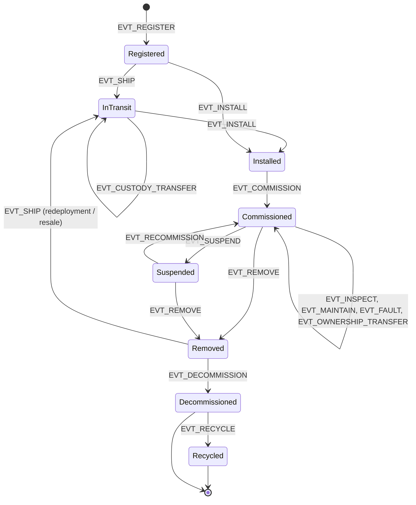
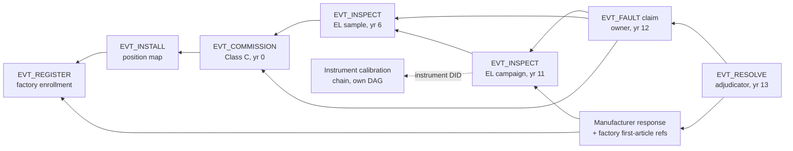

# Lifecycle Event Modeling — Manufacture to Decommissioning

## What This Chapter Covers

Chapter 4 built the machinery that carries events; this chapter defines the events.
It develops a formal lifecycle model for distributed energy assets — the states an
asset can occupy, the events that move it between them, and the data each event must
carry — and shows how the model is enforced by a state-machine contract at write
time. The design goal is stated up front because it governs every choice: the schema
must be *strict enough that conforming records are useful as evidence twenty years
later, and loose enough that real field operations can actually conform to it*. A
schema that field technicians route around produces a ledger of fiction more
dangerous than no ledger at all. The chapter proceeds from design principles
(each one a named failure mode's remedy) through the nine-state model with its
invariants, the closed event vocabulary with the field judgments its payloads
encode, the envelope and the evidence DAG it generates, a complete worked
asset biography, the write-time enforcement contract and the
constitution/judgment boundary that keeps it small, the stage-by-stage
integrity map with its honest residual-exposure column, the completeness
problem and its cadence-analytics answer, and finally the evolution regime by
which the schema itself survives thirty years of amendment without ever
breaking an old record.

## 5.1 Design Principles for an Evidential Schema

The schema is the system's most consequential artifact and its least glamorous.
Platforms will be re-selected, contracts re-implemented, and instruments
re-procured over the asset fleet's life; the schema — the definition of what a
recorded fact *is* — must survive all of it, because the records written under
it are immutable and the parties relying on them are unborn. It is also the
artifact where engineering meets field anthropology: every field is a demand
placed on a technician, a factory system, or a counterparty, and demands that
ignore how work actually happens get fictional compliance. The five principles
below are therefore stated with their justifying failure modes, and the reader
evaluating any competing schema — including the passport data models now
emerging from regulation — is invited to score it against the same five.

Five principles, distilled from the failure modes of asset-management systems that
came before:

1. **Events, not states, are primary.** The ledger records *what happened* —
   observations and acts, each attributed and timestamped. Current state (who is the
   custodian, is the asset commissioned) is *derived* by replaying events. Recording
   state directly invites the silent overwrite; recording events makes every change
   somebody's signed act. The database community reached the same conclusion
   from performance and auditability directions under the name *event
   sourcing*; this schema is event sourcing with adversaries.
2. **The schema records claims with authorship, not adjudicated truth.** A fault
   event asserts "party X reported observation Y." Where parties disagree, both
   events stand, linked by a dispute reference; resolution is itself an event. The
   ledger is the evidence locker, not the judge — a division of labor the
   legal system will recognize and, in the pilot's S4 rehearsal, visibly
   appreciated.
3. **Every event answers six questions.** Which asset (DID). What kind (event type
   from a closed vocabulary). When (both the physical-world time claimed by the
   submitter and the consensus time of ledger inclusion — the pair matters, since
   backdating claims are a known abuse). Who (submitter signature plus the
   corroboration class of Section 4.5). On what evidence (payload digests and
   provenance-chain references). In what context (references to prior events —
   installations reference deliveries, claims reference condition records).
   An event that cannot answer all six is not rejected as immoral; it is
   rejected as *unfinished*, and the reason codes of Section 5.5 tell the
   submitter which answer is missing.
4. **Extensible payloads, closed envelope.** The envelope — the six answers above —
   is fixed and machine-enforced. Payload schemas are versioned per event type, so
   the vocabulary can grow (a new inspection modality, a new battery SoH metric)
   without breaking replayability of old records. The pattern is the network
   stack's oldest lesson applied to evidence: a stable, minimal header
   beneath innovating payloads is how heterogeneous systems stay
   interoperable across decades of change.
5. **Late and offline entry are first-class.** Field work happens in warehouses
   without connectivity and on rooftops in the rain. Events may be signed offline and
   submitted later; the claimed-time/ledger-time split represents this honestly, and
   the contract bounds only the *envelope* (a submission window per event class), not
   the fantasy of real-time entry.

Each principle is a scar from a failure mode worth naming, because schemas are
argued in committee and committees deserve the evidence. Principle 1 answers
the *silent overwrite*: every asset-management database this author has audited
contained state fields — `current_owner`, `status` — whose history was
unrecoverable because updates destroyed their predecessors; the one question a
dispute always asks ("what did the record say *then*?") is exactly the question
a state-primary design cannot answer. Principle 2 answers the *premature
adjudication* failure: schemas that force a single truth at write time (one
`fault_cause` field, say) turn every disagreement into a write conflict, and
the party holding the pen wins — recording claims-with-authorship instead keeps
the disagreement, which *is* the evidence. Principle 3's six questions are the
cross-examination checklist: every hostile review of a record in a dispute
reduces to which-asset, what, when, who, on-what-evidence, in-what-context, and
a schema that answers all six at write time has pre-empted the
document-discovery fight that consumes most of a dispute's budget. Principle 4
answers the *frozen schema* failure — systems that could not add a battery SoH
metric without a migration that broke old records' parsers — and its
closed-envelope half answers the opposite *schema sprawl* failure, in which
every integrator adds fields until no two events are comparable. Principle 5
answers the failure with the highest human cost: schemas that assume
connectivity get falsified data at exactly the moments that matter, because the
technician whose tablet cannot sync *will* complete the job and *will*
reconstruct the paperwork afterward, and an honest schema plans for that
reconstruction instead of pretending it away.

## 5.2 The State Model

Figure 5.1 gives the asset lifecycle as a state machine. States are deliberately
few — nine — because states multiply combinatorially in committee and every state
must be maintained for decades. Nuance lives in the events, not the states.

**Figure 5.1** Asset lifecycle state machine. Every transition is effected only by a
ledger event of the named type; the state-machine contract rejects events whose
transition is not an arrow in this diagram.



Reading conventions for the diagram: every arrow is an event type from
Table 5.1, and *only* those arrows exist — the contract's transition check is
literally "is this (state, event) pair an arrow?" Self-loops (the
`Commissioned → Commissioned` cluster) are events that enrich the record
without moving the asset; they are where most of the lifetime's events live.
The two terminal paths encode a real-world distinction: `Recycled` is the
documented-material-recovery ending the regulations increasingly require,
while termination from `Decommissioned` without recycling records an asset
that left the documented world — exported beyond the system's reach, destroyed
in an incident, or simply lost — and the schema prefers an honest dead end to
a fictitious recovery. Following one path through: a resold module runs
`Commissioned → Removed → InTransit → Installed → Commissioned`, accumulating
custody and condition events at each hop, and arrives at its second
commissioning with its first life attached — the exact property the
secondary-market analysis of Chapter 13 monetizes.

Points of the design that experience says need defending:

**`Removed` is distinct from `Decommissioned`.** A module taken off a roof may be
scrap, warranty return, or secondary-market inventory — the removal event does not
yet know which. Collapsing these produced, in earlier industry databases, the
systematic mislabeling of resold equipment as end-of-life. The `Removed → InTransit`
arrow is precisely the secondary market of Section 1.4.4, now a first-class,
history-preserving path. The distinction also carries regulatory weight:
extended-producer-responsibility accounting needs to know whether a unit left
service *permanently* (a decommissioning, entering the waste stream's mass
balance) or *provisionally* (a removal, still an asset), and databases that
conflated the two have made the sector's official end-of-life statistics —
the inputs to recycling-capacity planning — systematically wrong in a known
direction.

**`Suspended` exists because plants do.** Curtailment seasons, insurance disputes,
long supply-chain waits for replacement parts — an asset can be physically present
and deliberately non-operational for months. Without the state, real operations
falsify either `Commissioned` or `Removed`. The state earns its place under the
strict criterion above because different events are legal within it:
production-dependent claims are suspended with the asset, while condition and
maintenance events continue — which is exactly the evidential profile of a
plant idled by a grid dispute, still inspected, not producing.

**Ownership and custody are orthogonal to lifecycle state.** `EVT_OWNERSHIP_TRANSFER`
and `EVT_CUSTODY_TRANSFER` change *derived registers* (who owns, who holds) without
changing lifecycle state — a plant sale transfers 250,000 ownerships with zero state
transitions. Conflating ownership with state is the classic modeling error here,
inherited from financial-asset schemas where possession is abstract; a module, unlike
a bond, is simultaneously *owned* by a fund, *held* by an O&M contractor, and
*operated* under a PPA counterparty's dispatch.

Each state also carries *invariants* — facts the contract guarantees hold while
an asset occupies it — and stating them makes the model checkable rather than
merely drawable. Table 5.2 collects them.

**Table 5.2** State invariants maintained by the lifecycle contract.

| State | Invariants enforced while in state |
|---|---|
| Registered | DID unique; enrollment template committed; controller = registrar's named initial controller; no operational events accepted |
| InTransit | Custody chain unbroken (each transfer dual-signed); condition events limited to receiving-inspection class |
| Installed | Site reference and position map present; custodian holds installer or operator role at site |
| Commissioned | Warranty clock exists; condition, maintenance, fault, and transfer events accepted; suspension reversible |
| Suspended | Reason class recorded; no commissioning-dependent events (production claims) accepted |
| Removed | Post-removal condition digest present; disposition undetermined — resale, redeploy, and decommission all legal |
| Decommissioned | Disposition intent recorded; only recycling and audit events accepted |
| Recycled | Terminal; mass-balance declaration present; DID resurrection detectable via template match (§8.3) |

The invariants do quiet work in three places. They give the write-time contract
its rejection logic (an event violating an invariant is refused with a reason
code, Section 5.5). They give verifiers a fast coherence check (a condition
record timestamped during `InTransit` from a plant-mounted instrument is
incoherent regardless of its signatures). And they give the schema's committee
a regression test: any proposed vocabulary change must state which invariants
it touches, which is how Chapter 11's governance kept its schema amendments
from becoming schema erosion.

Two roads not taken complete the state model's defense, because both will be
proposed in any committee that reviews it. *Why not more states?* Proposals
accumulate — a `Curtailed` state, a `UnderWarrantyClaim` state, a
`PendingResale` state — and each fails the same test: it encodes a *condition
or process* as a *lifecycle position*, forcing transitions where nothing
physical changed and doubling the transition matrix that every verifier,
contract, and analyst must handle forever. Conditions belong in events
(curtailment is operational data; a claim is a dispute pair; a planned resale
is nobody's business until it is a transfer). The nine states earn their
places by a strict criterion: each is a position in which *different events
are legal* — that is the only thing a state machine's states are for. *Why not
per-asset-class state machines?* Because Chapter 12's generalization test
would then be a rewrite instead of an extension: batteries add states and
events (Figure 12.1) but inherit the base machine unchanged, which is only
possible because the base machine models custody-and-service reality common
to all manufactured assets rather than solar particulars. Class-specific
richness lives in payloads and added transitions, never in forked
foundations.

## 5.3 The Event Vocabulary

Table 5.1 is the closed envelope vocabulary — the complete set of event types in the
base schema, with the corroboration class (Section 4.5, Rule 2) each requires. Class
A = submitter signature only; Class B = submitter plus instrument attestation;
Class C = submitter plus instrument plus adverse-or-independent co-signature.
Class assignment follows one rule applied case by case: **the corroboration
cost of an event should approximate the fraud value of forging it, at the
moment of writing** — cheap where honesty is incentive-compatible anyway,
expensive where a lone signature could move money or terminate liability. The
per-event rationales below and in Table 5.1 are instances of this rule, and
proposals to amend a class should be argued in its terms.

**Table 5.1** Base event vocabulary. Payload schema versions are per-type; the
corroboration class is enforced at write time by the state-machine contract.

| Event type | Effects | Typical submitter | Corrob. class | Key payload elements |
|---|---|---|---|---|
| `EVT_REGISTER` | Creates DID; → Registered | Manufacturer registrar | C | Enrollment template digest, flash-test VC, batch/BOM refs, registration class (factory / retroactive) |
| `EVT_SHIP` | → InTransit | Shipper / distributor | A | Consignment ref, carrier, packaging condition attestation |
| `EVT_CUSTODY_TRANSFER` | Custody register update | Releasing + receiving parties | B (dual-sign) | Counterparty DIDs, location class, exception notes |
| `EVT_INSTALL` | → Installed | EPC contractor | B | Site ref, string/position map, mounting torque & DC checks, installer credential VC |
| `EVT_COMMISSION` | → Commissioned; warranty start | EPC + owner's engineer | C | Commissioning test payloads (IV, insulation, EL sample), grid-connection ref, warranty activation |
| `EVT_INSPECT` | Condition record appended | O&M / independent inspector | B | Modality (EL, IR, defect map…), instrument DID, findings payload digest, sampling design ref |
| `EVT_MAINTAIN` | Maintenance record appended | O&M contractor | A–B by scope | Work order ref, parts consumed (their DIDs), post-work test digests |
| `EVT_FAULT` | Fault record appended; flags | Any authorized observer | A (observation) | Symptom class, evidence payload, disputed-by refs |
| `EVT_OWNERSHIP_TRANSFER` | Ownership register update | Seller + buyer | C | Counterparty DIDs, encumbrance refs, price band (optional, Ch. 10 privacy) |
| `EVT_SUSPEND` / `EVT_RECOMMISSION` | ↔ Suspended | Operator | A | Reason class, expected duration |
| `EVT_REMOVE` | → Removed | O&M / EPC | B | Removal reason class, post-removal condition digest |
| `EVT_DECOMMISSION` | → Decommissioned | Owner | B | Disposition intent, regulatory refs (WEEE etc.) |
| `EVT_RECYCLE` | → Recycled (terminal) | Accredited recycler | C | Material recovery declaration, mass balance, recycler accreditation VC |
| `EVT_DISPUTE` / `EVT_RESOLVE` | Links contested events | Any party / adjudicator | A / C | Contested event refs, resolution instrument digest |
| `EVT_REENROLL` | New binding template supersedes old | Accredited verifier | C | New template digest, supersession ref, reason (Ch. 6, 9) |
| `EVT_AUDIT` | Governance/audit finding appended | Auditor, monitor, or contract | A–C by finding class | Subject role/store DID, finding class, evidence digest (§4.2.1, §4.3.2) |

Two vocabulary decisions deserve their rationale on the record. `EVT_FAULT` is
deliberately cheap (Class A): raising the cost of reporting problems suppresses
reporting, and a false fault claim is corrected by the dispute mechanism, whereas an
unreported crack is corrected by nothing. Conversely `EVT_RECYCLE` is deliberately
expensive (Class C, accredited submitter): it is the terminal event on which the EU
battery-passport material-recovery obligations and any future PV equivalent hang, and
a cheap terminal event invites laundering assets out of existence (Chapter 8's
"identity retirement" attack).

A granularity note before the per-event commentary: an "event" in this schema
is a *domain fact*, not a keystroke or a transaction. One maintenance visit
that touches forty modules is forty `EVT_MAINTAIN` events (facts about
distinct assets) but typically one work order, one crew, one batched
submission, and — under Section 7.2's aggregation — one ledger transaction;
conversely, a single physical incident (the hailstorm) fans out into exactly
as many events as there are assets with distinct recorded consequences, each
independently verifiable, all sharing a common incident reference in their
payloads so the fleet-level view reassembles cheaply. The schema's unit of
account is thus the (asset, fact) pair, and every efficiency concern about
that choice is answered at the transport and consensus layers rather than by
coarsening the evidence.

Several other entries repay a closer look, because their payload designs encode
hard-won field judgments.

**`EVT_CUSTODY_TRANSFER` and the dual-signature discipline.** The releasing and
receiving parties both sign the same event — which sounds like ceremony until
one examines what each signature buys. The releaser's signature ends its
liability window at a provable instant; the receiver's signature, which the
schema requires to reference a receiving-inspection payload (packaging
condition, count verification, sampled V1 checks per Section 3.6), *starts* its
own with eyes open. Disagreement at the dock — a crushed pallet corner, a count
short by three — is not a failure of the protocol but its product: the receiver
signs with exception notes, the exceptions are timestamped into both parties'
records, and the transport insurer has, for the first time in this industry, a
contemporaneous, dual-attested damage record instead of two retrospective
accounts. Transport damage is among the largest unattributable loss categories
in Section 1.4.3; this one event type is where the architecture attacks it.

**`EVT_INSTALL` and the position map.** The installation payload binds each
unit to a *position* — site, block, row, string, index — and the position map
is what converts fleet-level analytics into unit-level evidence: a string's
underperformance implicates nineteen specific DIDs, drone thermography
georeferences to positions and thence to identities, and PID risk (a
position-dependent phenomenon, Section 1.4.3) becomes computable per unit. The
installer-credential VC in the payload does double duty: it feeds the
workmanship warranty (installation by certified personnel is a condition of
most module warranties, today unverifiable) and it prices the installer's own
reputation into the record.

**`EVT_OWNERSHIP_TRANSFER` and encumbrances.** The transfer payload carries
encumbrance references — security interests, PPA assignments, insurance
endorsements — as digests of the underlying instruments. The ledger does not
adjudicate priority (that remains the law's job through whatever filing regime
governs); what it contributes is *discoverability with timestamps*: a lender
can verify that no prior recorded transfer conflicts with its collateral, and
the double-pledge fraud that plagues equipment finance acquires a detection
mechanism that operates before the money moves rather than after.

**`EVT_DISPUTE` / `EVT_RESOLVE` as pressure valves.** Their design goal is to
keep disagreement *inside* the record system rather than beside it. A dispute
event references the contested events, states a position class (contest of
fact, of authorization, of measurement validity), and freezes nothing — the
asset's operational life continues, because a system that halts assets on
dispute invites denial-of-service by litigation. Resolution events carry the
adjudicator's instrument digest and bind only the parties that accept them;
an unaccepted resolution is simply another attributed claim. The pilot's S4
rehearsal (Section 11.3) exercised exactly this pair, and the eleven-day
outcome owed as much to the dispute's structure — both sides arguing from the
same frozen evidence DAG — as to any technology beneath it.

### 5.3.1 Mapping the Sector's Existing Paperwork

The vocabulary was designed against the sector's existing documentary
practice, and the correspondence is worth exhibiting because it answers the
adoption question — *how much retraining does this demand?* — with "less than
feared." Table 5.5 maps the standard documents to their event carriers.

**Table 5.5** The sector's existing documents and their representation in the
event schema.

| Existing document / practice | Schema representation |
|---|---|
| Factory flash-test certificate | VC in `EVT_REGISTER` payload (§3.5.1's walkthrough) |
| Packing list / shipping manifest | `EVT_SHIP` payload + batch manifest refs |
| Delivery receipt with exceptions | Receiving side of dual-signed `EVT_CUSTODY_TRANSFER` |
| IEC 62446-1 commissioning documentation | `EVT_COMMISSION` payload (test categories map 1:1 to §62446 checklists) |
| O&M inspection reports | `EVT_INSPECT` payloads, modality-tagged |
| Work orders / service reports | `EVT_MAINTAIN` payloads referencing parts' DIDs |
| Incident / claim notices | `EVT_FAULT` + `EVT_DISPUTE` |
| Bill of sale, assignment agreements | `EVT_OWNERSHIP_TRANSFER` with encumbrance digests |
| Decommissioning plans, WEEE documentation | `EVT_DECOMMISSION` / `EVT_RECYCLE` payloads |

The mapping's fidelity is deliberate: field personnel continue producing the
documents their contracts and standards already require; the schema's demand
is only that each document be canonically serialized, signed at the right
grade, and referenced from its event — the difference between a PDF in a
shared folder and evidence, purchased at the cost of integration software
rather than of new field procedure. Where the mapping is *not* one-to-one —
the dual-signed custody transfer replacing the one-sided delivery receipt is
the main case — the change is the point, not an accident, and the affected
workflow gets explicit treatment in the deployment chapters. The mapping also
supplies the migration path for history: an owner holding twenty years of
legacy documentation can *backfill* it as referenced payloads on retroactive
registrations — signed by the party vouching for each document today, dated
honestly with both the document's claimed date and the backfill's ledger
time — so that legacy paper enters the system as what it is (attributed,
unverifiable-at-origin claims) rather than being either discarded or
laundered into contemporaneous evidence.

## 5.4 The Envelope Schema

The envelope, common to all events, in the notation used throughout Part II (concrete
encodings in Appendix A):

```text
EventEnvelope {
  schema_version   : uint16          // envelope version, not payload version
  asset_did        : DID
  event_type       : enum (Table 5.1)
  payload_version  : uint16          // per-type payload schema version
  payload_digest   : bytes32         // over canonical payload serialization
  payload_refs     : ContentRef[]    // off-chain locators (≥ custody policy min)
  claimed_time     : timestamp       // submitter's asserted physical-world time
  prior_refs       : EventRef[]      // events this one contextually depends on
  submitter        : DID + signature
  corroborations   : Attestation[]   // per corroboration class
}
// ledger_time (block inclusion) and sequence are supplied by consensus, not the submitter
```

Size discipline, since Chapter 7's arithmetic depends on it: a typical
envelope serializes to 600–1,200 bytes under deterministic CBOR — dominated
by signatures and corroborations, which is why post-quantum signature sizes
(Chapter 9) are the envelope's main growth risk — and the schema's rule is
that nothing in the envelope may scale with payload size or asset age.
`prior_refs` is capped (events needing many references carry a digest of a
reference manifest instead), `payload_refs` carries locators rather than
inline metadata, and free-text fields do not exist at the envelope level at
all: prose lives in payloads, where it belongs, and the envelope remains the
fixed-cost, machine-verifiable skeleton that a validator can check in
microseconds and a national fleet can accumulate for decades without
embarrassment.

Field-by-field rationale, briefly, because each line of the envelope survived
an argument. `schema_version` and `payload_version` are separate because they
evolve at different rates and under different authorities — the envelope by
supermajority governance, payloads by technical-committee cadence. The digest
and refs separation is Section 4.2.1's storage-migration freedom.
`claimed_time` is the submitter's assertion and is *evidence about the
submitter* as much as about the world; `ledger_time` is consensus fact; the
pair brackets the truth, and their gap is itself a monitored quantity (a
submitter whose gaps trend long is a process problem surfacing). `submitter`
is a role DID, never a legal person, per Chapter 10's privacy architecture.
`corroborations` is an array rather than fixed fields because corroboration
classes are policy (Table 5.1) and policy changes; the array's *contents* are
constrained at write time by the class in force, recorded via the policy
reference every event implicitly carries through its block's governance-state
digest (Section 4.4).

The `prior_refs` field quietly does a lot of work: it turns the per-asset event
stream into a *directed acyclic graph* of evidence — a warranty claim references the
commissioning event and the two condition records that bracket the degradation; the
resolution references the claim. Verifiers traverse this graph; Chapter 6's
verification workflow and Chapter 11's walkthrough are both graph traversals, and the
graph structure is what lets a verifier check *only* the subgraph relevant to a
question instead of replaying an asset's whole life.

**Figure 5.3** A fragment of one module's evidence DAG, as a warranty
adjudicator would traverse it. Boxes are events; arrows are `prior_refs`
edges (each arrow points from an event to evidence it relies on).



Reading the figure as the adjudicator does: the claim's support is the
commissioning baseline plus two condition records; each condition record's
support includes its instrument's calibration DAG (the Rule 3 recursion of
Section 4.5); the manufacturer's rebuttal reaches back to factory enrollment;
and every box resolves to signed, anchored, digest-committed bytes. The
traversal touches perhaps a dozen events out of the module's lifetime few
hundred — the DAG is why verification cost scales with the *question*, not
with the asset's age. Note also what the DAG's *shape* communicates before
any payload is opened: a claim citing no condition records, or citing records
whose instruments have no calibration edges, is structurally weak in a way a
policy engine can score mechanically — the graph is a triage instrument as
well as an evidence index, and Chapter 11's insurer client exploits exactly
that.

### 5.4.1 A Complete Biography in Events

To make the schema concrete at the scale it actually operates, here is one
module's entire 26-year documentary life — every event it ever generates,
which is to say the complete cost of its record-keeping.

**Table 5.4** Complete event biography of one representative module. Twenty
events over 26 years; ~25 kB of envelopes on-chain, ~180 MB of payloads in
custody.

| Year | Event | Notes |
|---|---|---|
| 0 | `EVT_REGISTER` (factory class) | Enrollment templates, flash VC, batch/BOM refs |
| 0 | `EVT_SHIP` | Factory → port consolidator |
| 0 | `EVT_CUSTODY_TRANSFER` ×3 | Consolidator → carrier → import warehouse → site laydown |
| 0 | `EVT_INSTALL` | Position B4-R112-S07-17; installer credential VC |
| 0 | `EVT_COMMISSION` | Class C; warranty clock starts |
| 2 | `EVT_INSPECT` | Drone IR campaign; unit in sampled subset |
| 6 | `EVT_INSPECT` | EL sample (2% annual policy); template match, condition delta minor |
| 9 | `EVT_OWNERSHIP_TRANSFER` | Plant sale; one of 126,000 batched transfers |
| 11 | `EVT_INSPECT` | Post-hailstorm EL campaign; new crack network recorded |
| 12 | `EVT_FAULT` | Owner claims accelerated degradation |
| 12 | `EVT_DISPUTE` | Manufacturer contests attribution |
| 13 | `EVT_RESOLVE` | Adjudicated: transport-era crack, storm-extended; partial settlement |
| 13 | `EVT_MAINTAIN` | String rework after settlement |
| 19 | `EVT_INSPECT` | Diligence campaign for refinancing |
| 22 | `EVT_REMOVE` | Repowering; post-removal condition digest |
| 22 | `EVT_SHIP` | To secondary-market broker |
| 22 | `EVT_CUSTODY_TRANSFER` + `EVT_OWNERSHIP_TRANSFER` | Broker sale, V2-verified lot (§3.6.1) |
| 23 | `EVT_INSTALL` + `EVT_COMMISSION` | Second life, price-sensitive market, retroactive-context noted |
| 26 | `EVT_REMOVE`, `EVT_DECOMMISSION` | End of second service |
| 26 | `EVT_RECYCLE` | Accredited recycler; mass balance into EPR reporting |

Three observations from the biography. First, the *volume* confirms the
Chapter 4 workload analysis from the unit side: twenty envelopes in 26 years,
of which half cluster at the custody-intensive beginning and end — the ledger
is nearly idle during the asset's long productive middle, exactly when
operational telemetry (off-ledger) is busiest. The inversion is worth
noticing because it is the opposite of what casual intuition expects from
"asset tracking": the record system works hardest precisely when the asset
is *not* working. Second, the *value moments* —
the year-12 dispute, the year-19 refinancing, the year-22 resale — each
consumed evidence recorded years earlier by parties who could not have known
which future transaction would need it; that is the whole argument for
recording evidentially rather than transactionally, in one row-set. Third,
the biography's second life exists *at all* because the record survived the
year-22 custody gauntlet; under status-quo documentation the same physical
module would have shipped to the shredder with its history, per the
deadweight analysis of Section 1.4.4.

## 5.5 Enforcement: The State-Machine Contract

The contract that admits events to the ledger enforces, at write time: envelope
well-formedness; transition legality against Figure 5.1; submitter authorization for
the event type (registrar accreditation for `EVT_REGISTER`, recycler accreditation
for `EVT_RECYCLE`, current-custodian match for custody-sensitive types);
corroboration-class satisfaction; and submission-window bounds on the
claimed-time/ledger-time gap. Everything else — payload plausibility, engineering
judgment, fraud detection — is deliberately *not* enforced at write time. The
write-time contract is the schema's constitution, not its police force; analytics,
insurers' models, and human adjudication operate downstream on the admitted record
(Chapter 11 shows a degradation-envelope monitor built this way, as a reader of the
ledger rather than a gatekeeper of it). Keeping the contract small is also a security
decision: Chapter 8 treats contract complexity as attack surface, and Chapter 9 will
need to migrate whatever logic lives on-chain.

The enforcement semantics deserve precision on four points that implementations
get wrong. *Rejection is total and reasoned*: a failed check writes nothing —
no partial state, no "pending" purgatory — and returns a machine-readable
reason code, because the submitting agent in a warehouse needs to distinguish
"fix your corroboration" from "wrong state" from "your accreditation lapsed"
without a support ticket. (The reason-code taxonomy is part of the schema and
versioned with it; Appendix A carries the pilot's.) *Submission is
idempotent*: envelopes carry submitter-scoped nonces, so a flaky uplink that
retries a custody event cannot double-record it — a mundane property that
prevents a genuinely nasty class of duplicate-history disputes. *Batches are
transactional per event, not per batch*: one malformed envelope in a
2,048-event batch rejects alone; the batch pattern of Section 7.2 aggregates
commitment, never validation, so a factory's day is not hostage to its worst
record. *Authorization is evaluated at claimed time, not submission time*:
the technician whose accreditation was valid Tuesday on the roof but whose
employer's contract ended Thursday before the upload gets Tuesday's event
accepted — the alternative punishes offline honesty and rewards rushed
paperwork, inverting every incentive Principle 5 protects.

A worked fragment of the enforcement, for the transition that carries the most money
— commissioning, which starts warranty clocks:

**Figure 5.2** Write-time enforcement sequence for `EVT_COMMISSION`.

```mermaid
sequenceDiagram
    participant EPC as EPC (submitter)
    participant OE as Owner's engineer (co-signer)
    participant INS as Test instrument (attestor)
    participant SC as State-machine contract
    EPC->>SC: EVT_COMMISSION envelope
    SC->>SC: asset state == Installed?
    SC->>SC: submitter holds EPC role for site?
    SC->>SC: Class C: instrument attestation present<br>and instrument DID in calibration?
    SC->>SC: co-signature by party with owner role?
    SC->>SC: claimed_time within submission window?
    alt all checks pass
        SC-->>EPC: committed; state := Commissioned;<br>warranty clock event emitted
    else any check fails
        SC-->>EPC: rejected with reason code<br>(nothing written)
    end
```

What the contract deliberately does not do rewards restatement with an
example, because the boundary is counterintuitive to engineers trained on
input validation. Suppose an `EVT_INSPECT` payload records a module at 96% of
nameplate in year 12 — physically implausible given its year-6 record of 91%.
The write-time contract *accepts* this event if its envelope, authorization,
and corroboration are in order. The implausibility is detected downstream, by
the cohort monitor, which flags the pair for review; the review might find a
transcription error (corrected by a superseding event), a mismatched identity
(escalated to V2/V3 verification), or a genuinely recovering measurement
artifact (documented and closed). Why not reject at write time? Because
plausibility models are wrong at the margins exactly where reality is
interesting — a rejection rule tuned to catch the error would also have
rejected the legitimate recovery case, and a submitter facing rejection edits
the data until it passes, which is *worse* than recording the anomaly:
write-time plausibility enforcement teaches the field to launder its
measurements. The constitution/judgment split is thus not a modularity nicety
but an evidence-quality decision: the ledger records what instruments and
people actually said, and judgment about what they *should* have said stays
downstream, revisable, and attributable.

The sequence's failure branch deserves the attention the success branch
usually steals. A rejection at step 3 — the instrument attestation missing
because the tester's certificate lapsed mid-project — arrives at the worst
possible moment: a commissioning deadline with liquidated damages behind it.
The degraded-mode answer is layered. First, the reason code tells the EPC's
software *exactly* what failed, within seconds, on site. Second, the
submission window (30 days for commissioning) means the physical work
proceeds and the record catches up once the calibration event is filed — the
window exists precisely so that administrative failures do not cascade into
construction delays. Third, for the genuine emergency (a calibration that
cannot be cured in-window), the schema's dispute mechanism doubles as a
safety valve: an out-of-policy commissioning can be recorded as a Class-B
event with an attached variance request, visible as such forever, priced by
whoever later relies on it. What the system never offers is the quiet
override — the administrator who force-writes the event and moves on —
because a single exercised override converts every future record into a
negotiation about whether it, too, was overridden. Degraded modes are
designed, logged, and priced; back doors are not.

## 5.6 Data Integrity Across the Lifecycle: Where the Guarantees Come From

It is worth being exact about which mechanism guarantees what at each stage, because
the guarantees have different sources and fail differently. Table 5.3 is the map; the
rightmost column is the honest one.

**Table 5.3** Integrity guarantees by lifecycle stage: mechanism and residual
exposure.

| Stage | What is guaranteed | By what mechanism | Residual exposure (→ chapter) |
|---|---|---|---|
| Manufacture | Enrollment data authentic to instrument; identity unique | Instrument signing, registry contract | Enrollment-time substitution; ghost shifts (8) |
| Transit | Unbroken chain of dual-signed custody | Dual-signature custody events | Substitution between checkpoints if binding unchecked (6, 8) |
| Installation / commissioning | Tests attributable, corroborated, time-bounded | Class B/C corroboration, windows | Collusive EPC + engineer (8, 13) |
| Operation | Condition records ordered, tamper-evident, instrument-attributed | Digests, anchoring, instrument DIDs | Sensor spoofing at measurement (8); sparse sampling gaps (6) |
| Transfer / resale | History complete-as-recorded and unalterable at sale | Anchored append-only record, evidence DAG | Off-ledger events simply absent (5.7) |
| Decommission / recycle | Terminal events accredited and expensive to fake | Class C + accreditation VCs | Physical laundering pre-event (8) |

Reading the table row-wise repays the effort, because the *source* column
shifts as the asset moves — and each shift changes who must be honest for the
guarantee to hold. At manufacture the guarantees are instrument-rooted: the
enrollment is as good as the line's I-A instruments and the registrar's
process, which is why registrar accreditation (Section 4.3.2) is the stage's
real control. In transit the guarantees become *protocol*-rooted: dual
signatures need no instruments, only counterparties with adverse interests,
and the stage's exposure is physical substitution between checkpoints — a
binding problem, not a records problem, resolved by sampling verification at
receiving. Installation and commissioning re-introduce instruments but add
the collusion exposure (an EPC and an owner's engineer with aligned
incentives), which corroboration classes mitigate and only economics
(Chapter 13's incidence analysis) truly bounds. Operation's guarantees are
the architecture's strongest — ordered, anchored, instrument-attributed
condition history — while its exposure is the subtlest: sparse sampling means
most units' condition is *inferred*, not measured, and the inference's
honesty depends on the sampling design being adversarially sound
(pre-committed, verifier-drawn; Section 6.6). Transfer inherits everything
recorded and adds nothing new to trust — the buyer verifies rather than
believes — and the terminal stages return to accreditation as the root, with
the template-resurrection check as the safety net under it. No stage's
guarantee is unconditional; every stage's conditions are named; and that
nameability is what distinguishes an engineered trust system from a
marketed one.

## 5.7 The Completeness Problem

One exposure in Table 5.3 cannot be engineered away and must be governed instead: the
ledger proves what was recorded; it cannot prove that everything that happened was
recorded. A hailstorm nobody logged is absent from the record, and its absence is
invisible.

The gaps come in three species with different remedies, and lumping them
wastes remedies on the wrong species. *Negligent gaps* — the crew that forgot,
the tablet that died, the subcontractor outside the integration — are the
overwhelming majority; they respond to tooling (event emission embedded in
work-order flows, Chapter 11's lesson 3) and to SLA metrics, and they are
self-diagnosing under cadence analytics because negligence is uncorrelated
with what it fails to record. *Strategic gaps* — the operator who prefers the
hail damage unlogged ahead of a sale — are rarer and nastier precisely because
they correlate with value; they respond to the precondition mechanism (an
unlogged event cannot support a later claim, and a *gap* at a suspicious
moment is priced by buyers as if it hid the worst) and to the asymmetry that
suppressing a record requires suppressing every corroborated copy of it,
including counterparties'. *Structural gaps* — whole event classes the schema
does not capture, or whole participant tiers outside the system — are the
honest frontier: no analytics detects what no one defined, which is why the
schema's evolution regime (Section 5.8) and the interoperability agenda
(Chapter 12) are completeness work as much as anything else in this section.

Three mitigations, in decreasing order of force. First, *make the record the
precondition for value*: warranty claims require the commissioning event; insurance
payouts reference recorded inspections; secondary-market platforms price unrecorded
gaps as defects (Chapter 13 shows this is already the rational buyer's posture — a
gap in the record is information). Second, *instrument the gaps*: periodic
fleet-level condition sampling (Chapter 6) converts "nothing was recorded" into
"nothing changed, attested," bounding the silence. Third, *interval accounting*: the
schema's submission windows mean long silences are at least visibly long, and
Chapter 11's monitoring flags assets whose event cadence departs from their cohort's.
Completeness, in the end, is an incentive property, not a cryptographic one — the
architecture's contribution is to make completeness *cheap* and gaps *expensive*,
and then let the parties' interests do what interests do.

Cadence monitoring deserves its worked example, because it is the mitigation
that scales. Every asset belongs to natural cohorts — production week, site,
installer, O&M contract — and each cohort develops an event-cadence signature:
inspections on the policy schedule, maintenance at the fleet's empirical rate,
transfers clustering at commercial events. The monitor learns these signatures
and scores departures. Consider a 200-module string whose maintenance events
stop appearing while its neighbors' continue: either the string is
inexplicably trouble-free (visible in production data — check), or its crew
has stopped logging (an SLA conversation), or its records are being
selectively suppressed ahead of a transaction (a diligence flag). The monitor
cannot distinguish the three — but it does not need to; its job is to convert
*invisible absence* into *visible anomaly*, cheaply and fleet-wide, so that
the expensive instruments (audits, V2 sampling, contractual inquiry) point
somewhere. In the Chapter 11 walkthrough's first year this exact pattern surfaced the
S3 unlogged-replacement finding (Section 11.3) — not by detecting the
replacement, which was invisible, but by detecting that a work order's
duration was inconsistent with its recorded scope. Absence-of-evidence
analytics is unglamorous statistics, and it is the completeness problem's
practical answer.

## 5.8 Schema Evolution over Decades

A schema for 30-year assets will outlive its authors' tenure, its committee's
composition, and at least one generation of its own good ideas; planning for
its evolution is therefore part of its specification, not an operational
afterthought. The regime has four rules.

**Rule 1: The envelope changes constitutionally, payloads change routinely.**
Envelope amendments (new fields, changed semantics) require governance
supermajority, a published migration analysis, and a version bump that old
verifiers detect explicitly — they must fail loudly on envelopes they cannot
interpret, never guess. Payload schema versions, by contrast, evolve at
technical-committee cadence per event type: adding a battery SoH metric or a
new imaging modality's metadata block is a registered, versioned, additive
change that touches no envelope and breaks no verifier.

**Rule 2: Old versions never die.** Every schema version ever used remains
registered, its specification archived as a first-class payload (the
format-longevity discipline of Section 4.2.1), and every verifier evaluates
each event against *its own* declared versions. There is no migration of old
records — records are immutable — only accumulation of interpreters. The
corollary is a discipline on version count: the pilot's technical committee
batches payload changes quarterly rather than shipping every improvement
immediately, because each version is a forever-maintenance obligation.

**Rule 3: Vocabulary grows by addition, meaning never changes by stealth.**
New event types append to the enum; existing types' semantics are frozen — if
`EVT_INSPECT` needs incompatible semantics, the answer is `EVT_INSPECT_V2`
(a new type), not a quiet redefinition, because two decades of analytics,
contracts, and case law will have attached to the old meaning. Deprecation
marks a type closed to *new* events while its historical population remains
fully interpretable.

**Rule 4: Evolution is itself evidence.** Every schema change is a governance
event: proposed text, analysis, votes, effective height — all on-ledger,
all anchored. When a 2044 adjudicator asks why a 2029 event lacks a field
that 2035 events carry, the answer is a citable governance record rather than
institutional memory. This is the same time-contextual verification that
Chapter 9 builds for algorithms (pattern P2), applied to the schema; the two
registers share machinery, and the pilot implemented them as one contract
(Appendix A's `RoleAccred` carries both policies).

The regime's quiet payoff is negotiating leverage against platform churn:
because record semantics live in the versioned schema registry rather than in
any platform's data model, the consortium can re-platform — and over thirty
years, it will — by re-implementing interpreters, without touching a single
committed record. The schema, not the software, is the system of record.

## 5.9 Chapter Summary

The lifecycle model records attributed events, not adjudicated states: nine states
each defined by which events it makes legal and each carrying machine-checked
invariants; a closed envelope vocabulary of eighteen event types whose
corroboration classes price forgery at the moment of writing; payload schemas
versioned for decades of growth under an evolution regime in which old
versions never die and meaning never changes by stealth; and honest
representation of offline field reality through the claimed-time/ledger-time
pair, idempotent submission, and authorization evaluated at claimed time. The
evidence DAG formed by `prior_refs` is the structure verifiers traverse — a
dozen events answer a warranty question regardless of the asset's age — and
the complete biography of Table 5.4 showed the whole apparatus costs an asset
about twenty envelopes in twenty-six years. The write-time contract enforces
the constitution (well-formedness, transitions, authorization, corroboration)
and pointedly nothing more, because plausibility enforcement at the gate
teaches the field to launder measurements; judgment lives downstream,
revisable and attributable. Integrity guarantees differ by stage — instrument-
rooted at manufacture, protocol-rooted in transit, accreditation-rooted at the
terminus — and the residual exposures are named, the deepest being
completeness, a property incentives must supply because cryptography cannot,
attacked in its negligent, strategic, and structural species by tooling,
preconditions, and schema evolution respectively. The whole apparatus asks
of the field only what its standards already require — Table 5.5's mapping —
plus signatures in the right places, which is why it stands a chance of being
used honestly. Among the event types, two carry the system's evidentiary
weight: `EVT_REGISTER`, which binds the record to matter, and `EVT_INSPECT`,
which keeps the binding honest as matter ages. Both rest on the measurement
science of the next chapter.

## References and Further Reading

1. Object Management Group. *Unified Modeling Language (UML) Specification* — state
   machine semantics. OMG, latest revision.
2. Fowler, M. *Analysis Patterns: Reusable Object Models.* Boston: Addison-Wesley,
   1997 (accountability and observation patterns).
3. Helland, P. "Immutability Changes Everything." *Communications of the ACM* 59,
   no. 1 (2016): 64–70. The systems argument behind Principle 1, from the
   database community's side.
4. Kleppmann, M. *Designing Data-Intensive Applications.* O'Reilly, 2017. The
   treatment of event logs and derived state is the general engineering
   background for this chapter's event-primary design.
5. Directive 2012/19/EU of the European Parliament and of the Council on Waste
   Electrical and Electronic Equipment (WEEE). *Official Journal of the European
   Union*, 2012.
6. Regulation (EU) 2023/1542 (Battery Regulation), Articles 65–78 and Annex XIII
   (battery passport content and lifecycle data).
7. International Electrotechnical Commission. *IEC 62446-1: Photovoltaic (PV)
   Systems — Requirements for Testing, Documentation and Maintenance — Part 1: Grid
   Connected Systems.* Geneva: IEC. The commissioning-documentation mapping of
   Table 5.5.
8. Young, G. *Versioning in an Event Sourced System.* Leanpub, 2017.

\newpage
