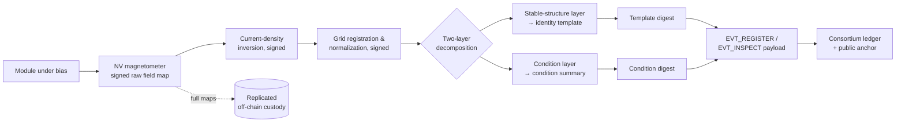
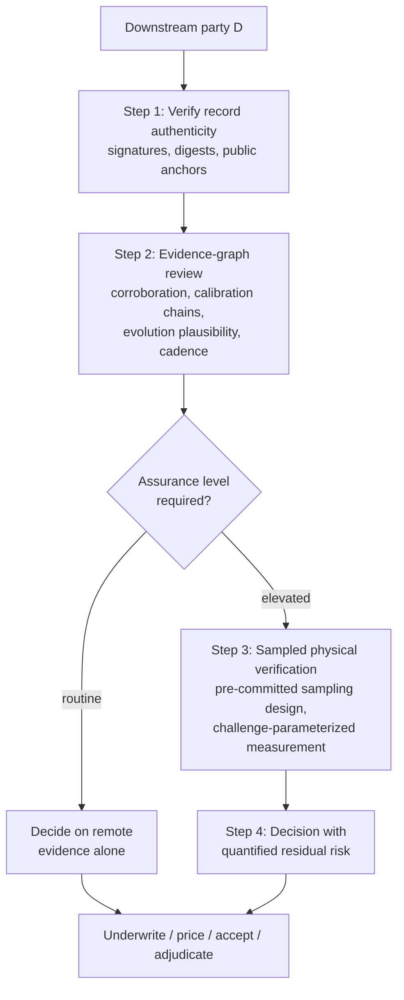

# Quantum Defect Mapping and Integrity Verification

## What This Chapter Covers

This is the book's anchor chapter, and the one that draws most directly on my own
research. It develops the passive-binding branch of Chapter 3 to its strongest form:
using quantum sensing to map the defect structure of photovoltaic devices, binding
those maps to the ledger identity record at enrollment, and building on that binding
a verification workflow through which a downstream party — an insurer, a buyer, a
grid operator, a warranty adjudicator — can trust a panel's recorded condition
history without trusting its custodian. Portions of the mechanism described in
Sections 6.4–6.6 are the subject of my pending patent application; as promised in the
Preface, the ideas are explained fully, and readers evaluating alternative
integrity-verification mechanisms will find the workflow of Section 6.6 transfers to
any binding modality that satisfies the requirements of Section 6.5.

A note on posture. Quantum sensing attracts more enthusiasm than scrutiny, and a
chapter like this one earns trust by being exact about limits. I have tried to state
throughput, cost, and maturity honestly at each step, and Section 6.8 collects the
open problems rather than burying them.

## 6.1 Why Defects, of All Things

Chapter 3 established the requirements for a passive structural fingerprint:
per-unit uniqueness, multi-decade stability of some feature subset, discrimination
under field measurement noise, and forgery cost exceeding forgery value. The defect
structure of a crystalline silicon device is a strong candidate against all four, for
a reason worth stating carefully:

**The defect distribution is precisely what manufacturing does not control.** A
production line controls means and tolerances — cell efficiency binning, layer
thicknesses, contact resistances. It does not, and cannot, control the microscopic
placement of grain boundaries, dislocation clusters, impurity precipitates, and
shunt paths; these arise from the stochastic physics of ingot solidification and cell
processing. Two cells from adjacent wafer positions differ measurably and
irreproducibly. For an attacker, this is the worst possible situation: forging a
fingerprint means reproducing, in semiconductor bulk, a specific random pattern that
the legitimate manufacturer could not reproduce with the same fab on the same day.
The forgery-cost asymmetry of Section 3.4 is at its maximum here.

Defects are also — and this is the design insight the rest of the chapter exploits —
**the same features that determine the asset's condition and future**. A fingerprint
built on encapsulant speckle identifies the module but says nothing about it. A
fingerprint built on the defect map identifies the module *and is itself the
baseline condition record*: degradation is, physically, the evolution of this very
map. Identity verification and condition assessment collapse into one measurement,
which is what makes the economics of Section 6.7 close.

## 6.2 The Sensing Toolbox

Several quantum sensing modalities can characterize current flow and material
structure in photovoltaic devices. This section states what each measures and where
it fits; the physics is developed only to the depth the system architecture needs.

**Nitrogen-vacancy (NV) magnetometry.** The workhorse. An NV center — a
nitrogen-substitution-plus-vacancy defect in diamond — has an electronic spin state
that can be initialized and read out optically, and whose energy levels shift with
local magnetic field (read out via optically detected magnetic resonance, ODMR).
Arrays of NV centers in a diamond chip placed near a current-carrying device image
the magnetic field the currents produce, at room temperature, with spatial resolution
from micrometers (contact or near-contact imaging) to millimeters (standoff), and
sensitivities in the nT–pT range depending on integration time. Inverting the
measured field map yields a **current-density map** of the cell under bias. Shunts,
cracked-finger detours, high-resistance solder bonds, and inactive cell regions all
leave characteristic current-flow signatures — including some (buried shunts,
sub-surface junction defects) that produce little or no optical/EL contrast, because
the current path disturbance lies beneath the radiative recombination the EL camera
sees.

**Scanning SQUID and fluxgate magnetometry.** Higher field sensitivity (SQUIDs) at
the cost of cryogenics and slow scanning — laboratory reference tools, not line
tools. Fluxgate arrays offer a cheap, coarse intermediate useful for string-level
field screening.

**Complementary classical modalities.** The system design that follows never uses
quantum sensing alone. EL imaging (fast, mature, optical-depth-limited), IR
thermography (coarse, field-deployable), and I–V characterization (integral, not
spatial) each corroborate the magnetometric map per Section 4.5's Rule 2. Table 6.1
positions the modalities.

**Table 6.1** Measurement modalities for module structural characterization, as used
in this chapter's architecture.

| Modality | Measures | Resolution | Speed (60-cell module) | Deployment | Role here |
|---|---|---|---|---|---|
| NV magnetometry (near-contact) | Current density via field map | ~10 µm–1 mm | Minutes (bench, current systems) | Lab / factory line (emerging) | Enrollment fingerprint; escalated verification |
| NV magnetometry (standoff array) | Coarse current anomalies | ~mm–cm | Seconds–minutes | Field-portable (prototype) | Field re-verification |
| Scanning SQUID | Current density | ~µm | Hours | Cryogenic lab | Reference / calibration |
| EL imaging | Radiative recombination pattern | ~100 µm–1 mm | Seconds | Factory + field (mature) | Corroborating fingerprint; routine checks |
| IR thermography | Dissipative hot spots | ~cm | Seconds (drone) | Field (mature) | Fleet screening, triage |
| I–V / dark I–V | Integral electrical params | none (integral) | Seconds | Factory + field (mature) | Cheap corroboration |

The honest maturity statement: factory-speed NV magnetometry of full modules is at
the advanced-prototype stage — bench systems image cells in minutes; in-line
throughput at seconds-per-module is an engineering extrapolation with identified
paths (wide-field NV imaging, parallel sensor tiles) rather than a shipping product.
The architecture is therefore designed so that EL carries the routine load today and
the magnetometric layer raises the assurance ceiling where and when it is deployed —
a deployment-time dial, not an all-or-nothing bet (Section 6.7).

## 6.3 From Measurement to Fingerprint Template

A raw defect map is a large image-like object (Table 4.1 budgeted 10–100 MB); a
fingerprint template is the compact, comparison-ready derivative committed at
enrollment. The pipeline, each stage signed per the provenance-chain discipline of
Section 4.5:

1. **Registration and normalization.** Map is registered to the module's cell grid
   (busbars and cell edges provide the frame), normalized for bias current and
   temperature — both recorded, since comparison across operating points is a known
   error source.
2. **Feature decomposition.** The map is decomposed into a *stable-structure layer*
   (grain-boundary current texture, as-built shunt population, fixed process
   signatures) and a *condition layer* (features known to evolve: crack networks,
   solder-bond resistances, PID-susceptible patterns). The decomposition is the
   scientific heart of the scheme — Section 3.4 previewed why: identity must rest on
   the stable layer, while the condition layer becomes the degradation record.
3. **Template encoding.** The stable layer is encoded as a feature vector with a
   defined similarity metric and decision thresholds calibrated on false-accept /
   false-reject trade-offs (the biometric formalism transfers directly, and
   Appendix B's comparison table uses its vocabulary). The condition layer is
   encoded as a versioned condition summary.
4. **Commitment.** Template digest and condition-summary digest enter the
   `EVT_REGISTER` (or `EVT_INSPECT`) payload; full maps go to replicated off-chain
   custody per Section 4.2.

**Figure 6.1** The enrollment pipeline. Everything to the right of the instrument is
a signed computation chain; the two-layer decomposition feeds identity and condition
records separately.

## 6.4 Binding the Map to the Identity Record

The binding construction — the part of the mechanism at the center of the patent
application — has three elements beyond the pipeline above.

**Cross-modal locking.** The enrollment event commits templates from at least two
physically independent modalities (magnetometric stable-structure plus EL structural)
*with a recorded spatial co-registration between them*. An attacker must now forge
two physically distinct signatures **and their mutual geometric relationship** — and
the co-registration is cheap for the legitimate enroller (one fixture, one
timestamp) while roughly squaring the forger's problem, since the modalities sample
different depths of the device (EL sees radiative recombination; magnetometry sees
current paths, including buried ones).

**Challenge-parameterized measurement.** The field verification protocol does not
simply re-measure and compare. The verifier draws a random challenge — a bias
current level and a subset of cells/regions, from a challenge space fixed at
enrollment — and the comparison is performed on the challenged slice. Because
current-flow patterns vary with bias point in a device-specific, defect-determined
way, a static replica (a "defect decal") that matches one operating point fails at
another. This imports the liveness logic of challenge–response authentication
(Section 3.3) into a device with no processor: **the physics answers the challenge.**

**Supersession with provenance.** Structure evolves; templates age. `EVT_REENROLL`
(Section 5.3) lets an accredited verifier commit a new template that *supersedes*
the old with an explicit reason and a full measurement trail — never replacing it.
The chain of superseded templates is itself evidence: each re-enrollment's condition
layer must be a physically plausible evolution of its predecessor (cracks extend,
they do not heal), and implausible transitions flag substitution. Identity, on this
design, is not a static match to a birth certificate but *continuity of documented
physical evolution* — which is, on reflection, how identity works for every aging
physical thing, formalized.

## 6.5 Requirements Stated Generally

For readers who will adopt a different sensing modality — and to keep the
architecture honest about what it actually depends on — the properties the binding
layer requires of *any* fingerprint mechanism:

**Table 6.2** Requirements on a passive binding modality, and how the defect-map
construction meets them.

| Requirement | General statement | Defect-map realization |
|---|---|---|
| R1 Uniqueness entropy | Feature space large and device-individual | Stochastic solidification/process defects |
| R2 Stable subset | Identifiable features invariant over service life at field measurement precision | Grain texture, as-built shunt population |
| R3 Forgery asymmetry | Reproducing features in a physical artifact costs ≫ asset value | Requires controlling bulk semiconductor microstructure |
| R4 Challengeability | Measurement can be parameterized so static replicas fail | Bias-dependent current-path physics |
| R5 Evolution plausibility | Feature drift constrained by known physics, so histories are checkable | Crack/degradation physics is directional |
| R6 Field feasibility | Verification cost and time compatible with Section 1.3 economics | EL routine; magnetometric escalation (6.7) |

## 6.6 The Verification Workflow: Trusting a History You Didn't Witness

The point of all of it. A downstream party \(D\) — insurer, buyer, grid operator,
adjudicator — holds none of the asset's history and distrusts its custodian. The
workflow by which \(D\) reaches justified confidence, at a chosen assurance level:

**Step 1 — Record authenticity (no site visit).** \(D\) resolves the asset DID,
retrieves the event stream, checks signatures and corroboration classes, verifies
digests against off-chain payloads, and verifies block inclusion against the
*public* anchors (Section 4.4). Outcome: the history is exactly what was recorded,
by the named parties, at the anchored times — regardless of what the consortium
would now prefer.

**Step 2 — Evidence-graph review (no site visit).** \(D\) traverses the `prior_refs`
DAG for the question at hand: does the commissioning event carry Class C
corroboration? Were the instruments in calibration (their own DIDs, Step 1 applied
recursively)? Do successive condition layers form a physically plausible evolution
(R5)? Is the event cadence complete against the cohort baseline (Section 5.7)?
Automated policy engines do this wholesale; Chapter 11 shows one.

**Step 3 — Physical verification (site visit, sampled).** For the assurance level
the transaction warrants, \(D\) (or an accredited verifier \(D\) trusts) draws the
challenge, measures the challenged slice in the field, and compares against the
enrolled template chain. Sampling design — how many units, chosen how — is itself
committed to the ledger *before* the visit, so the custodian cannot cherry-pick and
\(D\) can later prove the rigor of its own diligence.

**Step 4 — Decision with quantified residuals.** \(D\) now holds: authenticated
history, policy-checked evidence graph, and physical binding verified on a random
sample at stated false-accept rates. What remains unverifiable is enumerable
(enrollment-time substitution; events off the ledger entirely) and priced rather
than unknown.

**Figure 6.2** The four-step verification workflow. Steps 1–2 are remote and cheap;
Step 3 is the proportional escalation of Section 3.6.

What has actually changed relative to Chapter 1's opening transaction deserves
plain statement. The buyer's engineer of Section 1.1 could only choose between
trusting documents and re-testing everything. \(D\) instead verifies *documents
against mathematics* (Steps 1–2, nearly free) and *matter against documents* on a
random sample whose size is set by decision theory, not despair (Step 3). Trust has
been decomposed into checkable parts, and the unverifiable residue has been made
small, explicit, and insurable. That decomposition — not any single measurement —
is the chapter's contribution.

## 6.7 Economics and Deployment Tiers

The mechanism must clear Section 1.3's unit economics. The architecture's answer is
tiering — assurance purchased in proportion to value at risk, with each tier's cost
justified by the transaction it serves rather than spread across all units:

- **Tier 0 (all units):** enrollment at manufacture using in-line EL the factory
  already performs, plus flash-test VC. Marginal cost: template computation and a
  ledger event — cents.
- **Tier 1 (all units, opportunistic):** re-verification whenever routine O&M
  imaging touches a unit anyway; the marginal cost of comparison against an existing
  image is near zero.
- **Tier 2 (sampled units, event-driven):** magnetometric enrollment at manufacture
  for premium product lines, and field magnetometric verification for escalations —
  plant acquisitions, catastrophe claims, warranty adjudications — where the
  transaction at stake is many orders of magnitude above the measurement cost.
- **Tier 3 (reference):** laboratory-grade characterization anchoring calibration
  chains and dispute resolution.

The tier structure is why instrument maturity (Section 6.2's honest statement) does
not gate the architecture: Tiers 0–1 deploy on today's mature EL infrastructure and
already deliver most of the counterfeit and history-integrity value; Tier 2's
quantum layer raises the assurance ceiling for the transactions that pay for it, and
widens as the instruments mature.

## 6.8 Open Problems

Stated as research questions, continued in Chapter 14: (1) **Stability
quantification** — R2 needs twenty-year longitudinal data that does not yet exist;
accelerated aging gives grounds for confidence in grain-texture stability, not
proof, and the supersession mechanism of Section 6.4 is the architectural hedge.
(2) **Inversion uniqueness** — field-to-current inversion is ill-posed; the
challenge protocol must be designed so that inversion ambiguity does not open a
matching loophole. (3) **Throughput engineering** — wide-field NV imaging at line
speed. (4) **Template standardization** — cross-vendor comparability of templates
and thresholds (Appendix B tabulates the current landscape). (5) **Thin-film and
emerging cell technologies** — the defect phenomenology of perovskites and tandems
is younger than the assets this book wants to protect.

## 6.9 Chapter Summary

The defect structure of a photovoltaic device is manufacturing's uncontrolled
residue, and that is exactly what makes it the strongest available anchor for
passive identity: unique by physics, unforgeable at reasonable cost by the R3
asymmetry, and — the design's central economy — identical with the condition
evidence the lifecycle record needs anyway. NV magnetometry supplies current-path
maps that see beneath optical modalities; the two-layer decomposition separates
identity (stable structure) from condition (evolving damage); cross-modal locking,
challenge-parameterized measurement, and supersession-with-provenance turn a
measurement into a binding. On that binding stands the four-step verification
workflow: authenticate the record against public anchors, police the evidence graph,
verify matter against template on a pre-committed random sample, and decide with
residual risk that is quantified rather than vague. Assurance is bought in tiers, so
the mature EL layer carries routine load while the quantum layer prices into the
transactions that need it. What this mechanism defends, and what still gets through,
is the business of Chapter 8 — after Chapter 7 confirms the whole design scales to
fleets worth attacking.

## References and Further Reading

1. Degen, C. L., F. Reinhard, and P. Cappellaro. "Quantum Sensing." *Reviews of
   Modern Physics* 89, no. 3 (2017): 035002.
2. Rondin, L., J.-P. Tetienne, T. Hingant, J.-F. Roch, P. Maletinsky, and
   V. Jacques. "Magnetometry with Nitrogen-Vacancy Defects in Diamond." *Reports on
   Progress in Physics* 77, no. 5 (2014): 056503.
3. Glenn, D. R., R. R. Fu, P. Kehayias, et al. "Micrometer-Scale Magnetic Imaging
   of Geological Samples Using a Quantum Diamond Microscope." *Geochemistry,
   Geophysics, Geosystems* 18, no. 8 (2017): 3254–3267.
4. Breitenstein, O., W. Warta, and M. C. Schubert. *Lock-in Thermography: Basics and
   Use for Evaluating Electronic Devices and Materials.* 3rd ed. Springer, 2018.
5. Köntges, M., et al. *Review of Failures of Photovoltaic Modules.* IEA-PVPS
   Task 13 Report T13-01:2014 (crack morphology and evolution).
6. Fuyuki, T., and A. Kitiyanan. "Photographic Diagnosis of Crystalline Silicon
   Solar Cells Utilizing Electroluminescence." *Applied Physics A* 96 (2009):
   189–196.
7. Jain, A. K., A. Ross, and S. Prabhakar. "An Introduction to Biometric
   Recognition." *IEEE Transactions on Circuits and Systems for Video Technology*
   14, no. 1 (2004): 4–20 (false-accept/false-reject formalism).
8. [AUTHOR'S PATENT APPLICATION — NUMBER, TITLE, FILING DATE TO BE SUPPLIED.]

\newpage
