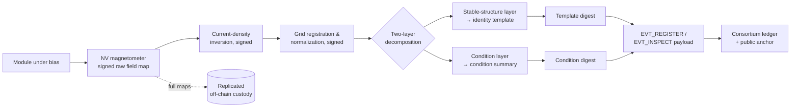
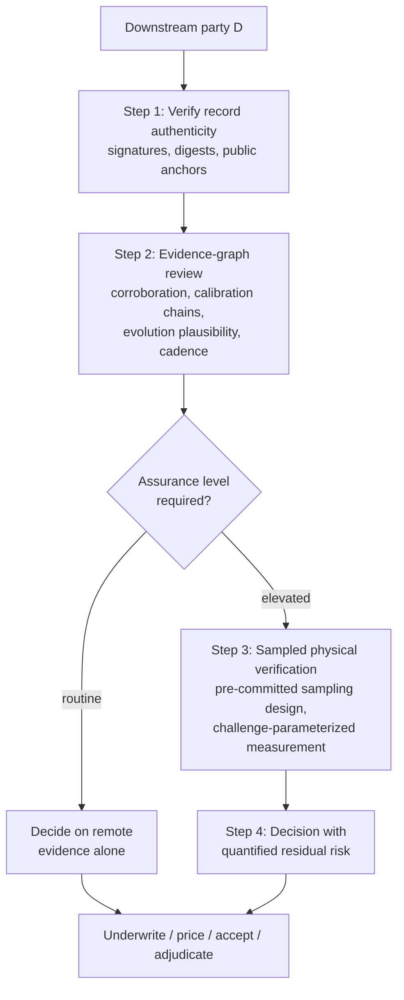

# Quantum Defect Mapping and Integrity Verification

## What This Chapter Covers

This is the book's anchor chapter, and the one that draws most directly on my own
research. It develops the passive-binding branch of Chapter 3 to its strongest form:
using quantum sensing to map the defect structure of photovoltaic devices, binding
those maps to the ledger identity record at enrollment, and building on that binding
a verification workflow through which a downstream party — an insurer, a buyer, a
grid operator, a warranty adjudicator — can trust a panel's recorded condition
history without trusting its custodian. Everything Part II has built converges
here: the enrollment moment of Chapter 4 gets its measurement, the
`EVT_REGISTER` and `EVT_INSPECT` events of Chapter 5 get their payloads, and
the four identity properties of Chapter 1 finally get their physical root. Portions of the mechanism described in
Sections 6.4–6.6 are the subject of my pending patent application; as promised in the
Preface, the ideas are explained fully, and readers evaluating alternative
integrity-verification mechanisms will find the workflow of Section 6.6 transfers to
any binding modality that satisfies the requirements of Section 6.5. Section 6.9
states the intellectual-property posture plainly so that no reader has to
infer it from omissions.

A note on posture. Quantum sensing attracts more enthusiasm than scrutiny, and a
chapter like this one earns trust by being exact about limits. I have tried to state
throughput, cost, and maturity honestly at each step, and Section 6.8 collects the
open problems rather than burying them. The chapter runs from the physical
argument (why defect structure is the right anchor, and why simpler marks are
not), through the sensing toolbox with its maturity stated plainly, the
enrollment pipeline and its two-layer decomposition, the three-element
binding construction, the generalized requirements for readers bringing
other modalities, the four-step verification workflow with its sampling
arithmetic, and the tier economics — closing with the open problems and, in
Section 6.9, a plain statement of the intellectual-property posture so that
readers can weigh the argument knowing its author's stake.

## 6.1 Why Defects, of All Things

Chapter 3 established the requirements for a passive structural fingerprint:
per-unit uniqueness, multi-decade stability of some feature subset, discrimination
under field measurement noise, and forgery cost exceeding forgery value. Most
proposals in this space begin from an instrument and search for an
application; the argument here runs the other way — from the requirements to
the physical layer that best satisfies them, and only then to the instruments
that can read that layer. The defect
structure of a crystalline silicon device is a strong candidate against all four, for
a reason worth stating carefully:

**The defect distribution is precisely what manufacturing does not control.** A
production line controls means and tolerances — cell efficiency binning, layer
thicknesses, contact resistances. It does not, and cannot, control the microscopic
placement of grain boundaries, dislocation clusters, impurity precipitates, and
shunt paths; these arise from the stochastic physics of ingot solidification and cell
processing. Two cells from adjacent wafer positions differ measurably and
irreproducibly. For an attacker, this is the worst possible situation: forging a
fingerprint means reproducing, in semiconductor bulk, a specific random pattern that
the legitimate manufacturer could not reproduce with the same fab on the same day.
The forgery-cost asymmetry of Section 3.4 is at its maximum here.

A short inventory of the defect population makes the argument concrete. In
multicrystalline silicon, *grain boundaries* — the interfaces between randomly
oriented crystal domains — form a per-wafer pattern set by the stochastic
nucleation of the ingot's solidification front; no two wafers share one, and
the pattern is legible in both recombination imaging and current-path
structure. *Dislocation clusters* — tangles of lattice defects that propagate
during crystal growth — dot each wafer in densities and positions that vary
even between adjacent wafers from one brick. In monocrystalline material,
where grain structure is absent, individuality persists in subtler channels:
*oxygen precipitates* and ring patterns from the crystal pull, striations
from dopant fluctuation, and the statistical scatter of *process-induced*
features — micro-shunts where emitter diffusion or edge isolation varied,
metallization finger discontinuities from screen-printing stochastics,
firing-profile signatures in contact resistance. Cell interconnection then
adds the solder-bond population, each joint's resistance its own small random
variable. The population is layered, three-dimensional, and — decisively —
*sub-visual*: most of it produces no optical contrast at the module surface,
so the counterfeiter examining a module cannot even read the features he
would need to reproduce without laboratory instrumentation.

### 6.1.1 Why Not Simpler Marks

Two engineered alternatives deserve dispatch before the physics, because both
are regularly proposed as cheaper roads to the same destination. *Laser-etched
serial marks* — engraving the identifier into the glass or cell — improve on
labels (the mark survives weathering and cannot fall off) but remain
identification, not authentication: the mark is applied *to* the object rather
than being *of* it, so the forger's task is unchanged — apply the same mark to
a different object. Etching also cannot be re-issued without visible
accumulation, and cell-level marks cost yield. *Engineered taggants* — DNA
markers, rare-earth pigments, or micro-particle codes mixed into encapsulant
or backsheet — genuinely bind to the material and have real anti-counterfeit
value at the *batch* level (is this genuine manufacturer material?), but they
are common to every unit sharing the material lot, so they cannot distinguish
units; per-unit taggant dosing at module economics has not been demonstrated;
and taggants are secrets — their security degrades as the formulation
circulates, the opposite of a structural fingerprint whose "secret" is a
random pattern nobody, including the manufacturer, chose or can reproduce.
Both alternatives fail the same clause of the requirements: they add an
identity *artifact* where the design needs an identity *property*. The defect
map is the only candidate on the table that the object cannot be separated
from, because it is the object.

Defects are also — and this is the design insight the rest of the chapter exploits —
**the same features that determine the asset's condition and future**. A fingerprint
built on encapsulant speckle identifies the module but says nothing about it. A
fingerprint built on the defect map identifies the module *and is itself the
baseline condition record*: degradation is, physically, the evolution of this very
map. Cracks propagate from stress concentrations the map recorded; PID
develops preferentially where shunt precursors sat; solder-bond fatigue grows
from the resistance outliers the enrollment measurement flagged. Identity
verification and condition assessment collapse into one measurement,
which is what makes the economics of Section 6.7 close — and, as a bonus the
warranty industry will appreciate, the enrollment map is *predictive*: the
defect population at manufacture is among the best available predictors of
the module's degradation trajectory, so the identity record doubles as an
underwriting input (Chapter 13 returns to this).

## 6.2 The Sensing Toolbox

Several quantum sensing modalities can characterize current flow and material
structure in photovoltaic devices. This section states what each measures and where
it fits; the physics is developed only to the depth the system architecture needs.

**Nitrogen-vacancy (NV) magnetometry.** The workhorse, and worth a careful
paragraph of physics because the architecture's claims rest on what it can and
cannot measure. An NV center is a point defect in diamond — a substitutional
nitrogen atom adjacent to a lattice vacancy — whose ground state is a spin
triplet with a convenient pair of properties: the spin can be *initialized*
and *read out* optically (green excitation; the red fluorescence intensity
depends on the spin state), and its energy sublevels shift linearly with the
local magnetic field through the Zeeman effect. Sweeping a microwave drive
across the spin resonance while monitoring fluorescence — optically detected
magnetic resonance, ODMR — turns each NV center into an atomic-scale
magnetometer that operates at room temperature, with no cryogenics and no
shielding requirements beyond ordinary lab practice. Two deployment formats
matter here. In *wide-field* imaging, a thin layer of NV centers engineered
into a diamond plate is placed against (or within a millimeter of) the
device; a camera reads the fluorescence of millions of centers in parallel,
producing a full-field magnetic image in seconds to minutes at
micrometer-scale resolution over centimeter-scale fields of view — tiled
across a cell or module by scanning. In *standoff* arrays, discrete NV (or
fluxgate) sensors at centimeter distances trade resolution for speed and
robustness, suitable for field screening. Sensitivities depend on integration
time and sensor engineering, spanning roughly the nanotesla to sub-nanotesla
range in practical wide-field configurations — comfortably sufficient, since
the fields from ampere-scale currents in cell metallization at millimeter
distances sit in the microtesla regime.

The measured quantity is the magnetic field above the device; the wanted
quantity is the **current density within it**, recovered by inverting the
Biot–Savart relation. For the quasi-two-dimensional current sheets of a solar
cell the inversion is well-conditioned up to a spatial-frequency limit set by
the sensor standoff distance — the physics behind Table 6.1's
resolution-versus-deployment trade — and its regularization choices are part
of the signed processing chain of Section 6.3 (and the subject of open
problem M2). What current-density maps reveal that optical modalities cannot:
shunt currents (localized vertical leakage paths), current detours around
cracked or interrupted fingers, asymmetric injection from degraded solder
bonds, and inactive regions — including variants of each that lie beneath the
radiative-recombination layer an EL camera images, or that manifest only as
current redistribution with no emission contrast at all. Magnetometry and EL
are thus genuinely complementary at the physics level, which is what gives
the cross-modal locking of Section 6.4 its teeth.

**Scanning SQUID and fluxgate magnetometry.** Higher field sensitivity (SQUIDs) at
the cost of cryogenics and slow scanning — laboratory reference tools, not line
tools. Fluxgate arrays offer a cheap, coarse intermediate useful for string-level
field screening.

Field operating requirements for the magnetometric modalities deserve honest
listing, since site conditions are not a laboratory. The measurement needs
current through the device — forward bias injection (the EL condition,
typically performed at night or under opaque covers for installed modules)
or, in a useful daytime variant, the module's own photocurrent under load
modulation, which trades signal control for zero setup. It needs standoff
control at millimeters for high-resolution work, achievable with contact
fixtures on accessible modules and genuinely awkward on trackers at height —
one reason the V3 tier often prefers pulling sampled modules to a ground
station. It tolerates Earth's field and site magnetic clutter through
gradiometric and lock-in techniques (modulating the bias and detecting
synchronously rejects static backgrounds), but high-current DC cabling nearby
sets a noise floor the campaign plan must respect. None of these constraints
is disqualifying; all of them cost minutes per unit, which is exactly why the
sampling arithmetic of Section 6.6.1, rather than instrument physics, is
what makes field verification affordable.

**Complementary classical modalities.** The system design that follows never uses
quantum sensing alone. EL imaging (fast, mature, optical-depth-limited), IR
thermography (coarse, field-deployable), and I–V characterization (integral, not
spatial) each corroborate the magnetometric map per Section 4.5's Rule 2. Table 6.1
positions the modalities.

**Table 6.1** Measurement modalities for module structural characterization, as used
in this chapter's architecture. Speeds and maturities are stated for 2026 and
will age in the reader's favor; the *roles* column is the durable content.

| Modality | Measures | Resolution | Speed (60-cell module) | Deployment | Role here |
|---|---|---|---|---|---|
| NV magnetometry (near-contact) | Current density via field map | ~10 µm–1 mm | Minutes (bench, current systems) | Lab / factory line (emerging) | Enrollment fingerprint; escalated verification |
| NV magnetometry (standoff array) | Coarse current anomalies | ~mm–cm | Seconds–minutes | Field-portable (prototype) | Field re-verification |
| Scanning SQUID | Current density | ~µm | Hours | Cryogenic lab | Reference / calibration |
| EL imaging | Radiative recombination pattern | ~100 µm–1 mm | Seconds | Factory + field (mature) | Corroborating fingerprint; routine checks |
| IR thermography | Dissipative hot spots | ~cm | Seconds (drone) | Field (mature) | Fleet screening, triage |
| I–V / dark I–V | Integral electrical params | none (integral) | Seconds | Factory + field (mature) | Cheap corroboration |

The complementary classical modalities deserve their own cost-and-capability
honesty, since they carry the routine tiers. Factory EL is a solved problem:
in-line EL stations are standard equipment on modern lines, cycle within
takt, and produce full-module images whose per-unit marginal cost is
electricity and storage. Field EL has matured rapidly — daylight-capable
contact rigs and drone-mounted nighttime EL both operate commercially — with
per-module costs in the single dollars at campaign scale. Drone IR
thermography is cheaper still per module (entire plants in days) at the price
of coarse, screening-grade information. Flash testers and portable I–V
tracers are ubiquitous. The quantum layer's instruments, by contrast,
currently price like laboratory equipment: wide-field NV microscopes are
six-figure instruments built in small volumes, and a factory-hardened
line-speed variant is a product that does not yet exist. The architecture's
wager — argued in Section 6.7's tiering rather than assumed — is that this
cost curve follows the usual trajectory of sensing instruments once an
industrial demand exists, and that in the meantime the small installed base
serves the escalation tiers, where a six-figure instrument amortized across
adjudications and acquisitions is cheap.

Every instrument in the table is also, per Section 4.5's Rule 3, an asset in
the system: the defect-map scanner that enrolls a million modules is a
million-fold single point of trust, and its own identity, firmware
attestation, and calibration lifecycle receive I-A treatment (Table 4.3)
without exception. The Tier 3 reference laboratory's role is to anchor this
recursion: field and factory instruments calibrate against transported
reference artifacts — modules with laboratory-grade characterization whose
own histories live on the ledger — so that a template's meaning is traceable
through the instrument chain to a metrological root, in exactly the pattern
dimensional and electrical metrology have used for a century.

The honest maturity statement: factory-speed NV magnetometry of full modules is at
the advanced-prototype stage — bench systems image cells in minutes; in-line
throughput at seconds-per-module is an engineering extrapolation with identified
paths (wide-field NV imaging, parallel sensor tiles) rather than a shipping product.
The architecture is therefore designed so that EL carries the routine load today and
the magnetometric layer raises the assurance ceiling where and when it is deployed —
a deployment-time dial, not an all-or-nothing bet (Section 6.7).

## 6.3 From Measurement to Fingerprint Template

A raw defect map is a large image-like object (Table 4.1 budgeted 10–100 MB); a
fingerprint template is the compact, comparison-ready derivative committed at
enrollment. The distinction matters legally as well as technically: the raw
map is the *evidence*, preserved in custody for the disputes that want
everything; the template is the *operational instrument*, sized and
structured for millions of fast comparisons; and because each processing
stage signs its output against its input's digest, a court or counterparty
can always walk from the operational answer back to the primary evidence and
recompute the walk. The pipeline, each stage signed per the provenance-chain
discipline of Section 4.5:

1. **Registration and normalization.** Map is registered to the module's cell grid
   (busbars and cell edges provide the frame), normalized for bias current and
   temperature — both recorded, since comparison across operating points is a known
   error source. The error budget assigns this stage its own allocation:
   registration residuals must sit well below the smallest stable feature's
   scale, which the busbar skeleton achieves comfortably; temperature
   normalization matters because shunt behavior and series resistances are
   temperature-dependent, and the enrollment record therefore stores the
   measurement conditions as first-class data rather than as lab-notebook
   afterthoughts.
2. **Feature decomposition.** The map is decomposed into a *stable-structure layer*
   (grain-boundary current texture, as-built shunt population, fixed process
   signatures) and a *condition layer* (features known to evolve: crack networks,
   solder-bond resistances, PID-susceptible patterns). The decomposition is the
   scientific heart of the scheme — Section 3.4 previewed why: identity must rest on
   the stable layer, while the condition layer becomes the degradation record.
   The assignment of feature classes to layers is itself versioned scientific
   content: it encodes the field's current understanding of which features
   age, it improves as longitudinal data accumulates (open problem M1), and
   the pilot's mid-course re-decomposition (Section 11.5, lesson 6) was
   precisely an upgrade of this assignment, executed through the schema's
   versioning machinery rather than through a data migration.
3. **Template encoding.** The stable layer is encoded as a feature vector with a
   defined similarity metric and decision thresholds calibrated on false-accept /
   false-reject trade-offs (the biometric formalism transfers directly, and
   Appendix B's comparison table uses its vocabulary). The condition layer is
   encoded as a versioned condition summary. Threshold calibration is
   empirical and cohort-based: the FAR side is estimated by cross-comparing
   templates across large production populations (every pair of distinct
   modules is a labeled impostor trial, so a production month yields billions
   of trials free), while the FRR side requires re-measurement campaigns
   under field conditions — scarcer data, and the reason verification
   protocols always carry a re-measure-before-escalate step.
4. **Commitment.** Template digest and condition-summary digest enter the
   `EVT_REGISTER` (or `EVT_INSPECT`) payload; full maps go to replicated off-chain
   custody per Section 4.2, encrypted per Section 4.2.1 — the full map is
   commercially sensitive (it reveals process signatures a competitor could
   read) even though the template digest reveals nothing.

Template sizes, for the record and for Chapter 7's storage arithmetic: the
stable-structure template encodes to tens or hundreds of kilobytes per module
depending on modality and version (grain-texture features dominate); the
condition summary is similar; the underlying full maps are the 10–100 MB
payloads of Table 4.1. Only digests of any of these touch the ledger. The
encoding is a versioned, documented format per Section 4.2.1's longevity
rules — and its openness is precisely what standardization gap S3 is about,
since a template only proves anything to a verifier whose software can
compute the same features from a fresh measurement.

**Figure 6.1** The enrollment pipeline. Everything to the right of the instrument is
a signed computation chain; the two-layer decomposition feeds identity and condition
records separately.

## 6.4 Binding the Map to the Identity Record

The binding construction — the part of the mechanism at the center of the patent
application — has three elements beyond the pipeline above.

**Cross-modal locking.** The enrollment event commits templates from at least two
physically independent modalities (magnetometric stable-structure plus EL structural)
*with a recorded spatial co-registration between them*. An attacker must now forge
two physically distinct signatures **and their mutual geometric relationship** — and
the co-registration is cheap for the legitimate enroller (one fixture, one
timestamp) while roughly squaring the forger's problem, since the modalities sample
different depths of the device (EL sees radiative recombination; magnetometry sees
current paths, including buried ones). Mechanically, co-registration is a
shared coordinate solution: both instruments image the same fiducial
skeleton (busbars, cell edges) in the same fixture without re-handling the
module between captures, and the enrollment payload records the transform
between the two feature sets along with its residuals. At verification, the
lock is checked by confirming not only that each modality matches its
template but that features *shared across modalities* — a grain boundary
visible in EL whose current-texture counterpart appears in the field map —
sit at the recorded mutual positions. A forger who solves each modality
separately (already implausible) discovers that the solutions must also be
the *same object's* solutions, aligned to sub-feature precision. Independence
between the modalities is what makes the multiplication legitimate; this is
Rule 2 of Section 4.5 executed in physics rather than in signatures.

**Challenge-parameterized measurement.** The field verification protocol does not
simply re-measure and compare. The verifier draws a random challenge — a bias
current level and a subset of cells/regions, from a challenge space fixed at
enrollment — and the comparison is performed on the challenged slice. Because
current-flow patterns vary with bias point in a device-specific, defect-determined
way, a static replica (a "defect decal") that matches one operating point fails at
another. This imports the liveness logic of challenge–response authentication
(Section 3.3) into a device with no processor: **the physics answers the challenge.**

The challenge space's size is what makes the mechanism more than a gesture.
Enrollment captures the map at several bias points spanning the device's
operating range, from which the *bias response* of each stable feature is
characterized — shunts whose current share grows nonlinearly with bias,
detour paths whose visibility switches with injection level, resistive
signatures that migrate. A challenge then names a bias point (drawn from a
continuum, not a menu), a cell subset, and a feature class; the expected
response is computable from the enrollment characterization but the *full*
response surface was never published — only its digest-committed
parameterization, disclosed slice by slice as challenges consume it. An
adversary who obtained every template in the registry still faces the
question a static artifact cannot answer: *how does your defect population
respond to a bias point nobody has asked about before?* Only a device with
an actual, physically consistent defect population responds correctly, and
manufacturing such a device is the R3 problem again. The design's honest
caveat is inversion ambiguity — whether distinct defect populations could
share response surfaces within measurement error across the challenge space
— which is exactly open problem M2, stated so the research community can
attack it rather than discover it.

**Supersession with provenance.** Structure evolves; templates age. `EVT_REENROLL`
(Section 5.3) lets an accredited verifier commit a new template that *supersedes*
the old with an explicit reason and a full measurement trail — never replacing it.
The chain of superseded templates is itself evidence: each re-enrollment's condition
layer must be a physically plausible evolution of its predecessor (cracks extend,
they do not heal), and implausible transitions flag substitution. Identity, on this
design, is not a static match to a birth certificate but *continuity of documented
physical evolution* — which is, on reflection, how identity works for every aging
physical thing, formalized.

The evolution-plausibility check (requirement R5) deserves its mechanics
spelled out, because it is the supersession mechanism's immune system. Crack
networks grow monotonically: a verification image whose crack set is a strict
superset of the enrollment's, with extensions rooted at recorded stress
concentrations, is a plausible successor; an image whose cracks have
*vanished*, migrated, or appeared with morphologies inconsistent with the
module's recorded mechanical history is not. Shunt populations drift in
bounded ways — existing shunts strengthen with PID stress and partially
recover under reverse-bias regimes, but new shunts do not materialize in
patterns uncorrelated with cell structure. Solder-bond resistances walk
upward with thermal-cycle counts at rates the fatigue literature bounds.
Each of these is a checkable directional constraint, and the checks compose:
a substituted module must not merely resemble the target — it must present a
condition layer that is a *physically legal evolution* of a specific recorded
past it never lived. The check's power grows with every recorded inspection
(more waypoints to be consistent with), which pleasingly means the assets
with the most valuable histories are also the hardest to impersonate.

## 6.5 Requirements Stated Generally

For readers who will adopt a different sensing modality — and to keep the
architecture honest about what it actually depends on — the properties the binding
layer requires of *any* fingerprint mechanism:

**Table 6.2** Requirements on a passive binding modality, and how the defect-map
construction meets them.

| Requirement | General statement | Defect-map realization |
|---|---|---|
| R1 Uniqueness entropy | Feature space large and device-individual | Stochastic solidification/process defects |
| R2 Stable subset | Identifiable features invariant over service life at field measurement precision | Grain texture, as-built shunt population |
| R3 Forgery asymmetry | Reproducing features in a physical artifact costs ≫ asset value | Requires controlling bulk semiconductor microstructure |
| R4 Challengeability | Measurement can be parameterized so static replicas fail | Bias-dependent current-path physics |
| R5 Evolution plausibility | Feature drift constrained by known physics, so histories are checkable | Crack/degradation physics is directional |
| R6 Field feasibility | Verification cost and time compatible with Section 1.3 economics | EL routine; magnetometric escalation (6.7) |

The table's compression hides judgment calls that a reader adopting an
alternative modality needs unpacked. R1's "large" has a number behind it:
the feature space must discriminate among the ~10⁹ units a global product
line ships over its life, with FAR at the decision threshold small enough
that expected collisions across the population are negligible — hundreds of
effective bits, comfortably available in spatial defect structure and
absolutely unavailable in scalar electrical parameters. R2's "identifiable
subset" is doing the honest work: no one claims the whole map is stable;
the claim is that a decomposable subset is, and the requirement is really
that the *decomposition* be defensible and versionable. R3 must hold against
the strongest economically rational adversary of Chapter 8 — for modules
that is A1/A2 with per-unit budgets in the tens of dollars, and the
manufacture-a-matching-bulk-structure attack exceeds that by orders of
magnitude; a modality whose forgery is a benchtop operation (surface
texture, for an adversary who can re-laminate) fails R3 for exactly the
high-value transactions that matter. R4 excludes modalities whose
measurement admits a static simulacrum — a photograph fools a photograph.
R5 is the requirement most proposals forget: a fingerprint whose legitimate
drift is *unmodeled* cannot distinguish aging from substitution, and so
fails precisely when the asset's history becomes valuable. R6, finally, is
the one requirement where the quantum modality currently scores worst, and
the tier design of Section 6.7 is the architecture's honest accounting of
that fact rather than a workaround pretending otherwise.

## 6.6 The Verification Workflow: Trusting a History You Didn't Witness

The point of all of it. A downstream party \(D\) — insurer, buyer, grid operator,
adjudicator — holds none of the asset's history and distrusts its custodian. The
workflow by which \(D\) reaches justified confidence, at a chosen assurance level,
decomposes trust into four separable questions, each answered by a different
mechanism with a different failure mode: *Is the record authentic?*
(cryptography and anchors). *Is the record's internal evidence sound?*
(policy over the graph). *Does matter match record?* (physical verification
on a sound sample). *What remains unknown, and what does it cost?* (explicit
residuals). The decomposition is the contribution; every step below is an
implementation choice within it.

**Step 1 — Record authenticity (no site visit).** \(D\) resolves the asset DID,
retrieves the event stream, checks signatures and corroboration classes, verifies
digests against off-chain payloads, and verifies block inclusion against the
*public* anchors (Section 4.4). Outcome: the history is exactly what was recorded,
by the named parties, at the anchored times — regardless of what the consortium
would now prefer. Operationally this is software, not diligence labor: the
pilot insurer's client (Section 11.3) runs Step 1 continuously across its
whole book as a subscription service against headers and anchors, at a
compute cost that rounds to nothing, so that by the time a human underwriter
opens a file, authenticity is a solved input rather than a task.

**Step 2 — Evidence-graph review (no site visit).** \(D\) traverses the `prior_refs`
DAG for the question at hand: does the commissioning event carry Class C
corroboration? Were the instruments in calibration (their own DIDs, Step 1 applied
recursively)? Do successive condition layers form a physically plausible evolution
(R5)? Is the event cadence complete against the cohort baseline (Section 5.7)?
Automated policy engines do this wholesale; Chapter 11 shows one. The step's
output is deliberately graded rather than binary — a *policy score* per asset
with named deficiencies (retroactive registration class, an I-B instrument
where policy prefers I-A, a cadence gap in years 7–9) — because \(D\)'s
decision is a pricing decision, and pricing wants defects enumerated, not
laundered into a pass/fail. The deficiencies also parameterize Step 3: a
fleet whose graph review is clean draws the baseline sample; each named
deficiency inflates the sample or targets it, so that physical verification
spends itself where the paper is weakest.

**Step 3 — Physical verification (site visit, sampled).** For the assurance level
the transaction warrants, \(D\) (or an accredited verifier \(D\) trusts) draws the
challenge, measures the challenged slice in the field, and compares against the
enrolled template chain. Sampling design — how many units, chosen how — is itself
committed to the ledger *before* the visit, so the custodian cannot cherry-pick and
\(D\) can later prove the rigor of its own diligence. Failures within the
sample follow the escalation discipline of Section 3.6: re-measure (to
exhaust instrument and registration error), escalate modality, then classify
— honest mismatch with documented cause (an unlogged replacement, filed as a
finding), or unexplained mismatch (a flag, a quarantine, and an inflated
sample for the stratum, since one confirmed substitution converts the
statistical question from "is the fleet clean?" to "how deep does this go?").
The verification campaign's own events — design, measurements, findings —
enter the assets' records, so the next verifier inherits this one's work.

**Step 4 — Decision with quantified residuals.** \(D\) now holds: authenticated
history, policy-checked evidence graph, and physical binding verified on a random
sample at stated false-accept rates. What remains unverifiable is enumerable
(enrollment-time substitution; events off the ledger entirely) and priced rather
than unknown.

### 6.6.1 The Sampling Arithmetic

Step 3's economics rest on sampling statistics, and the arithmetic deserves
one worked paragraph because it is where most of the cost savings live.
Suppose \(D\) underwrites a 25,000-module plant and wants 95% confidence that
fewer than 1% of units would fail physical verification (substitution,
misidentification, or gross undisclosed damage). Under standard acceptance-
sampling arithmetic, a random sample of roughly 300 units with zero failures
delivers that assurance — 1.2% of the fleet, a few technician-days with a
handheld V2 rig. Tightening to 0.5% at 99% confidence roughly triples the
sample; loosening to lot-level questions (is *this pallet* as documented?)
shrinks it to dozens. Stratification does real work: sampling within
production weeks, installers, and site blocks converts the single fleet-wide
question into cohort questions whose anomalies localize (a failure
concentrates suspicion on its stratum, directing escalation). And the
*pre-commitment* of the design — sample size, stratification, seed, drawn
after the custodian's records are frozen but before the site visit — is what
converts these textbook numbers into adversarially valid ones: a custodian
who cannot predict the sample cannot stage it, and a verifier who commits the
design cannot be accused of cherry-picking failures afterward. The ledger
holds both parties honest, which is the recurring pattern of the whole
architecture in miniature. The design also travels well into legal settings:
acceptance sampling against pre-committed designs is established practice in
commercial quality disputes, so a Step-3 campaign arrives in arbitration
wearing statistics the tribunal's experts already know how to examine —
one more instance of the book's preference for grafting onto existing
institutional competence over inventing new ceremony.

**Figure 6.2** The four-step verification workflow. Steps 1–2 are remote and cheap;
Step 3 is the proportional escalation of Section 3.6.

What has actually changed relative to Chapter 1's opening transaction deserves
plain statement. The buyer's engineer of Section 1.1 could only choose between
trusting documents and re-testing everything. \(D\) instead verifies *documents
against mathematics* (Steps 1–2, nearly free) and *matter against documents* on a
random sample whose size is set by decision theory, not despair (Step 3). Trust has
been decomposed into checkable parts, and the unverifiable residue has been made
small, explicit, and insurable. That decomposition — not any single measurement —
is the chapter's contribution.

Run the Chapter 1 transaction's numbers under the new regime to close the
loop. The 10 MW acquisition's status-quo diligence: a 200-module flash
campaign at roughly USD 150 per unit all-in — USD 30,000 — answering the
condition question weakly and the identity and completeness questions not at
all, followed by a seven-figure residual-uncertainty discount. Under the
workflow: Steps 1–2 run in software across all 25,000 modules for effectively
nothing, answering identity-of-record and history-completeness questions
outright; a pre-committed 300-unit V2 campaign at USD 10–20 per unit —
USD 3,000–6,000 — answers the matter-matches-record question at 95/1
confidence; escalation reserves another few thousand for anomalies. Total
verification spend falls by roughly 80% *while* the questions answered
expand from one to three, and the residual discount compresses toward the
genuinely unverifiable remainder (enrollment-era substitution, unrecorded
events) — which Chapter 13 argues is precisely the fraction of the old
discount an insurer will now underwrite for a fee, because for the first
time it is enumerable. The seller of good assets recovers most of the
information rent; the seller of bad ones finds the workflow pricing them
accurately; and both outcomes are the market working, which is all this
architecture ever promises.

## 6.7 Economics and Deployment Tiers

The mechanism must clear Section 1.3's unit economics. The architecture's answer is
tiering — assurance purchased in proportion to value at risk, with each tier's cost
justified by the transaction it serves rather than spread across all units:

- **Tier 0 (all units):** enrollment at manufacture using in-line EL the factory
  already performs, plus flash-test VC. Marginal cost: template computation and a
  ledger event — cents. This tier alone, with no quantum instrument anywhere
  in the deployment, already defeats relabeling (the label no longer carries
  the identity), prices ghost-shift units (unregistered units are visibly
  unregistered), and gives every downstream transaction a structural
  reference — the majority of Section 1.4's fraud economics, closed by the
  cheapest tier.
- **Tier 1 (all units, opportunistic):** re-verification whenever routine O&M
  imaging touches a unit anyway; the marginal cost of comparison against an existing
  image is near zero, and each match extends the asset's documented-continuity
  thread (Section 6.4) at no cost — the compounding asset nobody budgets for
  and everybody later relies on.
- **Tier 2 (sampled units, event-driven):** magnetometric enrollment at manufacture
  for premium product lines, and field magnetometric verification for escalations —
  plant acquisitions, catastrophe claims, warranty adjudications — where the
  transaction at stake is many orders of magnitude above the measurement cost.
  A worked instance: a hail-catastrophe claim on a 100 MW plant turns on
  whether the crack population predates the storm; the insurer's verifier
  pulls the pre-committed sample of sixty modules, runs V3 verification
  against enrollment and the year-6 condition records, and settles a
  seven-figure dispute on a five-figure measurement campaign — the Table 6.3
  ratio in action.
- **Tier 3 (reference):** laboratory-grade characterization anchoring calibration
  chains and dispute resolution.

Instrument ownership across the tiers follows the interests: factories own
Tier 0 (it is their QA line); O&M contractors own the Tier 1 imaging they
already fly; Tier 2 instruments belong to *verification service providers* —
the accredited, adversarially employable verifiers of Section 3.1.1 — because
a verification performed with the custodian's own instrument proves less by
construction, and an independent verification industry is the institutional
form the escalation tiers want (Chapter 13 notes it as a new market the
architecture creates); Tier 3 lives with metrology institutes and the
university labs of the pilot's consortium. The accreditation machinery of
Section 4.3.2 covers all of them.

The tier structure is why instrument maturity (Section 6.2's honest statement) does
not gate the architecture: Tiers 0–1 deploy on today's mature EL infrastructure and
already deliver most of the counterfeit and history-integrity value; Tier 2's
quantum layer raises the assurance ceiling for the transactions that pay for it, and
widens as the instruments mature. Manufacturer adoption sequencing follows the
same gradient: premium product lines enroll at Tier 2 first, because the
magnetometric enrollment is a *signal* (Chapter 13's vocabulary) — a
verifiable claim of process quality that justifies premium pricing and that
low-grade competitors cannot cheaply imitate — and the capability then
diffuses down-market as instruments cheapen, the standard trajectory of
quality instrumentation in this industry from EL itself onward.

**Table 6.3** Tier economics, order-of-magnitude, per the deployment
assumptions of Chapters 7 and 11. Costs in 2026 USD.

| Tier | Coverage | Marginal cost per unit | Cost bearer | Value protected per exercise |
|---|---|---|---|---|
| 0 Enrollment | 100% at manufacture | < $0.10 (compute + ledger share) | Manufacturer (recovered in premium-line pricing) | Entire downstream evidence chain |
| 1 Opportunistic re-verify | Units touched by routine O&M imaging (~2–5%/yr) | ~$0 marginal (comparison against images already taken) | Owner/O&M (absorbed in existing campaigns) | Continuity of condition history |
| 2 Escalated verification | Sampled units at transactions/claims | $5–20 (V2 EL) to $50–300 (V3 magnetometric) | Transaction beneficiary | $10⁵–10⁸ per transaction |
| 3 Reference characterization | Handfuls of units; calibration and disputes | $10³–10⁴ per unit | Consortium / adjudication parties | Metrological root for every tier below |

Read the last two columns together and the design's economic logic is
complete: each tier's cost lands on the party whose transaction consumes the
assurance, at one to five orders of magnitude below the value it protects,
and no tier's cost is borne fleet-wide except the one (Tier 0) whose
per-unit cost was engineered to near zero. This is the answer to Section
1.3's unit-economics constraint, delivered not by making high assurance
cheap — it is not — but by making sure nobody buys high assurance who does
not need it that day.

## 6.8 Open Problems

Stated as research questions, continued in Chapter 14, each with its current
state and the shape of a solution.

**(1) Stability quantification.** R2 needs twenty-year longitudinal data that
does not yet exist. What exists: accelerated-aging studies (thermal cycling,
damp heat, mechanical load sequences per the IEC 61215 family) through which
enrolled templates have been tracked with encouraging grain-texture
persistence; and the pilot's 6,300-unit Tier-2 cohort, now accumulating real
field years. What is missing: multi-climate, multi-technology cohorts old
enough to expose slow mechanisms — and no acceleration protocol fully earns
trust across twenty years, because acceleration factors are themselves
models. The architectural hedge is supersession (Section 6.4); the scientific
program is instrumented cohorts started now, which is the single highest-
leverage investment available to this field.

**(2) Inversion uniqueness.** Field-to-current inversion is ill-posed at
spatial frequencies above the standoff cutoff, and regularization fills the
null space with assumptions. The security question — can an adversary exploit
the null space to make one defect population impersonate another across the
challenge space? — has not been formally posed, let alone bounded. The PUF
community's arc is the cautionary precedent: early PUFs claimed unclonability
until machine-learning modeling attacks operationalized the question, and
this modality should pre-empt the same arc by inviting the attack literature
early. A solution looks like an adversarial bound: given measurement noise
and challenge-space geometry, the minimum physical difference between
populations distinguishable under the protocol.

**(3) Throughput engineering.** Bench wide-field systems image cells in
minutes; a line-speed instrument needs two orders of magnitude, via larger
NV-layer fields of view, parallel tiles, and optimized bias/readout
sequences — engineering with identified paths and no new physics, awaiting
an industrial customer to pay for it. The tier design means the architecture
does not wait; but every factor of ten in throughput moves Tier 2 coverage
from sampled toward universal and re-prices Table 6.3.

**(4) Template standardization.** Cross-vendor comparability of templates,
similarity metrics, thresholds, and challenge protocols does not exist —
every instrument vendor's pipeline is currently its own island, which is
tolerable in pilots and intolerable at market scale (Section 12.5 and
standardization gap S3 develop the institutional argument). A solution looks
like reference template formats and proficiency testing hosted by metrology
institutes, in direct analogy to how dimensional metrology standardized.

**(5) Thin-film and emerging cell technologies.** The defect phenomenology of
CdTe, CIGS, perovskites, and tandems is younger and different — different
stochastic sources of individuality, different stability questions
(perovskite ion migration is a moving substrate for any fingerprint), and
different current-path geometries for inversion. Nothing in the architecture
is c-Si-specific, but every calibration in this chapter is, and the honest
statement is that each technology needs its own R1–R6 dossier before the
binding claims transfer.

## 6.9 A Note on the Intellectual Property Posture

Readers evaluating this chapter for adoption deserve clarity about what the
pending patent application does and does not mean for them, stated here once
in plain language (the Preface carries the fuller context). The application
covers specific mechanisms in the binding construction of Sections 6.4 and
their embodiment in the verification workflow — the cross-modal locking with
recorded co-registration, the challenge-parameterized measurement protocol,
and the supersession-chain verification, as applied to photovoltaic devices.
It does not cover, and could not cover, the general ideas this book situates
them in: ledger-anchored asset identity, structural fingerprinting as a
class, EL-based template matching, or the lifecycle schema — all of which
have prior art this book cites and builds on openly. The requirements
statement of Section 6.5 was written general precisely so that alternative
mechanisms can be engineered against it without reference to the claimed
construction, and Appendix B's comparison table treats claimed and unclaimed
mechanisms identically. My commercial position, for the record: the
application exists to protect the possibility of a reference implementation
being built to a standard rather than to enclose the field, and the
standardization argument of Section 14.3 — that binding templates should be
open metrology, not proprietary formats — is a position I hold against my
own narrow interest where the two conflict. Readers may weigh the argument
knowing its author's stake; that is what the disclosure is for.

## 6.10 Chapter Summary

The defect structure of a photovoltaic device is manufacturing's uncontrolled
residue, and that is exactly what makes it the strongest available anchor for
passive identity: unique by physics across grain structure, dislocations,
precipitates, and process stochastics; unforgeable at reasonable cost by the
R3 asymmetry, since reproducing a specified bulk defect population exceeds
what process control achieves even for legitimate production; and — the
design's central economy — identical with the condition
evidence the lifecycle record needs anyway. NV magnetometry supplies current-path
maps that see beneath optical modalities; the two-layer decomposition separates
identity (stable structure) from condition (evolving damage); cross-modal locking,
challenge-parameterized measurement, and supersession-with-provenance turn a
measurement into a binding. On that binding stands the four-step verification
workflow: authenticate the record against public anchors, police the evidence graph,
verify matter against template on a pre-committed random sample, and decide with
residual risk that is quantified rather than vague. Assurance is bought in tiers, so
the mature EL layer carries routine load while the quantum layer prices into the
transactions that need it — with Tier 0 alone closing most of Chapter 1's
fraud economics before a single quantum instrument ships. The chapter's
honest edges are marked: stability data that must be earned in calendar
years (M1), an adversarial inversion question posed here before adversaries
pose it (M2), throughput engineering awaiting an industrial customer (M3),
a template-standardization gap with a closing window, and a technology
dossier owed to every cell chemistry that is not crystalline silicon; the
author's stake is on the table in Section 6.9. What this mechanism defends,
and what still gets through,
is the business of Chapter 8 — after Chapter 7 confirms the whole design scales to
fleets worth attacking.

## References and Further Reading

1. Degen, C. L., F. Reinhard, and P. Cappellaro. "Quantum Sensing." *Reviews of
   Modern Physics* 89, no. 3 (2017): 035002.
2. Rondin, L., J.-P. Tetienne, T. Hingant, J.-F. Roch, P. Maletinsky, and
   V. Jacques. "Magnetometry with Nitrogen-Vacancy Defects in Diamond." *Reports on
   Progress in Physics* 77, no. 5 (2014): 056503.
3. Glenn, D. R., R. R. Fu, P. Kehayias, et al. "Micrometer-Scale Magnetic Imaging
   of Geological Samples Using a Quantum Diamond Microscope." *Geochemistry,
   Geophysics, Geosystems* 18, no. 8 (2017): 3254–3267.
4. Breitenstein, O., W. Warta, and M. C. Schubert. *Lock-in Thermography: Basics and
   Use for Evaluating Electronic Devices and Materials.* 3rd ed. Springer, 2018.
5. Köntges, M., et al. *Review of Failures of Photovoltaic Modules.* IEA-PVPS
   Task 13 Report T13-01:2014 (crack morphology and evolution).
6. Fuyuki, T., and A. Kitiyanan. "Photographic Diagnosis of Crystalline Silicon
   Solar Cells Utilizing Electroluminescence." *Applied Physics A* 96 (2009):
   189–196.
7. Jain, A. K., A. Ross, and S. Prabhakar. "An Introduction to Biometric
   Recognition." *IEEE Transactions on Circuits and Systems for Video Technology*
   14, no. 1 (2004): 4–20 (false-accept/false-reject formalism).
8. Schilling, D. R., and D. V. Neubauer. *Acceptance Sampling in Quality
   Control.* 3rd ed. CRC Press, 2017. The sampling-design basis of
   Section 6.6.1.
9. International Electrotechnical Commission. *IEC 61215 series* (design
   qualification test sequences — the accelerated-aging protocols behind the
   M1 stability evidence). Geneva: IEC.
10. [AUTHOR'S PATENT APPLICATION — NUMBER, TITLE, FILING DATE TO BE SUPPLIED.]

\newpage
