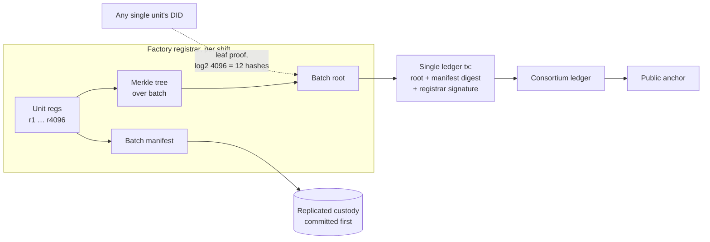

# Consensus and Scalability for High-Volume Asset Fleets

## What This Chapter Covers

The architecture of Chapters 4–6 must now survive multiplication. This chapter
quantifies the load that fleet-scale deployments place on the ledger — thousands to
millions of devices per plant, hundreds of millions per national market — and
evaluates the scaling techniques of the blockchain literature (sharding, sidechains,
rollups and other layer-2 constructions) against the *specific* workload of asset
identity, which differs from the payment workloads those techniques were built for
in ways that change the answers. Along the way it works the burst archetypes
(production lines, catastrophe seasons, closing days), the state-growth and
read-scaling disciplines that are this workload's real engineering, the
committee sizing and fee model of the consortium tier, and the availability
and disaster-recovery obligations a thirty-year system owes in writing. It
closes with a worked throughput-and-cost model
for a mid-size solar deployment — assumptions exhibited for audit,
sensitivities stated — carried forward into Chapter 11's pilot and
Chapter 13's economics, and extrapolated to the national tier where the
policy conversations happen.

## 7.1 What "Scale" Means Here: The Workload Revisited

Begin by dispelling the reflexive worry. Blockchain scalability discourse is
dominated by payment throughput — tens of thousands of transactions per second,
sub-second latency, every transaction contending for global ordering — because
payment systems compete on exactly those axes and their literature followed
the competition. Asset identity
is a different animal: its transactions are paced by physical events (a
module is manufactured once, shipped a few times, inspected occasionally),
its subjects number in the billions but act rarely, and its verifiers care
about decades-old records far more than about the last second's. Table 7.1
does the arithmetic that shows it.

**Table 7.1** Ledger event load by deployment scale, using the event frequencies of
Table 4.1 (registration once; lifecycle events ~0.2–1.0 per unit-year averaged over
asset classes; module-heavy mix).

| Deployment | Units | Registration burst | Steady-state events | Average tx/s |
|---|---|---|---|---|
| 5 MW commercial plant | ~12,500 | one-time | ~4,000–12,000 /yr | <0.001 |
| 100 MW utility plant | ~260,000 | production-paced | ~80,000–250,000 /yr | ~0.003–0.008 |
| National fleet, mid-size market | ~50 M | ~5 M/yr additions | ~15–50 M /yr | ~0.5–1.6 |
| Continental registry | ~1 B | ~100 M/yr | ~0.3–1 B /yr | ~10–32 |
| + condition-record events at fleet sampling rates | — | — | ~2–3× the above | ~25–100 |

Reading the table: the "registration burst" column is the pace-setter for
factory-adjacent infrastructure (Section 7.2's subject), while "steady-state
events" sets consensus sizing and "average tx/s" is the number to quote at
anyone who arrives with payment-chain benchmarks. Between the utility-plant
row and the national row lies the deployment reality that no single
organization ever operates: national fleets aggregate across thousands of
plants and millions of rooftops through the *same* consortium ledger, which
is why the interesting engineering threshold is the national row and why the
continental row is presented as the federation case rather than a
single-ledger ambition.

Even the continental case — every module, inverter, and battery in a large market —
averages double-digit transactions per second, within reach of a single well-run BFT
committee. The comparison with payment workloads, tabulated once so the
chapter never has to argue it again:

**Table 7.2** Payment-chain workload assumptions versus the asset-identity
workload.

| Dimension | Payment chain | Asset-identity ledger |
|---|---|---|
| Average write rate | Saturating by design (fee market) | Tens of tx/s at continental scale |
| Peak character | Diffuse, market-driven | Concentrated, event-driven (production, catastrophe, closing) |
| State per subject | Small, prunable balance | Monotone event history, never operationally dead |
| Read:write ratio | Near 1 (wallets check own state) | ≫100 (every transaction re-verifies history) |
| Latency demand | Sub-second UX | Minutes at docks; deterministic finality for law |
| Retention | Archivable | Forever-hot for verification, 40 yr+ |
| Fee tolerance | Users pay market fees | Cents per unit, hard ceiling (§1.3) |

So the naive conclusion is that scalability is a non-problem. The naive
conclusion is wrong for four reasons, each of which shapes a section of this chapter:

1. **Burstiness.** Averages mislead. A gigafactory registers ~50,000 modules per
   day *per line* in production-paced bursts; a hurricane generates a claim season
   of condition records across a whole region in weeks; a plant acquisition
   transfers 250,000 ownerships in one legal instant. Peak-to-average ratios of
   10³–10⁴ are structural (Section 7.2). Worse, the bursts correlate with
   *importance*: the acquisition day and the catastrophe week are precisely
   when parties are watching the system's behavior, so burst handling is a
   credibility requirement, not merely a capacity one.
2. **State growth, not throughput, is the binding constraint.** Payment ledgers
   carry small, prunable state per account — a balance survives; the payments
   that produced it can be archived. An asset registry's state grows
   monotonically with the asset population and must remain *queryable for decades* —
   a validator in year 25 holds a billion DIDs with their event indices, and
   no event is ever operationally dead, because any event may be the one a
   2049 adjudication turns on. Storage,
   sync time for new validators, and query service are where the engineering
   actually hurts (Section 7.3).
3. **Verification traffic dwarfs write traffic.** Every underwriting decision,
   secondary-market listing, and warranty screen runs Chapter 6's Steps 1–2. Reads
   are cheap individually but the read:write ratio is easily 100:1 and grows
   with adoption — each new verifier class (lenders' monitors, passport
   portals, market platforms) multiplies reads while writes stay pinned to
   physical events. Read *availability* has SLA character that consensus
   literature ignores (Section 7.3): a validator outage nobody notices; a
   verification outage stalls commerce.
4. **Latency requirements are legal, not conversational.** Nobody needs a
   commissioning event finalized in 200 ms. But finality must be *deterministic*
   (Section 2.3's argument) and custody transfers at loading docks need minutes,
   not hours — a truck's dwell time is the binding latency constraint in the
   whole system. The requirement profile is unusual: modest latency, absolute
   finality, decades of retention (Section 7.4). Payment-chain engineering
   optimizes almost exactly the complementary profile, which is why importing
   its techniques uncritically mis-spends the complexity budget.

## 7.2 Absorbing Bursts: Batching and the Merkle Aggregation Pattern

The registration burst is the canonical case. A production line emitting a module
every 20–30 seconds per lane does not need — and should not get — one consensus
round per module: per-unit consensus would spend committee bandwidth on
ordering facts whose order carries no meaning (units off a line are not
causally related in any way the record cares about) and would couple factory
takt to network weather, which no production engineer will accept. The
pattern, standard in spirit, tuned here for evidential use:

The registrar accumulates registrations locally, builds a Merkle tree over the batch
(500–5,000 units, tunable), and submits *one* transaction committing the root plus
the batch manifest to off-chain custody. Each unit's DID becomes fully verifiable
via its leaf-inclusion proof against the committed root — the same proof machinery
of Section 2.2, now used for write compression. The consortium ledger sees one
transaction per batch; the *evidential granularity* remains per-unit, because any
single module's registration is independently provable without reference to its
batchmates.

Proof logistics complete the pattern's practicality: each unit's inclusion
proof (a few hundred bytes, Section 2.2.3's arithmetic) is generated once at
batch close and travels *with the asset* — embedded in the record bundle
behind the unit's QR locator, replicated with the batch manifest in custody,
and cacheable by anyone. A verifier at a loading dock three years later needs
the unit's envelope, its proof, and the header chain — no live registrar, no
batch reconstruction, no consortium query beyond public headers. The batch,
in other words, is an amortization trick visible only at write time;
verification remains exactly as unit-granular and self-contained as if every
module had bought its own transaction.

Batch sizing is a three-way trade worth making explicit. Larger batches
compress consensus load further (one transaction per 4,096 units instead of
per 2,048 halves the count) but lengthen the *commitment latency* of the
first unit in the batch (it waits for the last) and deepen the inclusion
proofs by one hash per doubling — the proof cost is logarithmic and therefore
nearly free, so the real constraint is latency policy: the pilot's 2,048 at
production pace commits every unit within roughly a shift, which matches the
downstream logistics tempo (nothing ships faster than a shift). Batches also
respect *authority boundaries* — one registrar, one batch stream — so that a
batch's validity has a single accountable signer, and the failure of one
registrar's stream quarantines nothing else.

Two evidential caveats distinguish this from payment batching. First, the batch
manifest must go to replicated custody *before* the root is committed (a root
without a retrievable manifest is a commitment to nothing — the withholding failure
of Section 4.2); the registrar's accreditation conditions make
custody-write-before-commit an audited obligation, and the retrievability
challenges of Section 4.2.1 sample batch manifests preferentially in their
first weeks, when a withholding attack would be freshest. Second, per-unit
*revocation or correction* within a committed batch must be possible without
disturbing the batch: the schema handles this with
superseding per-unit events rather than batch mutation, preserving append-only
semantics — the batch remains exactly what was committed, and the correction
is a new, attributed fact about one leaf. With batching, the gigafactory's
50,000 units/day become ~10–100
transactions/day; the hurricane claim season and the acquisition-day transfer use
the same aggregation with per-event proofs — the acquisition's 250,000
ownership transfers, for instance, are a few dozen batch transactions whose
legal effectiveness is simultaneous at the closing block, which is cleaner
than the wet-ink alternative it replaces. Bursts, in short, are a solved problem
*at the ledger interface* — the residual burst load lands on the off-chain custody
layer, which scales like ordinary storage because it is ordinary storage.

The two non-factory burst archetypes deserve their own walkthroughs, because
their shapes differ instructively from production's steady drumbeat.

*The catastrophe season.* A hurricane crosses a region holding 4 GW of
distributed solar — order ten million modules, of which perhaps a fifth
generate inspection or claim activity over the following ninety days. The
write load is large in aggregate and utterly undemanding in tempo: tens of
thousands of condition records and fault events per day, submitted by dozens
of inspection contractors as campaigns sweep the region, batched per
submitter per day — hundreds of ledger transactions daily against a committee
throughput budget thousands of times larger. The genuine stress lands
elsewhere, exactly where the architecture put the elastic tiers: custody
ingest (terabytes of catastrophe imaging per week — object storage's daily
bread) and *instrument logistics* (every drone EL rig within a thousand
kilometers is booked for a quarter — a market problem the verification-
services industry of Section 6.7 exists to solve). Meanwhile the *read*
burst is the insurers' — every claim triggers Step-1/2 verification of the
asset's pre-storm baseline — and lands on horizontally scaled replicas. The
catastrophe is the architecture's finest hour precisely because the
pre-committed baselines already exist; the alternative world's catastrophe
season is Section 1.4.3's dispute triangle, multiplied by a weather map.

*The closing day.* A 250,000-module plant changes hands at a contractual
instant — the burst whose peak-to-average ratio is technically infinite,
since a quarter-million ownership facts become true simultaneously. The transfers were prepared as signed batch trees days earlier in
escrow with the closing's legal documents; at the agreed block height the
escrow agent submits the batch commitments — a few dozen transactions — and
an event-triggered anchor (Section 4.4) fixes the closing into two public
chains within minutes. Every module's new ownership is individually provable
by leaf proof against a closing anyone can locate in a public record
forever. The wet-ink counterpart — schedules of serial numbers appended to
a purchase agreement, reconciled by hand, disputed for years — is the
before picture of Section 1.1, and the contrast is the entire pitch to the
transaction lawyers who will, in practice, decide whether this architecture
gets used.

**Figure 7.1** Merkle-aggregated registration. One consensus round commits a
production batch; each unit remains individually provable.

## 7.3 State, Reads, and the Long Tail of Queries

**State growth.** At ~1 kB of envelope state per event and the loads of Table 7.1,
the continental registry accretes on the order of 1–3 TB/year of consensus-critical
state — trivial as storage, awkward as *replicated, indexed, forever-hot* storage.
Three disciplines keep it tractable. *Envelope minimalism* (Chapter 5's design pays
off here: payloads are already off-chain, and the envelope's no-fields-that-
scale rule from Section 5.4 is what keeps the 1 kB honest across decades).
*Epochal checkpointing*: the ledger
periodically commits a state snapshot digest, so new validators sync from a
checkpoint plus recent blocks instead of replaying twenty years — with the full
history remaining available from archival nodes and provable against anchors.
The arithmetic that makes this necessary rather than nice: replaying a
twenty-year continental history at generous replay throughput is a
multi-week onboarding for a new validator, which converts "add a member" from
a governance decision into an infrastructure project; checkpoint sync
collapses it to hours. *Cold-tier proofs*: events older than an epoch
boundary can be served from archival
storage with inclusion proofs, keeping the hot validator set lean — the hot
set holds current state plus recent epochs (tens of gigabytes), while the
complete history lives in the archival tier under the custody policy, every
byte of it still provable against public anchors. None of this is
exotic; all of it must be designed in from the start, because retrofitting
checkpoint semantics onto a live evidential ledger is governance surgery —
the checkpoint's *content* becomes part of what validators attest, and
introducing it later means asking a running consortium to agree, mid-flight,
on what its state has been all along.

Archival economics close the state story. The complete continental history —
consensus state plus every payload — accretes at low-petabyte scale per
decade, which at commodity archival pricing with scheduled media refresh is
a seven-figure annual line item for an infrastructure serving a
trillion-dollar asset class: not free, but three orders of magnitude below
the sector's *current* spending on the document management, diligence
re-testing, and dispute discovery that the archive replaces. The pricing
discipline that matters is institutional rather than technical — archival
obligations must be funded by endowment-style mechanisms (custody fees
collected at event time, held against the retention obligation) rather than
by annual budget votes, because Section 5.7's completeness argument applies
to institutions too: an archive funded year-to-year has an expected lifetime
shorter than its contents.

Indexing deserves its own sentence because it is where "queryable for
decades" actually lives: the consensus state proper needs only the
per-asset event index, while every richer query surface — by site, by
cohort, by event type, by time window — belongs to the read-replica tier,
where indexes can be rebuilt, competed on, and thrown away without touching
consensus. Validators validate; they do not serve analysts. Deployments that
blur this line discover their consensus nodes running report queries during
an acquisition closing, which is how deterministic finality acquires
nondeterministic latency.

### 7.3.1 Onboarding a Validator in Year Twelve

The checkpoint machinery earns its keep at a specific, predictable moment,
so the moment deserves its walkthrough. A new member joins in year twelve —
say, an insurer entering the market. Its validator obtains the latest
governance-attested checkpoint (state snapshot digest, signed by the sitting
committee, itself anchored publicly), fetches the snapshot from any archival
node, and *verifies the snapshot against the digest* — no trust in the
serving node required. It then replays the blocks since the checkpoint
epoch — days of history, minutes of compute — and is current. Two
verification-depth options are its own choice: the pragmatic default trusts
the committee's checkpoint attestation (which is itself only as trustworthy
as the anchored governance history says); the paranoid option replays from
genesis against the full anchor chain, a multi-day batch job that any
sufficiently motivated new member — or auditor, or litigant — can run
without permission. That both options exist, and that the paranoid one needs
nobody's cooperation, is the checkpoint design's real content: efficiency
for the routine case, unmediated verifiability for the adversarial one, and
no moment at which a new participant must simply take the incumbents' word
for what the ledger says.

**Read scaling.** Verification reads (Chapter 6, Steps 1–2) do not require
consensus — they require *provable* answers. The pattern: untrusted read replicas
(operated by anyone: data vendors, insurers' own infrastructure) serve queries with
Merkle proofs against anchored state, so read capacity scales horizontally with
zero trust added. The consortium's obligation reduces to publishing headers and
anchors — a few kilobytes per interval — and archival availability under the
custody policy. This division — consensus for writes, proofs for reads — is the
single most important scaling decision in the architecture, and it is free.

The read-load model, sketched for the continental tier so its magnitude is on
record: a billion registered assets with 2% annual transaction churn implies
~20 M full Step-1/2 verifications a year from commerce alone; insurer and
lender monitoring subscriptions re-verify their books' *new events*
continuously (cheap incremental checks, but across hundreds of millions of
covered assets); passport portals add public queries at consumer rates that
are impossible to forecast and unnecessary to fear — every query is
answerable by any replica from public headers plus proofs, so the load lands
on horizontally scalable, commercially operated infrastructure with the
consortium's involvement limited to publishing kilobytes. The architecture's
read tier, in other words, scales like a content-distribution problem because
it has been *made* one, and content distribution is the best-understood
scaling problem in computing.

The read tier also inherits, for free, every distribution optimization the
web has built: proofs and headers are static, immutable content, cacheable
at any edge, hostable from object storage, mirrorable by interested parties
without coordination. An asset's record bundle can ship *with* the asset —
on the handheld that scanned it, in the data room of the transaction that
sells it, on physical media in a project's closing binder — and remains
verifiable against public anchors from any of those copies indefinitely.
Availability of the verification path, in the limit, does not depend on
anyone's servers at all; it depends on the survival of copies, which is a
property owners can secure for themselves. Systems whose verification
requires calling the operator's API have quietly reintroduced the central
registry; this one, by design, has not.

One warning keeps the read tier honest: replicas serve *proofs*, and clients
must check them. The convenience API that returns bare JSON without
inclusion proofs will be built (it always is), widely used (it is easier),
and eventually wrong or lied to — at which point the system's guarantees
evaporate for every client that trusted it. The pilot's client libraries
therefore make proof-checking the default and bare reads a loudly named
opt-out, and Chapter 8 files the "trusted replica" as an attack surface
(F7's lazy cousin) rather than a deployment detail.

## 7.4 The Scaling Toolbox, Re-Evaluated for Identity Workloads

The blockchain literature offers sharding, sidechains, and layer-2 rollups, each
designed for payment throughput. Re-evaluated against *this* workload — modest
average writes, brutal bursts, monotone state, proof-hungry reads, deterministic
finality, thirty-year horizon — the rankings change. The re-evaluation is worth
doing carefully rather than dismissively, because each technique encodes real
engineering that transfers *in part*, and because procurement conversations
in this sector are conducted in the payment literature's vocabulary whether
the architecture likes it or not: the architect who cannot say precisely why
sharding is wrong here will eventually be made to deploy it.

**Sharding** (partition state and consensus across validator subsets) answers a
throughput problem this workload mostly lacks, at the cost of cross-shard
coordination precisely where the workload is weakest: assets migrate (a module
manufactured in one jurisdiction-shard, installed in another, resold to a third),
and every migration becomes a cross-shard transaction with the attendant atomicity
machinery. The numbers make the case brutally: sharding exists to multiply a
saturated committee's throughput, and Table 7.1's committee is idle by three
orders of magnitude — the technique would spend the architecture's scarcest
resource (cross-partition protocol complexity, which is where sharded
systems' bugs live) to buy its most abundant one. Worse, shard-local security
dilutes the committee: a shard's validator
subset is a smaller collusion target (Section 8.6), and an asset registry
cannot accept that an asset's evidential guarantees depend on which shard its
DID hashed into. Verdict: **geographic or
jurisdictional partition into separate consortium ledgers with mutual anchoring** —
federation, not protocol-level sharding — achieves the partition benefits along
institutional fault lines that already exist, keeps every ledger's security
homogeneous and locally governed, and reduces cross-partition traffic to the
genuinely rare case of an asset crossing jurisdictions, which is an
export/import event pair with human paperwork attached anyway. Chapter 12
needs exactly that structure for cross-sector interoperability, and
Chapter 10 independently derives it from data-residency law — three
requirements, one topology.

Cross-federation verification, the pattern's one genuinely new protocol
element, works with the machinery already built: each federated ledger
anchors to the public chains *and* exchanges header commitments with its
peers on a fixed cadence, so a verifier following an asset exported from
jurisdiction A to jurisdiction B checks the A-ledger provenance against
A's anchors, the export event against both ledgers' mutual commitments, and
the B-ledger continuation against B's anchors — one extra hop, no shared
governance, no cross-ledger consensus, and the asset's record bundle
carries everything needed for the traversal offline. The federation, in
other words, is stitched by proofs rather than by protocol coupling, which
is why adding a jurisdiction never requires renegotiating the others.

**Sidechains** (independent ledgers pegged to a parent) map naturally onto the
manufacturer-line and plant-local tiers: a factory can run a local, high-frequency
ledger absorbing per-unit QA events, periodically committing roots upward — the
Merkle aggregation of Section 7.2 is a degenerate sidechain, and that framing tells
you the honest generalization: a sidechain's security is only what its own
validator set provides, so *evidential* events (Table 5.1) must always land on, or
be proof-committed into, the consortium tier. The factory case shows the
pattern's value and its boundary in one example: a line emits far more QA
telemetry than the evidential schema wants (per-cell measurements,
in-process checks), a factory-local ledger can order and retain all of it
under the manufacturer's own governance, and the *evidential extract* —
enrollment templates, flash VCs, batch roots — commits upward with proofs.
The local tier can be lost, corrupted, or discarded at the manufacturer's
own risk without touching the consortium's guarantees; what it must never be
is the *only* home of an evidential fact. Sidechains for load absorption,
never for evidence custody.

**Rollups** (execute off-chain, post state commitments plus proofs on-chain) are
the strongest import. A *validity rollup* — where a succinct proof certifies that
the posted state transition correctly applied the state-machine rules of
Section 5.5 to a batch of events — lets the consortium tier verify a proof instead
of re-executing every envelope check, multiplying effective write capacity by
orders of magnitude while *strengthening* the correctness guarantee (validators
verify math, not operators). The strengthening deserves emphasis because it
is the pattern's real long-term appeal here: today a verifier trusts that
\(2f+1\) validators ran the checks; under a validity rollup the verifier
holds a proof that the checks *were passed*, a strictly smaller trust
assumption that even a fully colluding committee cannot fake. The costs are
real: proving infrastructure is
operationally young, circuit-encoding the lifecycle state machine freezes it
(schema evolution now means proving-system evolution — tension with Section 5.1's
extensibility principle, and the pilot's quarterly payload cadence would
translate into quarterly circuit audits), and the cryptographic assumptions
behind succinct proofs
add another aging surface for Chapter 9's migration ledger — with the
important mitigation that hash-based proof systems (the STARK lineage) rest
on assumptions Chapter 9 already certifies, making them the only family this
book would consider for a thirty-year record. *Optimistic* rollups, the
cheaper cousins, are rejected outright: their security model — post now,
allow a window for fraud proofs — reintroduces exactly the probabilistic
finality that Section 2.3 disqualified, and an ownership transfer that is
final-unless-challenged-this-week is not an instrument the sector's lawyers
will accept. Verdict: the
architecture should be *rollup-ready* — batch semantics and state commitments in
the schema from day one, per Section 7.2 — with proof systems adopted when the
deployment's write load actually demands them, which Table 7.1 says is the
continental tier, not the pilot.

**Table 7.3** Scaling techniques against the asset-identity workload.

| Technique | Built for | Fit here | Adopted form |
|---|---|---|---|
| Sharding | Global payment throughput | Poor: migration = cross-shard; dilutes committee | Jurisdictional federation with mutual anchoring |
| Sidechains | Application-local throughput | Good for load, never for evidence | Factory/plant-local tiers committing roots upward |
| Optimistic rollups | Cheap L2 execution | Weak: fraud-proof windows reintroduce probabilistic finality (§2.3 objection) | Not adopted |
| Validity rollups | Verifiable batch execution | Strong at continental tier; schema-freeze and PQ caveats | Rollup-ready schema now; proofs when load demands |
| Merkle batching | (folk technique) | Excellent; solves the actual burst problem | Core pattern, §7.2 |
| Read replicas + proofs | (standard) | Excellent; solves the actual read problem | Core pattern, §7.3 |

The adopted forms compose into a tiered whole worth stating once as a
sentence: **local ledgers absorb machine-rate load and commit roots upward;
one consortium ledger per jurisdiction or sector carries the evidential
stream under BFT finality; validity proofs compress that stream if and when
continental volumes demand; mutual anchors stitch the federation together;
and public chains underwrite everyone's honesty at the top.** Each tier is
replaceable without disturbing its neighbors — the property that matters
more than any single tier's throughput, because over thirty years each tier
*will* be replaced.

### 7.4.1 What Transfers from the Payment World Anyway

Fairness — and completeness — requires listing what this chapter *does*
import from the payment literature, because the rejections above can read as
wholesale dismissal and are not. Four exports transfer cleanly. *Light-client
protocols* — the header-plus-proof verification model that lets a wallet on
a phone validate against a chain it does not store — are exactly the field
handheld's operating mode (Section 4.7), matured under adversarial pressure
this sector could not have generated. *Signature aggregation* (BLS-style
schemes that compress a committee's attestations into one verifiable
object) is what makes 16–30-member BFT committees cheap to prove against —
every anchored header carries the committee's aggregate attestation at a
few dozen bytes. *Gossip and peer-discovery machinery*, unglamorous and
battle-tested, carries the consortium's replication with no invention
needed. And the *fee-market literature*, ironically, transfers as a
cautionary instrument: its models of congestion pricing are how Section
7.5.1 knew what to avoid, and its MEV pathologies (transaction-ordering
games) informed the schema's insistence that ordering within a block
carries no economic meaning — claimed-time, not block position, is the
evidential sequence, so there is nothing for an ordering game to win. The
discipline, as everywhere in this book, is to import mechanisms with their
threat models attached, not their assumptions unexamined.

## 7.5 The Consortium Tier Itself: Sizing the Committee

The BFT committee's parameters, set against the workload. Committee size \(n\)
trades communication overhead (quadratic in classic PBFT, near-linear in modern
leader-based BFT with signature aggregation) against collusion resistance
(\(\lceil (n-1)/3 \rceil\) tolerated faults) and institutional breadth. For an
industry consortium the binding constraint is institutional, not computational:
each validator must be an organization with standing to be sued and reputation to
lose — manufacturers, operators, insurers, certification bodies, in adverse-
interest balance so that the \(f < n/3\) assumption is backed by economics
(Section 8.6 analyzes the collusion game). Practical guidance the pilot follows:
\(n\) in the 10–30 range; geographic and role diversity mandatory; validator
onboarding/exit as governed lifecycle events on the ledger itself; and block
intervals in seconds — comfortable at these loads — with the anchoring interval,
not block time, as the externally meaningful latency parameter.

The sizing arithmetic, made explicit for the planning reader. At \(n = 16\),
the committee tolerates \(f = 5\) simultaneous faulty or malicious members —
enough to absorb two acquisitions, an insolvency, and an incident in the same
quarter without touching safety margins — while modern leader-based
protocols at these transaction rates leave validators over 99% idle;
consensus compute is simply not a cost line. Growth to \(n = 30\) roughly
doubles messaging and halves nothing that matters at this load, so committee
size should be set by *institutional* logic: broad enough that no plausible
coalition of interest reaches a third, small enough that every member's
operational competence can be individually audited. Beyond thirty,
federation (Section 7.4) is the better spend of institutional complexity
than a larger single committee. The adverse-interest arithmetic is the
subtle half of sizing: a sixteen-member committee of fifteen manufacturers
and one insurer tolerates five Byzantine members in theory and one trade
dispute in practice, so composition rules — caps per role class, mandated
representation for verification-consuming roles — belong in the consortium
agreement beside the number itself.

### 7.5.1 Who Pays for Consensus: The Fee Model

Ledger economics need a revenue design as deliberate as the protocol, and the
sector's constraint — Section 1.3's cents-per-unit ceiling — rules out the
public-chain answer of market-priced fees. The model the pilot adopted, and
this book recommends as a starting point: *membership assessments* fund the
fixed costs (validator operations, governance, audits), allocated by member
class rather than by usage, because the fixed costs exist for the system's
credibility, from which every member benefits jointly; *event fees* at
cost-recovery rates (fractions of a cent per envelope at batch scale) fund
the marginal ledger and anchoring costs, mostly to create a mild pricing
signal against schema abuse rather than to raise revenue; and *custody fees*
collected at event time fund the retention endowment of Section 7.3, priced
per payload-class per decade of obligation. What the model deliberately
avoids: per-verification charges (reads must stay free-to-verify or the
system's whole social value — strangers checking records — is throttled at
the toll booth), and any fee denominated in a volatile token (the registrar
budgeting enrollment at manufacture needs a price in currency, not a
speculation). The sums are small — Table 7.4 will show a large plant's
lifetime total in the hundreds of thousands — but their *predictability* is
what procurement processes actually price, and a fee schedule fixed in the
consortium agreement with indexed adjustments is worth more adoption than
any throughput benchmark in this chapter.

Operational requirements per validator, since "run a node" hides the real
obligations: an HSM-attached server pair across two sites; monitoring with
committed response times (the consortium agreement's validator SLA — the
pilot uses four hours for liveness incidents); participation in scheduled
key ceremonies, checkpoint attestations, and disaster-recovery exercises
(Section 7.7); and procurement continuity — the twenty-year commitment is
organizational, and members should budget it as they would a laboratory
accreditation, not as a server. Validator diversity has one more axis worth
enforcing beyond geography and role: *software*. Two independent
implementations of the validation logic, maintained against the schema's
conformance suite, mean a defect in one implementation stalls at
\(n/2\) rather than propagating to unanimity — the aviation redundancy
argument, applied to consensus code, and cheap at consortium scale because
the validation logic is deliberately small (Section 5.5).

## 7.6 Worked Model: A 250 MW Deployment

The numbers, end to end, for a concrete mid-size case: a 250 MW single-axis
tracking plant, ~630,000 modules, 2,000 string inverters, 6,300 trackers,
25-year life. Assumptions: envelope ~0.9 kB; batching per Section 7.2 (batch 2,048);
Tier 0–1 condition policy of Section 6.7 with 2% annual EL sampling plus
event-driven escalations; consortium of 16 validators; anchoring 4×/day to two
public chains.

**Table 7.4** Lifetime ledger load and cost model, 250 MW plant. Costs in 2026 USD;
public-chain anchoring priced conservatively at USD 2 per anchor transaction
averaged across fee regimes.

| Component | Quantity over 25 yr | Ledger tx | On-chain bytes | Cost driver |
|---|---|---|---|---|
| Registrations | 638,300 units | ~312 batch tx | ~0.3 MB | negligible |
| Install + commission | 638,300 × 2 events | ~625 batch tx | ~0.6 MB | negligible |
| Custody/ownership transfers (2 sales + O&M churn) | ~2.0 M events | ~1,000 batch tx | ~1 MB | negligible |
| Condition records (sampling + escalations) | ~350,000 events | ~2,900 tx (less batchable) | ~3 MB | instrument time, not ledger |
| Maintenance/fault stream | ~1.6 M events | ~800 batch tx | ~0.8 MB | negligible |
| Anchoring | 36,500 anchors × 2 chains | 73,000 public tx | — | ~USD 146,000 |
| Off-chain custody (3× replicated) | ~40–90 TB | — | — | ~USD 100–250k lifetime |
| Validator operations (plant's share) | — | — | — | ~USD 30–80k lifetime |

The model's assumptions deserve their narrative, since a table invites
auditing and this one is meant to be audited. Event counts derive from the
lifecycle biography of Table 5.4 scaled to the plant's population, with the
O&M churn calibrated to published O&M practice for tracker plants and two
full ownership turnovers assumed (conservative — many plants trade more).
Batch counts assume registrar and site agents batching at 2,048 with the
event-class exceptions (condition records batch poorly because their
submitters are heterogeneous — hence their larger transaction count).
Anchoring is priced at a deliberately pessimistic USD 2 per public-chain
transaction averaged across two chains and two decades of fee regimes; at
recent actual fees the line item falls by an order of magnitude, and if it
ever rises past the assumption the anchoring interval is a governance dial.
Custody pricing uses commodity object-storage rates with 3× replication,
15% annual price decline truncated conservatively at year 10, plus decadal
cold-export media refresh. Validator share allocates one-sixteenth of a
16-member consortium's modeled operating cost pro-rata by the plant's event
volume. Nothing in the table depends on any component's vendor pricing;
every line is commodity.

Sensitivity, briefly, because a model whose conclusion flips under
perturbation is a rhetorical device, and this one is not: double every event frequency and consensus state reaches
twelve megabytes; assume post-quantum envelope inflation (Section 9.3's
2–4 kB signatures, hybrid-doubled) and it reaches perhaps fifty — still
nothing. The cost total is dominated by custody and anchoring, both linear
in policy choices (replication factor, anchor cadence) that governance can
tune by an order of magnitude in either direction. The only variable that
moves the picture qualitatively is Tier-2 instrument time under an
aggressive condition-sampling policy — which is a *measurement* budget, not
a ledger budget, and it buys underwriting value priced in Chapter 13.

Totals worth stating in prose because they are the chapter's conclusion: the
plant's entire 25-year evidential life fits in **under six megabytes of consensus
state and roughly USD 300–500 thousand of infrastructure cost, dominated by
anchoring and storage, not consensus** — against a plant capex on the order of
USD 200 million and a single avoided warranty-fraud dispute or one percentage point
of resale-price improvement worth millions (Chapter 13 completes that comparison).
Per module, the lifetime evidential infrastructure cost is roughly fifty
cents — the price of the label it replaces. Ledger capacity is nowhere near
the binding constraint. The binding constraints are
the ones this Part has been engineering all along: enrollment integrity, oracle
trustworthiness, custody longevity, and governance.

What the model deliberately omits, so nobody discovers the omissions in a
budget review: integration engineering (connecting factory MES, work-order,
and diligence systems to the event schema — the pilot's experience prices
this at several times the infrastructure line, once, per organization);
verification-services labor for the escalation tiers (a per-campaign
market price, not an infrastructure cost — Table 6.3's territory);
governance's human time (committee participation, audits, ceremonies —
real, distributed across members, and the reason Section 7.5.1 funds fixed
costs by assessment); and the legal setup of the consortium agreement
itself, a one-time seven-figure investment at national scale that
Chapter 10 treats as the foundation it is. The honest total-cost-of-
ownership conversation leads with these, because the infrastructure
numbers above are — and this is the chapter's finding, not its spin —
too small to argue about.

### 7.6.1 Scaling the Model to the National Tier

The plant model extrapolates linearly to the loads that matter for policy,
with two sub-linearities in the deployment's favor. A 50 GW national fleet —
two hundred such plants plus a distributed rooftop segment contributing
event volume out of proportion to its capacity (more custody transitions,
more heterogeneous submitters) — generates consensus state in the low
terabytes over 25 years and consortium-wide operating costs in the low tens
of millions of dollars cumulatively: pennies per megawatt-hour of the
energy the fleet produces over the period, which is the denominator that
regulators pricing passport mandates should be shown. The first
sub-linearity is institutional: validator count, governance, and audit
machinery do not scale with fleet size — the 16-member committee that
serves one plant serves the nation, so the fixed tier amortizes toward
irrelevance as coverage grows. The second is informational: cohort
analytics (Section 5.7, Chapter 8's D4) *improve* super-linearly with
population, because every additional enrolled cohort sharpens every other
cohort's baselines — the rare infrastructure whose quality rises with its
load. Against these stand the costs that do scale linearly and honestly:
custody, anchoring at fixed cadence per federated ledger, and the
verification-services labor of the escalation tiers, all priced per event
or per campaign in ways Table 7.4's method extends without surprises.
National-scale planning, in short, can take this chapter's numbers, multiply
by fleet ratios, and spend its genuine attention on the institutional
constitution — which is where Chapter 10 will be waiting.

Platform notes, kept to the one paragraph the topic deserves: the model's
numbers were computed against a Fabric-family consortium stack and
cross-checked against a BFT-configured Ethereum-client permissioned
deployment; the differences at these loads are operational preferences, not
capacity distinctions, and both fit inside the margins already stated. The
one platform property that *is* load-bearing is exportability — the
schema-registry and record-bundle independence of Sections 5.8 and 3.5 —
because the model's 25-year horizon exceeds any current platform's
credible support commitment, and a consortium that cannot re-platform is
betting its evidence on a vendor's roadmap.

## 7.7 Availability, Disaster Recovery, and Degraded Operation

Scalability's neglected sibling is availability under stress, and a system
serving loading docks and closing rooms owes explicit answers to three
questions — answers that belong in this chapter because they are, at
bottom, capacity questions about the worst day rather than the average one.

**What happens when the write path stalls?** BFT consensus stalls — safely,
never inconsistently — if more than \(f\) validators are simultaneously
unreachable: a correlated cloud outage, a coordinated cyber incident, a
regional war. The design answer is layered. Validator diversity
(geographic, jurisdictional, software, hosting) makes correlated loss of
\(f+1\) members a genuinely extreme event; the offline-first schema
(Principle 5, Section 5.1) means field operations continue unimpeded through
any stall, signing events locally for later submission — a stalled ledger
delays *recording*, never *work* — and the submission windows absorb stalls
of days without any procedural exception. The one flow that genuinely waits
is the high-value closing (an acquisition wants its transfer final), and
closings tolerate scheduling around incidents the way they already tolerate
banking outages.

**What happens when a validator — or several — must be rebuilt?** The
Section 4.7 ransomware walkthrough covered one; the systemic version is a
consortium-wide rebuild after a common-mode compromise (a signed malicious
update to one implementation — bounded by software diversity to half the
committee). Recovery procedure: halt, audit the last anchored checkpoint
against public chains, rebuild from checkpoint on clean infrastructure,
re-attest every validator's keys through the ceremony machinery, and resume
— with the anchors serving as the incorruptible reference for what the
ledger contained. The procedure is rehearsed annually as a consortium
exercise, because a disaster-recovery plan that has never run is
documentation, not capability. The exercises carry metrics with teeth —
time-to-checkpoint-verification, time-to-quorum-restoration, custody
re-replication throughput — reported to the governance committee and, in
aggregate, in the consortium's public transparency report, because a system
selling verifiability should verify itself where its users can see. The
pilot's first full exercise (year one, Section 11.6's governance calendar)
took three times its target and produced four procedure amendments, which is
what first exercises are for.

**What must survive the consortium itself?** The terminal scenario —
governance collapse, funding failure, regulatory dissolution — is the one a
thirty-year system must plan for in writing, and the one that industry
consortia, whose median lifetime is far shorter than a module warranty,
historically plan for least. The sector has watched trade associations
dissolve, standards bodies merge away, and joint ventures unwind; none of
those precedents destroyed evidence, because none held any. This one will,
unless the dissolution path is engineered. The survival kit is already
built: public headers and anchors (world-readable forever), payload custody
under contracts that survive the consortium's dissolution (archival
custodians' obligations run to the *data subjects*, not to the consortium),
the schema registry archived as payloads, and the record-bundle portability
of Section 3.5 meaning every asset's evidence can be exported, held, and
verified by anyone against public anchors with no consortium in existence.
A successor consortium — or a regulator, or a court — can re-constitute
service from these materials. The records, in short, are designed to be
orphan-proof; the institutions are replaceable; and stating this in the
consortium agreement's dissolution clause converts it from hope into
obligation.

## 7.8 Chapter Summary

Asset-identity workloads invert the assumptions of payment-scaling literature —
Table 7.2 tabulates the inversion once and for all: averages are trivially
low, bursts are ferocious and correlated with scrutiny, state grows
monotonically for decades with no operationally dead record, reads dwarf
writes and grow with adoption, and finality must be deterministic rather than
fast because the latency constraint is a truck's dwell time and the finality
constraint is a court's patience.
Merkle batching absorbs the bursts while preserving per-unit provability, with
proofs that travel with the asset and burst archetypes — the production line,
the catastrophe season, the closing day — each landing its stress on a tier
built to be elastic; epochal
checkpoints and proof-serving read replicas tame state and read load without adding
trust, provided clients are never allowed to skip proof-checking; sharding is
rejected in favor of jurisdictional federation (the topology scalability,
data residency, and interoperability independently select), sidechains
admitted for load but never evidence, optimistic rollups rejected on
finality grounds, and validity rollups adopted as a
schema-level readiness rather than a day-one dependency — hash-based
constructions only, per Chapter 9's assumptions. A 16-validator BFT
committee, sized institutionally rather than computationally, funded by a
fee model whose virtue is predictability rather than revenue, and drilled
annually against the disaster scenarios of Section 7.7, carries a 250 MW
plant's quarter-century of evidence in megabytes and at costs three orders of
magnitude below the values at risk — roughly fifty cents per module,
lifetime, the price of the label it replaces — and the national
extrapolation amortizes the fixed tier toward irrelevance while the
analytics actually improve with load. Scale, in short, is not where this
architecture can fail. Where it can fail is trust — and that is Part III.

## References and Further Reading

1. Croman, K., et al. "On Scaling Decentralized Blockchains." In *Financial
   Cryptography and Data Security (FC 2016) Workshops*, 106–125. Springer, 2016.
2. Yin, M., D. Malkhi, M. K. Reiter, G. Golan-Gueta, and I. Abraham. "HotStuff:
   BFT Consensus with Linearity and Responsiveness." In *Proceedings of the 2019
   ACM Symposium on Principles of Distributed Computing (PODC '19)*, 347–356.
3. Wang, G., Z. J. Shi, M. Nixon, and S. Han. "SoK: Sharding on Blockchain." In
   *Proceedings of the 1st ACM Conference on Advances in Financial Technologies
   (AFT '19)*, 41–61.
4. Back, A., et al. "Enabling Blockchain Innovations with Pegged Sidechains."
   White paper, Blockstream, 2014.
5. Ben-Sasson, E., I. Bentov, Y. Horesh, and M. Riabzev. "Scalable, Transparent,
   and Post-Quantum Secure Computational Integrity." IACR Cryptology ePrint
   Archive, Report 2018/046.
6. Thibault, L. T., T. Sarry, and A. S. Hafid. "Blockchain Scaling Using Rollups:
   A Comprehensive Survey." *IEEE Access* 10 (2022): 93039–93054.
7. Boneh, D., B. Lynn, and H. Shacham. "Short Signatures from the Weil
   Pairing." *Journal of Cryptology* 17, no. 4 (2004): 297–319. The signature-
   aggregation lineage of Section 7.4.1 — with Chapter 9's caveat that
   pairing-based schemes are not post-quantum survivors.
8. Laurie, B., A. Langley, and E. Käsper. *Certificate Transparency.* RFC 6962,
   IETF, 2013. The append-only-log operational precedent behind the
   checkpoint and transparency-report practices of Sections 7.3 and 7.7.

\newpage
