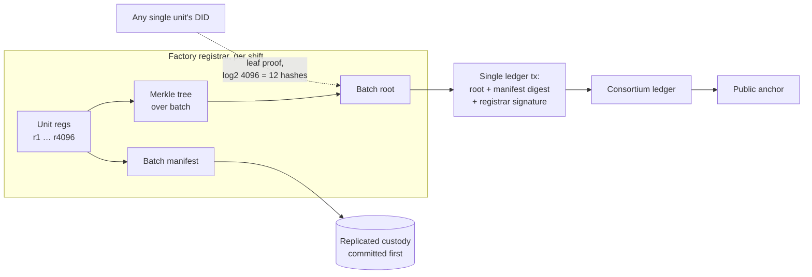

# Consensus and Scalability for High-Volume Asset Fleets

## What This Chapter Covers

The architecture of Chapters 4–6 must now survive multiplication. This chapter
quantifies the load that fleet-scale deployments place on the ledger — thousands to
millions of devices per plant, hundreds of millions per national market — and
evaluates the scaling techniques of the blockchain literature (sharding, sidechains,
rollups and other layer-2 constructions) against the *specific* workload of asset
identity, which differs from the payment workloads those techniques were built for
in ways that change the answers. It closes with a worked throughput-and-cost model
for a mid-size solar deployment, carried forward into Chapter 11's pilot and
Chapter 13's economics.

## 7.1 What "Scale" Means Here: The Workload Revisited

Begin by dispelling the reflexive worry. Blockchain scalability discourse is
dominated by payment throughput — tens of thousands of transactions per second,
sub-second latency, every transaction contending for global ordering. Asset identity
is a different animal, and Table 7.1 does the arithmetic that shows it.

**Table 7.1** Ledger event load by deployment scale, using the event frequencies of
Table 4.1 (registration once; lifecycle events ~0.2–1.0 per unit-year averaged over
asset classes; module-heavy mix).

| Deployment | Units | Registration burst | Steady-state events | Average tx/s |
|---|---|---|---|---|
| 5 MW commercial plant | ~12,500 | one-time | ~4,000–12,000 /yr | <0.001 |
| 100 MW utility plant | ~260,000 | production-paced | ~80,000–250,000 /yr | ~0.003–0.008 |
| National fleet, mid-size market | ~50 M | ~5 M/yr additions | ~15–50 M /yr | ~0.5–1.6 |
| Continental registry | ~1 B | ~100 M/yr | ~0.3–1 B /yr | ~10–32 |
| + condition-record events at fleet sampling rates | — | — | ~2–3× the above | ~25–100 |

Even the continental case — every module, inverter, and battery in a large market —
averages double-digit transactions per second, within reach of a single well-run BFT
committee. So the naive conclusion is that scalability is a non-problem. The naive
conclusion is wrong for four reasons, each of which shapes a section of this chapter:

1. **Burstiness.** Averages mislead. A gigafactory registers ~50,000 modules per
   day *per line* in production-paced bursts; a hurricane generates a claim season
   of condition records across a whole region in weeks; a plant acquisition
   transfers 250,000 ownerships in one legal instant. Peak-to-average ratios of
   10³–10⁴ are structural (Section 7.2).
2. **State growth, not throughput, is the binding constraint.** Payment ledgers
   carry small, prunable state per account. An asset registry's state grows
   monotonically with the asset population and must remain *queryable for decades* —
   a validator in year 25 holds a billion DIDs with their event indices. Storage,
   sync time for new validators, and query service are where the engineering
   actually hurts (Section 7.3).
3. **Verification traffic dwarfs write traffic.** Every underwriting decision,
   secondary-market listing, and warranty screen runs Chapter 6's Steps 1–2. Reads
   are cheap individually but the read:write ratio is easily 100:1, and read
   *availability* has SLA character that consensus literature ignores
   (Section 7.3).
4. **Latency requirements are legal, not conversational.** Nobody needs a
   commissioning event finalized in 200 ms. But finality must be *deterministic*
   (Section 2.3's argument) and custody transfers at loading docks need minutes,
   not hours. The requirement profile is unusual: modest latency, absolute
   finality, decades of retention (Section 7.4).

## 7.2 Absorbing Bursts: Batching and the Merkle Aggregation Pattern

The registration burst is the canonical case. A production line emitting a module
every 20–30 seconds per lane does not need — and should not get — one consensus
round per module. The pattern, standard in spirit, tuned here for evidential use:

The registrar accumulates registrations locally, builds a Merkle tree over the batch
(500–5,000 units, tunable), and submits *one* transaction committing the root plus
the batch manifest to off-chain custody. Each unit's DID becomes fully verifiable
via its leaf-inclusion proof against the committed root — the same proof machinery
of Section 2.2, now used for write compression. The consortium ledger sees one
transaction per batch; the *evidential granularity* remains per-unit, because any
single module's registration is independently provable without reference to its
batchmates.

Two evidential caveats distinguish this from payment batching. First, the batch
manifest must go to replicated custody *before* the root is committed (a root
without a retrievable manifest is a commitment to nothing — the withholding failure
of Section 4.2). Second, per-unit *revocation or correction* within a committed
batch must be possible without disturbing the batch: the schema handles this with
superseding per-unit events rather than batch mutation, preserving append-only
semantics. With batching, the gigafactory's 50,000 units/day become ~10–100
transactions/day; the hurricane claim season and the acquisition-day transfer use
the same aggregation with per-event proofs. Bursts, in short, are a solved problem
*at the ledger interface* — the residual burst load lands on the off-chain custody
layer, which scales like ordinary storage because it is ordinary storage.

**Figure 7.1** Merkle-aggregated registration. One consensus round commits a
production batch; each unit remains individually provable.

## 7.3 State, Reads, and the Long Tail of Queries

**State growth.** At ~1 kB of envelope state per event and the loads of Table 7.1,
the continental registry accretes on the order of 1–3 TB/year of consensus-critical
state — trivial as storage, awkward as *replicated, indexed, forever-hot* storage.
Three disciplines keep it tractable. *Envelope minimalism* (Chapter 5's design pays
off here: payloads are already off-chain). *Epochal checkpointing*: the ledger
periodically commits a state snapshot digest, so new validators sync from a
checkpoint plus recent blocks instead of replaying twenty years — with the full
history remaining available from archival nodes and provable against anchors.
*Cold-tier proofs*: events older than an epoch boundary can be served from archival
storage with inclusion proofs, keeping the hot validator set lean. None of this is
exotic; all of it must be designed in from the start, because retrofitting
checkpoint semantics onto a live evidential ledger is governance surgery.

**Read scaling.** Verification reads (Chapter 6, Steps 1–2) do not require
consensus — they require *provable* answers. The pattern: untrusted read replicas
(operated by anyone: data vendors, insurers' own infrastructure) serve queries with
Merkle proofs against anchored state, so read capacity scales horizontally with
zero trust added. The consortium's obligation reduces to publishing headers and
anchors — a few kilobytes per interval — and archival availability under the
custody policy. This division — consensus for writes, proofs for reads — is the
single most important scaling decision in the architecture, and it is free.

## 7.4 The Scaling Toolbox, Re-Evaluated for Identity Workloads

The blockchain literature offers sharding, sidechains, and layer-2 rollups, each
designed for payment throughput. Re-evaluated against *this* workload — modest
average writes, brutal bursts, monotone state, proof-hungry reads, deterministic
finality, thirty-year horizon — the rankings change.

**Sharding** (partition state and consensus across validator subsets) answers a
throughput problem this workload mostly lacks, at the cost of cross-shard
coordination precisely where the workload is weakest: assets migrate (a module
manufactured in one jurisdiction-shard, installed in another, resold to a third),
and every migration becomes a cross-shard transaction with the attendant atomicity
machinery. Worse, shard-local security dilutes the committee: a shard's validator
subset is a smaller collusion target (Section 8.6). Verdict: **geographic or
jurisdictional partition into separate consortium ledgers with mutual anchoring** —
federation, not protocol-level sharding — achieves the partition benefits along
institutional fault lines that already exist, and Chapter 12 needs exactly that
structure for cross-sector interoperability anyway.

**Sidechains** (independent ledgers pegged to a parent) map naturally onto the
manufacturer-line and plant-local tiers: a factory can run a local, high-frequency
ledger absorbing per-unit QA events, periodically committing roots upward — the
Merkle aggregation of Section 7.2 is a degenerate sidechain, and that framing tells
you the honest generalization: a sidechain's security is only what its own
validator set provides, so *evidential* events (Table 5.1) must always land on, or
be proof-committed into, the consortium tier. Sidechains for load absorption, never
for evidence custody.

**Rollups** (execute off-chain, post state commitments plus proofs on-chain) are
the strongest import. A *validity rollup* — where a succinct proof certifies that
the posted state transition correctly applied the state-machine rules of
Section 5.5 to a batch of events — lets the consortium tier verify a proof instead
of re-executing every envelope check, multiplying effective write capacity by
orders of magnitude while *strengthening* the correctness guarantee (validators
verify math, not operators). The costs are real: proving infrastructure is
operationally young, circuit-encoding the lifecycle state machine freezes it
(schema evolution now means proving-system evolution — tension with Section 5.1's
extensibility principle), and the cryptographic assumptions behind succinct proofs
add another aging surface for Chapter 9's migration ledger. Verdict: the
architecture should be *rollup-ready* — batch semantics and state commitments in
the schema from day one, per Section 7.2 — with proof systems adopted when the
deployment's write load actually demands them, which Table 7.1 says is the
continental tier, not the pilot.

**Table 7.2** Scaling techniques against the asset-identity workload.

| Technique | Built for | Fit here | Adopted form |
|---|---|---|---|
| Sharding | Global payment throughput | Poor: migration = cross-shard; dilutes committee | Jurisdictional federation with mutual anchoring |
| Sidechains | Application-local throughput | Good for load, never for evidence | Factory/plant-local tiers committing roots upward |
| Optimistic rollups | Cheap L2 execution | Weak: fraud-proof windows reintroduce probabilistic finality (§2.3 objection) | Not adopted |
| Validity rollups | Verifiable batch execution | Strong at continental tier; schema-freeze and PQ caveats | Rollup-ready schema now; proofs when load demands |
| Merkle batching | (folk technique) | Excellent; solves the actual burst problem | Core pattern, §7.2 |
| Read replicas + proofs | (standard) | Excellent; solves the actual read problem | Core pattern, §7.3 |

## 7.5 The Consortium Tier Itself: Sizing the Committee

The BFT committee's parameters, set against the workload. Committee size \(n\)
trades communication overhead (quadratic in classic PBFT, near-linear in modern
leader-based BFT with signature aggregation) against collusion resistance
(\(\lceil (n-1)/3 \rceil\) tolerated faults) and institutional breadth. For an
industry consortium the binding constraint is institutional, not computational:
each validator must be an organization with standing to be sued and reputation to
lose — manufacturers, operators, insurers, certification bodies, in adverse-
interest balance so that the \(f < n/3\) assumption is backed by economics
(Section 8.6 analyzes the collusion game). Practical guidance the pilot follows:
\(n\) in the 10–30 range; geographic and role diversity mandatory; validator
onboarding/exit as governed lifecycle events on the ledger itself; and block
intervals in seconds — comfortable at these loads — with the anchoring interval,
not block time, as the externally meaningful latency parameter.

## 7.6 Worked Model: A 250 MW Deployment

The numbers, end to end, for a concrete mid-size case: a 250 MW single-axis
tracking plant, ~630,000 modules, 2,000 string inverters, 6,300 trackers,
25-year life. Assumptions: envelope ~0.9 kB; batching per Section 7.2 (batch 2,048);
Tier 0–1 condition policy of Section 6.7 with 2% annual EL sampling plus
event-driven escalations; consortium of 16 validators; anchoring 4×/day to two
public chains.

**Table 7.3** Lifetime ledger load and cost model, 250 MW plant. Costs in 2026 USD;
public-chain anchoring priced conservatively at USD 2 per anchor transaction
averaged across fee regimes.

| Component | Quantity over 25 yr | Ledger tx | On-chain bytes | Cost driver |
|---|---|---|---|---|
| Registrations | 638,300 units | ~312 batch tx | ~0.3 MB | negligible |
| Install + commission | 638,300 × 2 events | ~625 batch tx | ~0.6 MB | negligible |
| Custody/ownership transfers (2 sales + O&M churn) | ~2.0 M events | ~1,000 batch tx | ~1 MB | negligible |
| Condition records (sampling + escalations) | ~350,000 events | ~2,900 tx (less batchable) | ~3 MB | instrument time, not ledger |
| Maintenance/fault stream | ~1.6 M events | ~800 batch tx | ~0.8 MB | negligible |
| Anchoring | 36,500 anchors × 2 chains | 73,000 public tx | — | ~USD 146,000 |
| Off-chain custody (3× replicated) | ~40–90 TB | — | — | ~USD 100–250k lifetime |
| Validator operations (plant's share) | — | — | — | ~USD 30–80k lifetime |

Totals worth stating in prose because they are the chapter's conclusion: the
plant's entire 25-year evidential life fits in **under six megabytes of consensus
state and roughly USD 300–500 thousand of infrastructure cost, dominated by
anchoring and storage, not consensus** — against a plant capex on the order of
USD 200 million and a single avoided warranty-fraud dispute or one percentage point
of resale-price improvement worth millions (Chapter 13 completes that comparison).
Ledger capacity is nowhere near the binding constraint. The binding constraints are
the ones this Part has been engineering all along: enrollment integrity, oracle
trustworthiness, custody longevity, and governance.

## 7.7 Chapter Summary

Asset-identity workloads invert the assumptions of payment-scaling literature:
averages are trivially low, bursts are ferocious, state grows monotonically for
decades, reads dwarf writes, and finality must be deterministic rather than fast.
Merkle batching absorbs the bursts while preserving per-unit provability; epochal
checkpoints and proof-serving read replicas tame state and read load without adding
trust; sharding is rejected in favor of jurisdictional federation, sidechains
admitted for load but never evidence, and validity rollups adopted as a
schema-level readiness rather than a day-one dependency. A 16-validator BFT
committee, sized institutionally rather than computationally, carries a 250 MW
plant's quarter-century of evidence in megabytes and at costs three orders of
magnitude below the values at risk. Scale, in short, is not where this architecture
can fail. Where it can fail is trust — and that is Part III.

## References and Further Reading

1. Croman, K., et al. "On Scaling Decentralized Blockchains." In *Financial
   Cryptography and Data Security (FC 2016) Workshops*, 106–125. Springer, 2016.
2. Yin, M., D. Malkhi, M. K. Reiter, G. Golan-Gueta, and I. Abraham. "HotStuff:
   BFT Consensus with Linearity and Responsiveness." In *Proceedings of the 2019
   ACM Symposium on Principles of Distributed Computing (PODC '19)*, 347–356.
3. Wang, G., Z. J. Shi, M. Nixon, and S. Han. "SoK: Sharding on Blockchain." In
   *Proceedings of the 1st ACM Conference on Advances in Financial Technologies
   (AFT '19)*, 41–61.
4. Back, A., et al. "Enabling Blockchain Innovations with Pegged Sidechains."
   White paper, Blockstream, 2014.
5. Ben-Sasson, E., I. Bentov, Y. Horesh, and M. Riabzev. "Scalable, Transparent,
   and Post-Quantum Secure Computational Integrity." IACR Cryptology ePrint
   Archive, Report 2018/046.
6. Thibault, L. T., T. Sarry, and A. S. Hafid. "Blockchain Scaling Using Rollups:
   A Comprehensive Survey." *IEEE Access* 10 (2022): 93039–93054.

\newpage
