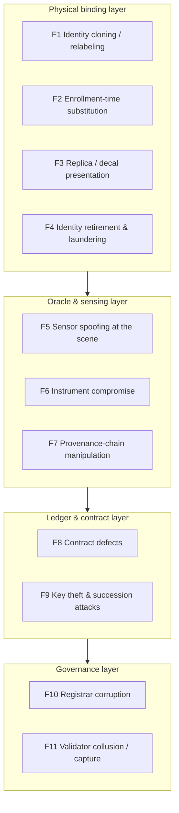

# Part III — Security and Trust {.unnumbered}

# Threat Model — Spoofing, Cloning, and Data Manipulation

## What This Chapter Covers

Parts I and II built a system; this chapter attacks it. The threat model is
organized around the observation that physical-asset ledger systems have an attack
surface that purely digital systems lack: the adversary can act on *matter* — on
devices, sensors, and the physical scene being measured — as well as on keys and
protocols. The chapter defines adversaries and their economics, walks the attack
surface layer by layer (physical binding, oracle and sensing, ledger and contract,
governance), and matches each attack family to its defense pattern. The intent is
the one every serious security chapter owes its reader: not an assurance that the
system is secure, but an explicit account of what it costs to break, where it
breaks first, and what breaks silently.

## 8.1 Adversaries and Their Economics

Security analysis begins with who is attacking and why it pays. Five adversary
classes recur, with sharply different capabilities and — the modeling discipline
this chapter maintains throughout — different *budgets rationally bounded by the
value at stake*:

**Table 8.1** Adversary classes for asset-identity systems.

| Adversary | Motivation | Capabilities | Rational budget bound |
|---|---|---|---|
| A1 Counterfeiter / grey-market producer | Sell low-grade units at premium-grade prices | Manufacturing capacity, label/packaging forgery, sometimes factory insiders | Margin per unit × volume before detection |
| A2 Dishonest custodian | Inflate asset condition or history at sale/claim time | Full physical access to assets and site; controls local sensing environment | Transaction value delta (resale premium, claim payout) |
| A3 Insider at a trusted role | Registrar, O&M, verifier: falsify at the source | Valid signing keys, legitimate process access | Bribe/coercion value; bounded by attributability risk |
| A4 Colluding consortium subset | Rewrite or censor history | Validator keys, governance votes | Joint benefit of rewrite vs. anchor-detection ruin |
| A5 Well-resourced external attacker | Disruption, extortion, market manipulation | Network attacks, key theft, supply-chain compromise of instruments | Not tightly bounded; rare but must be survivable |

The bound in the rightmost column is the model's load-bearing element. An attacker
who must spend more than the premium a false identity earns does not attack — so
every defense in this chapter is evaluated as a *cost multiplier* against a
*bounded prize*, per-unit prizes measured in tens to hundreds of dollars (module
fraud) up to millions (plant-level history fraud, claim fraud). This is also why
Section 1.3's unit economics cut both ways: cheap assets cannot justify expensive
defenses, but neither can they justify expensive attacks.

## 8.2 The Attack Surface, Mapped

**Figure 8.1** Attack surface by layer of the Figure 3.2 stack. Numbered attack
families are treated in Sections 8.3–8.6.

The layering carries the chapter's first structural lesson: **attacks migrate
downward as upper layers harden.** Hash chains and signatures make ledger-layer
forgery the most expensive option, so rational adversaries attack the sensing scene
or the enrollment moment instead — the system is only as strong as the layer where
attack is cheapest, and for physical-asset systems that layer is almost never the
blockchain. Vendors who lead with consensus security are answering the wrong
question.

## 8.3 Attacks on Physical Binding

**F1 — Cloning and relabeling.** The classic attack (Section 1.4.1): attach a
genuine identity to a different object. Against artifact binding it costs a label
printer. Against the composite binding of Chapters 3 and 6 the attacker must
present an object that *passes verification against the enrolled template*. For
active devices this means key extraction from a secure element — expensive,
per-unit, and non-amortizable when keys are unique. For passive assets under
defect-map binding, requirement R3's asymmetry applies: fabricating a device whose
bulk defect structure matches a published template exceeds any plausible per-unit
prize by orders of magnitude. The residual cheap variant is *selective* cloning:
matching only the modalities the verifier will actually check — which is why
Section 3.6's escalation policy randomizes and why Tier 1 checks must vary
modalities rather than always re-running the cheapest.

**F2 — Enrollment-time substitution.** The trusted-setup attack Figure 4.2 flagged:
enroll object X's fingerprint under object Y's product claims (premium label,
inflated flash test). Cryptography downstream is helpless — the record is
internally consistent forever after. Defenses are procedural and statistical:
in-line enrollment physically coupled to the QA flow (no handling gap between
flash test and fingerprint capture, which is precisely how Figure 4.2's line
integration is drawn); instrument co-signing so substitution requires corrupting
the instrument too (F6); and downstream reconciliation — flash-test distributions,
bill-of-materials mass balance, and re-verification statistics that make
*systematic* substitution visible at the population level even when any single
instance passes. F2 is the system's deepest physical vulnerability, and honest
deployments treat registrar audit (Section 8.6) as its real control.

**F3 — Replica presentation.** Rather than modify a device, present *something
else* to the verifier's instrument: a printed EL-pattern transparency, a
current-path decal, a substituted "ringer" module measured in place of the sampled
one. Defenses: challenge parameterization (Section 6.4 — static replicas fail
off-challenge operating points); cross-modal locking (the replica must fool
physically independent modalities *and* their co-registration); and
sampling-protocol integrity — the pre-committed sampling design of Section 6.6
exists precisely so the custodian cannot know which units to prepare, and verifier
procedure (unit selection by the verifier at the moment of measurement, serial
confirmation photographed into the evidence payload) closes the ringer variant.

**F4 — Identity retirement and laundering.** Kill a good identity's history:
"decommission" assets that are actually resold (escaping their recorded
degradation), or strip identities entirely and re-enroll units as
retroactive-class registrations with clean slates (Section 4.3). The defense is
economic design, not cryptography: retroactive registrations carry an explicit,
priced provenance discount (the market does the enforcing), terminal events are
Class C accredited-submitter events with mass-balance declarations
(`EVT_RECYCLE`), and re-enrollment of a fingerprint that matches a
supposedly-recycled template is *detectable by construction* — the template
matcher that verifies identity also recognizes resurrections, one of the quiet
dividends of structural binding: **the fingerprint follows the object even when
the paperwork does not.**

## 8.4 Attacks on the Oracle and Sensing Layer

Chapter 4 called the oracle the trust-critical interface; here is what that means
adversarially.

**F5 — Scene spoofing.** Manipulate what an honest instrument measures: heat or
shade the scene during thermography, bias-starve strings during EL sampling,
condition the battery before an SoH measurement, schedule inspections around known
defects. The instrument signs faithfully; the *scene* lied. Defenses:
environmental co-recording (irradiance, temperature, bias telemetry signed into
the same payload — anomalous measurement conditions become visible in the
evidence); operating-point randomization (the same challenge logic of Section 6.4,
now defending condition records rather than identity); and cohort analytics — a
plant whose sampled modules are systematically healthier than its production data
implies is flagged by the Chapter 11 monitor. Scene spoofing is A2's cheapest
attack and the analytics backstop is the only defense that scales with it.

**F6 — Instrument compromise.** Subvert the measuring device itself: tampered
firmware signing fabricated maps, stolen instrument keys, counterfeit instruments
with cloned credentials. This is where Section 4.5's Rule 3 pays: instruments are
assets with DIDs, attested firmware, calibration lifecycles, and their *own*
binding — so instrument compromise is asset fraud one level up, defended by the
same machinery (secure-element keys, attestation at measurement time, calibration
events from accredited labs). Residual: a fully compromised accredited calibration
chain, which is F10 wearing a lab coat.

**F7 — Provenance-chain manipulation.** Attack the signed computation pipeline
between raw measurement and committed template: substitute inputs between stages,
exploit non-determinism in processing, replay old raw data through new events.
Defenses are protocol hygiene: every stage signs output *and* input digests
(Figure 4.3's chain leaves no unsigned hop), processing is deterministic and
versioned (re-executable years later — the same canonicalization discipline of
Section 4.2), and raw payloads carry instrument-signed timestamps and nonces so
replays collide with their originals on the ledger.

## 8.5 Attacks on the Ledger and Contract Layer

Treated briefly, because the literature is mature and Part II already made the
big choices (BFT consortium, public anchoring, minimal contracts).

**F8 — Contract defects.** The state-machine contract is small by design
(Section 5.5) precisely to shrink this surface; upgrade paths are governed and
ledger-visible (Section 2.5's proxy caveat). The energy-sector twist: contract
*rejection* failures (a bug that blocks legitimate commissioning events during a
construction deadline) carry real project-finance costs, so availability of the
write path is a security property here, not just an ops metric — degraded-mode
procedures (signed offline events, late submission windows, Section 5.1) are the
mitigation.

**F9 — Key theft and succession.** Registrar and role keys are the high-value
digital targets (A3, A5). Standard controls apply (HSMs, thresholds, rotation);
the domain-specific problem is *succession over decades* — bankrupt registrars,
absorbed O&M firms, orphaned role keys. The schema's answer: role authority is
held as revocable, ledger-recorded accreditation (not bare keys), with
consortium-governed succession events, so a stolen orphan key meets a revoked
accreditation rather than an open door. Chapter 9 adds the algorithm-lifetime
dimension to the same machinery.

**F10 / F11 — Governance-layer capture.** A corrupt registrar (F10) is F2 at
scale, bounded by audit, reconciliation, and revocable accreditation whose
revocation is itself public. Validator collusion (F11) — the \(f \ge n/3\) case —
can censor or, jointly, fork; public anchoring converts successful rewrite into
*publicly provable* rewrite (Section 4.4), which for institutional validators with
standing to lose transforms the payoff matrix: the anchor does not prevent the
crime, it guarantees the conviction, and A4's rational-budget row in Table 8.1
closes. Censorship — refusing to include a party's events — is subtler; the
mitigations are procedural (multiple submission paths, inclusion SLAs in the
consortium agreement, and the fact that censored parties hold signed, timestamped
events whose *non-inclusion* is itself demonstrable against the anchored chain).

## 8.6 Defense Patterns, Consolidated

The chapter's defenses reduce to five patterns, stated once here and used
everywhere:

**Table 8.2** Defense patterns and the attack families they bound.

| Pattern | Mechanism | Bounds |
|---|---|---|
| D1 Structural binding with challenge | R1–R5 fingerprints, challenge-parameterized measurement, cross-modal locking | F1, F3, F4 |
| D2 Signed provenance chains | Sensor-level signing, input-digest chaining, deterministic re-execution | F6, F7 |
| D3 Corroboration in proportion to incentive | Class A/B/C event requirements; adverse-interest co-signing | F2, F5, F10 |
| D4 Population-level reconciliation | Cohort analytics, mass balance, distributional audits, cadence monitoring | F2, F4, F5 (systematic variants) |
| D5 Attributability with external anchoring | Everything signed, everything anchored; revocable ledger-recorded authority | F8–F11 |

Two cross-cutting judgments close the analysis. First, **the system's security is
statistical, not absolute, and should be advertised that way**: individual attack
instances at the physical layer can succeed; what the architecture prevents is
*profitable, repeatable, silent* fraud — each pattern either raises per-unit cost
above per-unit prize (D1–D3) or converts repetition into detection (D4–D5).
Second, **the weakest links are procedural**: enrollment integrity and registrar/
calibration accreditation carry more of the system's real security than any
cryptographic component, which is why the governance chapter (Chapter 10) and the
economics chapter (Chapter 13) are security chapters in disguise.

## 8.7 Chapter Summary

The adversary model spans counterfeiters, dishonest custodians, insiders, colluding
validators, and resourced externals, each bounded by the economics of a fraud whose
prize is knowable. Attacks migrate to the cheapest layer, which is physical:
cloning and replica presentation are priced out by structural binding under
challenge (D1); enrollment substitution — the deepest exposure — is bounded
procedurally and statistically, never cryptographically (D3, D4); scene spoofing
falls to environmental co-recording and cohort analytics; instrument and pipeline
attacks fall to the recursion that makes instruments assets (D2); and
governance-layer capture is converted by public anchoring from silent rewrite into
provable self-incrimination (D5). What survives all of this is the long game:
every signature, digest, and anchor in these defenses assumes algorithms that will
not age gracefully across a thirty-year asset life. That assumption is false, and
Chapter 9 is about designing for its falsity.

## References and Further Reading

1. Anderson, R. *Security Engineering: A Guide to Building Dependable Distributed
   Systems.* 3rd ed. Wiley, 2020.
2. Shostack, A. *Threat Modeling: Designing for Security.* Wiley, 2014.
3. Douceur, J. R. "The Sybil Attack." In *Peer-to-Peer Systems (IPTPS 2002)*,
   251–260. Springer, 2002.
4. Zhang, F., E. Cecchetti, K. Croman, A. Juels, and E. Shi. "Town Crier: An
   Authenticated Data Feed for Smart Contracts." In *Proceedings of the 2016 ACM
   SIGSAC Conference on Computer and Communications Security (CCS '16)*, 270–282.
5. Eskandari, S., M. Salehi, W. C. Gu, and J. Clark. "SoK: Oracles from the Ground
   Truth to Market Manipulation." In *Proceedings of the 3rd ACM Conference on
   Advances in Financial Technologies (AFT '21)*, 127–141.
6. Atzei, N., M. Bartoletti, and T. Cimoli. "A Survey of Attacks on Ethereum Smart
   Contracts (SoK)." In *Principles of Security and Trust (POST 2017)*, 164–186.
   Springer, 2017.
7. Guin, U., et al. "Counterfeit Integrated Circuits: A Rising Threat in the
   Global Semiconductor Supply Chain." *Proceedings of the IEEE* 102, no. 8
   (2014): 1207–1228.

\newpage
