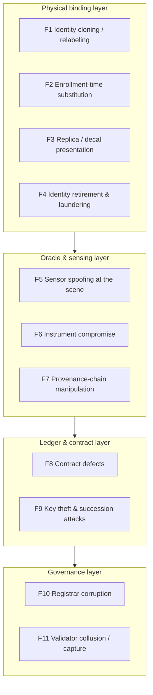

# Part III — Security and Trust {.unnumbered}

# Threat Model — Spoofing, Cloning, and Data Manipulation

## What This Chapter Covers

Parts I and II built a system; this chapter attacks it. The threat model is
organized around the observation that physical-asset ledger systems have an attack
surface that purely digital systems lack: the adversary can act on *matter* — on
devices, sensors, and the physical scene being measured — as well as on keys and
protocols. The chapter states the five security goals the system defends,
defines adversaries and their economics with each class's budget worked,
walks the attack
surface layer by layer (physical binding, oracle and sensing, ledger and contract,
governance) with the highest-value attacks traced through their decision
trees and worked scenarios, matches each attack family to its defense
pattern with each pattern's operating theory and failure conditions stated,
consolidates what survives into a residual-risk register with named
detectors and payers, and closes with the red-team, assurance-case, and
incident-learning practices that keep the model priced against reality. The
intent is
the one every serious security chapter owes its reader: not an assurance that the
system is secure, but an explicit account of what it costs to break, where it
breaks first, and what breaks silently.

## 8.1 Adversaries and Their Economics

Security analysis begins with who is attacking and why it pays. A note on
method first: the chapter organizes by *adversary* and *attack family*
rather than by the STRIDE-style property taxonomy familiar from software
threat modeling, because in cyber-physical fraud the same adversary chains
several property violations into one scheme, and defenses priced against
isolated violations mis-allocate — the relabeling counterfeiter spoofs,
tampers, and repudiates in a single afternoon, and what stops him is not
three property-specific controls but one economic wall placed where his
scheme is thinnest. Property thinking returns in Section 8.1.1's goals
(what must hold) and Section 8.7's assurance cases (why we believe it
holds); the middle of the chapter thinks like the adversary, because that
is where the middle of the money is. Five adversary
classes recur, with sharply different capabilities and — the modeling discipline
this chapter maintains throughout — different *budgets rationally bounded by the
value at stake*:

**Table 8.1** Adversary classes for asset-identity systems.

| Adversary | Motivation | Capabilities | Rational budget bound |
|---|---|---|---|
| A1 Counterfeiter / grey-market producer | Sell low-grade units at premium-grade prices | Manufacturing capacity, label/packaging forgery, sometimes factory insiders | Margin per unit × volume before detection |
| A2 Dishonest custodian | Inflate asset condition or history at sale/claim time | Full physical access to assets and site; controls local sensing environment | Transaction value delta (resale premium, claim payout) |
| A3 Insider at a trusted role | Registrar, O&M, verifier: falsify at the source | Valid signing keys, legitimate process access | Bribe/coercion value; bounded by attributability risk |
| A4 Colluding consortium subset | Rewrite or censor history | Validator keys, governance votes | Joint benefit of rewrite vs. anchor-detection ruin |
| A5 Well-resourced external attacker | Disruption, extortion, market manipulation | Network attacks, key theft, supply-chain compromise of instruments | Not tightly bounded; rare but must be survivable |

The bound in the rightmost column is the model's load-bearing element. An attacker
who must spend more than the premium a false identity earns does not attack — so
every defense in this chapter is evaluated as a *cost multiplier* against a
*bounded prize*, per-unit prizes measured in tens to hundreds of dollars (module
fraud) up to millions (plant-level history fraud, claim fraud). This is also why
Section 1.3's unit economics cut both ways: cheap assets cannot justify expensive
defenses, but neither can they justify expensive attacks.

Each class deserves its economics worked once, because the numbers are what
discipline the defenses. **A1's business case** is volume against detection
lag: at a grade-spread prize of USD 10–30 per module, a relabeling operation
must move thousands of units per month to be worth organizing, which is
precisely what makes it vulnerable to population-level defenses — the
operation's own scale is the signal (D4 below). **A2's case** is
concentration: a single plant sale or catastrophe claim can carry a
seven-figure delta on the honesty of condition records the custodian
controls physically, so A2 rationally spends five figures per incident on
scene preparation — the most dangerous per-incident budget in the model, and
the reason condition-record corroboration is Class B/C rather than a
signature. **A3's case** is bounded by attributability: an insider's forged
event is signed with a key traceable to a person or role, so the rational
insider price includes career and criminal exposure — high enough that A3
attacks concentrate where attribution is weakest, which is why instrument
grades (Table 4.3) matter more than personnel vetting. **A4's case** is the
game Section 8.5 analyzes: the joint prize of a history rewrite must exceed
every colluder's expected loss from anchored, public self-incrimination —
a condition that public anchoring is specifically designed to make
unsatisfiable. **A5** — state-grade or extortion-motivated attackers — is
not economically bounded and must instead be *survivable*: the availability
and recovery machinery of Section 7.7, plus the observation that this
system's worst-case loss is evidential (records disbelieved) rather than
physical (grids do not trip because a registry stalls), keeps A5 in the
serious-but-not-existential column.

### 8.1.1 The Security Goals, Stated as Properties

Before attacking, state precisely what is defended — five properties,
numbered for the assurance cases of Section 8.7:

- **G1 (Binding integrity).** No physical object passes verification against
  an identity it was not enrolled under, except at the published false-accept
  rate.
- **G2 (Record integrity).** No committed event is altered, reordered, or
  suppressed without detection by any verifier holding headers and anchors.
- **G3 (Attribution).** Every event is attributable to a role whose
  authority at claimed time is itself verifiable; no party can plausibly
  disown its own committed statements.
- **G4 (Verification availability).** Any holder of a record bundle can
  complete Steps 1–2 without the cooperation of the consortium, the
  custodian, or any adversary.
- **G5 (Bounded fraud economics).** No *repeatable* fraud against G1–G4 has
  expected profit exceeding expected cost under the adversary budgets of
  Table 8.1.

Note the deliberate modesty: nothing promises that no fraud ever succeeds
(G5 bounds profit, not incidence), nothing promises completeness (Section
5.7 already conceded it), and nothing promises confidentiality here (that is
Chapter 10's property set, threatened by a different adversary map). Every
attack family below is an attempt on one or more G's, and every defense
pattern is priced against the G it protects.

## 8.2 The Attack Surface, Mapped

What, concretely, does the adversary want to *own*? The target inventory,
in rough order of value per unit of attacker effort: the enrollment moment
(own it and every downstream guarantee inherits your lie); registrar and
calibration authority (own it and enrollments come pre-laundered);
the sensing scene at high-stakes measurements (own it per-incident, cheap);
instrument fleets via their update channels (own many measurements at
once); role keys during their authority windows (own attributions);
verification clients that skip proof-checking (own the relying party's
belief directly, skipping the ledger entirely); and, at the theoretical
top, a validator supermajority (own history, publicly, once). Notably
absent from the high-value list: the hash functions, the consensus
protocol, and the contracts — the components that dominate blockchain
security marketing. The inventory is the chapter's road map read in
reverse, and it is also the budget allocation memo for any deployment's
security spending.

**Figure 8.1** Attack surface by layer of the Figure 3.2 stack. Numbered attack
families are treated in Sections 8.3–8.6.

The layering carries the chapter's first structural lesson: **attacks migrate
downward as upper layers harden.** Hash chains and signatures make ledger-layer
forgery the most expensive option, so rational adversaries attack the sensing scene
or the enrollment moment instead — the system is only as strong as the layer where
attack is cheapest, and for physical-asset systems that layer is almost never the
blockchain. Vendors who lead with consensus security are answering the wrong
question.

Compound attacks — schemes spanning layers — are the realistic threat shape,
and the figure's layering is how they are decomposed rather than a claim
that they respect boundaries. The full-dress fraud this book's defenses were
sized against runs: ghost-shift production (F2, procedural layer) enrolled
by a corrupted registrar clerk (F10, governance) with scene-managed
enrollment measurements (F5, oracle), sold into a portfolio whose diligence
uses a non-checking replica client (F7's cousin, ledger interface). Each
layer's defense degrades the scheme independently — reconciliation
statistics squeeze the ghost volume, instrument co-signing forces the clerk
to recruit a technician, condition analytics flag the enrollment cohort's
oddities, and one proof-checking insurer in the syndicate collapses the
replica shortcut — so the compound attack needs *every* layer to fail
simultaneously, which is the defense-in-depth multiplication working as
designed. The modeling discipline for compounds: price the scheme at its
cheapest complete path, not at its most spectacular component, and audit
the layers whose defenses are procedural (F2, F10) hardest, because
procedure is where simultaneous failure correlates.

Scope boundaries, so the model's silence is never mistaken for its verdict.
*Out of scope here*: attacks on grid operation through the assets themselves
(malicious inverter control, coordinated DER manipulation) — real,
grid-critical, and the province of the operational-security literature and
standards this system interfaces with but does not replace; the identity
layer's contribution to that fight is the config-change attributability of
Section 12.4, no more. *Out of scope but adjacent*: privacy attacks
(re-identification, commercial inference), which are Chapter 10's threat
model with a different adversary set — data brokers and competitors rather
than counterfeiters. *In scope but deferred*: quantum-era retrospective
forgery, which is F-everything at once when signatures fall, and which
Chapter 9 treats as the long-horizon compound threat it is. A threat model
earns trust partly by declining to claim territory it has not analyzed.

## 8.3 Attacks on Physical Binding

The bottom layer first, because it is where the money is and where the
defenses are least familiar to security readers trained on digital systems.
Each family below is stated, priced, and matched to its defenses; the
worked scenarios are chosen for being cheap to attempt, since expensive
attacks defend themselves.

**F1 — Cloning and relabeling.** The classic attack (Section 1.4.1): attach a
genuine identity to a different object. Against artifact binding it costs a label
printer. Against the composite binding of Chapters 3 and 6 the attacker must
present an object that *passes verification against the enrolled template*. For
active devices this means key extraction from a secure element — expensive,
per-unit, and non-amortizable when keys are unique. For passive assets under
defect-map binding, requirement R3's asymmetry applies: fabricating a device whose
bulk defect structure matches a published template exceeds any plausible per-unit
prize by orders of magnitude. The residual cheap variant is *selective* cloning:
matching only the modalities the verifier will actually check — which is why
Section 3.6's escalation policy randomizes and why Tier 1 checks must vary
modalities rather than always re-running the cheapest.

Walking the attacker's decision tree makes the economics vivid. The would-be
cloner of a premium module identity has four branches. *Branch one, forge the
label*: cost near zero, defeated at V0/V1 the moment anyone resolves the DID
— the record already places the genuine unit elsewhere, or the enrolled
template awaits a check the fake cannot pass. *Branch two, clone a genuine
DID onto a similar module and hope no structural check ever happens*: viable
only for asset populations that never cross a V2 checkpoint, which the
escalation policy makes unpredictable — and one caught instance burns the
channel, because the duplicate-location anomaly (one DID, two custody
chains) is exactly what the cohort monitor watches for. *Branch three,
manufacture to match the template*: the R3 wall — controlling grain
structure and defect distribution to a published target is beyond the
process control of the *legitimate* fab, at any price a module justifies.
*Branch four, corrupt the enrollment* — which is not cloning at all but F2,
where the tree's honest paths converge, confirming Section 4.3's judgment
that issuance is the layer worth defending procedurally. Every branch either
dies at a cheap checkpoint or exits the attack class entirely; that is what
a well-shaped defense-in-depth looks like from the other side.

**F2 — Enrollment-time substitution.** The trusted-setup attack Figure 4.2 flagged:
enroll object X's fingerprint under object Y's product claims (premium label,
inflated flash test). Cryptography downstream is helpless — the record is
internally consistent forever after. Defenses are procedural and statistical:
in-line enrollment physically coupled to the QA flow (no handling gap between
flash test and fingerprint capture, which is precisely how Figure 4.2's line
integration is drawn); instrument co-signing so substitution requires corrupting
the instrument too (F6); and downstream reconciliation — flash-test distributions,
bill-of-materials mass balance, and re-verification statistics that make
*systematic* substitution visible at the population level even when any single
instance passes. F2 is the system's deepest physical vulnerability, and honest
deployments treat registrar audit (Section 8.6) as its real control.

The population-level detection deserves its mechanism spelled out, because it
is the argument that keeps F2 bounded rather than merely acknowledged. A
factory running systematic misgrading — enrolling B-grade structure under
A-grade claims — distorts distributions it cannot see or control: the joint
distribution of flash parameters and structural features across its
production develops a signature (claimed power uncorrelated with the
defect-density statistics that physically drive power), Tier-2 sampled
enrollments provide ground truth against which the correlation is testable,
and field re-verifications accumulate independent measurements that
converge on the truth at a rate the fraudster cannot influence. The
arithmetic is unforgiving: a 2% systematic misgrade across a production
month is invisible in any single record and a five-sigma anomaly in the
month's joint statistics. What survives is *artisanal* F2 — the occasional
single unit, substituted with care — which is real, small, priced into the
Step-4 residuals of Section 6.6, and, notably, *bounded by the attacker's
own inability to scale*: the moment artisanal fraud industrializes, it
becomes statistical and dies.

**F3 — Replica presentation.** Rather than modify a device, present *something
else* to the verifier's instrument: a printed EL-pattern transparency, a
current-path decal, a substituted "ringer" module measured in place of the sampled
one. Defenses: challenge parameterization (Section 6.4 — static replicas fail
off-challenge operating points); cross-modal locking (the replica must fool
physically independent modalities *and* their co-registration); and
sampling-protocol integrity — the pre-committed sampling design of Section 6.6
exists precisely so the custodian cannot know which units to prepare, and verifier
procedure (unit selection by the verifier at the moment of measurement, serial
confirmation photographed into the evidence payload) closes the ringer variant.

The ringer deserves its walkthrough because it is the red team's favorite
(Section 8.7) and the one F3 variant that needs no fabrication skill at all.
The custodian keeps a small stock of genuinely healthy modules whose
identities match nothing, and when the verifier's sample names position
B4-R112-S07-17, a crew swaps the ringer into that position an hour ahead.
What defeats it is embarrassingly procedural: the verifier walks to the
position unannounced, reads the module's own locator, resolves its DID *at
the racking*, and photographs label, position, and instrument serial into
the signed measurement payload — so the measurement is bound to a specific
laminate at a specific position at a specific minute, and a ringer must now
*be* the enrolled module (which it is not, and V2 will say so) rather than
merely sit where one was expected. The lesson generalizes beyond F3:
physical-layer attacks are defeated by physical-layer discipline, and the
protocol documents that discipline so its performance is verifiable too.

**F4 — Identity retirement and laundering.** Kill a good identity's history:
"decommission" assets that are actually resold (escaping their recorded
degradation), or strip identities entirely and re-enroll units as
retroactive-class registrations with clean slates (Section 4.3). The defense is
economic design, not cryptography: retroactive registrations carry an explicit,
priced provenance discount (the market does the enforcing), terminal events are
Class C accredited-submitter events with mass-balance declarations
(`EVT_RECYCLE`), and re-enrollment of a fingerprint that matches a
supposedly-recycled template is *detectable by construction* — the template
matcher that verifies identity also recognizes resurrections, one of the quiet
dividends of structural binding: **the fingerprint follows the object even when
the paperwork does not.**

The worked form, since F4 is the secondary market's characteristic fraud. An
operator holding 4,000 modules with recorded hail damage "decommissions"
them, ships them to an affiliated broker in a lax jurisdiction, strips
labels, and re-enrolls them retroactively as undocumented used stock with
clean condition baselines. The paperwork is internally consistent; what
betrays it is physics plus economics. Physics: retroactive enrollment
captures each unit's structural fingerprint, and the registry's template
matcher — which runs every new enrollment against the existing corpus
precisely for this case — finds 4,000 fresh enrollments whose
stable-structure layers match 4,000 supposedly retired DIDs; the
resurrection flags fire wholesale. Economics: even if the matcher were
evaded (enrollment under a modality the original records lacked), the units
enter the market carrying the retroactive class's provenance discount
(Section 4.3), which caps the laundering profit at the gap between
damaged-with-history and undocumented-clean prices — a gap the discount
exists to compress. The attack survives, at scale, only in a world without
template matching and without provenance-classed pricing — that is, in the
status quo, where it happens routinely and this book found it in
Section 1.4.4.

## 8.4 Attacks on the Oracle and Sensing Layer

Chapter 4 called the oracle the trust-critical interface; here is what that means
adversarially. The layer's defining feature for the attacker is that its
lies are *fresh* — manufactured at measurement time, before any cryptography
attaches — so the defenses are correspondingly about constraining the
moment of measurement: what else is recorded with it, who else must agree
to it, and what the population of all such moments looks like in aggregate.

**F5 — Scene spoofing.** Manipulate what an honest instrument measures: heat or
shade the scene during thermography, bias-starve strings during EL sampling,
condition the battery before an SoH measurement, schedule inspections around known
defects. The instrument signs faithfully; the *scene* lied. Defenses:
environmental co-recording (irradiance, temperature, bias telemetry signed into
the same payload — anomalous measurement conditions become visible in the
evidence); operating-point randomization (the same challenge logic of Section 6.4,
now defending condition records rather than identity); and cohort analytics — a
plant whose sampled modules are systematically healthier than its production data
implies is flagged by the Chapter 11 monitor. Scene spoofing is A2's cheapest
attack and the analytics backstop is the only defense that scales with it.

A worked instance shows the defense stack operating. An owner preparing a
plant sale wants its year-9 condition campaign to under-report degradation,
and instructs a cooperative inspection contractor to run EL at elevated bias
(which brightens weak regions) on the sampled strings. The instrument
faithfully signs image *and* bias telemetry — the elevated set-point is now
in the anchored payload, visible to any diligence reviewer who checks
measurement conditions against the campaign's declared protocol (a Step-2
policy check, automated). Suppose instead the contractor edits the protocol
declaration to match: now the campaign's conditions are internally
consistent but *externally* anomalous — no other contractor in the cohort
runs that bias — and the monitor flags the campaign wholesale. Suppose,
finally, full sophistication: plausible conditions, curated sampling. This
is where the pre-committed, verifier-drawn sampling of Section 6.6 closes
the door the custodian's cooperation opened — the seller's own campaign can
lie, but the buyer's Step-3 verification, drawn after the records freeze,
re-measures a sample the seller could not curate, and a systematic gap
between the seller's campaign and the buyer's sample is itself damning,
anchored evidence. The general shape: each layer forces the fraud to
recruit one more party or forge one more correlated data stream, and the
recruitment chain is the detection surface.

The battery variant of F5 deserves its own sentence because the scene there
is *temporal* rather than optical: a pack's measured state of health depends
on its recent history (rest periods, temperature soak, charge conditioning),
so the spoof is preparation rather than staging — condition the pack for a
week before the SoH measurement and the instrument honestly reports a
flattering number. The defense translates directly: the measurement protocol
prescribes and *records* the pre-conditioning state (rest time,
temperature history from the pack's own attested BMS logs), and an SoH
attestation whose preparation window is unrecorded is graded down exactly
like an EL image without bias telemetry. Chapter 12 carries the details
into the second-life market where this fraud has its money.

**F6 — Instrument compromise.** Subvert the measuring device itself: tampered
firmware signing fabricated maps, stolen instrument keys, counterfeit instruments
with cloned credentials. This is where Section 4.5's Rule 3 pays: instruments are
assets with DIDs, attested firmware, calibration lifecycles, and their *own*
binding — so instrument compromise is asset fraud one level up, defended by the
same machinery (secure-element keys, attestation at measurement time, calibration
events from accredited labs). Residual: a fully compromised accredited calibration
chain, which is F10 wearing a lab coat.

The scenario worth thinking through is the *supply-chain* variant, because it
scales where key theft does not: a compromised firmware update pushed to a
fleet of field EL rigs, biasing template comparisons in a chosen direction.
Three properties bound it. Firmware attestation puts the running image's
digest in every measurement payload, so the compromised version is *named*
in the evidence it produces — post-incident, the affected measurement
population is a ledger query, and remediation (re-measurement of affected
verifications) is targeted rather than total. Update authority for
instrument firmware is itself dual-controlled under the governance register
(the F12 pattern of Section 12.4, applied to instruments early). And
cross-modal corroboration means a biased EL fleet drifts detectably against
the electrical and magnetometric streams it is supposed to agree with —
another instance of D4's general moral that *correlated* fraud must corrupt
every correlated channel or become an anomaly. What this defense stack
cannot do is prevent the compromised interval from existing; what it
guarantees is that the interval is bounded, attributable, and repairable —
which is the realistic standard for supply-chain integrity anywhere.

**F7 — Provenance-chain manipulation.** Attack the signed computation pipeline
between raw measurement and committed template: substitute inputs between stages,
exploit non-determinism in processing, replay old raw data through new events.
Defenses are protocol hygiene: every stage signs output *and* input digests
(Figure 4.3's chain leaves no unsigned hop), processing is deterministic and
versioned (re-executable years later — the same canonicalization discipline of
Section 4.2), and raw payloads carry instrument-signed timestamps and nonces so
replays collide with their originals on the ledger.

The replay variant is the one that has actually bitten deployed systems and
deserves its worked sentence: an operator re-submits a genuinely healthy
year-2 EL image as this year's inspection payload, banking on nobody
comparing pixels. The nonce-and-timestamp discipline defeats the naive form
(the old raw file's instrument signature names its own capture time, which
contradicts the new event's claimed time), and the sophisticated form —
re-capturing the old image with a new instrument signature by photographing
a display — is scene spoofing F5, handled there. The deeper point F7
teaches: the pipeline's security is *compositional*, and every audit of it
should walk the chain hop by hop asking "what, exactly, does the signature
on this hop bind?" — because the historical failures in analogous systems
(digital evidence pipelines, medical imaging) have all lived in a hop whose
signature bound less than its consumers assumed.

Alongside F7 belongs its lazy cousin from Section 7.3 — the **trusted-replica
shortcut**, in which verification clients accept a read replica's answers
without checking proofs. It is listed in this chapter because it will be the
*most exploited* weakness in practice: not by sophisticated adversaries but
by ordinary integration laziness, which an adversary then discovers. A
replica that serves one tampered record to one non-checking insurer client
has silently converted the whole anchored architecture back into "trust my
API." The defense is cultural and tooling-level — proof-checking defaults,
conformance suites that fail non-checking clients, and contractual language
making unverified reliance the relying party's own risk.

## 8.5 Attacks on the Ledger and Contract Layer

Treated more briefly than the layers below it — not because the layer is
unimportant but because the literature is mature, Part II already made the
big choices (BFT consortium, public anchoring, minimal contracts), and the
rational adversary of Section 8.2 mostly shops elsewhere. What remains are
the failure modes those choices deliberately traded into: small contracts
that can wrongly reject, keys that outlive their institutions, and
committees that are institutions with institutions' weaknesses.

**F8 — Contract defects.** The state-machine contract is small by design
(Section 5.5) precisely to shrink this surface; upgrade paths are governed and
ledger-visible (Section 2.5's proxy caveat). The energy-sector twist: contract
*rejection* failures (a bug that blocks legitimate commissioning events during a
construction deadline) carry real project-finance costs, so availability of the
write path is a security property here, not just an ops metric — degraded-mode
procedures (signed offline events, late submission windows, Section 5.1) are the
mitigation.

Why this surface stays small deserves the contrast with its financial
cousins, because the difference is architectural, not fortunate. DeFi
contracts are attacked profitably because they *hold value and act on it* —
a bug is a vault door ajar. The lifecycle contracts hold no funds and
execute no transfers of value; their worst-case defect admits a malformed
event or wrongly rejects a valid one, both of which are recoverable through
the supersession and dispute machinery, and neither of which pays the
attacker anything directly. The realistic F8 exploit is therefore
*enabling* rather than extractive — a validation gap that lets an F2 or F5
fraud slip a corroboration check — which is why the contract conformance
suite (Section 7.5's software-diversity argument) tests the corroboration
and authorization logic hardest, and why formal verification of exactly
this logic is research item C3: small, closed, and worth proving.

**F9 — Key theft and succession.** Registrar and role keys are the high-value
digital targets (A3, A5). Standard controls apply (HSMs, thresholds, rotation);
the domain-specific problem is *succession over decades* — bankrupt registrars,
absorbed O&M firms, orphaned role keys. The schema's answer: role authority is
held as revocable, ledger-recorded accreditation (not bare keys), with
consortium-governed succession events, so a stolen orphan key meets a revoked
accreditation rather than an open door. Chapter 9 adds the algorithm-lifetime
dimension to the same machinery.

The succession attack's worked form shows why the accreditation indirection
earns its complexity. An O&M firm dissolves in year 11; its signing keys —
HSM-held, but the HSM is an asset in a bankruptcy estate — surface two years
later in the hands of a buyer of the estate's IT assets. In a bare-key
world those keys still *are* the firm's identity, and backdated maintenance
records signed with them are indistinguishable from history. Under the
accreditation register, the firm's authority has a recorded end date (the
insolvency triggered a governance suspension within days, per the
consortium agreement's insolvency clause), so any newly submitted event
citing a claimed time inside the authority window but arriving years late
fails the submission-window check, and any event citing a claimed time
after the suspension fails authorization outright. The stolen keys can sign;
they cannot *have been authorized*, and the difference is exactly what
time-contextual verification (Section 9.4, P2) exists to enforce. The
residual — theft *during* the authority window, exploited promptly — is the
classic insider case A3, bounded by attributability and by the corroboration
classes that deny lone keys the power to move money.

**F10 / F11 — Governance-layer capture.** A corrupt registrar (F10) is F2 at
scale, bounded by audit, reconciliation, and revocable accreditation whose
revocation is itself public. Validator collusion (F11) — the \(f \ge n/3\) case —
can censor or, jointly, fork; public anchoring converts successful rewrite into
*publicly provable* rewrite (Section 4.4), which for institutional validators with
standing to lose transforms the payoff matrix: the anchor does not prevent the
crime, it guarantees the conviction, and A4's rational-budget row in Table 8.1
closes. Censorship — refusing to include a party's events — is subtler; the
mitigations are procedural (multiple submission paths, inclusion SLAs in the
consortium agreement, and the fact that censored parties hold signed, timestamped
events whose *non-inclusion* is itself demonstrable against the anchored chain).
The censorship scenario worth rehearsing: a manufacturer-heavy validator
faction delays an independent recycler's mass-balance events during a
contested EPR reporting season. The recycler's events are signed, its
submission receipts (validators acknowledge receipt as a protocol matter)
are timestamped, and the growing gap between receipt and inclusion is
arithmetic against the anchored chain — a demonstrable SLA breach that the
governance machinery can sanction and, if governance is itself captured, a
regulator can read directly, because non-inclusion proofs require no
consortium cooperation to construct. Censorship in this architecture is a
slow, visible, self-documenting offense, which is roughly the best that can
be said of any liveness attack.

The collusion game rewards one more turn of analysis, because "they could
all collude" is the objection every consortium design meets and few answer
quantitatively. For a rewrite to profit, a coalition of six-plus
institutions (at \(n=16\)) must jointly gain more than the sum of their
individual expected losses from detection — and detection is not
probabilistic here but *structural*: the rewritten chain fails against
anchors the coalition cannot alter, every party holding an old proof
becomes a witness, and the evidence of the crime is precisely the kind of
cryptographic exhibit that makes liability easy. The coalition's gain,
meanwhile, is bounded by what a rewrite can actually monetize: histories
whose beneficiaries are *inside* the coalition (a manufacturer erasing its
defect wave, an owner inflating a fleet's condition) — but those are
exactly the parties whose counterparties (insurers, buyers, certifiers)
sit on the same committee by the composition rules of Section 7.5. The
adverse-interest structure is thus not decorative: it is the mechanism
that makes the profitable coalitions unconstructible and the constructible
coalitions unprofitable. What remains genuinely live is the *weak-form*
capture — agenda control, schema politics, fee-setting to disadvantage
non-members — which no cryptography touches and Chapter 10's governance
design (open verification, published transparency reports,
regulator observers) is built to expose.

## 8.6 Defense Patterns, Consolidated

The chapter's defenses reduce to five patterns, stated once here and used
everywhere. The consolidation is not editorial tidiness: a deployment
implements patterns, not paragraphs, and a security review that checks five
pattern-implementations against their failure conditions covers everything
the family-by-family analysis covered.

**Table 8.2** Defense patterns and the attack families they bound.

| Pattern | Mechanism | Bounds |
|---|---|---|
| D1 Structural binding with challenge | R1–R5 fingerprints, challenge-parameterized measurement, cross-modal locking | F1, F3, F4 |
| D2 Signed provenance chains | Sensor-level signing, input-digest chaining, deterministic re-execution | F6, F7 |
| D3 Corroboration in proportion to incentive | Class A/B/C event requirements; adverse-interest co-signing | F2, F5, F10 |
| D4 Population-level reconciliation | Cohort analytics, mass balance, distributional audits, cadence monitoring | F2, F4, F5 (systematic variants) |
| D5 Attributability with external anchoring | Everything signed, everything anchored; revocable ledger-recorded authority | F8–F11 |

Each pattern deserves its one-paragraph operating theory, because the table's
compression hides *why* each works and therefore when each fails.

**D1** works because it moves the contest onto terrain where the defender
has a physical monopoly: the enrolled structure exists in exactly one
object, and every verification is a question only that object can answer
cheaply. It fails where the structure is unenrolled (retrofit gaps), where
the challenge space is exhausted or leaked, or where verification is skipped
— D1 protects nothing that nobody checks, which is why the escalation
ladder's *unpredictability* is part of the pattern.

**D2** works because signatures compose transitively: binding each hop to
its inputs makes the whole pipeline as strong as its weakest *signed* claim
rather than its weakest component. It fails at unsigned hops — which is why
audits walk hops — and at the origin, where the first signature can only
attest that *something* was measured; D2 hands the origin problem to D1 and
D3 and is honest about it.

**D3** works because it prices collusion: every additional required
corroborator multiplies the fraud's recruitment cost and its detection
surface simultaneously. It fails when corroborators are correlated —
Section 4.5's independence requirement is the pattern's entire content —
and it degrades gracefully: even a corrupted Class C event has named its
conspirators for the record.

**D4** works because fraud at scale is a statistical object whether the
fraudster likes it or not: populations have physics-constrained joint
distributions, and systematic lies bend them. It fails against artisanal
fraud (by design — that residual is priced instead) and where baselines are
thin (young cohorts, novel technologies), which is why D4's power compounds
with deployment age and why early deployments lean harder on D1–D3.

**D5** works because institutions fear proof more than they fear rules: the
anchor converts betrayal from a private gamble into a public certainty,
which reorders every rational actor's payoff column. It fails against
actors without standing to lose — the genuinely fly-by-night — which is why
accreditation gates the roles that matter and why the registrar bond of
Section 4.3.2 exists to give even a shell company something forfeitable.

The patterns also *compose* deliberately: D1 without D5 is a fingerprint
nobody can audit the checking of; D5 without D1 is an immaculate record
about unverified matter — the first wave's tombstone; D4 without D2 is
analytics over forgeable inputs. The architecture's security claim is not
any pattern but the closed loop: matter bound to records (D1), records
bound to processes (D2), processes bound to interests (D3), populations
watched (D4), and everything attributable forever (D5).

Two cross-cutting judgments close the analysis. First, **the system's security is
statistical, not absolute, and should be advertised that way**: individual attack
instances at the physical layer can succeed; what the architecture prevents is
*profitable, repeatable, silent* fraud — each pattern either raises per-unit cost
above per-unit prize (D1–D3) or converts repetition into detection (D4–D5).
Second, **the weakest links are procedural**: enrollment integrity and registrar/
calibration accreditation carry more of the system's real security than any
cryptographic component, which is why the governance chapter (Chapter 10) and the
economics chapter (Chapter 13) are security chapters in disguise.

The consolidated view supports a residual-risk register — the list a
deployment's risk committee should own, review, and re-price annually,
because a threat model that ends at "defenses exist" has not finished its
sentence.

**Table 8.3** The residual-risk register: what remains after the defense
patterns, and how each residual is carried.

| Residual | Why it survives the defenses | Carried by |
|---|---|---|
| Artisanal enrollment substitution (F2, single units) | Below statistical detection threshold; procedural controls probabilistic | Step-4 pricing; insurance |
| Scene spoofing with full party collusion (F5 extreme) | Defense requires an honest party or independent stream somewhere | Adverse-interest sampling at transactions; deterrence via anchored self-incrimination |
| Unrecorded events (§5.7) | Completeness is an incentive property | Gap-pricing by buyers; cadence analytics; SLA terms |
| Intra-anchor-window rewrite (§4.4) | Anchoring is periodic | Interval policy; event-triggered anchors for high-value classes |
| Calibration-chain corruption (F6/F10 compound) | Trust recursion must terminate somewhere | Accreditation audit; multi-lab cross-checks; Tier-3 reference artifacts |
| Censorship by validator subset (F11 weak form) | Inclusion is a liveness property, not safety | Submission-path redundancy; demonstrable non-inclusion vs. anchors; governance sanction |
| Template-format lock-in (§12.5, S3) | A market failure, not an attack — but it degrades verifiability like one | Standardization campaign (Ch. 14); procurement clauses |

None of these residuals is silent — each has a named detector or a named
payer — and that, rather than their elimination, is the standard this
chapter set out to meet. A risk register whose entries are visible, priced,
and assigned is the grown-up form of the word "secure."

Defense cost accounting completes the consolidation, because a threat model
that never totals its own bill invites gold-plating. D1's costs were priced
in Table 6.3 and land per-transaction; D2's are firmware and integration,
one-time per instrument class; D3's are the workflow costs of corroboration
— the S2 co-signing episode of Section 11.3 measured them at a
procedure-design problem, not a budget line; D4 is an analytics service
whose cost is trivial and whose value compounds; D5's are the anchoring
cents and the governance hours of Chapter 10. Nothing in the stack costs
what a single major fraud costs, and — the asymmetric fact worth ending on
— *most of the stack's cost is borne once, while its deterrence is priced
by every would-be attacker forever*: the economics of published, credible
defense are the one place in this chapter where the defender, for once,
holds the compounding advantage.

## 8.7 Exercising the Model: Red Teams and Assurance Cases

A threat model on paper decays; the chapter closes with the practices that
keep it live. **Structured red-teaming**: annually, a team with full design
knowledge and realistic budgets attempts one attack per family against a
test enclave — the pilot's first exercise produced two findings that
reshaped this chapter (the ringer variant of F3, discovered by a red team
technician bored with decal fabrication, and a replay window in an early
provenance-chain implementation, closed by the nonce discipline of
Section 4.5). Red-team economics should mirror Table 8.1's budgets: an
exercise allowed to spend a million dollars attacking a forty-dollar prize
proves nothing either way. **Assurance cases**: for each defense pattern, a
maintained argument — claims, evidence, assumptions — in the safety-case
style, reviewed when any assumption's supporting fact changes (an
instrument-grade downgrade, a new imaging modality, a PQC milestone). A
fragment shows the form. *Claim*: G1 holds for factory-enrolled modules at
FAR ≤ 10⁻⁶ under V3 verification. *Argument*: template entropy (evidence:
production-population cross-comparison statistics, updated quarterly) plus
challenge-space coverage (evidence: protocol audit) plus instrument
integrity (assumption: I-A grade maintained — link to calibration-chain
case) plus R5 evolution checks (assumption: decomposition model v3 —
link to M1 research status). Every assumption is a tripwire: when the
decomposition model revises, the case flags for review automatically. The
assurance case is also the honest interface to certification and insurance:
underwriters price what they can read, and a maintained case reads better
than a marketing architecture diagram. **Incident learning**: every
confirmed or suspected attack instance becomes an `EVT_AUDIT`-class record
and a model revision — feeding the same evidential machinery the system
runs on, because a security process that does not eat its own cooking has
no standing to recommend the meal.

## 8.8 Chapter Summary

The chapter defended five stated properties — binding integrity, record
integrity, attribution, verification availability, and bounded fraud
economics — against an adversary model spanning counterfeiters, dishonest
custodians, insiders, colluding
validators, and resourced externals, each bounded by the economics of a fraud whose
prize is knowable and each worked through its rational decision tree.
Attacks migrate to the cheapest layer, which is physical:
cloning and replica presentation are priced out by structural binding under
challenge (D1), with the ringer variant closed by procedure rather than
mathematics; enrollment substitution — the deepest exposure — is bounded
procedurally and statistically, never cryptographically (D3, D4), with
systematic variants dying in their own population statistics and artisanal
variants priced as named residuals; scene spoofing
falls to environmental co-recording, cohort analytics, and the
adverse-interest sampling that no custodian cooperation can pre-stage;
instrument and pipeline
attacks fall to the recursion that makes instruments assets (D2), including
the supply-chain variant whose damage is bounded and attributable rather
than prevented; key theft over decades meets time-contextual authority
rather than eternal keys; and
governance-layer capture is converted by public anchoring from silent rewrite into
provable self-incrimination (D5), with the collusion game shown
unprofitable for constructible coalitions and the weak-form capture handed,
honestly, to governance design. The residual-risk register of Table 8.3
carries what survives, each entry with a detector or a payer, and the
red-team, assurance-case, and incident-learning practices of Section 8.7
keep the model priced against reality rather than against its own
publication date. What survives all of this is the long game:
every signature, digest, and anchor in these defenses assumes algorithms that will
not age gracefully across a thirty-year asset life. That assumption is false, and
Chapter 9 is about designing for its falsity.

## References and Further Reading

1. Anderson, R. *Security Engineering: A Guide to Building Dependable Distributed
   Systems.* 3rd ed. Wiley, 2020.
2. Shostack, A. *Threat Modeling: Designing for Security.* Wiley, 2014.
3. Douceur, J. R. "The Sybil Attack." In *Peer-to-Peer Systems (IPTPS 2002)*,
   251–260. Springer, 2002.
4. Zhang, F., E. Cecchetti, K. Croman, A. Juels, and E. Shi. "Town Crier: An
   Authenticated Data Feed for Smart Contracts." In *Proceedings of the 2016 ACM
   SIGSAC Conference on Computer and Communications Security (CCS '16)*, 270–282.
5. Eskandari, S., M. Salehi, W. C. Gu, and J. Clark. "SoK: Oracles from the Ground
   Truth to Market Manipulation." In *Proceedings of the 3rd ACM Conference on
   Advances in Financial Technologies (AFT '21)*, 127–141.
6. Atzei, N., M. Bartoletti, and T. Cimoli. "A Survey of Attacks on Ethereum Smart
   Contracts (SoK)." In *Principles of Security and Trust (POST 2017)*, 164–186.
   Springer, 2017.
7. Guin, U., et al. "Counterfeit Integrated Circuits: A Rising Threat in the
   Global Semiconductor Supply Chain." *Proceedings of the IEEE* 102, no. 8
   (2014): 1207–1228. The adjacent industry whose counterfeit taxonomy
   Section 8.3 adapts.
8. Kelly, T., and R. Weaver. "The Goal Structuring Notation — A Safety
   Argument Notation." In *Proceedings of the DSN Workshop on Assurance
   Cases*, 2004. The assurance-case form of Section 8.7.
9. Rührmair, U., et al. "Modeling Attacks on Physical Unclonable Functions."
   In *Proceedings of CCS '10*, 237–249. The precedent for inviting the
   attack literature early (Section 6.8's M2, enforced here as practice).

\newpage
