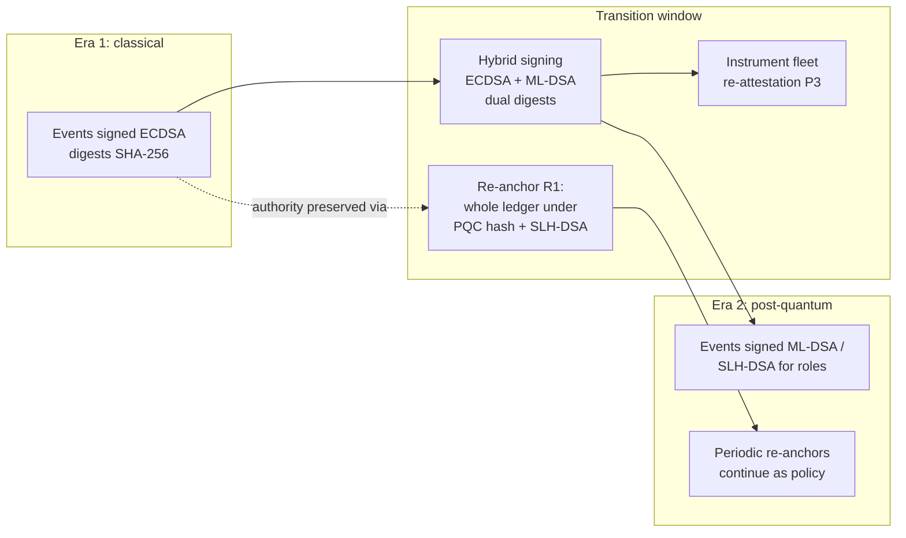

# Post-Quantum Considerations for Long-Lived Infrastructure

## What This Chapter Covers

A solar module warranted in 2026 will still be generating claims-relevant evidence
in 2051. Every signature, digest, and anchor defending that evidence was made with
algorithms chosen in the 2020s — and the working assumption of this chapter is that
some of those algorithms will not survive the asset. This is not pessimism
about any particular algorithm; it is actuarial respect for the base rate
at which cryptography ages, quantum computation being merely the
best-advertised of its hazards. The chapter explains why the
quantum threat bears on asset-identity systems *differently and more severely* than
on the financial blockchain systems that dominate the post-quantum discussion;
derives the design consequences (which turn out to be schema and governance
consequences more than algorithm choices); and presents migration-ready patterns
for records that must remain verifiable across at least one, and plausibly two,
cryptographic transitions. I treat migration mechanics at the depth this system
needs and no further; readers migrating general enterprise infrastructure will find
the systematic treatment in my earlier book on post-quantum migration, which this
chapter deliberately cross-references rather than duplicates. The chapter's
route: the asymmetry that makes retrospective verification the workload
(9.1), timeline reasoning that binds without prophecy plus the long-lived
peers' precedents (9.2), algorithm selection under a thirty-year constraint
with the families rejected as well as chosen (9.3), the four migration
patterns that keep old evidence meaningful without touching a committed
byte (9.4), the physical binding's quantum dividend (9.5), a worked 2049
retrospective that runs the whole machine end to end (9.6), and the
governance — registers, calendars, procurement clauses, and cost
allocation — that makes the mathematics deployable (9.7).

## 9.1 The Asymmetry: Why Thirty Years Changes the Question

The standard quantum-risk framing for blockchains is financial: a
cryptographically relevant quantum computer (CRQC) running Shor's algorithm breaks
the elliptic-curve signatures guarding funds; the defense is to move funds to
post-quantum addresses before the attacker arrives. The framing is *transactional*
— protect the next transaction — and it quietly assumes the past does not matter:
old payment signatures have no residual value once funds move. The
literature built on that framing is genuinely useful — the attack
inventories, the migration mechanics for live key material, the
hybrid-scheme constructions all transfer — but its risk calculus does not,
and importing it unadjusted produces the two characteristic errors this
chapter exists to prevent: under-protecting history (because payments
never needed to) and over-focusing on the consensus layer (because that is
where the funds were).

Asset identity inverts this. The value of the system *is* its past: a warranty
adjudication in 2049 turns on the verifiability of a commissioning signature made
in 2027. The attack this enables deserves one concrete rendering before the
analysis abstracts it. A counterfeiter in 2045, holding a CRQC's services
and a warehouse of anonymous mid-2020s-vintage modules, forges what the
2020s never protected against: a complete era-1 provenance — registration
events signed with the recovered key of a long-dissolved registrar,
commissioning by a defunct EPC, inspection records from retired
instruments — every signature *cryptographically perfect* by era-1
verification, attached to physically genuine period hardware. Without this
chapter's machinery, that dossier is indistinguishable from truth and
worth the full documented-provenance premium across thousands of units.
With it, the fraud dies twice: the forged events appear in no anchored
history (their absence from the 2033 re-anchor is checkable by anyone),
and the nominated templates either match nothing or collide with genuine
assets' records. The scenario is the chapter's stakes in miniature — the
adversary attacks the *archive*, and the archive must have been made
attack-proof decades before the attack was possible. Three consequences
follow, and they reorganize the whole analysis:

1. **Retrospective verification is the workload.** It is not enough that new
   events use safe algorithms; twenty-year-old signatures must still *mean
   something* to a verifier who knows the signing algorithm has since fallen. An
   ECDSA signature verified in 2049 proves nothing by itself — anyone with a CRQC
   could have forged it in 2047. The record's authority must rest on something
   other than the enduring strength of its original algorithm.
2. **"Harvest now, decrypt later" becomes "wait, then rewrite."** The financial
   attacker steals keys to spend. The asset-identity attacker forges *history*:
   with a broken signature scheme, A2 or A3 of Table 8.1 fabricates a plausible
   2020s-vintage maintenance record, or a counterfeiter mints "old" registrations
   for freshly made units. The prize is not a hot wallet but the entire evidential
   authority of the early ledger.
3. **The transition is plural.** Over thirty years the system should expect not
   one migration (classical → post-quantum) but ongoing algorithm lifecycle —
   parameter upgrades, deprecations of first-generation PQC candidates, hash
   migrations. The design target is not "add Dilithium" but *algorithm agility as
   a permanent property of the schema*.

Each consequence rewards one more paragraph of unpacking, because each
reverses a habit the payment framing installed. The
*retrospective-verification* workload (consequence 1) is not a rare
appellate scenario but the system's routine: every Step-1 verification of a
mid-life asset evaluates signatures made five, ten, twenty years earlier,
so the "old algorithm" path through the verifier is the *hot* path, and it
must be engineered, tested, and conformance-suited with the same rigor as
current-era signing — a reversal of ordinary software priorities, where
legacy paths rot in peace. The *wait-then-rewrite* adversary (consequence 2)
also changes what "harvest now" means here: in confidentiality contexts the
harvester steals ciphertext for later decryption, but a registry's data is
mostly integrity-sensitive rather than secret, so the analog is *position-
taking* — an adversary today accumulating signed artifacts, key material
from dissolved parties (F9's estates), and knowledge of record structures,
against the day when forging era-1 history becomes computationally cheap.
The defense against position-taking is precisely the dated re-anchor: it
slams the window shut at a public timestamp, converting "someday forgeable"
into "forgeable only before 2033, which is to say never." The *plural
transition* (consequence 3), finally, is an argument from base rates: the
past thirty years of cryptographic practice contain the DES retirement, the
MD5 and SHA-1 collapses, multiple RSA key-size escalations, and the
elliptic-curve migration itself — an algorithm change roughly every
decade — and there is no reason to expect the next thirty to be calmer,
CRQC or no CRQC. A system that treats the post-quantum transition as a
one-time crisis will meet its second transition unprepared; a system that
treats algorithm lifecycle as weather builds the machinery of this
chapter once and reuses it forever.

The saving observation — and the chapter's central design resource — is that the
architecture already contains the answer in embryonic form. **Hash functions and
Merkle structures degrade far more gracefully under quantum attack than signatures
do** (Grover's algorithm halves effective hash security; Shor's demolishes
elliptic-curve and RSA signatures outright). A record whose integrity rests on its
membership in an *anchored hash structure* — rather than solely on its author's
signature — inherits the sturdier failure mode. The migration patterns of
Section 9.4 are, at bottom, ways of transferring evidential weight from signatures
(fragile) onto anchored structure (robust) *before* the signatures fail.

The asymmetry between the two primitive families deserves its physics-level
sentences, because it grounds the whole strategy and because getting it
slightly wrong produces migration plans that are slightly wrong everywhere. Shor's algorithm solves the
specific number-theoretic problems (integer factoring, discrete logarithms)
on which RSA and elliptic-curve signatures rest, with an exponential
speedup — a CRQC does not weaken these schemes, it *ends* them. Grover's
algorithm, by contrast, offers only a quadratic speedup on unstructured
search, which is the best quantum attack known against a well-designed hash
function: SHA-256's preimage resistance degrades from 2²⁵⁶ to roughly 2¹²⁸
work — weakened on paper, untouched in practice, and fully restored by
moving to a 384- or 512-bit digest. The strategy of betting long-term
integrity on hash structures is therefore not a fashion choice among
algorithms but a bet on a *structural* difference in what quantum
computation is known to accelerate — and it is the same bet NIST made in
standardizing a hash-based signature scheme (SLH-DSA) as the conservative
anchor of its post-quantum portfolio.

Table 9.1's rows repay individual reading with this asymmetry in mind. The
event-signature and secure-element rows are the urgent ones because their
exposure is retroactive (consequence 1 above) — but their remediation
differs: software signing migrates on governance timelines, while silicon
migrates on hardware-refresh timelines, which is why P3 below exists as a
separate pattern. The digest and anchor rows are the comfortable ones —
parameter upsizing on a schedule. The rollup row is a *choice* the
architecture can still make correctly by selecting hash-based systems from
the start (Section 7.4's verdict). And the last row — the physical binding
that no quantum computer touches — is the strategic reserve that
Section 9.5 spends.

**Table 9.1** Quantum exposure by cryptographic component of the Part II
architecture.

| Component | Algorithm class (2026 baseline) | Quantum threat | Failure consequence | Urgency |
|---|---|---|---|---|
| Event/registrar signatures | ECDSA / EdDSA | Broken by Shor (CRQC) | Retrospective forgery of history | High — governs new events now |
| Instrument secure elements | ECC in silicon | Broken by Shor | Fake attestations; F6 amplified | High, but hardware-replacement-paced |
| Payload / envelope digests | SHA-256 class | Grover: security halved | Collision-forged payloads (theoretical at 128-bit residual) | Moderate — parameter upsizing |
| Merkle batching & anchors | Hash-based | Same as digests | Anchor forgery impractical at upsized parameters | Moderate |
| Consortium BFT transport | TLS-era KEX | Shor breaks recorded sessions | Confidentiality of replicated data (Ch. 10 overlap) | Moderate |
| Validity-rollup proof systems (§7.4) | Varies by construction | Pairing-based: broken; hash-based (STARK-class): robust | Batch-execution assurance | Choose hash-based from the start |
| Passive structural binding (Ch. 6) | **None — physics** | **None** | — | The quiet advantage |

The last row deserves its emphasis. The defect map is not a cryptographic object;
a CRQC does not help an attacker manufacture a matching semiconductor. In the
post-quantum era the *physical* binding becomes the system's most durable layer —
a reversal of the intuition that hardware is the weak link — and Section 9.5
exploits this.

## 9.2 Timeline Reasoning Without Prophecy

No responsible engineering argument should depend on a CRQC arrival date. The
discipline used here is Mosca's inequality: act now if
\(x + y > z\), where \(x\) is how long the data must remain secure, \(y\) is how
long migration takes, and \(z\) is time until the threat arrives. For this system:
\(x\) is 25–30 years by construction (the asset life); \(y\) is realistically
5–10 years (consortium governance, instrument hardware refresh cycles, schema
migration across hundreds of participants); and any \(z\) shorter than ~35 years
therefore demands action at design time. Every serious \(z\) estimate — including
skeptical ones — falls inside that window. The conclusion is not that a CRQC is
imminent; it is that *for this system the question of imminence is irrelevant*:
the inequality binds under any defensible forecast, and the standardization
milestones already passed (NIST's 2024 publication of ML-KEM, ML-DSA, and SLH-DSA,
with migration guidance following) remove the "nothing to migrate to" excuse.

The inequality's virtue is that it converts an unanswerable question (when
will the machine exist?) into three answerable ones (how long must this
data live? how long does our slowest migration take? what is the earliest
arrival we cannot rule out?) — and for this system two of the three
answers are matters of contract and engineering rather than forecast.
Two refinements sharpen the inequality for this domain. First, \(x\) is not
uniform across the record: a custody event's evidential relevance peaks
within years (transport disputes are prompt), while registration and
commissioning events carry value to end-of-warranty and beyond — so the
migration sequencing of Section 9.4 prioritizes by *residual evidential
lifetime*, not by record age, and the registrar/governance signatures whose
forgery would be catastrophic get the conservative algorithm family
regardless of cost. Second, \(y\) has a long tail this sector should
respect: the migration is not done when the consortium's software migrates
but when the last I-A instrument in the field signs post-quantum — and
instrument fleets turn over on decadal cycles. The honest reading of the
inequality is therefore not "begin soon" but "the beginning is already
priced into the architecture, and the schedule's critical path runs through
procurement clauses being written this year." As for \(z\) itself, the
estimation literature — expert elicitations, resource-count extrapolations
from error-corrected qubit requirements — spans roughly a decade to several
decades at meaningful probability mass; the design posture of this chapter
is deliberately insensitive to where in that span the truth lands, which is
the only posture a thirty-year system can defend.

### 9.2.1 How the Long-Lived Peers Handle It

Asset identity is not the first record system to face algorithm mortality,
and the peers' answers calibrate this chapter's — both the patterns worth
borrowing and the cost curves worth avoiding. Long-term digital archives
(national libraries, the OAIS community of Section 4.2.1) converged on
exactly the P1 shape a decade ago: periodic re-timestamping of holdings
under fresh algorithms, standardized in the evidence-record syntax the
references cite — proof that re-anchoring is archival practice, not
blockchain novelty. Land registries, whose records outlive every
technology that touches them, teach the P2 lesson: their evidential
continuity rests on formality-at-the-time plus custodial chain, and their
digitization projects preserve the *original* instruments alongside every
re-encoding — the never-delete discipline this schema hard-codes. Aviation
records teach a warning rather than a pattern: back-to-birth traceability
is documentary and institutional, with essentially no cryptographic layer,
and its integrity costs — armies of records auditors, part-document
reconciliation at every transfer — are what this book's architecture
exists to avoid; aviation shows that pure proceduralism *can* carry
decades, at a price per unit this sector cannot pay. And qualified
electronic signature regimes (the eIDAS world) supply the legal template:
statutory recognition that a signature's validity is assessed against the
algorithms and certificates *of its signing time*, provided qualified
preservation services maintain exactly the re-timestamping this chapter's
patterns mechanize. The synthesis: nothing in Section 9.4 is without
precedent; what is new is only the combination — archival re-anchoring,
registry-grade custody, and statutory-style time-contextual validity,
bolted onto a physical binding none of the peers possess.

## 9.3 What to Sign With: Algorithm Selection Under a Thirty-Year Constraint

Selection criteria differ from enterprise IT in two respects: signature *size*
lands on a replicated ledger and in secure elements with decade-long hardware
cycles, and algorithm *diversity* matters more than optimality because the system
must survive the failure of any single family. Stated as criteria: maturity
of cryptanalysis (age and intensity of adversarial attention), assumption
diversity (no single mathematical failure should strand every role),
implementability in constrained silicon (the P3 wave needs elements, not
servers), size-against-role fit (bulk tolerable where events are
batch-paced, not where handhelds verify in the field), and standardization
status (a thirty-year system cites standards, not preprints). The
selections below are the criteria applied; disagreements should be argued
criterion by criterion rather than brand by brand. Two candidate families
are deliberately absent from the selection and should be noted with
reasons. The
*stateful* hash-based schemes (XMSS, LMS) offer smaller signatures than
SLH-DSA on the same conservative assumptions, at the price of state
management — a signer must never reuse a one-time key index, which turns
every backup, restore, and HSM migration into a correctness hazard; for
high-volume, multi-decade, organizationally churning signers, statefulness
is precisely the wrong risk to import, though the schemes remain reasonable
for tightly controlled single-purpose signers such as the anchoring
account. And the pairing-based families beloved of the rollup world (BLS
aggregation and its relatives) fail the era-2 test outright — pairings fall
to Shor with the rest of the discrete-log world — which is why Section
7.4.1's aggregation conveniences are transition-era tools with PQC
replacements (lattice aggregation, plain multi-signatures at larger size)
already penciled into the policy register's roadmap. Key encapsulation,
finally, barely appears in this chapter because the architecture barely
encrypts on the wire between organizations: the transport and
payload-at-rest layers migrate to ML-KEM hybrids on ordinary enterprise
schedules, important but unremarkable — the registry's crown jewels are
signatures, and the chapter's attention follows the jewels.

- **ML-DSA (lattice-based, formerly Dilithium)** as the workhorse event-signature
  algorithm: performant, standardized, implementable in next-generation secure
  elements. Signatures of ~2–4 kB inflate the 0.9 kB envelope of Section 7.6
  several-fold — Table 7.4's margins absorb this without strain, one more dividend
  of designing for megabytes, not gigabytes. The lattice assumptions beneath
  it are young by cryptographic standards — two decades of serious
  cryptanalysis against structured lattices, versus four for elliptic
  curves at their fall — which is not a reason to avoid the family (nothing
  better-studied is standardized and performant) but is the reason it
  carries the *volume* roles rather than the *catastrophic* ones, and the
  reason the hybrid decade exists.
- **SLH-DSA (hash-based, formerly SPHINCS+)** for the *registrar and governance
  roles*: slower and bulkier (~8–50 kB), but resting on hash assumptions only —
  the most conservative available foundation for the signatures whose forgery
  would be catastrophic (F2/F10 at scale). Registrar events are batch-paced
  (Section 7.2), so the size cost lands where the architecture is most tolerant.
  The conservatism is structural, not reputational: a hash-based signature's
  security reduces to the properties of the hash function alone — the same
  primitive the whole edifice already stakes its integrity on — so
  assigning SLH-DSA to the roles above adds *no new assumptions* to the
  system's trust base, an accounting that matters when the assurance cases
  of Section 8.7 tally what everything rests on.
- **Hybrid classical+PQC signing** for the transition decade: events co-signed
  with ECDSA and ML-DSA, valid if both verify — protecting against both an early
  CRQC and an early cryptanalysis of young lattice assumptions. The envelope of
  Section 5.4 accommodates this as a corroboration-class variant with no schema
  surgery, which was not luck but Chapter 5's extensibility principle doing its
  job. The both-must-verify composition rule matters: an either-verifies
  hybrid inherits the *weaker* of its components at any moment, which is
  the opposite of the intended insurance, and the policy register encodes
  the composition explicitly so that no implementation can quietly choose
  the convenient reading. The young-assumption worry is not hypothetical
  caution, either — the post-quantum standardization process itself
  watched a late-round candidate fall to classical cryptanalysis, which is
  precisely the event the hybrid decade is designed to absorb without
  drama.
- **Anchor targets:** the consortium controls its own algorithms but not the
  public chains'; anchoring to two independent chains (Section 4.4) now also
  diversifies *their* migration risk, and the anchoring contract's replaceable
  target list is the escape hatch if a chain migrates badly.

**Table 9.2** The selection at a glance: algorithm assignments by role, with
the sizes that drive the engineering. Sizes are representative parameter
sets at the 128-bit post-quantum security level.

| Role | Algorithm (era 2) | Sig. size | Assignment rationale |
|---|---|---|---|
| Event submitters (field, O&M, EPC) | ML-DSA | ~2.4–3.3 kB | Volume workhorse; performant verification on handhelds |
| Instruments (I-A secure elements) | ML-DSA (hardware) | ~2.4–3.3 kB | Element-implementable; refresh-cycle paced (P3) |
| Registrars | SLH-DSA | ~8–17 kB | Catastrophic-forgery role; hash-only assumptions; batch-paced so size is absorbed |
| Governance / accreditation / checkpoints | SLH-DSA | ~8–17 kB | Longest-lived authority statements in the system |
| Anchoring account keys | Per target chain + SLH-DSA co-signature on anchor payload | varies | Chain's algorithm is not ours to choose; co-signature preserves our own verifiability |
| Transition decade (all roles) | Hybrid: ECDSA + PQC | sum of both | Protects against both threat directions during immaturity |

Verification performance, the criterion field hardware feels first: ML-DSA
verification is fast — comfortably thousands of signature checks per second
on handheld-class processors — so Step-1 verification of a record bundle
remains interactive even when every signature in it is post-quantum;
SLH-DSA verification is slower but appears only at the batch and
governance cadence where nobody is standing on a roof waiting. The
envelope-size consequence is worth one arithmetic sentence: a Class C
event carrying three hybrid signatures grows from under a kilobyte to
roughly 10–15 kB during the transition decade and settles near 8–12 kB in
era 2 with SLH-DSA-signing roles in the mix — which multiplies Table 7.4's
consensus-state projection by roughly an order of magnitude and still lands
a large plant's quarter-century under a hundred megabytes. The architecture
absorbs post-quantum signature inflation *because* Chapter 4 exiled
payloads from the ledger; systems that stored content on-chain face the
same transition with three more zeros attached.

## 9.4 Migration Patterns: Keeping Old Evidence Meaningful

The heart of the chapter. Four patterns, composable, in ascending order of
machinery. Their shared design constraint is worth stating first: every
pattern must operate *without touching committed records* — records are
immutable, authors are gone, and any "migration" that rewrites history has
sawed off the branch the system sits on. Migration here means adding new
commitments, new attestations, and new policy context *around* old records,
so that their meaning survives even as the mathematics beneath their
original signatures decays.

**P1 — Cryptographic re-anchoring (the workhorse).** Before algorithm A weakens,
compute a fresh commitment over the *entire existing ledger* using successor
algorithm B, and anchor it (consortium event + public anchors). The old records'
authority now rests on a checkable fact: they were fixed in an anchored structure
*at a time when A was still strong* — forging them later requires having beaten A
before the re-anchor, a bounded and dated claim rather than an eternal one.
Re-anchoring is cheap (one traversal, one event), repeatable per transition, and
retroactively protects records whose authors are long gone — the only
pattern in the kit that can defend the dead, which is why it runs first
and oftenest. It is the direct
implementation of Section 9.1's principle: evidential weight moves from signature
to anchored structure.

The procedure, specified because the pattern's value lives in its details:
the re-anchor traverses the ledger and all custody-held payloads (not just
envelopes — the payload digests are being re-committed too, which is P4
riding along), computes the new-algorithm commitment tree, publishes the
root through the standard anchoring path *plus* a dedicated re-anchor event
carrying the algorithm metadata and traversal attestations, and — the step
that converts a technical act into an evidential one — is performed
*redundantly by multiple members with adverse interests*, whose independent
roots must match before the governance event confirms. A re-anchor computed
by one operator is a claim; computed by five who would happily catch each
other cheating, it is evidence. Timing policy: re-anchor on algorithm
milestones (a NIST deprecation, a published cryptanalytic advance) and on a
fixed decadal schedule regardless — because the milestone you react to may
be announced years after the capability it reveals existed.

The pattern's limit is stated as plainly as its strength: P1 protects
*integrity*, not attribution. After algorithm A falls, the re-anchored
record proves those bytes existed before the re-anchor date — but the claim
"party X authored this" now rests on A-era signatures whose forgeability is
retrospective. This is why P2's time-contextual verification matters (the
authorship claim is evaluated against A's strength *at signing time*, an
argument courts already accept for expired notarial regimes), why the
corroboration classes help (forging one A-signature is a different
retrospective task than forging three mutually consistent ones inside an
anchored structure), and why Section 9.5's physical cross-check is the
final backstop for attribution disputes that outlive their algorithms.

**P2 — Timestamped supersession of role keys.** Every role accreditation
(Section 8.5, F9) carries algorithm metadata and validity intervals; migration is
a governed succession event ("registrar M's ECDSA accreditation ends at T; ML-DSA
accreditation begins"), so verifiers evaluate old signatures *against the
algorithm policy in force at signing time*, with the policy history itself on the
ledger. Verification becomes time-contextual — the 2049 adjudicator checks that
the 2027 signature was valid *by 2027 rules* and that the record predates the 2032
re-anchor. Appendix A sketches the verifier logic.

P2 has a legal ancestry worth citing when the pattern meets skeptical
counsel: documents notarized under seal regimes that have since been
superseded, contracts executed under signature statutes since repealed, and
land records maintained under abandoned recording systems all remain
evidentially effective — courts evaluate them against the formalities *of
their time*, provided an unbroken custodial chain connects then to now. P2
is that doctrine, mechanized: the algorithm policy register is the statute
book of formalities, the anchored chain is the custody, and the verifier's
time-contextual check is the court's analysis, executable in milliseconds.
The pattern's demand on the present is only that the policy register be
maintained *now*, unambiguously, with effective heights — because the one
thing the 2049 adjudicator cannot reconstruct is what 2027 believed about
its own algorithms if 2027 never wrote it down. Every jurisdiction's
evidence law will phrase the analysis differently; the register's job is to
make sure that, however phrased, the analysis has facts to run on.

**P3 — Re-attestation of living bindings.** Signatures can be re-anchored;
*hardware* cannot. Secure elements with ECC roots (Table 9.1, row 2) must be
re-attested under PQC instruments as fleets refresh — an `EVT_REENROLL`-class
event linking the old device identity to a new attestation, at the natural
hardware-replacement cadence of inverters (10–15 years), which conveniently fits
inside any plausible \(z\). Passive assets need no P3: their binding is physics
(Table 9.1's last row), and only the *records about them* need P1/P2.

P3 also has a graceful-degradation property worth noticing: a device whose
element is never re-attested does not fall out of the system — its
historical attestations remain valid under P2, its telemetry remains
corroborating context, and only its *live* challenge-response assurance
decays to era-1 strength, which verifiers weight accordingly. Migration
laggards get weaker evidence, not exile — the incentive gradient without a
cliff. P3's operational shape matters for procurement now. The re-attestation event
requires an element capable of a PQC handshake — either a replacement
element (the normal case at hardware refresh) or a firmware-upgradeable one
(available in current-generation secure elements for lattice schemes, not
for hash-based ones at useful performance). The procurement clause that
follows: devices bought from this year forward must either carry
PQC-capable elements or be contractually upgradeable, because a 2026
inverter with a locked ECC-only element will still be in service in 2041,
and its identity will then rest entirely on P1/P2's treatment of its
historical attestations plus whatever operational corroboration its
telemetry provides. The gap is manageable — inverters are corroborated
devices, not lone witnesses — but it is a gap the purchase order could
have closed for a dollar.

**P4 — Digest upsizing with dual-commitment.** For the Grover-class erosion of
hash security: new events commit payload digests under both the incumbent and the
successor hash during a transition window, and P1 re-anchors old single-digest
records under the new hash wholesale. Mechanically trivial; the discipline is
having the `payload_digest` field versioned from day one, which Section 5.4 did.
The window's length is set by verifier
ecosystems, not by cryptography — every client library, contract, and
conformance suite must verify both digests before either can be retired —
and the schedule discipline is the lesson the SHA-1 deprecation taught the
web at scale: announced sunsets with enforced deadlines migrate ecosystems;
open-ended dual-support migrates nothing.

### 9.4.1 Composing the Patterns

The four patterns are a kit, not a menu, and Table 9.3 shows which exposure
each closes — the check a deployment's migration plan should be audited
against, since plans that adopt P1 alone (the common shortcut, because it is
the cheapest) leave attribution, hardware, and digest exposures standing.

**Table 9.3** Exposure-to-pattern coverage map.

| Exposure (from Table 9.1) | P1 re-anchor | P2 supersession | P3 re-attestation | P4 digest upsizing |
|---|:-:|:-:|:-:|:-:|
| Retrospective event forgery | ● integrity | ● attribution context | — | ○ |
| Fake device attestations post-CRQC | ◐ bounds era | ◐ policy context | ● closes | — |
| Collision-forged payloads | ◐ dates commitment | — | — | ● closes |
| Anchor forgery on public chains | ◐ dual-target + re-anchor | — | — | ● (anchor digests ride along) |
| Orphaned/estate keys (F9 × CRQC) | ◐ | ● closes | ◐ | — |

**Figure 9.1** The migration timeline as the schema sees it: overlapping algorithm
validity intervals, periodic re-anchors, and hardware re-attestation waves. A
verifier at any point evaluates each record against the policy in force at its
creation, plus the re-anchor chain since.

## 9.5 The Post-Quantum Dividend of Physical Binding

**Figure 9.1's timeline**, read as an operations calendar rather than a
diagram: era 1 runs on classical algorithms with the policy register and
versioned digests already in place (the sockets, installed at design time,
costing nothing); the transition window opens on a standards milestone —
not on a threat announcement — with hybrid signing, dual digests, and the
first full re-anchor; the instrument re-attestation wave rides the natural
refresh cycle across the window's decade; and era 2 closes the window
role by role as verifier-ecosystem coverage metrics (not calendar dates)
hit their thresholds. Two properties of the calendar deserve notice: no
step requires the assets' cooperation — modules on rooftops neither know
nor care which algorithms attest to them — and no step is irreversible;
a transition paused by a lattice-cryptanalysis surprise (the scenario
hybrid signing exists for) resumes on the alternate family without any
committed record caring.

Section 9.1 promised the exploitation of Table 9.1's last row. In the post-quantum
scenario the attacker's best target is old *records*; the defender's best
countermeasure turns out to be old *matter*. A forged 2020s-vintage registration —
minted retroactively with a broken signature scheme — must still name a template,
and the template must match a physical unit the fraud intends to pass off. But the
unit in hand is measurable *now*, under current instruments and challenge
protocols; its structural age, degradation morphology, and evolution history
(R5 plausibility, Section 6.4) must all cohere with the forged paper trail. The
fraud must therefore fabricate not just bytes but a *physically consistent
history* — the one thing quantum computation does not provide. Structural binding
thus acts as a cross-check that survives total signature failure, and the
verification workflow of Section 6.6 needs only one post-quantum amendment: in
Step 1, records predating the relevant re-anchor are trusted via the anchor chain
(P1), not via their native signatures; in Step 3, physical verification carries
correspondingly more of the decision weight for disputed old records.

The dividend has a quantitative face worth sketching. A forged 2020s
registration must nominate a template; to profit, the fraud must eventually
present a physical unit matching it. The forger's options: fabricate a
matching unit (the R3 wall, unchanged by quantum computation); find a
natural match in the fielded population (the FAR arithmetic of Section 6.5
— at published false-accept rates, the expected number of usable natural
matches across even a global fleet rounds to zero); or nominate the
template of a *real* unit and wrestle with its custody trail — a unit
whose genuine history is anchored elsewhere, making the forged
registration a detectable duplicate (the F4 resurrection machinery, now
working retrospectively). Each option was priced in Chapter 8 against
classical adversaries, and none of the prices is denominated in
computation — which is the precise sense in which the physical layer is
quantum-immune: not that it cannot be attacked, but that its attacks do
not get cheaper when mathematics does. In the post-quantum era the
architecture's trust budget quietly rebalances — less weight on old
signatures, more on anchored structure and measured matter — and the
system was built from Chapter 3 onward so that this rebalancing is a
parameter shift, not a redesign. There is a certain justice in the
direction of travel: the book began by refusing to let paper outrank
matter, and the quantum era simply enforces the refusal — when the
mathematics protecting the paper expires, the matter is still there,
still measurable, still itself.

## 9.6 A Worked Retrospective: One Record, Twenty-Two Years Later

The chapter's machinery earns its keep only if the far end works, so run it
forward once, concretely — a companion to Section 2.8's trace, now with the
cryptographic weather turned hostile. The year is 2049. A warranty successor entity
disputes a claim turning on a commissioning event committed in March 2027 —
signed, per Table 9.2's era-1 reality, with ECDSA by an EPC that dissolved
in 2036, corroborated by an instrument whose vendor no longer exists, on a
consortium ledger that has since re-platformed twice. A CRQC has existed,
publicly, since the early 2040s; ECDSA forgeries are a commodity. The
adjudicator's verifier proceeds:

1. *Locate the record's era.* The event's block height places it in
   algorithm-policy era 1; the policy register (itself verified through the
   current-era chain) states era 1's rules and their sunset at the 2033
   hybrid transition. Nothing about this step required the adjudicator to
   know any of the history in advance — the record, the register, and the
   anchors carry their own context, which is what "self-describing
   evidence" has meant since Chapter 4.
2. *Establish pre-quantum fixation.* The event's inclusion proof chains to
   the 2033 re-anchor (P1) — computed redundantly under SLH-DSA and a
   512-bit hash, confirmed by five adverse members, anchored to two public
   chains whose 2033 states are themselves matters of public archive. Since
   forging the event now would require having beaten ECDSA *before 2033* —
   years before any credible capability — the bytes are fixed, and the
   dispute narrows from "is this record real?" to "what does this real
   record prove?", which is where disputes belong.
3. *Evaluate attribution by era rules.* The EPC's and instrument's
   signatures verify under era-1 algorithms against the accreditation
   register's 2027 entries (P2); the corroboration class is satisfied per
   the 2027 schema version, retrieved from the archived registry.
4. *Cross-check matter where paper is contested.* The successor disputes
   attribution anyway, alleging pre-2033 insider forgery. The asset itself
   answers: the module's 2027 enrollment template, its 2033 and 2041
   re-enrollment chain, and a fresh 2049 measurement form a physically
   consistent evolution (R5) that a fabricated 2027 event could not have
   predicted (Section 9.5). The claim's physical narrative and its
   documentary narrative agree — twenty-two years of weathering, one
   documented hail event, and a degradation trajectory that no 2027
   forger could have authored in advance.
5. *Decide, with residuals named.* What remains unverifiable in 2049 is
   what was unverifiable in 2027 — Section 5.7's completeness residual —
   plus the bounded hypothesis of pre-2033 forgery by parties who
   controlled era-1 keys, weighed against the corroboration structure and
   the physical cross-check. The adjudicator decides on evidence whose
   quality the intervening decades did not erode, which was the entire
   assignment.

Total machinery invoked: the anchors, two register lookups, one Merkle
traversal, one field measurement. Nothing heroic, nobody's cooperation
required, and no step depends on any institution from 2027 still existing.
That is what "designing for the falsity of the assumption" means in
practice, and every pattern in Section 9.4 appears in the walkthrough
doing its one job.

Three lessons ride home from the exercise. First, the *decisive dates are
administrative, not cryptanalytic*: what mattered in 2049 was not when the
CRQC arrived but when the re-anchor was performed — the defenders, not the
attackers, control the timeline that counts, provided they act while
acting is cheap. Second, the walkthrough's *hardest step was archival*,
not mathematical: retrieving the 2027 schema version, the era-1 policy
entries, and a custody copy of the enrollment payload — Chapter 4's
format-longevity and custody disciplines are what actually broke a sweat,
confirming this book's repeated suspicion that the long game is curation.
Third, the *physical cross-check ended the argument* that mathematics
alone could only bound: when attribution is contested across a
cryptographic era boundary, the asset's measured continuity is the
evidence that has no era. Systems protecting purely digital subjects face
the post-quantum transition without that anchor, and the comparison is,
for once, in physical infrastructure's favor.

## 9.7 Governance of a Migration Nobody Owns

The hard part is not cryptographic. A migration across a consortium of
manufacturers, operators, insurers, and instrument vendors — several of whom will
not exist by the time it completes — needs: a standing **algorithm policy register
on the ledger itself** (which algorithms are approved for which roles, with sunset
dates — so P2's time-contextual verification has an authoritative source); a
**re-anchor cadence written into the consortium agreement** rather than summoned
ad hoc when panic arrives; **procurement language** obliging instrument vendors to
attestation-migration support (the P3 wave fails if 2030s secure elements cannot
be re-attested); and a designated **migration authority quorum** — because "the
consortium will decide when the time comes" is how deadlines die.

The policy register's content deserves specification since everything else
cites it: per role class, the approved signature and digest algorithms with
parameter sets; per algorithm, its status ladder (approved → deprecated-for-
new-use → sunset for verification-by-default, never "deleted" — old
verifications remain computable forever under P2) with effective block
heights; the hybrid-composition rules of the transition windows; and the
re-anchor log itself. Register changes are governance events with the
longest timelocks in the system, because a rushed algorithm change is
indistinguishable, from the outside, from an attack on the register. The
migration authority — the technical committee acting with a designated
cryptographic advisor, in the pilot's instantiation — holds a *proposal*
monopoly and no unilateral power; its real function is to own the calendar:
annual algorithm-status reviews against the public cryptanalytic literature
and standards-body advisories, biennial migration-readiness reports
(instrument fleet PQC coverage, verifier-ecosystem dual-digest coverage),
and the authority to trigger the milestone re-anchor without waiting for a
scheduled meeting when a cryptanalytic event warrants it.

Rehearsal, finally, is what separates a migration plan from a migration
capability, and the architecture hands the consortium a rehearsal for free:
the payload-version and template re-commitment exercises that ordinary
schema evolution already requires (the pilot's lesson 6, Section 11.5,
re-committed 6,300 templates through exactly the P1 machinery a decade
before any quantum deadline) are the migration drill in miniature — same
registers, same redundant computation, same governance events, smaller
stakes. A consortium that has run three routine re-commitments will find
the milestone re-anchor boring, which is the correct emotional register
for the most consequential cryptographic operation of its life.

Transparency to relying parties completes the governance design. Insurers,
lenders, and adjudicators pricing records need to know the migration's
state — which eras exist, which re-anchors cover them, what fraction of
the instrument fleet signs post-quantum — and the consortium publishes
exactly this as a standing section of its transparency report, derived
mechanically from the registers. The disclosure serves the system twice:
it lets relying parties weight evidence rationally by era (an era-1 record
behind two re-anchors deserves different treatment from one behind none),
and it converts migration diligence into a competitive fact — a consortium
demonstrably ahead on P3 coverage is selling a measurably better product,
which recruits the market to enforce the calendar that governance alone
enforces weakly.

Procurement language, since it is the cheapest lever with the longest
reach, in checklist form: PQC-capable or upgradeable secure elements in all
I-A instruments and active devices; vendor commitments to attestation-
migration support across the device's service life, surviving vendor
acquisition (escrowed tooling where the vendor's longevity is doubtful);
open or escrowed template and payload formats (Section 4.2.1's rule, now
with an algorithm-migration justification too); and client libraries
conformant to the dual-digest and policy-register verification suite. None
of these clauses costs meaningful money at contract time; all of them are
expensive to retrofit, and their absence in today's contracts is the single
most fixable post-quantum exposure the sector has. None of this is
speculative process design; it is the same governance machinery Chapters 8 and 10
already require, pointed at one more slow-moving risk. The general playbook —
inventories, prioritization, hybrid periods, vendor management — is the subject of
my migration book; what is specific here, and what this chapter has supplied, is
the evidential twist: *this* system must migrate in a way that keeps twenty-year-
old signatures meaningful, and P1–P4 are that requirement made mechanism.

Who pays deserves its honest paragraph, because migration budgets fail at
allocation more often than at size. The costs sort cleanly. Re-anchoring
and register governance are consortium fixed costs — trivial in money,
real in coordination hours — funded by the membership assessments of
Section 7.5.1. Software and verifier-ecosystem migration is each member's
own IT expense, bounded by the smallness of the contracts and the
conformance suites' existence. The genuinely large line is the instrument
and device fleet (P3), and its allocation is the design's quiet victory:
by riding hardware-refresh cycles, the PQC premium collapses into the
ordinary replacement budget — the marginal cost of a PQC-capable element
over its predecessor, a few dollars per device at volume, paid by whoever
was buying the device anyway. The alternative allocation — a crash
retrofit program triggered by a threat announcement — would cost an order
of magnitude more and land on whoever happens to hold the assets that
year. The entire economic content of Mosca's inequality, for this sector,
is that early deciders pay the cheap allocation and late deciders pay the
expensive one, for identical technical outcomes.

## 9.8 Chapter Summary

Financial blockchains fear the quantum future for their next transaction; asset
ledgers must fear it for their past, because a broken signature scheme lets
adversaries rewrite history that adjudications decades hence will depend on —
and the old-algorithm verification path is therefore this system's hot
path, engineered rather than tolerated. Mosca's inequality binds for any
defensible CRQC forecast once \(x\) is an asset
lifetime — with \(x\) prioritized by residual evidential life and \(y\)'s
critical path running through instrument fleets and procurement clauses —
so migration is a design-time requirement, not a watching brief, and the
long-lived record systems that preceded this one (archives, land
registries, qualified-signature regimes) already practice every pattern
here under other names. The
architecture's response: diversified PQC selection (lattice workhorse, hash-based
conservatism for registrar and governance roles, hybrid signing with
both-must-verify composition through the
transition, statefulness and pairings declined with reasons), and four
migration patterns — re-anchoring that shifts evidential
weight from fragile signatures onto robust anchored hash structure,
performed redundantly by adverse parties and scheduled by calendar as well
as by milestone; time-contextual
key supersession with its notarial-doctrine ancestry; hardware
re-attestation riding natural refresh cycles so the fleet migrates inside
the ordinary replacement budget; and versioned
digest upsizing with enforced sunset discipline — all of which land as schema
fields and governance clauses rather
than heroics, because Chapters 4 and 5 left the sockets in place. The 2049
walkthrough of Section 9.6 ran the whole machine against a dissolved EPC,
a defunct instrument vendor, two re-platformings, and a commodity-forgery
CRQC, and closed in five steps whose hardest was archival. The physical
binding layer, immune to Shor by virtue of being made of silicon defects rather
than mathematics, becomes the system's most durable evidence in exactly the
scenario where its cryptography is weakest — the trust budget rebalances
toward anchored structure and measured matter, and the architecture was
built so the rebalancing is a parameter, not a redesign. What cryptographic
longevity is to
time, privacy and regulation are to jurisdiction — the other long-horizon
interface the system must survive, and the subject of Chapter 10.

## References and Further Reading

1. Shor, P. W. "Polynomial-Time Algorithms for Prime Factorization and Discrete
   Logarithms on a Quantum Computer." *SIAM Journal on Computing* 26, no. 5
   (1997): 1484–1509.
2. Grover, L. K. "A Fast Quantum Mechanical Algorithm for Database Search." In
   *Proceedings of the 28th Annual ACM Symposium on Theory of Computing
   (STOC '96)*, 212–219.
3. Mosca, M. "Cybersecurity in an Era with Quantum Computers: Will We Be Ready?"
   *IEEE Security & Privacy* 16, no. 5 (2018): 38–41.
4. National Institute of Standards and Technology. *FIPS 203: Module-Lattice-Based
   Key-Encapsulation Mechanism (ML-KEM); FIPS 204: Module-Lattice-Based Digital
   Signature Algorithm (ML-DSA); FIPS 205: Stateless Hash-Based Digital Signature
   Algorithm (SLH-DSA).* Gaithersburg, MD: NIST, 2024.
5. Bernstein, D. J., and T. Lange. "Post-Quantum Cryptography." *Nature* 549
   (2017): 188–194.
6. Aggarwal, D., G. Brennen, T. Lee, M. Santha, and M. Tomamichel. "Quantum
   Attacks on Bitcoin, and How to Protect Against Them." *Ledger* 3 (2018).
   The transactional framing whose limits Section 9.1 maps.
7. Gondrom, T., R. Brandner, and U. Pordesch. *Evidence Record Syntax (ERS).*
   RFC 4998, IETF, 2007. The archival re-timestamping standard —
   Section 9.4's P1 as long-practiced by the preservation community.
8. Regulation (EU) No 910/2014 (eIDAS), including its qualified preservation
   service provisions. The statutory template for time-contextual signature
   validity behind pattern P2.
9. Huelsing, A., et al. *XMSS: eXtended Merkle Signature Scheme.* RFC 8391,
   IETF, 2018. The stateful hash-based family Section 9.3 declines for
   general roles, with its state-management burden documented.
10. [AUTHOR LAST NAME], [FIRST NAME]. *[TITLE — AUTHOR'S POST-QUANTUM MIGRATION MONOGRAPH]*. [Publisher — TO BE SUPPLIED], [year — TO BE SUPPLIED]. General treatment cited in Chapter 1, Section 1.6; Chapter 9 is the asset-identity-specific application.

\newpage
