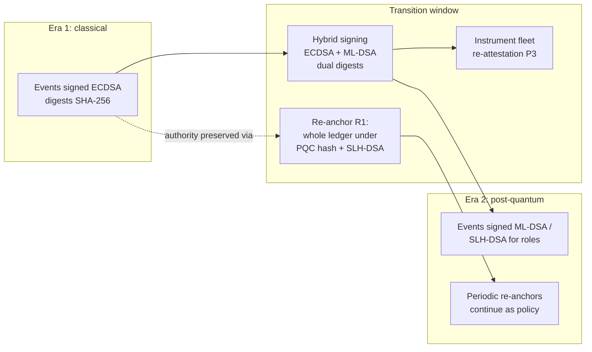

# Post-Quantum Considerations for Long-Lived Infrastructure

## What This Chapter Covers

A solar module warranted in 2026 will still be generating claims-relevant evidence
in 2051. Every signature, digest, and anchor defending that evidence was made with
algorithms chosen in the 2020s — and the working assumption of this chapter is that
some of those algorithms will not survive the asset. The chapter explains why the
quantum threat bears on asset-identity systems *differently and more severely* than
on the financial blockchain systems that dominate the post-quantum discussion;
derives the design consequences (which turn out to be schema and governance
consequences more than algorithm choices); and presents migration-ready patterns
for records that must remain verifiable across at least one, and plausibly two,
cryptographic transitions. I treat migration mechanics at the depth this system
needs and no further; readers migrating general enterprise infrastructure will find
the systematic treatment in my earlier book on post-quantum migration, which this
chapter deliberately cross-references rather than duplicates.

## 9.1 The Asymmetry: Why Thirty Years Changes the Question

The standard quantum-risk framing for blockchains is financial: a
cryptographically relevant quantum computer (CRQC) running Shor's algorithm breaks
the elliptic-curve signatures guarding funds; the defense is to move funds to
post-quantum addresses before the attacker arrives. The framing is *transactional*
— protect the next transaction — and it quietly assumes the past does not matter:
old payment signatures have no residual value once funds move.

Asset identity inverts this. The value of the system *is* its past: a warranty
adjudication in 2049 turns on the verifiability of a commissioning signature made
in 2027. Three consequences follow, and they reorganize the whole analysis:

1. **Retrospective verification is the workload.** It is not enough that new
   events use safe algorithms; twenty-year-old signatures must still *mean
   something* to a verifier who knows the signing algorithm has since fallen. An
   ECDSA signature verified in 2049 proves nothing by itself — anyone with a CRQC
   could have forged it in 2047. The record's authority must rest on something
   other than the enduring strength of its original algorithm.
2. **"Harvest now, decrypt later" becomes "wait, then rewrite."** The financial
   attacker steals keys to spend. The asset-identity attacker forges *history*:
   with a broken signature scheme, A2 or A3 of Table 8.1 fabricates a plausible
   2020s-vintage maintenance record, or a counterfeiter mints "old" registrations
   for freshly made units. The prize is not a hot wallet but the entire evidential
   authority of the early ledger.
3. **The transition is plural.** Over thirty years the system should expect not
   one migration (classical → post-quantum) but ongoing algorithm lifecycle —
   parameter upgrades, deprecations of first-generation PQC candidates, hash
   migrations. The design target is not "add Dilithium" but *algorithm agility as
   a permanent property of the schema*.

The saving observation — and the chapter's central design resource — is that the
architecture already contains the answer in embryonic form. **Hash functions and
Merkle structures degrade far more gracefully under quantum attack than signatures
do** (Grover's algorithm halves effective hash security; Shor's demolishes
elliptic-curve and RSA signatures outright). A record whose integrity rests on its
membership in an *anchored hash structure* — rather than solely on its author's
signature — inherits the sturdier failure mode. The migration patterns of
Section 9.4 are, at bottom, ways of transferring evidential weight from signatures
(fragile) onto anchored structure (robust) *before* the signatures fail.

**Table 9.1** Quantum exposure by cryptographic component of the Part II
architecture.

| Component | Algorithm class (2026 baseline) | Quantum threat | Failure consequence | Urgency |
|---|---|---|---|---|
| Event/registrar signatures | ECDSA / EdDSA | Broken by Shor (CRQC) | Retrospective forgery of history | High — governs new events now |
| Instrument secure elements | ECC in silicon | Broken by Shor | Fake attestations; F6 amplified | High, but hardware-replacement-paced |
| Payload / envelope digests | SHA-256 class | Grover: security halved | Collision-forged payloads (theoretical at 128-bit residual) | Moderate — parameter upsizing |
| Merkle batching & anchors | Hash-based | Same as digests | Anchor forgery impractical at upsized parameters | Moderate |
| Consortium BFT transport | TLS-era KEX | Shor breaks recorded sessions | Confidentiality of replicated data (Ch. 10 overlap) | Moderate |
| Validity-rollup proof systems (§7.4) | Varies by construction | Pairing-based: broken; hash-based (STARK-class): robust | Batch-execution assurance | Choose hash-based from the start |
| Passive structural binding (Ch. 6) | **None — physics** | **None** | — | The quiet advantage |

The last row deserves its emphasis. The defect map is not a cryptographic object;
a CRQC does not help an attacker manufacture a matching semiconductor. In the
post-quantum era the *physical* binding becomes the system's most durable layer —
a reversal of the intuition that hardware is the weak link — and Section 9.5
exploits this.

## 9.2 Timeline Reasoning Without Prophecy

No responsible engineering argument should depend on a CRQC arrival date. The
discipline used here is Mosca's inequality: act now if
\(x + y > z\), where \(x\) is how long the data must remain secure, \(y\) is how
long migration takes, and \(z\) is time until the threat arrives. For this system:
\(x\) is 25–30 years by construction (the asset life); \(y\) is realistically
5–10 years (consortium governance, instrument hardware refresh cycles, schema
migration across hundreds of participants); and any \(z\) shorter than ~35 years
therefore demands action at design time. Every serious \(z\) estimate — including
skeptical ones — falls inside that window. The conclusion is not that a CRQC is
imminent; it is that *for this system the question of imminence is irrelevant*:
the inequality binds under any defensible forecast, and the standardization
milestones already passed (NIST's 2024 publication of ML-KEM, ML-DSA, and SLH-DSA,
with migration guidance following) remove the "nothing to migrate to" excuse.

## 9.3 What to Sign With: Algorithm Selection Under a Thirty-Year Constraint

Selection criteria differ from enterprise IT in two respects: signature *size*
lands on a replicated ledger and in secure elements with decade-long hardware
cycles, and algorithm *diversity* matters more than optimality because the system
must survive the failure of any single family.

- **ML-DSA (lattice-based, formerly Dilithium)** as the workhorse event-signature
  algorithm: performant, standardized, implementable in next-generation secure
  elements. Signatures of ~2–4 kB inflate the 0.9 kB envelope of Section 7.6
  several-fold — Table 7.4's margins absorb this without strain, one more dividend
  of designing for megabytes, not gigabytes.
- **SLH-DSA (hash-based, formerly SPHINCS+)** for the *registrar and governance
  roles*: slower and bulkier (~8–50 kB), but resting on hash assumptions only —
  the most conservative available foundation for the signatures whose forgery
  would be catastrophic (F2/F10 at scale). Registrar events are batch-paced
  (Section 7.2), so the size cost lands where the architecture is most tolerant.
- **Hybrid classical+PQC signing** for the transition decade: events co-signed
  with ECDSA and ML-DSA, valid if both verify — protecting against both an early
  CRQC and an early cryptanalysis of young lattice assumptions. The envelope of
  Section 5.4 accommodates this as a corroboration-class variant with no schema
  surgery, which was not luck but Chapter 5's extensibility principle doing its
  job.
- **Anchor targets:** the consortium controls its own algorithms but not the
  public chains'; anchoring to two independent chains (Section 4.4) now also
  diversifies *their* migration risk, and the anchoring contract's replaceable
  target list is the escape hatch if a chain migrates badly.

## 9.4 Migration Patterns: Keeping Old Evidence Meaningful

The heart of the chapter. Four patterns, composable, in ascending order of
machinery:

**P1 — Cryptographic re-anchoring (the workhorse).** Before algorithm A weakens,
compute a fresh commitment over the *entire existing ledger* using successor
algorithm B, and anchor it (consortium event + public anchors). The old records'
authority now rests on a checkable fact: they were fixed in an anchored structure
*at a time when A was still strong* — forging them later requires having beaten A
before the re-anchor, a bounded and dated claim rather than an eternal one.
Re-anchoring is cheap (one traversal, one event), repeatable per transition, and
retroactively protects records whose authors are long gone. It is the direct
implementation of Section 9.1's principle: evidential weight moves from signature
to anchored structure.

**P2 — Timestamped supersession of role keys.** Every role accreditation
(Section 8.5, F9) carries algorithm metadata and validity intervals; migration is
a governed succession event ("registrar M's ECDSA accreditation ends at T; ML-DSA
accreditation begins"), so verifiers evaluate old signatures *against the
algorithm policy in force at signing time*, with the policy history itself on the
ledger. Verification becomes time-contextual — the 2049 adjudicator checks that
the 2027 signature was valid *by 2027 rules* and that the record predates the 2032
re-anchor. Appendix A sketches the verifier logic.

**P3 — Re-attestation of living bindings.** Signatures can be re-anchored;
*hardware* cannot. Secure elements with ECC roots (Table 9.1, row 2) must be
re-attested under PQC instruments as fleets refresh — an `EVT_REENROLL`-class
event linking the old device identity to a new attestation, at the natural
hardware-replacement cadence of inverters (10–15 years), which conveniently fits
inside any plausible \(z\). Passive assets need no P3: their binding is physics
(Table 9.1's last row), and only the *records about them* need P1/P2.

**P4 — Digest upsizing with dual-commitment.** For the Grover-class erosion of
hash security: new events commit payload digests under both the incumbent and the
successor hash during a transition window, and P1 re-anchors old single-digest
records under the new hash wholesale. Mechanically trivial; the discipline is
having the `payload_digest` field versioned from day one, which Section 5.4 did.

**Figure 9.1** The migration timeline as the schema sees it: overlapping algorithm
validity intervals, periodic re-anchors, and hardware re-attestation waves. A
verifier at any point evaluates each record against the policy in force at its
creation, plus the re-anchor chain since.

## 9.5 The Post-Quantum Dividend of Physical Binding

Section 9.1 promised the exploitation of Table 9.1's last row. In the post-quantum
scenario the attacker's best target is old *records*; the defender's best
countermeasure turns out to be old *matter*. A forged 2020s-vintage registration —
minted retroactively with a broken signature scheme — must still name a template,
and the template must match a physical unit the fraud intends to pass off. But the
unit in hand is measurable *now*, under current instruments and challenge
protocols; its structural age, degradation morphology, and evolution history
(R5 plausibility, Section 6.4) must all cohere with the forged paper trail. The
fraud must therefore fabricate not just bytes but a *physically consistent
history* — the one thing quantum computation does not provide. Structural binding
thus acts as a cross-check that survives total signature failure, and the
verification workflow of Section 6.6 needs only one post-quantum amendment: in
Step 1, records predating the relevant re-anchor are trusted via the anchor chain
(P1), not via their native signatures; in Step 3, physical verification carries
correspondingly more of the decision weight for disputed old records.

## 9.6 Governance of a Migration Nobody Owns

The hard part is not cryptographic. A migration across a consortium of
manufacturers, operators, insurers, and instrument vendors — several of whom will
not exist by the time it completes — needs: a standing **algorithm policy register
on the ledger itself** (which algorithms are approved for which roles, with sunset
dates — so P2's time-contextual verification has an authoritative source); a
**re-anchor cadence written into the consortium agreement** rather than summoned
ad hoc when panic arrives; **procurement language** obliging instrument vendors to
attestation-migration support (the P3 wave fails if 2030s secure elements cannot
be re-attested); and a designated **migration authority quorum** — because "the
consortium will decide when the time comes" is how deadlines die. None of this is
speculative process design; it is the same governance machinery Chapters 8 and 10
already require, pointed at one more slow-moving risk. The general playbook —
inventories, prioritization, hybrid periods, vendor management — is the subject of
my migration book; what is specific here, and what this chapter has supplied, is
the evidential twist: *this* system must migrate in a way that keeps twenty-year-
old signatures meaningful, and P1–P4 are that requirement made mechanism.

## 9.7 Chapter Summary

Financial blockchains fear the quantum future for their next transaction; asset
ledgers must fear it for their past, because a broken signature scheme lets
adversaries rewrite history that adjudications decades hence will depend on.
Mosca's inequality binds for any defensible CRQC forecast once \(x\) is an asset
lifetime, so migration is a design-time requirement, not a watching brief. The
architecture's response: diversified PQC selection (lattice workhorse, hash-based
conservatism for registrar and governance roles, hybrid signing through the
transition), and four migration patterns — re-anchoring that shifts evidential
weight from fragile signatures onto robust anchored hash structure, time-contextual
key supersession, hardware re-attestation on natural refresh cycles, and versioned
digest upsizing — all of which land as schema fields and governance clauses rather
than heroics, because Chapters 4 and 5 left the sockets in place. The physical
binding layer, immune to Shor by virtue of being made of silicon defects rather
than mathematics, becomes the system's most durable evidence in exactly the
scenario where its cryptography is weakest. What cryptographic longevity is to
time, privacy and regulation are to jurisdiction — the other long-horizon
interface the system must survive, and the subject of Chapter 10.

## References and Further Reading

1. Shor, P. W. "Polynomial-Time Algorithms for Prime Factorization and Discrete
   Logarithms on a Quantum Computer." *SIAM Journal on Computing* 26, no. 5
   (1997): 1484–1509.
2. Grover, L. K. "A Fast Quantum Mechanical Algorithm for Database Search." In
   *Proceedings of the 28th Annual ACM Symposium on Theory of Computing
   (STOC '96)*, 212–219.
3. Mosca, M. "Cybersecurity in an Era with Quantum Computers: Will We Be Ready?"
   *IEEE Security & Privacy* 16, no. 5 (2018): 38–41.
4. National Institute of Standards and Technology. *FIPS 203: Module-Lattice-Based
   Key-Encapsulation Mechanism (ML-KEM); FIPS 204: Module-Lattice-Based Digital
   Signature Algorithm (ML-DSA); FIPS 205: Stateless Hash-Based Digital Signature
   Algorithm (SLH-DSA).* Gaithersburg, MD: NIST, 2024.
5. Bernstein, D. J., and T. Lange. "Post-Quantum Cryptography." *Nature* 549
   (2017): 188–194.
6. Aggarwal, D., G. Brennen, T. Lee, M. Santha, and M. Tomamichel. "Quantum
   Attacks on Bitcoin, and How to Protect Against Them." *Ledger* 3 (2018).
7. [AUTHOR'S POST-QUANTUM MIGRATION TITLE — CITATION TO BE SUPPLIED.]

\newpage
