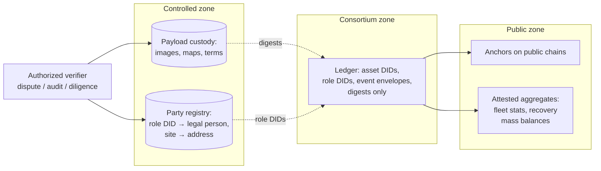

# Privacy, Data Governance, and Regulatory Interfaces

## What This Chapter Covers

An asset ledger sounds like it is about objects, but objects trail people and
enterprises: a rooftop module's history reveals a household's address and
consumption rhythm; a plant's maintenance stream reveals an operator's cost
structure; a manufacturer's registration flow reveals production volumes that move
markets. This chapter designs the privacy layer the architecture owes those
parties, allocates data-governance authority across a record no one owns, and maps
the regulatory interfaces — grid codes, certificate schemes, product-passport and
traceability regulation, and data-protection law — that a deployment must meet in
the EU, the US, and India. The treatment is an engineer's: enough law to derive
requirements, no more. Nothing here is legal advice, and counsel should review any
deployment against the current text of the instruments cited.

## 10.1 What the Ledger Knows, and About Whom

Privacy analysis starts with an inventory, not an ideology. Table 10.1 classifies
the data classes of Part II by whom they expose and how.

**Table 10.1** Exposure inventory of the asset record.

| Data class | Directly reveals | Indirectly reveals (inference) | Sensitive party |
|---|---|---|---|
| Registration + template digests | Production existence, batch cadence | Factory volumes, yields, line count | Manufacturer (commercial) |
| Custody / ownership events | Counterparties, transfer times | Portfolio composition, deal flow | Owners, funds (commercial) |
| Install / commissioning events | Site linkage of each unit | **Household identity for rooftop DERs** | Individuals (GDPR-class) |
| Condition records | Degradation, faults | O&M quality, insurer loss picture | Operators, insurers |
| Maintenance stream | Interventions, parts | Cost structure, staffing, failure rates | O&M contractors |
| Instrument calibration chain | Lab relationships | Little | Low |
| Anchors (public chains) | Nothing (digests) | Activity *volume* via anchor cadence | Consortium (minor) |

Two entries force design decisions. First, the rooftop case: a module DID whose
installation event carries a street-level site reference is *personal data* the
moment the site is a dwelling — under the GDPR, plausibly under several US state
statutes, and under India's DPDP Act. Second, the inference column: even with
payloads off-chain, *event metadata alone* — types, timestamps, counterparty
patterns — supports commercial inference, and consortium validators see all of it.
"The payloads are off-chain" is the beginning of a privacy design, not the end of
one.

## 10.2 The Structural Conflict, and the Design That Resolves It

The conflict is genuine: Chapter 5 argued that evidential value grows with
completeness and permanence; privacy law and commercial confidentiality demand
minimization and, in the GDPR's Articles 16–17, rectification and erasure. An
immutable ledger of personal data is a compliance contradiction. The resolution is
an architecture rule stated once and enforced everywhere:

**Identify assets on-chain; identify parties and places off-chain, by reference,
under access control.**

Concretely, four mechanisms:

1. **Pseudonymous role DIDs.** Events name *role identities* (owner-of-record
   R-4471, site S-2209), not legal persons or street addresses. The mapping from
   role DIDs to legal identities lives in an off-chain *party registry* operated
   under conventional data-protection controls, disclosable under defined triggers
   (dispute, audit, regulatory demand). The ledger's evidential statement — "the
   then-owner co-signed" — survives; the *who* is resolvable only with
   authorization. Erasure requests then bite where the personal data lives: the
   registry unlinks, the chain retains only a pseudonym that no longer resolves.
   This is the standard, defensible reading of GDPR applied to DLT — with the
   honest caveat that European guidance has treated on-chain *anything* linkable
   as in-scope, which is why mechanism 2 exists.
2. **Commit-and-disclose payloads.** Already built (Section 4.2): on-chain digests,
   off-chain content. Privacy inherits the structure — condition images, site
   coordinates, price terms all live in access-controlled custody, provable when
   disclosed, invisible until then. Selective disclosure at *field* granularity
   uses the verifiable-credential machinery of Section 3.5: a seller proves
   "commissioned in 2027 by an accredited EPC" without revealing which EPC, until
   diligence escalates.
3. **Metadata damping.** Against the inference column: batch submission
   (Section 7.2) already blurs event timing; role-DID rotation per transaction
   class limits linkability across a portfolio; and consortium node operators sign
   data-use covenants — a contractual control, acknowledged as such, because
   validators must see envelopes to validate. Deployments whose threat model
   cannot tolerate even that (e.g., a manufacturer consortium of direct
   competitors) can add zero-knowledge envelope proofs — proving schema and
   corroboration compliance without revealing event type — at real cost in
   complexity and PQ-fragility (Table 9.1); the pilot of Chapter 11 judged the
   covenant sufficient and says why.
4. **Aggregate before publishing.** Everything the public needs — fleet
   statistics, recycling mass balances, certificate registries — is publishable as
   attested aggregates with inclusion proofs, never as per-asset streams.

**Figure 10.1** The privacy architecture: three zones with one-way evidential
references. Public verifiability flows left; identity resolution requires
authorization flowing right.

## 10.3 Data Governance: Authority over a Record Nobody Owns

Governance questions arrive in a fixed set, and a consortium that has not answered
them in writing before go-live will answer them in litigation after. The
consortium agreement — the legal instrument behind the validator set — must
allocate, at minimum:

**Table 10.2** The governance decision table (the pilot's concrete allocations are
in Section 11.6).

| Decision | Holder | Constraint from the architecture |
|---|---|---|
| Registrar accreditation / revocation | Accreditation committee, adverse-interest quorum | Revocations are ledger events (D5, §8.6) |
| Schema and payload versioning | Technical committee | Old versions verifiable forever (§5.1, §9.4) |
| Contract upgrades | Supermajority + timelock, on-ledger | §2.5's trusted-administrator caveat |
| Algorithm policy & re-anchor cadence | Migration authority quorum | §9.6's register |
| Party-registry disclosure triggers | Defined in agreement; adjudicator for contested cases | §10.2's mechanism 1 |
| Custody policy & retrievability SLAs | Operations committee | §4.2's proof-of-retrievability regime |
| Validator admission / expulsion | Supermajority, on-ledger | Committee sizing of §7.5 |
| Dispute escalation | `EVT_DISPUTE` → named arbitral rules | §5.3's event pair |

One governance principle deserves prose because it is the chapter's counterpart to
Chapter 8's "attacks migrate downward": **authority migrates toward whoever holds
the keys people actually use.** If the party registry, the custody layer, or the
analytics platform is operated by a single commercial vendor for convenience, that
vendor becomes the de facto governor of the system regardless of what the
consortium agreement says. The architecture's decentralization is only as real as
the *operational* decentralization of its off-chain components — a lesson several
first-generation industry consortia learned by becoming, in effect, one database
vendor with a ceremonial committee.

## 10.4 Regulatory Interfaces

The system does not exist beside regulation; increasingly, regulation is the
demand curve for exactly the records this book builds. Four interface families,
with the engineering requirement each imposes.

**Product-passport and traceability regulation.** The EU Battery Regulation
(2023/1542) requires, from 2027, a per-battery digital passport carrying identity,
composition, carbon footprint, and lifecycle data for EV and industrial batteries
above 2 kWh — mandatory, per-unit, lifecycle-long records with defined access
tiers: structurally, a subset of Chapter 5. The Ecodesign for Sustainable Products
Regulation (2024/1781) extends digital product passports across product categories
by delegated acts, with PV modules repeatedly named among the priority candidates.
The engineering requirement: the event schema must *project* onto passport data
models — a read-side mapping layer, not a redesign — and the access-tier
definitions (public / authorities / actors-with-legitimate-interest) map cleanly
onto Figure 10.1's three zones. Chapter 12 returns to passports as the
interoperability driver; Chapter 14 flags the standardization gap that a book can
name but not close.

**Certificate and attribute schemes.** Renewable energy certificates (RECs, EU
guarantees of origin, India's REC mechanism) certify *energy*, not equipment — but
certificate fraud frequently launders through equipment ambiguity (double-counted
or misdescribed generation assets). An asset ledger interfaces as the *equipment
truth layer* under certificate registries: the generation device's identity,
capacity, and commissioning date become verifiable inputs rather than
self-declarations. The requirement: read-side attestation APIs for certificate
registries, not new event types.

**Grid codes and interconnection.** DER interconnection regimes (IEEE 1547 in the
US and its state implementations; EU network codes under regulation 2016/631;
India's CEA technical standards) require certified equipment characteristics at
the point of connection. Today this is paperwork; a DSO consuming Chapter 6 Step-1
verification instead of PDF certificates is the near-term institutional adopter —
and, symmetrically, the schema must carry the certification VCs (type approvals,
inverter grid-support settings) those codes reference.

**Data-protection law across the three jurisdictions.** The GDPR analysis is
Section 10.2's; the US adds a state patchwork (California's CCPA/CPRA the leading
edge) generally less demanding for this system because commercial B2B data
dominates; India's DPDP Act 2023 brings GDPR-family obligations with its own
consent and cross-border rules. The single engineering consequence worth stating
here: **jurisdictional data residency argues for the federated ledger topology of
Section 7.4** — a national consortium ledger anchors globally, but personal-data-
adjacent payloads and party registries never leave the jurisdiction; mutual
anchoring gives cross-border verifiability without cross-border data flow. This is
the second time federation has fallen out of a non-scalability requirement, which
is usually what it looks like when an architecture decision is right.

**Table 10.3** Regulatory interface summary across the three focus jurisdictions.
Entries are engineering postures, not legal conclusions.

| Interface | EU | US | India |
|---|---|---|---|
| Product passport | Battery Reg. 2023/1542 (2027); ESPR delegated acts — PV a named candidate | No federal analog; procurement traceability rules (e.g., UFLPA supply-chain evidence) create adjacent demand | E-waste rules (2022) EPR registration; passport regime plausible via BIS/MoEFCC path |
| Certificates | Guarantees of origin (Dir. 2018/2001) | State RECs / tracking systems (WREGIS, PJM-GATS…) | REC mechanism under CERC |
| Grid connection | Network code RfG 2016/631 | IEEE 1547 + state rules | CEA standards; CEA/state DISCOM approvals |
| Data protection | GDPR (registry + payload zone design) | State patchwork; B2B-dominant exposure | DPDP Act 2023; data-residency posture |

## 10.5 Chapter Summary

The ledger records objects, but its shadows fall on people and enterprises, so the
architecture separates three zones — public anchors and aggregates, a consortium
envelope layer naming only asset and role DIDs, and controlled custody where
payloads and the party registry live — with evidential references flowing one way
and identity resolution gated the other. Erasure and rectification obligations
land in the registry and custody zones, where they are satisfiable, not on the
chain, where they are not. Governance is a written allocation of the eight
recurring authorities, with the warning that operational centralization of
off-chain components quietly repeals whatever the consortium agreement proclaims.
Regulation, far from being the compliance tax on this architecture, is becoming
its demand curve: battery passports and the ESPR are mandating per-unit lifecycle
records in law, certificate schemes need an equipment truth layer, grid codes are
paperwork awaiting verifiable substitution, and data-protection regimes in all
three focus jurisdictions reward the federated topology the scalability analysis
already chose. The framework is now complete in the abstract; Part IV builds it in
the concrete, starting with a pilot plant.

## References and Further Reading

1. Regulation (EU) 2016/679 (General Data Protection Regulation). *Official
   Journal of the European Union*, 2016.
2. European Parliament. *Blockchain and the General Data Protection Regulation:
   Can Distributed Ledgers Be Squared with European Data Protection Law?* Study
   PE 634.445, European Parliamentary Research Service, 2019.
3. Regulation (EU) 2023/1542 concerning batteries and waste batteries. *Official
   Journal of the European Union*, 2023.
4. Regulation (EU) 2024/1781 establishing a framework for ecodesign requirements
   for sustainable products (ESPR). *Official Journal of the European Union*,
   2024.
5. Directive (EU) 2018/2001 on the promotion of the use of energy from renewable
   sources (guarantees of origin, Art. 19). *Official Journal of the European
   Union*, 2018.
6. IEEE Standards Association. *IEEE 1547-2018: Standard for Interconnection and
   Interoperability of Distributed Energy Resources.* IEEE, 2018.
7. Government of India. *Digital Personal Data Protection Act, 2023.* Gazette of
   India, 2023.
8. Finck, M. *Blockchain Regulation and Governance in Europe.* Cambridge:
   Cambridge University Press, 2018.

\newpage
