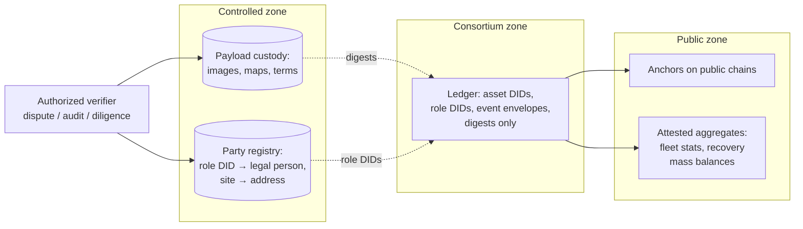

# Privacy, Data Governance, and Regulatory Interfaces

## What This Chapter Covers

An asset ledger sounds like it is about objects, but objects trail people and
enterprises: a rooftop module's history reveals a household's address and
consumption rhythm; a plant's maintenance stream reveals an operator's cost
structure; a manufacturer's registration flow reveals production volumes that move
markets. This chapter designs the privacy layer the architecture owes those
parties — an exposure inventory, the three-zone design with its crossing
rules, four operating mechanisms including a worked selective-disclosure
bundle, and the honest reasoning behind deferring zero-knowledge machinery;
allocates data-governance authority across a record no one owns, with the
composition rules, clocks, and sanction ladders a year of pilot governance
taught; maps
the regulatory interfaces — product passports, supply-chain integrity
regimes, certificate schemes, grid codes, and data-protection law — that a
deployment must meet in
the EU, the US, and India, including the trajectory in which regulators
themselves become verifiers; and closes with the consortium agreement,
annotated clause by clause against the mechanisms that enforce it. The
treatment is an engineer's: enough law to derive
requirements, no more. Nothing here is legal advice, and counsel should review any
deployment against the current text of the instruments cited.

## 10.1 What the Ledger Knows, and About Whom

Privacy analysis starts with an inventory, not an ideology — and the
inventory must be honest about *inference*, not merely storage, because
modern privacy failures are mostly derivations from data nobody thought
sensitive. Table 10.1 classifies
the data classes of Part II by whom they expose and how, with the
indirect column doing the work naive audits skip.

**Table 10.1** Exposure inventory of the asset record.

| Data class | Directly reveals | Indirectly reveals (inference) | Sensitive party |
|---|---|---|---|
| Registration + template digests | Production existence, batch cadence | Factory volumes, yields, line count | Manufacturer (commercial) |
| Custody / ownership events | Counterparties, transfer times | Portfolio composition, deal flow | Owners, funds (commercial) |
| Install / commissioning events | Site linkage of each unit | **Household identity for rooftop DERs** | Individuals (GDPR-class) |
| Condition records | Degradation, faults | O&M quality, insurer loss picture | Operators, insurers |
| Maintenance stream | Interventions, parts | Cost structure, staffing, failure rates | O&M contractors |
| Instrument calibration chain | Lab relationships | Little | Low |
| Anchors (public chains) | Nothing (digests) | Activity *volume* via anchor cadence | Consortium (minor) |

Two rows earn their "low" ratings by design rather than by nature and are
worth defending once: the calibration chain exposes little because
instrument relationships are already public through accreditation
registries — the ledger adds timestamps to facts the laboratories
advertise; and the anchors expose only cadence because everything beneath
them is double-blinded by the salted-commitment structure Section 10.2's
second mechanism specifies. Ratings like these should be re-derived, not
inherited, whenever the schema grows a new event class — the inventory is
a living document with an owner (the governance table below assigns one),
not a design-time appendix.

Two entries force design decisions. First, the rooftop case: a module DID whose
installation event carries a street-level site reference is *personal data* the
moment the site is a dwelling — under the GDPR, plausibly under several US state
statutes, and under India's DPDP Act. Second, the inference column: even with
payloads off-chain, *event metadata alone* — types, timestamps, counterparty
patterns — supports commercial inference, and consortium validators see all of it.
"The payloads are off-chain" is the beginning of a privacy design, not the end of
one.

The rooftop case deserves its full unpacking because it is where this
architecture first touches individuals rather than enterprises. A
residential system's event stream — installation date and location,
inspection cadence, fault events, an ownership transfer at a house sale —
composes into a household dossier of real sensitivity: occupancy patterns
inferable from maintenance scheduling, creditworthiness signals from the
system's age and condition, and the address itself. Under the GDPR the
analysis is unambiguous once the data relates to an identifiable natural
person: lawful basis must be established (legitimate interest for warranty
administration will carry much of it; consent is the wrong instrument for
data that must outlive the consenting relationship), purpose limitation
constrains reuse, and the data-subject rights — access, rectification,
erasure — must be *operable*. The architecture's answer, developed in the
next section, is to ensure those rights bite on mutable off-chain stores
while the immutable layer holds nothing about the person at all. What must
not happen is the lazy design in which "the blockchain made me unable to
comply" is offered as a defense — regulators have already rejected that
posture in published guidance, and they are right: the immutability was a
design choice, and so was what got immutabilized.

The household's experience of all this machinery deserves a design note,
because privacy delivered through interfaces nobody can use is privacy on
paper. The homeowner's touchpoints are few and should stay few: at
installation, a plain-language notice that the *equipment* carries a
verifiable service record (the analogy to a vehicle's service book
travels well), that the household's identity lives with the warranty
administrator and not in the record, and that the record transfers with
the house — a selling point, not a disclosure burden, since a documented
system appraises better. Rights requests route through the same
administrator with statutory deadlines; no homeowner ever hears the word
"DID." The residential segment is where this architecture could most
easily acquire a surveillance reputation it does not deserve, and the
defense is interface austerity: the household sees a better warranty and
a cleaner resale, and the machinery stays in the walls where machinery
belongs.

The inference threat deserves equal concreteness on the commercial side.
A validator — or any party with envelope visibility — observing that
registrar M's batch cadence dropped 40% quarter-over-quarter has learned
M's production volumes ahead of any market disclosure; watching transfer
events cluster around role DID R-4471 reveals a fund's acquisition spree
during its quiet period; correlating inspection-event bursts with
catastrophe footprints prices an insurer's book exposure. None of this
requires payload access, and all of it has market value — which is why
metadata protection is a design requirement with named mechanisms
(Section 10.2's third instrument) rather than a nice-to-have, and why the
data-use covenants that validators sign are contracts with audit rights
and teeth, not codes of conduct.

Reading Table 10.1 as a whole, before the mechanisms: the exposures divide
into a *personal* cluster (one row, the rooftop case, small in data volume
and strictest in law) and a *commercial* cluster (every other row, vast in
volume and governed by contract more than statute) — and the two clusters
want opposite defaults. Personal data wants minimization, deletion paths,
and rights machinery; commercial data wants controlled sharing, because
its value to the system *is* its availability to counterparties under
terms. A single "privacy" posture would serve one cluster and betray the
other; the three-zone design below is, at bottom, the machinery for
running both postures simultaneously without either leaking into the
other's territory.

## 10.2 The Structural Conflict, and the Design That Resolves It

The conflict is genuine: Chapter 5 argued that evidential value grows with
completeness and permanence; privacy law and commercial confidentiality demand
minimization and, in the GDPR's Articles 16–17, rectification and erasure. An
immutable ledger of personal data is a compliance contradiction. It is worth
pausing on why the contradiction cannot be argued away, because the
first-generation literature tried every escape. "Hashes aren't personal
data" fails where the hashed value is guessable or the hash is linkable to
other data — and an asset's event stream is nothing but linkable.
"Pseudonymous isn't personal" fails on the GDPR's own definition, which
counts data as personal wherever re-identification is reasonably likely by
anyone holding the keys — and someone must hold the party registry.
"Consent covers it" fails temporally: consent is withdrawable, and a
withdrawable basis cannot support an unerasable record. The only honest
resolution is architectural — put nothing on the immutable layer whose
erasure a person could ever lawfully demand — and that is
an architecture rule stated once and enforced everywhere:

**Identify assets on-chain; identify parties and places off-chain, by reference,
under access control.**

The rule also settles, in passing, the public-permissionless question that
haunts this chapter's first-generation predecessors. Deployments that wrote
events to open public chains — even pseudonymized ones — created records
that are globally replicated, jurisdictionally everywhere, and erasable
nowhere: a compliance posture with no repair path, since no data-protection
authority accepts "the network won't let us" from the party that chose the
network. This book's public layer carries digests and aggregates only —
objects with no personal-data character under any current guidance — while
everything with a data subject stays in layers where the law's remedies
physically work. The design was chosen for evidential reasons in Part II;
that it is also the only defensible privacy posture is the kind of
convergence that suggests the layering is correct.

Concretely, four mechanisms:

1. **Pseudonymous role DIDs.** Events name *role identities* (owner-of-record
   R-4471, site S-2209), not legal persons or street addresses. The mapping from
   role DIDs to legal identities lives in an off-chain *party registry* operated
   under conventional data-protection controls, disclosable under defined triggers
   (dispute, audit, regulatory demand). The ledger's evidential statement — "the
   then-owner co-signed" — survives; the *who* is resolvable only with
   authorization. Erasure requests then bite where the personal data lives: the
   registry unlinks, the chain retains only a pseudonym that no longer resolves.
   This is the standard, defensible reading of GDPR applied to DLT — with the
   honest caveat that European guidance has treated on-chain *anything* linkable
   as in-scope, which is why mechanism 2 exists. Two engineering details make
   the pseudonymization real rather than nominal. Role DIDs are *scoped*:
   a household's site identity is distinct per relationship (the warranty
   registrar's S-2209 is not the insurer's S-8841), so no single external
   party's compromise unlinks the person across contexts. And the registry
   itself follows Chapter 4's custody disciplines — replicated under
   divergent interests, access-logged as events, threshold-escrowed against
   both loss and strategic "loss" — because a party registry that is
   merely one company's database re-creates the central-registry risk for
   exactly the most sensitive data in the system.
2. **Commit-and-disclose payloads.** Already built (Section 4.2): on-chain digests,
   off-chain content. Privacy inherits the structure — condition images, site
   coordinates, price terms all live in access-controlled custody, provable when
   disclosed, invisible until then. Selective disclosure at *field* granularity
   uses the verifiable-credential machinery of Section 3.5: a seller proves
   "commissioned in 2027 by an accredited EPC" without revealing which EPC, until
   diligence escalates. One implementation caution keeps the commitments
   honest as privacy objects: digests over low-entropy payloads are
   guessable — an adversary who suspects the commissioning date can hash
   candidate payloads until one matches — so payload serializations include
   per-payload random salts as a schema rule, converting every commitment
   into a hiding one. The salt travels with the payload in custody, costs
   thirty-two bytes, and closes the entire guessing-attack class; its
   absence is the kind of quiet defect that audits of commit-and-disclose
   systems should check first.

   The anchor's own privacy analysis, promised in Chapter 4, takes one
   sentence here: an anchor is a salted-digest chain head over envelope
   data that is itself digest-only — two hiding layers deep — and the only
   information a public observer extracts is anchor cadence and the
   governance-state digest's change frequency, both of which the
   consortium publishes deliberately in its transparency reporting anyway.
3. **Metadata damping.** Against the inference column: batch submission
   (Section 7.2) already blurs event timing; role-DID rotation per transaction
   class limits linkability across a portfolio; and consortium node operators sign
   data-use covenants — a contractual control, acknowledged as such, because
   validators must see envelopes to validate. Deployments whose threat model
   cannot tolerate even that (e.g., a manufacturer consortium of direct
   competitors) can add zero-knowledge envelope proofs — proving schema and
   corroboration compliance without revealing event type — at real cost in
   complexity and PQ-fragility (Table 9.1); the pilot of Chapter 11 judged the
   covenant sufficient and says why. The judgment's reasoning transfers:
   the ZK option protects against *validator* inference, but validators
   are contracted, audited, adverse-interest institutions — the covenant
   plus audit plus the reputational stake of Chapter 8's D5 already prices
   their misuse — while the ZK machinery would add a young cryptographic
   dependency (research item C1/C2's territory) to defend against the
   system's *most* accountable parties. Engineering effort against
   metadata inference is better spent where the accountability is weakest:
   the public layer (kept to digests and thresholds) and the read-replica
   ecosystem (whose operators sign the same covenants, and whose serving
   logs are themselves auditable). The calculus can flip — a federation
   whose validators include direct competitors with thin trust, or a
   jurisdiction whose law compels stronger technical guarantees — and the
   schema's envelope discipline keeps the ZK upgrade path open without
   requiring it.
4. **Aggregate before publishing.** Everything the public needs — fleet
   statistics, recycling mass balances, certificate registries — is publishable as
   attested aggregates with inclusion proofs, never as per-asset streams.
   Aggregation thresholds follow the disclosure-control practice statistics
   offices have refined for decades: no published cell small enough to
   re-identify a contributor, complementary-disclosure checks across
   releases, and — where the passport regulations demand *per-unit* public
   fields — a review of exactly which fields, because "public" in a
   regulation drafted for consumer transparency should not be implemented
   as "bulk-downloadable by data brokers" when a rate-limited, purpose-
   logged query interface satisfies the same legal text.

### 10.2.1 Rights Operations, Walked Through

The data-subject rights are compliance's sharp end, and each has a concrete
implementation worth one sentence more than a compliance matrix gives it.
*Access* (what do you hold about me?): the party registry resolves the
person's role and site DIDs; a scoped query assembles their events and
authorized payload inventory; the response includes — a nicety the
architecture makes cheap — proofs, so the individual can verify the answer
is complete against the public layer rather than taking the operator's
word. *Rectification*: factual corrections enter as superseding events
(the error remains, corrected, attributed — which the law permits and
evidence requires) while registry attributes (a name, an address) are
simply amended in place, off-chain. *Erasure*: the registry unlinks the
person from role DIDs where no overriding basis survives (warranty
administration typically survives; marketing enrichment does not), and
controlled-zone payloads containing personal data are deleted or redacted
per class policy — with the deletion itself logged as an event whose
payload digest proves *what* was deleted without retaining it, a trick
the commitment structure makes possible and auditors appreciate.
*Portability*: the record bundle of Section 3.5 *is* the portable format —
events, payloads the subject is entitled to, proofs — and it outlives the
operator, which exceeds the regulation's ambitions. *Objection and
automated decision-making*, the rights the sector will meet later than it
thinks: when insurers price on cohort analytics and monitors flag
households' systems automatically, the safeguards those provisions demand
— meaningful human review, explanation of the logic — should be designed
into the analytics consumers now, while the analytics are young. None of
these operations is exotic; all must be built as workflows with deadlines,
because rights that require engineering tickets are rights denied.

Breach handling completes the compliance machinery. The zones partition
the analysis: a public-layer "breach" is definitionally impossible (its
contents are designed for publication); a consortium-zone breach exposes
envelopes — commercially sensitive metadata, rarely personal data, so the
response is contractual notification and the D5 attribution hunt; a
controlled-zone breach is the serious case (payloads, party registry) and
triggers statutory notification clocks. The architecture's contributions
to the bad day: encryption at rest with escrowed keys bounds what a
storage compromise yields (Section 4.2.1); access logging as events gives
the forensic timeline the notification must contain; and the custody
replication means remediation never has to choose between investigating
a compromised store and keeping the evidence available.

### 10.2.2 Selective Disclosure, Worked

Because selective disclosure carries so much of the reconciliation between
evidence and confidentiality, one worked instance fixes the mechanics. A
seller lists a 2,000-module lot; a prospective buyer wants proof of factory
enrollment, commissioning date, and clean condition history; the seller
wants to reveal nothing else — not the plant, not the price history, not
the O&M contractor whose identity would locate the site. The seller's
broker assembles a *disclosure bundle*: for each unit, the registration and
commissioning envelopes with their inclusion proofs (public-layer
verifiable), the relevant VC fields disclosed selectively (issuer class
and date revealed; issuer identity blinded per the VC data model's
selective-disclosure mechanisms), condition-record *digests* with a signed
attestation from an accredited verifier that the payloads behind them
satisfy the buyer's stated policy (the verifier saw everything; the buyer
sees the verdict), and the site reference replaced by its climate-zone
class — sufficient for degradation modeling, insufficient for location.
The buyer's client checks every proof against public anchors and the
verifier's accreditation against the register; diligence escalation (a
real purchase) then unlocks fuller access under NDA through the
authorization machinery, with every access logged as an event. Note who
never appears in the exchange: the consortium, whose infrastructure
carried every proof without learning that a transaction was
contemplated — market activity leaves no wake in the shared layer, which
is a competitive-neutrality property the members will insist on the day
they realize it could be otherwise. The
pattern's general shape — *prove properties, not payloads; escalate
disclosure with commitment* — reappears in every market interface
Chapter 13 discusses, and it is the practical answer to the objection
that transparency architectures are incompatible with commercial
confidentiality. They are incompatible only when disclosure is designed
as all-or-nothing, and nothing in this stack requires that.

**Figure 10.1** The privacy architecture: three zones with one-way evidential
references. Public verifiability flows left; identity resolution requires
authorization flowing right.

Figure 10.1's zones deserve their crossing rules stated as law, since every
privacy failure is a crossing violation. Left-to-right (public toward
controlled) there are no restrictions — anyone may verify against anchors
and aggregates. Right-to-left, three rules: nothing crosses from the
controlled zone outward except digests, aggregates above threshold, and
authorized disclosures logged as events; nothing in the consortium zone
names a natural person or a street-level location, enforced at write time
by envelope validation (a submitter cannot accidentally put an address in
an envelope — there is no field for one); and every authorization that
opens controlled-zone access is time-bounded, purpose-stated, and itself
an auditable event, so the access log is part of the record the next
dispute can consult. The architecture's privacy guarantee is exactly the
conjunction of these rules with the custody disciplines beneath them — no
more, and, if the rules hold, no less.

## 10.3 Data Governance: Authority over a Record Nobody Owns

Governance questions arrive in a fixed set, and a consortium that has not answered
them in writing before go-live will answer them in litigation after — at
discovery prices, before an adjudicator with no reason to be generous. The set
is knowable in advance because it is generated by the architecture itself:
every mechanism Part II built has a dial, and every dial needs a hand —
who accredits, who versions, who upgrades, who discloses, who sanctions,
who pays. What follows is the complete dial inventory, the allocation
principles the pilot's operating year validated, and the treatment of the
one governance act (dispute resolution) where the system meets the courts.
The consortium agreement — the legal instrument behind the validator set —
must allocate, at minimum:

Who sits where is as consequential as who decides what, and three
composition rules travel with the table. Committees whose decisions
allocate *blame* (accreditation, audit findings, disclosure adjudication)
exclude parties in the affected supply chain — the pilot's accreditation
committee seats certifier, insurer, and university precisely because none
of them makes, installs, or operates modules. Committees whose decisions
allocate *cost* (fees, custody policy, schema-driven integration burdens)
require representation from the payers, including the smaller member
classes whose voices consortium politics otherwise discounts — an O&M seat
on the technical committee bought more field-realistic schema decisions
than any requirements workshop. And every committee publishes its
composition, calendar, and decision log to the membership — with the
decision log's digest riding the governance-state commitment into the
public anchors (Section 4.4), so even the *pace* of governance is
externally attestable. Boring rules, deliberately: governance drama is a
system failure, and the design goal is a committee calendar that would
put a journalist to sleep.

The transparency report, mentioned across three chapters, gets its
contents fixed here since governance owns it: quarterly, machine-readable
alongside the prose, containing validator liveness and SLA statistics,
anchoring cadence conformance, custody-challenge outcomes by store,
accreditation actions taken (grants, restrictions, revocations — parties
named, since accreditation is public by design), schema and algorithm
register changes, migration-coverage metrics (Section 9.7), aggregate
verification volumes and anomaly rates, and incident-class disclosures
per Section 8.7's norms. Nothing in the list is optional, because each
item is some relying party's due-diligence input — and the report's own
digest rides the governance state into the anchors, making the
consortium's self-description as tamper-evident as the records it keeps.

**Table 10.2** The governance decision table (the pilot's concrete allocations are
in Section 11.6).

| Decision | Holder | Constraint from the architecture |
|---|---|---|
| Registrar accreditation / revocation | Accreditation committee, adverse-interest quorum | Revocations are ledger events (D5, §8.6) |
| Schema and payload versioning | Technical committee | Old versions verifiable forever (§5.1, §9.4) |
| Contract upgrades | Supermajority + timelock, on-ledger | §2.5's trusted-administrator caveat |
| Algorithm policy & re-anchor cadence | Migration authority quorum | §9.7's register |
| Party-registry disclosure triggers | Defined in agreement; adjudicator for contested cases | §10.2's mechanism 1 |
| Custody policy & retrievability SLAs | Operations committee | §4.2's proof-of-retrievability regime |
| Validator admission / expulsion | Supermajority, on-ledger | Committee sizing of §7.5 |
| Dispute escalation | `EVT_DISPUTE` → named arbitral rules | §5.3's event pair |

One governance principle deserves prose because it is the chapter's counterpart to
Chapter 8's "attacks migrate downward": **authority migrates toward whoever holds
the keys people actually use.** If the party registry, the custody layer, or the
analytics platform is operated by a single commercial vendor for convenience, that
vendor becomes the de facto governor of the system regardless of what the
consortium agreement says. The architecture's decentralization is only as real as
the *operational* decentralization of its off-chain components — a lesson several
first-generation industry consortia learned by becoming, in effect, one database
vendor with a ceremonial committee.

Three further principles earn their place from the pilot's year of governed
operation (Section 11.6). **Sanctions need a ladder** — the point made for
registrars in Section 4.3.2 generalizes: every governed obligation
(custody SLAs, validator liveness, data-use covenants) needs intermediate
consequences between a reminder and expulsion, because committees do not
impose corporate death sentences and unenforceable rules teach contempt.
**Every authority needs a clock**: each decision row in Table 10.2
carries a response deadline (accreditation decisions in 60 days, emergency
revocations in 24 hours, schema proposals resolved within a quarter),
because the silent failure mode of consortium governance is not bad
decisions but unmade ones, and a deadline with a default outcome converts
stalling from a veto into a choice. **Observers before members**: seats
without votes — for regulators, for the certification bodies of adjacent
jurisdictions, for the standardization committees of Chapter 14 — cost the
consortium nothing, build the institutional familiarity that later
interfaces (Section 10.4) will need, and quietly discipline the members'
conduct in the way observed committees are always disciplined.

One legal question spans every row and should be settled in the agreement
rather than discovered in enforcement: *who is the controller of the
envelope layer?* The defensible analysis treats the consortium members as
joint controllers of the shared envelope data — each having determined
jointly the purposes and means — with an Article-26-style arrangement in
the agreement allocating the compliance duties (a designated contact
point for data subjects, the pilot used the certifier; response
obligations flowing to whichever member's role DIDs are implicated),
while each member remains sole controller of its own controlled-zone
holdings and custody stores act as processors under standard terms. The
allocation is not the only legally available one, but *an* allocation
made in writing beats the alternative — five regulators constructing five
different ones after a complaint — by every measure that matters.

The dispute-resolution row deserves its own paragraph because it is where
the ledger meets the law most directly. The `EVT_DISPUTE`/`EVT_RESOLVE`
pair (Section 5.3) gives disputes structure; the consortium agreement gives
them a forum — institutional arbitration for member-to-member disputes,
with the critical clause being *evidence stipulation*: parties agree in
advance that anchored ledger extracts, verified per the Chapter 6 workflow,
are admissible and presumptively authentic, subject to challenge only on
enumerated grounds (enrollment fraud, instrument compromise — the Table 8.3
residuals, in effect). The S4 rehearsal validated the clause's value: the
eleven-day resolution was possible because neither side spent weeks
contesting document authenticity. Non-member disputes — a homeowner's
warranty claim, a buyer outside the consortium — cannot be bound by the
agreement, so the architecture's contribution there is humbler and still
real: evidence that survives hostile scrutiny in whatever forum the
dispute lands.

## 10.4 Regulatory Interfaces

The system does not exist beside regulation; increasingly, regulation is the
demand curve for exactly the records this book builds. The section's method,
stated once: for each regulatory family, identify the *record* the law
requires, the *trust gap* between what the law demands and what
self-declaration delivers, and the *interface* — always read-side, never a
schema redesign — through which this architecture supplies the difference.
The method matters more than the instances, because the instances will
churn: delegated acts will land, thresholds will move, new jurisdictions
will legislate, and a deployment built to the method absorbs the churn as
mapping-layer maintenance. Five interface families, with the engineering
requirement each imposes.

**Product-passport and traceability regulation.** The EU Battery Regulation
(2023/1542) requires, from 2027, a per-battery digital passport carrying identity,
composition, carbon footprint, and lifecycle data for EV and industrial batteries
above 2 kWh — mandatory, per-unit, lifecycle-long records with defined access
tiers: structurally, a subset of Chapter 5. The Ecodesign for Sustainable Products
Regulation (2024/1781) extends digital product passports across product categories
by delegated acts, with PV modules repeatedly named among the priority candidates.
The engineering requirement: the event schema must *project* onto passport data
models — a read-side mapping layer, not a redesign — and the access-tier
definitions (public / authorities / actors-with-legitimate-interest) map cleanly
onto Figure 10.1's three zones. Chapter 12 returns to passports as the
interoperability driver; Chapter 14 flags the standardization gap that a book can
name but not close.

What the passport texts do *not* specify is where this architecture's
opportunity and its warning both live. The Battery Regulation mandates data
content, unique identifiers, and access tiers; it does not mandate binding
(nothing prevents a passport describing a battery it has never met),
independent attestation (self-declared fields satisfy the letter), or
institutional survivability (the "economic operator placing the product on
the market" hosts the passport — a vendor-cloud pattern Chapter 1 already
autopsied, softened only by data-continuity obligations on insolvency).
A compliance industry is currently being built to those minimal
specifications, and its products will be Chapter 1's documentary problem
wearing a QR code. The engineering posture this book recommends to any
manufacturer or consortium implementing passports: satisfy the regulation
with the projection layer, and build the projection *from* verifiable
events rather than *instead of* them — the marginal cost is small
(Section 13.5), and the passport becomes a window onto evidence rather
than a PDF with better packaging. The regulatory trajectory only
strengthens the case: supplementing acts continue to specify formats and
registries, member-state market-surveillance authorities will need audit
tools, and the first passport-fraud scandal — which the incentive
structure makes a matter of when — will move the political demand from
"records" to "verifiable records" faster than any white paper.

**Supply-chain integrity regimes** deserve their own entry beside the
passports, because their evidentiary demands arrive *now* and their pain
is Section 1.4.5's. The UFLPA's rebuttable presumption obliges importers
to trace polysilicon provenance through several tiers of suppliers; the
EU's forced-labour regulation and corporate due-diligence directives
generalize the pattern. The current evidence format — document packages
assembled per shipment, reviewed manually — maps directly onto this
architecture's composition references (Section 4.3): a module's
registration already references its cell batches, wafer lots, and material
certificates as digests, so an importer's evidence package becomes a
disclosure bundle (Section 10.2.2) — upstream VCs, composition chains, and
attestations, verifiable against anchors rather than against letterhead.
The honest caveat: the ledger proves the *documentary chain's* integrity,
not the upstream facts' truth — a supplier's false origin declaration
enters as a signed lie (garbage-in permanence, Section 1.5) — so the
architecture's contribution is to make the declarations attributable,
non-repudiable, and cross-checkable against volume reconciliation (D4),
which is precisely the standard the enforcement agencies' own guidance
gestures toward.

**ESG and financial-disclosure reporting** rides the passport family's
machinery and deserves its sentence of separation: the corporate
sustainability regimes (the EU's CSRD and its supply-chain cousins,
investor-driven frameworks elsewhere) increasingly require asset-level
substantiation of climate and circularity claims — installed capacity,
equipment provenance, end-of-life mass balances — that currently flows
through the same self-declared spreadsheets as everything else in
Chapter 1. The interface is the aggregation layer of Section 10.2: attested
fleet statistics with inclusion proofs, generated from the same events the
passports project from, giving auditors of sustainability reports the same
verifiability upgrade the market interfaces get. No new mechanism, one new
consumer — the pattern this section's method predicts.

**Certificate and attribute schemes.** Renewable energy certificates (RECs, EU
guarantees of origin, India's REC mechanism) certify *energy*, not equipment — but
certificate fraud frequently launders through equipment ambiguity (double-counted
or misdescribed generation assets). An asset ledger interfaces as the *equipment
truth layer* under certificate registries: the generation device's identity,
capacity, and commissioning date become verifiable inputs rather than
self-declarations. The requirement: read-side attestation APIs for certificate
registries, not new event types. The fraud patterns the truth layer closes
are worth naming, because certificate markets price integrity risk
explicitly: capacity overstatement (certificates issued against nameplate
that was never installed — closed by registration-and-commissioning
verification), zombie assets (issuance continuing after decommissioning —
closed by lifecycle state), double registration across schemes (one plant,
two registries — closed by the DID's uniqueness and cross-registry
attestation), and vintage misdescription (commissioning dates shaded to
qualify for support regimes — closed by anchored Class C commissioning).
As carbon-credit markets absorb their own integrity crises and reach for
the same remedies, the equipment truth layer generalizes: any instrument
whose value derives from a claim about a physical generator inherits the
verification interface.

**Grid codes and interconnection.** DER interconnection regimes (IEEE 1547 in the
US and its state implementations; EU network codes under regulation 2016/631;
India's CEA technical standards) require certified equipment characteristics at
the point of connection. Today this is paperwork; a DSO consuming Chapter 6 Step-1
verification instead of PDF certificates is the near-term institutional adopter —
and, symmetrically, the schema must carry the certification VCs (type approvals,
inverter grid-support settings) those codes reference. The deeper interface
is temporal: interconnection compliance is not a commissioning-day fact but
a service-life obligation — settings drift, firmware updates change
grid-support behavior, and today's DSO has essentially no visibility into
the fleet's *current* certified state. The config-change event class of
Section 12.4 is the answer waiting on the shelf: a DSO subscription to
attested configuration events for its service territory converts
compliance from a paperwork snapshot into a live, verifiable property —
and the privacy design matters exactly here, because the DSO needs
settings and certification status, not ownership histories or commercial
terms, and the three-zone architecture can give it precisely that slice
and nothing more.

**Data-protection law across the three jurisdictions.** The GDPR analysis is
Section 10.2's; the US adds a state patchwork (California's CCPA/CPRA the leading
edge) generally less demanding for this system because commercial B2B data
dominates; India's DPDP Act 2023 brings GDPR-family obligations with its own
consent and cross-border rules. The single engineering consequence worth stating
here: **jurisdictional data residency argues for the federated ledger topology of
Section 7.4** — a national consortium ledger anchors globally, but personal-data-
adjacent payloads and party registries never leave the jurisdiction; mutual
anchoring gives cross-border verifiability without cross-border data flow. This is
the second time federation has fallen out of a non-scalability requirement, which
is usually what it looks like when an architecture decision is right.

A cross-border verification keeps the abstractions honest: a German
insurer underwrites modules manufactured in India and installed in
Arizona. The Indian federation's ledger carries the factory enrollment;
the US federation's carries installation and operation; the insurer's
client walks both via the mutual-anchor traversal of Section 7.4 — and at
no point did personal or commercial payload data cross a border, because
the insurer consumed proofs and authorized disclosures scoped to its
legitimate interest, each from the jurisdiction where the data lawfully
lives. That is the entire cross-border story, and its brevity is the
design's achievement. The three regimes differ in ways the deployment
playbook should respect rather than average. The GDPR analysis is the strictest and therefore the
design driver: build to it and the others largely follow, with the
specific GDPR artifacts — records of processing, a data-protection impact
assessment for the rooftop segment, controller/processor allocations
across consortium members (the consortium itself is likely a joint
controllership for the envelope layer, an analysis counsel must own) —
prepared as templates the federation can localize. The US patchwork's
distinctive demand is not substantive but procedural: state-by-state
variation in breach notification and consumer-rights mechanics argues for
building the rights-response machinery (access, deletion, correction
workflows against the registry and custody layers) as configurable
plumbing rather than per-statute projects. India's DPDP adds two specifics
with architectural bite: consent-manager interfaces that the residential
segment's onboarding must accommodate, and cross-border transfer rules
whose whitelist mechanics remain in motion — one more argument for the
already-chosen posture of keeping personal-data-adjacent stores in-country
and letting only digests travel.

### 10.4.1 When the Regulator Becomes a Verifier

The interfaces above treat regulators as consumers of reports; the more
interesting trajectory, already visible at the edges, is regulators as
*verifiers* — running the Chapter 6 workflow themselves. The mechanics
require nothing new: a market-surveillance authority holding a suspect
shipment resolves DIDs, checks records against public anchors, and
escalates to sampled physical verification exactly as an insurer would;
a certificate registry auditing its generation fleet runs Step-1/2
continuously as a matter of course; a grid operator's interconnection
office consumes attested configuration state. What changes is
institutional, and the governance design anticipates it in three ways.
*Observer seats* (Section 10.3) build the familiarity that precedes
reliance — a regulator that has watched the governance calendar for two
years trusts the register it then cites. *Verification without
membership* (Chapter 2's read-permission design) means reliance never
requires the regulator to join, fund, or endorse the consortium — the
independence that public bodies rightly protect is preserved by the same
proof machinery that protects everyone else. And *evidence-grade
transparency reports* give legislators and courts the aggregate integrity
statistics (verification volumes, anomaly rates, migration coverage) on
which regulatory reliance can be publicly justified. The endgame — visible
in how e-invoicing regimes, customs single-windows, and financial trade
repositories evolved — is regulation that *cites* the verification
standard rather than operating parallel bureaucracy: "records verifiable
per [the standard of Chapter 14's S5]" in a delegated act is the four-word
sentence toward which this entire chapter's diplomacy points.

**Table 10.3** Regulatory interface summary across the three focus jurisdictions.
Entries are engineering postures, not legal conclusions.

| Interface | EU | US | India |
|---|---|---|---|
| Product passport | Battery Reg. 2023/1542 (2027); ESPR delegated acts — PV a named candidate | No federal analog; procurement traceability rules (e.g., UFLPA supply-chain evidence) create adjacent demand | E-waste rules (2022) EPR registration; passport regime plausible via BIS/MoEFCC path |
| Certificates | Guarantees of origin (Dir. 2018/2001) | State RECs / tracking systems (WREGIS, PJM-GATS…) | REC mechanism under CERC |
| Grid connection | Network code RfG 2016/631 | IEEE 1547 + state rules | CEA standards; CEA/state DISCOM approvals |
| Data protection | GDPR (registry + payload zone design) | State patchwork; B2B-dominant exposure | DPDP Act 2023; data-residency posture |

Reading the table by column rather than row yields the deployment
sequencing insight: the EU column is the densest because the EU legislates
records; a European federation therefore leads with the passport and GO
interfaces and inherits data-protection discipline as table stakes. The US
column's demand arrives through procurement and customs (UFLPA evidence,
utility interconnection paperwork) rather than through product law, so an
American deployment leads with the supply-chain bundle and the DSO
interface, and treats passports as an export requirement for
Europe-bound product. India's column is the youngest and, for that
reason, the most shapeable: the EPR and REC interfaces exist, the
passport analog is a policy window rather than a statute, and the
practical play is ensuring Indian manufacturing's enrollment
infrastructure is passport-ready for its export markets while the
domestic regime matures. One architecture, three go-to-market sequences —
which is the federated topology earning its keep a third time.

## 10.5 The Consortium Agreement, Annotated

The chapter's threads — privacy zones, governance authorities, regulatory
interfaces — all terminate in one legal instrument, and a book that has
repeatedly called the consortium agreement the system's real foundation
owes the reader its table of contents, annotated with where each clause's
engineering lives. Treat what follows as a drafting checklist rather than
a form: jurisdictions, member mixes, and regulatory postures will vary
every clause's text, but a consortium whose agreement lacks any of these
sections has left a named hole that some future incident will find.

**Parties, purpose, and the pre-competitive covenant** (Section 2.4's
lesson): an explicit statement that the shared infrastructure is
non-competitive ground, with antitrust counsel's guardrails — information-
exchange rules that the metadata-damping design (Section 10.2) conveniently
also serves, since the same aggregation that protects privacy protects
against the coordination inferences competition authorities police.

**Membership classes and validator obligations**: admission criteria,
composition rules (Section 7.5's adverse-interest caps), the validator SLA
with its liveness metrics and ladder of sanctions, software-diversity
duties, and exit mechanics — including the involuntary exit whose
choreography Chapter 8's F11 analysis assumed.

**Roles, accreditation, and audit**: the Section 4.3.2 lifecycle in
contractual form — criteria, audit rights and cadences, the sanctions
ladder, bonding, succession and insolvency clauses (the F9 estate
scenario, pre-answered), and the instrument-accreditation schedule that the
pilot's governance traffic proved to be the working end of the document.

**Data governance**: the Table 10.2 allocations; the three-zone data map as
a schedule, with per-payload-class custody policies, retention obligations
funded by the endowment mechanics of Section 7.3, escrow release
conditions, and the party-registry disclosure triggers with their
adjudicator; the data-use covenant binding validators and read-replica
operators, with audit rights.

**Schema, algorithm, and platform change control**: the Section 5.8 and
9.7 regimes as contract — proposal rights, comment periods, timelocks,
conformance-suite obligations, and the re-anchor calendar with its
milestone triggers.

**Fees and funding**: Section 7.5.1's model with indexed schedules,
the custody endowment's governance, and — learned from consortium history —
a funding floor that survives any single member's exit.

**Disputes, liability, and evidence**: the arbitration clause with
evidence stipulation; liability allocations among members for system-level
failures (custody loss, wrongful revocation); and the limitation that no
member warrants the *truth* of another's attested claims — the legal
echo of garbage-in permanence, which counsel will insist on and the
architecture honestly supports.

**Dissolution and continuity**: Section 7.7's survival kit as obligation —
public-layer permanence, custody contracts running to data subjects,
archive handover mechanics, and successor-designation procedures. The
clause nobody expects to use, drafted because Chapter 1's whole argument
is that institutions are mortal and records should not be; the drafting
session for this clause is also, in the pilot's experience, the meeting at
which the members finally understood what they were building.

None of this drafting is exotic; every clause has precedents in payment
consortia, standards bodies, and industry data pools. What is distinctive
is only the discipline of writing the agreement *against the
architecture* — each clause naming the mechanism that enforces it and each
mechanism backed by a clause — so that the lawyers and the engineers are,
for once, describing the same system.

Amendment mechanics deserve the final word, because a thirty-year
agreement will be amended more times than it will be read. The instrument
should version itself the way the schema does (Section 5.8): amendments by
class (technical schedules at committee cadence, constitutional clauses at
supermajority-plus-timelock), every version's digest committed into the
governance state that anchors publicly, and — the clause that pays off in
year nineteen — an interpretation provision that questions about a past
act are answered against the agreement version *in force at the time*.
The reader will recognize this as pattern P2 for lawyers, which is exactly
what it is: the whole chapter has been one long exercise in giving
institutional facts the same time-contextual verifiability the
cryptographic ones already had.

## 10.6 Chapter Summary

The ledger records objects, but its shadows fall on people and enterprises, so the
architecture separates three zones — public anchors and aggregates, a consortium
envelope layer naming only asset and role DIDs, and controlled custody where
payloads and the party registry live — with evidential references flowing one way,
identity resolution gated the other, and the crossing rules enforced at
write time rather than by policy memo. The personal cluster (one row of the
exposure inventory, the strictest law) gets minimization and operable
rights; the commercial cluster (every other row) gets controlled sharing
through scoped role DIDs, metadata damping, threshold aggregation, and the
selective-disclosure bundles that let a seller prove properties without
surrendering payloads. Erasure and rectification obligations
land in the registry and custody zones, where they are satisfiable, not on the
chain, where they are not — and "the blockchain made me unable to comply"
is a design confession, not a defense. Governance is a written allocation of the
recurring authorities — with composition rules that keep blame-allocating
committees clean and cost-allocating committees representative, clocks that
make stalling a choice, sanction ladders that make rules enforceable, and
the warning that operational centralization of
off-chain components quietly repeals whatever the consortium agreement
proclaims; the agreement itself, annotated in Section 10.5, is where every
mechanism in this book acquires a signature.
Regulation, far from being the compliance tax on this architecture, is becoming
its demand curve: battery passports and the ESPR are mandating per-unit lifecycle
records in law while stopping short of the binding and attestation that
make records evidence; supply-chain integrity regimes are already paying
documentary costs this architecture halves; certificate schemes need an
equipment truth layer against four named fraud patterns; grid codes are
paperwork awaiting the live, attested configuration state the schema
already carries; and data-protection regimes in all
three focus jurisdictions reward the federated topology the scalability analysis
already chose — while the longer arc bends toward regulators as verifiers,
consuming proofs rather than reports. The framework is now complete in
the abstract; Part IV builds it in
the concrete, starting with a pilot plant.

## References and Further Reading

1. Regulation (EU) 2016/679 (General Data Protection Regulation). *Official
   Journal of the European Union*, 2016.
2. European Parliament. *Blockchain and the General Data Protection Regulation:
   Can Distributed Ledgers Be Squared with European Data Protection Law?* Study
   PE 634.445, European Parliamentary Research Service, 2019.
3. Regulation (EU) 2023/1542 concerning batteries and waste batteries. *Official
   Journal of the European Union*, 2023.
4. Regulation (EU) 2024/1781 establishing a framework for ecodesign requirements
   for sustainable products (ESPR). *Official Journal of the European Union*,
   2024.
5. Directive (EU) 2018/2001 on the promotion of the use of energy from renewable
   sources (guarantees of origin, Art. 19). *Official Journal of the European
   Union*, 2018.
6. IEEE Standards Association. *IEEE 1547-2018: Standard for Interconnection and
   Interoperability of Distributed Energy Resources.* IEEE, 2018.
7. Government of India. *Digital Personal Data Protection Act, 2023.* Gazette of
   India, 2023.
8. Finck, M. *Blockchain Regulation and Governance in Europe.* Cambridge:
   Cambridge University Press, 2018. The most careful academic treatment of
   the GDPR/DLT tension Section 10.2 engineers around.
9. California Civil Code §1798.100 et seq. (CCPA, as amended by CPRA) — the
   leading edge of the US state patchwork in Table 10.3.
10. Uyghur Forced Labor Prevention Act, Pub. L. 117-78 (2021), and U.S.
    Customs and Border Protection operational guidance — the supply-chain
    evidence regime of Sections 1.4.5 and 10.4.
11. European Data Protection Board. *Guidelines 02/2025 on the processing of
    personal data through blockchain technologies* (and predecessor national
    guidance). The regulatory reading behind the "no personal data
    on-chain" rule; verify the final adopted text at press time.

\newpage
