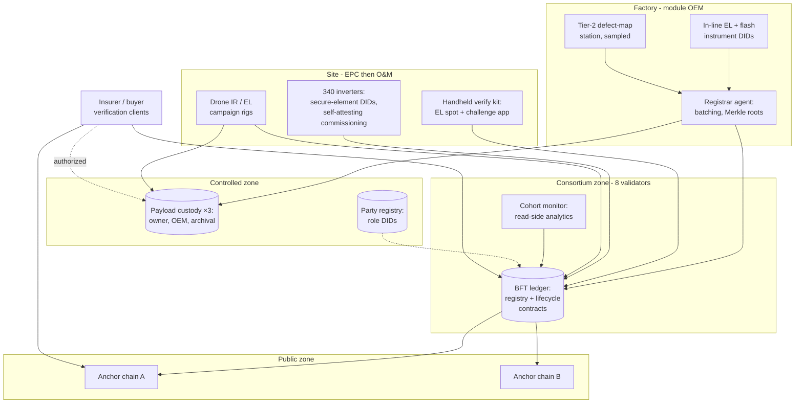

# Part IV — Application and Deployment {.unnumbered}

# Case Study — Solar Asset Identity Pilot Architecture

## What This Chapter Covers

Everything so far has been architecture in the abstract. This chapter assembles it
into one concrete system: a pilot deployment for a 50 MW single-axis-tracking
plant, designed around the research context in which the defect-mapping work of
Chapter 6 was developed. The presentation is a design walkthrough at the level an
implementing engineer needs — the program's build phases and their true
proportions, system diagram, participant and node layout, data
flows for the five scenarios the year actually ran (four planned, one
volunteered by the owner's investment committee), the smart-contract logic in
walkthrough form (full listings in Appendix A), the measured results with
their caveats attached, and the part of any honest case
study that outlives it: what went wrong, what was redesigned, which
engineering problems remain open, and what the program would do
differently. Where a parameter is site- or program-specific
I say so; the intent is that the chapter functions as a design template, not a
sales exhibit.

## 11.1 Pilot Scope and Ground Rules

**The plant.** 50 MW(DC) single-axis tracking; ~126,000 bifacial modules of a
single OEM across two production lines; 340 string inverters; 1,260 tracker rows.
Chosen deliberately mid-scale: large enough that per-unit manual process fails
visibly, small enough that one EPC and one O&M contractor cover the field side.
The single-OEM simplification is acknowledged as the design's largest
departure from market reality — multi-vendor plants are the norm, and they
would have forced the cross-vendor template problem (Section 11.7,
problem 2) into the critical path rather than the research agenda. The
program chose to prove the vertical slice first and carry the
horizontal question forward; a successor program should invert that
choice.

**The participants and their nodes.** Eight consortium members at pilot stage —
module OEM, inverter OEM, EPC, owner (an infrastructure fund), O&M contractor,
insurer, an independent engineering/certification firm, and a university lab
operating the Tier-3 reference instruments (Section 6.7). Eight validators is
below Section 7.5's target range; the consortium agreement (Section 11.6)
provides for expansion to 12–16 with the second plant, and the pilot accepts the
weaker \(f = 2\) fault bound as a documented, temporary risk.

Recruitment order mattered and is reported for successors. The insurer
signed first — Chapter 13's incidence analysis predicts exactly this, and
its early commitment converted two hesitant parties (the owner, whose fund
wanted the diligence-cost story validated by the party who would pay it,
and the OEM, for whom the insurer's participation reframed enrollment
from compliance cost to product feature). The EPC signed last and under
commercial persuasion (a preferred-bidder consideration on the owner's
next project), which foreshadowed the S2 friction: the party with the
least to gain from evidence is the party whose workflows generate the
most of it, and successors should price that asymmetry into their
recruitment rather than discovering it in week three of commissioning.
Each member's motivations were documented in the program charter — a
practice recommended without reservation, since half of governance is
remembering why everyone came.

**Tiering decisions.** Tier 0 enrollment (factory EL + flash VC) for all 126,000
modules; magnetometric (Tier 2) enrollment for a 5% stratified sample
(6,300 modules) plus both production lines' first-article sets — sized to give
population-level statistics for the R2 stability study (Section 6.8) while
bounding instrument time on a production-paced line; active binding (secure
elements) in all 340 inverters, whose vendor shipped ML-DSA-capable elements —
the hybrid-signing regime of Section 9.3 applied from day one. The 5%
figure was the resolution of a genuine argument: the research side wanted
20% for statistical power, the factory wanted 1% for line impact, and the
compromise was set by the defect-map station's throughput (one unit per
four minutes against a 25-second takt) — an instance of Section 6.2's
maturity honesty pricing itself into a real program, and a number that
successors with faster instruments should revisit upward.

**Ground rules for the account.** Three disciplines govern how the pilot is
reported here. Numbers are actuals where the program's records support
them and are labeled as targets where they do not. Failures are reported
with their costs, because a case study's negative results are its most
transferable content. And the program's specifics — one OEM, one climate,
one regulatory context — are flagged wherever they limit generalization,
with Chapter 12 carrying the generalization burden the pilot cannot.

### 11.1.1 The Build, Phase by Phase

The program ran in five overlapping phases, and the calendar is itself a
finding — where the time actually went contradicts where the industry
assumes it goes.

*Phase 0 — Constitution (four months).* The consortium agreement (the
Section 10.5 checklist, negotiated to signature), accreditation criteria,
custody contracts, and fee schedule. Longest-feeling phase, entirely
lawyers and committees, and in retrospect under-resourced: two governance
questions deferred here (the co-signing window, the sub-tier work-order
integration) returned as the year's two operational incidents.

*Phase 1 — Factory integration (three months, overlapping).* Registrar
agent development against the OEM's manufacturing-execution system,
secure-element retrofit boards for the existing EL and flash stations,
HSM ceremonies, and the enrollment exception paths of Section 4.3.1.
The integration consumed roughly four times the effort of the ledger
deployment itself — the ratio Section 7.6's cost model warns about, here
measured.

*Phase 2 — Ledger and custody (six weeks).* Validator deployment across
the eight members, contract suite audit and deployment, anchoring agents
against two public chains, custody stores with retrievability challenges.
The shortest phase, as Chapter 7 predicted: consensus infrastructure at
these loads is genuinely small.

*Phase 3 — Field tooling (four months, overlapping construction).*
Handheld verification kits, work-order system integration for the O&M
prime, inverter commissioning self-attestation firmware, and drone
campaign tooling. The phase that generated the most schedule risk,
because it coupled to the EPC's construction calendar, which no software
plan controls.

*Phase 4 — Operations and exercises (ongoing).* Commissioning at
construction pace, the verification and adjudication scenarios of
Section 11.3, the first governance year of Section 11.6, and the
disaster-recovery exercise of Section 7.7. Go-live was not an event but a
gradient: the first anchored registration preceded the last governance
signature by a month, which the program tolerated and a purist would not
have.

The budget's shape, in ratios rather than figures the program cannot
publish: integration engineering (Phases 1 and 3) took roughly half the
total; constitution, legal, and governance a fifth; instruments and
retrofit hardware a fifth; and the ledger, custody, and anchoring
infrastructure — the part the word "blockchain" evokes — under a tenth.
The ratios are the chapter's most quotable finding for anyone budgeting a
successor, and they echo Section 7.6.1's cost-model omissions almost
exactly: the architecture's expensive parts are its edges, where it
touches factories, crews, and lawyers, not its center.

Security practice ran alongside from Phase 2: the contract audits noted
above, a tabletop governance-capture exercise in the first quarter of
operations (Section 8.7's cheap annual rehearsal — three findings, all
procedural), and a scoped physical red-team in month nine whose ringer
attempt against a mock verification produced the position-photograph
procedure now standard in Section 8.3. The program's security spend
followed Chapter 8's budget-allocation memo — heaviest at enrollment and
accreditation, lightest at consensus — and the year's incident record
(zero ledger-layer events, every incident procedural) is consistent with
the allocation having been right.

## 11.2 System Architecture

**Figure 11.1** Pilot system diagram. Shaded components are the three zones of
Figure 10.1; arrows show the dominant data flows, quantified in
Section 11.2.1. Every organization hosts its own boxes on its own
infrastructure — the validator set spans four hosting arrangements and
three jurisdictions, per Section 4.7's anti-correlation rule.

### 11.2.1 The Data Flows in Numbers

Figure 11.1's arrows, quantified over the pilot year, because a diagram
with magnitudes is an architecture and without them a poster. Factory to
ledger: ~1,150 batch transactions committing 126,000 registrations and
their shipping events — kilobytes per shift, exactly as Chapter 7
modeled. Factory to custody: 9.4 TB of enrollment payloads (EL images
dominating; the 6,300 Tier-2 defect maps contributing 2.1 TB), written
three ways. Field to ledger: ~410,000 events across commissioning,
custody, maintenance, and inspection — the plant's entire evidential year
fitting in under half a gigabyte of envelopes. Site to custody: 3.8 TB of
commissioning and campaign imagery. Anchor agents to public chains: 2,920
anchor transactions (four daily, two chains), total fees under USD 900 at
observed rates — the year's cheapest line item, per lesson 4 its highest-
credibility one. Read side: the insurer's client verified ~2.3 M
envelope-proof pairs (continuous Step-1 over its book); the mock-buyer
exercise added ~40,000; replica queries otherwise stayed in the low
millions, served from two read replicas whose combined load never
exceeded what one laptop could serve. Every number lands within the
Chapter 7 model's error bars, which is the sentence this subsection
exists to earn.

Platform notes, kept to one paragraph because Section 2.6 promised platform
neutrality: the pilot runs a permissioned BFT ledger (a Fabric-family stack was
selected for its mature channel and endorsement tooling; the schema and contracts
are written against the Chapter 5 envelope so that the platform is replaceable),
anchored four times daily to two unrelated public PoS chains. Payload custody is
object storage at three organizations under the proof-of-retrievability regime of
Section 4.2, challenged weekly. The cohort monitor is an ordinary analytics
service with *no write authority* — Section 5.5's constitution-not-police
principle made operational.

Three architecture decisions that Figure 11.1 renders as boxes deserve
their reasons as prose. The *handheld kits* are deliberately dual-mode:
online against read replicas when coverage allows, and offline against
cached header checkpoints and pre-loaded record bundles when it does not —
because the site's cellular coverage map was, characteristically, worst
exactly where the racking was densest, and a verification tool that needs
bars is a tool crews abandon. The *insurer's clients* run entirely outside
the consortium (Section 2.4's read-permission design): the insurer chose,
deliberately and instructively, to consume public headers plus authorized
disclosures rather than take a validator seat in year one — its stated
reason being that reliance would be more persuasive to its own auditors
if it demonstrably required no operational entanglement. And the
*university lab* holds the Tier-3 reference role with its instruments and
its independence — the metrological anchor of Section 6.7's recursion —
plus, in practice, the informal role every deployment should staff: the
party whose only stake is that the measurements be right, and whose
presence in committee reliably lowered the temperature of commercial
arguments.

## 11.3 Four Scenarios, Walked End to End

The four scenarios were chosen at program design as the value-bearing
paths the pilot existed to prove — one per stakeholder whose adoption
Chapter 13 identifies as decisive (factory, project delivery, insurance,
adjudication) — and instrumented from day one, which is why this section
can report numbers rather than impressions.

**S1 — Production day.** Each line emits ~1,400 modules/shift. Per module: EL
capture and flash test in the existing QA cell (cycle cost of enrollment: the
template extraction, ~2 s of compute, zero added handling — the Section 4.3
economics realized); registrar agent accumulates envelopes, builds a 2,048-leaf
Merkle batch, writes the manifest to all three custody stores, then submits the
root (Section 7.2 verbatim). Tier-2 sampled units detour ~4 min to the defect-map
station — the one process change the factory noticed, absorbed by sampling rate.
Measured pilot figures: 3–4 batch transactions per shift per line; registration
lag (lamination to anchored DID) median 6.2 h, dominated by anchor cadence, which
is fine — nothing downstream consumes a DID faster than shipping does.

The exception statistics tell the operational story the happy path hides.
Across the production campaign: 0.8% of units entered the rework loop and
were correctly re-enrolled under superseding events (Section 4.3.1's
re-test path, exercised ~1,000 times without incident); 0.02% hit
label–structure mismatches at the station's final check — all mis-fed
label stock, all quarantined automatically, none escaping; and one
instrument fault (a flash tester's signing board failing mid-shift)
triggered the deferred-enrollment path for 212 units, which flowed to the
backup station within the shift. Two findings from the statistics
themselves: the rework-loop enrollment history turned out to be *wanted*
by the OEM's quality team as process telemetry they had never had per-unit
before (an unplanned benefit that eased the factory's tolerance of the
whole program), and the exception rates stabilized within three weeks —
the workforce learning curve was short because, per the design intent,
almost nothing about the work changed.

The logistics leg between S1 and S2 ran the dual-signed custody protocol
at container scale: 152 consignments, each a `EVT_SHIP` plus custody
transfers at consolidation, port, and site laydown, with receiving
inspections sampling V1 checks per Section 3.6's ladder. Yield: three
exception-noted receipts (two crushed pallet corners, one count
discrepancy resolved as a manifest error), each dual-attested at the dock
in the manner Section 5.3 designed — and, months later, the transport
insurer's renewal quote for the owner's next project cited the
consignment record quality explicitly, the first commercial pricing
signal the program observed in the wild.

**S2 — Commissioning.** The event that starts 126,000 warranty clocks. String-by-
string: EPC runs IV/insulation tests with instrument-DID'd testers; inverters
self-attest their commissioning readings under their secure-element identities
(active binding earning its keep — no transcription step); owner's engineer
co-signs per Class C; `EVT_COMMISSION` batches land per Figure 5.2's enforcement.
The pilot's first governance fight happened here and is reported honestly in
Section 11.5: the EPC's schedule pressure collided with the corroboration
requirement, and the resolution — a 72-hour co-signing window with events valid
from claimed-time — is now the schema's recommended default.

The commissioning payload's contents, since successors will copy them: per
string, the IV curve and insulation-resistance test payloads
(instrument-signed, grade I-A), torque-check confirmations (grade I-C,
operator-attested — the honest label for a wrench), the string's position
map delta against the installation record, and the inverter's
self-attested commissioning readings; per block, the grid-connection
references and protection-settings attestations the DSO interface of
Section 10.4 consumes. The whole payload set maps onto IEC 62446-1's
documentation checklist per Table 5.5 — the commissioning engineer
recognized every artifact, which was the design's intent and the reason
adoption survived the schedule fight.

The fight deserves its blow-by-blow because every deployment will have it.
Week three of commissioning, the owner's engineer — one person, covering
two other projects — fell four days behind the EPC's string-completion
rate; the contract's write-time Class C check rejected the EPC's
submissions; the EPC, facing liquidated-damages exposure on the
interconnection milestone, demanded the corroboration requirement be
waived; the owner, correctly, refused to gut the warranty evidence its
fund's investment committee had been sold on. The technical committee's
resolution took nine days and one amendment: events accepted with the
engineer's co-signature arriving up to 72 hours after the EPC's
submission, valid from claimed time, with the *gap itself* recorded — so
schedule reality was accommodated, the corroboration survived, and a
co-signing lag statistic now exists that the monitor watches (a lag
trending toward its window is an early warning of exactly the resourcing
failure that caused the episode). The transferable lesson is not the
72-hour number but the method: when schedule and evidence collide, the
answer is asynchrony with the gap recorded, never waiver with the gap
hidden.

**S3 — The insurer's annual verification.** The Chapter 6 workflow as a
subscription: Step 1–2 (record authenticity + evidence-graph policy) run
continuously by the insurer's client against headers and anchors; Step 3 annually
— sampling design (n = 380, stratified by production week and string position,
95/5 confidence on the fleet fraction outside degradation envelope) committed to
the ledger *before* the site visit; handheld EL challenge-verification of the
sample against enrolled templates, with 12 units escalated to portable
magnetometry. Year-one outcome: 378/380 template matches; 2 mismatches traced to
a documented pallet-drop replacement never event-logged — an honest completeness
failure (Section 5.7) that cost the O&M contractor a finding and produced the
pilot's procedural fix: removal/replacement events are now blocking steps in the
work-order system, not after-action paperwork.

The sampling design itself, committed as `evt:s3-2027-design` before the
visit: stratification by production week (14 strata) crossed with string
position class (edge/interior, a PID-risk proxy), allocation proportional
to stratum size with a floor of eight units per stratum, selection by a
published seeded generator over the frozen as-installed register, and the
escalation rule (any mismatch inflates its stratum's sample threefold)
pre-declared. None of this is statistically exotic — it is Cochran's
textbook with a ledger commitment — and that ordinariness is the point:
the adversarial soundness comes from the pre-commitment, not from novel
mathematics, per Section 6.6.1.

The campaign's operational texture, for the practitioner who will run one:
two technicians, nine field days (Section 11.7's ergonomics problem is why
it was not six), night work for the EL rig on 340 of the sampled units and
daylight contact measurement for the rest; unit selection executed at the
racking per the anti-ringer procedure of Section 8.3, with the position
photographs adding perhaps ninety seconds per unit and one flagged
discrepancy (a transposed row label from construction, corrected as a
finding rather than a fraud). The twelve magnetometric escalations were
chosen where EL matches were positive but marginal — all twelve confirmed
identity and quantified condition deltas that EL alone had bounded
loosely, which is the escalation tier doing precisely its Section 6.7
job. The insurer's diligence cost, all-in against its prior-year
conventional baseline for a comparable plant: 40% — with the pre-committed
sampling design surviving its first hostile review when the owner's fund
auditors, initially skeptical that 380 units could speak for 126,000,
were walked through the acceptance-sampling arithmetic their own
procurement standards already used.

The two mismatches deserve their epilogue because they exercised the whole
escalation machine: re-measurement excluded instrument error; template
comparison against the *corpus* (the F4 resurrection check) identified
both units as enrolled modules from the same production batch — physically
genuine, correctly enrolled, but sitting at positions whose records said
other modules sat there. The work-order archaeology took an afternoon:
a pallet dropped during construction, two damaged modules swapped for
spares by a subcontractor crew, no event filed. Honest units, dishonest-
looking records, a procedural fix — and a demonstration to every party
watching that the system distinguishes *fraud* from *sloppiness* by
evidence rather than by accusation, which did more for the O&M
relationship than the finding cost it.

**S4 — Warranty adjudication rehearsal.** A staged dispute (real modules, agreed
fiction): owner claims accelerated degradation on 210 modules of one production
week. The evidence DAG did what Chapter 5 designed it to do: claim event
references commissioning + three condition records; OEM's response references the
same records plus factory Tier-2 first-article maps; the adjudicating engineer
re-executed the provenance chains (Section 4.5's determinism paying off — two
processing-version pins had to be honored, exactly as Section 4.2 predicted) and
resolved in 11 days against a sector norm of months. The rehearsal's real product
was the finding that *both* parties' counsel accepted anchored ledger extracts
without contesting authenticity — the first indication that Step-1 verification
has the evidentiary standing the whole design wagers on.

The eleven days decompose instructively: two for pleadings against the
stipulated-evidence clause (Section 10.3's arbitration design, exercised);
five for the adjudicator's independent re-execution of the evidence graph
— including the deliberately planted complication, a condition record
whose processing pipeline version had been superseded mid-pilot (lesson 6
below), which the versioned re-execution machinery resolved in an
afternoon that would otherwise have been an expert-witness week; three for
the physical sampling of contested units under the challenge protocol;
one for the award. The staged fiction was calibrated from real disputes
in the OEM's claims history, and the participating counsel's debrief
produced the quote the program's steering committee circulated most: the
dispute was "argued about causation from day one, because there was
nothing else left to argue about" — which is, compressed to a sentence,
the entire value proposition of Part II.

**S5 — The unplanned scenario: a secondary-market rehearsal.** Late in the
year, the owner's fund asked the program to mock a partial divestment —
5,000 modules from an early production week, packaged for a
hypothetical buyer's diligence — because its investment committee wanted
to see the resale story with its own eyes. The exercise assembled the
disclosure bundle of Section 10.2.2 (registrations, commissioning,
condition chains, climate-zone class, verifier attestations) in two days
of analyst time, most of it spent deciding *what not to disclose* — the
first live exercise of the selective-disclosure policy, which held. A
diligence firm engaged as the mock buyer ran Steps 1–2 in an afternoon,
requested V2 sampling of 40 units (executed within the week during a
scheduled O&M campaign), and returned a diligence memo whose residual-risk
section quoted Table 8.3's categories nearly verbatim — evidence that the
residual-register discipline travels to third parties unprompted. No
price was set (the divestment was fictional), so the exercise produced no
premium datum for Section 11.7's problem 5 — but the fund's committee saw
a five-day diligence cycle on an asset class whose norm is six weeks, and
the program counts their subsequent enthusiasm as its most consequential
unmeasured result.

## 11.4 The Contract Suite in Walkthrough

Four contracts, deliberately small (Section 8.5, F8); full annotated listings are
Appendix A.

**Table 11.1** Pilot contract suite. Line counts are the deployed
implementations' logic lines, cited to make the smallness-by-design
audible: the whole consensus-critical codebase is under 1,700 lines,
reviewable in a day by anyone this book has equipped.

| Contract | State held | Enforces | Size (pilot impl.) |
|---|---|---|---|
| `AssetRegistry` | DID → registration record, batch roots | Uniqueness; registrar accreditation; registration class labeling | ~400 lines |
| `LifecycleSM` | DID → state, custody/ownership registers | Figure 5.1 transitions; Table 5.1 corroboration classes; submission windows | ~700 lines |
| `RoleAccred` | Role DID → accreditation, algorithm policy, validity intervals | §8.5 succession; §9.4 P2 time-contextual verification | ~300 lines |
| `AnchorAudit` | Anchor log, custody-challenge log | §4.4 cadence; §4.2 retrievability challenge outcomes | ~250 lines |

The walkthrough example the appendix develops line by line is the `LifecycleSM`
path for `EVT_COMMISSION` (Figure 5.2's sequence as code), chosen because it
exercises every enforcement class: state check, role check via `RoleAccred`,
corroboration counting, window arithmetic, and the emission of the derived
warranty-clock event that the insurer's client subscribes to.

The reason-code taxonomy deserves its operational note: 71 codes at
go-live, organized by the four enforcement classes of Section 5.5, each
carrying a documentation link and a suggested remediation. Field telemetry
on rejections became an accidental quality instrument — the distribution
of reason codes by submitter identified integration bugs (one code
spiking from one party is a software defect; the same code spread evenly
is a schema usability problem), and two payload-schema clarifications in
the year's amendments originated as reason-code statistics rather than as
anyone's complaint. A rejection, properly coded, is the system teaching
its users; uncoded, it is the system training them to route around it.

The suite's engineering history in three sentences, because contract
processes are argued about more than they are documented. Both
implementations (the software-diversity rule of Section 7.5 applied from
day one, at the cost of roughly 1.6× the single-implementation effort)
were developed against the schema's conformance suite — 412 cases at
go-live, grown to over 600 by year-end as every governance amendment and
every incident added its regression — and audited independently, with the
audit finding two genuine defects: a submission-window boundary condition
(off-by-one at exactly the window's edge, the classic) and a
corroboration-counting path that accepted two attestations from
instruments sharing a controller, violating Section 4.5's independence
requirement — the precise F8-enables-F5 coupling Chapter 8 predicted, and
an audit finding that paid for the audit. Post-go-live change traffic was
modest and entirely parameter-level: the S2 window amendment and two
payload-schema version registrations, zero logic deployments — the
small-contract discipline holding in practice as designed.

## 11.5 Lessons Learned

Reported as they were logged, because sanitized lessons teach nothing.

1. **The schema survived contact; the procedures did not.** No envelope or
   state-machine change was needed through commissioning. Every early failure was
   procedural: unlogged replacements (S3), co-signing bottlenecks (S2), a custody
   store that silently failed retrievability challenges for nine days before its
   operator noticed the alerts. Systems of this kind fail at the human seams
   first — design the escalations, not just the cryptography. The corollary
   the program drew: procedural failure modes deserve the same pre-mortem
   treatment Chapter 8 gives attacks — enumerate the seams (handoffs,
   co-signatures, alert routing), assign each a detection and an owner,
   and rehearse the escalations before the incident chooses its own.
2. **Enrollment economics behaved as predicted; verification economics beat
   prediction.** Tier-0 enrollment marginal cost was effectively invisible in
   line takt; the insurer's Step-3 campaign cost ~40% of its conventional
   due-diligence baseline because sampling design replaced blanket re-testing.
   The asymmetry has a lesson inside it: the modeled savings came from the
   ledger, but the *realized* savings came from statistics the ledger made
   defensible — pre-committed sampling was always cheaper than blanket
   testing, and what the architecture actually sold the insurer's auditors
   was the inability of anyone to have gamed the sample.
3. **The completeness problem is cultural before it is technical.** Field crews
   log what the work-order system forces them to log. The fix that worked was
   embedding event emission in the tools crews already use — not training,
   not policy memos. The program's failed first attempt deserves equal
   billing: a two-hour training module and a laminated procedure card,
   which produced two weeks of conscientious logging followed by
   regression to exactly the prior baseline — a result any behavioral
   scientist would have predicted and the budget's training line item did
   not.
4. **Anchoring bought unplanned credibility.** The S4 finding: external counsel
   treated public-chain anchors as the decisive authenticity argument, ahead of
   the consortium's own signatures. Budget anchoring generously; it is the
   cheapest trust in the system. The mechanism, per the counsel debrief, is
   worth recording: the anchors required no explanation of consortium
   governance, no trust in any party to the dispute, and no expert witness
   — "the newspaper argument," one lawyer called it, independently
   reinventing Section 2.1.2's framing, and lawyers argue comfortably from
   precedents they can see.
5. **Underestimated: instrument identity operations.** Calibration-lifecycle
   events for ~60 instruments (testers, cameras, handhelds, drones) generated
   more governance traffic than all 126,000 modules — accreditation renewals,
   firmware attestations, one revoked handheld. Section 4.5's Rule 3 is right and
   is also real work; staff it. The revoked handheld is its own paragraph
   of instruction: a unit whose firmware attestation began failing after a
   field repair by an unauthorized service shop — no malice found, but the
   attestation chain was broken and the revocation-and-re-provisioning
   machinery ran exactly as designed, retiring 3 weeks of that unit's
   measurements to grade I-C (operator-attested) status. The measurements
   survived, downgraded honestly; the procedure held; and the O&M
   contractor now reads repair terms in its instrument purchase orders.
6. **The two-layer decomposition needs versioned discipline.** Mid-pilot
   improvement of the stable/condition separation model (Section 6.3) forced the
   first live exercise of payload versioning and P1-style re-commitment for 6,300
   Tier-2 templates. It worked, and it was the strongest validation of
   Chapter 9's machinery the pilot produced — migration exercised as routine, not
   emergency.
7. **Measure the humans, kindly.** The program's most predictive
   operational metrics were human-process statistics nobody originally
   planned to collect: co-signing lag (the S2 early warning), exception-
   path rates by station and shift (which located a training gap two weeks
   before it would have become a data-quality incident), and work-order-to-
   event latency by crew. The kindness matters as much as the measurement:
   the metrics were reviewed as process health, never as individual
   performance — the moment field crews suspect the evidence layer is a
   surveillance layer, Section 5.7's completeness problem stops being
   incentive-shaped and becomes adversarial, and no schema survives its
   own users' hostility.
8. **The pilot's size was nearly too small — and nearly too large.** Too
   small: eight validators left \(f = 2\), one insolvency away from
   discomfort, and several governance mechanisms (adverse-interest quorums
   especially) only barely had the membership to constitute themselves.
   Too large: 126,000 units meant that every schema mistake had six-figure
   blast radii, which made the committee conservative in ways a 5 MW
   sandbox would not have suffered. Programs following this one should
   consider the two-stage shape the pilot backed into by luck — constitute
   governance and schema against a small early tranche, then scale the
   fleet once the amendment traffic settles.

## 11.6 Governance as Deployed

One seat deserves mention for being empty: the program invited the state
energy regulator to observe (Section 10.3's observers-before-members
principle), and the invitation was declined for capacity reasons — with a
request for the transparency reports instead, which the regulator's staff
have since cited twice in DER data-standards consultations. The
half-engagement is reported as encouragement calibrated to reality:
regulatory familiarity compounds slowly, starts with documents rather
than seats, and begins whenever someone sends the first report.

The Table 10.2 allocations, instantiated: accreditation committee of three
(certifier, insurer, university — no party in the module supply chain); technical
committee chaired by the owner; contract upgrades by 6-of-8 with a 14-day
timelock; migration authority pre-delegated to the technical committee acting
with the university lab; party-registry disclosure triggers enumerated (dispute
event, regulatory demand, insurance claim above a threshold) with the certifier
as contested-case adjudicator; arbitration under the ICC rules seated per the
consortium agreement. Two governance events fired in year one — the S2 window
amendment (schema policy change, 8-of-8) and one custody-SLA breach finding.
Neither reached arbitration. The agreement's most-used clause, unexpectedly, was
the *instrument* accreditation schedule (lesson 5).

The custody-SLA episode completes the governance record because it
exercised the sanctions ladder end to end. The OEM-side custody store
failed retrievability challenges for nine consecutive days (lesson 1's
sleeping-alert incident); the audit contract's third consecutive failure
had already triggered automatic re-replication to the archival custodian,
so no payload was ever at risk — but the SLA breach stood. The operations
committee's finding imposed the ladder's second rung (a remediation plan
with verification, plus the challenge sampling rate doubled for that store
for two quarters) rather than the financial penalty the agreement
permitted, reasoning recorded in the finding: first breach, no data
exposure, root cause procedural. The store's operator fixed the alert
routing, passed the enhanced regime clean, and the episode now serves as
the consortium's worked example that the ladder's lower rungs are real —
which, per Section 4.3.2's argument, is what makes the upper rungs
credible.

Expansion status at time of writing: the second plant (a different owner,
a different module OEM — forcing problem 2 of Section 11.7 onto the
roadmap where it belongs) has signed the accession instrument the
agreement's membership clauses anticipated, bringing the validator set to
eleven with three further candidates in diligence; the schema required no
changes for the new OEM's enrollment integration, which is the
extensibility principle earning its second data point. The federation
question — whether growth continues within one consortium or splits along
the jurisdictional lines Chapter 7 and 10 recommend — is scheduled for the
membership's second annual meeting, and this book's advice is on the
record.

Governance load, quantified for planners: across year one, the committees
consumed roughly 340 person-hours across the eight members — front-loaded
into the amendment and accreditation traffic of the first two quarters,
decaying toward a steady state near 20 hours a month consortium-wide.
Small numbers, deliberately reported: the sector's consortium-phobia is
calibrated on standards-war experiences, and the observed load of
governing a *running system with decided questions* is an order of
magnitude below the load of deciding the questions — one more argument
for Phase 0 patience.

## 11.7 Open Engineering Problems, From the Field

Continuing Section 6.8's list with what only deployment reveals — six
problems, each stated with what the pilot contributed toward its solution,
because a case study that only *finds* problems has done half its job.

**(1) Handheld challenge-verification ergonomics.** Step-3 throughput is
gated by fixture alignment time, not measurement time: the measurement
takes seconds, but positioning the rig against a racked module, achieving
standoff tolerance, and confirming fiducial lock averaged four minutes per
unit across the S3 campaign, and the technicians' own suggestions (a
self-aligning frame jig, projected alignment guides) are mechanical
engineering nobody has funded. The problem is prosaic and decisive: at two
minutes per unit, escalated verification prices into routine transactions;
at six, it stays exceptional.

**(2) Template portability across instrument generations.** The pilot's
re-commitment exercise (lesson 6) worked within one vendor's pipeline —
same optics, same feature extraction, versioned parameters. The unsolved
case is heterogeneity: an S3-style verification in 2035 will use cameras
and extraction software that do not exist today, and nothing yet
guarantees that their templates land in a comparable feature space.
Cross-vendor template verification standards do not exist (→ Chapter 14,
S3), and the pilot's contribution is a dataset: the 6,300-unit Tier-2
cohort, imaged under two instrument generations, awaiting exactly this
research.

**(3) Bifacial rear-side condition records.** Rear EL in the field remains
awkward — access, reflection management, and the racking's shadowing all
degrade image quality — and the pilot's rear-side evidence is thinner than
its front-side evidence in ways an adversary could learn and exploit
(a rear-side defect history is effectively unverifiable at V2 today). The
candidate answers (rear-biased challenge protocols, thermographic
surrogates, sampling modules pulled to ground stations) all cost more than
the front-side equivalents, and the honest current posture is the graded
one: rear-side claims carry a lower evidence grade, priced accordingly.

**(4) Event emission from subcontractor tools.** The work-order
integration (lesson 3) covered the O&M prime, while sub-tier crews —
the cleaning contractor's crews above all — still route around it,
reporting through the prime's paperwork at day's end. The S3 pallet-drop
finding was exactly this gap. Options run from contractual flow-down
(works, slowly, at renewal cadence) to a lightweight signing app for
sub-tier use (grade I-C, but an attributed I-C beats an invisible gap)
to the structural answer of making event emission a prerequisite for site
access badges — which the owner is piloting and the book reports without
yet endorsing.

**(5) Retrofit enrollment backlog economics.** The owner's other plants
want in, and Section 4.3's retroactive-class discount needs market data it
does not yet have (→ Chapter 13): until resale or refinancing events price
retroactive-class assets against factory-class ones, the business case for
campaign-mode retrofit (as opposed to opportunistic touchpoint enrollment)
rests on modeled rather than observed premia. The pilot's contribution is
the cost side: its retrofit trial on a neighboring 12 MW plant measured
enrollment at USD 3.10 per module in campaign mode — the denominator
waiting for its numerator.

**(6) Monitor governance.** The cohort monitor, deliberately deprived of
write authority (Section 5.5), accumulated something subtler: *agenda*
authority. Its flags determined what the committees discussed, its
baselines defined "normal," and by year-end its maintainers were, in
practice, among the most influential parties in the consortium — with no
accreditation, no audit schedule, and no adverse-interest rules covering
them. Nothing went wrong; the gap is the point. Read-side analytics need
governance proportional to their agenda power — versioned models,
challengeable baselines, a documented flag taxonomy — and neither this
book's Part III nor the standards landscape yet provides the template.

A closing observation ties the six together: none is a ledger problem.
Every open problem the deployment surfaced lives at the physical,
procedural, or institutional edges — instruments, templates, sub-tier
workflows, market data, analytics governance — which is simultaneously
the strongest validation of Part II's architecture (its own layer held)
and the clearest instruction about where this field's next five years of
engineering effort belong.

## 11.8 Measured Results

The scattered numbers above, collected for the reader who will be asked
"but what did it actually do?" in a steering committee.

**Table 11.2** Pilot key results, year one. Baselines are the insurer's
and OEM's own prior-practice figures for comparable assets, as reported to
the program.

| Metric | Result | Baseline / target |
|---|---|---|
| Tier-0 enrollment marginal cost | < USD 0.08/module (compute + ledger share) | Target ≤ 0.10 |
| Added line takt time | 0 s (parallel path) | Target 0 |
| Registration lag (median, to anchored DID) | 6.2 h | Anchor-cadence bound |
| Enrollment exception rate (steady state) | 0.8% rework loop; 0.02% label mismatch | OEM QA norms |
| Commissioning events, Class C conformance | 100% (post-amendment) | — |
| Co-signing lag (median / p95, post-amendment) | 9 h / 61 h | Window 72 h |
| Insurer diligence cost vs. conventional | ~40% | Prior-year baseline |
| S3 verification: template match rate | 378/380 (both mismatches explained) | FA/FR envelope |
| S4 adjudication duration | 11 days | Sector norm: months |
| Custody retrievability challenge pass rate | 99.4% (one 9-day incident) | SLA 99.9% — breached once |
| Consortium infrastructure opex, year one | Within Table 7.4's plant-scale envelope | Model ±30% |
| Governance load | ~340 person-hours consortium-wide | No baseline exists |

Three caveats accompany the table in every presentation the program gives,
and belong here too. The baselines are self-reported by interested
parties, not audited. Year-one results measure a fleet too young for
degradation disputes, so the warranty-relevant numbers (S4) come from a
rehearsal, not a live claim. And a single pilot proves feasibility, not
statistics — the honest claim is that nothing in the architecture's cost
or operability assumptions was falsified, and several (enrollment cost,
diligence savings, adjudication speed) landed better than modeled.

### 11.8.1 What the Program Would Do Differently

The retrospective's consensus items, in the program's own priority order.
*Resource Phase 0 as the main event*: the two deferred governance
questions became the year's two incidents, and everyone now believes the
causality. *Buy the owner's engineer capacity twice over*: the S2 episode
was, at root, a staffing decision made against a spreadsheet; evidence
requirements change critical-path staffing, and project plans should model
co-signing as a resource, not a formality. *Integrate the sub-tier from
day one*: the prime-contractor boundary was known, the gap was documented,
and the pallet-drop finding happened anyway — known gaps do not close
themselves. *Instrument the humans from the start* (lesson 7's metrics
were retrofitted at month four; the program would pay real money for the
missing four months of baseline). *Start the second-site conversation
earlier*: several design decisions optimal for one plant (single-OEM
templates, one work-order integration) acquired inertia that the second
site — different OEM, different O&M platform — now has to budget against.
None of these is architectural; all of them are expensive; and their
absence from the blockchain-for-energy literature the program consulted
at kickoff is part of why this chapter exists.

The program's replication kit — what a successor can take rather than
rebuild — is, in the order a successor will want it: the consortium
agreement's structure (Section 10.5's checklist, now with one
jurisdiction's worked instantiation), the schema and conformance suite
(the versioned artifact, portable by design), the contract suite's two
implementations and audit reports, the enrollment-station integration
patterns per MES vendor, the reason-code taxonomy, the sampling-design
templates, and the metrics definitions of Table 11.2 — so that the second
deployment's results are comparable to the first's, which is how a pilot
becomes an evidence base. [Distribution terms for these artifacts are
being settled with the program's sponsors — TO BE CONFIRMED AT PRESS
TIME.]

## 11.9 Chapter Summary

A 50 MW pilot instantiated the full stack — Tier-0 enrollment folded invisibly
into factory QA with sampled Tier-2 defect mapping, active-bound inverters,
an eight-validator BFT consortium with twice-redundant public anchoring, three-zone
privacy topology, and a four-contract suite small enough to audit twice and
change never. The build's true proportions contradict the industry's
assumptions: constitution and factory integration consumed the calendar;
the ledger took six weeks. The five
walked scenarios delivered the design's promises in measurable form: production-
paced registration at batch cost with exception statistics the factory
came to want for its own reasons; Class-C commissioning that survived its first
governance collision and left behind a co-signing-lag metric that now
serves as an early-warning instrument; insurer verification at 40% of
conventional diligence cost
with pre-committed sampling that survived hostile audit review, and two
template mismatches that demonstrated the system distinguishing
sloppiness from fraud by evidence; an 11-day warranty adjudication whose ledger
extracts went uncontested and whose counsel debrief compressed the book's
thesis into a sentence; and an unplanned divestment rehearsal that ran a
six-week diligence norm in five days. Table 11.2 collects the numbers
with their caveats attached. The failures were procedural and human — unlogged
swaps, co-signing bottlenecks, a sleeping custody operator — and the durable
lessons are about seams, not algorithms: design the escalations, embed the
event emission, staff the instrument operations, measure the humans
kindly, and resource the constitution like the main event it is. The pilot
also stress-tested Chapter 9's
migration machinery a decade early and found it routine, which is the highest
compliment migration machinery can earn — and surfaced, in the monitor's
quiet accumulation of agenda power, a governance gap the literature has
not yet named. What remains is to generalize beyond one
technology and one plant — Chapter 12 — and to put numbers on the value the pilot
only gestured at — Chapter 13.

## References and Further Reading

1. International Electrotechnical Commission. *IEC 62446-1* (commissioning test
   documentation) and *IEC TS 60904-13* (electroluminescence of photovoltaic
   modules). Geneva: IEC. The standards whose artifacts the S2 payloads and
   S3 campaign procedures instantiate.
2. IEA-PVPS Task 13. *Qualification of Photovoltaic Power Plants Using
   Mobile Test Equipment.* Report T13-24:2021. Field-measurement practice
   underlying the S3 campaign design.
3. International Energy Agency PVPS Task 13. *Guidelines for Operation and
   Maintenance of Photovoltaic Power Plants in Different Climates.* Report
   T13-25:2022.
4. Cochran, W. G. *Sampling Techniques.* 3rd ed. Wiley, 1977 (the S3 sampling
   design's textbook basis).
5. International Chamber of Commerce. *ICC Arbitration Rules.* Paris: ICC, 2021.
6. [PILOT PROGRAM TECHNICAL REPORTS — CITATIONS TO BE SUPPLIED WHEN CLEARED FOR
   PUBLICATION.]

\newpage
