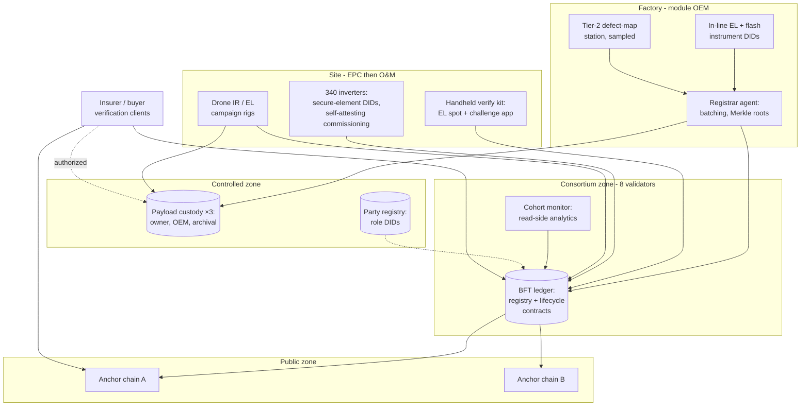

# Part IV — Application and Deployment {.unnumbered}

# Case Study — Solar Asset Identity Pilot Architecture

## What This Chapter Covers

Everything so far has been architecture in the abstract. This chapter assembles it
into one concrete system: a pilot deployment for a 50 MW single-axis-tracking
plant, designed around the research context in which the defect-mapping work of
Chapter 6 was developed. The presentation is a design walkthrough at the level an
implementing engineer needs — system diagram, participant and node layout, data
flows for the four highest-value scenarios, the smart-contract logic in
walkthrough form (full listings in Appendix A), and the part of any honest case
study that outlives it: what went wrong, what was redesigned, and which
engineering problems remain open. Where a parameter is site- or program-specific
I say so; the intent is that the chapter functions as a design template, not a
sales exhibit.

## 11.1 Pilot Scope and Ground Rules

**The plant.** 50 MW(DC) single-axis tracking; ~126,000 bifacial modules of a
single OEM across two production lines; 340 string inverters; 1,260 tracker rows.
Chosen deliberately mid-scale: large enough that per-unit manual process fails
visibly, small enough that one EPC and one O&M contractor cover the field side.

**The participants and their nodes.** Eight consortium members at pilot stage —
module OEM, inverter OEM, EPC, owner (an infrastructure fund), O&M contractor,
insurer, an independent engineering/certification firm, and a university lab
operating the Tier-3 reference instruments (Section 6.7). Eight validators is
below Section 7.5's target range; the consortium agreement (Section 11.6)
provides for expansion to 12–16 with the second plant, and the pilot accepts the
weaker \(f = 2\) fault bound as a documented, temporary risk.

**Tiering decisions.** Tier 0 enrollment (factory EL + flash VC) for all 126,000
modules; magnetometric (Tier 2) enrollment for a 5% stratified sample
(6,300 modules) plus both production lines' first-article sets — sized to give
population-level statistics for the R2 stability study (Section 6.8) while
bounding instrument time on a production-paced line; active binding (secure
elements) in all 340 inverters, whose vendor shipped ML-DSA-capable elements —
the hybrid-signing regime of Section 9.3 applied from day one.

## 11.2 System Architecture

**Figure 11.1** Pilot system diagram. Shaded components are the three zones of
Figure 10.1; arrows show the dominant data flows.

Platform notes, kept to one paragraph because Section 2.6 promised platform
neutrality: the pilot runs a permissioned BFT ledger (a Fabric-family stack was
selected for its mature channel and endorsement tooling; the schema and contracts
are written against the Chapter 5 envelope so that the platform is replaceable),
anchored four times daily to two unrelated public PoS chains. Payload custody is
object storage at three organizations under the proof-of-retrievability regime of
Section 4.2, challenged weekly. The cohort monitor is an ordinary analytics
service with *no write authority* — Section 5.5's constitution-not-police
principle made operational.

## 11.3 Four Scenarios, Walked End to End

**S1 — Production day.** Each line emits ~1,400 modules/shift. Per module: EL
capture and flash test in the existing QA cell (cycle cost of enrollment: the
template extraction, ~2 s of compute, zero added handling — the Section 4.3
economics realized); registrar agent accumulates envelopes, builds a 2,048-leaf
Merkle batch, writes the manifest to all three custody stores, then submits the
root (Section 7.2 verbatim). Tier-2 sampled units detour ~4 min to the defect-map
station — the one process change the factory noticed, absorbed by sampling rate.
Measured pilot figures: 3–4 batch transactions per shift per line; registration
lag (lamination to anchored DID) median 6.2 h, dominated by anchor cadence, which
is fine — nothing downstream consumes a DID faster than shipping does.

**S2 — Commissioning.** The event that starts 126,000 warranty clocks. String-by-
string: EPC runs IV/insulation tests with instrument-DID'd testers; inverters
self-attest their commissioning readings under their secure-element identities
(active binding earning its keep — no transcription step); owner's engineer
co-signs per Class C; `EVT_COMMISSION` batches land per Figure 5.2's enforcement.
The pilot's first governance fight happened here and is reported honestly in
Section 11.5: the EPC's schedule pressure collided with the corroboration
requirement, and the resolution — a 72-hour co-signing window with events valid
from claimed-time — is now the schema's recommended default.

**S3 — The insurer's annual verification.** The Chapter 6 workflow as a
subscription: Step 1–2 (record authenticity + evidence-graph policy) run
continuously by the insurer's client against headers and anchors; Step 3 annually
— sampling design (n = 380, stratified by production week and string position,
95/5 confidence on the fleet fraction outside degradation envelope) committed to
the ledger *before* the site visit; handheld EL challenge-verification of the
sample against enrolled templates, with 12 units escalated to portable
magnetometry. Year-one outcome: 378/380 template matches; 2 mismatches traced to
a documented pallet-drop replacement never event-logged — an honest completeness
failure (Section 5.7) that cost the O&M contractor a finding and produced the
pilot's procedural fix: removal/replacement events are now blocking steps in the
work-order system, not after-action paperwork.

**S4 — Warranty adjudication rehearsal.** A staged dispute (real modules, agreed
fiction): owner claims accelerated degradation on 210 modules of one production
week. The evidence DAG did what Chapter 5 designed it to do: claim event
references commissioning + three condition records; OEM's response references the
same records plus factory Tier-2 first-article maps; the adjudicating engineer
re-executed the provenance chains (Section 4.5's determinism paying off — two
processing-version pins had to be honored, exactly as Section 4.2 predicted) and
resolved in 11 days against a sector norm of months. The rehearsal's real product
was the finding that *both* parties' counsel accepted anchored ledger extracts
without contesting authenticity — the first indication that Step-1 verification
has the evidentiary standing the whole design wagers on.

## 11.4 The Contract Suite in Walkthrough

Four contracts, deliberately small (Section 8.5, F8); full annotated listings are
Appendix A.

**Table 11.1** Pilot contract suite.

| Contract | State held | Enforces | Size (pilot impl.) |
|---|---|---|---|
| `AssetRegistry` | DID → registration record, batch roots | Uniqueness; registrar accreditation; registration class labeling | ~400 lines |
| `LifecycleSM` | DID → state, custody/ownership registers | Figure 5.1 transitions; Table 5.1 corroboration classes; submission windows | ~700 lines |
| `RoleAccred` | Role DID → accreditation, algorithm policy, validity intervals | §8.5 succession; §9.4 P2 time-contextual verification | ~300 lines |
| `AnchorAudit` | Anchor log, custody-challenge log | §4.4 cadence; §4.2 retrievability challenge outcomes | ~250 lines |

The walkthrough example the appendix develops line by line is the `LifecycleSM`
path for `EVT_COMMISSION` (Figure 5.2's sequence as code), chosen because it
exercises every enforcement class: state check, role check via `RoleAccred`,
corroboration counting, window arithmetic, and the emission of the derived
warranty-clock event that the insurer's client subscribes to.

## 11.5 Lessons Learned

Reported as they were logged, because sanitized lessons teach nothing.

1. **The schema survived contact; the procedures did not.** No envelope or
   state-machine change was needed through commissioning. Every early failure was
   procedural: unlogged replacements (S3), co-signing bottlenecks (S2), a custody
   store that silently failed retrievability challenges for nine days before its
   operator noticed the alerts. Systems of this kind fail at the human seams
   first — design the escalations, not just the cryptography.
2. **Enrollment economics behaved as predicted; verification economics beat
   prediction.** Tier-0 enrollment marginal cost was effectively invisible in
   line takt; the insurer's Step-3 campaign cost ~40% of its conventional
   due-diligence baseline because sampling design replaced blanket re-testing.
3. **The completeness problem is cultural before it is technical.** Field crews
   log what the work-order system forces them to log. The fix that worked was
   embedding event emission in the tools crews already use — not training,
   not policy memos.
4. **Anchoring bought unplanned credibility.** The S4 finding: external counsel
   treated public-chain anchors as the decisive authenticity argument, ahead of
   the consortium's own signatures. Budget anchoring generously; it is the
   cheapest trust in the system.
5. **Underestimated: instrument identity operations.** Calibration-lifecycle
   events for ~60 instruments (testers, cameras, handhelds, drones) generated
   more governance traffic than all 126,000 modules — accreditation renewals,
   firmware attestations, one revoked handheld. Section 4.5's Rule 3 is right and
   is also real work; staff it.
6. **The two-layer decomposition needs versioned discipline.** Mid-pilot
   improvement of the stable/condition separation model (Section 6.3) forced the
   first live exercise of payload versioning and P1-style re-commitment for 6,300
   Tier-2 templates. It worked, and it was the strongest validation of
   Chapter 9's machinery the pilot produced — migration exercised as routine, not
   emergency.

## 11.6 Governance as Deployed

The Table 10.2 allocations, instantiated: accreditation committee of three
(certifier, insurer, university — no party in the module supply chain); technical
committee chaired by the owner; contract upgrades by 6-of-8 with a 14-day
timelock; migration authority pre-delegated to the technical committee acting
with the university lab; party-registry disclosure triggers enumerated (dispute
event, regulatory demand, insurance claim above a threshold) with the certifier
as contested-case adjudicator; arbitration under the ICC rules seated per the
consortium agreement. Two governance events fired in year one — the S2 window
amendment (schema policy change, 8-of-8) and one custody-SLA breach finding.
Neither reached arbitration. The agreement's most-used clause, unexpectedly, was
the *instrument* accreditation schedule (lesson 5).

## 11.7 Open Engineering Problems, From the Field

Continuing Section 6.8's list with what only deployment reveals: (1) **handheld
challenge-verification ergonomics** — Step-3 throughput is gated by fixture
alignment time, not measurement time; (2) **template portability across
instrument generations** — the pilot's re-commitment exercise (lesson 6) worked
within one vendor's pipeline; cross-vendor template verification standards do not
exist (→ Chapter 14); (3) **bifacial rear-side condition records** — rear EL in
the field remains awkward, and the pilot's rear-side evidence is thinner than its
front-side evidence in ways an adversary could learn; (4) **event emission from
subcontractor tools** — the work-order integration (lesson 3) covered the O&M
prime, while sub-tier crews still route around it; (5) **retrofit enrollment
backlog economics** — the owner's other plants want in, and Section 4.3's
retroactive-class discount needs market data it does not yet have (→ Chapter 13).

## 11.8 Chapter Summary

A 50 MW pilot instantiated the full stack — Tier-0 enrollment folded invisibly
into factory QA with sampled Tier-2 defect mapping, active-bound inverters,
an eight-validator BFT consortium with twice-redundant public anchoring, three-zone
privacy topology, and a four-contract suite small enough to audit. The four
walked scenarios delivered the design's promises in measurable form: production-
paced registration at batch cost, Class-C commissioning that survived its first
governance collision, insurer verification at 40% of conventional diligence cost
with pre-committed sampling, and an 11-day warranty adjudication whose ledger
extracts went uncontested. The failures were procedural and human — unlogged
swaps, co-signing bottlenecks, a sleeping custody operator — and the durable
lessons are about seams, not algorithms. The pilot also stress-tested Chapter 9's
migration machinery a decade early and found it routine, which is the highest
compliment migration machinery can earn. What remains is to generalize beyond one
technology and one plant — Chapter 12 — and to put numbers on the value the pilot
only gestured at — Chapter 13.

## References and Further Reading

1. International Electrotechnical Commission. *IEC 62446-1* (commissioning test
   documentation) and *IEC TS 60904-13* (electroluminescence of photovoltaic
   modules). Geneva: IEC.
2. International Energy Agency PVPS Task 13. *Guidelines for Operation and
   Maintenance of Photovoltaic Power Plants in Different Climates.* Report
   T13-25:2022.
3. Cochran, W. G. *Sampling Techniques.* 3rd ed. Wiley, 1977 (the S3 sampling
   design's textbook basis).
4. International Chamber of Commerce. *ICC Arbitration Rules.* Paris: ICC, 2021.
5. [PILOT PROGRAM TECHNICAL REPORTS — CITATIONS TO BE SUPPLIED WHEN CLEARED FOR
   PUBLICATION.]

\newpage
