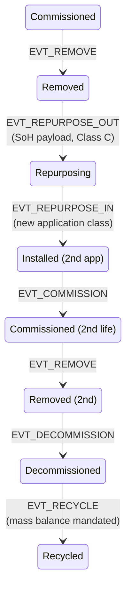

# Extending the Model — Wind, Storage, and Broader IoT Renewable Assets

## What This Chapter Covers

The framework was developed on solar because solar is the hard case for volume and
the module is the hard case for passivity. This chapter tests the framework's
claim to generality: it maps the identity, binding, and lifecycle machinery onto
battery storage (where the EU passport regulation makes the exercise mandatory
rather than speculative), wind-turbine components (where unit values are high and
provenance disputes are mature), and the long tail of renewable-adjacent IoT
hardware. The organizing question for each asset class is the same triple the
solar chapters answered: *what is the unit of identity, what binds it, and which
lifecycle events carry the value?* The chapter closes with the interoperability
problem — across asset classes, vendors, and jurisdictions — which deployment
makes unavoidable and which the passport regulations are quietly deciding.

## 12.1 The Generalization Test

A framework generalizes if its abstractions carry over while only its parameters
change. The candidate abstractions from Parts I–III: the four identity properties
(Section 1.2); active-versus-passive binding with the R1–R6 requirements
(Sections 3.3–3.4, 6.5); the envelope-plus-state-machine event model (Chapter 5);
tiered assurance (Section 6.7); and the three-zone privacy topology (Chapter 10).
The claim to be tested class by class: **only the binding modality and the event
vocabulary's payload schemas are asset-specific; everything else is
configuration.** Table 12.1 previews the result.

**Table 12.1** The framework mapped across asset classes.

| | PV module | Battery pack/cell | Wind blade/bearing | Inverter-class IoT |
|---|---|---|---|---|
| Unit of identity | Module (cell optional) | Pack; module; **cell is the open question** | Component (blade, bearing, gearbox stage) | Device |
| Binding | Passive: defect map / EL (Ch. 6) | Active at pack (BMS); passive electrochemical at cell | Passive: material/structural signatures + embedded tags | Active: secure element |
| Hardest lifecycle stage | Secondary resale | **Second life & chemistry drift** | Repair provenance | Firmware churn |
| Value-bearing events | Commission, condition, transfer | SoH records, repurposing, recycle (mandated) | Repair/inspection, load-history milestones | Attestation, config change |
| Regulatory driver | ESPR candidate | **Battery Reg. 2023/1542 — live** | Type-cert regimes | Grid codes (Ch. 10) |
| Framework deltas | — (the baseline) | SoH payload schemas; repurposing event pair | Load-milestone events; repair sub-DAG | Config-change events; attestation cadence |

## 12.2 Battery Storage: The Regulated Case

Batteries invert two solar assumptions, and the inversions are instructive.

**The asset is chemically alive.** A module's identity anchor is structure that
manufacturing froze; a cell's electrochemistry evolves by design with every
cycle. The stable/condition decomposition of Section 6.3 still applies but the
balance shifts: less of the measurable signature is stable, and the *condition
layer becomes the commercially dominant record* — state of health is the price of
a used battery. Binding follows Section 3.3 at pack level (the BMS is a computer;
secure-element identity is straightforward and increasingly mandated in effect by
passport data requirements) — while *cell-level* identity remains genuinely open:
cells are numerous, passive to the outside, and repackaged during refurbishment
precisely when identity matters most. Candidate passive anchors (impedance-
spectroscopy signatures, formation-process fingerprints) currently fail R2 or R6
of Table 6.2, and this book flags rather than solves it (→ Chapter 14). The
honest interim: pack-level binding, cell-level *composition manifests* committed
at manufacture and re-attested at every repackaging, so that cell substitution is
at least a Class-C attributable event rather than an invisible one.

**Second life is a first-class path, not an edge case.** The solar state machine
needed `Removed → InTransit` for resale; batteries need a richer structure: a
*repurposing* event pair (`EVT_REPURPOSE_OUT` from vehicle service,
`EVT_REPURPOSE_IN` to stationary service) carrying mandatory SoH payloads,
because the EU regulation makes repurposers legally responsible parties and the
passport must document the transition. Figure 12.1 extends Figure 5.1
accordingly — the extension is *additive*: no solar state or transition changed,
which is the generalization claim passing its first test.

**Figure 12.1** Battery lifecycle extension to the Chapter 5 state machine.
Unshaded states are inherited unchanged from Figure 5.1.

**The passport is a projection, and the projection was already designed.**
Section 10.4 argued the event schema must project onto passport data models; for
batteries this is now a compliance exercise with a deadline. The mapping is
mechanical — passport identity attributes from `EVT_REGISTER`, performance and
durability fields from condition records, supply-chain due-diligence attestations
as VCs, access tiers onto the three-zone topology — and the read-side mapping
layer of Section 10.4 becomes the passport interface. What the regulation does
*not* supply is exactly what this book's architecture adds: verification. A
passport whose SoH field is a self-declaration reproduces Chapter 1's problem in
a new format; a passport whose fields resolve to anchored, instrument-attested,
corroborated events is the difference between paperwork and evidence. This is
the book's thesis restated in regulatory clothing, and it is why battery
deployments are likely to adopt the architecture before solar ones do: the
record-keeping is already mandatory, so the marginal cost of making it
*verifiable* is small.

## 12.3 Wind: High Value, Low Volume, Mature Disputes

Wind inverts solar's economics: a blade set or main bearing carries the value of
thousands of modules, unit counts are in the tens of thousands rather than
hundreds of millions, and the provenance disputes are already institutionalized
(serial-number confusion across repair shops, undocumented blade repairs
surfacing in resale and insurance, gearbox refurbishment chains). The framework
maps with three adaptations:

- **Component-level DIDs with an assembly DAG.** The turbine is a long-lived
  *assembly* whose components individually detach for repair and return — or
  don't return. The `prior_refs` DAG (Section 5.4) already expresses
  composition; wind makes it the primary structure: a nacelle's identity is a
  slowly-changing graph of component identities, and the valuable query is "show
  me this bearing's custody and repair history across its three host turbines."
- **Passive binding is easier here, and cheaper options suffice.** Blades are
  large composite structures with rich manufacturing individuality (ply layup
  texture, cured-resin signatures readable by ultrasonic or thermographic scan)
  and — decisive difference — per-unit values that justify embedded secure tags
  at manufacture. R3's forgery asymmetry is comfortable; the binding research
  frontier that Chapter 6 needed for modules is optional insurance for blades.
- **Load history milestones as events.** A blade's remaining life is a function
  of its load history, which lives in high-volume SCADA streams (off-chain,
  Table 4.1's logic unchanged). The adaptation: periodic *load-milestone* events
  — attested aggregates (equivalent-fatigue-cycle counters) committed at
  inspection boundaries — so that resale and insurance decisions have anchored
  fatigue evidence without the ledger touching telemetry. This pattern
  (aggregate-then-commit at decision boundaries) is wind's contribution back to
  the general framework; it retrofits directly onto battery cycle-count and
  solar soiling-loss records.

## 12.4 The Long Tail: Inverter-Class IoT and the Firmware Problem

Chargers, gateways, meters, tracker controllers, heat-pump controllers: active
binding per Section 3.3, lifecycle per Chapter 5, nothing new — except the one
dimension solar underweights: **mutable software on a fixed device.** For these
assets the config/firmware state is safety- and grid-relevant (IEEE 1547
settings, inverter grid-support curves), changes hundreds of times over a
service life, and is invisible to physical binding. The adaptation: a
`EVT_CONFIG_CHANGE` event class carrying firmware/config digests signed by the
device's secure element *and* the party commanding the change, giving the DSO of
Section 10.4 a verifiable answer to "what code, what settings, since when" — the
device-identity equivalent of the calibration chain instruments already have
(Section 4.5, Rule 3). The threat model gains F12, malicious-update-with-valid-
keys, which is bounded the same way F10 was: dual authorization and
attributability, not cryptographic prevention.

## 12.5 Interoperability: The Problem Deployment Forces

A fund owns solar, storage, and wind; a recycler receives all three; an insurer
underwrites the portfolio. If each asset class — worse, each vendor — carries its
own identity scheme, the verification cost the architecture eliminated returns
as integration cost. Three interoperability layers, in order of difficulty:

**Table 12.2** Interoperability layers and their current state.

| Layer | Requirement | Instrument | State of play |
|---|---|---|---|
| Envelope | One event envelope, one DID resolution path across classes | This book's schema; W3C DID/VC | Achievable now by design discipline |
| Payload semantics | Shared vocabularies per domain (SoH, fatigue, degradation) | Passport delegated acts; IEC TC82/TC88/TC21 work | Fragmentary; passports forcing convergence |
| Binding verification | Cross-vendor template & threshold standards (§11.7 problem 2) | Does not exist | The genuine gap (→ Ch. 14) |

The envelope layer is the argument for the federated topology one more time:
class- or jurisdiction-specific consortium ledgers, mutually anchored, sharing
the envelope and DID method — so a portfolio verifier runs one Step-1/Step-2
client against all of them (the third independent requirement to land on
federation, after scalability in Section 7.4 and data residency in Section 10.4;
by now the pattern has earned its place as the default deployment shape). The
payload layer is being settled, de facto, by the EU passport delegated acts —
whoever writes those data models is writing the sector's shared vocabulary, a
point Chapter 14 makes with some urgency for the PV act still in motion. The
binding layer has no standards body engaged at all, and it is where this book's
research community has the most to contribute and the least time to do it: once
large fleets enroll under proprietary template formats, the switching costs will
entrench whatever shipped first.

## 12.6 Chapter Summary

The generalization test passes with informative strain. Batteries keep the whole
apparatus but shift its center of gravity from identity toward condition — pack-
level active binding is easy, cell-level binding is genuinely open, and the EU
passport regime converts the architecture from proposal into compliance
infrastructure with a verification upgrade. Wind keeps the apparatus and relaxes
its economics — component DAGs, embedded tags, and load-milestone aggregates
suffice where solar needed the full defect-map machinery. The IoT tail
contributes the firmware problem and its config-change event class. Across all
classes the deltas were payload schemas, a few event types, and binding
modalities — the envelope, state machine, tiering, zones, and governance carried
unchanged, which is what "framework" is supposed to mean. The unresolved
frontier is interoperability's third layer, cross-vendor binding verification,
where standardization has not begun. What generality earns, economics must
justify — Chapter 13 prices it.

## References and Further Reading

1. Regulation (EU) 2023/1542, Annex XIII (battery passport data requirements)
   and Articles 73–74 (repurposing responsibilities).
2. Neubauer, J., and A. Pesaran. "The Ability of Battery Second Use Strategies
   to Impact Plug-in Electric Vehicle Prices and Serve Utility Energy Storage
   Applications." *Journal of Power Sources* 196, no. 23 (2011): 10351–10358.
3. Birkl, C. R., M. R. Roberts, E. McTurk, P. G. Bruce, and D. A. Howey.
   "Degradation Diagnostics for Lithium Ion Cells." *Journal of Power Sources*
   341 (2017): 373–386.
4. International Electrotechnical Commission. *IEC 61400 series: Wind Energy
   Generation Systems* (design and component certification context). Geneva:
   IEC.
5. Nielsen, J. S., and J. D. Sørensen. "On Risk-Based Operation and Maintenance
   of Offshore Wind Turbine Components." *Reliability Engineering & System
   Safety* 96, no. 1 (2011): 218–229.
6. IEEE Standards Association. *IEEE 1547-2018* (DER interconnection settings
   context for §12.4). IEEE, 2018.

\newpage
