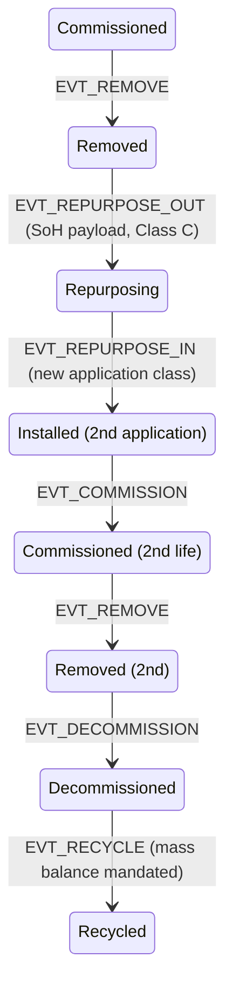

# Extending the Model — Wind, Storage, and Broader IoT Renewable Assets

## What This Chapter Covers

The framework was developed on solar because solar is the hard case for volume and
the module is the hard case for passivity. This chapter tests the framework's
claim to generality: it maps the identity, binding, and lifecycle machinery onto
battery storage (where the EU passport regulation makes the exercise mandatory
rather than speculative, and where a worked second-life transaction shows
the whole apparatus running in its new dialect), wind-turbine components
(where unit values are high,
provenance disputes are mature, and a blade's biography exercises the
repair loop solar barely has), and the long tail of renewable-adjacent IoT
hardware with its firmware problem and its aggregation-layer boundary. The
organizing question for each asset class is the same triple the
solar chapters answered: *what is the unit of identity, what binds it, and which
lifecycle events carry the value?* — applied under an explicit test
discipline that measures every class by the size of its diff against the
base framework. The chapter then runs the framework's edges (hydrogen,
flow batteries, grid primary equipment, commodity BOS) to find where it
stops paying, and closes with the interoperability
problem — across asset classes, vendors, and jurisdictions — which deployment
makes unavoidable and which the passport regulations are quietly deciding.

## 12.1 The Generalization Test

A framework generalizes if its abstractions carry over while only its parameters
change. The candidate abstractions from Parts I–III: the four identity properties
(Section 1.2); active-versus-passive binding with the R1–R6 requirements
(Sections 3.3–3.4, 6.5); the envelope-plus-state-machine event model (Chapter 5);
tiered assurance (Section 6.7); and the three-zone privacy topology (Chapter 10).
The claim to be tested class by class: **only the binding modality and the event
vocabulary's payload schemas are asset-specific; everything else is
configuration.** Table 12.1 previews the result.

What the solar baseline actually consists of, recapped in one paragraph
so this chapter's diffs have their referent: unit identity at the module
with composition downward and aggregation upward (Section 1.2.2, 3.6.1);
EL-plus-defect-map passive binding under the challenge protocol for the
passive population, secure elements for the active one (Chapters 3, 6);
the eighteen-type event vocabulary on the nine-state machine with
corroboration classes (Chapter 5); Merkle-batched writes, anchored
consortium consensus, replicated custody (Chapters 4, 7); tiered
assurance V0–V3 (Section 3.6); three-zone privacy with selective
disclosure (Chapter 10); and the governance apparatus of accreditation,
registers, and agreements (Chapters 8–10). Every clause of that sentence
is about to be stress-tested by an asset that differs from a solar module
in some load-bearing way.

The test's method deserves a sentence, because generalization claims fail
by hand-waving. For each asset class, the chapter answers the organizing
triple concretely (unit of identity, binding mechanism against R1–R6,
value-bearing events), checks each answer against the class's economics
per Section 1.3's discipline, and reports the *deltas* — every place the
class forced an addition or an exception — because a framework's honest
measure is the size of its diff, not the enthusiasm of its abstract. The
solar chapters' machinery is taken as the base; a delta that touches only
payload schemas and added event types passes; a delta that would touch the
envelope, the state machine's existing transitions, or the verification
workflow's structure fails, and the chapter says so where it happens
(cell-level binding being the standing failure). The chapter's route:
batteries first and longest (Section 12.2), because regulation has made
them the forcing case; wind (12.3) for the high-value, repair-loop
inversion; the IoT tail (12.4) for the firmware dimension; the
interoperability problem and its venues (12.5); and the framework's
edges and outward export (12.6), where the honest boundary-drawing
lives.

**Table 12.1** The framework mapped across asset classes.

| | PV module | Battery pack/cell | Wind blade/bearing | Inverter-class IoT |
|---|---|---|---|---|
| Unit of identity | Module (cell optional) | Pack; module; **cell is the open question** | Component (blade, bearing, gearbox stage) | Device |
| Binding | Passive: defect map / EL (Ch. 6) | Active at pack (BMS); passive electrochemical at cell | Passive: material/structural signatures + embedded tags | Active: secure element |
| Hardest lifecycle stage | Secondary resale | **Second life & chemistry drift** | Repair provenance | Firmware churn |
| Value-bearing events | Commission, condition, transfer | SoH records, repurposing, recycle (mandated) | Repair/inspection, load-history milestones | Attestation, config change |
| Regulatory driver | ESPR candidate | **Battery Reg. 2023/1542 — live** | Type-cert regimes | Grid codes (Ch. 10) |
| Framework deltas | — (the baseline) | SoH payload schemas; repurposing event pair | Load-milestone events; repair sub-DAG | Config-change events; attestation cadence |

Reading the table's rows against each other yields the chapter's
comparative anatomy. The *unit of identity* row shows the custody-and-
liability rule of Section 1.2.2 producing different answers from the same
principle — module, pack, component, device — with the open question
(cells) flagged rather than fudged. The *binding* row is the R1–R6
requirements meeting four different physics, and its pattern is
instructive: binding difficulty tracks passivity and unit economics, not
asset sophistication — the humble module remains the hardest case in the
book. The *hardest-stage* row locates each class's fraud economics where
its information asymmetry peaks. And the *regulatory driver* row explains
adoption sequencing better than any technology argument: batteries move
first because law moved first.

## 12.2 Battery Storage: The Regulated Case

The regulatory context first, since it reorders every priority. The EU
Battery Regulation entered into force in 2023 with obligations phasing
through the decade: carbon-footprint declarations, due-diligence duties,
and — from February 2027 — the digital passport for EV, light-transport,
and industrial batteries above 2 kWh, hosted by the economic operator,
carried via a unique identifier on the battery, with data obligations
running through repurposing and recycling actors to end of life.
Analogous frameworks are moving in other jurisdictions at varying speeds,
and the global battery industry, being global, will in practice build to
the strictest common denominator. For this book the consequence is
blunt: the record-keeping argument of Parts I–II is *settled by statute*
for this asset class, and the open question is only whether the mandated
records will be worth anything — which is the verification question the
architecture answers.

Batteries invert two solar assumptions, and the inversions are
instructive — the first about what the binding can anchor to, the second
about which lifecycle paths carry the money.

**The asset is chemically alive.** A module's identity anchor is structure that
manufacturing froze; a cell's electrochemistry evolves by design with every
cycle. The stable/condition decomposition of Section 6.3 still applies but the
balance shifts: less of the measurable signature is stable, and the *condition
layer becomes the commercially dominant record* — state of health is the price of
a used battery. Binding follows Section 3.3 at pack level (the BMS is a computer;
secure-element identity is straightforward and increasingly mandated in effect by
passport data requirements) — while *cell-level* identity remains genuinely open:
cells are numerous, passive to the outside, and repackaged during refurbishment
precisely when identity matters most. Candidate passive anchors (impedance-
spectroscopy signatures, formation-process fingerprints) currently fail R2 or R6
of Table 6.2, and this book flags rather than solves it (→ Chapter 14). The
failure modes are worth one diagnostic sentence each, since they define
the research target: impedance signatures carry genuine per-cell
individuality (electrode microstructure, electrolyte wetting) but the
features drift with exactly the cycling the identity must survive —
an R2 failure unless a cycling-invariant subspace can be isolated, which
is open problem M4's precise statement; formation-process fingerprints
(the first-cycle voltage traces manufacturers already record) are stable
*records* but not re-measurable *properties* — verification would compare
a stored curve against a stored curve, which authenticates the paperwork,
not the cell (the Section 1.2.1 distinction, biting again); and optical
or structural approaches face the R6 wall that cells live inside welded
packs, measurable only at manufacture and teardown. A modality that
survives cycling, re-measures through the pack, and prices at cell
economics would close the gap; nothing published does all three. The
honest interim: pack-level binding, cell-level *composition manifests* committed
at manufacture and re-attested at every repackaging, so that cell substitution is
at least a Class-C attributable event rather than an invisible one.

The SoH record deserves the same oracle discipline the solar chapters gave
condition imaging, because it is where the battery money argues — a used
pack's price *is* its SoH claim multiplied by trust in the claimant, and
the second factor is what this architecture manufactures.
State of health is not a measurement but an *estimate* — a model over
capacity tests, impedance, and cycle history, sensitive to temperature,
rest state, and the estimator's own algorithm — so the schema treats an
SoH attestation the way Chapter 6 treats a template: the claim carries its
method (protocol version, pre-conditioning state per Section 8.4's
battery-spoofing note, the raw measurement digests behind it), and
verifiers weight SoH numbers by the method's grade rather than treating
all percentages as equal. The BMS's own lifetime telemetry — cycle
counts, temperature histograms, abuse-event flags, signed under the
pack's element identity — enters as the aggregate-then-commit pattern
borrowed from wind (Section 12.3): periodic *usage-milestone* events
whose payloads summarize the operational history that SoH models consume.
The composition works: an attested milestone trail plus a method-graded
SoH measurement at transition is a second-life valuation input that no
party can quietly improve, which is precisely the missing instrument of
Section 1.4.4's battery lemons problem.

Safety events add a battery-specific record class with regulatory teeth:
thermal incidents, abuse events flagged by the BMS, and transport-
classification changes (a damaged pack becomes dangerous goods with
different carriage rules) all demand the same contemporaneous, attributed,
non-repudiable treatment the schema gives everything else — and the
incident record travels with the pack's identity into every downstream
decision, because the party least likely to disclose a thermal event
voluntarily is exactly the party selling the pack. Insurers of
second-life installations have begun asking for precisely this record;
the schema's `EVT_FAULT` class with BMS attestation carries it without
amendment.

The lifecycle flows themselves are more branched than solar's, and the
event vocabulary must follow the branches. An EV pack retiring from
vehicle service forks four ways: direct second-life deployment (the
repurposing pair below), *remanufacture* (disassembly to modules or
cells, reassembly into new packs — which is where cell-level identity's
absence bites hardest, and where the composition-manifest discipline
earns its keep: the new pack's manifest references the donor packs'
DIDs and their milestone trails, preserving lineage even where per-cell
binding fails), *materials recycling* (the mandated mass-balance
terminus), and *warranty return to the OEM* (a custody loop, not a
terminus). Each fork is an event pattern already in the schema's
grammar; what batteries add is the frequency with which assets take
them, and therefore the commercial weight on the paths solar treats as
edge cases.

The actor map differs from solar's in ways that reshape consortium
design. Battery custody chains run through automotive OEMs (whose
warranty and recall machinery dwarfs solar's), fleet operators,
dismantlers and authorized treatment facilities, repurposers (a new
legally-defined actor class the regulation created), integrators, and
recyclers under mandatory take-back — with the automotive OEM holding
both the manufacturing records and, through the vehicle relationship,
the usage telemetry that solar's fragmented chain never concentrated in
one place. The consortium-composition consequence: battery federations
will orbit the automotive OEMs' gravitational mass, and the
adverse-interest discipline of Section 7.5 has to be *constructed*
deliberately (independent repurposers, insurers, and recyclers seated
with real weight) where solar's fragmentation provided it for free. The
concentration also simplifies one hard solar problem: retroactive
enrollment of the existing pack fleet is largely an OEM database export
plus re-attestation, not a field campaign — the records exist; they need
anchoring and portability, which is the cheaper half of this book.

The battery section's forecast, stated for Chapter 14 to grade: the
first production-grade deployment of this book's full architecture —
binding, events, anchoring, verification services — will be a battery
deployment, driven by the passport deadline, organized around an
automotive OEM's compliance program, with its verification layer
retrofitted onto a records system built first for the regulation's
minimum. The architecture was designed so that this retrofit is a
projection-layer inversion rather than a rebuild, and the design's
market test is whether that proves true.

The lithium supply chain's upstream — mining, refining, precursor and
cathode production — extends the composition-reference machinery
(Section 4.3) into the territory the due-diligence articles regulate:
each stage's attestations chain into the cell batch's manifest, so the
pack's passport can substantiate origin claims at the depth the
regulation demands without any party holding the whole chain's data. The
caveat from Section 10.4 travels unchanged: the chain authenticates
*declarations*, and mineral-origin fraud upstream of the first attested
stage remains a procedural problem for audit regimes — the ledger
sharpens the paper trail's teeth; it does not visit the mine.

**Second life is a first-class path, not an edge case.** The solar state machine
needed `Removed → InTransit` for resale; batteries need a richer structure: a
*repurposing* event pair (`EVT_REPURPOSE_OUT` from vehicle service,
`EVT_REPURPOSE_IN` to stationary service) carrying mandatory SoH payloads,
because the EU regulation makes repurposers legally responsible parties and the
passport must document the transition. Figure 12.1 extends Figure 5.1
accordingly — the extension is *additive*: no solar state or transition changed,
which is the generalization claim passing its first test. Reading the
figure: the second-life states are the base machine's states with an
application-context annotation, not new lifecycle physics — an asset in
"Commissioned (2nd life)" accepts exactly the base state's events, and a
verifier's traversal crosses the repurposing boundary as one more edge in
the DAG, inheriting the first life's history rather than starting a
second file. The one deliberate asymmetry: there is no arrow *back* from
second-life states to first-life application classes, because a pack
does not return to vehicle service under any regulation now drafted, and
the state machine encodes the prohibition rather than trusting policy to
remember it.

**Figure 12.1** Battery lifecycle extension to the Chapter 5 state machine.
Unshaded states are inherited unchanged from Figure 5.1; the figure shows
only the extension's neighborhood, since everything upstream of the first
`Removed` is the base machine verbatim.

**The passport is a projection, and the projection was already designed.**
Section 10.4 argued the event schema must project onto passport data models; for
batteries this is now a compliance exercise with a deadline. The mapping is
mechanical — passport identity attributes from `EVT_REGISTER`, performance and
durability fields from condition records, supply-chain due-diligence attestations
as VCs, access tiers onto the three-zone topology — and the read-side mapping
layer of Section 10.4 becomes the passport interface. Table 12.3 exhibits
the mapping's shape for the regulation's principal field groups.

**Table 12.3** Battery-passport field groups (Regulation 2023/1542,
Annex XIII) and their sources in the event schema.

| Passport field group | Schema source | Verifiability upgrade over self-declaration |
|---|---|---|
| Identity, model, manufacturer | `EVT_REGISTER` + manufacturer VCs | Anchored issuance; registrar accreditation |
| Composition, materials, hazardous substances | Composition manifests + upstream VCs (§4.3) | Attributable supply-chain chain-of-claims |
| Carbon footprint declaration | Manufacturer VC with method reference | Method-graded, contestable, dated |
| Performance & durability (capacity, SoH, expected life) | Method-graded SoH attestations + usage milestones | Instrument attestation; pre-conditioning recorded |
| Circularity: repair, repurposing, dismantling info | Repair/repurposing events + documentation payloads | Events, not brochures — history, not intentions |
| Supply-chain due diligence | Due-diligence VCs per reporting period | Anchored, versioned, auditable |
| Labels & certifications | Certification VCs | Revocation-visible (§3.5.1) |

What the regulation does
*not* supply is exactly what this book's architecture adds: verification. A
passport whose SoH field is a self-declaration reproduces Chapter 1's problem in
a new format; a passport whose fields resolve to anchored, instrument-attested,
corroborated events is the difference between paperwork and evidence. This is
the book's thesis restated in regulatory clothing, and it is why battery
deployments are likely to adopt the architecture before solar ones do: the
record-keeping is already mandatory, so the marginal cost of making it
*verifiable* is small.

A second-life transaction, walked end to end, assembles the battery
machinery the way Section 11.3's scenarios did solar's — and it is the
transaction the passport regulation's drafters had in mind, so consider
it the compliance regime's own use case, run properly. A fleet operator
retires 400 EV packs; a storage integrator bids for them. Under the
passport-minimum world, the integrator receives 400 self-declared SoH
percentages and prices for the worst case (the Section 1.4.4 lemons
discount, unchanged by the passport's existence). Under the full
architecture: each pack's DID resolves to its milestone trail (BMS-signed
usage history), its retirement `EVT_REPURPOSE_OUT` carries a
method-graded SoH measurement performed under recorded pre-conditioning
by an accredited facility, and the integrator's client runs Steps 1–2
across the lot in an afternoon — then draws a pre-committed sample of
twenty packs for independent SoH verification at its own bench (Step 3,
battery dialect). The measured spread against the attested values becomes
the lot's price adjustment, mechanically; the packs re-enter service with
`EVT_REPURPOSE_IN` events binding their first and second lives into one
history; and the integrator's own financing — this is the step that
closes the loop — cites the verified trail, because its lender's
technical advisor consumes the same records. Every mechanism is a solar
mechanism with battery nouns; the delta remains payloads and two event
types. The transaction also names the service industry batteries will
need before solar does: accredited SoH verification facilities — the
battery counterpart of Section 6.7's verification-services tier — whose
bench capacity, accreditation regime, and method proficiency testing are
currently improvised per deal. The passport deadlines will
industrialize this function within the decade; the open question is
whether under the metrological discipline this book keeps advocating or
as another archipelago of proprietary methods.

## 12.3 Wind: High Value, Low Volume, Mature Disputes

Wind inverts solar's economics: a blade set or main bearing carries the value of
thousands of modules, unit counts are in the tens of thousands rather than
hundreds of millions, and the provenance disputes are already institutionalized
(serial-number confusion across repair shops, undocumented blade repairs
surfacing in resale and insurance, gearbox refurbishment chains). The
sector's documentary culture is correspondingly older and thicker —
type-certification regimes, per-component quality dossiers,
inspection-report chains — which changes the pitch: wind does not need
persuading that component history matters (its insurers settled that
argument decades ago); it needs the Chapter 1 diagnosis applied to
records it already keeps expensively — scattered across OEM, operator,
and repair-shop systems, keyed by serials of varying reliability, and
reconstructed manually at every transaction. The framework arrives in
wind as consolidation and verification of an existing practice rather
than the creation of one, which lowers adoption friction and raises the
integration bill in equal measure. The framework
maps with four adaptations:

- **Component-level DIDs with an assembly DAG.** The turbine is a long-lived
  *assembly* whose components individually detach for repair and return — or
  don't return. The `prior_refs` DAG (Section 5.4) already expresses
  composition; wind makes it the primary structure: a nacelle's identity is a
  slowly-changing graph of component identities, and the valuable query is "show
  me this bearing's custody and repair history across its three host turbines."
  The aggregate-identity test of Section 3.6.1 gives the turbine itself a
  DID (external parties verify claims about the turbine as such —
  certification, insurance, repowering sales), while the tower sections
  and fasteners stay compositional; the interesting boundary case is the
  gearbox, which trades as a unit through refurbishment pools and
  therefore earns full identity despite living its whole life inside
  assemblies. The refurbishment pool is worth dwelling on because it is
  the sector's standing identity crisis: a failed gearbox ships to a
  rebuild shop and an *equivalent* — rebuilt from the pool's parts stock,
  possibly containing components from a dozen donors — ships back, with
  the operator's records typically tracking the exchange as a repair
  rather than the component swap it is. The framework's answer is the
  remanufacture pattern from batteries (Section 12.2): the returned
  unit is a new identity whose composition manifest references its donor
  components' DIDs and their load histories, so the operator's fatigue
  accounting runs on the actual internals rather than the nameplate — a
  change the insurers of gearbox failures, the sector's costliest
  recurring claim class, have every incentive to demand.
- **Passive binding is easier here, and cheaper options suffice.** Blades are
  large composite structures with rich manufacturing individuality (ply layup
  texture, cured-resin signatures readable by ultrasonic or thermographic scan)
  and — decisive difference — per-unit values that justify embedded secure tags
  at manufacture. R3's forgery asymmetry is comfortable; the binding research
  frontier that Chapter 6 needed for modules is optional insurance for blades.
  The R-dossier, run quickly for the record: entropy (R1) is abundant in
  layup and cure stochastics; the stable subset (R2) is friendlier than
  solar's because composite internal structure, barring damage, does not
  evolve in service the way crack networks do; challenge parameterization
  (R4) is available through multi-angle ultrasonic response; evolution
  plausibility (R5) maps onto the well-developed composite damage-
  progression literature; and field feasibility (R6) rides the ultrasonic
  inspection regime blades already undergo. Only enrollment logistics
  differ in kind: a 70-meter blade is fingerprinted in sections, with the
  section map part of the template.
- **Turbine controllers are the IoT tail at nacelle scale.** The
  config-change class of Section 12.4 applies verbatim — a turbine's
  control firmware determines its loads, so the firmware history is
  *fatigue-relevant*, coupling the software record to the structural one
  in a way no other class exhibits — and F12's dual-authorization
  discipline matters at proportionally higher stakes.
- **Load history milestones as events.** A blade's remaining life is a function
  of its load history, which lives in high-volume SCADA streams (off-chain,
  Table 4.1's logic unchanged). The adaptation: periodic *load-milestone* events
  — attested aggregates (equivalent-fatigue-cycle counters) committed at
  inspection boundaries — so that resale and insurance decisions have anchored
  fatigue evidence without the ledger touching telemetry. This pattern
  (aggregate-then-commit at decision boundaries) is wind's contribution back to
  the general framework; it retrofits directly onto battery cycle-count and
  solar soiling-loss records.

A blade biography, compressed, to show the machinery running on wind's
characteristic path — the *repair loop* that solar barely has. Blade
B-7741 enrolls at manufacture (sectioned ultrasonic template, embedded
tag, materials manifest), installs on turbine T-112, and accumulates
load-milestone events at each annual inspection. Year nine: lightning
damage; `EVT_FAULT` with drone imagery; the blade ships to a repair
facility — custody transfers, a *repair* event class (wind's main
vocabulary addition) carrying the repair scope, materials, and post-repair
ultrasonic re-verification whose comparison against the enrollment
template both confirms identity and documents the repair's structural
footprint; the blade returns to a *different* turbine, T-089, whose
assembly DAG updates. Year seventeen, repowering: the blade's documented
fatigue budget — milestone trail plus two repairs — prices it for a
secondary deployment in a lower-wind market rather than the scrapyard,
the same deadweight-rescue economics as solar's Section 1.4.4, at three
orders of magnitude higher unit value. Every event in the biography used
base-schema machinery except the repair class and the milestone
aggregates: a two-item delta for a sector whose provenance disputes
predate solar's entire existence.

Offshore wind sharpens every number in the onshore story and adds one
structural wrinkle. Component values multiply (installation vessels cost
more per day than most repairs cost outright, so *avoiding one unnecessary
jack-up campaign* can justify a plant's entire identity infrastructure);
inspection access is scarce and weather-gated, which raises the value of
remote Step-1/2 verification precisely because Step-3 visits are gold;
and the marine environment accelerates the degradation phenomena the
condition records track. The wrinkle is jurisdictional: offshore assets
sit in exclusive economic zones under layered regulatory regimes, their
components rotate through onshore repair pools serving farms in multiple
countries, and the federation topology (Section 7.4) meets its most
demanding test — a bearing's custody chain can cross three ledgers in one
repair cycle, exercising the cross-federation traversal at a frequency
onshore fleets never will.

Institutionally, wind's adoption path runs through different doors than
solar's: the OEMs are few, vertically powerful, and already operate
proprietary component-tracking systems — so the realistic first
deployment is an OEM opening its existing records to the verification
layer (anchoring, third-party proofs) rather than a consortium building
from zero, with the independence problem (Chapter 1's vendor-cloud
critique) addressed by anchoring and portability obligations negotiated
into service contracts by the operators and insurers who hold the
commercial leverage. It is a different route up the same mountain, and
the framework's platform-neutrality (Section 2.6) exists precisely so
that both routes arrive at interoperable records. The sector's data
politics are the route's real gradient: turbine operational data is
already a contested asset between OEMs (who want service-contract
exclusivity) and operators (who want maintenance-market competition),
with regulators increasingly interested in the competition question —
and the identity layer, which needs only sparse evidential extracts,
offers both sides a settlement surface: the operator gets portable,
verifiable component histories that make third-party maintenance
biddable; the OEM keeps its high-frequency telemetry moat. Whether the
parties take the settlement is commerce, not architecture; the
architecture's job was to make it available.

## 12.4 The Long Tail: Inverter-Class IoT and the Firmware Problem

The long tail's population deserves a moment's enumeration before its
common problem, because its diversity is the point. EV chargers (tens of
millions of units, commerce-critical, publicly sited); smart meters (the
solved precedent of Section 3.3.1, now a component population inside this
framework); residential and C&I gateways and energy managers (the
orchestration layer of the behind-the-meter world); tracker controllers
and the emerging robotic-cleaner fleets (mobile assets whose own custody
histories matter); heat-pump and EV-charging controllers in the
electrified-heat segment. All share the profile: active
binding per Section 3.3, lifecycle per Chapter 5, nothing new — except the one
dimension solar underweights: **mutable software on a fixed device.** For these
assets the config/firmware state is safety- and grid-relevant (IEEE 1547
settings, inverter grid-support curves), changes hundreds of times over a
service life, and is invisible to physical binding. The adaptation: a
`EVT_CONFIG_CHANGE` event class carrying firmware/config digests signed by the
device's secure element *and* the party commanding the change, giving the DSO of
Section 10.4 a verifiable answer to "what code, what settings, since when" — the
device-identity equivalent of the calibration chain instruments already have
(Section 4.5, Rule 3). The threat model gains F12, malicious-update-with-valid-
keys, which is bounded the same way F10 was: dual authorization and
attributability, not cryptographic prevention.

The config-change class needs volume discipline or it swallows the
evidential tier: a national charger fleet's routine update campaigns
would generate millions of identical events. The answer is the batching
grammar already built — campaign-level events committing a Merkle root
over per-device confirmations, each device's inclusion individually
provable (Section 7.2's pattern, third reuse) — plus a severity taxonomy:
grid-behavioral changes (protection settings, support curves) are
evidential events per device; cosmetic firmware revisions travel as
campaign aggregates. The DSO subscription then filters at exactly the
severity boundary its codes care about.

The aggregation layer above the devices — virtual power plants, demand-
response fleets, flexibility markets — deserves its boundary statement,
because it is where this framework most often gets over-sold. An
aggregator's settlement records, dispatch histories, and baseline
calculations are *market* data with their own integrity regimes; the
asset-identity layer's contribution is the substrate those regimes
currently lack — verifiable device identity, certified capability
(config-change history), and location class for the fleet an aggregator
claims to control. "Which devices, with what certified behavior, does
this VPP actually command?" is an asset-identity question this
architecture answers; "did the VPP deliver its flexibility bid?" is a
market-settlement question it deliberately does not. Deployments that
keep the boundary keep both systems honest; those that blur it inherit
the energy-trading scope creep Section 1.6 excluded on page one.

Two class-specific notes complete the long tail. *EV charging
infrastructure* adds a commercial dimension the other classes lack:
chargers are metrologically certified billing instruments, so their
identity records intersect legal metrology (the meter-fleet precedent of
Section 3.3.1 applies nearly verbatim) and their config-change history is
also a *tariff-integrity* record — the regulator's question is not only
"is the grid behavior certified?" but "was the customer billed by the
firmware the certificate covers?" *Heat pumps and behind-the-meter
controllers* stress the privacy design hardest: their operational
patterns are household telemetry of the most intimate kind, and the
architecture's discipline — evidential events sparse and
appliance-focused, operational streams never leaving the home platform,
Chapter 10's zones enforced at the schema — is the difference between an
asset registry and a surveillance system wearing one's clothes. The
residential interface-austerity note of Section 10.2 was written for
solar and applies here with the volume turned up.

The long tail's conformance economics close its treatment: these device
classes ship in millions from dozens of vendors into certification
regimes (metering directives, charging-infrastructure regulations,
appliance standards) that already operate type-approval machinery. The
framework's asks — secure elements, attested firmware, config-change
events — are cheapest to impose *inside* those existing regimes as
certification criteria rather than beside them as consortium
requirements, which is the meter fleets' lesson (Section 3.3.1)
generalized: where a certification chokepoint exists, use it; the open
market's long tail is exactly the population for which voluntary
consortium adoption moves slowest and regulatory reference moves
fastest.

## 12.5 Interoperability: The Problem Deployment Forces

A fund owns solar, storage, and wind; a recycler receives all three; an insurer
underwrites the portfolio. If each asset class — worse, each vendor — carries its
own identity scheme, the verification cost the architecture eliminated returns
as integration cost — and the cross-class actors are not edge cases but
the *value-bearing* cases: Chapter 13 will show that insurers, lenders,
and recyclers, the parties whose verification demand drives adoption, are
all portfolio parties by construction. Interoperability is therefore not
a phase-two nicety; it is the adoption engine's fuel line. Three
interoperability layers, in order of difficulty:

**Table 12.2** Interoperability layers and their current state. The rows
order by difficulty is also their order of consequence: an envelope
mismatch costs an adapter; a vocabulary mismatch costs analytics; a
binding mismatch costs the ability to verify at all.

| Layer | Requirement | Instrument | State of play |
|---|---|---|---|
| Envelope | One event envelope, one DID resolution path across classes | This book's schema; W3C DID/VC | Achievable now by design discipline |
| Payload semantics | Shared vocabularies per domain (SoH, fatigue, degradation) | Passport delegated acts; IEC TC82/TC88/TC21 work | Fragmentary; passports forcing convergence |
| Binding verification | Cross-vendor template & threshold standards (§11.7 problem 2) | Does not exist | The genuine gap (→ Ch. 14) |

The envelope layer is the argument for the federated topology one more time:
class- or jurisdiction-specific consortium ledgers, mutually anchored, sharing
the envelope and DID method — so a portfolio verifier runs one Step-1/Step-2
client against all of them (the third independent requirement to land on
federation, after scalability in Section 7.4 and data residency in Section 10.4;
by now the pattern has earned its place as the default deployment shape). The
payload layer is being settled, de facto, by the EU passport delegated acts —
whoever writes those data models is writing the sector's shared vocabulary, a
point Chapter 14 makes with some urgency for the PV act still in motion. The
binding layer has no standards body engaged at all, and it is where this book's
research community has the most to contribute and the least time to do it: once
large fleets enroll under proprietary template formats, the switching costs will
entrench whatever shipped first.

The portfolio verifier's day, walked once, makes the interoperability
stakes concrete. An infrastructure fund's monitoring client wakes to
verify overnight events across its holdings: solar plants on two national
federations, a battery portfolio on a storage-sector consortium, wind
assets on the manufacturer-led ledger their turbines shipped with. At the
envelope layer, one client verifies all four — same DID resolution, same
proof machinery, same anchor checks — *if* the S1/S2 layers hold; today,
with the wind vendor's ledger using its own event grammar, the fund runs
two clients and a translation layer its auditors accept grudgingly. At
the payload layer, the fund's degradation dashboard wants solar
condition records, battery SoH attestations, and blade fatigue milestones
in comparable form; the passport data models will force the convergence
the analytics vendors have not. At the binding layer, the fund's
diligence playbook for acquisitions currently specifies verification
procedures *per vendor ecosystem* — the exact per-relationship cost
Chapter 1 diagnosed, reborn one level up. Every layer's gap is somebody's
integration invoice, and the invoices, not the standards essays, are what
will drive the convergence.

### 12.5.1 Who Convenes the Convergence

Naming the venues, because "standards should exist" is a sentiment and
committee calendars are facts. The *envelope and DID method* work (S1/S2)
has natural homes in ISO/TC 307's DLT program crossed with the sectoral
committees — IEC TC 82 (solar), TC 21 (batteries), TC 88 (wind) — with
the practical path running through a joint working group anchored by
whichever sector's consortium ships a working profile first; running
code has always outvoted position papers in that room. The *payload
vocabulary* is being convened whether the sector likes it or not by the
European Commission's delegated-act machinery with CEN/CENELEC JTC 24
drafting the passport framework standards — which is why this book keeps
urging the measurement community to show up there: the acts will cite
whatever data models exist when their deadlines arrive. The *binding
layer* has no venue, and Section 14.3's proposal (metrology institutes
hosting reference template formats and proficiency testing) needs a
first mover; the concrete suggestion this book can make is that the
IEA-PVPS task structure — which already coordinates the international
measurement community that would do the work — commission the gap
analysis, because its reports have a track record of becoming IEC work
items. Industry alliances (the battery-passport consortia, the DER
interoperability alliances) matter as *profile* builders and pilot
conveners rather than standards authors — their histories suggest they
move fastest and bind least, which is the correct division of labor with
the treaty-grade bodies. The convergence's clock, one last time: fleets
are enrolling now, delegated acts are drafting now, and every year of
venue-shopping is a year of proprietary formats compounding their
switching costs — the S3 window (Section 14.3) does not wait for the
committee that would prefer to be thorough.

Cross-sector event semantics deserve their own caution flag before the
section closes: the same word means differently across classes, and naive
vocabulary sharing manufactures confusion. "Commissioning" starts a solar
warranty, but a battery's warranty typically keys on first charge at the
integrator; "capacity" is nameplate DC for a module, usable energy under
a test protocol for a pack, and a wind-class rating at a reference speed
for a turbine. The schema's answer is namespacing rather than false
unification — event types carry their class vocabulary, projections onto
shared reporting models (passports, portfolio dashboards) do the
translation explicitly and versionably — and the S1 standardization work
should resist the committee temptation to define one "commissioning" for
all assets, which would be wrong for most of them.

## 12.6 Beyond the Big Three: The Framework's Edges

Generalization claims are tested at their edges, so the chapter closes by
running the triple over the asset classes the proposal did not name — and
by stating plainly where the framework stops paying.

**Electrolyzers and fuel-cell systems** map almost boringly well: high
unit values, active binding trivially available (they are instrumented
process plants), stack degradation as the condition record, and an
emerging certification demand — renewable-hydrogen guarantee-of-origin
schemes, whose additionality and temporal-correlation rules need
verifiable equipment identity and commissioning dates as inputs — that
needs exactly the equipment truth layer of Section 10.4.
The delta is payload vocabulary (stack hours, degradation curves,
electrolyte chemistry) and nothing structural; the stack-replacement
cycle even reuses the battery remanufacture pattern without alteration. **Flow batteries and
long-duration storage** split cleanly along the framework's existing
seam: the power-conversion and stack hardware follow the electrolyzer
pattern, while the electrolyte inventory — a bulk *fungible* asset,
tanker-delivered and blended — does not want unit identity at all but
*lot* provenance, the composition-manifest pattern at tank scale. The
electrolyte is the framework's fungibility lesson in one object:
vanadium electrolyte retains value across plant generations and is
already leased as a commodity, and a leased, blended, value-bearing
fluid is tracked the way custody systems have always tracked fungibles —
by lots, transfers, and mass balance — with the ledger adding
attributability to a practice, not identity to molecules.
**Transformers and grid primary equipment** are the confounding easy
case: high value, low count, stationary, already serialized and
registry-tracked by utilities — the framework fits but adds least,
because Section 1.3's distinctive stressors (volume, churn, custody
fragmentation) are absent; the honest pitch there is narrow (supply-chain
integrity for new procurement, given documented counterfeit-component
concerns in grid equipment, plus the composition-manifest treatment of
bushings and tap changers, whose counterfeits are the documented entry
point) rather than lifecycle-total. Where the calculus shifts is the
mobile substation and spare-transformer pools that grid-resilience
programs increasingly maintain — shared, custody-churning assets that
inherit the sector's stressors and, with them, the framework's full
case. **Mounting
structure, cabling, and commodity BOS** sit below the identity
floor: unit values in single dollars, failure modes collective rather
than individual, and no transaction that ever asks about one bracket.
They get batch identity through composition references, and the
framework's discipline is to *resist* enthusiasts who would enroll every
bolt — an identity system's credibility includes knowing what not to
identify.

Emerging PV chemistries belong in the edges section rather than the solar
chapters, because their identity story is genuinely unfinished. Perovskite
and tandem modules will arrive with the same passive-binding needs as
silicon and none of its accumulated defect phenomenology: the stochastic
individuality is certainly present (solution-processed layers are nothing
but process stochastics), but which features are stable (R2), how they
respond to the challenge protocol (R4), and what legal evolution looks
like (R5) are open dossiers — Section 6.8's problem 5, restated as a
deployment gate. The practical sequencing writes itself: these products
will launch under accelerated-degradation scrutiny anyway, and the
instrumented-cohort programs their qualification already requires are the
R-dossier studies wearing different funding labels; the marginal ask is
that they enroll their cohorts under the framework's template discipline
from the first wafer, so the binding science and the product mature
together rather than a decade apart, as silicon's did.

**Microgrids and energy communities**, finally, test the aggregate
machinery rather than any binding: a microgrid is a plant-like legal
object (it holds interconnection and islanding agreements — it passes the
Section 3.6.1 test and earns a DID) whose membership is unusually fluid,
composed of assets under many small owners. The framework handles it as a
membership register with consent-aware events — an asset's enrollment
into a community is a dual-signed event like any custody act — and the
privacy design of Chapter 10 does the heavy lifting, since community
composition is precisely the kind of household-adjacent data the
three-zone model exists to protect.

The general boundary rule, extracted from the edges: the framework pays
where **unit value × information asymmetry × custody churn** clears the
enrollment-plus-governance cost, and the product is a better screen than
any single factor. Batteries clear it spectacularly (all three factors
high); transformers clear on value alone but with thin margins of
benefit; brackets never clear it. Classes that fail the screen still
inherit protection *indirectly* — as composition references inside assets
that pass — which is the framework's graceful floor, and the reason its
edges are boundaries rather than cliffs.

One final generalization runs outward rather than across: nothing in the
framework's core is energy-specific. Manufactured assets with stochastic
structure, multi-decade lives, fragmented custody, and value-bearing
histories exist in construction equipment, rail rolling stock, medical
devices, and aerospace's cost-pressured lower tiers — and each has its
own version of Chapter 1's memory problem. The energy sector's claim to
go first rests on the conjunction this book has traced (regulatory
mandates arriving, unit economics forcing the hard passive-binding
research, decarbonization stakes funding the institutions); the export
of the resulting patterns to adjacent industries is left as the
literature's exercise, with the R1–R6 requirements and the
value-screen rule as the transferable core.

## 12.7 Chapter Summary

The generalization test passes with informative strain, measured in diffs
against a solar baseline recapped at the chapter's head so every delta had
its referent.
Batteries keep the whole
apparatus but shift its center of gravity from identity toward condition —
pack-level active binding is easy; cell-level binding fails R2 or R6 in
every published modality, with the failure modes now stated precisely
enough to aim research at; SoH enters as a method-graded estimate under
the full oracle discipline; the lifecycle forks (second life,
remanufacture, recycling, warranty return) all parse in the base
grammar; and the EU
passport regime converts the architecture from proposal into compliance
infrastructure with a verification upgrade whose field-by-field mapping
Table 12.3 exhibits and whose commercial meaning the worked second-life
transaction demonstrates. Wind keeps the apparatus and relaxes
its economics — component DAGs with the gearbox as the instructive
boundary case, blade fingerprints whose R-dossier reads easier than
solar's, load-milestone aggregates, and a repair loop whose two-item
delta serves a sector whose provenance disputes predate solar's
existence. The IoT tail
contributes the firmware problem, its config-change event class with
campaign-scale batching, the legal-metrology intersection at chargers,
and the aggregation-layer boundary that keeps this framework out of the
market-settlement business. The edges — hydrogen, flow batteries, grid
primary equipment, commodity BOS — locate the value screen (unit value ×
information asymmetry × custody churn) below which identity is
composition reference, not enrollment. Across all
classes the deltas were payload schemas, a few event types, and binding
modalities — the envelope, state machine, tiering, zones, and governance carried
unchanged, which is what "framework" is supposed to mean. The unresolved
frontier is interoperability's third layer, cross-vendor binding
verification, where standardization has not begun and where Section 12.5.1
names the venues that could begin it. And the framework's core, tested across four
asset classes and its own edges, turns out to owe nothing to energy at
all — the export to other manufactured-asset industries waits on nothing
but their own versions of the forcing conditions. What generality earns,
economics must
justify — Chapter 13 prices it.

## References and Further Reading

1. Regulation (EU) 2023/1542, Annex XIII (battery passport data requirements)
   and Articles 73–74 (repurposing responsibilities).
2. Neubauer, J., and A. Pesaran. "The Ability of Battery Second Use Strategies
   to Impact Plug-in Electric Vehicle Prices and Serve Utility Energy Storage
   Applications." *Journal of Power Sources* 196, no. 23 (2011): 10351–10358.
3. Birkl, C. R., M. R. Roberts, E. McTurk, P. G. Bruce, and D. A. Howey.
   "Degradation Diagnostics for Lithium Ion Cells." *Journal of Power Sources*
   341 (2017): 373–386.
4. International Electrotechnical Commission. *IEC 61400 series: Wind Energy
   Generation Systems* (design and component certification context). Geneva:
   IEC.
5. Nielsen, J. S., and J. D. Sørensen. "On Risk-Based Operation and Maintenance
   of Offshore Wind Turbine Components." *Reliability Engineering & System
   Safety* 96, no. 1 (2011): 218–229.
6. IEEE Standards Association. *IEEE 1547-2018* (DER interconnection settings
   context for §12.4). IEEE, 2018.
7. Melin, H. E., et al. "Global Implications of the EU Battery Regulation."
   *Science* 373, no. 6553 (2021): 384–387. The strictest-common-denominator
   dynamic of Section 12.2.
8. International Electrotechnical Commission. *IEC 63056* (secondary
   lithium cells for energy storage) and *IEC 62933 series* (electrical
   energy storage systems). Geneva: IEC. The certification context the
   second-life transaction's attestations reference.
9. DNV. *Standard DNV-ST-0262: Lifetime Extension of Wind Turbines.* The
   fatigue-budget assessment practice the load-milestone events feed.

\newpage
