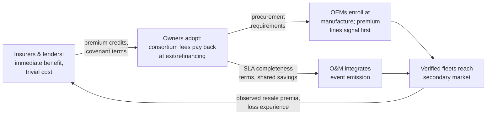

# Economic and Market Implications

## What This Chapter Covers

The engineering chapters justified the architecture's cost; this chapter examines
its value — carefully. The blockchain literature's economic sections are where
credibility goes to die, so the ground rules are stated first: no aggregate
market-size projections, no token economics, no appeals to disruption. The method
throughout is microeconomic and mechanism-level: identify a specific transaction
that misprices today because history is unverifiable, show what verifiable
history changes in that transaction's structure, and bound the effect with
whatever public evidence exists — labeled as strong, weak, or the author's
judgment. Four market mechanisms get this treatment — secondary equipment
markets, insurance and warranty, project finance, and certificate/passport
compliance — each opened by an inventory of who pays today's information
rent; then the adoption economics: who pays, who benefits, why
the gap between those two parties is the real deployment risk, and the
deployment sequence the incidence analysis implies; then the markets the
architecture creates rather than repairs; and finally the falsification
criteria — because an economics chapter that cannot say what would prove
it wrong is a marketing chapter with citations.

### What This Chapter Refuses to Do

The refusals are methodological, not rhetorical, so they are specified.
No total-addressable-market arithmetic: multiplying a fleet size by an
assumed per-unit value manufactures a large number whose every factor is
this chapter's open question — the form is familiar from a decade of
blockchain decks, and its correlation with realized value is not
detectably positive. No efficiency percentages without a mechanism: a
claim that the architecture "reduces costs by X%" is meaningless until X
names whose cost, in which transaction, displaced by what. No token or
crypto-asset economics: nothing in this architecture requires a token,
and the sector's experience with token-mediated energy schemes is a
cautionary literature of its own. And no net-present-value theater: the
discount rates, adoption curves, and horizon choices that drive
infrastructure NPVs are exactly the unknowns under discussion, so the
chapter prices *transactions* (where the numbers can be audited) and
lets readers compound them under their own assumptions. What survives
these refusals is smaller and sturdier than the genre norm, which is
the intended trade.

## 13.1 Ground Rules, and the One Economic Idea That Matters

Nearly everything in this chapter is an application of one idea, so it is worth
stating precisely — and worth crediting to its half-century of literature,
because the novelty here is entirely in the application, never in the
economics. Akerlof's lemons analysis (cited since Chapter 1) shows that
when sellers know quality and buyers cannot verify it, prices converge toward the
buyer's expectation of *average* quality, driving above-average goods out of the
market. The equilibrium is inefficient in a specific, measurable way: the price
spread between verified and unverified quality is the *information rent* the
market pays for opacity. A verifiable-history mechanism does not "create value"
in the promotional sense — it reallocates that rent from the parties who profit
from opacity (sellers of bad assets, buyers with private testing capacity,
intermediaries whose margin is due diligence) to the parties who currently pay
it (sellers of good assets, buyers without testing capacity, insurers of
unknowable risks). Every section below is an instance of this reallocation, and
its size in each market is bounded by the *cost of the next-best verification
alternative* — a discipline that keeps the numbers honest, because that cost is
usually public.

Two companion ideas from the same literature complete the toolkit.
*Signaling* (Spence): where quality is unobservable, sellers of good
assets seek costly signals that bad-asset sellers cannot profitably
imitate — and a verifiable history is close to the ideal signal, because
its cost is low for the honest (Tier 0's cents) and its imitation cost is
the fraud economics of Chapter 8. The premium-line enrollment sequencing
of Section 6.7 is signaling theory applied. *Screening and credit
rationing* (Stiglitz–Weiss): lenders facing unobservable risk do not
merely price higher — they ration, excluding whole borrower classes, which
is why undocumented secondary-market assets are not expensive to finance
but *unfinanceable*; verifiable history moves asset classes across the
rationing boundary, a discontinuous effect no basis-point analysis
captures. Holding all three mechanisms — rent reallocation, signaling,
rationing boundaries — keeps the chapter from the error of modeling
information as a smooth price adjustment when its largest effects are
about which markets exist at all.

The next-best-alternative discipline deserves its worked illustration
before the sections lean on it. Claim: verifiable history is worth
something to a used-module buyer. Bound: the buyer's current alternative
is sample flash-testing plus visual grading at roughly USD 15–30 per
tested unit all-in, achieving weaker assurance (no identity binding, no
history) on a thin sample. The architecture's value to that buyer is
therefore bounded by *that* cost curve — whatever the verified record
provides must be priced against testing the buyer could have bought —
and every "judgment" range in this chapter was derived by asking what
fraction of the next-best cost, plus what fraction of the residual
uncertainty it leaves, the verified alternative captures. Readers who
disagree with a range should locate the disagreement in one of those two
fractions, which is the point of showing the method.

Table 13.1 inventories the rents before the sections argue them —
each row a specific transaction, its opacity cost, and where the
chapter treats it.

**Table 13.1** The information-rent inventory.

| Transaction | Who pays the opacity rent today | Rent's form | Treated in |
|---|---|---|---|
| Used-equipment sale | Sellers of good assets; end buyers | 30–60% provenance discount | §13.2 |
| Second-life battery purchase | Honest fleet sellers; integrators | Worst-case SoH pricing | §13.2, §12.2 |
| Fleet property insurance | All insureds via pooled rates | Variance loading; claims-process loading | §13.3 |
| Warranty (both directions) | Manufacturers and owners symmetrically | Reserves against symmetric fraud | §13.3 |
| Transport claims | Owners (unattributable losses) | Unrecoverable damage; premium loading | §13.3 |
| Construction/term debt | Sponsors | Margin for equipment-risk opacity; rationing of used assets | §13.4 |
| Refinancing | Sponsors | Vintage-prior pricing vs. own-record pricing | §13.4 |
| Passport & supply-chain compliance | Importers, manufacturers | Manual evidence assembly; detention risk | §13.5 |
| Certificate markets | Honest generators; certificate buyers | Fraud discount on instruments | §13.5 |

## 13.2 Secondary Equipment Markets

**The transaction today.** Used modules trade by the pallet at steep discounts to
new — market reports and broker listings through the mid-2020s show functional
used modules clearing at roughly 30–60% below new-equivalent pricing even when
remaining warranted life exceeds fifteen years, with the spread widest where
provenance is thinnest (mixed-origin lots, absent flash data). Sellers of
genuinely good equipment — repowering projects with documented fleets — receive
nearly the same discount as sellers of storm-salvage lots, because the buyer
cannot distinguish them at reasonable cost. That is the lemons equilibrium,
observed in the wild — and its supply side is about to multiply: the
installation waves of the 2010s reach repowering age through this decade
and the next, so the volume flowing into this broken market grows on a
schedule already fixed by history. The question the chapter's opening
vignettes posed — whether that flow meets a market that can price it or a
shredder that cannot — is being decided by infrastructure choices made
now.

The market's microstructure explains why the discount persists against
apparent arbitrage — the puzzle a naive reading of the spread invites is
"why doesn't someone just buy the good lots?", and the answer is that
nobody can tell which lots those are at a cost below the spread itself. Used-module trade runs through brokers who buy at
distress prices and sell into price-sensitive export markets; their
margin *is* the information spread, their inspection capacity is the
market's only quality filter, and their incentive is to keep that filter
proprietary. Sellers cannot go around them credibly (a repowering
project's own documentation is self-interested paper, per Chapter 1), and
buyers in importing markets lack both the instruments and the standing to
verify foreign documentation. The structure is stable, rational, and
lemons-textbook — and it is exactly the structure that a portable,
third-party-verifiable history dissolves, because the broker's private
filter stops being the only quality signal in the channel. Brokers do not
disappear in the verified world; their business shifts from
information arbitrage to logistics, aggregation, and market-making — the
functions that survive transparency in every market that has acquired it.

**What verifiable history changes.** A module with an anchored record —
enrollment template, commissioning date, condition-record chain, cohort
degradation statistics — supports Chapter 6 Step-1/2 verification at near-zero
marginal cost, and sampled Step-3 verification at the lot level for the cost of
a field technician-day. The buyer's quality uncertainty collapses from "the
distribution of everything on the market" to "measurement error plus the
Section 5.7 completeness residual." The price effect is bounded below by the
avoided testing cost (flash-testing a sample of a 1,000-module lot: low
thousands of dollars, so a floor of a few dollars per module) and above by the
observed provenance spread itself (tens of dollars per module). **Judgment,
labeled as such:** documented fleets should recover a third to a half of the
current provenance spread once verification is routine — enough to change
repowering arithmetic, since resale residuals feed directly into levelized-cost
models that currently book used equipment near scrap value. The judgment's
sensitivity runs mainly through two variables: the fraction of the
observed spread that is genuinely informational rather than logistical
(the falsification test of Section 13.8), and the pace at which importing
markets' buyers acquire verification capacity — a handheld-and-training
problem, not an infrastructure one, but a real gating rate in markets
where the current answer to "how do you check?" is a multimeter and a
prayer. The second-order
effect is more interesting than the price level: verified lots become
*financeable and insurable* as a class, which pallet-lot lemons never were —
markets do not merely reprice under information, they add contract types.

A worked lot makes the arithmetic concrete, and it is the arithmetic
every subsequent judgment in the section scales from. A repowering project offers
10,000 documented modules, nine years fielded, 0.5%/yr recorded
degradation, at a nominal new-equivalent value of USD 60 per unit. Under
current practice the lot clears near USD 25–30 — the undocumented-market
price, because the documentation cannot be verified. Under the verified
regime: Step-1/2 costs the buyer nothing material; a V2 campaign on 300
units costs perhaps USD 4,000; the residual unknowns (completeness gaps,
enrollment-era substitution) are enumerable and — per the S5 rehearsal of
Section 11.3 — insurable. If the buyer prices those residuals harshly at
USD 5 per module, the rational clearing price moves into the low-to-mid
USD 40s: call it USD 12–15 per module of recovered rent on this lot, or
six figures per transaction, against verification costs three orders of
magnitude smaller. The judgment ranges above are this arithmetic run
across plausible lot qualities; readers should re-run it with their own
priors, which is why the arithmetic is shown.

The welfare geography deserves naming before the deadweight case: the
verified secondary market's largest gains land in the importing
markets — the price-sensitive regions of South Asia, Africa, and Latin
America where used equipment goes to serve its second life — whose buyers
currently absorb both the lemons risk and the early failures it
produces. Verifiable history is, among its other identities, a
development-economics instrument: it lets a buyer in a
capital-constrained market purchase fifteen documented years of
remaining service instead of a gamble, and the handheld-verification
capacity question flagged above is therefore a candidate for exactly the
kind of development-finance support that already funds off-grid solar
quality programs. The book notes the alignment without romance: the
mechanism is the same rent reallocation as everywhere else in the
chapter; it just happens, in this market, to run toward the parties who
can least afford the rent.

The deadweight case completes the welfare accounting, because rent
reallocation understates the gain where assets currently die. Every
documented mid-life module that ships to a shredder because its history
cannot travel — Section 1.4.4's waste — is value destroyed, not
transferred; the verified regime's rescue of those units is a genuine
surplus gain, split between seller, buyer, and the importing market's
electricity consumers. It is also, for the ESG reporting of Section 10.4,
a measurable circularity improvement — reuse displacing recycling up the
waste hierarchy — which gives the sustainability offices of large owners
an independent reason to fund enrollment that the finance offices might
still be debating.

**The battery variant** is sharper because the regulation removes the
counterfactual: second-life packs *must* carry SoH documentation under the EU
regime (Section 12.2), so the question is not whether history is recorded but
whether it is believable. The spread between self-declared and
instrument-attested SoH is the information rent at stake; given cell-level
binding remains open (Section 12.2), pack-level attestation plus repackaging
manifests is where that spread compresses first. The battery market also
supplies this chapter's cleanest natural experiment, flagged for the
empiricists: as passport obligations phase in, packs with
regulation-minimum (self-declared) passports and packs with
attested trails will trade side by side for several years, and the price
spread between them — same regulation, different verifiability — isolates
exactly the quantity this chapter estimates by judgment. Somebody should
be assembling that dataset now; Section 14.4's research agenda says so
in the imperative.

## 13.3 Insurance and Warranty

Insurance is the chapter's pivotal market — not its largest, but the one
whose adoption decision transmits to all the others, per the loop of
Section 13.6 — so it gets the mechanism treatment three times over:
underwriting, claims, and the warranty contracts that are insurance by
another name.

**Underwriting.** The pilot's S3 scenario (Section 11.3) showed diligence cost
dropping to ~40% of baseline; the systematic effect is on the *loss
distribution's* uncertainty, not just diligence expense. The effect
reaches the owners who self-insure through captives by the same
mechanics with the intermediary removed — the captive's actuary consumes
the anchored cohort statistics directly, and several large European
owner-operators' captive structures make them, in effect, insurers with
a construction arm, which places them on both sides of the incidence
table at once and among the likeliest early integrators. Property and
performance insurers price fleet risk against degradation and defect priors
inferred from thin, unverifiable samples; anchored cohort statistics narrow the
prior's variance, and premium follows variance for tail-priced risks.
**Strong-evidence claim:** insurers already discount for documented O&M regimes;
extending the discount logic to anchored condition histories is actuarial
routine, not innovation — the underwriting questionnaires already ask for
maintenance documentation, inspection cadences, and monitoring coverage;
the architecture changes the *evidentiary grade* of the answers, not the
questions, which is the least disruptive form an innovation can take in
a market that prices novelty as risk.

The actuarial mechanics, one level deeper, because "narrow the variance"
hides where the money is. A fleet property policy prices three stacked
uncertainties: the physical hazard (hail arrives or it does not — no
record changes this), the *vulnerability* given hazard (which depends on
the fleet's actual condition — crack populations from transport,
installation quality, the tail of Section 1.4.3's distribution), and the
*claims-process* uncertainty (what a loss event will cost to adjust,
dispute, and settle). Verifiable histories compress the second and third:
vulnerability priors move from industry-average tables to fleet-specific
anchored evidence, and claims-process loading — which practitioners
know as a substantial fraction of catastrophe-line premiums — shrinks as
settlement time collapses (the S4 mechanism). The competitive dynamic
then does the market's work: the first insurer to price verified fleets
accurately selects the good risks away from competitors still charging
pooled rates, and the pooled book degrades — the same adverse-selection
engine that plagues the asset market, now running in the deployment's
favor. Insurance markets adopt information asymmetry weapons fast, which
is why Chapter 11's insurer signed first and why this chapter keeps
nominating insurers as the adoption engine. **The deeper change is claims.** Catastrophe claims
(hail, storm) currently settle on post-event inspection against contested
baselines — the *pre-event condition* is exactly what nobody can prove.
An anchored pre-event condition record converts the dispute into a measurement:
the S4 rehearsal's 11-day adjudication against a months-long norm is one data
point, but the mechanism (both parties accept the baseline because neither could
have altered it) generalizes and compounds: faster settlement is itself premium-
relevant, since dispute cost loads premiums. The hail line makes the
stakes contemporary: hail has become the solar insurance market's
defining loss driver, with single-storm claims in the nine figures and
insurers responding with per-site deductible escalations and coverage
withdrawal — a hard market in which the marginal underwriting information
is worth the most. A fleet that can prove its pre-storm crack population
(and its stow-response, via the tracker config records of Section 12.4)
is a categorically different risk from one that cannot, and the first
insurers to write that difference into terms will select the market's
best risks at exactly the moment the market is repricing everything.

**Warranty.** Section 1.4.2's symmetric fraud problem — unverifiable claims,
unverifiable denials — prices into module warranties as a reserve both honest
parties fund. Verifiable commissioning and condition chains bound the claimable
population (no more claims on never-shipped serials) and bound wrongful denial
(the commissioning event is Class C, co-signed by the manufacturer's own
accredited channel). The manufacturer's reserve and the owner's warranty-
insurance premium both shrink toward the genuine defect rate. **Weak evidence,
honest label:** reserve levels are not public; the direction is certain, the
magnitude is not, and the pilot's warranty rehearsal (S4) is the only
within-book data point.

The warranty product itself can now evolve, which matters more than the
reserve arithmetic. Today's module warranty is deliberately blunt — a
linear power floor, claims adjudicated by negotiation — because anything
finer would be unadministrable on unverifiable records. With anchored
condition chains, finer contracts become writable: degradation warranties
referencing measured cohort trajectories rather than nameplate curves;
transferable warranties whose validity survives resale because the
in-service history travels (today's warranties routinely lapse or degrade
on transfer, a quiet tax on the secondary market); and parametric
components that pay on recorded condition deltas after defined events,
settling in days instead of adjustment cycles. Contract innovation
follows verifiability with a lag measured in product cycles, and the
manufacturers who move first will discover — per the signaling logic of
Section 13.1 — that a better warranty on verifiable terms is the
cheapest premium-brand instrument they own. The third-party
warranty-insurance market that grew up to bridge manufacturer-solvency
risk (Section 1.4.2) gets repriced from both sides at once: the insured
peril narrows (verifiable claims bound the fraud loading) while the
product's necessity persists (solvency risk is untouched by any ledger),
so the instrument survives, cheaper and cleaner — a small worked example
of the chapter's general claim that the architecture rationalizes
insurance markets rather than replacing them.

The third insurance line, transport and marine cargo, deserves its
sentence: Section 11.3's consignment record — dual-attested condition at
every custody boundary — is precisely the evidence structure that
transport claims lack today, where damage discovered at commissioning is
unattributable across four handlers (Section 1.4.3's triangle). The
pilot's renewal-quote signal is one data point; the mechanism —
attributable custody converts unallocatable losses into subrogable
ones — is standard insurance economics awaiting its application.

## 13.4 Project Finance and the Cost of Capital

Finance's information problems are the quietest in the chapter — no fraud
drama, no shredded modules — and its numbers are the largest, because
they multiply small rates by enormous principals over long tenors.

A solar project's debt prices against uncertainty in its production forecast and
residual value. Equipment-related components of that uncertainty — infant
mortality, degradation dispersion, counterfeit exposure, salvage value — enter
through the independent engineer's report, which is a sampled, point-in-time
document. Anchored fleet histories change the instrument: lenders' technical
advisors can verify continuously, covenants can reference ledger-derived
metrics (cohort degradation envelope, event-cadence completeness), and residual
value moves from an assumption to a market observable as Section 13.2's
verified secondary market thickens. The independent engineer's profession
is augmented, not displaced: sampling design, evidence-graph review, and
escalated physical verification (Chapter 6's Steps 2–3) are exactly the
judgments IE firms sell, moved onto better instruments — and the IE
firms' own accreditation into the verification-services market of
Section 13.7 is the natural evolution of a role this architecture
respects enough to have built its whole Chapter 6 workflow around. **Judgment:** the effect lands as basis
points on debt margin and percentage points on residual assumptions — small per
unit, but project finance is a business of basis points on large principals,
and, unlike the insurance effects, this one requires no new counterparty
behavior: the lender's advisor simply gets a better instrument. The
arithmetic that makes "basis points" worth a chapter section: ten basis
points on a USD 150 M facility is USD 150,000 a year, every year of the
tenor — a seven-figure present value against Table 7.4's entire lifetime
infrastructure cost for the plant, from one of several benefit lines,
accruing to the party (the sponsor) who signs the enrollment purchase
orders. When the incidence table below looks for the private business
case that funds the public good, this line is where it usually closes.

The covenant innovation deserves its own paragraph because it changes the
lender's *monitoring* economics, not just its pricing. Today's facility
agreements monitor equipment risk through annual engineer's certificates
and owner representations — instruments whose lag is measured in
quarters and whose independence is contracted rather than structural.
Ledger-derived covenant metrics invert both properties: a covenant
referencing "fleet fraction outside the warranted degradation envelope,
per anchored condition records" is evaluated continuously by the
lender's own client at negligible cost, and a breach conversation starts
from shared, verified facts rather than from a dispute about the
engineer's sample. The refinancing market compounds the effect: a
project arriving at year-seven refinancing with an anchored operating
history prices against *its own record* rather than against the market's
prior for its vintage — the S5 rehearsal's five-day diligence writ
large — and the basis points saved at refinancing, on principals that
dwarf the original construction loan's margin, may be the single largest
line in this chapter's ledger. **Weak evidence, honestly labeled:** no
verified-fleet refinancing has yet priced; the claim rests on the
mechanics of how technical advisors build their risk memos, confirmed in
interviews, awaiting its first data point.

Construction-period lending gets its own sentence because its risks are
the custody risks this book began with: draw-downs against delivered
equipment currently verify by site visits and delivery paperwork —
exactly the documents Section 1.1 distrusted — while dual-signed custody
chains and V1-verified receiving give the construction lender continuous,
cheap collateral verification and make diversion fraud (equipment
financed twice, delivered once) a detectable event rather than an audit
finding two years later.

Tax-equity and subsidy-compliance structures, where they exist, add a
quieter beneficiary: structures that depend on equipment provenance and
in-service dates (investment-credit eligibility, domestic-content
adders, grandfathered tariff regimes) currently carry documentation risk
that sponsors reserve against; anchored commissioning and provenance
records convert those reserves into verifiable facts, and the sponsors'
counsel — like S4's — will take the anchors before they take anyone's
spreadsheet.

## 13.5 Certificates, Passports, and Compliance as a Cost Center

The chapter's fourth market is the one where the counterfactual is
statutory rather than commercial, which changes every margin in the
analysis.

Section 10.4 framed regulation as demand; the economic statement is that
compliance is a cost center whose size the architecture reduces. Battery
passport compliance (mandatory, dated) requires per-unit lifecycle records with
defined access — the marginal cost of *verifiable* records over self-declared
ones is the batching-and-anchoring infrastructure of Chapter 7, which
Table 7.4 priced in the hundreds of thousands per large plant-lifetime against
compliance-team costs that routinely exceed that annually. Run the same
arithmetic at a battery OEM's scale to feel it: a manufacturer shipping a
million passported packs a year adds, on the Chapter 7 cost curves, well
under ten cents per pack for anchored, attested records over the
regulation-minimum self-declared ones — a rounding error against the
pack's bill of materials, purchasing audit-readiness in every market the
pack will enter plus the verified-SoH premium at its second-life sale.
The wedge is thin enough that the interesting question is why any
compliance program would decline it; the practical answer is
organizational (compliance and engineering budgets living in different
buildings), which is an argument this book can arm but not win.
Certificate schemes
(REC/GO) carry fraud discounts — buyers of unbundled certificates price
double-counting risk — and an equipment-truth layer (Section 10.4) removes the
equipment-side fraud channels. The carbon-market analogy sizes the
stakes: voluntary carbon markets have watched integrity scandals compress
prices across entire instrument classes, including honest ones — the
lemons dynamic operating on certificates themselves — and the
corrective infrastructure that market is now building (ratings agencies,
registry audits) is a costlier, after-the-fact version of what an
equipment truth layer provides structurally. Renewable certificates have
so far escaped a comparable reckoning more by luck and smaller scrutiny
than by stronger foundations; the deployment argument is to build the
floor before the fall, at the cost of an API against the cost of a
market repricing.

Carbon-credit provenance itself, where renewable equipment underlies the
credit (avoided-emissions methodologies built on generation assets),
inherits the whole analysis directly: the credit's integrity chain runs
through the same self-declared equipment facts — capacity, commissioning
date, operational status — whose verification this architecture
industrializes, and the additionality disputes that dominate carbon-market
criticism are, in their equipment-facts component, Step-1/2 queries. The
book claims no more than that component: additionality's counterfactual
reasoning is methodology, not measurement, and no ledger settles it. But
a carbon market whose equipment layer is verifiable has removed the
cheapest class of its frauds and narrowed its disputes to the questions
worth disputing — the same service this chapter has priced four times
now, in four different markets' currencies. **The general mechanism:** wherever regulation
mandates records, it converts record-keeping from a discretionary cost into a
fixed one; the architecture's marginal cost of adding *verifiability* to
already-mandatory records is small, and the value (audit cost, fraud discount,
adjudication speed) accrues against that small margin. This is why Section 12.2
predicted batteries adopt first — the counterfactual record-keeping cost is
already sunk by law.

The supply-chain compliance line deserves its own arithmetic because its
costs are current and countable. Importers facing forced-labor regimes
report evidence-package assembly running to hundreds of staff-hours per
detained shipment, with detention itself costing storage, demurrage, and
project delay on top; supply-chain tracing engagements price in
the six figures per supplier tree. Against those figures, the
composition-reference machinery (Sections 4.3, 12.2) reduces package
assembly to a disclosure-bundle export — hours, not weeks — and, more
valuably, makes the package *pre-positioned*: the evidence exists before
the detention, which changes the negotiation with the border agency from
reconstruction under deadline to disclosure under protocol. **Strong
evidence on costs, judgment on savings:** the current costs are
documented in trade-bar commentary and importer disclosures; the savings
fraction depends on agency acceptance of attested digital evidence,
which customs-modernization trajectories support but have not yet
settled.

Compliance's second-order effect mirrors insurance's: once one importer
clears customs faster on attested evidence, the spread between attested
and documentary supply chains becomes a landed-cost difference,
procurement contracts begin specifying attestation upstream, and the
requirement propagates toward the polysilicon tier by commercial gravity
rather than regulatory reach — the adoption loop of Section 13.6 running
through customs houses instead of insurers. The endgame is Section
10.4.1's regulator-as-verifier trajectory priced: every agency that
learns to consume proofs instead of PDFs converts a compliance cost line
into a query, and the fiscal argument for that conversion — agencies are
budget-constrained verifiers drowning in documentary evidence — may move
administrations that market-efficiency arguments never reach.

## 13.6 Adoption Economics: Who Pays, Who Benefits, and the Gap

Everything above priced the destination; this section prices the journey,
which is where architecture proposals actually die.

The architecture's costs land early and concentrated; its benefits land late and
distributed. Table 13.2 makes the mismatch explicit, because it — not
throughput, not cryptography — is the deployment risk, and because every
failed first-wave consortium of Section 1.5 is, in retrospect, a row of
this table read carelessly.

**Table 13.2** Cost and benefit incidence across the value chain.

| Party | Pays (when) | Benefits (when) | Net position early |
|---|---|---|---|
| Module/battery OEM | Enrollment integration, registrar ops (now) | Warranty reserve, counterfeit defense, premium-product signaling (years) | Negative → positive with brand exposure |
| EPC | Commissioning event discipline (now) | Dispute protection, differentiation (medium) | Mildly negative |
| Owner/fund | Consortium fees, custody (now) | Resale premium, financing margin, claim speed (exit-weighted) | Negative until first refinancing/exit |
| O&M | Work-order integration (now) | Fewer disputes; but *loses* opacity margin | **Structurally ambivalent** |
| Insurer | Verification client (small, now) | Loss variance, diligence cost, claim cost (immediate) | **First mover** |
| Recycler | Accreditation, mass-balance events | Regulated-market access (immediate under passports) | Positive where regulated |
| Secondary buyer | Verification cost (per deal) | Full lemons-rent reallocation | Positive per transaction |

Two rows repay the closer look. The *OEM's* early-negative position
conceals a bifurcation: for commodity manufacturers the enrollment cost
is a compliance-shaped burden, but for premium manufacturers it is the
signaling instrument of Section 13.1 — verifiable quality claims that
commodity competitors cannot cheaply imitate — which predicts (and the
pilot's premium-line Tier-2 sequencing confirmed) that adoption within
the manufacturing tier starts at the top of the brand ladder and works
down. The *owner's* exit-weighted benefits deserve their timing note:
infrastructure funds hold assets five to ten years, so an owner
enrolling at construction realizes the resale and refinancing premia
within a single fund lifecycle — the benefit is deferred, not
generational, which distinguishes this adoption problem from the
genuinely hard ones (grid reinforcement, R&D) where payers and
beneficiaries are different generations entirely.

Three deployment consequences follow. **First, insurers and lenders are the
natural early adopters** — their benefits are immediate, their costs trivial,
and they hold pricing levers (premium credits, covenant terms) that transmit
adoption pressure up the chain without anyone legislating anything. The pilot's
consortium composition (Section 11.1) reflected this deliberately, and its
recruitment history (the insurer first, whose commitment converted the
hesitant) played out the prediction in miniature. The lever mechanics
deserve one sentence of precision: a premium credit or covenant term does
not ask the owner to believe in architecture — it prices a behavior, and
owners respond to prices with a reliability no whitepaper achieves.
**Second, the
O&M ambivalence is real and must be priced, not preached at:** the contractor
whose margin partly rests on information asymmetry will not volunteer for
transparency; the working answer is contractual — completeness metrics as SLA
terms with shared savings, as the pilot's post-S3 work-order integration
effectively became. The shared-savings structure matters as much as the
metric: an SLA that only penalizes gaps teaches concealment of gaps,
while one that splits the measured dispute-cost savings gives the
contractor a stake in the transparency it is being asked to provide —
and the pilot's contractor, notably, ended the year marketing its
ledger-integrated operations as a differentiator to other owners, which
is ambivalence resolving the way incentive design intends.
**Third, retrofit economics gate the installed base:**
Section 4.3's retroactive registrations are cheap to create but carry a
provenance discount whose market size is unknown (Section 11.7, problem 5); if
the discount proves small, the installed terawatt enrolls opportunistically at
inspection touchpoints; if large, only transaction-driven enrollment (at resale
and refinancing) pencils, and coverage grows with churn rather than campaigns.
Either path arrives eventually — every plant refinances or trades within
a decade — so the gate governs *speed*, not destination, and the
Section 11.7 retrofit-cost datum (USD 3.10 per module, campaign mode)
means even the slow path's economics are measured in single-digit
dollars against the rents of Table 13.1.

The residential segment runs the same incidence logic at consumer scale
with one inversion: the household never sees the costs (enrollment rides
the manufacturer; events ride the installer's and administrator's
systems, per Section 10.2's interface austerity) but captures a real
benefit at the one transaction every homeowner runs — the house sale,
where a documented, transferable-warranty solar system appraises as an
asset rather than discounting as a roof encumbrance of unknown
provenance. The transmission lever there is neither insurer nor lender
but the property-transaction infrastructure (appraisal guides,
inspection standards, listing-platform fields), which adopts slowly and
then all at once; the deployment implication is that residential
verifiability arrives as a by-product of the commercial waves rather
than a program of its own, and that is the correct sequencing rather
than a neglect.

### 13.6.1 Sequencing: How the First Deployments Chain

The incidence analysis composes into a deployment sequence specific
enough to falsify — a forecast the falsification section will hold this
chapter to, and a planning scaffold for readers deciding where their own
organization enters the loop. *First movers:* battery-passport compliance programs
(Section 12.2's forecast — the record-keeping is mandatory, the
verifiability margin is small) and high-value diligence moments
(portfolio acquisitions, where a single transaction funds its own
verification infrastructure). *Second wave:* insurer-driven solar
programs on new construction — the pilot's shape — where premium credits
pay for enrollment and the factory integration amortizes across every
plant the OEM ships thereafter; plus offshore wind's OEM-led records
opening (Section 12.3), driven by operator and insurer leverage at
service-contract renewals. *Third wave:* secondary-market platforms and
verification-services firms industrializing what the diligence moments
proved, retrofit enrollment riding transaction churn, and the
refinancing market's own-record pricing pulling documentation quality
upward fleet-wide. *Throughout:* regulatory reference hardening each
wave's gains — the Section 10.4.1 trajectory — with the delegated acts
and certificate registries citing verification standards as they
mature. What the sequence pointedly does not require: any coordinated
industry decision, any single standard's triumph, or any party acting
against its own priced interest. Architectures that require heroism
deploy in pilots; this one is engineered to deploy through greed,
which is the only force in this industry with a maintenance budget.

**Figure 13.1** The adoption loop the incidence table implies: pricing levers,
not mandates, carry the mechanism from first movers to the value chain.

The loop's feedback edge — observed premia and loss experience returning
to the insurers and lenders — is what makes it a loop rather than a
push: each cycle's realized data narrows the next cycle's pricing of
verified assets, widening the spread that transmits the pressure. The
diagram also encodes the deployment's honest fragility: every edge is a
commercial decision that can stall, and the loop has no motor of its own
until the first-mover benefits are *realized*, not merely argued — which
is why Chapter 11's measured results, modest as one program's numbers
are, matter more to this chapter than any model in it. Loops like this
one have run before in adjacent territory: vehicle-history reporting
converted used-car information asymmetry into a subscription industry
via exactly this insurer-and-lender transmission, and the analogy —
imperfect, since cars had registration regimes as a substrate — is the
closest existing proof that history markets bootstrap on priced
interest.

## 13.7 The Markets the Architecture Creates

Rent reallocation is the chapter's conservative core; the completeness of
the account requires the markets that do not exist yet, because
infrastructure that lowers verification costs historically creates
industries its designers did not price. Three are visible from here, in
descending order of certainty, with the section's speculative character
declared at each step.

**Verification services** is the certain one — Chapter 6's tiering and
Chapter 11's campaigns already assume it: accredited firms operating
instrument fleets, drawing pre-committed samples, selling assurance at
transaction moments; the battery SoH benches of Section 12.2 are the same
market in a different chemistry. Its unit economics sketch cleanly from
the pilot's figures: a two-technician V2 crew with a handheld rig covered
~40 units a day at USD 5–20 per unit revenue-equivalent — a service
business with instrument capex in the tens of thousands, utilization
driven by transaction seasons and catastrophe surges, and margins that
improve with exactly the fixture-ergonomics engineering Section 11.7
listed as problem 1. The likely entrants are the existing inspection
and engineering firms whose EL and IR fleets already fly (the marginal
product is accreditation plus protocol conformance, not new capital),
which is the healthiest possible market structure: incumbent expertise,
competitive entry, and no platform gatekeeper. Its structure will
matter: metrological
accreditation (Section 4.3.2's machinery) keeps entry honest; the
escalation tiers keep the product differentiated (drone-EL screening
firms are not magnetometry labs); and the market's health is a
consortium-governance concern, because a verification monopoly would hold
the pricing power the architecture took from record-keepers.

**Data and analytics products** follow the read layer: cohort benchmarks
(how does this OEM's 2027 vintage degrade against market?), residual-value
curves for verified classes, counterfeit-incidence indices, underwriting
feeds. All are derivable from anchored aggregates under the privacy
constraints of Chapter 10 — the aggregation thresholds are the product
boundary — and the monitor-governance problem of Section 11.7 previews
the market's regulatory question: whoever's baselines define "normal
degradation" holds quiet power over warranty and insurance pricing, and
benchmark governance (a solved problem in financial indices, with
scars) will need importing. The market's pricing question is the
architecture's design intent turned commercial: because verification
itself is free (proofs are public), the data products must price
*analysis*, not access — which is the healthy configuration, since it
means no one's ability to check a record ever depends on a subscription,
while the interpretive layer competes on quality the way analysis
should.

**Residual-value instruments** arrive last and matter most for the
energy transition's capital stack: once verified secondary markets
generate observable clearing prices, residual-value guarantees,
forward-purchase agreements on decommissioned fleets, and
securitizations of second-life flows all become writable — the financial
plumbing that turns circularity from a compliance narrative into an
asset class. The battery-lease market already runs primitive versions on
OEM-controlled data; the open-verification versions price better because
counterparties can check the collateral without trusting the servicer.
**Judgment, flagged as the chapter's most speculative:** this tier
arrives only after years of price discovery, and its absence from the
falsification section below is deliberate — it is a consequence to hope
for, not a premise the architecture's case rests on.

The created markets share one design obligation the consortium should
write down early: none of them may become a choke point on verification
itself. The architecture spent four parts removing gatekeepers from the
record layer; letting them re-form one level up — a verification
duopoly, a benchmark monopoly, a data platform whose API is the de facto
registry — would be the familiar ending of infrastructure stories, and
the open-proofs, accredited-plurality, priced-analysis rules scattered
through this section are the codified refusal of that ending.

## 13.8 What Would Falsify This Chapter

A methods section in closing, because grounded treatment means stating what
evidence would change the conclusions — and because the author's own
stake (a patent, a book, a research program) is exactly the bias a
falsification section exists to discipline. The lemons-rent argument fails if the
observed used-equipment spread turns out to be dominated by logistics and
requalification costs rather than information (testable: spreads should then be
insensitive to documentation quality — current broker pricing already suggests
otherwise, but the data is thin). The insurance argument fails if loss-variance
reduction does not transmit to premiums in a soft market (cyclical, observable).
The adoption loop fails if the O&M integration problem proves harder than its
SLA pricing (the pilot's single data point says it is hard but contractible).
The refinancing claim fails if technical advisors' memos prove
institutionally sticky — if own-record pricing does not displace
vintage priors within a refinancing cycle of verified fleets existing
(observable in facility-agreement terms, with a lag). The sequencing
forecast of Section 13.6.1 fails visibly: if the battery compliance
programs ship regulation-minimum passports and no verification layer
follows within the phase-in period, the sunk-cost wedge argument was
wrong about the margin's size. And the chapter's deepest premise — that
verification cost, not verification *demand*, is the binding
constraint — fails if verified records exist and transactions decline to
consume them; the S5 rehearsal and the counsel behavior in S4 are the
early evidence against that failure, and honest bookkeeping requires
noting both come from one program. The chapter's projections are
deliberately conditional; the falsification
criteria are the honest form of confidence, and Section 14.4 files the
data-collection programs — the battery natural experiment above being
the cleanest — that would settle them.

## 13.9 Chapter Summary

Three ideas, four markets, and a sequencing forecast: unverifiable history
levies an information rent (Akerlof), suppresses the signals good sellers
would pay to send (Spence), and rations whole asset classes out of
finance (Stiglitz–Weiss); verifiable history reallocates the rent,
cheapens the signal, and moves the rationing boundary. Secondary
equipment markets show the rent
directly in provenance spreads that anchored records should compress by a third
to a half for documented fleets — the worked lot puts six figures of
recovered rent against three figures of verification cost — with the
deeper effects that verified lots
become financeable and insurable asset classes, that brokers shift from
information arbitrage to logistics, and that the deadweight of shredded
mid-life assets converts to genuine surplus on a repowering schedule
already fixed by the 2010s installation waves. Insurance gains three
times: in
narrowed vulnerability priors, in claims that settle against baselines
neither party
could have altered — with hail's hard market making the underwriting
information most valuable exactly now — and in warranty products that can
finally evolve past the blunt linear floor that unverifiable records
forced. Project finance converts a point-in-time engineer's
report into a continuous covenant instrument, worth basis points on
large principals and most at refinancing, where verified fleets price
against their own records. Compliance regimes — passports above all —
sink the record-keeping cost by law
and leave verifiability as a small margin purchasing audit relief, fraud
discounts, and pre-positioned customs evidence. The costs and benefits
land on different parties at different times;
insurers and lenders, holding immediate benefits and pricing levers, are the
adoption engine; the O&M contractor's rational ambivalence is the friction
to be priced into shared-savings SLAs rather than moralized away; and the
deployment sequence of Section 13.6.1 — batteries and diligence moments,
then insurer-driven programs, then platforms and refinancing pull —
requires no heroism from anyone, only priced interest. The architecture
also creates markets it does not merely repair: verification services,
benchmark analytics with their governance questions, and eventually the
residual-value instruments that make circularity an asset class. What
cannot be settled by
mechanism design is settled by evidence: the chapter states what evidence
would prove it wrong, and nominates the battery passport phase-in as the
natural experiment that will grade it. What remains is what remains open
everywhere — the research agenda of Chapter 14.

## References and Further Reading

1. Akerlof, G. A. "The Market for 'Lemons': Quality Uncertainty and the Market
   Mechanism." *Quarterly Journal of Economics* 84, no. 3 (1970): 488–500.
2. Spence, M. "Job Market Signaling." *Quarterly Journal of Economics* 87,
   no. 3 (1973): 355–374 (signaling logic behind §13.2 and §13.6).
3. Stiglitz, J. E., and A. Weiss. "Credit Rationing in Markets with Imperfect
   Information." *American Economic Review* 71, no. 3 (1981): 393–410
   (information and cost of capital, §13.4).
4. International Renewable Energy Agency and IEA-PVPS. *End-of-Life Management:
   Solar Photovoltaic Panels.* IRENA, 2016 (secondary-market and EoL volumes).
5. Curtis, T., H. Buchanan, G. Heath, A. Smith, and S. Shaw. *Solar
   Photovoltaic Module Recycling: A Survey of U.S. Policies and Initiatives.*
   NREL/TP-6A20-74124, 2021.
6. Jordan, D. C., et al. "Compendium of Photovoltaic Degradation Rates" (loss
   priors context, §13.3). *Progress in Photovoltaics* 24, no. 7 (2016).
7. Akerlof, G. A., M. Spence, and J. E. Stiglitz. Nobel lectures, *American
   Economic Review* 92, no. 3 (2002) — the information-economics toolkit of
   §13.1 in its laureates' own retrospectives.
8. Renewable Energy Test Center / kWh Analytics and industry hail-risk
   reports (various years) — the hard-market context of §13.3's hail
   discussion; specific citations to be fixed at press time alongside the
   pricing data below.
9. [MARKET DATA ON USED-MODULE PRICING — BROKER/PLATFORM CITATIONS TO BE
   SUPPLIED AT PRESS TIME; SPREADS QUOTED IN §13.2 TO BE RE-VERIFIED.]

\newpage
