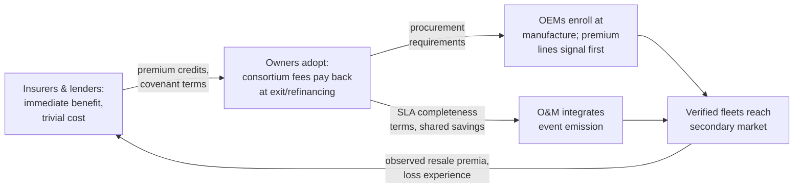

# Economic and Market Implications

## What This Chapter Covers

The engineering chapters justified the architecture's cost; this chapter examines
its value — carefully. The blockchain literature's economic sections are where
credibility goes to die, so the ground rules are stated first: no aggregate
market-size projections, no token economics, no appeals to disruption. The method
throughout is microeconomic and mechanism-level: identify a specific transaction
that misprices today because history is unverifiable, show what verifiable
history changes in that transaction's structure, and bound the effect with
whatever public evidence exists — labeled as strong, weak, or the author's
judgment. Four market mechanisms get this treatment — secondary equipment
markets, insurance and warranty, project finance, and certificate/passport
compliance — followed by the adoption economics: who pays, who benefits, and why
the gap between those two parties is the real deployment risk.

## 13.1 Ground Rules, and the One Economic Idea That Matters

Nearly everything in this chapter is an application of one idea, so it is worth
stating precisely. Akerlof's lemons analysis (cited since Chapter 1) shows that
when sellers know quality and buyers cannot verify it, prices converge toward the
buyer's expectation of *average* quality, driving above-average goods out of the
market. The equilibrium is inefficient in a specific, measurable way: the price
spread between verified and unverified quality is the *information rent* the
market pays for opacity. A verifiable-history mechanism does not "create value"
in the promotional sense — it reallocates that rent from the parties who profit
from opacity (sellers of bad assets, buyers with private testing capacity,
intermediaries whose margin is due diligence) to the parties who currently pay
it (sellers of good assets, buyers without testing capacity, insurers of
unknowable risks). Every section below is an instance of this reallocation, and
its size in each market is bounded by the *cost of the next-best verification
alternative* — a discipline that keeps the numbers honest, because that cost is
usually public.

## 13.2 Secondary Equipment Markets

**The transaction today.** Used modules trade by the pallet at steep discounts to
new — market reports and broker listings through the mid-2020s show functional
used modules clearing at roughly 30–60% below new-equivalent pricing even when
remaining warranted life exceeds fifteen years, with the spread widest where
provenance is thinnest (mixed-origin lots, absent flash data). Sellers of
genuinely good equipment — repowering projects with documented fleets — receive
nearly the same discount as sellers of storm-salvage lots, because the buyer
cannot distinguish them at reasonable cost. That is the lemons equilibrium,
observed in the wild.

**What verifiable history changes.** A module with an anchored record —
enrollment template, commissioning date, condition-record chain, cohort
degradation statistics — supports Chapter 6 Step-1/2 verification at near-zero
marginal cost, and sampled Step-3 verification at the lot level for the cost of
a field technician-day. The buyer's quality uncertainty collapses from "the
distribution of everything on the market" to "measurement error plus the
Section 5.7 completeness residual." The price effect is bounded below by the
avoided testing cost (flash-testing a sample of a 1,000-module lot: low
thousands of dollars, so a floor of a few dollars per module) and above by the
observed provenance spread itself (tens of dollars per module). **Judgment,
labeled as such:** documented fleets should recover a third to a half of the
current provenance spread once verification is routine — enough to change
repowering arithmetic, since resale residuals feed directly into levelized-cost
models that currently book used equipment near scrap value. The second-order
effect is more interesting than the price level: verified lots become
*financeable and insurable* as a class, which pallet-lot lemons never were —
markets do not merely reprice under information, they add contract types.

**The battery variant** is sharper because the regulation removes the
counterfactual: second-life packs *must* carry SoH documentation under the EU
regime (Section 12.2), so the question is not whether history is recorded but
whether it is believable. The spread between self-declared and
instrument-attested SoH is the information rent at stake; given cell-level
binding remains open (Section 12.2), pack-level attestation plus repackaging
manifests is where that spread compresses first.

## 13.3 Insurance and Warranty

**Underwriting.** The pilot's S3 scenario (Section 11.3) showed diligence cost
dropping to ~40% of baseline; the systematic effect is on the *loss
distribution's* uncertainty, not just diligence expense. Property and
performance insurers price fleet risk against degradation and defect priors
inferred from thin, unverifiable samples; anchored cohort statistics narrow the
prior's variance, and premium follows variance for tail-priced risks.
**Strong-evidence claim:** insurers already discount for documented O&M regimes;
extending the discount logic to anchored condition histories is actuarial
routine, not innovation. **The deeper change is claims.** Catastrophe claims
(hail, storm) currently settle on post-event inspection against contested
baselines — the *pre-event condition* is exactly what nobody can prove.
An anchored pre-event condition record converts the dispute into a measurement:
the S4 rehearsal's 11-day adjudication against a months-long norm is one data
point, but the mechanism (both parties accept the baseline because neither could
have altered it) generalizes and compounds: faster settlement is itself premium-
relevant, since dispute cost loads premiums.

**Warranty.** Section 1.4.2's symmetric fraud problem — unverifiable claims,
unverifiable denials — prices into module warranties as a reserve both honest
parties fund. Verifiable commissioning and condition chains bound the claimable
population (no more claims on never-shipped serials) and bound wrongful denial
(the commissioning event is Class C, co-signed by the manufacturer's own
accredited channel). The manufacturer's reserve and the owner's warranty-
insurance premium both shrink toward the genuine defect rate. **Weak evidence,
honest label:** reserve levels are not public; the direction is certain, the
magnitude is not, and the pilot's warranty rehearsal (S4) is the only
within-book data point.

## 13.4 Project Finance and the Cost of Capital

A solar project's debt prices against uncertainty in its production forecast and
residual value. Equipment-related components of that uncertainty — infant
mortality, degradation dispersion, counterfeit exposure, salvage value — enter
through the independent engineer's report, which is a sampled, point-in-time
document. Anchored fleet histories change the instrument: lenders' technical
advisors can verify continuously, covenants can reference ledger-derived
metrics (cohort degradation envelope, event-cadence completeness), and residual
value moves from an assumption to a market observable as Section 13.2's
verified secondary market thickens. **Judgment:** the effect lands as basis
points on debt margin and percentage points on residual assumptions — small per
unit, but project finance is a business of basis points on large principals,
and, unlike the insurance effects, this one requires no new counterparty
behavior: the lender's advisor simply gets a better instrument.

## 13.5 Certificates, Passports, and Compliance as a Cost Center

Section 10.4 framed regulation as demand; the economic statement is that
compliance is a cost center whose size the architecture reduces. Battery
passport compliance (mandatory, dated) requires per-unit lifecycle records with
defined access — the marginal cost of *verifiable* records over self-declared
ones is the batching-and-anchoring infrastructure of Chapter 7, which
Table 7.4 priced in the hundreds of thousands per large plant-lifetime against
compliance-team costs that routinely exceed that annually. Certificate schemes
(REC/GO) carry fraud discounts — buyers of unbundled certificates price
double-counting risk — and an equipment-truth layer (Section 10.4) removes the
equipment-side fraud channels. **The general mechanism:** wherever regulation
mandates records, it converts record-keeping from a discretionary cost into a
fixed one; the architecture's marginal cost of adding *verifiability* to
already-mandatory records is small, and the value (audit cost, fraud discount,
adjudication speed) accrues against that small margin. This is why Section 12.2
predicted batteries adopt first — the counterfactual record-keeping cost is
already sunk by law.

## 13.6 Adoption Economics: Who Pays, Who Benefits, and the Gap

The architecture's costs land early and concentrated; its benefits land late and
distributed. Table 13.1 makes the mismatch explicit, because it — not
throughput, not cryptography — is the deployment risk.

**Table 13.1** Cost and benefit incidence across the value chain.

| Party | Pays (when) | Benefits (when) | Net position early |
|---|---|---|---|
| Module/battery OEM | Enrollment integration, registrar ops (now) | Warranty reserve, counterfeit defense, premium-product signaling (years) | Negative → positive with brand exposure |
| EPC | Commissioning event discipline (now) | Dispute protection, differentiation (medium) | Mildly negative |
| Owner/fund | Consortium fees, custody (now) | Resale premium, financing margin, claim speed (exit-weighted) | Negative until first refinancing/exit |
| O&M | Work-order integration (now) | Fewer disputes; but *loses* opacity margin | **Structurally ambivalent** |
| Insurer | Verification client (small, now) | Loss variance, diligence cost, claim cost (immediate) | **First mover** |
| Recycler | Accreditation, mass-balance events | Regulated-market access (immediate under passports) | Positive where regulated |
| Secondary buyer | Verification cost (per deal) | Full lemons-rent reallocation | Positive per transaction |

Three deployment consequences follow. **First, insurers and lenders are the
natural early adopters** — their benefits are immediate, their costs trivial,
and they hold pricing levers (premium credits, covenant terms) that transmit
adoption pressure up the chain without anyone legislating anything. The pilot's
consortium composition (Section 11.1) reflected this deliberately. **Second, the
O&M ambivalence is real and must be priced, not preached at:** the contractor
whose margin partly rests on information asymmetry will not volunteer for
transparency; the working answer is contractual — completeness metrics as SLA
terms with shared savings, as the pilot's post-S3 work-order integration
effectively became. **Third, retrofit economics gate the installed base:**
Section 4.3's retroactive registrations are cheap to create but carry a
provenance discount whose market size is unknown (Section 11.7, problem 5); if
the discount proves small, the installed terawatt enrolls opportunistically at
inspection touchpoints; if large, only transaction-driven enrollment (at resale
and refinancing) pencils, and coverage grows with churn rather than campaigns.

**Figure 13.1** The adoption loop the incidence table implies: pricing levers,
not mandates, carry the mechanism from first movers to the value chain.

## 13.7 What Would Falsify This Chapter

A methods section in closing, because grounded treatment means stating what
evidence would change the conclusions. The lemons-rent argument fails if the
observed used-equipment spread turns out to be dominated by logistics and
requalification costs rather than information (testable: spreads should then be
insensitive to documentation quality — current broker pricing already suggests
otherwise, but the data is thin). The insurance argument fails if loss-variance
reduction does not transmit to premiums in a soft market (cyclical, observable).
The adoption loop fails if the O&M integration problem proves harder than its
SLA pricing (the pilot's single data point says it is hard but contractible).
The chapter's projections are deliberately conditional; the falsification
criteria are the honest form of confidence.

## 13.8 Chapter Summary

One idea, four markets: unverifiable history levies an information rent, and
verifiable history reallocates it. Secondary equipment markets show the rent
directly in provenance spreads that anchored records should compress by a third
to a half for documented fleets — with the deeper effect that verified lots
become financeable and insurable asset classes. Insurance gains twice, in
narrowed loss priors and in claims that settle against baselines neither party
could have altered; warranties shed the symmetric fraud reserve both honest
parties currently fund. Project finance converts a point-in-time engineer's
report into a continuous instrument, worth basis points on large principals.
Compliance regimes — passports above all — sink the record-keeping cost by law
and leave verifiability as a small margin purchasing audit relief and fraud
discounts. The costs and benefits land on different parties at different times;
insurers and lenders, holding immediate benefits and pricing levers, are the
adoption engine, and the O&M contractor's rational ambivalence is the friction
to be priced into SLAs rather than moralized away. What cannot be settled by
mechanism design is settled by evidence, and the chapter states what evidence
would prove it wrong. What remains is what remains open everywhere — the
research agenda of Chapter 14.

## References and Further Reading

1. Akerlof, G. A. "The Market for 'Lemons': Quality Uncertainty and the Market
   Mechanism." *Quarterly Journal of Economics* 84, no. 3 (1970): 488–500.
2. Spence, M. "Job Market Signaling." *Quarterly Journal of Economics* 87,
   no. 3 (1973): 355–374 (signaling logic behind §13.2 and §13.6).
3. Stiglitz, J. E., and A. Weiss. "Credit Rationing in Markets with Imperfect
   Information." *American Economic Review* 71, no. 3 (1981): 393–410
   (information and cost of capital, §13.4).
4. International Renewable Energy Agency and IEA-PVPS. *End-of-Life Management:
   Solar Photovoltaic Panels.* IRENA, 2016 (secondary-market and EoL volumes).
5. Curtis, T., H. Buchanan, G. Heath, A. Smith, and S. Shaw. *Solar
   Photovoltaic Module Recycling: A Survey of U.S. Policies and Initiatives.*
   NREL/TP-6A20-74124, 2021.
6. Jordan, D. C., et al. "Compendium of Photovoltaic Degradation Rates" (loss
   priors context, §13.3). *Progress in Photovoltaics* 24, no. 7 (2016).
7. [MARKET DATA ON USED-MODULE PRICING — BROKER/PLATFORM CITATIONS TO BE
   SUPPLIED AT PRESS TIME; SPREADS QUOTED IN §13.2 TO BE RE-VERIFIED.]

\newpage
