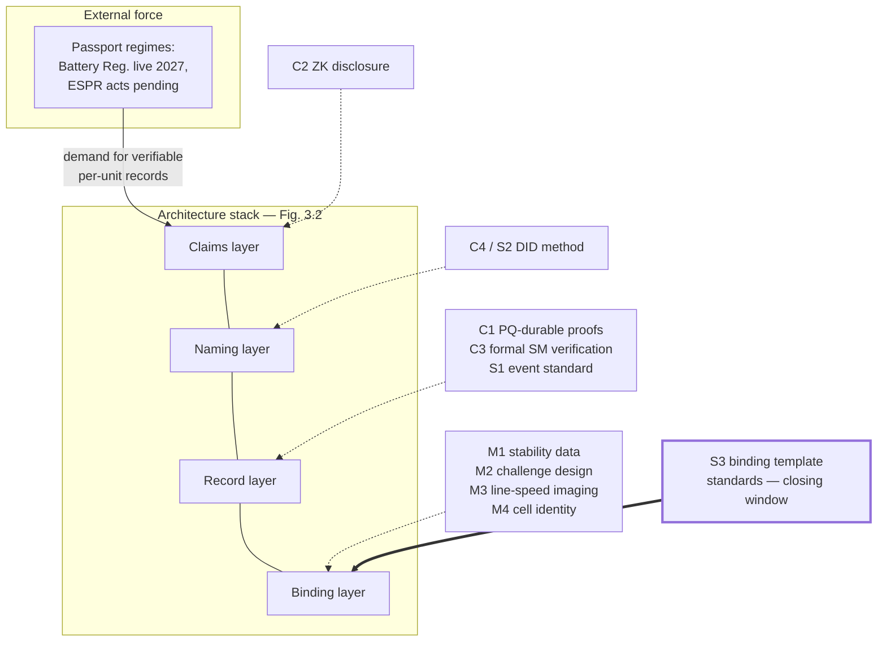

# Future Directions and Open Research Problems

## What This Chapter Covers

A monograph should end by making itself obsolete: this chapter assembles the open
problems flagged throughout the book into a research agenda, organized by the
communities that would have to do the work — measurement science, cryptographic
systems, standards bodies, and the regulatory-economic interface. Problems are
stated with their location in the book, what is known, what is missing, and what
a solution would look like, because an agenda item without success criteria is a
sentiment. Each item also names its natural funders and venues, because
research agendas without addresses are wish lists; a decade-scale
milestone map assembles the items into a program; the book's own
falsifiable forecasts are collected for future grading; and the chapter
closes with the integration outlook: how this
architecture meets the digital product passport programs that are, at time of
writing, the strongest real-world force pulling it into existence — and
with the education and workforce agenda on which all the rest quietly
depends.

A note on the numbering the reader will meet: M-items belong to
measurement science, C-items to cryptographic and systems research,
S-items to standardization — the labels have been accumulating since
Chapter 6 flagged its first open problem, and this chapter is where the
scattered flags assemble into their communities' work queues. Items are
cross-referenced to the sections that motivated them, so a researcher
picking one up inherits its full engineering context rather than an
abstract.

## 14.1 Measurement Science

The measurement items come first because they gate the rest: every
architectural guarantee in Parts II–III ultimately cites a measured
property of matter, and the citations are only as good as the metrology
behind them. The items also share a funding profile worth stating once —
they are cheap by physical-science standards, slow by venture standards,
and valuable in proportion to how *early* they start, because their
product is longitudinal data that no budget can accelerate later. A
funder scanning this section should read "start date matters more than
budget size" on every line.

Instrument vendors occupy a special position across all five items and
should hear their role stated plainly: the M-series' datasets are
captured on your instruments, its formats are your export functions, and
its round-robins are your proficiency marketing. The vendor who
co-designs the open template format captures the reference-instrument
position in the standard that follows — a pattern familiar from a
century of test-and-measurement history — while the vendor who withholds
formats bets against the metrology campaign and, if it succeeds, against
its own installed base. The agenda needs vendor engineering hours more
than vendor money, and the exchange on offer (formats and firmware
attestation for standing in the emerging regime) is historically
favorable.

**M1 — Long-horizon stability of structural fingerprints** (§6.8-1, the field's
single most important open problem, and the one whose answer no amount
of cleverness can substitute for waiting). *Known:* accelerated aging and short
longitudinal series support grain-texture stability under thermal cycling and
mechanical load; crack networks demonstrably evolve. *Missing:* twenty-year
longitudinal template data on fielded modules under real climates — data that
can only be produced by starting now. *Success:* published false-accept/
false-reject curves as a function of fleet age and climate zone, from
instrumented cohorts (the pilot's 6,300-module Tier-2 sample is one such cohort;
it needs siblings in other climates). The supersession mechanism (§6.4) hedges
the architecture against an unfavorable answer, but the answer determines
whether re-enrollment is decadal maintenance or annual burden — an
order-of-magnitude economic difference.

The program design writes itself from the existing infrastructure of
outdoor test fields and the IEA-PVPS collaboration culture: five to eight
instrumented cohorts of order 10³ modules each, spanning desert,
tropical, temperate-coastal, and alpine exposure; enrollment under the
open template discipline (S3 below — the study is worthless if its
templates cannot outlive its instruments); re-measurement annually for
five years, then biennially; and — the design element easily forgotten —
*deliberate damage subsets*, transport-stressed and hail-exposed
sub-cohorts, because the R5 evolution-plausibility machinery needs
labeled examples of legal damage trajectories, not only of quiet aging.
Funders and venues: the national-lab reliability programs already
running outdoor exposure studies (adding template capture to an existing
protocol is marginal cost), module OEM warranty departments (whose
Table 13.2 interest in degradation priors this data directly serves),
and the IEA task structure for cross-site coordination. Cost: single-
digit millions across a decade — decimal dust against the rents of
Chapter 13, and the cheapest insurance the architecture can buy on its
own central assumption.

**M2 — Inversion-robust challenge design** (§6.8-2). *Known:* field-to-current
inversion is ill-posed; regularization choices affect template features.
*Missing:* a challenge-space design provably robust to inversion ambiguity — the
adversarial formulation (can an attacker exploit the null space?) has not been
posed formally. *Success:* a published adversarial analysis with bounds, in the
style the PUF literature eventually developed for its own modeling attacks.
The problem decomposes into three publishable stages: formalize the
attacker (given templates, challenge history, and a fabrication
capability model, characterize the reachable set of impersonating
current distributions); bound the defender (challenge-space designs
whose expected discrimination survives the reachable set at stated
measurement noise); and close the loop empirically (commission the
attack — a funded red-team fabrication attempt against the published
bound, because a bound nobody has tried to break is a conjecture in
formalwear). The natural home is the hardware-security community, whose
CHES-culture instincts fit exactly, in collaboration with the applied-
magnetometry groups; the equipment ask is modest and the theoretical
content is genuinely novel — a well-shaped dissertation topic, which is
this agenda's way of saying *urgent and fundable*.

**M3 — Line-speed wide-field quantum imaging** (§6.8-3). An instrument-
engineering race with identified paths (wide-field NV arrays, parallel
tiles) and no physics obstacles — the rare agenda item whose success is
a purchase order away.
*Success:* seconds-per-module full-area mapping at factory takt, at a station
cost commensurate with existing EL cells. Progress here moves Tier 2 from
sampled to universal, which restructures §6.7's economics. The
engineering intermediate targets, for the instrument programs that will
need them as milestones: single-cell mapping at one second (parallelized
sensor tiles at current sensitivities suffice on paper); module-scale
tiling with registration at line vibration levels (the mechatronics is
the risk, not the physics); and the factory-hardened package — thermal
range, diamond-plate lifetime under production cycling, and the
attestation electronics of grade I-A. The funding logic differs from
M1's: this is product development awaiting an anchor customer, and the
likeliest anchor is a premium module OEM buying differentiation
(Section 13.1's signaling), with public instrumentation programs as
de-riskers rather than drivers.

**M4 — Cell-level battery identity** (§12.2, the hardest binding problem left).
*Known:* impedance and formation signatures exist but fail stability (R2) or
field feasibility (R6) today — the diagnostic sentences of Section 12.2
locate each failure precisely. *Missing:* a passive electrochemical or structural
anchor that survives cycling and is measurable through the pack. *Success:* a
binding modality passing Table 6.2 for cells — which would close the
repackaging-fraud channel that pack-level manifests only attribute. Two
research directions deserve naming: cycling-invariant subspaces of
impedance response (the formation-fixed geometric contributions may
separate from the chemistry-driven drift — a signal-processing question
sitting on top of an electrochemistry question), and acoustic or
ultrasonic structural signatures (electrode stack geometry is
manufacture-fixed and mechanically interrogable through pack casings in
laboratory demonstrations). The battery-diagnostics community is
already instrumenting cells heavily for state-estimation research; M4
asks it to add an identity question to apparatus it already owns.
Thin-film
and perovskite PV (§6.8-5) belong in this cluster too: their defect
phenomenology is younger than the assets this framework protects, and
Section 12.6's proposal — enroll the qualification cohorts these
technologies must run anyway — is the cheap on-ramp.

A fifth measurement item closes the section, surfaced by the pilot
rather than the theory. **M5 — Field reference artifacts.** The Tier-3
recursion of Section 6.7 terminates in reference modules whose
laboratory-grade characterization anchors field instruments' meaning;
nobody has yet designed the *traveling standard* for this domain, and
until one exists every cross-verifier comparison rests on chains of
instrument calibration that never close the loop through an actual
shared object — an
artifact stable enough to circulate among field verifiers, sensitive
enough to detect their drift, and cheap enough to exist in numbers.
Dimensional and electrical metrology solved the analogous problem with
gauge blocks and standard resistors; structural-fingerprint metrology
needs its equivalent (a characterized, ruggedized mini-module with
known defect population and documented aging, is the obvious candidate),
and the proficiency-testing regime of S5 cannot operate without it.
*Success:* a circulated-artifact study showing inter-verifier agreement
within stated bounds — the field's first round-robin, which is the
coming-of-age ceremony of every measurement discipline.

The measurement section's collective register, before the systems items:
M1 through M5 are, together, the construction of a *metrology of
identity* for manufactured energy assets — stability data, adversarial
bounds, instruments, cell-scale anchors, and traveling standards — and
the register matters because measurement disciplines succeed as
disciplines, not as scattered results: shared artifacts, round-robins,
and proficiency culture are what turned length and voltage from craft
into infrastructure, and they are the pattern this quintet should be
managed against.

## 14.2 Cryptographic and Systems Research

The systems items differ from the measurement ones in tempo — they are
bounded projects rather than longitudinal programs — and in venue: each
maps onto an existing research community's publication culture, and the
section's framing effort has gone into stating each problem in the
receiving community's own terms, because agenda items travel on the
strength of their problem statements.

**C1 — Succinct proofs with thirty-year verifiability** (§7.4, §9.1). Validity
rollups compress consortium load, but proof systems age faster than assets:
circuit freezes conflict with schema evolution, and several constructions rest
on assumptions Chapter 9 would not certify for three decades. *Success:*
hash-based (PQ-conservative) proof systems with practical re-proving pipelines —
so that P1-style re-anchoring can *re-prove* old batches under new systems, the
rollup analog of Section 9.4, keeping compressed history exactly as
durable as the uncompressed history it replaced. The research shape: the proving-systems
community optimizes for prover time and proof size against today's
verifier; this application adds a third axis — *re-provability*, the
cost of re-certifying a historical batch under a successor system from
archived witnesses — which no current benchmark measures and which
determines whether validity proofs are compatible with evidential
lifetimes at all. A workshop paper defining the re-provability metric
and benchmarking the hash-based candidates against it would orient the
field for a decade; the archived-witness custody question it raises
(what must the archive retain to re-prove?) belongs jointly to this item
and to Chapter 4's preservation discipline.

**C2 — Zero-knowledge selective disclosure over evidence DAGs** (§10.2-3).
Field-level VC disclosure exists; what diligence actually needs is *graph-level*
predicates — "this asset's condition chain satisfies the insurer's policy" —
proven without revealing the chain. *Success:* practical ZK policy evaluation
over the §5.4 DAG structure, PQ-migratable per C1. Until then, the pilot's
covenant-plus-access-control posture (§11.2) is the honest state of the art.
The application constraint that shapes the research: diligence predicates
are *negotiated* (each insurer's policy differs), so the construction
must support predicate languages, not fixed circuits — which points at
the general-purpose proving systems and away from bespoke protocols, and
which makes C2 largely a consumer of C1's progress plus an engineering
layer of DAG-to-circuit compilation that a good systems group could own
outright. A worked target predicate, to make the benchmark concrete:
"every condition record in this asset's chain was produced by an
in-calibration I-A instrument, and no inter-record degradation delta
exceeds the warranted envelope" — provable today by disclosure,
tomorrow, ideally, by proof.

**C3 — Formal verification of lifecycle state machines** (§8.5-F8). The
contracts are small by design; they should be *provably* small — machine-checked
correspondence between the Chapter 5 schema, the deployed contract, and the
time-contextual verification rules of §9.4-P2. The state-machine restriction
makes this tractable in a way general contract verification is not; it is
low-hanging fruit for the formal-methods community. The concrete work
program: mechanize the envelope and state machine in a proof assistant;
prove the invariants of Table 5.2 preserved by every event type; prove
the P2 verifier's time-contextual judgment sound against the policy
register's semantics; and — the deliverable with deployment leverage —
generate the conformance suites of Section 7.5 *from* the mechanization,
so that the two independent implementations are tested against a
machine-checked oracle rather than against each other's assumptions. The
pilot's 1,700 logic lines are a term project's scale; the value is not
the proof but the permanent, executable specification it leaves behind.

**C4 — Succession-complete DID methods** (§3.5). Controller succession,
supersession chains, and algorithm-policy references exist in this book as
schema conventions (the DID-document sketch of §3.5 shows their shape);
they should exist as a standardized DID method for
non-agentive physical subjects, with a resolution story that survives
institutional churn (the §1.3 problem, one level up). This item sits on the
boundary with standards work, where it continues as S2 — and its
research kernel, distinct from the standards drafting, is the
*resolution-independence* formalization of Section 3.5: a precise
statement of what a record bundle must contain for verification to
proceed with zero live infrastructure, proven sufficient against the
verifier of Appendix A. That statement, once made, becomes the
portability conformance test every implementation needs and none can
currently cite.

A fifth cryptographic item earns its place from Part III's margins:
**C5 — privacy-preserving cohort analytics.** The D4 defenses and the
Chapter 13 data products both want statistics over populations whose
members are commercially sensitive; differential-privacy and secure-
aggregation techniques are mature in adjacent industries and unadapted
to this one's peculiar shape (small consortium populations, adversarial
members, anchored outputs). *Success:* a cohort-monitor design whose
published aggregates carry formal leakage bounds, which would convert
Section 10.2's aggregation thresholds from craft into contract. The
adaptation work is genuine rather than transplantational: differential
privacy's guarantees weaken exactly where this domain lives (small
populations, repeated releases, auxiliary information held by the very
members the aggregates describe), so the item is a research problem in
the privacy community's own terms, not an application note.

The systems section's register, symmetrical to measurement's: C1 through
C5 are the *durability engineering* of the record layer — proofs that
can be re-proved, disclosures that reveal exactly enough, contracts that
are their own specifications, names that outlive their resolvers, and
statistics that respect their subjects — and their common discipline is
the thirty-year clock this book has held every design to. The
communities they address optimize, by publication culture, for the
adversary of the next conference cycle; this application's contribution
back to them is a genuinely different objective function, and objective
functions are where research fields find their next decade.

## 14.3 Standardization Gaps

The book's repeated finding (§11.7-2, §12.5) is that the architecture's
components standardize bottom-up except one layer, and Table 14.1 puts the
whole landscape in one view. Standards items are listed apart from
research because their success criteria differ in kind: a research item
succeeds when something becomes *known*; a standards item succeeds when
something becomes *citable* — by a delegated act, a procurement clause,
an accreditation scheme — and the gap between known and citable is
measured in committee-years that start only when a community shows up
with a draft.

**Table 14.1** Standardization state of the architecture's layers.

| Layer | Existing base | Gap | Natural venue |
|---|---|---|---|
| S1 Event envelope & lifecycle vocabulary | This book's schema; event-sourcing practice | No sector standard; passport acts define *data*, not *events* | IEC TC82/TC120 with ISO TC307 |
| S2 Asset DID method & succession | W3C DID/VC | Non-agentive subjects, succession, longevity (C4) | W3C + ISO TC307 |
| S3 **Binding templates & thresholds** | **None** | **Cross-vendor template formats, similarity metrics, FA/FR reporting, challenge protocols** | IEC TC82 (PV), TC21 (batteries); metrology institutes |
| S4 Passport projections | Battery Reg. Annex XIII; ESPR acts pending | PV delegated act not yet fixed; event-to-passport mappings ad hoc | European Commission + CEN/CENELEC |
| S5 Verification practice | §6.6 workflow; ISO 17025 culture | Accreditation scheme for verifiers; sampling-design norms | ILAC/national accreditation bodies |

The rows deserve their working notes, since Table 14.1 will be some
committee delegate's briefing document. **S1** (envelope and vocabulary)
has the easiest technical path and the hardest politics: the content is
small (Chapter 5's envelope fits on two pages), the precedent is strong
(EPCIS shows sectoral event vocabularies can standardize), and the risk
is committee inflation — every stakeholder's payload wish attaching to
the envelope until it is neither small nor stable; the delegates' brief
is Chapter 5's constitution/payload split, defended verbatim. **S2**
(DID method and succession) should ride W3C process for the method
syntax and ISO for the longevity requirements, with C4's
resolution-independence formalization as the technical contribution
that distinguishes it from the person-centric methods already
registered. **S4** (passport projections) is on the fastest external
clock: the delegated acts will cite data models on regulatory
timetables regardless of this community's readiness, so the pragmatic
play is contributed mappings — Table 12.3's shape, generalized — into
the CEN/CENELEC drafting now, accepting imperfection in exchange for
presence. **S5** (verification practice) is institutionally the most
natural: accreditation bodies already run proficiency regimes for test
laboratories, and extending them to verification services needs a
scheme document more than a standard — the ILAC-style mutual
recognition arrangements then give cross-border verification its legal
footing, which the cross-federation traversals of Section 7.4 will
eventually demand.

One reading note on the table: the "existing base" column is deliberately
generous — it credits partial precedents wherever they exist — so the
"gap" column can be read strictly: every entry there is something no
standard, anywhere, currently provides, verified against the registries
at time of writing. Committee-shopping readers should also note the
venue column's redundancy by design: standards efforts die of single-
venue capture as often as of neglect, and each row lists the pairing
that balances sectoral knowledge against horizontal reach.

S3 is the entry this chapter exists to underline. Binding verification is where
the whole construction touches physical truth, and it has *no* standards
activity: no common template format, no agreed similarity metrics, no
false-accept reporting convention, no interoperable challenge protocol. The
window matters (§12.5): fleets enrolling now under proprietary formats create
switching costs that will entrench whatever ships first, and the difference
between an open metrological standard and a de facto vendor format at this layer
is the difference between an evidence infrastructure and a franchise. The
constructive proposal: treat binding templates as *metrology*, not software —
the accredited-calibration machinery of §4.5 Rule 3 already imports the right
institutions, and national metrology institutes have exactly the standing to
host reference template formats and proficiency testing. That is a campaign a
research community can start; this book is, in part, its opening brief.

The section's closing perspective, because standardization chapters read
gloomier than their subject warrants: every layer of Table 14.1 except
S3 has either a base to build on or a venue in motion, which by the
standards of young fields is wealth. The sector standardized module
qualification, grid interconnection, and commissioning documentation
within living memory, against the same committee physics; the identity
layer's standards problem is not harder than those were — it is merely
earlier, and earliness is the one deficiency that time cures without
being asked.

The S3 campaign's first three deliverables, specified so someone can
start Monday: a *reference dataset* — enrolled templates and repeat
measurements across instruments and time, from the M1 cohorts, published
under terms that let any vendor test comparability; a *comparison
protocol* — the FA/FR reporting convention and cross-instrument
proficiency test, drafted as a metrology-institute technical report
before it is anybody's standard; and a *challenge-protocol register* —
the challenge-space descriptions of Section 6.4 in an open format, so
that verification is portable even where template internals remain
proprietary for a transition period. None of the three requires
consensus among vendors to begin; each raises the cost of proprietary
entrenchment the day it exists; and together they are the difference
between this layer standardizing the way units of measurement did and
the way word-processor formats did.

One further standardization observation spans the table and belongs to
no single row: the delegates this agenda needs are largely the same
several dozen people across all five rows — the sector's standing
standards community is small, and the practical constraint on the whole
section is delegate-hours, not technical difficulty. Organizations
deciding whether to fund a delegate seat should read Table 14.1 as a
single position's job description, which at current committee cadences
is perhaps a third of one senior engineer — the cheapest full-time-
equivalent in this entire chapter, and the one with the longest lever.

## 14.4 The Passport Convergence, and the Integration Outlook

Every thread of Part IV pulls toward the same near-term configuration, worth
stating as a forecast with its assumptions visible — and worth situating
in this chapter rather than Chapter 10's regulatory survey, because the
convergence is not an interface to be complied with but the field's
principal integration event, whose handling in the next few drafting
years will set the boundary conditions on every research item above. The EU battery passport
(live obligations from 2027) and the ESPR delegated acts (PV modules a named
candidate) are creating, by law, per-unit lifecycle records with tiered access —
the *demand side* of this book's architecture, minus verification. The
architecture's *supply side* — anchored events, instrument attestation,
binding — is the difference between passports as self-declared paperwork and
passports as evidence (§12.2). The integration outlook, then: **passport
regimes adopt verifiability incrementally, field by field**, beginning where
fraud is expensive and attestation is cheap (SoH declarations, recycled-content
mass balances, commissioning dates), with the three-zone topology (§10.1) as
the natural implementation of the regulations' access tiers and the federated
consortium pattern (§7.4, §10.4, §12.5) as the deployment shape across
jurisdictions. The field-by-field mechanics deserve one concrete
rendering: the SoH field upgrades first because a single fraud instance
is expensive and a method-graded attestation slots into the existing
field without regulatory amendment (an implementing FAQ suffices);
recycled-content mass balances upgrade when the first EPR audit
discrepancy makes headlines; commissioning dates upgrade when a
certificate-eligibility dispute turns on one; and the long tail of
descriptive fields may honestly never upgrade, because nothing prices
their falsification. Incremental adoption is not a compromise of the
architecture — it is the architecture's tiering principle (§6.7)
operating at regulatory scale, and a passport whose high-stakes fields
are anchored while its brochure fields are self-declared is a correctly
engineered artifact. The assumptions: that delegated acts specify data models open
enough to project onto (S4), and that at least one significant market's
regulator accepts anchored attestation as satisfying documentary requirements —
the S4 rehearsal's uncontested ledger extracts (§11.3) are the first, small
evidence on that question. Both assumptions are actionable rather than
merely watchable, which is why they appear here instead of in a risk
register: the first is influenced by every contributed mapping and
every delegate-hour spent in the drafting rooms, and the second by
every transparency report a regulator's staff receives and every
observer seat left standing open — the convergence is, unusually for a
forecast, partly in its forecasters' hands.

The convergence has failure modes worth naming while they are still
avoidable, because the passport programs could entrench the *wrong*
equilibrium as easily as the right one — and because each failure mode
has a countermeasure already specified somewhere in this book, so the
naming doubles as an index. **Passport-as-PDF**: delegated
acts that specify data fields without machine verifiability produce a
compliance industry of formatted self-declarations — Chapter 1's problem
with a QR code — and the window for preventing this is the drafting
window, which is why S4's contributed mappings outrank almost everything
else on the near horizon. **Registry capture**: passport hosting
obligations that default to manufacturer platforms rebuild the
vendor-cloud dependency (§1.5) at regulatory scale; the countermeasure
is the anchoring-and-portability language this book has specified,
inserted as hosting requirements. **Fragmentation by jurisdiction**:
passport regimes multiplying without mutual recognition would tax
global products with per-market record systems; the federation
machinery (§7.4) is the technical answer, but the mutual-recognition
diplomacy (S5's ILAC-style arrangements) has to carry it
institutionally. **Verification theater**: the subtlest failure — audit
regimes that check passports against passports, records against
records, without ever reaching matter; the binding layer is the
antidote, and the M-series is what keeps the antidote honest. Against
these four stand the convergence's tailwinds: the fraud scandal that
will eventually make verifiability politically urgent (§14.7's last
forecast), the fiscal logic of regulators-as-verifiers (§13.5), and the
plain fact that the marginal cost of doing passports right is
Section 13.5's rounding error. The outcome is genuinely undetermined,
which is what makes the drafting years that this book lands in matter.

**Figure 14.1** The research agenda mapped onto the architecture stack, with the
passport regimes as the external force. Bold border marks S3, the gap with a
closing window. Read bottom-up, the figure is the book's argument in
miniature: the M-series keeps the binding layer honest, the C-series and
S1 keep the record layer durable and interoperable, the naming and
claims layers ride mostly-solved standards with succession amendments,
and the external demand arrives at the top — so the stack's health
depends most on the layers furthest from where the regulatory attention
lands, which is the asymmetry this chapter exists to correct.

## 14.5 The Invitations: Adjacent Fields This Agenda Needs

Five communities that do not think of themselves as this field's
residents have standing invitations, each with a concrete first problem.
**Materials informatics**: the two-layer decomposition (§6.3) is, from
your side, a representation-learning problem over defect populations
with physics constraints — the M1 cohorts will be labeled datasets of a
kind your methods were built for, and the stability question (which
learned features are age-invariant?) is publishable in your venues
before it is deployable in ours. **Empirical economics**: Chapter 13
left its identification strategies on the table deliberately — the
battery passport natural experiment, the verified-refinancing
difference-in-differences, the secondary-market spread decomposition —
and the data infrastructure this book specifies is, incidentally, the
instrument-grade panel data your field rarely gets about physical
capital: unit-level, tamper-evident, spanning ownership changes, with
the treatment (verifiability itself) rolling out in observable waves. **Law and evidence scholarship**: the S4 rehearsal's
uncontested extracts and the P2 time-contextual doctrine (§9.4) are the
opening facts of a doctrinal literature that does not exist yet — how
anchored records meet the hearsay, authentication, and best-evidence
frameworks across jurisdictions, and how the consortium agreement's
evidence stipulations (§10.3) fare when a non-signatory contests them —
and practitioners will need that
literature years before appellate courts write it for them.
**Actuarial science**: Chapter 13 argued that anchored condition
histories narrow loss-distribution uncertainty; the profession that
prices that narrowing has not yet built the credibility-theory
treatment of instrument-attested exposure data — how much weight a
fleet's own anchored record earns against industry tables, as a
function of its evidence grades — and the first casualty-actuarial
paper on that question will be cited by every underwriter this
architecture ever serves. **Human factors and field HCI**: the pilot's
lessons (§11.5) locate
more system risk in fixture ergonomics, work-order flows, and metric
kindness than in any protocol; the discipline that studies how
technicians actually work owns problems 1 and 4 of Section 11.7
outright, and this book's data on the failed-training episode is
offered as a starting dataset. The common shape of all five
invitations: this field's artifacts are your field's instruments, and
the collaboration price of admission is one workshop paper each. The
invitations also carry this chapter's quiet defense against its own
insularity: a research agenda drafted by one author from one
architecture will have blind spots exactly where other disciplines'
instincts differ, and the fields invited here are chosen partly because
each is constitutionally inclined to find a different one.

## 14.6 The Decade Map

The items above assemble into a program whose dependencies are worth one
table, because agendas without sequencing invite everyone to wait for
everyone.

**Table 14.2** The decade map: milestones, owners, and what each unlocks.
Horizons are dependency-ordered, not calendar promises — the book's
standing refusal to convert engineering dependencies into schedule
theater applies to its own agenda most of all.

| Horizon | Milestone | Owner community | Unlocks |
|---|---|---|---|
| Near | M1 cohorts enrolled across climates | Reliability labs + OEMs + IEA tasks | Everything R2-dependent; the S3 reference dataset; the field's teaching data |
| Near | S3 deliverable set (dataset, protocol, register) | Metrology institutes + PVPS | Cross-vendor verification; honest procurement |
| Near | S4 contributed mappings into delegated acts | Consortia + CEN/CENELEC delegates | Passport-verifiability path; §14.4's convergence |
| Near | C3 mechanized schema + generated conformance suites | Formal-methods groups | Implementation diversity with a machine-checked oracle |
| Mid | M2 adversarial bound published and attacked | Hardware-security community | Binding claims graduate from asymmetry argument to bound |
| Mid | C1 re-provability metric and hash-based benchmarks | Proof-systems community | Continental-tier write compression compatible with evidence |
| Mid | S1/S2 profiles through ISO/IEC ballot | Standards delegations | Federation without translation layers |
| Mid | First verified-fleet refinancing and resale price series | Market participants + academics | §13.8's falsification tests acquire data |
| Far | M3 line-speed quantum imaging at an anchor customer | Instrument vendors + premium OEM | Tier 2 universal; §6.7 re-priced |
| Far | M4 cell-level binding demonstration | Battery diagnostics community | Repackaging fraud closed at the cell |
| Far | C2 graph-predicate disclosure in production diligence | Proving-systems + platform vendors | Confidential verification at market scale |
| Far | M5 traveling standards circulating in round-robins | Metrology institutes | Inter-verifier agreement with closed loops |
| Far | S5 mutual-recognition arrangements operating | Accreditation bodies | Cross-border verification with legal footing |

The map's caveats, stated once: owner communities are nominations, not
assignments — the table records who is *equipped*, and history will
substitute freely; the unlocks column understates cross-couplings (M1's
dataset feeds M2's bounds and S3's protocol simultaneously); and the map
omits the market milestones' dependence on deployments this chapter
cannot schedule, which is why Chapter 13's sequencing forecast and this
map should be read as each other's error bars.

Reading the map's structure: the near horizon is dominated by *data and
drafting* — cheap, parallelizable, and blocking everything behind it —
which is the practical answer to "where should effort go first." The mid
horizon is where the security and scaling claims harden from arguments
into artifacts. The far horizon holds the items that reshape economics
rather than enable function; the architecture deploys without them and
improves with them. Nothing on the map waits on a breakthrough; every
row is engineering, measurement, or institution-building of a kind its
owner community has done before.

Who pays deserves the same candor the rest of the book has practiced.
The map's total is modest by energy-research standards — the near
horizon's entirety costs less than a single mid-size demonstration
plant — but its funding does not map onto any single instrument:
reliability programs fund M1 naturally; security research councils fund
M2 and the C-series; standards work runs on the delegate-hours of
interested firms and the secretariats of the bodies; and the market
milestones fund themselves when Chapter 13's incidence math closes. The
gap in the landscape is the *integrating* instrument — something shaped
like the IEA implementing agreements or the pre-competitive research
consortia of the semiconductor industry, holding the cross-community
program view this chapter has sketched — and constituting one is itself
an agenda item, unnumbered because its owner is whoever reads this
paragraph with budget authority.

The map, finally, is written to be maintained rather than admired: its
natural custodian is whichever integrating instrument emerges from the
previous paragraph, its natural cadence is the biennial review the
IEA-task culture already practices, and its natural format is exactly
the versioned, anchored, publicly gradable register this book has spent
four parts teaching the sector to keep — the research agenda as the
architecture's first non-asset workload, which would be a fitting piece
of self-application.

## 14.7 Grading This Book: The Collected Forecasts

A book that demanded falsifiability of its own economics chapter owes the
reader its forecasts in one auditable list — and the list serves a second
purpose besides accountability: collected, the forecasts express the
book's implicit model of how this field moves (regulation pulls,
insurance transmits, measurement gates, standards race entrenchment),
and a reader who disagrees with the model can now locate the
disagreement in a specific, dated, gradable claim. For the record, this book has
predicted: that batteries deploy the full architecture first, around an
automotive OEM's passport compliance program, with verification
retrofitted onto regulation-minimum records via the projection layer
(§12.2); that insurers and lenders, not regulators or manufacturers, are
the adoption engine, transmitting through premium credits and covenant
terms (§13.6); that documented fleets recover a third to a half of the
secondary-market provenance spread once verification is routine
(§13.2); that the passport-verifiability spread — attested versus
self-declared passports trading side by side — will be measurable within
the battery phase-in period, and that someone will measure it (§13.2);
that the S3 window closes by entrenchment if the metrology campaign has
not begun before large-fleet enrollment industrializes (§12.5, §14.3);
that grain-texture stability survives the M1 cohorts at field
measurement precision (§6.8 — the author's own scientific stake, stated
as such); that no production deployment of this architecture will fail
at the consensus layer, and at least one will suffer a serious incident
at the enrollment or accreditation layer (Chapter 8's weakest-link
claim, made checkable); that the federated topology outcompetes both
single-global-ledger and pure-vendor-platform deployments wherever the
three coexist (§7.4, §10.4, §12.5 — the thrice-derived pattern staked as
a prediction); and that the sector's first passport-fraud scandal moves
verifiability from proposal to procurement faster than any standard
(§10.4). Each is dated by this edition; each has a metric; and the
author expects to be wrong about at least one in an instructive way,
which is what forecasts are for. A future edition — or a reviewer with
this page and a few years of hindsight — is invited to keep score.

The forecasts also fail jointly in one identifiable way worth
pre-registering: nearly all of them assume the sector's decarbonization
build-out continues at something like its current pace, funding the
transactions, the regulation, and the fraud that make identity worth
engineering. A prolonged sectoral contraction would slow every forecast
without falsifying the mechanisms — a distinction future graders should
honor, since a theory of markets should not be scored on the weather
that markets sailed in.

## 14.8 The Education and Workforce Agenda

Every item above presumes people who do not yet exist in the needed
numbers: engineers fluent across measurement physics, distributed
systems, and institutional design — the tripod this book has balanced
on since Chapter 1. The gaps are specific. Power-systems and PV
curricula teach neither applied cryptography nor evidence-grade data
practice; security curricula treat physical sensing as an exotic
periphery; and nobody's curriculum teaches consortium governance as
engineering, though this book has argued for four hundred pages that it
is. The near-term instruments are modest: the graduate module this
book's Section 1.7 sketched (Chapters 1–8 as lectures, the pilot as
project template); short courses for the verification-services
workforce Chapter 13 priced (an inspection technician upgrades to
V2-competence in days, not degrees — the pilot's field experience says
the constraint is fixtures and protocol, not aptitude); continuing-
education units for the professions the interfaces touch (underwriters,
technical advisors, counsel — each needs a day's literacy, not a
curriculum); and the
accreditation curricula that S5's scheme documents will drag into
existence. The longer-term instrument is the one research agendas
always underwrite last and need first: the M1 cohorts, the S3 datasets,
and the pilot replication kits are *teaching infrastructure* as much as
research infrastructure, and every program that opens its artifacts
recruits its own successors. The field's growth rate will be set less
by any technical milestone than by how quickly it can mint people who
read Figure 3.2 top to bottom without changing glasses.

The credential ladder sketches itself from the roles the deployments
already staff. At the field tier, a *verification technician*
endorsement on existing inspection certifications — protocol
conformance, instrument handling, the anti-ringer disciplines of
Section 8.3 — teachable in a week against S5's scheme documents. At the
engineering tier, the *verification engineer* profile: sampling design,
evidence-graph policy authoring, instrument-grade assessment — the
independent-engineering firms' professional development departments will
build this the quarter their clients first demand it. At the governance
tier, the scarcest profile: the *consortium secretary* class of
professional who can read Table 10.2, run a sanctions ladder, and keep
an accreditation committee's clock — a role the standards and
accreditation world already trains for adjacent institutions, needing
only the domain module. None of these requires new institutions; all
require someone to write the first syllabus, and the replication kit of
Section 11.8.1 was assembled with exactly that writer in mind.

Course materials, concretely, since syllabus-writers work from
inventories: the book's chapter summaries were written to double as
lecture outlines (§1.7); the worked traces (§2.8, §9.6) and scenarios
(§11.3) are case-study sessions as they stand; Appendix A is a
laboratory course's starting codebase; the sampling designs (§6.6.1,
§11.3-S3) are problem sets with real parameters; and the governance
episodes (§11.5–11.6) are role-play seminars that teach more about
consortium dynamics in an afternoon than any lecture — assign the
students the S2 fight with the roles dealt randomly, and watch the
EPC's schedule pressure become viscerally comprehensible. What the
materials lack is what only teaching generates: exercises calibrated by
failure, which is a request to instructors to send back what breaks.

### 14.8.1 Open Artifacts as Field Policy

A policy recommendation the education agenda forces into the open: this
field should adopt, as community norm, the artifact-openness its own
architecture preaches. Reference datasets (M1, S3), mechanized
specifications and conformance suites (C3), template formats and
challenge registers, replication kits and metrics definitions — every
one is worth more open than proprietary, by the same network arithmetic
that makes the verification layer worth more public than gated; and the
field is young enough that its norms are still being set by whoever
acts first. The author's own position, consistent with Section 6.9's
disclosure: the patent-pending mechanism and the open-metrology campaign
are compatible precisely because the *formats, protocols, and datasets*
are the layer that must be commons for any implementation — including
the claimed one — to be worth anything. Fields that opened their
infrastructure layers (crystallography's databases, genomics'
accords, machine learning's benchmark culture) compounded; fields that
enclosed them stagnated into vendor archipelagos. The choice is
available exactly once, at the beginning, which is where this field
still stands.

The agenda's ethics deserve their explicit paragraph before the Monday
list, because a field should choose its conscience before its habits.
This book's machinery makes physical assets legible to institutions at
unprecedented granularity, and legibility is a dual-use property: the
same records that defeat warranty fraud can, carelessly deployed,
surveil households (Chapter 10's guarded boundary), concentrate market
power in whoever governs the baselines (Section 11.7's monitor problem,
Section 13.7's benchmark warning), and export verification burdens onto
the price-sensitive markets least equipped to bear them (Section 13.2's
welfare geography, if the handheld-capacity gap is neglected). None of
these is hypothetical; each has a named countermeasure in this book;
and the research community's obligation is to treat the countermeasures
as constraints, not features — to build the leakage bounds (C5), the
interface austerity, the open formats, and the accessible verification
tooling *into* the reference implementations, because defaults, not
principles, are what deployments inherit.

### 14.8.2 The Monday List

Agendas end abstract unless someone's next action is on the page, so:
per role, the step available now, requiring nobody's permission.
*Manufacturers*: put the procurement clauses of Section 9.7 into the
next instrument and component orders, and capture enrollment templates
from the QA imaging already running — even unanchored, the archive
starts the M1 clock on your own fleet. *Owners and funds*: write
event-emission and record-portability terms into the next O&M and EPC
tenders (Table 5.5 is the annex), and ask the next diligence provider
for pre-committed sampling — both cost nothing and reprice your next
exit. *Insurers and lenders*: pilot a verification client against any
willing insured's records; the S3 economics need five more data points
more than they need another whitepaper. *Regulators and their staffs*:
send the observer, request the transparency reports, and put
"machine-verifiable" into one consultation response — the drafting
windows of Section 14.4 are open now. *Instrument vendors*: open or
escrow the template format; Section 14.3's S3 campaign will either
happen with your formats or around them. *Researchers*: pick the item
above whose success criterion you can move this year — M2 and C3 are
sized for a thesis, M1's next cohort for a proposal. *Students*: read
Chapters 1, 3, 6, and 8; find the seam between two of this book's three
disciplines that fits your temperament; the field's shortage is you.

## 14.9 Closing

This book opened with an engineer unable to answer a simple question — *is this
the module the paperwork describes?* — and has spent fourteen chapters building
the machinery for a better answer: identity anchored in the physics
manufacturing cannot control, records ordered and frozen by consensus among
parties who distrust one another, verification decomposed into steps whose
residual risks are named and priced, and the whole construction designed to
outlive its own algorithms, vendors, and authors. None of it is finished. The
stability data does not yet span a service life; the binding standards do not
exist; the cell-level problem is open; the governance patterns have one pilot's
worth of contact with reality.

Nor is the unfinishedness incidental — it is the book's structure showing
honestly. The chapters that could be engineering are engineering
(Parts II and III stand on mechanisms a reader can implement); the
chapters that must be measurement wait on measurement (the M-series);
and the chapters that are institutions all the way down (governance,
standards, markets) are offered as tested patterns rather than finished
answers, because institutions finish only in operation. A reader who
closes this volume believing the problem solved has read it worse than
one who closes it holding a specific open problem with their own name
mentally pencilled beside it — and the Monday list two sections back was
written so that the pencilling has somewhere to land before the volume
returns to its shelf.

But the direction of travel is set by forces
larger than this book — regulation demanding per-unit truth, markets pricing
the absence of it, and instruments steadily closing the gap between what matter
is and what records claim. The convergence of those three forces in this
decade is, as nearly as such things can be judged from inside them, the
field's founding moment: the years in which its data programs start or
don't, its formats open or enclose, and its first production systems set
the precedents that everything after inherits. The engineer on that
warehouse floor deserves a
better answer than trust. The work assembled here is offered as a start on one,
and the problems of this chapter are offered to the readers who will finish it —
with the author's single request, earned by four hundred pages of
falsification criteria: when you build it better, publish what broke.

## References and Further Reading

1. Regulation (EU) 2023/1542 (Battery Regulation) and Regulation (EU) 2024/1781
   (ESPR) — the passport instruments of §14.4.
2. Rührmair, U., et al. "Modeling Attacks on Physical Unclonable Functions." In
   *Proceedings of the 17th ACM Conference on Computer and Communications
   Security (CCS '10)*, 237–249 (the adversarial-analysis template for M2).
3. Ben-Sasson, E., et al. "Scalable, Transparent, and Post-Quantum Secure
   Computational Integrity." IACR ePrint 2018/046 (C1's starting point).
4. World Wide Web Consortium. *Decentralized Identifiers (DIDs) v1.0* (C4/S2
   base). W3C, 2022.
5. International Organization for Standardization. *ISO/TC 307: Blockchain and
   Distributed Ledger Technologies* — published and in-progress work programme
   (S1/S2 venue).
6. CEN-CENELEC Joint Technical Committee 24, *Digital Product Passport —
   Framework and System* (standardization venue for S4; work programme in
   progress at time of writing).
7. Bureau International des Poids et Mesures. *Mutual Recognition of
   National Measurement Standards (CIPM MRA).* The institutional pattern
   behind the S3/S5 metrology campaign and M5's traveling standards.
8. Jordan, D. C., et al. "Robust PV Degradation Methodology and
   Application." *IEEE Journal of Photovoltaics* 8, no. 2 (2018): 525–531.
   The longitudinal-analysis methodology the M1 cohorts should inherit.
9. GS1. *EPC Information Services (EPCIS) Standard.* The precedent
   Section 14.3 cites for sectoral event-vocabulary standardization (S1).

\newpage
