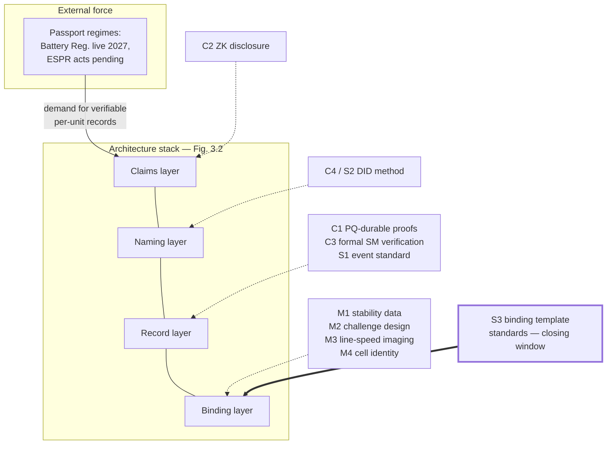

# Future Directions and Open Research Problems

## What This Chapter Covers

A monograph should end by making itself obsolete: this chapter assembles the open
problems flagged throughout the book into a research agenda, organized by the
communities that would have to do the work — measurement science, cryptographic
systems, standards bodies, and the regulatory-economic interface. Problems are
stated with their location in the book, what is known, what is missing, and what
a solution would look like, because an agenda item without success criteria is a
sentiment. The chapter closes with the integration outlook: how this
architecture meets the digital product passport programs that are, at time of
writing, the strongest real-world force pulling it into existence.

## 14.1 Measurement Science

**M1 — Long-horizon stability of structural fingerprints** (§6.8-1, the field's
single most important open problem). *Known:* accelerated aging and short
longitudinal series support grain-texture stability under thermal cycling and
mechanical load; crack networks demonstrably evolve. *Missing:* twenty-year
longitudinal template data on fielded modules under real climates — data that
can only be produced by starting now. *Success:* published false-accept/
false-reject curves as a function of fleet age and climate zone, from
instrumented cohorts (the pilot's 6,300-module Tier-2 sample is one such cohort;
it needs siblings in other climates). The supersession mechanism (§6.4) hedges
the architecture against an unfavorable answer, but the answer determines
whether re-enrollment is decadal maintenance or annual burden — an
order-of-magnitude economic difference.

**M2 — Inversion-robust challenge design** (§6.8-2). *Known:* field-to-current
inversion is ill-posed; regularization choices affect template features.
*Missing:* a challenge-space design provably robust to inversion ambiguity — the
adversarial formulation (can an attacker exploit the null space?) has not been
posed formally. *Success:* a published adversarial analysis with bounds, in the
style the PUF literature eventually developed for its own modeling attacks.

**M3 — Line-speed wide-field quantum imaging** (§6.8-3). An instrument-
engineering race with identified paths (wide-field NV arrays, parallel tiles).
*Success:* seconds-per-module full-area mapping at factory takt, at a station
cost commensurate with existing EL cells. Progress here moves Tier 2 from
sampled to universal, which restructures §6.7's economics.

**M4 — Cell-level battery identity** (§12.2, the hardest binding problem left).
*Known:* impedance and formation signatures exist but fail stability (R2) or
field feasibility (R6) today. *Missing:* a passive electrochemical or structural
anchor that survives cycling and is measurable through the pack. *Success:* a
binding modality passing Table 6.2 for cells — which would close the
repackaging-fraud channel that pack-level manifests only attribute. Thin-film
and perovskite PV (§6.8-5) belong in this cluster too: their defect
phenomenology is younger than the assets this framework protects.

## 14.2 Cryptographic and Systems Research

**C1 — Succinct proofs with thirty-year verifiability** (§7.4, §9.1). Validity
rollups compress consortium load, but proof systems age faster than assets:
circuit freezes conflict with schema evolution, and several constructions rest
on assumptions Chapter 9 would not certify for three decades. *Success:*
hash-based (PQ-conservative) proof systems with practical re-proving pipelines —
so that P1-style re-anchoring can *re-prove* old batches under new systems, the
rollup analog of Section 9.4.

**C2 — Zero-knowledge selective disclosure over evidence DAGs** (§10.2-3).
Field-level VC disclosure exists; what diligence actually needs is *graph-level*
predicates — "this asset's condition chain satisfies the insurer's policy" —
proven without revealing the chain. *Success:* practical ZK policy evaluation
over the §5.4 DAG structure, PQ-migratable per C1. Until then, the pilot's
covenant-plus-access-control posture (§11.2) is the honest state of the art.

**C3 — Formal verification of lifecycle state machines** (§8.5-F8). The
contracts are small by design; they should be *provably* small — machine-checked
correspondence between the Chapter 5 schema, the deployed contract, and the
time-contextual verification rules of §9.4-P2. The state-machine restriction
makes this tractable in a way general contract verification is not; it is
low-hanging fruit for the formal-methods community.

**C4 — Succession-complete DID methods** (§3.5). Controller succession,
supersession chains, and algorithm-policy references exist in this book as
schema conventions; they should exist as a standardized DID method for
non-agentive physical subjects, with a resolution story that survives
institutional churn (the §1.3 problem, one level up). This item sits on the
boundary with standards work, where it continues as S2.

## 14.3 Standardization Gaps

The book's repeated finding (§11.7-2, §12.5) is that the architecture's
components standardize bottom-up except one layer, and Table 14.1 puts the
whole landscape in one view.

**Table 14.1** Standardization state of the architecture's layers.

| Layer | Existing base | Gap | Natural venue |
|---|---|---|---|
| S1 Event envelope & lifecycle vocabulary | This book's schema; event-sourcing practice | No sector standard; passport acts define *data*, not *events* | IEC TC82/TC120 with ISO TC307 |
| S2 Asset DID method & succession | W3C DID/VC | Non-agentive subjects, succession, longevity (C4) | W3C + ISO TC307 |
| S3 **Binding templates & thresholds** | **None** | **Cross-vendor template formats, similarity metrics, FA/FR reporting, challenge protocols** | IEC TC82 (PV), TC21 (batteries); metrology institutes |
| S4 Passport projections | Battery Reg. Annex XIII; ESPR acts pending | PV delegated act not yet fixed; event-to-passport mappings ad hoc | European Commission + CEN/CENELEC |
| S5 Verification practice | §6.6 workflow; ISO 17025 culture | Accreditation scheme for verifiers; sampling-design norms | ILAC/national accreditation bodies |

S3 is the entry this chapter exists to underline. Binding verification is where
the whole construction touches physical truth, and it has *no* standards
activity: no common template format, no agreed similarity metrics, no
false-accept reporting convention, no interoperable challenge protocol. The
window matters (§12.5): fleets enrolling now under proprietary formats create
switching costs that will entrench whatever ships first, and the difference
between an open metrological standard and a de facto vendor format at this layer
is the difference between an evidence infrastructure and a franchise. The
constructive proposal: treat binding templates as *metrology*, not software —
the accredited-calibration machinery of §4.5 Rule 3 already imports the right
institutions, and national metrology institutes have exactly the standing to
host reference template formats and proficiency testing. That is a campaign a
research community can start; this book is, in part, its opening brief.

## 14.4 The Passport Convergence, and the Integration Outlook

Every thread of Part IV pulls toward the same near-term configuration, worth
stating as a forecast with its assumptions visible. The EU battery passport
(live obligations from 2027) and the ESPR delegated acts (PV modules a named
candidate) are creating, by law, per-unit lifecycle records with tiered access —
the *demand side* of this book's architecture, minus verification. The
architecture's *supply side* — anchored events, instrument attestation,
binding — is the difference between passports as self-declared paperwork and
passports as evidence (§12.2). The integration outlook, then: **passport
regimes adopt verifiability incrementally, field by field**, beginning where
fraud is expensive and attestation is cheap (SoH declarations, recycled-content
mass balances, commissioning dates), with the three-zone topology (§10.1) as
the natural implementation of the regulations' access tiers and the federated
consortium pattern (§7.4, §10.4, §12.5) as the deployment shape across
jurisdictions. The assumptions: that delegated acts specify data models open
enough to project onto (S4), and that at least one significant market's
regulator accepts anchored attestation as satisfying documentary requirements —
the S4 rehearsal's uncontested ledger extracts (§11.3) are the first, small
evidence on that question.

**Figure 14.1** The research agenda mapped onto the architecture stack, with the
passport regimes as the external force. Bold border marks S3, the gap with a
closing window.

## 14.5 Closing

This book opened with an engineer unable to answer a simple question — *is this
the module the paperwork describes?* — and has spent fourteen chapters building
the machinery for a better answer: identity anchored in the physics
manufacturing cannot control, records ordered and frozen by consensus among
parties who distrust one another, verification decomposed into steps whose
residual risks are named and priced, and the whole construction designed to
outlive its own algorithms, vendors, and authors. None of it is finished. The
stability data does not yet span a service life; the binding standards do not
exist; the cell-level problem is open; the governance patterns have one pilot's
worth of contact with reality. But the direction of travel is set by forces
larger than this book — regulation demanding per-unit truth, markets pricing
the absence of it, and instruments steadily closing the gap between what matter
is and what records claim. The engineer on that warehouse floor deserves a
better answer than trust. The work assembled here is offered as a start on one,
and the problems of this chapter are offered to the readers who will finish it.

## References and Further Reading

1. Regulation (EU) 2023/1542 (Battery Regulation) and Regulation (EU) 2024/1781
   (ESPR) — the passport instruments of §14.4.
2. Rührmair, U., et al. "Modeling Attacks on Physical Unclonable Functions." In
   *Proceedings of the 17th ACM Conference on Computer and Communications
   Security (CCS '10)*, 237–249 (the adversarial-analysis template for M2).
3. Ben-Sasson, E., et al. "Scalable, Transparent, and Post-Quantum Secure
   Computational Integrity." IACR ePrint 2018/046 (C1's starting point).
4. World Wide Web Consortium. *Decentralized Identifiers (DIDs) v1.0* (C4/S2
   base). W3C, 2022.
5. International Organization for Standardization. *ISO/TC 307: Blockchain and
   Distributed Ledger Technologies* — published and in-progress work programme
   (S1/S2 venue).
6. CEN-CENELEC Joint Technical Committee 24, *Digital Product Passport —
   Framework and System* (standardization venue for S4; work programme in
   progress at time of writing).

\newpage
