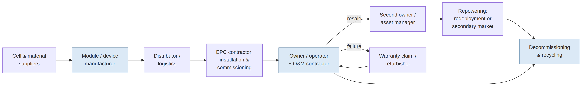
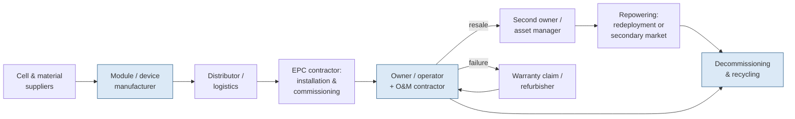

# Figure 1.1

**Lifecycle of a distributed energy asset and the custody transitions at which records are created, transferred — and lost.**

Source chapter: `ch01-the-asset-identity-problem.md`

## Mermaid source

