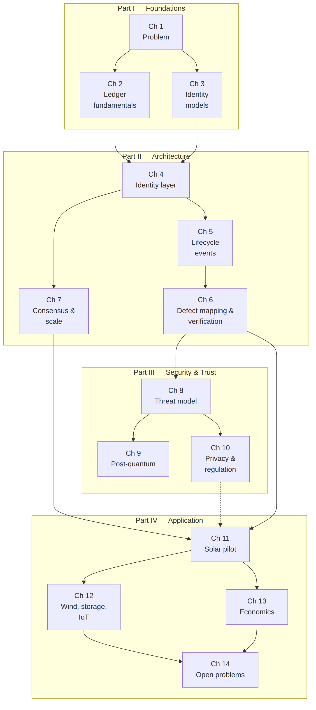
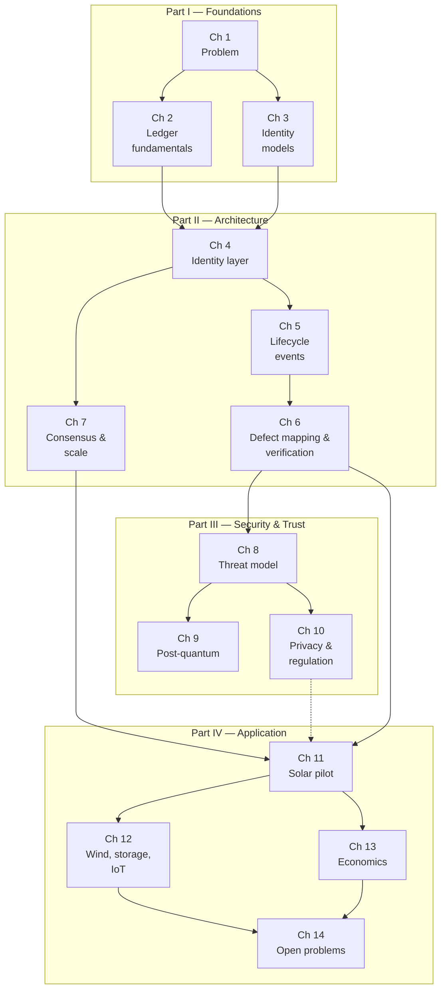

# Figure 1.2

**Chapter dependency map. Solid arrows are strong prerequisites; the dashed arrow indicates helpful but optional background.**

Source chapter: `ch01-the-asset-identity-problem.md`

## Mermaid source

