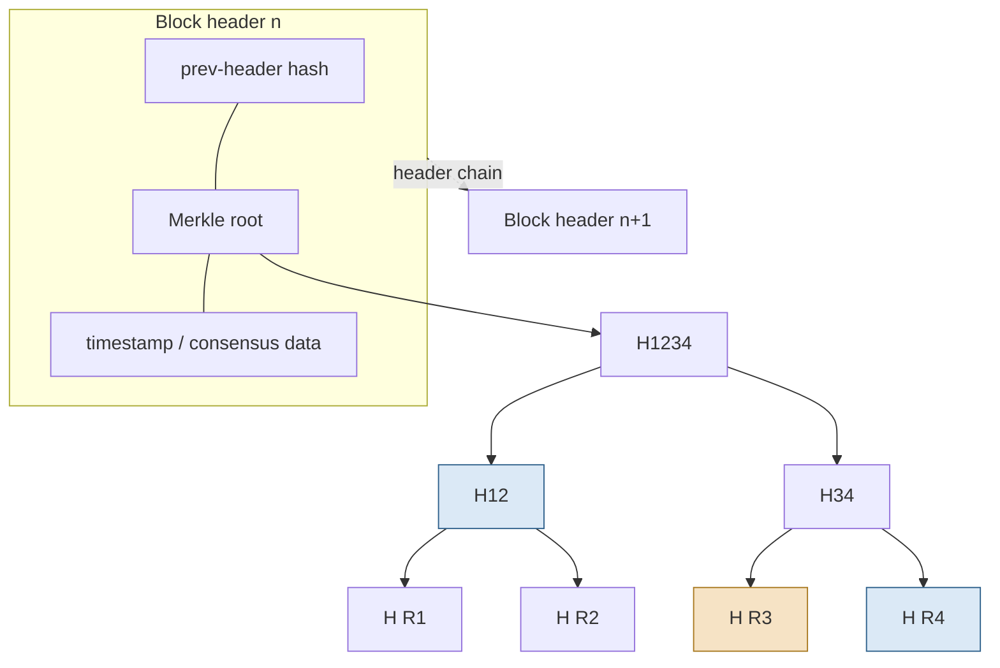

# Figure 2.1

**Block structure and a Merkle inclusion proof. To prove record R3 is in the block, the prover supplies R3 with the sibling hash H(R4) and the uncle hash H12; the verifier recomputes the root and compares it with the header.**

Source chapter: `ch02-blockchain-fundamentals.md`

## Mermaid source

