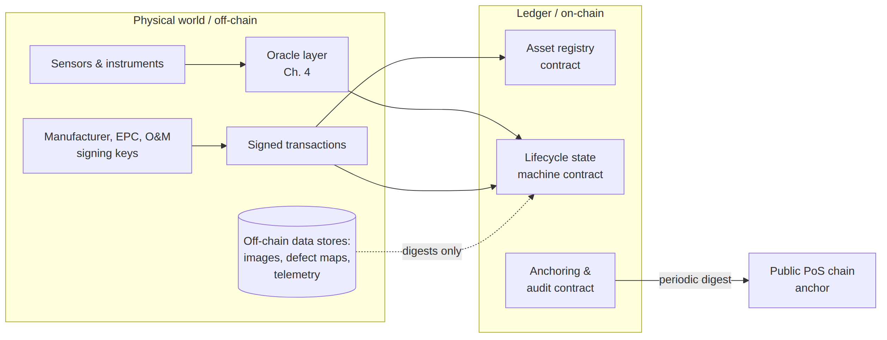
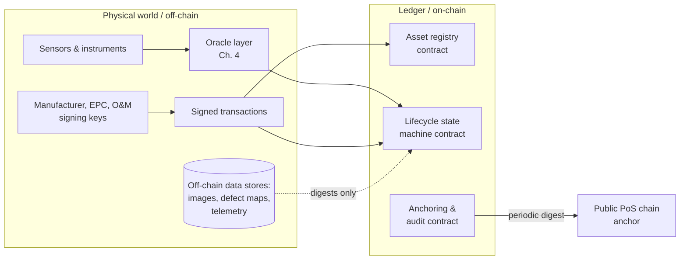

# Figure 2.2

**The boundary between the deterministic on-chain world and the physical world. Everything crossing the boundary passes through oracles and signed transactions — the trust-critical interface of the entire architecture.**

Source chapter: `ch02-blockchain-fundamentals.md`

## Mermaid source

