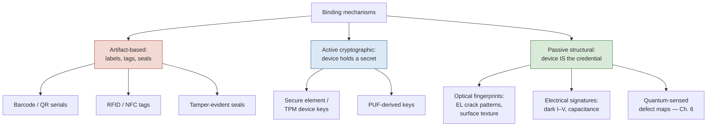
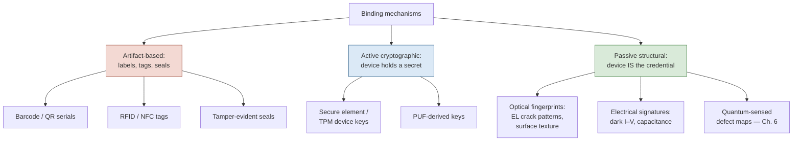

# Figure 3.1

**A taxonomy of binding mechanisms for physical assets. The right-hand branch — passive structural fingerprints — is where Chapter 6's contribution sits.**

Source chapter: `ch03-physical-asset-identity-models.md`

## Mermaid source

