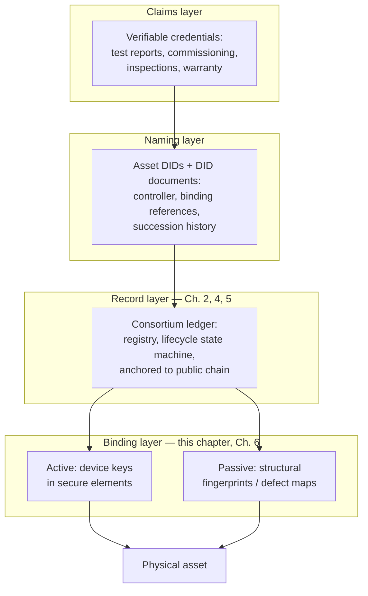

# Figure 3.2

**The layered identity stack assumed throughout Parts II–IV. Standards supply the naming and claim formats; the ledger supplies ordering and permanence; the binding layer attaches the whole construction to matter.**

Source chapter: `ch03-physical-asset-identity-models.md`

## Mermaid source

