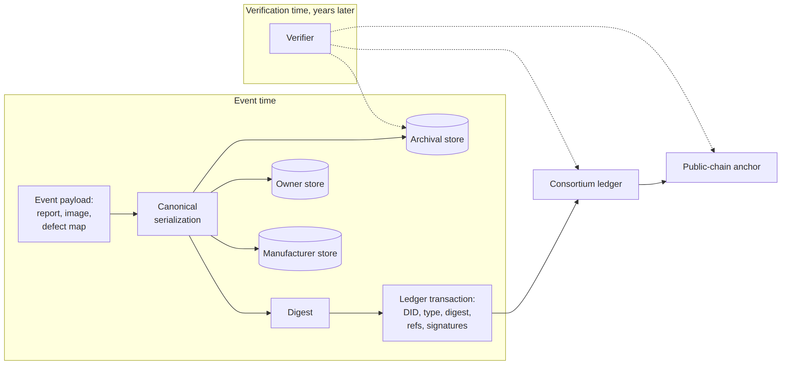
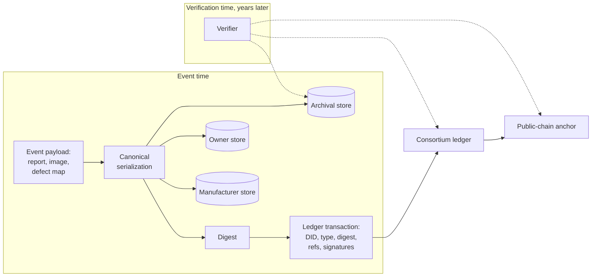

# Figure 4.1

**The partition and its verification path. Solid arrows are the write path at event time; dashed arrows are the read/verification path years later.**

Source chapter: `ch04-designing-the-identity-layer.md`

## Mermaid source

