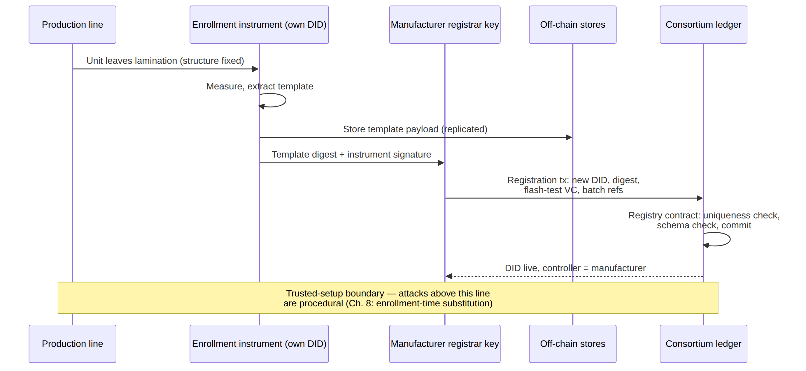

# Figure 4.2

**Manufacture-time issuance for a passive asset. The gray band marks the trusted-setup boundary: everything below it is cryptographically verifiable ever after; everything above it is procedural and must be defended procedurally.**

Source chapter: `ch04-designing-the-identity-layer.md`



## Mermaid source

```mermaid
sequenceDiagram
    participant P as Production line
    participant I as Enrollment instrument (own DID)
    participant M as Manufacturer registrar key
    participant S as Off-chain stores
    participant L as Consortium ledger
    P->>I: Unit leaves lamination (structure fixed)
    I->>I: Measure; extract template
    I->>S: Store template payload (replicated)
    I->>M: Template digest + instrument signature
    M->>L: Registration tx: new DID, digest,<br>flash-test VC, batch refs
    L->>L: Registry contract: uniqueness check,<br>schema check, commit
    L-->>M: DID live; controller = manufacturer
    Note over P,L: Trusted-setup boundary — attacks above this line<br>are procedural (Ch. 8: enrollment-time substitution)
```
