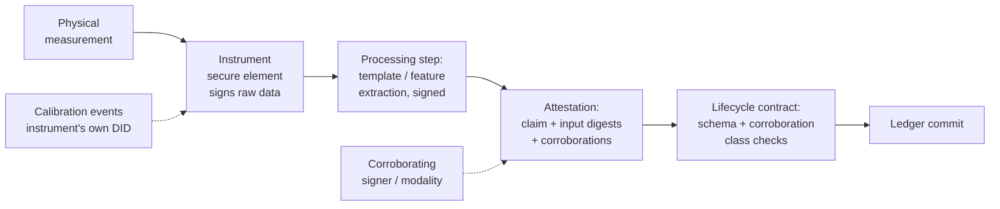

# Figure 4.3

**The oracle layer as a computation provenance chain. Every arrow carries a signature; every box references its input digests.**

Source chapter: `ch04-designing-the-identity-layer.md`

## Mermaid source

