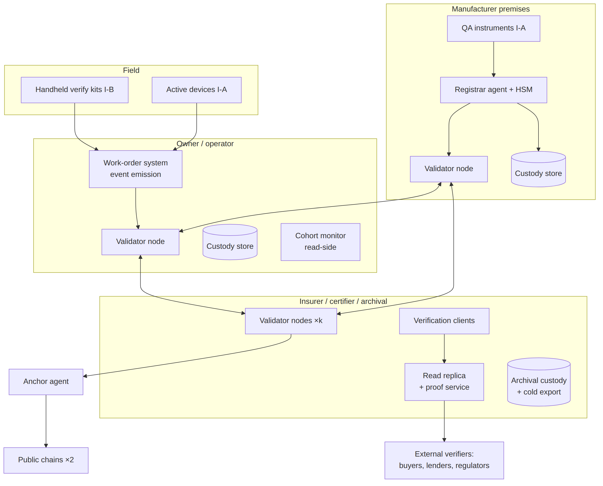
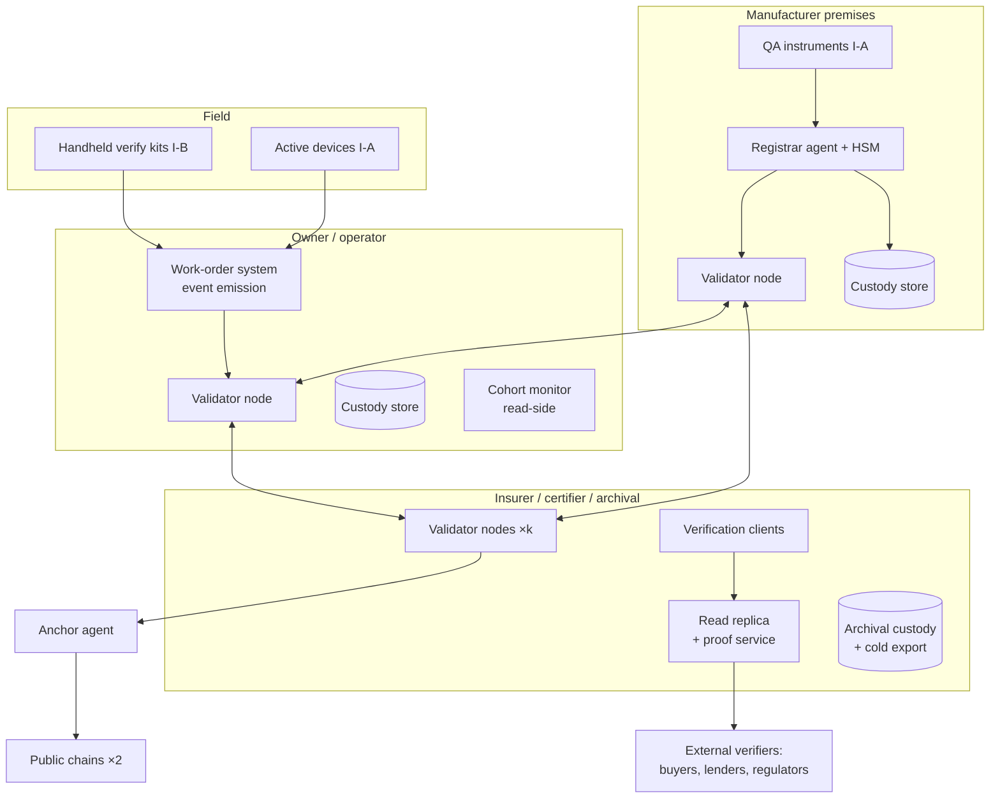

# Figure 4.4

**Deployment topology for a national-scale identity layer. Every organization runs the components in its own box; nothing in the architecture requires shared infrastructure beyond the protocols.**

Source chapter: `ch04-designing-the-identity-layer.md`

## Mermaid source

