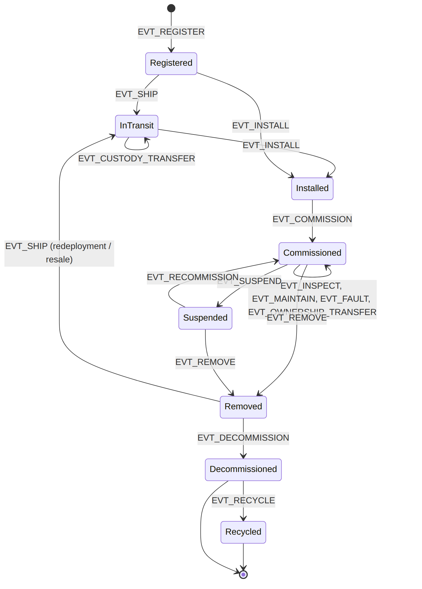
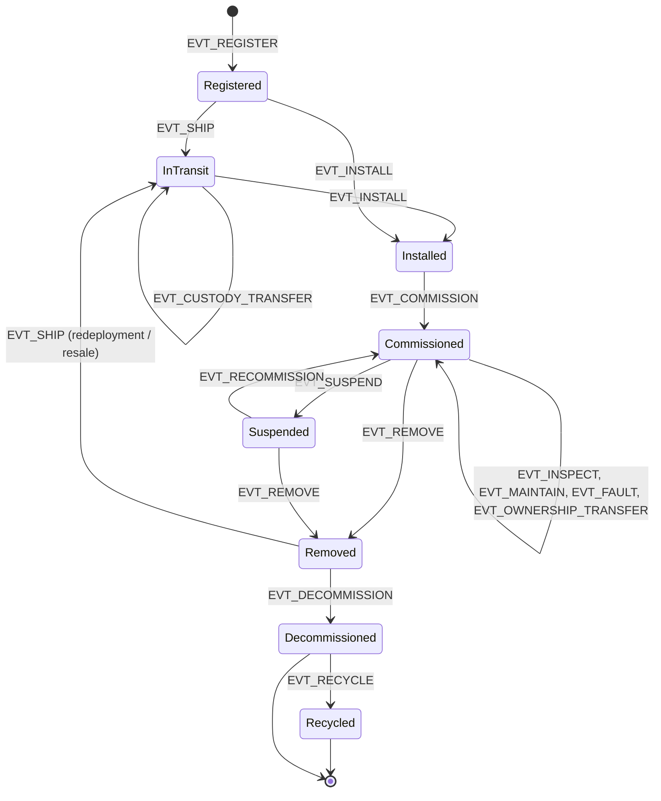

# Figure 5.1

**Asset lifecycle state machine. Every transition is effected only by a ledger event of the named type; the state-machine contract rejects events whose transition is not an arrow in this diagram.**

Source chapter: `ch05-lifecycle-event-modeling.md`

## Mermaid source

