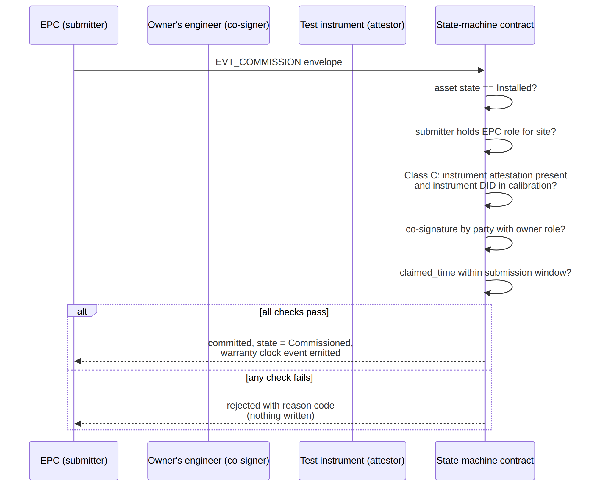

# Figure 5.2

**Write-time enforcement sequence for `EVT_COMMISSION`.**

Source chapter: `ch05-lifecycle-event-modeling.md`



## Mermaid source

```mermaid
sequenceDiagram
    participant EPC as EPC (submitter)
    participant OE as Owner's engineer (co-signer)
    participant INS as Test instrument (attestor)
    participant SC as State-machine contract
    EPC->>SC: EVT_COMMISSION envelope
    SC->>SC: asset state == Installed?
    SC->>SC: submitter holds EPC role for site?
    SC->>SC: Class C: instrument attestation present<br>and instrument DID in calibration?
    SC->>SC: co-signature by party with owner role?
    SC->>SC: claimed_time within submission window?
    alt all checks pass
        SC-->>EPC: committed; state := Commissioned;<br>warranty clock event emitted
    else any check fails
        SC-->>EPC: rejected with reason code<br>(nothing written)
    end
```
