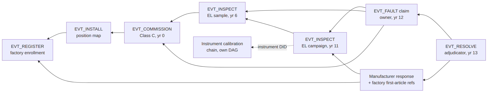
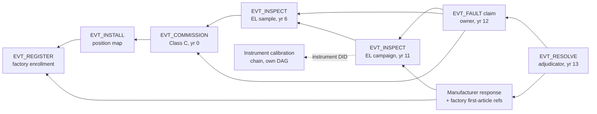

# Figure 5.3

**A fragment of one module's evidence DAG, as a warranty adjudicator would traverse it. Boxes are events; arrows are `prior_refs` edges (each arrow points from an event to evidence it relies on).**

Source chapter: `ch05-lifecycle-event-modeling.md`

## Mermaid source

