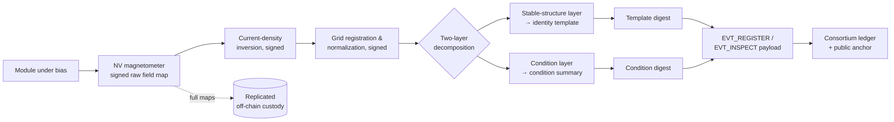
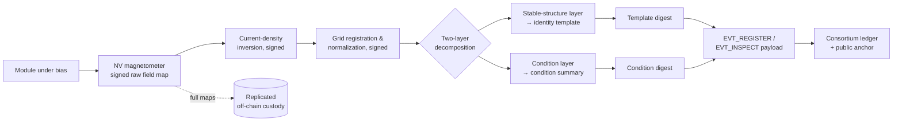

# Figure 6.1

**The enrollment pipeline. Everything to the right of the instrument is a signed computation chain; the two-layer decomposition feeds identity and condition records separately.**

Source chapter: `ch06-structural-defect-mapping.md`

## Mermaid source

