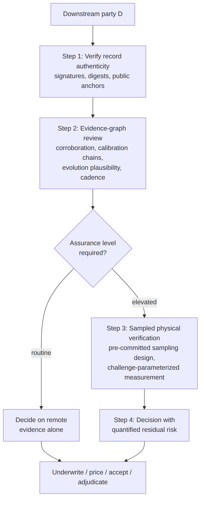
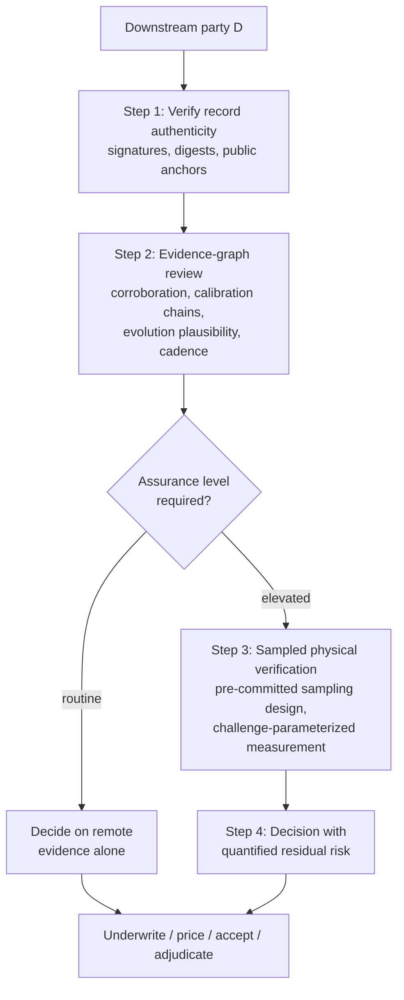

# Figure 6.2

**The four-step verification workflow. Steps 1–2 are remote and cheap; Step 3 is the proportional escalation of Section 3.6.**

Source chapter: `ch06-structural-defect-mapping.md`

## Mermaid source

