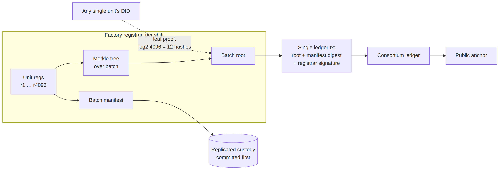
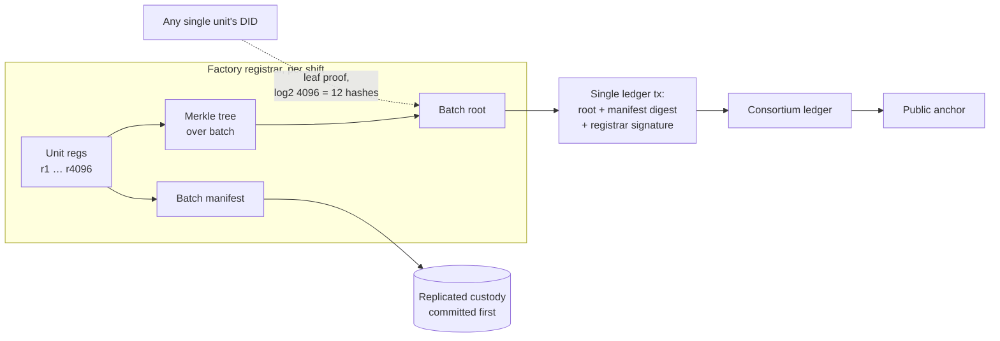

# Figure 7.1

**Merkle-aggregated registration. One consensus round commits a production batch; each unit remains individually provable.**

Source chapter: `ch07-consensus-and-scalability.md`

## Mermaid source

