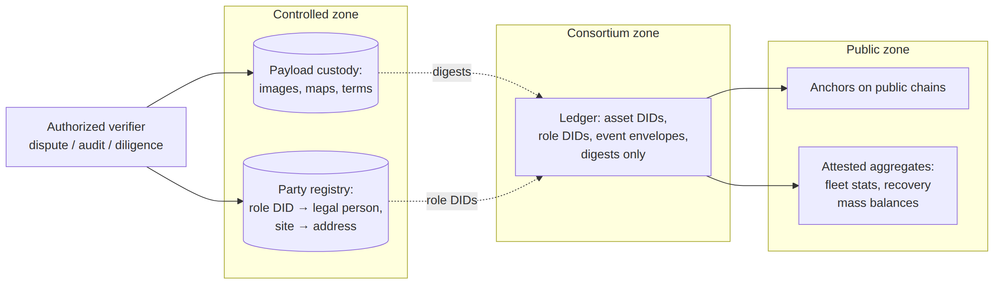
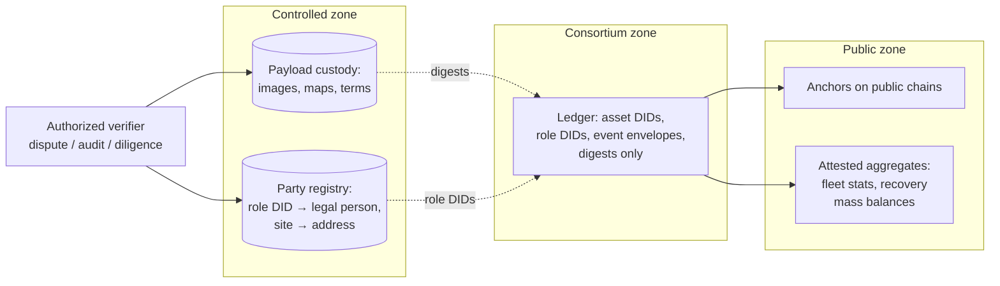

# Figure 10.1

**The privacy architecture: three zones with one-way evidential references. Public verifiability flows left; identity resolution requires authorization flowing right.**

Source chapter: `ch10-privacy-governance-regulation.md`

## Mermaid source

