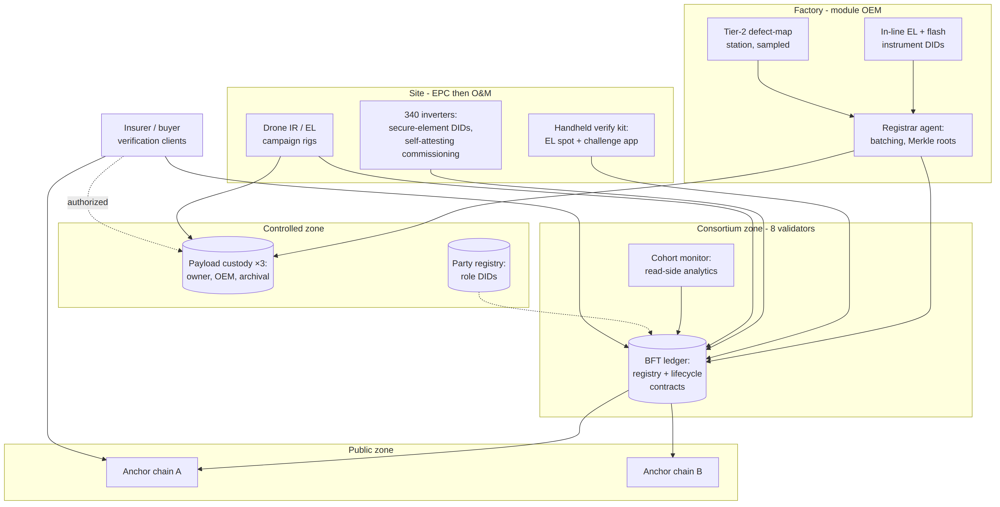
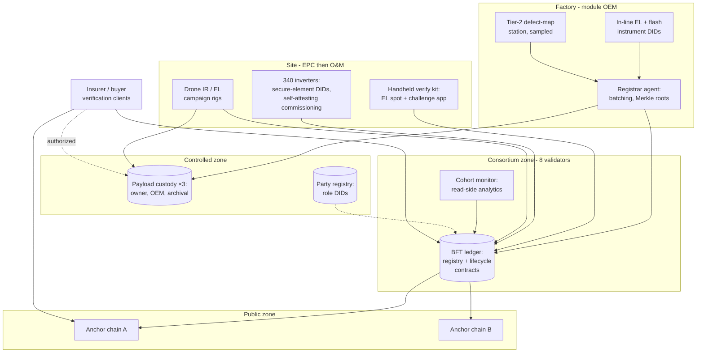

# Figure 11.1

**Pilot system diagram. Shaded components are the three zones of Figure 10.1; arrows show the dominant data flows, quantified in Section 11.2.1. Every organization hosts its own boxes on its own infrastructure — the validator set spans four hosting arrangements and three jurisdictions, per Section 4.7's anti-correlation rule.**

Source chapter: `ch11-solar-pilot-case-study.md`

## Mermaid source

