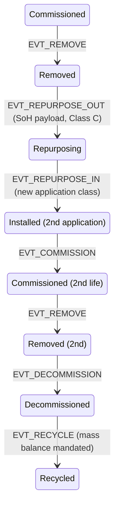

# Figure 12.1

**Battery lifecycle extension to the Chapter 5 state machine. Unshaded states are inherited unchanged from Figure 5.1; the figure shows only the extension's neighborhood, since everything upstream of the first `Removed` is the base machine verbatim.**

Source chapter: `ch12-extending-the-model.md`

## Mermaid source

