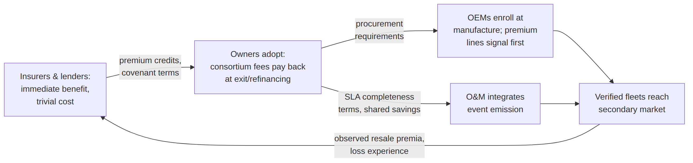
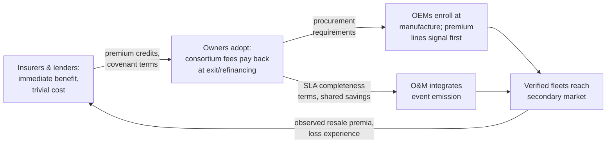

# Figure 13.1

**The adoption loop the incidence table implies: pricing levers, not mandates, carry the mechanism from first movers to the value chain.**

Source chapter: `ch13-economic-and-market-implications.md`

## Mermaid source

