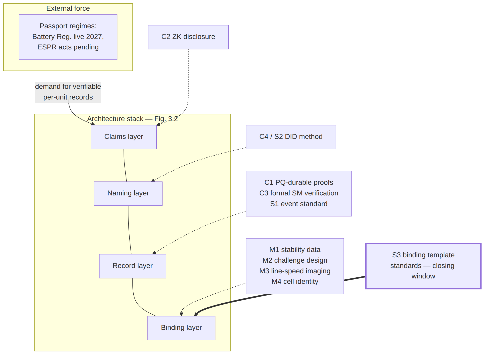
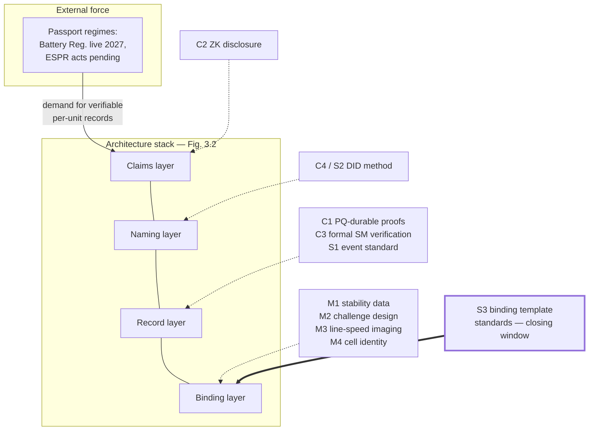

# Figure 14.1

**The research agenda mapped onto the architecture stack, with the passport regimes as the external force. Bold border marks S3, the gap with a closing window. Read bottom-up, the figure is the book's argument in miniature: the M-series keeps the binding layer honest, the C-series and S1 keep the record layer durable and interoperable, the naming and claims layers ride mostly-solved standards with succession amendments, and the external demand arrives at the top — so the stack's health depends most on the layers furthest from where the regulatory attention lands, which is the asymmetry this chapter exists to correct.**

Source chapter: `ch14-future-directions.md`

## Mermaid source

